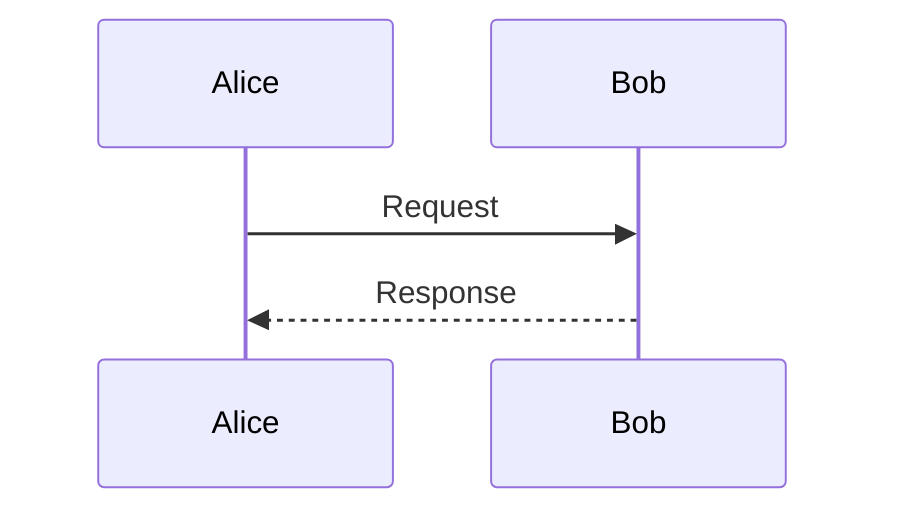

# How to Contribute

Thank you for your interest in contributing to this repository! 🎉

This document provides guidelines and conventions to follow when contributing, with the goal of ensuring clarity, consistency, and high-quality documentation across the project.

## Table of Contents

* [General Principles](#general-principles)
* [Files and Markup Language](#files-and-markup-language)
* [Structure and Style](#structure-and-style)
* [Syntax for Artifacts' Format](#syntax-for-artifacts-format)
  * [Nested Objects](#nested-objects)
* [References and Citations](#references-and-citations)
* [Syntax for Diagrams](#syntax-for-diagrams)
* [Terminology and Definitions](#terminology-and-definitions)
* [Examples and Non‑Normative Content](#examples-and-non-normative-content)
* [Pull Requests](#pull-requests)
* [Reviews and Feedback](#reviews-and-feedback)

---

## General Principles

* Be clear, concise, and precise.
* Prefer normative and unambiguous language (e.g., *MUST*, *SHOULD*, *MAY*) where appropriate.
* Keep changes focused and scoped; avoid mixing unrelated edits in the same pull request.
* When in doubt, follow existing patterns in the repository.

---

## Files and Markup Language

* All documentation files MUST be written in **Markdown**.
* Use GitHub-flavored Markdown features where appropriate.
* Follow [GitHub's official documentation](https://docs.github.com/en/get-started/writing-on-github/getting-started-with-writing-and-formatting-on-github/basic-writing-and-formatting-syntax) for syntax and formatting.

---

## Structure and Style

* Use clear, hierarchical headings (`#`, `##`, `###`, …).
* Headings SHOULD follow a logical progression without skipping levels.
* Use inline code formatting (`` `code` ``) for:

  * Parameter names
  * Keywords
  * Literal values
* Use bullet lists for enumerations and requirements.

---

## Syntax for Artifacts' Format

When describing the format of an artifact (e.g., Access Certificates, Registation Certificates, Trusted Lists), parameters MUST be documented using a Markdown table with **four columns**:

| Column          | Description                                                                |
| --------------- | -------------------------------------------------------------------------- |
| **Parameter**   | Name of the parameter. Use inline code formatting.                         |
| **Type**        | Parameter type (e.g., `string`, `int`, `boolean`, `array`, `JSON object`). |
| **Description** | Human-readable description of the parameter.                               |
| **Reference**   | Link to the specification or standard from which the parameter originates. |

In addition, [non-normative examples](#examples-and-non-normative-content) SHOULD be provided.

### Nested Objects

* If a parameter is a **JSON object**, it MUST be documented at a high level in the main table.
* A **separate table** MUST then be created immediately afterward to describe the object's internal structure.

### Example

Markdown syntax:

```markdown
| Parameter | Type | Description | Reference |
| :-------- | :--- | :---------- | :-------- |
| `iss` | *string* | Identifier of the principal that issued the JWT. | [RFC 7519 §4.1.1](https://www.rfc-editor.org/rfc/rfc7519#section-4.1.1) |
```

Rendered content:

| Parameter | Type     | Description                                      | Reference                                                               |
| :-------- | :------- | :----------------------------------------------- | :---------------------------------------------------------------------- |
| `iss`     | *string* | Identifier of the principal that issued the JWT. | [RFC 7519 §4.1.1](https://www.rfc-editor.org/rfc/rfc7519#section-4.1.1) |

---

## References and Citations

* Always prefer **authoritative sources** (e.g., RFCs, standards bodies, official specifications).
* Links SHOULD point to stable versions of documents when available.
* When referencing an external specification, include section numbers where applicable.

---

## Syntax for Diagrams

All diagrams MUST be created using **Mermaid** and embedded directly in Markdown.

* External images SHOULD be avoided for diagrams.
* Mermaid code MUST be included using fenced code blocks with the `mermaid` language identifier.

### Required Syntax

````markdown
```mermaid
Diagram code
```
````

This ensures diagrams are automatically rendered by GitHub.

### Example

Markdown syntax:

````markdown

````

Rendered content:


---

## Terminology and Definitions

* Define key terms on first use.
* Use consistent terminology throughout the document set.
* Avoid synonyms for the same concept unless explicitly defined.

---

## Examples and Non‑Normative Content

* Provide examples where they improve clarity.
* Clearly label examples as **non‑normative**.
* Keep examples minimal and focused on the concept being illustrated.

---

## Pull Requests

* Clearly describe **what** the change does and **why** it is needed.
* Reference relevant issues or discussions when applicable.
* Ensure documentation builds and renders correctly before submitting.

---

## Reviews and Feedback

* Be respectful and constructive when giving feedback.
* Reviews SHOULD focus on clarity, correctness, and consistency.
* Authors are encouraged to iterate based on review comments.

---

Thank you for helping improve this project!
