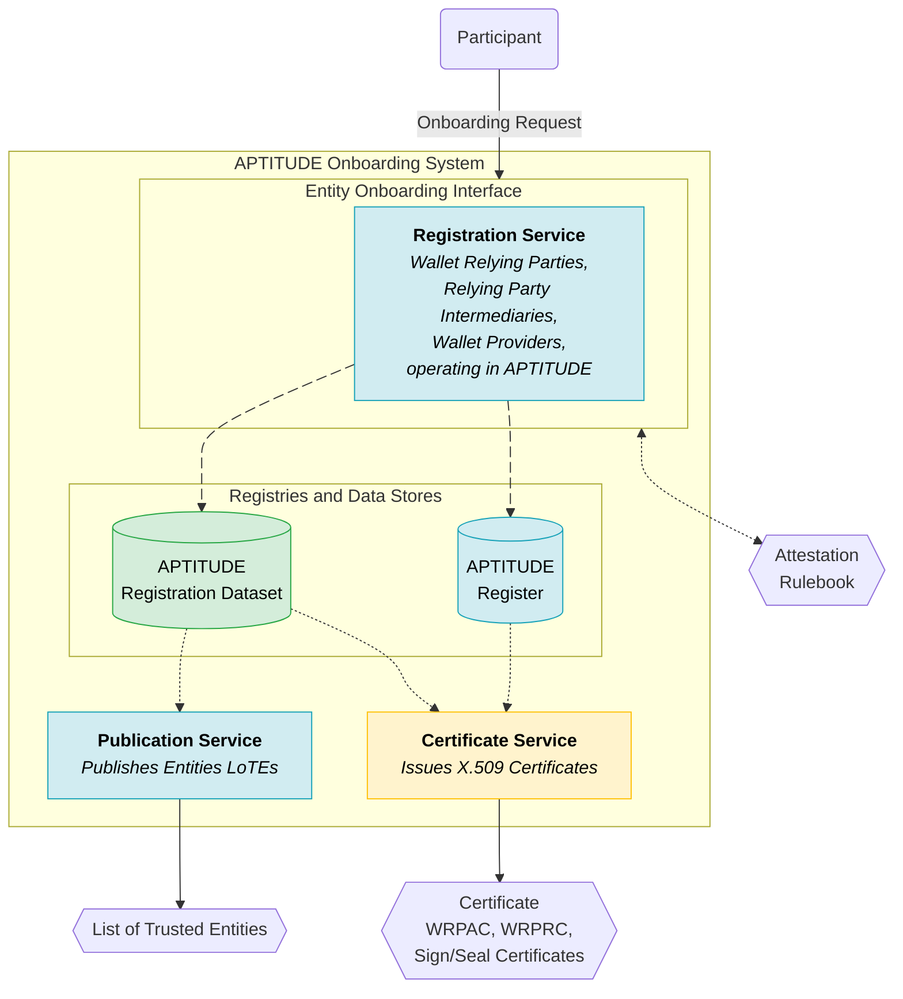
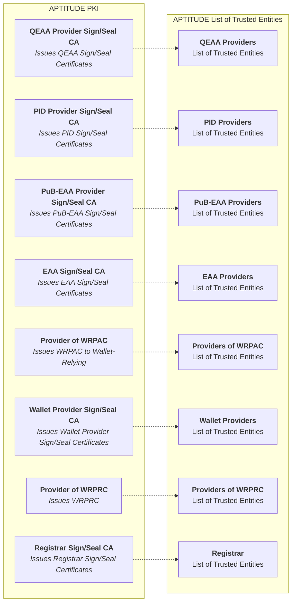

# 1\. APTITUDE Trust Framework Implementation Profiles

This document specifies the core architectural profiles for trust framework implementation within the APTITUDE Large-Scale Pilot (LSP). It defines the necessary trust architecture, the essential trust artifacts exchanged among pilot entities, and the high-level evaluation processes and precise trust checks to be executed during issuance and presentation flows. These profiles are compliant, unless otherwise specified, to the EUDI Wallet Architecture Reference Framework (ARF), its Technical Specifications, the relevant ETSI standards, and the other standards defined in the [Reference section](../docs/sections/references.md), adapted to the pilot context.

**Document roadmap:**

- [Introduction](#11-introduction) frames the scope, objectives, ARF requirements and constraints, and assumptions.
- [Trust Artifact Taxonomy](#12-trust-artifact-taxonomy) establishes the trust artifact vocabulary.
- [Trust Processes Taxonomy](#13-trust-processes-taxonomy) defines the trust evaluation processes.
- [Pilot Trust Infrastructure](#14-pilot-trust-infrastructure) describes the pilot trust infrastructure, i.e., what WP2 builds to support the pilots.
- [Trust Test Cases](#15-trust-test-cases) describes the horizontal runtime and operational checks executed across the pilots.

## 1.1. Introduction

### 1.1.1. Status of This Section and Normative Language

This section is **normative** for APTITUDE LSP implementations. The key words **"SHALL"**, **"SHALL NOT"**, **"REQUIRED"**, **"SHOULD"**, **"SHOULD NOT"**, **"RECOMMENDED"**, **"MAY"**, and **"OPTIONAL"** in this document are to be interpreted as described in **RFC 2119**.

### 1.1.2. Scope and Structure of the Profiles

The profiles in this document SHALL specify:

- **(1)** the trust artifacts consumed or exchanged by pilot entities;
- **(2)** the trust evaluation processes applied to these artifacts;
- **(3)** the precise trust checks executed during issuance and presentation flows.

They SHALL NOT prescribe internal implementation architectures and choices, deployment policies, operational policies (e.g., incident management, auditing, dispute resolution), or non-trust application-layer logic. Detailed component and process specifications, service API definitions, and artifact profiles are provided in subsequent sections of this document and in companion APTITUDE deliverables.

### 1.1.3. Pilot Objectives

The trust specifications are derived from use-case needs and fulfill the following objectives:

- **Pilot business use cases.** The APTITUDE pilot exists to demonstrate EUDIW-aligned business scenarios. Trust requirements flow from use-case needs. The APTITUDE Trust Framework Implementation Profiles are written to satisfy the trust demands of piloted use cases, not to prescribe a universal trust architecture in the abstract.
- **Trust framework's functional responsibility.** Given those use cases, the APTITUDE Trust Framework Implementation Profiles must provide:
    - the trust artifacts ([Trust Artifact Taxonomy](#12-trust-artifact-taxonomy)),
    - the evaluation processes and the list of issuance and presentation trust checks that allow flows to proceed with verifiable trust ([Trust Processes Taxonomy](#13-trust-processes-taxonomy)), and
    - the list of Components and Services that are to be implemented in T2.3.
    This allows every entity in the pilot to be able to prove its identity, its authorization, and verify the authenticity and integrity of the attestation being exchanged.
- **Pragmatic constraints.** The APTITUDE Trust Framework Implementation Profiles acknowledge the specific constraints of the APTITUDE piloting ecosystem ([ARF Requirements and APTITUDE Constraints](#114-arf-requirements-and-aptitude-constraints)) and leverage the assumptions detailed in [Assumptions and Boundaries](#115-assumptions-and-boundaries) to deliver a functional trust infrastructure that can support piloting use cases with a fully functional trust framework.

### 1.1.4. ARF Requirements and APTITUDE Constraints

This section highlights the main high-level deviations of the APTITUDE ecosystem from the ARF trust framework. These deviations are not arbitrary choices but are dictated by the constraints described in [Pilot Objectives](#113-pilot-objectives). The following table details such deviations:

| # | Theme | EUDIW responsibility | APTITUDE constraints |
|---|---|---|---|
| 1 | **Publication of LoTE** | EU Commission responsibility | Missing corresponding role in APTITUDE |
| 2 | **Registration Process** | MS responsibility | Missing corresponding role in APTITUDE |
| 3 | **Notification Process** | MS & EU Commission responsibility | Missing corresponding role in APTITUDE |
| 4 | **List of Trusted Entities, Trusted List and List of Trusted Lists** | MS & EU Commission responsibility for publication/management | Missing corresponding entity for publication/management |
| 5 | **Authentic Sources** | Specific Entity within MS | Missing corresponding role in APTITUDE |
| 6 | **Catalogue of Attestation** | EU Commission responsibility for publication/management | Missing corresponding role in APTITUDE |
| 7 | **Entity Lifecycle Management** | Supervisory Body responsibility | Missing corresponding role in APTITUDE |
| 8 | **Certification Schemes** | Supervisory Body responsibility | Missing corresponding role in APTITUDE |
| 9 | **WRPAC--WRPRC--Sign/Seal Certificate issuance** | MS responsibility | Missing corresponding role in APTITUDE |
| 10 | **publication of OJEU** | EU Commission responsibility | Missing corresponding role in APTITUDE |

### 1.1.5. Assumptions and Boundaries

Since the APTITUDE ecosystem does not feature Member States or EU Commission-type of actor deployed infrastructure, this section states the principles by which the APTITUDE Trust Framework Implementation Profiles address the gaps in [ARF Requirements and APTITUDE Constraints](#114-arf-requirements-and-aptitude-constraints) as follows:

| APTITUDE Decision | Addresses # |
|---|---|
| Pilot perimeter is limited to APTITUDE partners and beneficiaries | — |
| WP2 services fulfill the missing institutional roles (EU Commission, Registrar) with the services as specified in [Pilot Trust Infrastructure](#14-pilot-trust-infrastructure) | 1, 2, 3 |
| WP2 provides a single, simplified registration interface with self-declared attributes and entitlements by APTITUDE participants, without setting up dedicated administrative processes or certification scheme checks | 2, 8 |
| WP2 aggregates the registration information in a unique Register used for all entities | 2 |
| The WP2 managed onboarding services manage the operational processes (registration, notification, publication, certificate issuance) as described in [Pilot Trust Infrastructure](#14-pilot-trust-infrastructure) to set up the trust infrastructure given the pilot constraints | 2, 3 |
| The PKI architecture will not have a LOTL with the related TL; instead, it will feature a LoTE per entity type, including QEAA and EAA providers | 4 |
| WP2 acts as the sole LoTE provider; the certificate anchoring the various LoTEs will be published via GitHub | 4 |
| APTITUDE will not feature an Authentic Source mock-up and the related API | 5 |
| APTITUDE will not feature a Catalogue of Attestation, relying instead on the Attestation Rulebooks published on GitHub by the various WPs | 6 |
| APTITUDE will not feature an active management of entity lifecycles, and will instead check dedicated test cases for revocation as described in [Trust Test Cases](#15-trust-test-cases) | 7 |

## 1.2. Trust Artifact Taxonomy

This section introduces the trust artifacts that the profiles govern. Trust artifacts defined here are consumed by the trust evaluation processes ([Trust Processes Taxonomy](#13-trust-processes-taxonomy)) and are produced/managed by the infrastructure components described in [Pilot Trust Infrastructure](#14-pilot-trust-infrastructure).

**Note:** The term "trust artifact" in this section refers to the structured data objects exchanged or consulted during trust evaluation. Trust artifacts are distinct from the credentials (PIDs, PuB-EAAs, EAAs, QEAAs) whose authenticity they help verify.

### 1.2.1. Artifacts Consumed and Exchanged

The following table lists the trust artifacts defined in the profiles. For each, it indicates who produces it and where its data model is described in the companion specifications.

| Artifact | Producer | Reference |
|---|---|---|
| WRPAC | Provider of WRPAC (WP2 managed CA) | [WRPAC Profiles](../docs/topics/access-certificate.md) |
| WRPRC | Provider of WRPRC (WP2 managed CA) | [WRPRC Profiles](../docs/topics/registration-certificate.md) |
| Sign/Seal Certificates | Provider of Sign/Seal Certificates (WP2 managed CA) | [Sign/Seal Certificates Profile](../docs/topics/entity-end-certificate-profiles.md) |
| CRLs, OCSP | Provider of WRPAC and Sign/Seal Certificates (WP2 managed CA component) | [Revocation Mechanisms](../docs/topics/revocation-mechanisms.md) |
| TSL | Provider of WRPRC (WP2 managed CA component) | [Revocation Mechanisms](../docs/topics/revocation-mechanisms.md) |
| Trust Anchor Certificate | Self-signed WP2 managed CA | [Trust Anchor Certificate Profiles](../docs/topics/trust-anchor-certificate-profiles.md) |
| Register API | Registrar (WP2 managed service) | [Register API Profiles](../docs/api/register-api.md) |
| EDP | Attestation Providers (Self-managed issuance) | [EDP Profiles](/docs/topics/embedded-disclosure-policy.md) |
| List of Trusted Entities | LoTE Provider (WP2 managed service) | [LoTE Profiles](../docs/topics/trusted-list-and-list-of-trusted-lists.md) |
| WIA/KA | Wallet Provider | [TS03]; [CIR 2026/1731] |
| WIA/KA Status List Token | Wallet Provider | [TS03]; [CIR 2026/1731] |

## 1.3. Trust Processes Taxonomy

This section introduces the trust evaluation processes that the profiles specify, references the high-level trust checks for the issuance and presentation flows, and identifies shared sub-processes.

### 1.3.1. Issuance-Flow Trust Evaluation

The high-level sequence of trust checks executed during credential issuance can be found in [Trust checks during Issuance](../docs/topics/trust-checks-issuance.md).

### 1.3.2. Presentation-Flow Trust Evaluation

The high-level sequence of trust checks executed during credential presentation can be found in [Trust checks during Presentation](../docs/topics/trust-checks-presentation.md).

### 1.3.3. Shared Sub-Processes

The following table describes the common sub-processes that the various trust evaluation checks employ, which flows they are used in, and by whom.

| Process name | Scope | Flow usage | Used by |
|----|----|----|----|
| X509 Certificate Chain Validation | Validate X509 certificate chains for WRPACs, WRPRCs, Sign/Seal Certificates | Presentation/Issuance | PID Providers, Attestation Providers, Relying Parties, Wallet Units |
| Authorization Validation | Validation of the entity authorization profile via WRPRC or Register query | Presentation/Issuance | Wallet Units |
| LoTE Validation | Validate authenticity and integrity of a LoTE, to extract the relevant Trust Anchor therein | Presentation/Issuance | PID Providers, Attestation Providers, Relying Parties, Wallet Units |

## 1.4. Pilot Trust Infrastructure

This section maps with the services and components that WP2 will build within T2.3. The services implement the assumptions from [Assumptions and Boundaries](#115-assumptions-and-boundaries) and support the establishment of a trust infrastructure for the pilot. The components support the processes from [Trust Processes Taxonomy](#13-trust-processes-taxonomy) which handle the various artifacts from [Trust Artifact Taxonomy](#12-trust-artifact-taxonomy).

### 1.4.1. Pilot Operational Processes and Architectural Schemas

This section describes the high-level processes that WP2 will implement to set up the trust infrastructure needed for the piloting phase. For clarity purposes it also renders these processes in diagrammatic form.

The Onboarding process, further detailed in [Onboarding Process](#onboarding-process), allows participants to register to the APTITUDE Trust Framework and obtain the trust artifacts needed to run trustworthy pilot interactions with the other members. The Onboarding Process can be characterized by three different phases:

1. The entity submits its identity and authorization information to the Registration Service (e.g., organization name, role, entitlements, requested credentials, issued credentials) as specified. In accordance with the principles established in [Assumptions and Boundaries](#115-assumptions-and-boundaries), the Onboarding system SHALL NOT verify the identity of the onboardee according to [ETSI TS 119 461] or Art 6. of [CIR 2025/848] but SHALL only check that it is a member of the APTITUDE LSP and rely on the onboardee self-declaration for all the other information submitted.
2. The entity submits its technical configurations (e.g., necessary cryptographic material, endpoints) needed for the piloting and receives the X509 certificates needed for the piloting phase.
3. The WP2 operated Publication Service updates the relevant LoTE with the necessary subset of information provided by the onboardee.

The following diagram describes the Onboarding Services which SHALL be set up by APTITUDE.

The following diagram details the Trust Infrastructure that the APTITUDE Trust Framework Implementation Profiles SHALL set up. The Trust Anchors employed SHALL be self-signed certificates of the specific CAs.

### 1.4.2. Integration Components and Services

**Use:** Catalogue of SDKs and WP2-managed services. Names only, no internal API details. Maps components directly to the process taxonomy ([Trust Processes Taxonomy](#13-trust-processes-taxonomy)) so the issuance-vs-presentation split is visible.

Trust Evaluation Components and Sub-components:

- LoTE Validation (SDK)
- X509 Validation (SDK)
    - CRL/OCSP Validation (SDK)
- Entity Authorization validator
    - WRPRC Validation (SDK)
        - SLT Validation (SDK)
    - Register Validation Query (SDK)
    - Authorization Validation (SDK)

WP2 Trust Services:

- Register DB & API
- Onboarding
    - Registration Service
    - Publication Service
    - Certificate Issuance Service (Issues and manages WRPAC, WRPRC, Sign/Seal Certificates of onboarded entities)

!!! warning

  Trust Services and Components implementation architecture will be further defined in T2.3.1 but SHALL adhere to the implementation profiles.

## 1.5. Trust Test Cases

The trust test cases are horizontal test cases that apply to all pilots. They SHALL instantiate the processes from [Trust Processes Taxonomy](#13-trust-processes-taxonomy), use the artifacts from [Trust Artifact Taxonomy](#12-trust-artifact-taxonomy), and exercise the infrastructure specified in [Pilot Trust Infrastructure](#14-pilot-trust-infrastructure), subject to the [Assumptions and Boundaries](#115-assumptions-and-boundaries). They are divided into:

- **runtime test cases**, which verify trust decisions during issuance and presentation interactions; and
- **operational test cases**, which verify the conformance of the trust infrastructure when entities and trust artifacts are onboarded, updated, revoked, or removed.

### 1.5.1. Runtime Test Cases

| Runtime test case | Processes involved | Input Artifacts involved | Checks | Output |
|---|---|---|---|---|
| Trust Anchor Validation | Issuance, Presentation | Current LoTE, WP2 LoTE signing certificate (published on GitHub) | Validates the authenticity, integrity, currency, and applicable entity entry of the LoTE using *LoTE Validation* | Success: Validated Trust Anchor; Failure: Stops the interaction |
| Entity identity validation | Issuance, Presentation | Validated WRPAC Provider TA certificate, WRPAC, CRL or OCSP response, Entity-signed metadata | Validates: (i) the Entity-signed metadata (depending on the flow type) using the WRPAC; (ii) the X509 chain starting with the WRPAC, including its revocation status, using *X509 Validation* with the WRPAC Provider TA as input | Success: The Entity is authenticated; Failure: Stops the interaction as the Entity is not trusted |
| Attestation Authenticity and Integrity | Issuance, Presentation | Sign/Seal certificate, certificate-status information, Validated Attestation Provider TA or Wallet Provider TA | Validates: (i) the signed Attestation or WIA/KA signature using the Sign/Seal Certificate; (ii) the X509 chain starting with the Sign/Seal Certificate, including its revocation status, using *X509 Validation* with the Attestation Provider TA or Wallet Provider TA as input | Success: the Attestation or WIA/KA is authentic; Failure: the Attestation or WIA/KA is untrustworthy. |
| Entity authorization profile verification | Issuance, Presentation | WRPRC and Status List Token, or Register query response; Validated WRPRC Provider TA or Registrar certificate; WRPAC | Validates: (i) the WRPRC signature, X509 chain, temporal validity, and Status List Token status, or the Register response signature and signing-certificate chain, using *X509 Validation* with the applicable TA as input; (ii) the Entity authorization profile using *Authorization Validation* with the validated WRPRC or Register query as input | Success: the entity is authorized for issuance or presentation; Failure: the entity is not authorized for issuance or presentation (the user can override the decision in specific cases) |

Detailed versions of these test cases are available in [RFC003](https://aptitude-consortium.github.io/aptitude-eudi-wallet-specs/latest/horizontal-RFCs/RFC003/).

### 1.5.2. Operational Test Cases

The operational test cases are derived from the [Trust Management Process](../docs/topics/trust-management-process.md), [Onboarding Process](../docs/topics/onboarding-process.md), and [Revocation Mechanisms](../docs/topics/revocation-mechanisms.md). They verify both the successful path and the failure path of each management operation.

The runtime and operational tables are complementary. Runtime test cases verify a trust decision against the artifacts available during an interaction. Operational test cases verify that a single management process produces the expected infrastructure state or current artifact and, where applicable, that the linked runtime test case observes the resulting trust state. An operational test case SHALL pass when the WP2 checks and any applicable affected-entity or consuming-participant checks pass. Where the affected-entity responsibility is "None", WP2 performs the complete operational test.

WP2, acting as ecosystem manager and operator of the Registrar, Certificate Services, and Publication Service, SHALL execute and record the infrastructure-side checks. The affected entity SHALL provide only the event inputs, notifications, and deployment actions assigned to it in the table. Pilot participants that consume an updated artifact SHALL refresh or automatically integrate that artifact and SHALL execute the linked runtime check. A test case that orchestrates other management processes SHALL invoke their respective operational test cases instead of repeating their checks.

| Operational test case | Process involved | Artifacts involved | WP2 responsibility and checks | Affected entity and pilot participant responsibility | Output and relationship to runtime test cases |
|---|---|---|---|---|---|
| LoTE publication service readiness | Infrastructure LoTE publication | WP2 LoTE signing certificate; infrastructure Trust Anchors; applicable LoTE profiles | Verify that every required LoTE endpoint is available; publish the WP2 LoTE signing certificate; verify that each published LoTE has a valid signature, conforms to its format, and contains the required infrastructure Trust Anchors | None | Success: all required LoTE endpoints and valid LoTEs are available. Failure: operational onboarding SHALL NOT start |
| Register service readiness | Register service provisioning | Register API profile; Register data schema; Registrar signing certificate | Verify that the Register API endpoints are available; verify that writes are authenticated and restricted to the Registrar; verify that records and signed query responses conform to the applicable schemas | None | Success: the Register can be securely written and queried. Failure: WRP registration SHALL NOT start |
| Certificate issuance service readiness | Certificate Service provisioning | WRPAC, WRPRC, and Sign/Seal certificate profiles; CA Trust Anchors; | Verify that the interfaces required to request each supported certificate type are available; issue test certificates; verify that each issued certificate conforms to its applicable profile | None | Success: the Certificate Services are available and issue profile-conformant certificates. Failure: certificate-dependent onboarding SHALL NOT start |
| Certificate status service readiness | Certificate status service provisioning | CRL, OCSP, and Status List profiles; test certificates and WRPRCs | Verify that each configured status endpoint is available and returns a valid, correctly signed status artifact in the required format | None | Success: the configured certificate and WRPRC status mechanisms are operational. Failure: the corresponding Certificate Service SHALL NOT be considered ready |

| Operational test case | Process involved | Input involved | WP2 responsibility and checks | Affected entity and pilot participant responsibility | Output and relationship to runtime test cases |
|---|---|---|---|---|---|
| WRP registration | Registration | Registration data; APTITUDE participation evidence | Verify that the entity is an APTITUDE participant; create an active Register record that conforms to the schema; reject a non-participant or invalid request | The WRP SHALL submit its self-declared registration data through the Onboarding System | Success: an active Register record is available. Failure: no record is created and onboarding stops |
| WRP certificate issuance | Certificate issuance | Active Register record; certificate request and WRP public key; applicable certificate profile | Verify the active registration status and data consistency; issue the requested certificate(s); refuse issuance when the registration is inactive, the data is inconsistent, or the corresponding WRPAC is invalid where relevant | The WRP SHALL submit the cryptographic material and deploy each issued certificate at the intended instance or service supply point | Success: a valid certificate is issued and the applicable runtime test succeeds. Failure: issuance is refused |
| Entity Publication | LoTE Publication | Registered entity information; entity service information; Sign/Seal Trust Anchor | Verify that the entity data is complete and create or update the applicable entity-type LoTE entry; for a Wallet Provider the required service information is the Wallet Solution | The entity SHALL submit the required data and Trust Anchor | Success: the entity data is accepted for publication. Failure: no LoTE entry is created or updated |
| WRP information update | Register update | Updated identity, policy, or authorization data | Update the Register record and verify that the resulting record conforms to the Register schema | The WRP SHALL submit the updated information through the Onboarding System. | Success: the current Register record contains the updated information. Failure: the previous record remains current and dependent updates SHALL NOT proceed |
| Certificate key update | Certificate re-issuance | Updated identity, policy, authorization, or criptographic material; applicable certificate profile | Issue a replacement certificate for the new data and invoke the applicable *certificate revocation* test case for the old certificate | The affected entity SHALL notify the Certificate Service, provide the new public key, and deploy the replacement certificate | Success: the replacement certificate is correctly issued an conforms to the applicable profile. Failure: no valid replacement is available |
| LoTE information update | LoTE update | Updated entity identity, service endpoint, Trust Anchor, or eligibility information | Update the applicable LoTE entry; when the entity becomes ineligible, invoke the applicable removal test case instead | The affected entity SHALL notify WP2 of the changed information | Success: the new entity information is included in the updated LoTE content prepared and published. Failure: the previous information remains in the prepared current content |
| LoTE version publication | LoTE distribution | Updated LoTE content; pivot LoTE URI; WP2 LoTE signing certificate | Publish a signed new current LoTE and make the replaced version at the applicable pivot URI for retro-compatibility; Update the `ShemeInformationURI` accordingly | Every participant that consumes the affected LoTE SHALL refresh its cached copy via the TRust Anchor Validation Process and SHALL NOT use old pivot versions for a current decision | Success: the endpoint serves the new current LoTE and *Trust Anchor Validation* uses its updated entry. Failure: the new version is unavailable or invalid, or a participant continues to use the superseded version |
| WRPAC or Sign/Seal certificate revocation | Certificate revocation | Certificate serial number; current CRL or OCSP status database | Update the configured CRL or OCSP status source and verify that it reports the certificate as revoked | The affected entity SHALL stop using the certificate. Runtime participants SHALL retrieve current status information and reject it | Success: the certificate fails *Entity identity validation* or *Attestation Authenticity and Integrity*, as applicable. Failure: the certificate remains accepted |
| WRPRC revocation | WRPRC revocation | WRPRC status reference and index; current Status List | The Provider or WRPRC SHALL set the assigned status value to `0x01`, publish the updated signed Status List Token, and verify that its endpoint remains available | The affected entity SHALL stop presenting the WRPRC. Wallet Units SHALL retrieve the current Status List Token and apply the status in *Entity authorization profile verification* | Success: the WRPRC is treated as revoked. Failure: the WRPRC remains valid or is accepted by a Wallet Unit |
| WRP removal | Entity removal | Removal request or decision; current entity record and related trust artifacts | Orchestrate the applicable Register cancellation or deletion, entity-related certificate revocation, and LoTE update test cases, and verify that each completes successfully | For voluntary removal, the WRP SHALL submit the removal request to WP2; in every case it SHALL cease new framework operations. Participants SHALL reject new interactions with the removed entity | Success: the entity is `REMOVED` and all applicable runtime tests reject new interactions. Failure: any invoked operational test fails or a new interaction remains trusted |
| Wallet Solution removal | Entity removal | Removal request or decision; current LoTE entry; Sign/Seal Certificate for the Wallet Solution | Orchestrate the applicable LoTE update and Sign/Seal certificate revocation test cases, including Wallet Unit Attestation revocation | For voluntary removal, the entity SHALL notify WP2 and cease new framework operations. Participants SHALL reject new interactions whose trust depends on the removed Wallet Solution | Success: the Wallet Solution can no longer be resolved as trusted from the current LoTE. Failure: any invoked operational test fails or a new interaction remains trusted through a Wallet Solution's Instance |
