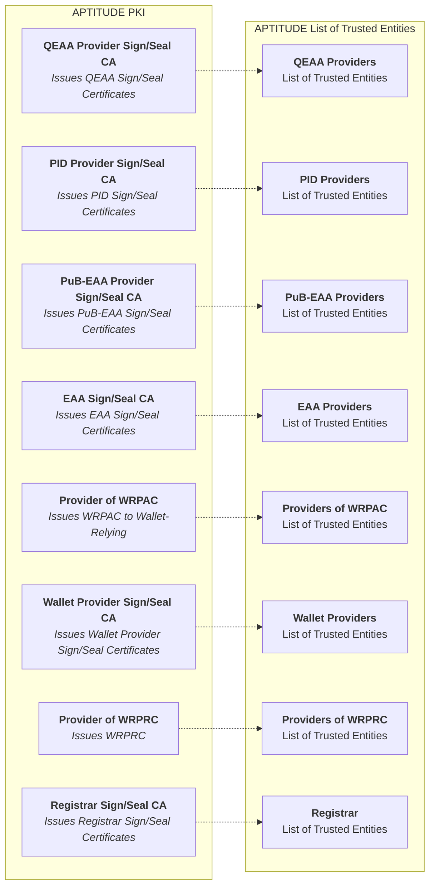

# 1\. APTITUDE Trust Framework Implementation Profiles

This document specifies the core architectural profiles for trust framework implementation within the APTITUDE Large-Scale Pilot (LSP). It defines the necessary trust architecture, the essential trust artifacts exchanged among pilot entities, and the high-level evaluation processes and precise trust checks to be executed during issuance and presentation flows. These profiles are derived from the EUDI Wallet Architecture Reference Framework (ARF), its Technical Specifications, the relevant ETSI standards, and the other standards defined in [insert link], adapted to the pilot context.

**Document roadmap:**

- [Introduction](#11-introduction) frames the scope, objectives, ARF requirements and constraints, and assumptions.
- [Trust Artifact Taxonomy](#12-trust-artifact-taxonomy) establishes the trust artifact vocabulary.
- [Trust Processes Taxonomy](#13-trust-processes-taxonomy) defines the trust evaluation processes.
- [Pilot Trust Infrastructure](#14-pilot-trust-infrastructure) describes the pilot trust infrastructure, i.e., what WP2 builds to support the pilots.
- [Trust Use Cases](#15-trust-use-cases) describes how trust is operationalized across pilots and adapted per business use case.

## 1.1. Introduction

### 1.1.1. Status of This Section and Normative Language

This section is **normative** for APTITUDE LSP implementations. The key words **"SHALL"**, **"SHALL NOT"**, **"REQUIRED"**, **"SHOULD"**, **"SHOULD NOT"**, **"RECOMMENDED"**, **"MAY"**, and **"OPTIONAL"** in this document are to be interpreted as described in **RFC 2119**.

### 1.1.2. Scope and Structure of the Profiles

The profiles in this document SHALL specify:

- **(1)** the trust artifacts consumed or exchanged by pilot entities;
- **(2)** the trust evaluation processes applied to these artifacts;
- **(3)** the precise trust checks executed during issuance and presentation flows.

They SHALL NOT prescribe internal implementation architectures and choices, deployment policies, operational policies (e.g., incident management, auditing, dispute resolution), or non-trust application-layer logic. Detailed component and process specifications, service API definitions, and artifact profiles are provided in subsequent sections of this document and in companion APTITUDE deliverables.

### 1.1.3. Pilot Objectives

The trust specifications are derived from use-case needs and fulfill the following objectives:

- **Pilot business use cases.** The APTITUDE pilot exists to demonstrate EUDIW-aligned business scenarios. Trust requirements flow from use-case needs. The APTITUDE Trust Framework Implementation Profiles are written to satisfy the trust demands of piloted use cases, not to prescribe a universal trust architecture in the abstract.
- **Trust framework's functional responsibility.** Given those use cases, the APTITUDE Trust Framework Implementation Profiles must provide:
    - the trust artifacts ([Trust Artifact Taxonomy](#12-trust-artifact-taxonomy)),
    - the evaluation processes and the list of issuance and presentation trust checks that allow flows to proceed with verifiable trust ([Trust Processes Taxonomy](#13-trust-processes-taxonomy)), and
    - the list of Components and Services that are to be implemented in T2.3.
    This allows every entity in the pilot to be able to prove its identity, its authorization, and verify the authenticity and integrity of the attestation being exchanged.
- **Pragmatic constraints.** The APTITUDE Trust Framework Implementation Profiles acknowledge the specific constraints of the APTITUDE piloting ecosystem ([ARF Requirements and APTITUDE Constraints](#114-arf-requirements-and-aptitude-constraints)) and leverage the assumptions detailed in [Assumptions and Boundaries](#115-assumptions-and-boundaries) to deliver a functional trust infrastructure that can support piloting use cases with a fully functional trust framework.

### 1.1.4. ARF Requirements and APTITUDE Constraints

This section highlights the main high-level deviations of the APTITUDE ecosystem from the ARF trust framework. These deviations are not arbitrary choices but are dictated by the constraints described in [Pilot Objectives](#113-pilot-objectives). The following table details such deviations:

| # | Theme | EUDIW responsibility | APTITUDE constraints |
|---|---|---|---|
| 1 | **Institutional Role** | Distributed governance (EU Commission, MSs) | Missing corresponding role in APTITUDE |
| 2 | **Registration Process** | MS responsibility | Missing corresponding role in APTITUDE |
| 3 | **Notification Process** | MS & EU Commission responsibility | Missing corresponding role in APTITUDE |
| 4 | **List of Trusted Entities, Trusted List and List of Trusted Lists** | MS & EU Commission responsibility for publication/management | Missing corresponding entity for publication/management |
| 5 | **Authentic Sources** | Specific Entity within MS | Missing corresponding role in APTITUDE |
| 6 | **Catalogue of Attestation** | EU Commission responsibility for publication/management | Missing corresponding role in APTITUDE |
| 7 | **Entity Lifecycle Management** | Supervisory Body responsibility | Missing corresponding role in APTITUDE |
| 8 | **Certification Schemes** | Supervisory Body responsibility | Missing corresponding role in APTITUDE |

### 1.1.5. Assumptions and Boundaries

Since the APTITUDE ecosystem does not feature Member States or EU Commission-type of actor deployed infrastructure, this section states the principles by which the APTITUDE Trust Framework Implementation Profiles address the gaps in [ARF Requirements and APTITUDE Constraints](#114-arf-requirements-and-aptitude-constraints) as follows:

| APTITUDE Decision | Addresses # |
|---|---|
| Pilot perimeter is limited to APTITUDE partners and beneficiaries | — |
| WP2 services fulfill the missing institutional roles (EU Commission, Registrar) with the services as specified in [Pilot Trust Infrastructure](#14-pilot-trust-infrastructure) | 1, 2, 3 |
| WP2 provides a single, simplified registration interface with self-declared attributes and entitlements by APTITUDE participants, without setting up dedicated administrative processes or certification scheme checks | 2, 8 |
| WP2 aggregates the registration information in a unique Register used for all entities | 2 |
| The WP2 managed onboarding services manage the operational processes (registration, notification, publication, certificate issuance) as described in [Pilot Trust Infrastructure](#14-pilot-trust-infrastructure) to set up the trust infrastructure given the pilot constraints | 2, 3 |
| The PKI architecture will not have a LOTL with the related TL; instead, it will feature a LoTE per entity type, including QEAA and EAA providers | 4 |
| WP2 acts as the sole LoTE provider; the certificate anchoring the various LoTEs will be published via GitHub | 4 |
| APTITUDE will not feature an Authentic Source mock-up and the related API | 5 |
| APTITUDE will not feature a Catalogue of Attestation, relying instead on the Attestation Rulebooks published on GitHub by the various WPs | 6 |
| APTITUDE will not feature an active management of entity lifecycles, and will instead check dedicated test cases for revocation as described in [Trust Use Cases](#15-trust-use-cases) | 7 |

## 1.2. Trust Artifact Taxonomy

This section introduces the trust artifacts that the profiles govern. Trust artifacts defined here are consumed by the trust evaluation processes ([Trust Processes Taxonomy](#13-trust-processes-taxonomy)) and are produced/managed by the infrastructure components described in [Pilot Trust Infrastructure](#14-pilot-trust-infrastructure).

**Note:** The term "trust artifact" in this section refers to the structured data objects exchanged or consulted during trust evaluation. Trust artifacts are distinct from the credentials (PIDs, PuB-EAAs, EAAs, QEAAs) whose authenticity they help verify.

### 1.2.1. Artifacts Consumed and Exchanged

The following table lists the trust artifacts defined in the profiles. For each, it indicates who produces it and where its data model is described in the companion specifications.

| Artifact | Producer | Reference |
|---|---|---|
| WRPAC | Provider of WRPAC (WP2 managed CA) | [WRPAC Profiles](../docs/topics/access-certificate.md) |
| WRPRC | Provider of WRPRC (WP2 managed CA) | [WRPRC Profiles](../docs/topics/registration-certificate.md) |
| Sign/Seal Certificates | Provider of Sign/Seal Certificates (WP2 managed CA) | [Sign/Seal Certificates Profile](../docs/topics/entity-end-certificate-profiles.md) |
| CRLs, OCSP | Provider of WRPAC and Sign/Seal Certificates (WP2 managed CA component) | [Revocation Mechanisms](../docs/topics/revocation-mechanisms.md) |
| TSL | Provider of WRPRC (WP2 managed CA component) | [Revocation Mechanisms](../docs/topics/revocation-mechanisms.md) |
| Trust Anchor Certificate | Self-signed WP2 managed CA | [Trust Anchor Certificate Profiles](../docs/topics/trust-anchor-certificate-profiles.md) |
| Register API | Registrar (WP2 managed service) | [Register API Profiles](../docs/api/register-api.md) |
| EDP | Attestation Providers (Self-managed issuance) | [EDP Profiles](/docs/topics/embedded-disclosure-policy.md) |
| List of Trusted Entities | LoTE Provider (WP2 managed service) | [LoTE Profiles](../docs/topics/trusted-list-and-list-of-trusted-lists.md) |

## 1.3. Trust Processes Taxonomy

This section introduces the trust evaluation processes that the profiles specify, references the high-level trust checks for the issuance and presentation flows, and identifies shared sub-processes.

### 1.3.1. Issuance-Flow Trust Evaluation

The high-level sequence of trust checks executed during credential issuance can be found in [Trust checks during Issuance](../docs/topics/trust-checks-issuance.md).

### 1.3.2. Presentation-Flow Trust Evaluation

The high-level sequence of trust checks executed during credential presentation can be found in [Trust checks during Presentation](../docs/topics/trust-checks-presentation.md).

### 1.3.3. Shared Sub-Processes

The following table describes the common sub-processes that the various trust evaluation checks employ, which flows they are used in, and by whom.

| Process name | Scope | Flow usage | Used by |
|----|----|----|----|
| X509 Certificate Chain Validation | Validate X509 certificate chains for WRPACs, WRPRCs, Sign/Seal Certificates | Presentation/Issuance | PID Providers, Attestation Providers, Relying Parties, Wallet Units |
| Authorization Validation | Validation of the entity authorization profile via WRPRC or Register query | Presentation/Issuance | Wallet Units |
| LoTE Validation | Validate authenticity and integrity of a LoTE, to extract the relevant Trust Anchor therein | Presentation/Issuance | PID Providers, Attestation Providers, Relying Parties, Wallet Units |

## 1.4. Pilot Trust Infrastructure

This section maps with the services and components that WP2 will build within T2.3. The services implement the assumptions from [Assumptions and Boundaries](#115-assumptions-and-boundaries) and support the establishment of a trust infrastructure for the pilot. The components support the processes from [Trust Processes Taxonomy](#13-trust-processes-taxonomy) which handle the various artifacts from [Trust Artifact Taxonomy](#12-trust-artifact-taxonomy).

### 1.4.1. Pilot Operational Processes and Architectural Schemas

This section describes the high-level processes that WP2 will implement to set up the trust infrastructure needed for the piloting phase. For clarity purposes it also renders these processes in diagrammatic form.

The Onboarding process, further detailed in [Onboarding Process](#onboarding-process), allows participants to register to the APTITUDE Trust Framework and obtain the trust artifacts needed to run trustworthy pilot interactions with the other members. The Onboarding Process can be characterized by three different phases:

1. The entity submits its identity and authorization information to the Registration Service (e.g., organization name, role, entitlements, requested credentials, issued credentials) as specified. In accordance with the principles established in [Assumptions and Boundaries](#115-assumptions-and-boundaries), the Onboarding system SHALL NOT verify the identity of the onboardee according to [ETSI TS 119 461] or Art 6. of [CIR 2025/848] but SHALL only check that it is a member of the APTITUDE LSP and rely on the onboardee self-declaration for all the other information submitted.
2. The entity submits its technical configurations (e.g., necessary cryptographic material, endpoints) needed for the piloting and receives the X509 certificates needed for the piloting phase.
3. The WP2 operated Publication Service updates the relevant LoTE with the necessary subset of information provided by the onboardee.

The following diagram describes the Onboarding Services which SHALL be set up by APTITUDE.

The following diagram details the Trust Infrastructure that the APTITUDE Trust Framework Implementation Profiles SHALL set up. The Trust Anchors employed SHALL be self-signed certificates of the specific CAs.

### 1.4.2. Integration Components and Services

**Use:** Catalogue of SDKs and WP2-managed services. Names only, no internal API details. Maps components directly to the process taxonomy ([Trust Processes Taxonomy](#13-trust-processes-taxonomy)) so the issuance-vs-presentation split is visible.

Trust Evaluation Components and Sub-components:

- LoTE Validation (SDK)
- X509 Validation (SDK)
    - CRL/OCSP Validation (SDK)
- Entity Authorization validator
    - WRPRC Validation (SDK)
        - SLT Validation (SDK)
    - Register Validation Query (SDK)
    - Authorization Validation (SDK)

WP2 Trust Services:

- Register DB & API
- Onboarding
    - Registration Service
    - Publication Service
    - Certificate Issuance Service (Issues and manages WRPAC, WRPRC, Sign/Seal Certificates of onboarded entities)

!!! warning

  Trust Services and Components implementation architecture will be further defined in T2.3.1 but SHALL adhere to the implementation profiles.

## 1.5. Trust Use Cases

Trust processes and infrastructure are operationalized in pilot scenarios to add to the pilot's specific business value. These are split into horizontal use cases (all pilots) and vertical adaptations (specific per use case).

Both horizontal and vertical trust use cases SHALL instantiate the processes from [Trust Processes Taxonomy](#13-trust-processes-taxonomy) using the artifacts from [Trust Artifact Taxonomy](#12-trust-artifact-taxonomy) via the infrastructure specified in [Pilot Trust Infrastructure](#14-pilot-trust-infrastructure). Vertical adaptations, if needed, SHALL extend the horizontal layer with business-value-specific trust add-ons per piloted use case. Both horizontal and vertical use cases SHALL be constrained by the assumptions in [Assumptions and Boundaries](#115-assumptions-and-boundaries).

### 1.5.1. Horizontal Trust Use Cases

| Horizontal use case | Processes involved | Input Artifacts involved | Checks | Output |
|---|---|---|---|---|
| Trust Anchor Validation | Issuance, Presentation | LoTE, WP2 LoTE signing certificate (published on GitHub) | Validates LoTE using *LoTE Validation* | Success: Validated Trust Anchor; Failure: Stops the interaction |
| Entity identity validation | Issuance, Presentation | Validated WRPAC Provider TA certificate, WRPAC, Entity-signed metadata | Validates: (i) the Entity signed metadata (depending on the flow type) using the WRPAC; (ii) the X509 chain starting with the WRPAC, using the *X509 Validation* on input the WRPAC Provider TA | Success: The Entity is Authenticated; Failure: Stops the interaction as the Entity is not trusted |
| Attestation Authenticity and Integrity | Issuance, Presentation | Attestation Sign/Seal certificate, Validated Attestation Provider TA | Validates: (i) the signed Attestation signature using the Sign/Seal Certificate; (ii) the X509 chain starting with the Sign/Seal Certificate, using the *X509 Validation* on input the Sign/Seal Provider TA | Success: the Attestation is authentic; Failure: the Attestation is untrustworthy |
| Entity authorization profile verification | Issuance, Presentation | WRPRC or Register query response, Validated WRPRC Provider TA or Registrar certificate, WRPAC | Validates: (i) the X509 chain starting with the WRPRC (or Register Sign/Seal certificate) signature using the *X509 Validation* on input the WRPRC (or Register) TA; (ii) The Entity authorization profile using the *Authorization Validation* on input the validated WRPRC or Register query | Success: the entity is authorized for issuance or presentation; Failure: the entity is not authorized for issuance or presentation (the user can override the decision in specific cases) |

### 1.5.2. Vertical Trust Use Case Adaptations

TODO: add specific use cases (certificate lyfecycle & entity revocation)

| Vertical Use Case | Related Work Package | Processes involved | Input Artifacts involved | Checks | Output |
|---|---|---|---|---|---|
