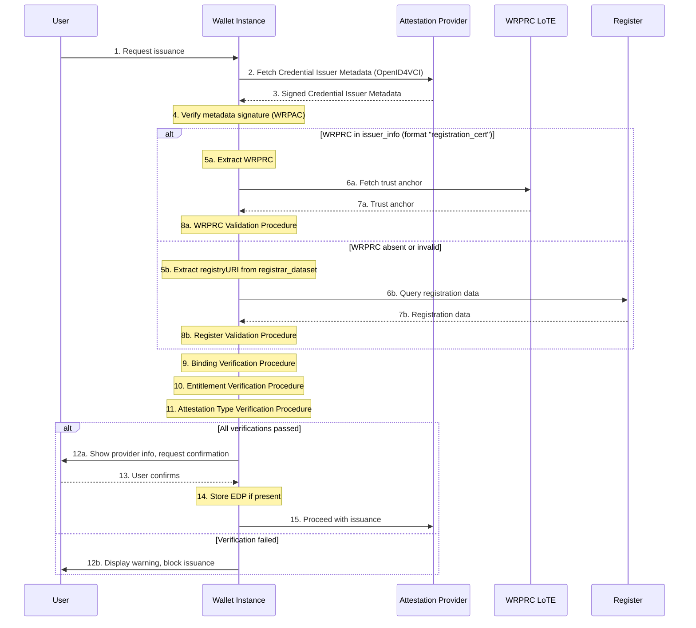
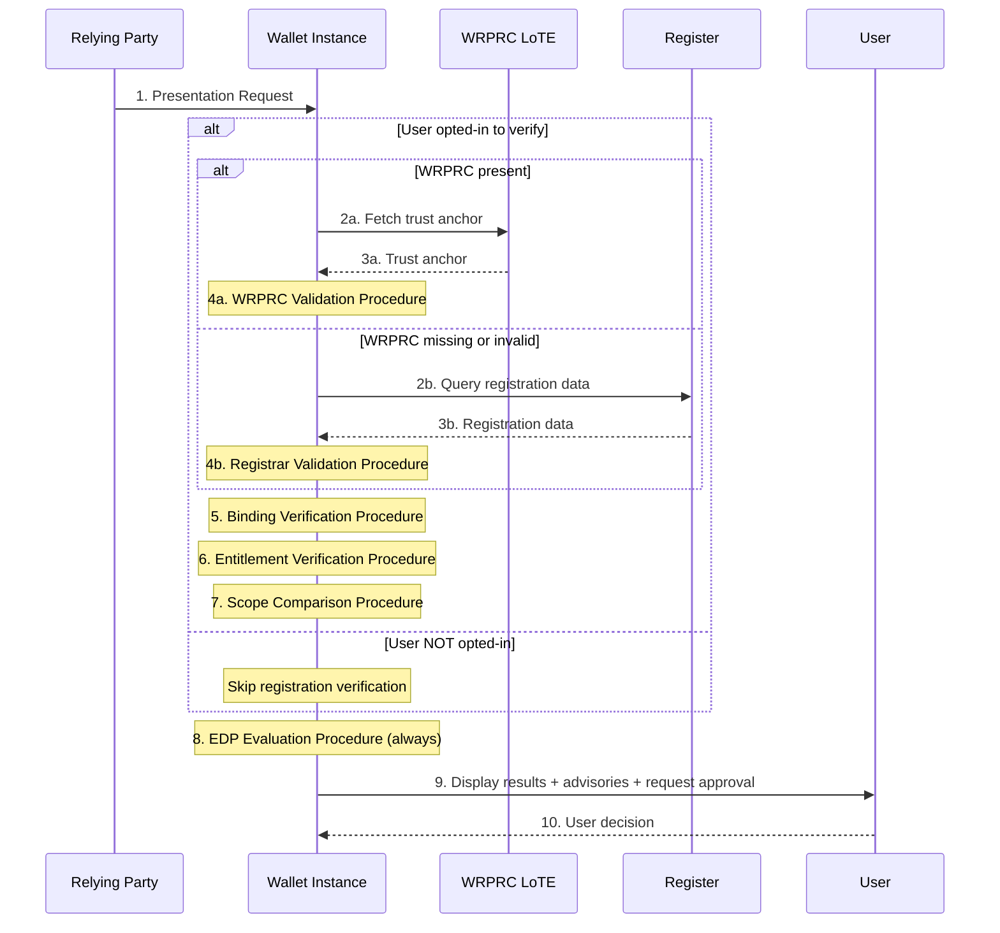
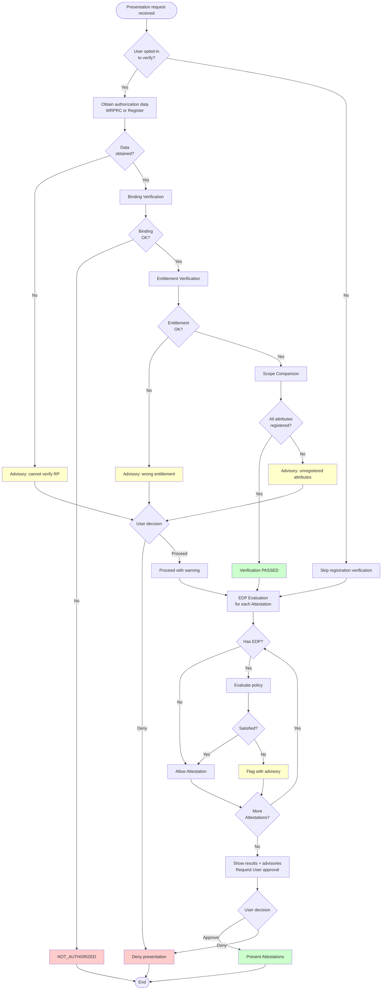

This section specifies the Authorization Process that a <components:Wallet Instance|Wallet Instance (WI)> SHALL execute to determine whether an interaction with a Wallet-Relying Party (WRP) is allowed within the <components:EUDI Wallet> ecosystem. A <components:Wallet Instance> SHALL implement all the rules of the Authorization Process defined in this section [AUTHZ-GEN-03].

Authorization covers:

- **Issuance authorization**: whether a <roles:Provider of Person Identification Data (PID Provider)|PID Provider> or <roles:Attestation Provider (AP)> is registered for the relevant role and for the specific <data-elements:Attestation Type|Attestation type(s)> to be issued. This applies to <roles:Provider of Person Identification Data (PID Provider)|PID Providers>, <roles:QEAA Provider|QEAA Providers>, <roles:PuB-EAA Provider|PuB-EAA Providers>, and <roles:EAA Provider|EAA Providers>.
- **Presentation authorization**: whether a <roles:Relying Party (RP)> request is within its registered scope, whether any <artifacts:Embedded Disclosure Policy (EDP)|Embedded Disclosure Policy> permits disclosure, and whether the <roles:User> approves. This applies to both direct <roles:Relying Party (RP)|RP> and <roles:Relying Party Intermediary (RPI)|intermediated RP> interactions, and both <protocols:Remote Flow|Remote Flows> and <protocols:Proximity Flow|Proximity Flows>.

!!! note

    Authentication process is out of scope. This section does not define access certificate validation rules, <artifacts:List of Trusted Entities (LoTE)|LoTE> validation procedures, certificate-path validation algorithms, revocation checking procedures for access certificates, the full trust-anchor validation model, nor the internal structure and encoding of the <artifacts:Wallet-Relying Party Registration Certificate (WRPRC)|WRPRC> (covered in section [Wallet-Relying Party Registration Certificate](../sections/trust-artifacts.md#wallet-relying-party-registration-certificate)), nor <roles:Registrar> online service API definition.

### Preconditions

The Authorization Process SHALL start only after the WRP has been successfully authenticated according to the applicable specifications (see section [Authentication Process](../sections/trust-evaluation-process.md#authentication-process)) [AUTHZ-GEN-01]. If the WRP has not been authenticated, the Authorization Process SHALL NOT start [AUTHZ-GEN-02].
This section does define how the <components:Wallet Instance|WI> SHALL use the already-authenticated WRP context as an input to authorization, including binding checks between the authenticated WRP, the authorization subject, and the <artifacts:Wallet-Relying Party Registration Certificate (WRPRC)|WRPRC> or <components:Register>-derived authorization context.

### Authorization Framework

This subsection defines the conceptual model that defines all authorization decisions. It introduces the key concepts (authorization subject, data source hierarchy, decision outcomes, and override principles) that the subsequent subsections build upon.

#### Authentication Prerequisite and Authorization Subject

The <components:Wallet Instance|WI> SHALL distinguish between the authenticated WRP and the authorization subject [AUTHZ-GEN-04]. The authorization subject is the entity whose authorization is being evaluated:

- In issuance: the <roles:Provider of Person Identification Data (PID Provider)|PID Provider> or <roles:Attestation Provider (AP)|AP>.
- In direct presentation: the <roles:Relying Party (RP)|RP>.
- In intermediated presentation: the final (intermediated) RP. The authenticated WRP in this case is the intermediary.

#### Source-Model Neutrality

The <components:Wallet Instance|WI> SHALL support authorization-context resolution from a <artifacts:Wallet-Relying Party Registration Certificate (WRPRC)|WRPRC> (where available) and from the <components:Register> (where a <artifacts:Wallet-Relying Party Registration Certificate (WRPRC)|WRPRC> is not available or cannot be relied upon) [AUTHZ-GEN-05]. The substantive authorization logic SHALL NOT change based on the data source [AUTHZ-GEN-06]. Where both sources are available, the <components:Wallet Instance|WI> SHALL normalize both into the same internal authorization model before applying rules [AUTHZ-GEN-07].

#### Input Model

The <components:Wallet Instance|WI> SHALL base authorization decisions only on information derived from [AUTHZ-IN-01]:

- Already authenticated WRP context.
- A verified <artifacts:Wallet-Relying Party Registration Certificate (WRPRC)|WRPRC> or a verified <components:Register> response.
- Explicitly identified self-declared fallback information.
- A verified <artifacts:Embedded Disclosure Policy (EDP)|EDP>, if provided by <roles:Attestation Provider (AP)|AP> during issuance.

The <components:Wallet Instance|WI> SHALL maintain an internal distinction between the following input classes [AUTHZ-IN-02]:

- **Authenticated WRP context**: authoritative only for the identity of the WRP [AUTHZ-IN-03].
- **Verified <artifacts:Wallet-Relying Party Registration Certificate (WRPRC)|WRPRC>-derived or <components:Register>-derived information**: authoritative for subject identity, entitlements, intended use, registered scope, intermediary relationship, issuance-type information, and privacy-policy references [AUTHZ-IN-04 and AUTHZ-IN-05].
- **Self-declared information**: non-authoritative. The <components:Wallet Instance|WI> SHALL NOT rely solely on self-declared information for checks that require registered information [AUTHZ-IN-06].
- **Verified <artifacts:Embedded Disclosure Policy (EDP)|EDP>**: authoritative only if available. The <components:Wallet Instance|WI> SHALL rely on RP information to determine access permission [AUTHZ-<artifacts:Embedded Disclosure Policy (EDP)|EDP>-06].

Where authoritative sources conflict with non-authoritative sources, the authoritative sources SHALL supersede [AUTHZ-IN-07]. Where the authenticated WRP context conflicts with the identity or intermediary binding in the verified authorization context, the <components:Wallet Instance|WI> SHALL produce `NOT_AUTHORIZED` (non-overridable) [AUTHZ-IN-08].

A request-carried <roles:Registrar> URL SHALL NOT be treated as sufficient proof of registered information by itself; it MAY be used only as a discovery hint unless confirmed by an authoritative source [AUTHZ-IN-09].

#### Decision Model

The <components:Wallet Instance|WI> SHALL provide an authorization decision expressed as `AUTHORIZED` or `NOT_AUTHORIZED` [AUTHZ-UI-01].

Each evaluation procedure (defined later in this section) gives a granular verification result code when it detects a negative condition. These codes feed into the final decision and into the advisories presented to the <roles:User>.

| Code | Phase | Meaning |
|------|-------|---------|
| `CERTIFICATE_INVALID` | Both | <artifacts:Wallet-Relying Party Registration Certificate (WRPRC)\|WRPRC> validation failed |
| `FAILED` | Both | Registration data could not be obtained or verified |
| `WRONG_ENTITLEMENT` | Both | Entity entitlement does not match expected role |
| `ATTESTATION_TYPE_NOT_REGISTERED` | Issuance | Requested attestation type is not in registered list |
| `BINDING_FAILED` | Both | Authorization subject does not match authenticated identity |
| `INTERMEDIARY_NOT_AUTHORIZED` | Presentation | Intermediary association verification failed |
| `VERIFICATION_PASSED` | Presentation | All requested attributes are registered |
| `OVERASKING_DETECTED` | Presentation | Some requested attributes are not registered |
| `EDP_SATISFIED` | Presentation | <artifacts:Embedded Disclosure Policy (EDP)\|Embedded Disclosure Policy> conditions met |
| `EDP_NOT_SATISFIED` | Presentation | <artifacts:Embedded Disclosure Policy (EDP)\|Embedded Disclosure Policy> conditions not met |

The Authorization Process SHALL support transparent decision-making and SHALL NOT be a purely hidden backend check [AUTHZ-UI-05].

#### Override Principles

A `NOT_AUTHORIZED` decision can be either non-overridable (the <components:Wallet Instance|WI> blocks the interaction) or overridable (the <components:Wallet Instance|WI> presents the negative outcome and the <roles:User> can choose to proceed).

In **issuance** phase, all negative verification outcomes are non-overridable: the <components:Wallet Instance|WI> protects the <roles:User> from providers whose registration cannot be confirmed (per ISSU_24a, ISSU_34a, ISSU_34b).

In **presentation** phase, two specific cases are overridable:

1. Negative scope comparison (per RPRC_21: the <roles:User> is informed of unregistered attributes but can proceed).
2. Negative <artifacts:Embedded Disclosure Policy (EDP)|EDP> evaluation (per EDP_07: the <roles:User> can deny or allow).

All other presentation failures (binding failures and intermediary binding failures) are non-overridable because they indicate an integrity problem rather than a user-facing choice.

In case of non-overridable failures, the <components:Wallet Instance|WI> SHALL clearly inform the <roles:User> about the negative outcome. User-relevant information about overridable outcomes SHALL be presented as advisories, and the <roles:User> approval SHALL be a separate step from the authorization decision [AUTHZ-UI-02, AUTHZ-UI-03, AUTHZ-UI-04].

!!! note "User opt-in"

    The *Scope Comparison Procedure* is executed only if the <roles:User> enabled registration verification (RPRC_16). Override mechanisms define what happens when the procedure produces a negative result.

The detailed override rules are provided in the [Override Rules](#override-rules) section.

### Authorization Evidences

This section describes the data objects that carry authorization information such as where they originate, how they are distributed, and what parameters are relevant for authorization decisions. The evaluation procedures that operate on these data objects are defined in the section [Evaluation Procedures](#evaluation-procedures).

#### Registration Overview

WRPs are registered with a <roles:Registrar> in their Member State before operating in the <components:EUDI Wallet> ecosystem. <roles:Relying Party (RP)|Relying Parties> declare one or more intended uses, each with a user-friendly description, the <data-elements:Attestation Type> and optionally the list of attributes needed, the purpose, and a privacy policy link. A <artifacts:Wallet-Relying Party Registration Certificate (WRPRC)|WRPRC> is issued for each intended use (RPRC_09). <roles:Attestation Provider (AP)|Attestation Providers> declare which <data-elements:Attestation Type|Attestation types> they intend to issue (RPRC_15, RPRC_22a). <roles:Relying Party Intermediary (RPI)|Intermediaries> are registered as <roles:Relying Party (RP)|RPs> that act on behalf of other <roles:Relying Party (RP)|RPs>; the <artifacts:Wallet-Relying Party Registration Certificate (WRPRC)|WRPRC> of the intermediated RP contains the `intermediary` structure identifying the authorized intermediary per [ETSI TS 119 475, Table 10].

#### Data Object Lifecycle

The following diagram shows the authorization evidences and how they flow between the entities in the ecosystem.

Registration data is collected at the <roles:Registrar> and the <roles:Provider of Wallet Relying Party Registration Certificate (Provider of WRPRC)|Provider of WRPRCs> get it from <roles:Registrar> to provide it through a <artifacts:Wallet-Relying Party Registration Certificate (WRPRC)|WRPRC>. Registration data can also be queried directly by the <components:Wallet Instance|WI> using <roles:Registrar> online services as a fallback mechanism. <artifacts:Wallet-Relying Party Registration Certificate (WRPRC)|WRPRCs> are distributed to the <components:Wallet Instance|WI> through presentation requests (for RPs) or through <artifacts:Credential Issuer Metadata> (for <roles:Attestation Provider (AP)|APs>). EDPs are defined by the <roles:Attestation Provider (AP)|AP>, distributed through <artifacts:Credential Issuer Metadata>, stored locally by the <components:Wallet Instance|WI> during issuance, and evaluated at presentation time.

#### WRPRC Parameters for Authorization

The following table lists the <artifacts:Wallet-Relying Party Registration Certificate (WRPRC)|WRPRC> payload parameters used by the Authorization Process, with field names as defined in [ETSI TS 119 475, Section 5.2.4]. Details about the <artifacts:Wallet-Relying Party Registration Certificate (WRPRC)|WRPRC> data structure and lifecycle are provided in section [Wallet-Relying Party Registration Certificate](../sections/trust-artifacts.md#wallet-relying-party-registration-certificate).
The **Authorization Use** column indicates how each parameter is consumed: **Decision rule** means the <components:Wallet Instance|WI> enforces an automated check, **User transparency** means the information is displayed to support the <roles:User>'s decision, and **Wallet operation** means the <components:Wallet Instance|WI> uses it internally (e.g. for fallback query).

| Field | Applicability | Authorization Use | Reference |
| :---- | :------------ | :---------------- | :-------- |
| `sub` | WRPs (REQUIRED) | **Decision rule**: binding verification; entity identification for <artifacts:Embedded Disclosure Policy (EDP)\|EDP> evaluation | [ETSI TS 119 475, Table 7] RPRC_07 |
| `sub_ln` | WRPs (REQUIRED) | **User transparency**: legal name displayed to User | [ETSI TS 119 475, Table 7], [CIR 2025/848, Annex I.1] |
| `name` | WRPs (OPTIONAL) | **User transparency**: trade name displayed to User | [ETSI TS 119 475, Table 7], [CIR 2025/848, Annex I.2] |
| `entitlements` | WRPs (REQUIRED) | **Decision rule**: entitlement verification against expected role | [ETSI TS 119 475, Table 7, Annex A.2] ISSU_24a, ISSU_34a |
| `srv_description` | WRPs (REQUIRED) | **User transparency**: service description displayed to User | [ETSI TS 119 475, Table 7], [CIR 2025/848, Annex I.8] |
| `registry_uri` | WRPs (REQUIRED) | **Wallet operation**: <roles:Registrar> URL for fallback query | [ETSI TS 119 475, Table 7] RPRC_18 |
| `support_uri` | WRPs (REQUIRED) | **User transparency**: support contact for rights and data deletion | [ETSI TS 119 475, Table 7], [CIR 2025/848, Annex I.7(a)] |
| `supervisory_authority` | WRPs (REQUIRED) | **User transparency**: DPA information displayed to User | [ETSI TS 119 475, Table 7], [CIR 2025/848, Annex IV.3(g)] |
| `public_body` | WRPs (OPTIONAL) | **User transparency**: public sector identification shown to User | [ETSI TS 119 475, Table 10], [CIR 2025/848, Annex I.11] |
| `privacy_policy` | RPs (REQUIRED if IntendedUse is present) | **User transparency**: privacy policy link displayed to User | [ETSI TS 119 475, Table 9] |
| `purpose` | RPs (REQUIRED if IntendedUse is present) | **User transparency**: purpose description displayed to User | [ETSI TS 119 475, Table 9] RPRC_18 |
| `intended_use_id` | RPs (OPTIONAL) | **Wallet operation**: <roles:Registrar> query key for intended-use lookup | [ETSI TS 119 475, Table 9] RPRC_19a |
| `credentials[]` | RPs (OPTIONAL) | **Decision rule**: scope comparison bertween `claim[]` paths and `meta.vct_values`/`doctype_value` and requested attributes | [ETSI TS 119 475, Table 9] RPRC_09, RPRC_21 |
| `provides_attestations[]` | APs (REQUIRED) | **Decision rule**: <data-elements:Attestation Type\|Attestation type> verification of registered types against requested type during issuance | [ETSI TS 119 475, Table 8] RPRC_15, RPRC_23, ISSU_34b |
| `intermediary` | WRPs (OPTIONAL) | **Decision rule**: `intermediary.sub` used to check against authenticated intermediary identity | [ETSI TS 119 475, Table 10], [CIR 2025/848, Annex I.14] |
| `status` | WRPs (REQUIRED) | **Decision rule**: <artifacts:Wallet-Relying Party Registration Certificate (WRPRC)\|WRPRC> revocation check via <artifacts:Status List Token> | [ETSI TS 119 475] GEN-6.2.6.1-04, RPRC_17 |
| `iat` / `exp` | WRPs (REQUIRED) | **Decision rule**: temporal validity check | [ETSI TS 119 475] |

#### Distribution Methods

**Presentation flows.** <roles:Relying Party (RP)|RPs> include the <artifacts:Wallet-Relying Party Registration Certificate (WRPRC)|WRPRC> in the <artifacts:Presentation Request> by value (RPRC_19) in the:

- `verifier_info` parameter included in the <artifacts:Request Object> JWT within the authorization request (<protocols:Remote Flow>, [ETSI TS 119 472-2] and [OpenID4VP, Section 5.1]). This is an array of JSON Objects containg <artifacts:Wallet-Relying Party Registration Certificate (WRPRC)|WRPRC> in base64-encoded format and RPRC_19a data including the URL of <roles:Registrar> online service.
- `euWrprc` (<formats:Concise Binary Object Representation (CBOR)|CBOR> byte string with serialized <artifacts:Wallet-Relying Party Registration Certificate (WRPRC)|WRPRC>) member of `requestInfo` included in the ISO DeviceRequest (<protocols:Proximity Flow>, [ETSI TS 119 472-2, Section 5.3]).

!!! warning

    Currently, the mapping of RPRC_19a data in the `requestInfo` map is not defined in [ETSI TS 119 472-2]

**Issuance flow.** <roles:Attestation Provider (AP)|APs> include authorization data in <artifacts:Credential Issuer Metadata> through the `issuer_info` array ([ETSI TS 119 472-3, Section 4.2.3]). This array contains:

- An element with format `"registration_cert"` containing the <artifacts:Wallet-Relying Party Registration Certificate (WRPRC)|WRPRC> by value (ISS-MDATA-REG_CERT-4.2.3-04/05) (OPTIONAL).
- An element with format `"registrar_dataset"` containing self-declared registration information including `identifier`, `srvDescription`, `registryURI`, and `providesAttestations` (ISS-MDATA-REG_CERT-4.2.3-07 through 13) (REQUIRED).

Metadata is signed with the <roles:Attestation Provider (AP)|AP> <artifacts:Wallet-Relying Party Access Certificate (WRPAC)|WRPAC> private key (ISSU_22a). Authorization data cointained in the <artifacts:Embedded Disclosure Policy (EDP)|EDP> is also distributed through <artifacts:Credential Issuer Metadata> within `credential_configurations_supported` field.

### Registrar Online Service

Each <roles:Registrar> provides an online service accessible via URL, obtained as described in the [Distribution Methods](#distribution-methods) section.

The <components:Wallet Instance|WI> SHALL use this service when the <artifacts:Wallet-Relying Party Registration Certificate (WRPRC)|WRPRC> is not available or validation fails. The service is queried using the entity unique identifier and, for presentation, the `intended_use_id`. The response provides the same authorization-relevant data as a <artifacts:Wallet-Relying Party Registration Certificate (WRPRC)|WRPRC>. <roles:Registrar> online service is available through an API interface which is defined in TS5.

!!! note

    The <components:Wallet Instance|WI> SHOULD inform the <roles:User> that an external query will be made (privacy consideration per RPRC_18).

#### Embedded Disclosure Policy

The <artifacts:Embedded Disclosure Policy (EDP)|EDP> is a set of rules defined by the <roles:Attestation Provider (AP)|AP> that restricts which <roles:Relying Party (RP)|RPs> can access specific <credentials:Attestation|Attestations>. The <artifacts:Embedded Disclosure Policy (EDP)|EDP> definition, data model, structure, encoding, and lifecycle are specified in the dedicated [Embedded Disclosure Policy](../sections/trust-artifacts.md#embedded-disclosure-policy) section of this specification.

For authorization purposes, the following aspects are relevant:

- <artifacts:Embedded Disclosure Policy (EDP)|EDPs> are applicable to <credentials:Qualified Electronic Attestation of Attributes (QEAA)|QEAAs>, <credentials:Public Electronic Attestation of Attributes (PuB-EAA)|PuB-EAAs>, and non-qualified EAAs. They are not applicable to <credentials:Person Identification Data (PID)|PIDs> [AUTHZ-EDP-01].
- During issuance, when the <roles:User> confirms, the <components:Wallet Instance|WI> SHALL retrieve and store locally the <artifacts:Embedded Disclosure Policy (EDP)|EDP> if present in the <artifacts:Credential Issuer Metadata> [AUTHZ-EDP-02].
- At presentation time, for each <credentials:Attestation|Attestation> matching a request, the <components:Wallet Instance|WI> SHALL check its locally stored <artifacts:Embedded Disclosure Policy (EDP)|EDP> and evaluate it against the requesting RP according to the [EDP Evaluation Procedure](#edp-evaluation-procedure) defined in this section.
- Annex III of [CIR 2024/2979] defines three policy types that the WI SHALL support. In particular:
    - No Policy.
    - Authorized Relying Parties Only.
    - Specific Root of Trust.

### Evaluation Procedures

This section defines the individual verification procedures that are composed into end-to-end flows in the [Operational Flows](#operational-flows) section. Each procedure is self-contained: it specifies its inputs, its processing logic, and its output (a verification result code). The override behaviour for each procedure's negative outcome is detailed in the [Override Rules](#override-rules) section.

#### WRPRC Validation Procedure

When a <artifacts:Wallet-Relying Party Registration Certificate (WRPRC)|WRPRC> is available, the <components:Wallet Instance|WI> SHALL validate it before relying on it [AUTHZ-GEN-08]:

1. **Format verification**: confirm `typ` is `rc-wrp+jwt` (remote) or `rc-wrp+cwt` (proximity)  ([ETSI TS 119 475, Section 5.2.1]).
2. **Algorithm verification**: verify the conformance of signature algorithm (neither `"none"` nor deprecated).
3. **Signature and Certificate chain validation**: verify the <artifacts:Wallet-Relying Party Registration Certificate (WRPRC)|WRPRC> signature and validate the chain.
4. **<artifacts:Trust Anchor> resolution**: fetch the trust anchor for the <roles:Provider of Wallet Relying Party Registration Certificate (Provider of WRPRC)|Provider of WRPRCs> from <artifacts:List of Trusted Entities (LoTE)|LoTE>. The WI SHALL accept <artifacts:Trust Anchor|Trust Anchors> from all <roles:Provider of Wallet Relying Party Registration Certificate (Provider of WRPRC)|Provider of WRPRCs> <artifacts:List of Trusted Entities (LoTE)|LoTE> (ISSU_33a).
5. **Temporal validity**: check `iat` and `exp` (if present).
6. **Status verification**: check revocation status via the `status` field (RPRC_17).
7. **Coherence check**: verify <artifacts:Wallet-Relying Party Registration Certificate (WRPRC)|WRPRC> subject and fields are coherent with the scenario [AUTHZ-GEN-09].

If any step fails, the procedure outputs `CERTIFICATE_INVALID`. This is not a final authorization decision; it triggers the [Register Validation Procedure](#register-validation-procedure) as fallback.

#### Register Validation Procedure

When the <artifacts:Wallet-Relying Party Registration Certificate (WRPRC)|WRPRC> is not available or validation has failed, the <components:Wallet Instance|WI> SHALL attempt to contact the <components:Register> APIs [AUTHZ-GEN-10]:

1. **Extract <roles:Registrar> URL** from the <artifacts:Presentation Request> (`verifier_info` in remote scenario or `requestInfo` in proximity scanario) during presentation flow, or from <artifacts:Credential Issuer Metadata> (`issuer_info.registry_uri`) during issuance flow. See [Distribution Methods](#distribution-methods) section for details.
2. **Connect** to the <roles:Registrar> online service using HTTPS.
3. **Query** using entity identifier and `intended_use_id` (presentation) or AP identifier (issuance).
4. **Verify response signature**: the <components:Wallet Instance|WI> SHALL verify the signature of the response data according to TS5.
5. **Resolve <roles:Registrar> trust chain**: the <components:Wallet Instance|WI> SHALL resolve the trust chain of the signing certificate and verify that the <roles:Registrar> <artifacts:Trust Anchor> is contained in the applicable <roles:Registrar> <artifacts:List of Trusted Entities (LoTE)|LoTE>.
6. **Verify pertinence**: the <components:Wallet Instance|WI> SHALL verify that the response pertains to the relevant authorization subject and intended use [AUTHZ-REG-01], [AUTHZ-REG-02].
7. **Normalize** <components:Register>-derived data into the same internal model used for <artifacts:Wallet-Relying Party Registration Certificate (WRPRC)|WRPRC> data [AUTHZ-REG-03].

If the URL is not present, connection fails, or validation fails, the procedure outputs `FAILED` [AUTHZ-REG-04].

**Three-tier fallback (issuance only)** (ISSU_24a and ISSU_34a): self-declared data from `registrar_dataset` (advisory only, SHALL NOT be presented as verified) [AUTHZ-IN-10].

#### Binding Verification Procedure

The <components:Wallet Instance|WI> SHALL verify coherence between the authenticated WRP identity and the authorization context, regardless of whether the authorization context is derived from a <artifacts:Wallet-Relying Party Registration Certificate (WRPRC)|WRPRC> or from the <components:Register> [AUTHZ-GEN-11]. This procedure ensures that the authenticated entity (through <artifacts:Wallet-Relying Party Access Certificate (WRPAC)|WRPAC>) is the same as the entity described in the authorization data.

##### Common Principle

The WI SHALL compare the <roles:Wallet-Relying Party (WRP)|WRP> identifier extracted from the <artifacts:Wallet-Relying Party Access Certificate (WRPAC)|WRPAC> subject (the `organizationIdentifier` in the subject DN, following [ETSI EN 319 412-1, clause 5.1.4]) against the authorization subject identifier available from:

- the <artifacts:Wallet-Relying Party Registration Certificate (WRPRC)|WRPRC> `sub` field (if available).
- The authorization data (RPRC_19a) extracted from authentication request (`verifier_info` or `requestInfo`) in presentation scenario or in `registrar_dataset` field in issuance scenario.
- The <components:Register> response (if queried).

All available sources SHALL be mutually consistent.

##### Issuance Binding

During issuance, the <components:Wallet Instance|WI> SHALL verify that the <roles:Attestation Provider (AP)|AP> that signed the <artifacts:Credential Issuer Metadata> (identified by the <artifacts:Wallet-Relying Party Access Certificate (WRPAC)|WRPAC> in the `x5c` header of the JWS) is the same entity described in the authorization data [AUTHZ-GEN-11]. The <components:Wallet Instance|WI> SHALL check coherence between:

- The <roles:Attestation Provider (AP)|AP> identifier from the <artifacts:Wallet-Relying Party Access Certificate (WRPAC)|WRPAC> subject (extracted during metadata signature verification).
- The `sub` field from the <artifacts:Wallet-Relying Party Registration Certificate (WRPRC)|WRPRC> in `issuer_info` (if present).
- The `identifier` field from the `registrar_dataset` element in `issuer_info` (if present).

If any pair of these identifiers is inconsistent, the procedure outputs `BINDING_FAILED`. Intermediary detection does not apply to issuance.

##### Presentation Binding -- Intermediary Detection

In presentation, before verifying binding, the <components:Wallet Instance|WI> SHALL check whether the interaction is direct or intermediated [AUTHZ-INT-01] by comparing:

- The **authenticated WRP identifier**, extracted from the <artifacts:Wallet-Relying Party Access Certificate (WRPAC)|WRPAC> subject DN.
- The **claimed RP identifier**, extracted from the <artifacts:Presentation Request> fields according to RPRC_19a (item b). Following RPI_06, in an intermediated scenario these fields pertain to the intermediated RP.

If the two identifiers match, the **direct RP scenario** applies. If they differ, the **intermediary scenario** applies.

##### Direct RP Binding

In the direct <roles:Relying Party (RP)|RP> scenario, the <components:Wallet Instance|WI> SHALL verify that the <artifacts:Wallet-Relying Party Registration Certificate (WRPRC)|WRPRC> (if present in `verifier_info` or `requestInfo`) is coherent with the already-established identities [AUTHZ-GEN-12]:

- The <artifacts:Wallet-Relying Party Registration Certificate (WRPRC)|WRPRC> `sub` field SHALL match the authenticated WRP identifier and the claimed <roles:Relying Party (RP)|RP> identifier from authorization data (RPRC_19a).

If the <artifacts:Wallet-Relying Party Registration Certificate (WRPRC)|WRPRC> `sub` does not match, the <artifacts:Wallet-Relying Party Registration Certificate (WRPRC)|WRPRC> is not valid for this <roles:Relying Party (RP)|RP>. The procedure outputs `BINDING_FAILED` and the WI SHALL discard the <artifacts:Wallet-Relying Party Registration Certificate (WRPRC)|WRPRC> and fall back to the [Register Validation Procedure](#register-validation-procedure).

##### Intermediary Binding

In the intermediary scenario, the <components:Wallet Instance|WI> SHALL perform the following verifications [AUTHZ-INT-02]:

**Step 1: Identify the parties.** The <components:Wallet Instance|WI> identifies:

- The **intermediary**: the entity authenticated via <artifacts:Wallet-Relying Party Access Certificate (WRPAC)|WRPAC>. Its identifier is extracted from the <artifacts:Wallet-Relying Party Access Certificate (WRPAC)|WRPAC> subject DN.
- The **intermediated (final) RP**: the authorization subject. Its identifier and other data are obtained from the <artifacts:Wallet-Relying Party Registration Certificate (WRPRC)|WRPRC> `sub` field and/or from the <artifacts:Presentation Request> fields.

**Step 2: Verify intermediary association.** The <components:Wallet Instance|WI> SHALL verify that the intermediary is authorized to act on behalf of the intermediated RP. The verification depends on the available data source:

- **If a valid <artifacts:Wallet-Relying Party Registration Certificate (WRPRC)|WRPRC> is available**: the <artifacts:Wallet-Relying Party Registration Certificate (WRPRC)|WRPRC> of the intermediated RP SHALL contain the `intermediary` structure (per [ETSI TS 119 475, Table 10]). The WI SHALL verify that `intermediary.sub` matches the authenticated intermediary identifier from the <artifacts:Wallet-Relying Party Access Certificate (WRPAC)|WRPAC>. The presence of the `intermediary` field in the <artifacts:Wallet-Relying Party Registration Certificate (WRPRC)|WRPRC>, signed by the <roles:Provider of Wallet Relying Party Registration Certificate (Provider of WRPRC)|Provider of WRPRCs>, is authoritative evidence that the relationship is registered.
- **If the <artifacts:Wallet-Relying Party Registration Certificate (WRPRC)|WRPRC> is not available or invalid**: the <components:Wallet Instance|WI> SHALL query the <components:Register> using the intermediated RP identifier (from RPRC_19a item b) and verify in the <components:Register> response that the authenticated intermediary is listed as an authorized intermediary for that RP.
- **If both <artifacts:Wallet-Relying Party Registration Certificate (WRPRC)|WRPRC> and <components:Register> verification fail**: the <components:Wallet Instance|WI> SHALL NOT confirm the intermediary relationship.

On failure of intermediary association verification, the procedure outputs SHALL be `INTERMEDIARY_NOT_AUTHORIZED` [AUTHZ-INT-03].

**Step 3: Verify authorization subject coherence.** The <components:Wallet Instance|WI> SHALL additionally verify that the intermediated RP identifier is consistent across all available sources: the <artifacts:Wallet-Relying Party Registration Certificate (WRPRC)|WRPRC> `sub` field (if available), the presentation request fields per RPRC_19a, and the <components:Register> response (if queried). If any inconsistency is found, the procedure SHALL output `BINDING_FAILED`.

**Step 4: Apply authorization context.** Once the intermediary association is confirmed, all subsequent authorization checks (entitlement verification, scope comparison, <artifacts:Embedded Disclosure Policy (EDP)|EDP> evaluation) SHALL use the intermediated <roles:Relying Party (RP)|RP> data, not the intermediary data [AUTHZ-INT-02].

**Step 5: Display both identities.** The <components:Wallet Instance|WI> SHALL display to the <roles:User> both the intermediary identity and the intermediated RP identity (RPI_07). The display SHOULD follow the pattern: "[intermediary name] acting on behalf of [intermediated RP name] for [intended use description]".
The names are obtained from:

- Intermediary: `intermediary.sname` from the <artifacts:Wallet-Relying Party Registration Certificate (WRPRC)|WRPRC>, or the intermediary name from the <components:Register> response.
- Intermediated RP: `name` (or `sub_ln`) from the <artifacts:Wallet-Relying Party Registration Certificate (WRPRC)|WRPRC>, or the <roles:Relying Party (RP)|RP> name from the <artifacts:Presentation Request> fields per RPRC_19a (item a), or the <components:Register> response.

If any name is not available, the <components:Wallet Instance|WI> SHALL display the identifier instead of the name.

!!! warning

    [ETSI TS 119 475, Table 10] defines the intermediary name subfield > as `sname`. The example in Annex C of the same standard uses `name` instead. This specification follows the normative Table 10 and uses `sname`.

!!! note

    The <roles:Registrar> online service API, including the specific parameters for querying intermediary relationships, is defined in TS5. This specification does not define the <components:Register> API; it only defines how the <components:Wallet Instance|WI> uses the <components:Register> response for authorization purposes.

#### Entitlement Verification Procedure

The <components:Wallet Instance|WI> SHALL verify that the entitlements of the authorization subject match the expected role [AUTHZ-GEN-13].

For **issuance**, the expected entitlement depends on the provider type:

| Request type | Expected entitlement URI |
|-------------|-------------------------|
| PID | `https://uri.etsi.org/19475/Entitlement/PID_Provider` |
| QEAA | `https://uri.etsi.org/19475/Entitlement/Q_EAA_Provider` |
| PuB-EAA | `https://uri.etsi.org/19475/Entitlement/PuB_EAA_Provider` |
| Non-qualified EAA | `https://uri.etsi.org/19475/Entitlement/Non_Q_EAA_Provider` |

For **presentation**, the expected entitlement is `https://uri.etsi.org/19475/Entitlement/Service_Provider`.

If the `entitlements` array does not contain the expected value, the procedure SHALL output `WRONG_ENTITLEMENT`.

#### Attestation Type Verification Procedure (Issuance Only)

The <components:Wallet Instance|WI> SHALL verify that the <credentials:Person Identification Data (PID)|PID> or <data-elements:Attestation Type> being requested is registered for the provider [AUTHZ-ISS-02]:

- For <roles:Provider of Person Identification Data (PID Provider)|PID Providers> issuing <credentials:Person Identification Data (PID)|PIDs>, the <components:Wallet Instance|WI> MAY skip this step.
- Otherwise, the <components:Wallet Instance|WI> SHALL match the `provides_attestations[]` array against the `credential_configurations_supported` keys in <artifacts:Credential Issuer Metadata>. Matching SHALL be case-sensitive and exact (`vct_value` for <formats:Selective Disclosure JWT (SD-JWT)|SD-JWT> VC, `doctype` for mDL).

If not found, the procedure SHALL output `ATTESTATION_TYPE_NOT_REGISTERED`.

#### Scope Comparison Procedure (Presentation Only, user-optional)

The <components:Wallet Instance|WI> SHALL [AUTHZ-PRES-01]:

1. Extract requested attributes: from `credential_queries[].claims[]` (remote/DCQL) or from `namespaces` (proximity).
2. Compare against registered scope: match `credentials[].claim[]` and `credentials[].meta.vct_values` or `doctype_value` in the authorization context. Matching SHALL be case-sensitive and exact.

If all match, the <components:Wallet Instance|WI> SHALL output `VERIFICATION_PASSED`. Otherwise, the <components:Wallet Instance|WI> SHALL output `OVERASKING_DETECTED` and identify the unregistered attributes [AUTHZ-PRES-02].

#### EDP Evaluation Procedure

For each <credentials:Attestation> matching a <artifacts:Presentation Request>, the <components:Wallet Instance|WI> SHALL check for a locally stored <artifacts:Embedded Disclosure Policy (EDP)|EDP> [AUTHZ-<artifacts:Embedded Disclosure Policy (EDP)|EDP>-03]. If no <artifacts:Embedded Disclosure Policy (EDP)|EDP> exists, the <credentials:Attestation> is allowed (subject to User approval). Otherwise:

In case of **Authorized Relying Parties Only** policy type [AUTHZ-EDP-04]:

- Detect intermediary scenario.
- Extract the identity information of the <roles:Relying Party (RP)|RP> (direct) or intermediated RP. The <components:Wallet Instance|WI> SHALL NOT use intermediary identity.
- Match against the `authorized_parties` list: compare the <roles:Relying Party (RP)|RP> subject DN from <artifacts:Wallet-Relying Party Access Certificate (WRPAC)|WRPAC> against `subject_dn` entries, and/or compare the RP entitlements or sub-entitlements from <artifacts:Wallet-Relying Party Registration Certificate (WRPRC)|WRPRC> against `entitlement_uri` entries. A match on either criterion is sufficient.

If the checks are successful, the <components:Wallet Instance|WI> SHALL provide `EDP_SATISFIED` as output result, otherwise the <components:Wallet Instance|WI> SHALL provide `EDP_NOT_SATISFIED`.

In case of **Specific Root of Trust** policy type [AUTHZ-EDP-05] and according to direct/intermediary scenario:

- For direct <roles:Relying Party (RP)|RP>, the <components:Wallet Instance|WI> SHALL extract issuer DN and serial number from the root or intermediate certificates in the <artifacts:Wallet-Relying Party Access Certificate (WRPAC)|WRPAC> chain.
- For intermediary, the <components:Wallet Instance|WI> SHALL retrieve root certificate information of the <roles:Provider of Wallet Relying Party Registration Certificate (Provider of WRPRC)|Provider of WRPRCs> for the intermediated RP. Then, the <components:Wallet Instance|WI> SHALL compare against the `trusted_roots` list and match `issuer_dn` using LDAP DN comparison and `serial_number` using integer comparison (as defined ISS-MDATA-EBD-4.2.5.2-09). If the check is satisfied, the <components:Wallet Instance|WI> SHALL output: `EDP_SATISFIED` or `EDP_NOT_SATISFIED`.

The <components:Wallet Instance|WI> SHALL evaluate <artifacts:Embedded Disclosure Policy (EDP)|EDP> together with <roles:Relying Party (RP)|RP> information to determine access permission (EDP_06) [AUTHZ-<artifacts:Embedded Disclosure Policy (EDP)|EDP>-06].
If `EDP_SATISFIED`, the <components:Wallet Instance|WI> SHALL allow the <credentials:Attestation> presentation (subject to <roles:User> approval) and display explanatory link if present (EDP_05) [AUTHZ-EDP-07].
If `EDP_NOT_SATISFIED`, the <components:Wallet Instance|WI> SHALL produce `NOT_AUTHORIZED`, present the outcome, and allow <roles:User> override (EDP_07) [AUTHZ-EDP-08].
If the <roles:User> denies, the <components:Wallet Instance|WI> SHALL behave as if the <credentials:Attestation> does not exist (RPA_11).

### Override Rules

This section details the override behaviour for each procedure when it provides a negative outcome. Each row identifies a procedure, the phase in which it applies, the result code produced on failure, and whether the <roles:User> can override that outcome.

| Evaluation Procedure | Phase | Negative Outcome | User Override |
|---------------------|-------|-----------------|---------------|
| <artifacts:Wallet-Relying Party Registration Certificate (WRPRC)\|WRPRC> Validation | Both | `CERTIFICATE_INVALID` | It triggers *<components:Register> Validation* as fallback. <roles:User> is not involved |
| <components:Register> Validation | Issuance | `FAILED` | Non-overridable [AUTHZ-ISS-01], [AUTHZ-UI-06] |
| <components:Register> Validation | Presentation | `FAILED` | Overridable. Advisory to User [AUTHZ-PRES-06] |
| Binding Verification | Issuance | `BINDING_FAILED` | Non-overridable [AUTHZ-UI-06] |
| Binding Verification (direct RP) | Presentation | `BINDING_FAILED` | Non-overridable [AUTHZ-UI-06] |
| Binding Verification (intermediary) | Presentation | `INTERMEDIARY_NOT_AUTHORIZED` | Non-overridable [AUTHZ-INT-03], [AUTHZ-UI-06] |
| <data-elements:Entitlement> Verification | Issuance | `WRONG_ENTITLEMENT` | Non-overridable [AUTHZ-ISS-01], [AUTHZ-UI-06] |
| <data-elements:Entitlement> Verification | Presentation | `WRONG_ENTITLEMENT` | Overridable. Advisory to User |
| Attestation Type Verification | Issuance | `ATTESTATION_TYPE_NOT_REGISTERED` | Non-overridable [AUTHZ-ISS-03], [AUTHZ-UI-06] |
| Scope Comparison | Presentation | `OVERASKING_DETECTED` | Overridable. Advisory to User [AUTHZ-PRES-02] |
| <artifacts:Embedded Disclosure Policy (EDP)\|EDP> Evaluation | Presentation | `EDP_NOT_SATISFIED` | Overridable. User can deny or allow [AUTHZ-EDP-08] |

### Operational Flows

This section combines the evaluation procedures defined above into end-to-end flows for issuance and presentation.

#### Authorization During Issuance

##### Interaction Flow

##### Step-by-step Operations

**Steps 1-3: Obtain <artifacts:Credential Issuer Metadata>.** The <components:Wallet Instance|WI> SHALL fetch metadata from the <roles:Attestation Provider (AP)|AP> using [OpenID4VCI] (ISSU_01) [AUTHZ-ISS-04]. These steps are not required if the <components:Wallet Instance|WI> already has the <artifacts:Credential Issuer Metadata> stored locally, for example if it is already fetched during the Authentication Process.

**Step 4: Verify metadata signature.** The <components:Wallet Instance|WI> SHALL verify the metadata signature and <artifacts:Wallet-Relying Party Access Certificate (WRPAC)|WRPAC> certificate chain [AUTHZ-ISS-05]. If verification fails, the <components:Wallet Instance|WI> provides `NOT_AUTHORIZED` code (non-overridable) [AUTHZ-ISS-06].

**Steps 5-8: Extract authorization data.** The <components:Wallet Instance|WI> SHALL extract data from the `issuer_info` array [AUTHZ-ISS-07]. If a <artifacts:Wallet-Relying Party Registration Certificate (WRPRC)|WRPRC> is present (steps 5a-8a), apply the *<artifacts:Wallet-Relying Party Registration Certificate (WRPRC)|WRPRC> Validation Procedure*. If absent or invalid (steps 5b-8b), apply the *<components:Register> Validation Procedure*. If both fail, apply the three-tier fallback; self-declared data SHALL be treated as advisory only [AUTHZ-ISS-08], [AUTHZ-ISS-09].

**Step 9: Binding verification.** Apply the *Binding Verification Procedure* (issuance binding): verify that the <roles:Attestation Provider (AP)|AP> identifier from the <artifacts:Wallet-Relying Party Access Certificate (WRPAC)|WRPAC> (used to sign the metadata) is coherent with the `sub` in the <artifacts:Wallet-Relying Party Registration Certificate (WRPRC)|WRPRC> and the `identifier` in the `registrar_dataset` [AUTHZ-GEN-11]. If incoherent, the WI returns `NOT_AUTHORIZED` code (non-overridable).

**Step 10: <data-elements:Entitlement> verification.** Apply the *<data-elements:Entitlement> Verification Procedure*. If not confirmed, the WI provides `NOT_AUTHORIZED` code(non-overridable) [AUTHZ-ISS-01].

**Step 11: <data-elements:Attestation Type> verification.** Apply the *Attestation Type Verification Procedure*. If not found, the <components:Wallet Instance|WI> returns `NOT_AUTHORIZED` code (non-overridable) [AUTHZ-ISS-02], [AUTHZ-ISS-03].

**Steps 12-15: User confirmation and <artifacts:Embedded Disclosure Policy (EDP)|EDP> storage.** Display <roles:Attestation Provider (AP)|AP> information [AUTHZ-ISS-10], [AUTHZ-UI-09]. On confirmation, the <components:Wallet Instance|WI> store <artifacts:Embedded Disclosure Policy (EDP)|EDP> locally if present (EDP_09) [AUTHZ-EDP-02] and proceed. On cancellation, terminate.

#### Authorization During Presentation

##### Common Authorization Semantics

The authorization logic is the same for remote and proximity flows [AUTHZ-PRES-03]. Main Differences are limited to:

- Transport mechanism.
- Where the <artifacts:Wallet-Relying Party Registration Certificate (WRPRC)|WRPRC> is extracted from.
- <artifacts:Wallet-Relying Party Registration Certificate (WRPRC)|WRPRC> format (JWT vs CWT).
- <artifacts:Wallet-Relying Party Registration Certificate (WRPRC)|WRPRC> data structure.

##### Interaction Flow

##### Step-by-step Operations

**Step 1: Receive request and check User opt-in.** The <components:Wallet Instance|WI> SHALL offer a <roles:User> setting for <roles:Relying Party (RP)|RP> verification, enabled by default [AUTHZ-PRES-04]. If opted-in, proceed to step 2. Otherwise skip to step 8.

!!! note

    If opted-in, the <components:Wallet Instance|WI> executes the full registration verification block: evidence collection, binding verification, entitlement verification, and scope comparison (steps 2-7). If not opted-in, the <components:Wallet Instance|WI> skips these steps and proceeds directly to <artifacts:Embedded Disclosure Policy (EDP)|EDP> evaluation (step 8), which is always executed.

**Steps 2-4: Collect authorization evidence.** Extract the <artifacts:Wallet-Relying Party Registration Certificate (WRPRC)|WRPRC> from the request [AUTHZ-PRES-05]: from `verifier_info` (remote) or `euWrprc` in `requestInfo` (proximity). If present, apply the *<artifacts:Wallet-Relying Party Registration Certificate (WRPRC)|WRPRC> Validation Procedure*. If absent or invalid, apply the *<components:Register> Validation Procedure* using `registry_uri` from the request extension and the RP identifier with `intended_use_id`. If lookup fails, notify User, record `FAILED`, proceed with advisory [AUTHZ-PRES-06].

**Step 5: Binding verification.** Apply the *Binding Verification Procedure* (direct or intermediary) [AUTHZ-PRES-07].

**Step 6: <data-elements:Entitlement> verification.** Apply the *<data-elements:Entitlement> Verification Procedure* for `Service_Provider` [AUTHZ-PRES-08].

**Step 7: Scope comparison.** Apply the *Scope Comparison Procedure*. Inform User of results [AUTHZ-PRES-09].

**Step 8: <artifacts:Embedded Disclosure Policy (EDP)|EDP> evaluation.** Always executed regardless of registration verification [AUTHZ-<artifacts:Embedded Disclosure Policy (EDP)|EDP>-09]. Apply the *<artifacts:Embedded Disclosure Policy (EDP)|EDP> Evaluation Procedure* for each matching Attestation.

**Steps 9-10: User approval.** Present all results and request approval [AUTHZ-UI-07], [AUTHZ-UI-10]. Display at least [AUTHZ-UI-08],[AUTHZ-INT-05]:

- RP/final RP identity,
- intermediary identity where applicable,
- requested attributes,
- intended-use description,
- privacy-policy link,  
- advisories.

If `AUTHORIZED`, the <components:Wallet Instance|WI> SHALL proceed to normal User approval. If `NOT_AUTHORIZED` and override is allowed, the <components:Wallet Instance|WI> SHALL present the negative outcome and MAY allow continuation [AUTHZ-UI-11]. If `NOT_AUTHORIZED` and override is not allowed, the <components:Wallet Instance|WI> SHALL NOT allow continuation [AUTHZ-UI-12].

##### Remote Flow Specifics

The RP Instance SHALL include RPRC_19a extension fields and, if available, the <artifacts:Wallet-Relying Party Registration Certificate (WRPRC)|WRPRC> by value (RPRC_19) [AUTHZ-PRES-10]. The <artifacts:Wallet-Relying Party Registration Certificate (WRPRC)|WRPRC> SHALL be JWT (`typ = "rc-wrp+jwt"`). Requested attributes SHALL be extracted from DCQL `credential_queries[].claims[]` paths.

##### Proximity Flow Specifics

The <artifacts:Wallet-Relying Party Registration Certificate (WRPRC)|WRPRC> is extracted from `euWrprc` in `requestInfo` according to [ETSI TS 119 472-2] [AUTHZ-PRES-11]. The <artifacts:Wallet-Relying Party Registration Certificate (WRPRC)|WRPRC> SHALL be CWT (`typ = "rc-wrp+cwt"`), signing algorithm from COSE header. Requested attributes SHALL be extracted from `docRequest.itemRequest.nameSpaces`.

##### Intermediary Handling

Intermediary handling applies to both flows [AUTHZ-INT-04]. The <components:Wallet Instance|WI> SHALL:

- Authenticate the intermediary through its Access Certificate.
- Detect the intermediary scenario.
- Apply all authorization checks using the intermediated RP context.
- Display both identities (RPI_07).

Negative cases SHALL result in `NOT_AUTHORIZED` code [AUTHZ-INT-06]. Override is allowed only for negative scope and negative <artifacts:Embedded Disclosure Policy (EDP)|EDP> [AUTHZ-INT-07].

##### Combined Mechanisms Flowchart

### Authorization Requirements

!!! note

    This table is provided for implementation and conformance-verification purposes. It consolidates the normative requirements defined throughout the specification body. In case of interpretative ambiguity between this table and the normative sections of the specification, the normative sections SHALL prevail.

| ID | Requirement | Phase | Related HLRs |
|----|-------------|-------|-------------|
| AUTHZ-GEN-01 | The Authorization Process SHALL start only after the WRP has been successfully authenticated. | Both | -- |
| AUTHZ-GEN-02 | If the WRP has not been authenticated, the Authorization Process SHALL NOT start. | Both | -- |
| AUTHZ-GEN-03 | A conformant wallet SHALL implement all rules of the Authorization Process defined in this specification. | Both | -- |
| AUTHZ-GEN-04 | The WI SHALL distinguish between the authenticated WRP and the authorization subject. | Both | -- |
| AUTHZ-GEN-05 | The WI SHALL support authorization-context resolution from <artifacts:Wallet-Relying Party Registration Certificate (WRPRC)\|WRPRC> and <components:Register>. | Both | RPRC_16, RPRC_18 |
| AUTHZ-GEN-06 | The authorization logic SHALL NOT change based on the data source. | Both | -- |
| AUTHZ-GEN-07 | Where both <artifacts:Wallet-Relying Party Registration Certificate (WRPRC)\|WRPRC> and <components:Register> data are available, the WI SHALL normalize both into the same model. | Both | -- |
| AUTHZ-GEN-08 | When a <artifacts:Wallet-Relying Party Registration Certificate (WRPRC)\|WRPRC> is available, the WI SHALL validate its authenticity, integrity, temporal validity, and status before relying on it. | Both | RPRC_17 |
| AUTHZ-GEN-09 | <artifacts:Wallet-Relying Party Registration Certificate (WRPRC)\|WRPRC> validation SHALL include coherence check between <artifacts:Wallet-Relying Party Registration Certificate (WRPRC)\|WRPRC> subject and scenario context. | Both | -- |
| AUTHZ-GEN-10 | When <artifacts:Wallet-Relying Party Registration Certificate (WRPRC)\|WRPRC> is not available or validation failed, the WI SHALL attempt querying the <components:Register>. | Both | RPRC_18 |
| AUTHZ-GEN-11 | The WI SHALL verify coherence between authenticated WRP and authorization context in both issuance and presentation. | Both | -- |
| AUTHZ-GEN-12 | For direct RP in presentation, the WI SHALL verify RP identifier from <artifacts:Wallet-Relying Party Access Certificate (WRPAC)\|WRPAC> matches `sub` in authorization context and RPRC_19a identifier. For issuance, the WI SHALL verify AP identifier from <artifacts:Wallet-Relying Party Access Certificate (WRPAC)\|WRPAC> matches `sub` in <artifacts:Wallet-Relying Party Registration Certificate (WRPRC)\|WRPRC> and `identifier` in registrar_dataset. | Both | RPRC_07, RPRC_08 |
| AUTHZ-GEN-13 | The WI SHALL verify that entitlements match the expected role. | Both | ISSU_24a, ISSU_34a |
| AUTHZ-IN-01 | Authorization decisions SHALL be based only on authenticated context, verified <artifacts:Wallet-Relying Party Registration Certificate (WRPRC)\|WRPRC>, verified <components:Register>, verified <artifacts:Embedded Disclosure Policy (EDP)\|EDP>, or identified self-declared fallback. | Both | -- |
| AUTHZ-IN-02 | The WI SHALL maintain internal distinction between input classes. | Both | -- |
| AUTHZ-IN-03 | Authenticated WRP context is authoritative only for WRP identity. | Both | -- |
| AUTHZ-IN-04 | Verified <artifacts:Wallet-Relying Party Registration Certificate (WRPRC)\|WRPRC>-derived information is authoritative for subject identity, entitlements, scope, etc. | Both | -- |
| AUTHZ-IN-05 | Verified <components:Register>-derived information is authoritative for the same data set. | Both | -- |
| AUTHZ-IN-06 | The WI SHALL NOT rely solely on self-declared information for checks requiring registered information. | Both | ISSU_24a note, ISSU_34a note |
| AUTHZ-IN-07 | Authoritative sources SHALL prevail over non-authoritative sources. | Both | -- |
| AUTHZ-IN-08 | Identity conflict between authenticated context and authorization context produces NOT_AUTHORIZED (non-overridable). | Both | -- |
| AUTHZ-IN-09 | A request-carried <components:Register> URL SHALL NOT be treated as proof of registration; MAY be used as a discovery hint. | Both | -- |
| AUTHZ-IN-10 | Self-declared fallback information SHALL NOT be presented as verified registration information. | Issuance | ISSU_24a note |
| AUTHZ-UI-01 | The WI SHALL produce AUTHORIZED or NOT_AUTHORIZED. | Both | -- |
| AUTHZ-UI-02 | User-relevant limitations SHALL be represented as advisories. | Both | -- |
| AUTHZ-UI-03 | Advisories SHALL be displayed to the Wallet User. | Both | -- |
| AUTHZ-UI-04 | User approval SHALL be a separate step from the authorization decision. | Both | RPA_07 |
| AUTHZ-UI-05 | The process SHALL support transparent decision-making and SHALL NOT be purely hidden. | Both | [CIR 2025/848] |
| AUTHZ-UI-06 | Non-overridable cases: provider role/type failure in issuance, metadata signature failure, coherence failure, intermediary binding failure, registration status failure, missing minimum info, inability to obtain required authoritative info for issuance. | Both | ISSU_24a, ISSU_34a, RPRC_23 |
| AUTHZ-UI-07 | For presentation, the WI SHALL present all results and advisories and request User approval. | Presentation | RPA_07 |
| AUTHZ-UI-08 | For presentation, the WI SHALL show at minimum: RP identity, intermediary identity, requested attributes, intended-use, privacy-policy, advisories. | Presentation | RPRC_19a, RPI_07 |
| AUTHZ-UI-09 | For issuance, the WI SHALL show at minimum: provider name/type, attestation type, service description, advisories. | Issuance | RPRC_22a |
| AUTHZ-UI-10 | If AUTHORIZED, proceed to normal User approval. | Both | RPA_07 |
| AUTHZ-UI-11 | If NOT_AUTHORIZED and override allowed, present negative outcome and MAY allow continuation. | Both | EDP_07, RPRC_21 |
| AUTHZ-UI-12 | If NOT_AUTHORIZED and override not allowed, SHALL NOT allow continuation. | Both | ISSU_24a, ISSU_34a |
| AUTHZ-ISS-01 | If provider entitlement is not confirmed, produce NOT_AUTHORIZED (non-overridable), SHALL NOT request issuance. | Issuance | ISSU_24a, ISSU_34a, RPRC_23 |
| AUTHZ-ISS-02 | The WI SHALL verify that the PID/attestation type is registered for the provider. | Issuance | ISSU_34b, RPRC_23 |
| AUTHZ-ISS-03 | If attestation type is not registered, produce NOT_AUTHORIZED (non-overridable), SHALL NOT request issuance. | Issuance | ISSU_34b, RPRC_23 |
| AUTHZ-ISS-04 | The WI SHALL fetch Credential Issuer Metadata via OpenID4VCI. | Issuance | ISSU_01 |
| AUTHZ-ISS-05 | The WI SHALL verify metadata signature and <artifacts:Wallet-Relying Party Access Certificate (WRPAC)\|WRPAC> certificate chain. | Issuance | ISSU_22a, ISSU_32a |
| AUTHZ-ISS-06 | If metadata signature verification fails, produce NOT_AUTHORIZED (non-overridable). | Issuance | -- |
| AUTHZ-ISS-07 | The WI SHALL extract authorization data from issuer_info per [ETSI TS 119 472-3] section 4.2.3. | Issuance | RPRC_22 |
| AUTHZ-ISS-08 | Self-declared fallback from Credential Issuer Metadata SHALL be treated as advisory only. | Issuance | ISSU_24a note |
| AUTHZ-ISS-09 | The WI SHALL NOT present self-declared entitlement information as verified. | Issuance | ISSU_24a note |
| AUTHZ-ISS-10 | On successful verification and User confirmation, proceed with issuance and store <artifacts:Embedded Disclosure Policy (EDP)\|EDP>. | Issuance | EDP_09 |
| AUTHZ-PRES-01 | If User opted-in and registered scope available, the WI SHALL compare requested attributes against registered scope. | Presentation | RPRC_16, RPRC_21 |
| AUTHZ-PRES-02 | If unregistered attributes detected, identify them and notify User. Override permitted. | Presentation | RPRC_21 |
| AUTHZ-PRES-03 | Authorization logic SHALL be the same for remote and proximity flows. | Presentation | OIA_01 |
| AUTHZ-PRES-04 | The WI SHALL offer a User setting for RP verification, enabled by default. | Presentation | RPRC_16 |
| AUTHZ-PRES-05 | The WI SHALL extract <artifacts:Wallet-Relying Party Registration Certificate (WRPRC)\|WRPRC> per applicable flow (verifier_info or euWrprc). | Presentation | RPRC_19, RPRC_20 |
| AUTHZ-PRES-06 | If authorization data cannot be obtained, notify User and proceed with advisory. | Presentation | RPRC_18 |
| AUTHZ-PRES-07 | The WI SHALL verify entitlements and binding after data extraction. | Presentation | RPRC_16 |
| AUTHZ-PRES-08 | The WI SHALL verify Service_Provider entitlement. | Presentation | -- |
| AUTHZ-PRES-09 | The WI SHALL inform User of scope comparison results. | Presentation | RPRC_21 |
| AUTHZ-PRES-10 | Remote: RP Instance SHALL include RPRC_19a extension fields and <artifacts:Wallet-Relying Party Registration Certificate (WRPRC)\|WRPRC> by value if available. | Presentation | RPRC_19, RPRC_19a |
| AUTHZ-PRES-11 | Proximity: <artifacts:Wallet-Relying Party Registration Certificate (WRPRC)\|WRPRC> SHALL be CWT, attributes from device request <data-elements:Namespace\|namespaces>. | Presentation | RPRC_20, OIA_01 |
| AUTHZ-INT-01 | Intermediary scenario detected when <artifacts:Wallet-Relying Party Access Certificate (WRPAC)\|WRPAC> subject identifier differs from RPRC_19a claimed RP identifier. Detection is performed before <artifacts:Wallet-Relying Party Registration Certificate (WRPRC)\|WRPRC> examination. | Presentation | RPI_07 |
| AUTHZ-INT-02 | In intermediary scenarios, authorization inputs SHALL apply to intermediated RP; WI SHALL verify intermediary association. | Presentation | RPI_01 - RPI_10 |
| AUTHZ-INT-03 | If intermediary binding fails, produce NOT_AUTHORIZED (non-overridable). | Presentation | RPI_07a |
| AUTHZ-INT-04 | Intermediary handling applies to both remote and proximity flows. | Presentation | RPI_01 - RPI_10 |
| AUTHZ-INT-05 | For intermediated presentation, the WI SHALL process minimum fields about the final RP. | Presentation | RPRC_19a, RPI_07 |
| AUTHZ-INT-06 | Negative cases for intermediated presentation: missing final RP info, binding failure, missing authoritative data, negative <artifacts:Embedded Disclosure Policy (EDP)\|EDP>, negative scope. | Presentation | -- |
| AUTHZ-INT-07 | Override permitted only for negative scope and negative <artifacts:Embedded Disclosure Policy (EDP)\|EDP> in intermediated presentation. | Presentation | EDP_07, RPRC_21 |
| AUTHZ-REG-01 | The WI SHALL verify authenticity and integrity of <components:Register> response before relying on it. | Both | RPRC_18 |
| AUTHZ-REG-02 | The WI SHALL verify <components:Register> response pertains to the relevant subject and intended use. | Both | -- |
| AUTHZ-REG-03 | The WI SHALL normalize <components:Register>-derived data into the same model used for <artifacts:Wallet-Relying Party Registration Certificate (WRPRC)\|WRPRC> data. | Both | -- |
| AUTHZ-REG-04 | If required authoritative information cannot be obtained from <components:Register>, for issuance apply fallback; for presentation notify User. | Both | RPRC_18 |
| AUTHZ-<artifacts:Embedded Disclosure Policy (EDP)\|EDP>-01 | The WI SHALL support <artifacts:Embedded Disclosure Policy (EDP)\|EDP> for QEAAs, PuB-EAAs, non-qualified EAAs. SHALL NOT assume PIDs have <artifacts:Embedded Disclosure Policy (EDP)\|EDP>. | Presentation | EDP_01 |
| AUTHZ-<artifacts:Embedded Disclosure Policy (EDP)\|EDP>-02 | During issuance, the WI SHALL store <artifacts:Embedded Disclosure Policy (EDP)\|EDP> locally if present. | Issuance | EDP_09, EDP_10 |
| AUTHZ-<artifacts:Embedded Disclosure Policy (EDP)\|EDP>-03 | At presentation, the WI SHALL check locally stored <artifacts:Embedded Disclosure Policy (EDP)\|EDP> for each matching Attestation. | Presentation | EDP_06, EDP_10 |
| AUTHZ-<artifacts:Embedded Disclosure Policy (EDP)\|EDP>-04 | The WI SHALL support authorized relying parties only policy evaluation. | Presentation | [CIR 2024/2979, Annex III, Discussion Topic D, Requirement 1] |
| AUTHZ-<artifacts:Embedded Disclosure Policy (EDP)\|EDP>-05 | The WI SHALL support specific root of trust policy evaluation. | Presentation | [CIR 2024/2979, Annex III, Discussion Topic D, Requirement 2] |
| AUTHZ-<artifacts:Embedded Disclosure Policy (EDP)\|EDP>-06 | The WI SHALL evaluate <artifacts:Embedded Disclosure Policy (EDP)\|EDP> together with RP information to determine access permission. | Presentation | EDP_06 |
| AUTHZ-<artifacts:Embedded Disclosure Policy (EDP)\|EDP>-07 | If <artifacts:Embedded Disclosure Policy (EDP)\|EDP> satisfied and explanatory link present, display it. | Presentation | EDP_05 |
| AUTHZ-<artifacts:Embedded Disclosure Policy (EDP)\|EDP>-08 | If <artifacts:Embedded Disclosure Policy (EDP)\|EDP> not satisfied, produce NOT_AUTHORIZED, present outcome, allow User override. | Presentation | EDP_07, RPA_11 |
| AUTHZ-<artifacts:Embedded Disclosure Policy (EDP)\|EDP>-09 | <artifacts:Embedded Disclosure Policy (EDP)\|EDP> evaluation is always executed regardless of registration verification result. | Presentation | EDP_06 |
