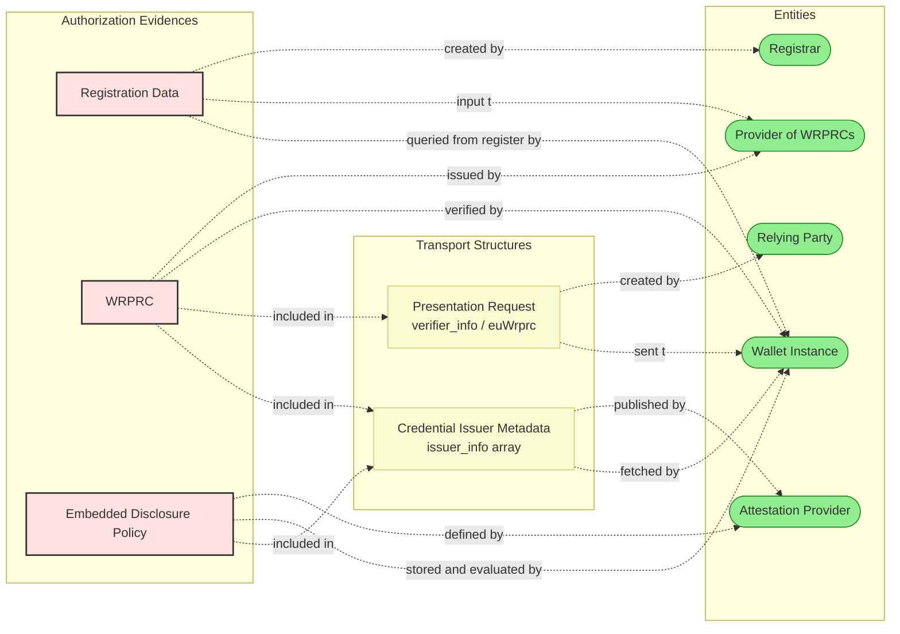
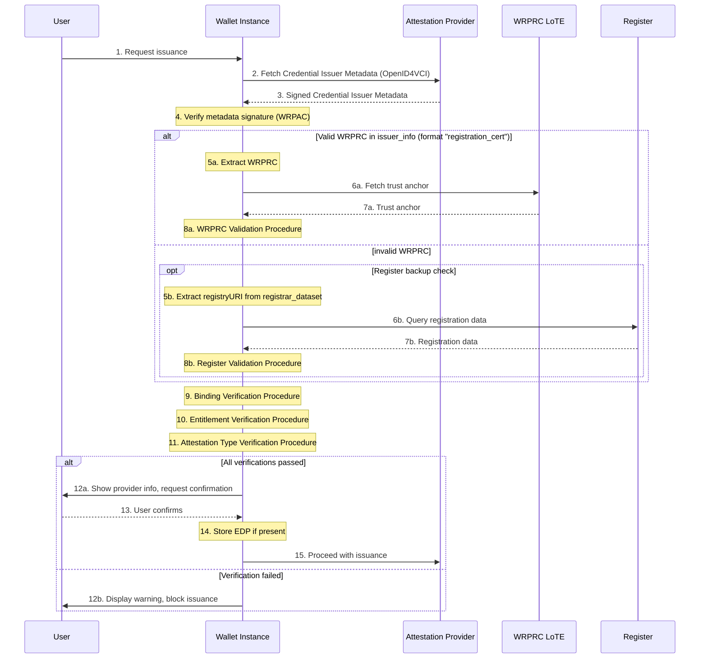
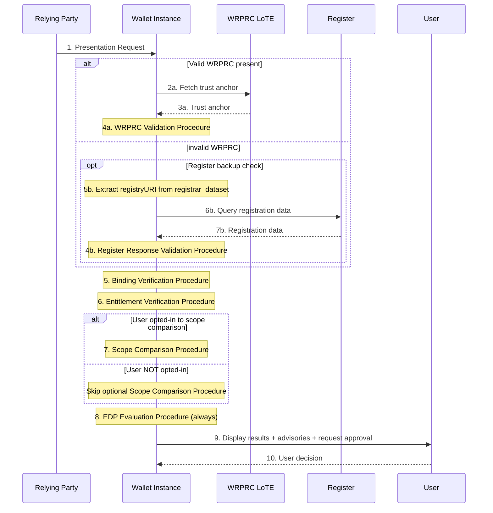
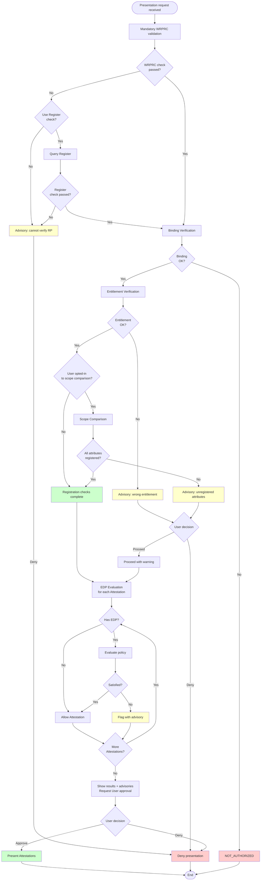

This section specifies the **Authorization Process** that a <components:Wallet Instance> SHALL execute to determine whether an interaction with a <roles:Wallet-Relying Party (WRP)|WRP> is allowed within the APTITUDE ecosystem. A <components:Wallet Instance> SHALL implement all the rules of the Authorization Process defined in this section [`AUTHZ-GEN-03`].

Authorization covers:

- **Issuance Authorization**: whether a <roles:Provider of Person Identification Data (PID Provider)|PID Provider> or <roles:Attestation Provider (AP)|Attestation Provider> is registered for the relevant role and for the specific <data-elements:Attestation Type|Attestation Type(s)> to be issued. This applies to <roles:Provider of Person Identification Data (PID Provider)|PID Providers>, <roles:Provider of Qualified Electronic Attestation of Attributes (QEAA Provider)|QEAA Providers>, <roles:Provider of Public Electronic Attestation of Attributes (PuB-EAA Provider)|PuB-EAA Providers>, and <roles:Provider of Electronic Attestation of Attributes (EAA Provider)|EAA Providers>.
- **Presentation Authorization**: whether a <roles:Relying Party (RP)|RP> request is within its registered scope, whether any <artifacts:Embedded Disclosure Policy (EDP)|EDP> permits disclosure, and whether the <roles:User> approves. This applies to both direct <roles:Relying Party (RP)|RP> and <roles:Relying Party Intermediary (RPI)|RP Intermediary> interactions, and both <protocols:Remote Flow|Remote Flows> and <protocols:Proximity Flow|Proximity Flows>.

#### Preconditions

The Authorization Process SHALL start only after the <roles:Wallet-Relying Party (WRP)|WRP> has been successfully authenticated according to the applicable specifications (see [Authentication Process](../sections/trust-evaluation-process.md#authentication-process)) [`AUTHZ-GEN-01`]. If the <roles:Wallet-Relying Party (WRP)|WRP> has not been authenticated, the Authorization Process SHALL NOT start [`AUTHZ-GEN-02`].

This section defines how the <components:Wallet Instance> SHALL use the already-authenticated <roles:Wallet-Relying Party (WRP)|WRP> context as an input to authorization, including binding checks between the authenticated <roles:Wallet-Relying Party (WRP)|WRP>, the authorization subject, and the <artifacts:Wallet-Relying Party Registration Certificate (WRPRC)|WRPRC> or <components:Register>-derived authorization context.

#### Authorization Framework

This section defines the conceptual model that defines all authorization decisions. It introduces the key concepts (authorization subject, data source hierarchy, decision outcomes, and override principles) that the subsequent sections build upon.

##### Authentication Prerequisite and Authorization Subject

The <components:Wallet Instance> SHALL distinguish between the authenticated <roles:Wallet-Relying Party (WRP)|WRP> and the authorization subject [`AUTHZ-GEN-04`]. The authorization subject is the entity whose authorization is being evaluated:

- **In Issuance**: the <roles:Provider of Person Identification Data (PID Provider)|PID Provider> or <roles:Attestation Provider (AP)|Attestation Provider>.
- **In Direct Presentation**: the <roles:Relying Party (RP)|RP>.
- **In Intermediated Presentation**: the final (intermediated) <roles:Relying Party (RP)|RP>. The authenticated <roles:Wallet-Relying Party (WRP)|WRP> in this case is the <roles:Relying Party Intermediary (RPI)|Intermediary>.

##### Source-Model Neutrality

The issued <artifacts:Wallet-Relying Party Registration Certificate (WRPRC)|WRPRC> SHALL be the primary authorization evidence. The <components:Wallet Instance> MAY use a verified <components:Register> response only for the permitted checks described below [`AUTHZ-GEN-05`]. The substantive authorization logic SHALL NOT change based on the data source [`AUTHZ-GEN-06`].

##### Input Model

The <components:Wallet Instance> SHALL base authorization decisions only on information derived from [`AUTHZ-IN-01`]:

- Already authenticated <roles:Wallet-Relying Party (WRP)|WRP> context.
- A verified <artifacts:Wallet-Relying Party Registration Certificate (WRPRC)|WRPRC>.
- A verified <components:Register> response, if the <components:Wallet Instance> performs one of the permitted <components:Register> checks.
- A verified <artifacts:Embedded Disclosure Policy (EDP)|EDP>, if provided by <roles:Attestation Provider (AP)|Attestation Provider> during issuance.

The <components:Wallet Instance> SHALL maintain an internal distinction between the following input classes [`AUTHZ-IN-02`]:

- **Authenticated <roles:Wallet-Relying Party (WRP)|WRP> Context**: authoritative only for the identity of the <roles:Wallet-Relying Party (WRP)|WRP> [`AUTHZ-IN-03`].
- **Verified <artifacts:Wallet-Relying Party Registration Certificate (WRPRC)|WRPRC>-derived or <components:Register>-derived Information**: authoritative for subject identity, entitlements, intended use, registered scope, intermediary relationship, issuance-type information, and privacy-policy references [`AUTHZ-IN-04`, `AUTHZ-IN-05`].
- **Self-declared Information**: non-authoritative. The <components:Wallet Instance> SHALL NOT rely on self-declared information for checks that require registered information or use it as a fallback when <artifacts:Wallet-Relying Party Registration Certificate (WRPRC)|WRPRC> or <components:Register> validation fails [`AUTHZ-IN-06`, `AUTHZ-IN-10`].
- **Verified <artifacts:Embedded Disclosure Policy (EDP)|EDP>**: authoritative only if available. The <components:Wallet Instance> SHALL rely on <roles:Relying Party (RP)|RP> information to determine access permission [`AUTHZ-EDP-06`].

Self-declared metadata SHALL NOT be used to establish registration, entitlements, scope, intermediary relationships, or issuance authorization.

Where authoritative sources conflict with non-authoritative sources, the authoritative sources SHALL supersede [`AUTHZ-IN-07`]. Where the authenticated <roles:Wallet-Relying Party (WRP)|WRP> context conflicts with the identity or intermediary binding in the verified authorization context, the <components:Wallet Instance> SHALL produce `NOT_AUTHORIZED` (non-overridable) [`AUTHZ-IN-08`].

A request-carried <roles:Registrar> URL SHALL NOT be treated as sufficient proof of registered information by itself; it MAY be used only as a discovery hint unless confirmed by an authoritative source [`AUTHZ-IN-09`].

##### Decision Model

The <components:Wallet Instance> SHALL provide an authorization decision expressed as `AUTHORIZED` or `NOT_AUTHORIZED` [`AUTHZ-UI-01`].

Each evaluation procedure (defined later in this section) gives a granular verification result code when it detects a negative condition. These codes feed into the final decision and into the advisories presented to the <roles:User>.

| Code                              | Phase         | Meaning       |
| `---------------------------------` | :-----------: | ------------- |
| `CERTIFICATE_INVALID`             | Both          | <artifacts:Wallet-Relying Party Registration Certificate (WRPRC)\|WRPRC> validation failed. |
| `FAILED`                          | Both          | Registration data could not be obtained or verified. |
| `WRONG_ENTITLEMENT`               | Both          | Entity entitlement does not match expected role. |
| `ATTESTATION_TYPE_NOT_REGISTERED` | Issuance      | Requested <data-elements:Attestation Type> is not in registered list. |
| `BINDING_FAILED`                  | Both          | Authorization subject does not match authenticated identity. |
| `INTERMEDIARY_NOT_AUTHORIZED`     | Presentation  | <roles:Relying Party Intermediary (RPI)\|Intermediary> association verification failed. |
| `VERIFICATION_PASSED`             | Presentation  | All requested attributes are registered. |
| `OVERASKING_DETECTED`             | Presentation  | Some requested attributes are not registered. |
| `EDP_SATISFIED`                   | Presentation  | <artifacts:Embedded Disclosure Policy (EDP)\|EDP> conditions met. |
| `EDP_NOT_SATISFIED`               | Presentation  | <artifacts:Embedded Disclosure Policy (EDP)\|EDP> conditions not met. |

The Authorization Process SHALL support transparent decision-making and SHALL NOT be a purely hidden backend check [`AUTHZ-UI-05`].

##### Override Principles

A `NOT_AUTHORIZED` decision MAY be either non-overridable (the <components:Wallet Instance> blocks the interaction) or overridable (the <components:Wallet Instance> presents the negative outcome and the <roles:User> MAY choose to proceed).

In **issuance** phase, all negative verification outcomes SHALL NOT be overridable: the <components:Wallet Instance> protects the <roles:User> from providers whose registration cannot be confirmed (per `ISSU_24a`, `ISSU_34a`, `ISSU_34b`).

In **presentation** phase, two specific cases are overridable:

1. Negative scope comparison (per `RPRC_21`: the <roles:User> is informed of unregistered attributes but can proceed).
2. Negative <artifacts:Embedded Disclosure Policy (EDP)|EDP> evaluation (per `EDP_07`: the <roles:User> can deny or allow).

All other presentation failures (binding failures and intermediary binding failures) are non-overridable because they indicate an integrity problem rather than a user-facing choice.

In case of non-overridable failures, the <components:Wallet Instance> SHALL clearly inform the <roles:User> about the negative outcome. User-relevant information about overridable outcomes SHALL be presented as advisories, and the <roles:User> approval SHALL be a separate step from the authorization decision [`AUTHZ-UI-02`, `AUTHZ-UI-03`, `AUTHZ-UI-04`].

!!! note "User Opt-In"

    The *<artifacts:Wallet-Relying Party Registration Certificate (WRPRC)|WRPRC> Validation Procedure* is mandatory. The *Scope Comparison Procedure* is executed only if the <roles:User> enabled scope comparison (`RPRC_16`). Override mechanisms define what happens when the procedure produces a negative result.

The detailed override rules are provided in the [Override Rules](#override-rules) section.

#### Authorization Evidences

This section describes the data objects that carry authorization information such as where they originate, how they are distributed, and what parameters are relevant for authorization decisions. The evaluation procedures that operate on these data objects are defined in the section [Evaluation Procedures](#evaluation-procedures).

##### Registration Overview

<roles:Wallet-Relying Party (WRP)|WRPs> are registered with a <roles:Registrar> in their Member State before operating in the <components:EUDI Wallet> ecosystem. <roles:Relying Party (RP)|RPs> declare one or more intended uses, each with a user-friendly description, the <data-elements:Attestation Type> and optionally the list of attributes needed, the purpose, and a privacy policy link. A <artifacts:Wallet-Relying Party Registration Certificate (WRPRC)|WRPRC> SHALL be issued for each intended use (`RPRC_09`). <roles:Attestation Provider (AP)|Attestation Providers> declare which <data-elements:Attestation Type|Attestation Types> they intend to issue (`RPRC_15`, `RPRC_22a`). <roles:Relying Party Intermediary (RPI)|Intermediaries> are registered as <roles:Relying Party (RP)|RPs> that act on behalf of other <roles:Relying Party (RP)|RPs>; the <artifacts:Wallet-Relying Party Registration Certificate (WRPRC)|WRPRC> of the intermediated <roles:Relying Party (RP)|RP> contains the `intermediary` structure identifying the authorized <roles:Relying Party Intermediary (RPI)|Intermediaries> per [ETSI TS 119 475, Table 10].

!!! choice

    The <artifacts:Wallet-Relying Party Registration Certificate (WRPRC)|WRPRC> SHALL be issued for each intended use, and the <components:Wallet Instance> SHALL perform the <artifacts:Wallet-Relying Party Registration Certificate (WRPRC)|WRPRC> check. The <artifacts:Wallet-Relying Party Registration Certificate (WRPRC)|WRPRC> check is mandatory and SHALL NOT be skipped based on <roles:User> opt-in.

##### Data Object Lifecycle

The following diagram shows the authorization evidences and how they flow between the entities in the ecosystem.

Registration data is collected at the <roles:Registrar> and the <roles:Provider of Wallet-Relying Party Registration Certificate (Provider of WRPRC)|Provider of WRPRC> get it from <roles:Registrar> to provide it through a <artifacts:Wallet-Relying Party Registration Certificate (WRPRC)|WRPRC>. Registration data can also be queried directly by the <components:Wallet Instance> using <roles:Registrar> online services for the permitted backup and binding checks. <artifacts:Wallet-Relying Party Registration Certificate (WRPRC)|WRPRCs> are distributed to the <components:Wallet Instance> through presentation requests (for RPs) or through <artifacts:Credential Issuer Metadata> (for <roles:Attestation Provider (AP)|APs>). EDPs are defined by the <roles:Attestation Provider (AP)|Attestation Provider>, distributed through <artifacts:Credential Issuer Metadata>, stored locally by the <components:Wallet Instance> during issuance, and evaluated at presentation time.

##### Distribution Methods

**Presentation Flows.** <roles:Relying Party (RP)|RPs> include the <artifacts:Wallet-Relying Party Registration Certificate (WRPRC)|WRPRC> in the <artifacts:Presentation Request> by value (`RPRC_19`) in the:

- `verifier_info` parameter included in the <artifacts:Request Object> JWT within the authorization request (<protocols:Remote Flow>, [ETSI TS 119 472-2] and [OpenID4VP, Section 5.1]). This is an array of JSON Objects containg <artifacts:Wallet-Relying Party Registration Certificate (WRPRC)|WRPRC> in base64-encoded format and `RPRC_19a` data including the URL of <roles:Registrar> online service.
- `euWrprc` (<formats:Concise Binary Object Representation (CBOR)|CBOR> byte string with serialized <artifacts:Wallet-Relying Party Registration Certificate (WRPRC)|WRPRC>) member of `requestInfo` included in the ISO DeviceRequest (<protocols:Proximity Flow>, [ETSI TS 119 472-2, Section 5.3]).

!!! warning

    Currently, the mapping of `RPRC_19a` data in the `requestInfo` map is not defined in [ETSI TS 119 472-2]

**Issuance Flow.** <roles:Attestation Provider (AP)|Attestation Providers> include authorization data in <artifacts:Credential Issuer Metadata> through the `issuer_info` array ([ETSI TS 119 472-3, Section 4.2.3]). This array contains:

- An element with format `"registration_cert"` containing the <artifacts:Wallet-Relying Party Registration Certificate (WRPRC)|WRPRC> by value (`ISS-MDATA-REG_CERT-4.2.3-04/05`) (REQUIRED).
- An element with format `"registrar_dataset"` containing self-declared registration information including `identifier`, `srvDescription`, `registryURI`, and `providesAttestations` (`ISS-MDATA-REG_CERT-4.2.3-07 through 13`) (REQUIRED).

Metadata is signed with the <roles:Attestation Provider (AP)|Attestation Provider> <artifacts:Wallet-Relying Party Access Certificate (WRPAC)|WRPAC> private key (`ISSU_22a`). Authorization data cointained in the <artifacts:Embedded Disclosure Policy (EDP)|EDP> is also distributed through <artifacts:Credential Issuer Metadata> within `credential_configurations_supported` field.

#### Registrar Online Service

Each <roles:Registrar> provides an online service accessible via URL, obtained as described in the [Distribution Methods](#distribution-methods) section.

!!! choice

    A <components:Wallet Instance> MAY still use the <components:Register> API to:

    - Check fresh Entity registration information as a backup to a <artifacts:Wallet-Relying Party Registration Certificate (WRPRC)|WRPRC> failure.
    - Check that the <artifacts:Wallet-Relying Party Registration Certificate (WRPRC)|WRPRC> obtained by the <roles:Wallet-Relying Party (WRP)|WRP> is bound to the service with which the <components:Wallet Instance> is interacting.

The <components:Wallet Instance> MAY use this service for either permitted check. The service is queried using the entity unique identifier and, for presentation, the `intended_use_id`. The response provides the same authorization-relevant data as a <artifacts:Wallet-Relying Party Registration Certificate (WRPRC)|WRPRC>. A <components:Register> response SHALL NOT replace the mandatory <artifacts:Wallet-Relying Party Registration Certificate (WRPRC)|WRPRC> issuance or <artifacts:Wallet-Relying Party Registration Certificate (WRPRC)|WRPRC> check. The <roles:Registrar> online service is available through an API interface which is defined in [Register API](../sections/trust-artifacts.md#register).

!!! note

    The <components:Wallet Instance> SHOULD inform the <roles:User> that an external query will be made (privacy consideration per `RPRC_18`).

##### Embedded Disclosure Policy

The <artifacts:Embedded Disclosure Policy (EDP)|EDP> is a set of rules defined by the <roles:Attestation Provider (AP)|Attestation Provider> that restricts which <roles:Relying Party (RP)|RPs> can access specific <credentials:Attestation|Attestations>. The <artifacts:Embedded Disclosure Policy (EDP)|EDP> definition, data model, structure, encoding, and lifecycle are specified in [Embedded Disclosure Policy](../sections/trust-artifacts.md#embedded-disclosure-policy).

For authorization purposes, the following aspects are relevant:

- <artifacts:Embedded Disclosure Policy (EDP)|EDPs> are applicable to <credentials:Qualified Electronic Attestation of Attributes (QEAA)|QEAA>, <credentials:Public Electronic Attestation of Attributes (PuB-EAA)|PuB-EAA>, and <credentials:Electronic Attestation of Attributes (EAA)|EAA>. They are not applicable to <credentials:Person Identification Data (PID)|PID> [`AUTHZ-EDP-01`].
- During issuance, when the <roles:User> confirms, the <components:Wallet Instance> SHALL retrieve and store locally the <artifacts:Embedded Disclosure Policy (EDP)|EDP> if present in the <artifacts:Credential Issuer Metadata> [`AUTHZ-EDP-02`].
- At presentation time, for each <credentials:Attestation|Attestation> matching a request, the <components:Wallet Instance> SHALL check its locally stored <artifacts:Embedded Disclosure Policy (EDP)|EDP> and evaluate it against the requesting <roles:Relying Party (RP)|RP> according to the [EDP Evaluation Procedure](#edp-evaluation-procedure) defined in this section.
- [CIR 2024/2979, Annex III] defines three policy types that the <components:Wallet Instance> SHALL support. In particular:
    - No Policy.
    - Authorized Relying Parties Only.
    - Specific Root of Trust.

#### Evaluation Procedures

This section defines the individual verification procedures that are composed into end-to-end flows in the [Operational Flows](#operational-flows) section. Each procedure is self-contained: it specifies its inputs, its processing logic, and its output (a verification result code). The override behaviour for each procedure's negative outcome is detailed in the [Override Rules](#override-rules) section.

##### WRPRC Validation Procedure

The <components:Wallet Instance> SHALL validate the issued <artifacts:Wallet-Relying Party Registration Certificate (WRPRC)|WRPRC> before relying on it [`AUTHZ-GEN-08`]. If the issued <artifacts:Wallet-Relying Party Registration Certificate (WRPRC)|WRPRC> is absent, the mandatory check fails with `CERTIFICATE_INVALID`.

The validation procedure is:

1. **Format Verification**: confirm `typ` is `rc-wrp+jwt` (remote) or `rc-wrp+cwt` (proximity)  ([ETSI TS 119 475, Section 5.2.1]).
2. **Algorithm Verification**: verify the conformance of signature algorithm (neither `"none"` nor deprecated).
3. **Signature and Certificate Chain Validation**: verify the <artifacts:Wallet-Relying Party Registration Certificate (WRPRC)|WRPRC> signature and validate the chain.
4. **<artifacts:Trust Anchor> Resolution**: fetch the <artifacts:Trust Anchor> for the <roles:Provider of Wallet-Relying Party Registration Certificate (Provider of WRPRC)|Provider of WRPRC> from the <artifacts:List of Trusted Entities (LoTE)|LoTE>. The <components:Wallet Instance> SHALL accept <artifacts:Trust Anchor|Trust Anchors> from all <roles:Provider of Wallet-Relying Party Registration Certificate (Provider of WRPRC)|Provider of WRPRC> <artifacts:List of Trusted Entities (LoTE)|LoTE> (`ISSU_33a`).
5. **Temporal Validity**: check `iat` and `exp` (if present).
6. **Status Verification**: check revocation status via the `status` field (`RPRC_17`).
7. **Coherence Check**: verify <artifacts:Wallet-Relying Party Registration Certificate (WRPRC)|WRPRC> subject and fields are coherent with the scenario [`AUTHZ-GEN-09`].

If any step fails, the procedure outputs `CERTIFICATE_INVALID`. This is not a final authorization decision; the <components:Wallet Instance> MAY use the [Register Validation Procedure](#register-validation-procedure).

##### Register Validation Procedure

When the <components:Wallet Instance> checks the entity's Authorization information, it MAY contact the <components:Register> API [`AUTHZ-GEN-10`]:

1. **Extract <roles:Registrar> URL** from the <artifacts:Presentation Request> (`verifier_info` in remote scenario or `requestInfo` in proximity scanario) during presentation flow, or from <artifacts:Credential Issuer Metadata> (`issuer_info.registry_uri`) during issuance flow. See [Distribution Methods](#distribution-methods) section for details.
2. **Connect** to the <roles:Registrar> online service using HTTPS.
3. **Query** using entity identifier and `intended_use_id` (presentation) or AP identifier (issuance).
4. **Verify Response Signature**: the <components:Wallet Instance> SHALL verify the signature of the response data according to [TS05].
5. **Resolve <roles:Registrar> Trust Chain**: the <components:Wallet Instance> SHALL resolve the trust chain of the signing certificate and verify that the <roles:Registrar> <artifacts:Trust Anchor> is contained in the applicable <roles:Registrar> <artifacts:List of Trusted Entities (LoTE)|LoTE>.
6. **Verify Pertinence**: the <components:Wallet Instance> SHALL verify that the response pertains to the relevant authorization subject and intended use [`AUTHZ-REG-01`, `AUTHZ-REG-02`].
7. **Normalize** <components:Register>-derived data into the same internal model used for <artifacts:Wallet-Relying Party Registration Certificate (WRPRC)|WRPRC> data [`AUTHZ-REG-03`].

If the URL is not present, connection fails, or validation fails, the procedure outputs `FAILED` [`AUTHZ-REG-04`].

There is no further fallback to self-declared metadata. If the <artifacts:Wallet-Relying Party Registration Certificate (WRPRC)|WRPRC> check fails and no <components:Register> check confirms the required authorization, the <components:Wallet Instance> SHALL NOT use self-declared metadata to authorize the interaction or present it as verified [`AUTHZ-IN-10`]. For issuance, the <components:Wallet Instance> SHALL block issuance; for presentation, it SHALL notify the <roles:User>.

##### Binding Verification Procedure

The <components:Wallet Instance> SHALL verify coherence between the authenticated <roles:Wallet-Relying Party (WRP)|WRP> identity and the authorization context, regardless of whether the authorization context is derived from a <artifacts:Wallet-Relying Party Registration Certificate (WRPRC)|WRPRC> or from the <components:Register> [`AUTHZ-GEN-11`]. This procedure ensures that the authenticated entity (through <artifacts:Wallet-Relying Party Access Certificate (WRPAC)|WRPAC>) is the same as the entity described in the authorization data.

###### Common Principle

The <components:Wallet Instance> SHALL compare the <roles:Wallet-Relying Party (WRP)|WRP> identifier extracted from the <artifacts:Wallet-Relying Party Access Certificate (WRPAC)|WRPAC> subject (the `organizationIdentifier` in the subject DN, following [ETSI EN 319 412-1, Clause 5.1.4]) against the authorization subject identifier available from:

- the validated <artifacts:Wallet-Relying Party Registration Certificate (WRPRC)|WRPRC> `sub` field, when the <artifacts:Wallet-Relying Party Registration Certificate (WRPRC)|WRPRC> check succeeds.
- The authorization data (`RPRC_19a`) extracted from the authentication request (`verifier_info` or `requestInfo`) in the presentation scenario.
- The <components:Register> response (if queried).

All available sources SHALL be mutually consistent.

###### Issuance Binding

During issuance, the <components:Wallet Instance> SHALL verify that the <roles:Attestation Provider (AP)|Attestation Provider> that signed the <artifacts:Credential Issuer Metadata> (identified by the <artifacts:Wallet-Relying Party Access Certificate (WRPAC)|WRPAC> in the `x5c` header of the JWS) is the same entity described in the authorization data [`AUTHZ-GEN-11`]. The <components:Wallet Instance> SHALL check coherence between:

- The <roles:Attestation Provider (AP)|Attestation Provider> identifier from the <artifacts:Wallet-Relying Party Access Certificate (WRPAC)|WRPAC> subject (extracted during metadata signature verification).
- The `sub` field from the issued and validated <artifacts:Wallet-Relying Party Registration Certificate (WRPRC)|WRPRC> in `issuer_info`.
- The `identifier` field from a verified <components:Register> response (if queried).

If any pair of these identifiers is inconsistent, the procedure outputs `BINDING_FAILED`. Intermediary detection does not apply to issuance.

###### Presentation Binding -- Intermediary Detection

In presentation, before verifying binding, the <components:Wallet Instance> SHALL check whether the interaction is direct or intermediated [`AUTHZ-INT-01`] by comparing:

- The **authenticated <roles:Wallet-Relying Party (WRP)|WRP> identifier**, extracted from the <artifacts:Wallet-Relying Party Access Certificate (WRPAC)|WRPAC> subject DN.
- The **claimed <roles:Relying Party (RP)|RP> identifier**, extracted from the <artifacts:Presentation Request> fields according to `RPRC_19a` (item b). Following `RPI_06`, in an intermediated scenario these fields pertain to the intermediated <roles:Relying Party (RP)|RP>.

If the two identifiers match, the **direct <roles:Relying Party (RP)|RP> scenario** applies. If they differ, the **<roles:Relying Party Intermediary (RPI)|intermediary> scenario** applies.

###### Direct RP Binding

In the direct <roles:Relying Party (RP)|RP> scenario, the <components:Wallet Instance> SHALL verify that the validated <artifacts:Wallet-Relying Party Registration Certificate (WRPRC)|WRPRC> or verified <components:Register> response is coherent with the already-established identities [`AUTHZ-GEN-12`]:

- The authorization subject identifier from the validated <artifacts:Wallet-Relying Party Registration Certificate (WRPRC)|WRPRC> or verified <components:Register> response SHALL match the authenticated <roles:Wallet-Relying Party (WRP)|WRP> identifier and the claimed <roles:Relying Party (RP)|RP> identifier from authorization data (`RPRC_19a`).

If the <artifacts:Wallet-Relying Party Registration Certificate (WRPRC)|WRPRC> `sub` does not match, the <artifacts:Wallet-Relying Party Registration Certificate (WRPRC)|WRPRC> is not valid for this <roles:Relying Party (RP)|RP>. The procedure outputs `BINDING_FAILED` and the <components:Wallet Instance> SHALL discard the <artifacts:Wallet-Relying Party Registration Certificate (WRPRC)|WRPRC>; it MAY use the [Register Validation Procedure](#register-validation-procedure) for a permitted check.

###### Intermediary Binding

In the intermediary scenario, the <components:Wallet Instance> SHALL perform the following verifications [`AUTHZ-INT-02`]:

**Step 1: Identify the parties.** The <components:Wallet Instance> identifies:

- The **<roles:Relying Party Intermediary (RPI)|Intermediary>**: the entity authenticated via <artifacts:Wallet-Relying Party Access Certificate (WRPAC)|WRPAC>. Its identifier is extracted from the <artifacts:Wallet-Relying Party Access Certificate (WRPAC)|WRPAC> subject DN.
- The **intermediated (final) <roles:Relying Party (RP)|RP>**: the authorization subject. Its identifier and other data are obtained from the validated <artifacts:Wallet-Relying Party Registration Certificate (WRPRC)|WRPRC>, (optionally) a verified <components:Register> response, and/or the <artifacts:Presentation Request> fields.

**Step 2: Verify intermediary association.** The <components:Wallet Instance> SHALL verify that the <roles:Relying Party Intermediary (RPI)|Intermediary> is authorized to act on behalf of the intermediated <roles:Relying Party (RP)|RP>. The verification depends on the available data source:

- **If the <artifacts:Wallet-Relying Party Registration Certificate (WRPRC)|WRPRC> check succeeds**: the <artifacts:Wallet-Relying Party Registration Certificate (WRPRC)|WRPRC> of the intermediated <roles:Relying Party (RP)|RP> SHALL contain the `intermediary` structure (per [ETSI TS 119 475, Table 10]). The <components:Wallet Instance> SHALL verify that `intermediary.sub` matches the authenticated <roles:Relying Party Intermediary (RPI)|Intermediary> identifier from the <artifacts:Wallet-Relying Party Access Certificate (WRPAC)|WRPAC>. The presence of the `intermediary` field in the <artifacts:Wallet-Relying Party Registration Certificate (WRPRC)|WRPRC>, signed by the <roles:Provider of Wallet-Relying Party Registration Certificate (Provider of WRPRC)|Provider of WRPRC>, is authoritative evidence that the relationship is registered.
- **If the <artifacts:Wallet-Relying Party Registration Certificate (WRPRC)|WRPRC> check fails**: the <components:Wallet Instance> MAY query the <components:Register> using the intermediated <roles:Relying Party (RP)|RP> identifier (from `RPRC_19a` item b) and verify in the <components:Register> response that the authenticated <roles:Relying Party Intermediary (RPI)|Intermediary> is listed as an authorized intermediary for that <roles:Relying Party (RP)|RP>.
- **If both <artifacts:Wallet-Relying Party Registration Certificate (WRPRC)|WRPRC> and <components:Register> verification fail**: the <components:Wallet Instance> SHALL NOT confirm the <roles:Relying Party Intermediary (RPI)|Intermediary> relationship.

On failure of <roles:Relying Party Intermediary (RPI)|Intermediary> association verification, the procedure outputs SHALL be `INTERMEDIARY_NOT_AUTHORIZED` [AUTHZ-INT-03].

**Step 3: Verify authorization subject coherence.** The <components:Wallet Instance> SHALL additionally verify that the intermediated <roles:Relying Party (RP)|RP> identifier is consistent across all available sources: the validated <artifacts:Wallet-Relying Party Registration Certificate (WRPRC)|WRPRC> `sub` field when the <artifacts:Wallet-Relying Party Registration Certificate (WRPRC)|WRPRC> check succeeds, the presentation request fields per `RPRC_19a`, and the <components:Register> response (if queried). If any inconsistency is found, the procedure SHALL output `BINDING_FAILED`.

**Step 4: Apply authorization context.** Once the <roles:Relying Party Intermediary (RPI)|Intermediary> association is confirmed, all subsequent authorization checks (entitlement verification, scope comparison, <artifacts:Embedded Disclosure Policy (EDP)|EDP> evaluation) SHALL use the intermediated <roles:Relying Party (RP)|RP> data, not the <roles:Relying Party Intermediary (RPI)|Intermediary> data [`AUTHZ-INT-02`].

**Step 5: Display the final <roles:Relying Party (RP)|RP> identity.** The <components:Wallet Instance> SHALL display to the <roles:User> the intermediated <roles:Relying Party (RP)|RP> identity and intended-use description. The <roles:Relying Party Intermediary (RPI)|Intermediary> identity SHALL NOT be displayed.
The intermediated <roles:Relying Party (RP)|RP> name can be obtained from:

- the `name` (or `sub_ln`) from the validated <artifacts:Wallet-Relying Party Registration Certificate (WRPRC)|WRPRC> or
- the <components:Register> response or
- the <roles:Relying Party (RP)|RP> name from the <artifacts:Presentation Request> fields per `RPRC_19a` (item a).

If the intermediated <roles:Relying Party (RP)|RP> name is not available, the <components:Wallet Instance> SHALL display its identifier instead of the name.

!!! choice "WRPRC and WRPAC Binding"

    As discussed in [#114](https://github.com/APTITUDE-Consortium/wp2-trust-specifications/issues/114), this document does not implement the binding between <artifacts:Wallet-Relying Party Access Certificate (WRPAC)|WRPAC> and <artifacts:Wallet-Relying Party Registration Certificate (WRPRC)|WRPRC> at the service level, as the necessary fields within the certificates are not described in the relevant technical specifications.

!!! note

    The <roles:Registrar> online service API, including the specific parameters for querying <roles:Relying Party Intermediary (RPI)|Intermediary> relationships, is defined in [TS05]. This specification does not define the <components:Register> API; it only defines how the <components:Wallet Instance> uses the <components:Register> response for authorization purposes.

##### Entitlement Verification Procedure

The <components:Wallet Instance> SHALL verify that the entitlements of the authorization subject match the expected role [`AUTHZ-GEN-13`].

For **issuance**, the expected entitlement depends on the provider type:

| Request Type                                                                  | Expected Entitlement URI                                      |
| `-----------------------------------------------------------------------------` | ------------------------------------------------------------- |
| <credentials:Person Identification Data (PID)\|PID>                           | `https://uri.etsi.org/19475/Entitlement/PID_Provider`         |
| <credentials:Qualified Electronic Attestation of Attributes (QEAA)\|QEAA>     | `https://uri.etsi.org/19475/Entitlement/Q_EAA_Provider`       |
| <credentials:Public Electronic Attestation of Attributes (PuB-EAA)\|PuB-EAA>  | `https://uri.etsi.org/19475/Entitlement/PuB_EAA_Provider`     |
| <credentials:Electronic Attestation of Attributes (EAA)\|EAA>                 | `https://uri.etsi.org/19475/Entitlement/Non_Q_EAA_Provider`   |

For **presentation**, the expected entitlement is `https://uri.etsi.org/19475/Entitlement/Service_Provider`.

If the `entitlements` array does not contain the expected value, the procedure SHALL output `WRONG_ENTITLEMENT`.

##### Attestation Type Verification Procedure (Issuance Only)

The <components:Wallet Instance> SHALL verify that the <credentials:Person Identification Data (PID)|PID> or <data-elements:Attestation Type> being requested is registered for the provider [`AUTHZ-ISS-02`]:

- For <roles:Provider of Person Identification Data (PID Provider)|PID Providers> issuing <credentials:Person Identification Data (PID)|PID>, the <components:Wallet Instance> MAY skip this step.
- Otherwise, the <components:Wallet Instance> SHALL match the `provides_attestations[]` array against the `credential_configurations_supported` keys in <artifacts:Credential Issuer Metadata>. Matching SHALL be case-sensitive and exact (`vct_value` for <formats:Selective Disclosure JWT (SD-JWT)|SD-JWT> VC, `doctype` for mDL).

If not found, the procedure SHALL output `ATTESTATION_TYPE_NOT_REGISTERED`.

##### Scope Comparison Procedure (Presentation Only, user-optional)

The <components:Wallet Instance> SHALL [`AUTHZ-PRES-01`]:

1. Extract requested attributes: from `credential_queries[].claims[]` (remote/DCQL) or from `namespaces` (proximity).
2. Compare against registered scope: match `credentials[].claim[]` and `credentials[].meta.vct_values` or `doctype_value` in the authorization context. Matching SHALL be case-sensitive and exact.

If all match, the <components:Wallet Instance> SHALL output `VERIFICATION_PASSED`. Otherwise, the <components:Wallet Instance> SHALL output `OVERASKING_DETECTED` and identify the unregistered attributes [`AUTHZ-PRES-02`].

##### EDP Evaluation Procedure

For each <credentials:Attestation> matching a <artifacts:Presentation Request>, the <components:Wallet Instance> SHALL check for a locally stored <artifacts:Embedded Disclosure Policy (EDP)|EDP> [`AUTHZ-EDP-03`]. If no <artifacts:Embedded Disclosure Policy (EDP)|EDP> exists, the <credentials:Attestation> is allowed (subject to User approval). Otherwise:

In case of **Authorized Relying Parties Only** policy type [`AUTHZ-EDP-04`]:

- Detect <roles:Relying Party Intermediary (RPI)|Intermediary> scenario.
- Extract the identity information of the <roles:Relying Party (RP)|RP> (direct) or intermediated <roles:Relying Party (RP)|RP>. The <components:Wallet Instance> SHALL NOT use the <roles:Relying Party Intermediary (RPI)|Intermediary> identity.
- Match against the `authorized_parties` list: compare the <roles:Relying Party (RP)|RP> subject DN from <artifacts:Wallet-Relying Party Access Certificate (WRPAC)|WRPAC> against `subject_dn` entries, and/or compare the <roles:Relying Party (RP)|RP> entitlements or sub-entitlements from the validated <artifacts:Wallet-Relying Party Registration Certificate (WRPRC)|WRPRC> or verified <components:Register> response against `entitlement_uri` entries. A match on either criterion is sufficient.

If the checks are successful, the <components:Wallet Instance> SHALL provide `EDP_SATISFIED` as output result, otherwise the <components:Wallet Instance> SHALL provide `EDP_NOT_SATISFIED`.

In case of **Specific Root of Trust** policy type [`AUTHZ-EDP-05`] and according to direct/intermediary scenario:

- For direct <roles:Relying Party (RP)|RP>, the <components:Wallet Instance> SHALL extract issuer DN and serial number from the root or intermediate certificates in the <artifacts:Wallet-Relying Party Access Certificate (WRPAC)|WRPAC> chain.
- For intermediary, the <components:Wallet Instance> SHALL retrieve root certificate information of the <roles:Provider of Wallet-Relying Party Registration Certificate (Provider of WRPRC)|Provider of WRPRC> for the intermediated <roles:Relying Party (RP)|RP>. Then, the <components:Wallet Instance> SHALL compare against the `trusted_roots` list and match `issuer_dn` using LDAP DN comparison and `serial_number` using integer comparison (as defined in `ISS-MDATA-EBD-4.2.5.2-09`). If the check is satisfied, the <components:Wallet Instance> SHALL output: `EDP_SATISFIED` or `EDP_NOT_SATISFIED`.

The <components:Wallet Instance> SHALL evaluate <artifacts:Embedded Disclosure Policy (EDP)|EDP> together with <roles:Relying Party (RP)|RP> information to determine access permission (`EDP_06`) [`AUTHZ-EDP-06`].
If `EDP_SATISFIED`, the <components:Wallet Instance> SHALL allow the <credentials:Attestation> presentation (subject to <roles:User> approval) and display explanatory link if present (`EDP_05`) [`AUTHZ-EDP-07`].
If `EDP_NOT_SATISFIED`, the <components:Wallet Instance> SHALL produce `NOT_AUTHORIZED`, present the outcome, and allow <roles:User> override (`EDP_07`) [`AUTHZ-EDP-08`].
If the <roles:User> denies, the <components:Wallet Instance> SHALL behave as if the <credentials:Attestation> does not exist (`RPA_11`).

#### Override Rules

This section details the override behaviour for each procedure when it provides a negative outcome. Each row identifies a procedure, the phase in which it applies, the result code produced on failure, and whether the <roles:User> can override that outcome.

| Evaluation Procedure      | Phase     | Negative Outcome  | User Override |
| `-------------------------` | :-------: | :---------------: | ------------- |
| <artifacts:Wallet-Relying Party Registration Certificate (WRPRC)\|WRPRC> Validation | Both | `CERTIFICATE_INVALID` | <components:Register> APIs MAY be used for one of the permitted checks. <roles:User> is not involved. |
| <components:Register> Validation | Issuance | `FAILED` | Non-overridable [`AUTHZ-ISS-01`, `AUTHZ-UI-06`]. |
| <components:Register> Validation | Presentation | `FAILED` | Overridable. Advisory to User [`AUTHZ-PRES-06`]. |
| Binding Verification | Issuance | `BINDING_FAILED` | Non-overridable [`AUTHZ-UI-06`]. |
| Binding Verification (direct <roles:Relying Party (RP)\|RP>) | Presentation | `BINDING_FAILED` | Non-overridable [`AUTHZ-UI-06`]. |
| Binding Verification (<roles:Relying Party Intermediary (RPI)\|Intermediary>) | Presentation | `INTERMEDIARY_NOT_AUTHORIZED` | Non-overridable [`AUTHZ-INT-03`, `AUTHZ-UI-06`]. |
| <data-elements:Entitlement> Verification | Issuance | `WRONG_ENTITLEMENT` | Non-overridable [`AUTHZ-ISS-01`, `AUTHZ-UI-06`]. |
| <data-elements:Entitlement> Verification | Presentation | `WRONG_ENTITLEMENT` | Overridable. Advisory to User. |
| <data-elements:Attestation Type> Verification | Issuance | `ATTESTATION_TYPE_NOT_REGISTERED` | Non-overridable [`AUTHZ-ISS-03`, `AUTHZ-UI-06`]. |
| Scope Comparison | Presentation | `OVERASKING_DETECTED` | Overridable. Advisory to User [`AUTHZ-PRES-02`]. |
| <artifacts:Embedded Disclosure Policy (EDP)\|EDP> Evaluation | Presentation | `EDP_NOT_SATISFIED` | Overridable. User can deny or allow [`AUTHZ-EDP-08`]. |

#### Operational Flows

This section combines the evaluation procedures defined above into end-to-end flows for issuance and presentation.

##### Authorization During Issuance

###### Interaction Flow

###### Step-by-step Operations

**Steps 1-3: Obtain <artifacts:Credential Issuer Metadata>.** The <components:Wallet Instance> SHALL fetch metadata from the <roles:Attestation Provider (AP)|Attestation Provider> using [OpenID4VCI] (`ISSU_01`) [`AUTHZ-ISS-04`]. These steps are not required if the <components:Wallet Instance> already has the <artifacts:Credential Issuer Metadata> stored locally, for example if it is already fetched during the Authentication Process.

**Step 4: Verify Metadata Signature.** The <components:Wallet Instance> SHALL verify the metadata signature and <artifacts:Wallet-Relying Party Access Certificate (WRPAC)|WRPAC> certificate chain [`AUTHZ-ISS-05`]. If verification fails, the <components:Wallet Instance> provides `NOT_AUTHORIZED` code (non-overridable) [`AUTHZ-ISS-06`].

**Steps 5-8: Extract Authorization Data.** The <components:Wallet Instance> SHALL extract data from the `issuer_info` array [`AUTHZ-ISS-07`] and SHALL validate the required <artifacts:Wallet-Relying Party Registration Certificate (WRPRC)|WRPRC> using the *<artifacts:Wallet-Relying Party Registration Certificate (WRPRC)|WRPRC> Validation Procedure*. If the <artifacts:Wallet-Relying Party Registration Certificate (WRPRC)|WRPRC> is missing or invalid, the <components:Wallet Instance> MAY use the *<components:Register> Validation Procedure* for a backup check. If the <artifacts:Wallet-Relying Party Registration Certificate (WRPRC)|WRPRC> check succeeds, the <components:Wallet Instance> MAY use the <components:Register> for the permitted service-binding check. If the <artifacts:Wallet-Relying Party Registration Certificate (WRPRC)|WRPRC> check fails and no permitted components:Register> check confirms the required authorization, the <components:Wallet Instance> SHALL NOT use self-declared data as a fallback and SHALL block issuance [`AUTHZ-ISS-08`], [`AUTHZ-ISS-09`].

**Step 9: Binding Verification.** Apply the *Binding Verification Procedure* (issuance binding): verify that the <roles:Attestation Provider (AP)|Attestation Provider> identifier from the <artifacts:Wallet-Relying Party Access Certificate (WRPAC)|WRPAC> (used to sign the metadata) is coherent with the `sub` in the <artifacts:Wallet-Relying Party Registration Certificate (WRPRC)|WRPRC> and the `identifier` in a verified <components:Register> response, if queried [`AUTHZ-GEN-11`]. If incoherent, the <components:Wallet Instance> returns `NOT_AUTHORIZED` code (non-overridable).

**Step 10: <data-elements:Entitlement> Verification.** Apply the *<data-elements:Entitlement> Verification Procedure*. If not confirmed, the <components:Wallet Instance> provides `NOT_AUTHORIZED` code (non-overridable) [`AUTHZ-ISS-01`].

**Step 11: <data-elements:Attestation Type> Verification.** Apply the *<data-elements:Attestation Type> Verification Procedure*. If not found, the <components:Wallet Instance> returns `NOT_AUTHORIZED` code (non-overridable) [`AUTHZ-ISS-02`, `AUTHZ-ISS-03`].

**Steps 12-15: User Confirmation and <artifacts:Embedded Disclosure Policy (EDP)|EDP> Storage.** Display <roles:Attestation Provider (AP)|Attestation Provider> information [`AUTHZ-ISS-10`, `AUTHZ-UI-09`]. On confirmation, the <components:Wallet Instance> store the <artifacts:Embedded Disclosure Policy (EDP)|EDP> locally if present (`EDP_09`) [`AUTHZ-EDP-02`] and proceed. On cancellation, terminate.

##### Authorization During Presentation

###### Common Authorization Semantics

The authorization logic is the same for remote and proximity flows [`AUTHZ-PRES-03`]. Main Differences are limited to:

- Transport mechanism.
- Where the <artifacts:Wallet-Relying Party Registration Certificate (WRPRC)|WRPRC> is extracted from.
- <artifacts:Wallet-Relying Party Registration Certificate (WRPRC)|WRPRC> format (JWT vs CWT).
- <artifacts:Wallet-Relying Party Registration Certificate (WRPRC)|WRPRC> data structure.

###### Interaction Flow

###### Step-by-step Operations

**Step 1: Receive Request.** The <components:Wallet Instance> SHALL perform the mandatory <artifacts:Wallet-Relying Party Registration Certificate (WRPRC)|WRPRC> check. The <roles:User> setting applies only to the optional Scope Comparison Procedure [`AUTHZ-PRES-04`].

!!! note

    The <components:Wallet Instance> always executes <artifacts:Wallet-Relying Party Registration Certificate (WRPRC)|WRPRC> validation, binding verification, and entitlement verification (steps 2-6). If the <artifacts:Wallet-Relying Party Registration Certificate (WRPRC)|WRPRC> check fails, the <components:Wallet Instance> MAY use the <components:Register> API to retrieve the necessary informations. <artifacts:Embedded Disclosure Policy (EDP)|EDP> evaluation (step 8) is always executed.

**Steps 2-4: Collect Authorization Evidence.** Extract the required <artifacts:Wallet-Relying Party Registration Certificate (WRPRC)|WRPRC> from the request [`AUTHZ-PRES-05`]: from `verifier_info` (remote) or `euWrprc` in `requestInfo` (proximity), and apply the *<artifacts:Wallet-Relying Party Registration Certificate (WRPRC)|WRPRC> Validation Procedure*. If the <artifacts:Wallet-Relying Party Registration Certificate (WRPRC)|WRPRC> is missing or invalid, the <components:Wallet Instance> MAY use the *<components:Register> Validation Procedure*. If the <artifacts:Wallet-Relying Party Registration Certificate (WRPRC)|WRPRC> check succeeds, the <components:Wallet Instance> MAY use the <components:Register> to check that the certificate obtained by the <roles:Wallet-Relying Party (WRP)|WRP> is bound to the service being used. If a lookup fails, the <components:Wallet Instance> SHALL NOT use self-declared metadata as a fallback; instead it SHALL notify the User, record `FAILED`, and proceed only with the presentation advisory and override rules [`AUTHZ-PRES-06`].

**Step 5: Binding Verification.** Apply the *Binding Verification Procedure* (direct or intermediary) [`AUTHZ-PRES-07`].

**Step 6: <data-elements:Entitlement> Verification.** Apply the *<data-elements:Entitlement> Verification Procedure* for `Service_Provider` [`AUTHZ-PRES-08`].

**Step 7: Scope Comparison.** Apply the *Scope Comparison Procedure*. Inform the User of results [`AUTHZ-PRES-09`].

**Step 8: <artifacts:Embedded Disclosure Policy (EDP)|EDP> Evaluation.** Always executed regardless of registration verification [`AUTHZ-EDP-09`]. Apply the *<artifacts:Embedded Disclosure Policy (EDP)|EDP> Evaluation Procedure* for each matching <credentials:Attestation>.

**Steps 9-10: User Approval.** Present all results and request approval [`AUTHZ-UI-07`, `AUTHZ-UI-10`]. Display at least [`AUTHZ-UI-08`, `AUTHZ-INT-05`]:

- <roles:Relying Party (RP)|RP>/final <roles:Relying Party (RP)|RP> identity,
- requested attributes,
- intended-use description,
- privacy-policy link,  
- advisories.

If `AUTHORIZED`, the <components:Wallet Instance> SHALL proceed to normal User approval. If `NOT_AUTHORIZED` and override is allowed, the <components:Wallet Instance> SHALL present the negative outcome and MAY allow continuation [`AUTHZ-UI-11`]. If `NOT_AUTHORIZED` and override is not allowed, the <components:Wallet Instance> SHALL NOT allow continuation [`AUTHZ-UI-12`].

###### Remote Flow Specifics

The <components:Relying Party Instance> SHALL include `RPRC_19a` extension fields and the <artifacts:Wallet-Relying Party Registration Certificate (WRPRC)|WRPRC> by value (`RPRC_19`) [`AUTHZ-PRES-10`]. The <artifacts:Wallet-Relying Party Registration Certificate (WRPRC)|WRPRC> SHALL be JWT (`typ = "rc-wrp+jwt"`). Requested attributes SHALL be extracted from DCQL `credential_queries[].claims[]` paths.

###### Proximity Flow Specifics

The <artifacts:Wallet-Relying Party Registration Certificate (WRPRC)|WRPRC> is extracted from `euWrprc` in `requestInfo` according to [ETSI TS 119 472-2] [`AUTHZ-PRES-11`]. The <artifacts:Wallet-Relying Party Registration Certificate (WRPRC)|WRPRC> SHALL be CWT (`typ = "rc-wrp+cwt"`), signing algorithm from COSE header. Requested attributes SHALL be extracted from `docRequest.itemRequest.nameSpaces`.

###### Intermediary Handling

<roles:Relying Party Intermediary (RPI)|Intermediary> handling applies to both flows [`AUTHZ-INT-04`]. The <components:Wallet Instance> SHALL:

- Authenticate the <roles:Relying Party Intermediary (RPI)|Intermediary> through its <artifacts:Wallet-Relying Party Access Certificate (WRPAC)|WRPAC>.
- Detect the <roles:Relying Party Intermediary (RPI)|Intermediary> scenario.
- Apply all authorization checks using the intermediated <roles:Relying Party (RP)|RP> context.
- Display the intermediated <roles:Relying Party (RP)|RP> identity; the <roles:Relying Party Intermediary (RPI)|Intermediary> identity SHALL NOT be displayed.

Negative cases SHALL result in `NOT_AUTHORIZED` code [`AUTHZ-INT-06`]. Override is allowed only for negative scope and negative <artifacts:Embedded Disclosure Policy (EDP)|EDP> [`AUTHZ-INT-07`].

###### Combined Mechanisms Flowchart

#### Authorization Requirements

!!! note

    This table is provided for implementation and conformance-verification purposes. It consolidates the normative requirements defined throughout the specification body. In case of interpretative ambiguity between this table and the normative sections of the specification, the normative sections SHALL prevail.

| ID                | Requirement   | Phase     | Related HLRs  |
| :---------------: | ------------- | :-------: | ------------- |
| `AUTHZ-GEN-01`    | The Authorization Process SHALL start only after the <roles:Wallet-Relying Party (WRP)\|WRP> has been successfully authenticated. | Both | -- |
| `AUTHZ-GEN-02`    | If the <roles:Wallet-Relying Party (WRP)\|WRP> has not been authenticated, the Authorization Process SHALL NOT start. | Both | -- |
| `AUTHZ-GEN-03`    | A conformant wallet SHALL implement all rules of the Authorization Process defined in this specification. | Both | -- |
| `AUTHZ-GEN-04`    | The <components:Wallet Instance> SHALL distinguish between the authenticated <roles:Wallet-Relying Party (WRP)\|WRP> and the authorization subject. | Both | -- |
| `AUTHZ-GEN-05`    | The <components:Wallet Instance> SHALL use the issued <artifacts:Wallet-Relying Party Registration Certificate (WRPRC)\|WRPRC> as the primary authorization evidence and MAY use a verified <components:Register> response. | Both | `RPRC_16`, `RPRC_18` |
| `AUTHZ-GEN-06`    | The authorization logic SHALL NOT change based on the data source. | Both | -- |
| `AUTHZ-GEN-07`    | Where both <artifacts:Wallet-Relying Party Registration Certificate (WRPRC)\|WRPRC> and <components:Register> data are available, the <components:Wallet Instance> SHALL normalize both into the same model. | Both | -- |
| `AUTHZ-GEN-08`    | The <components:Wallet Instance> SHALL validate the issued <artifacts:Wallet-Relying Party Registration Certificate (WRPRC)\|WRPRC> for authenticity, integrity, temporal validity, status, and scenario coherence before relying on it. | Both | `RPRC_17` |
| `AUTHZ-GEN-09`    | <artifacts:Wallet-Relying Party Registration Certificate (WRPRC)\|WRPRC> validation SHALL include coherence check between <artifacts:Wallet-Relying Party Registration Certificate (WRPRC)\|WRPRC> subject and scenario context. | Both | -- |
| `AUTHZ-GEN-10`    | The <components:Wallet Instance> MAY use the <components:Register> APIs only to check fresh entity registration information as a backup to a <artifacts:Wallet-Relying Party Registration Certificate (WRPRC)\|WRPRC> failure or to check that the <artifacts:Wallet-Relying Party Registration Certificate (WRPRC)\|WRPRC> obtained by the <roles:Wallet-Relying Party (WRP)\|WRP> is bound to the service being used. | Both | `RPRC_18` |
| `AUTHZ-GEN-11`    | The <components:Wallet Instance> SHALL verify coherence between authenticated <roles:Wallet-Relying Party (WRP)\|WRP> and authorization context in both issuance and presentation. | Both | -- |
| `AUTHZ-GEN-12`    | For direct <roles:Relying Party (RP)\|RP> in presentation, the <components:Wallet Instance> SHALL verify <roles:Relying Party (RP)\|RP> identifier from <artifacts:Wallet-Relying Party Access Certificate (WRPAC)\|WRPAC> matches `sub` in authorization context and RPRC_19a identifier. For issuance, the <components:Wallet Instance> SHALL verify AP identifier from <artifacts:Wallet-Relying Party Access Certificate (WRPAC)\|WRPAC> matches `sub` in <artifacts:Wallet-Relying Party Registration Certificate (WRPRC)\|WRPRC> and `identifier` in a verified <components:Register> response, if queried. | Both | `RPRC_07`, `RPRC_08` |
| `AUTHZ-GEN-13`    | The <components:Wallet Instance> SHALL verify that entitlements match the expected role. | Both | `ISSU_24a`, `ISSU_34a` |
| `AUTHZ-IN-01`     | Authorization decisions SHALL be based only on authenticated context, verified <artifacts:Wallet-Relying Party Registration Certificate (WRPRC)\|WRPRC>, verified <components:Register>, or verified <artifacts:Embedded Disclosure Policy (EDP)\|EDP>. | Both | -- |
| `AUTHZ-IN-02`     | The <components:Wallet Instance> SHALL maintain internal distinction between input classes. | Both | -- |
| `AUTHZ-IN-03`     | Authenticated <roles:Wallet-Relying Party (WRP)\|WRP> context is authoritative only for <roles:Wallet-Relying Party (WRP)\|WRP> identity. | Both | -- |
| `AUTHZ-IN-04`     | Verified <artifacts:Wallet-Relying Party Registration Certificate (WRPRC)\|WRPRC>-derived information is authoritative for subject identity, entitlements, scope, etc. | Both | -- |
| `AUTHZ-IN-05`     | Verified <components:Register>-derived information is authoritative for the same data set. | Both | -- |
| `AUTHZ-IN-06`     | The <components:Wallet Instance> SHALL NOT use self-declared information for checks requiring registered information or as a fallback when <artifacts:Wallet-Relying Party Registration Certificate (WRPRC)\|WRPRC> or <components:Register> validation fails. | Both | `ISSU_24a` note, `ISSU_34a` note |
| `AUTHZ-IN-07`     | Authoritative sources SHALL prevail over non-authoritative sources. | Both | -- |
| `AUTHZ-IN-08`     | Identity conflict between authenticated context and authorization context produces `NOT_AUTHORIZED` (non-overridable). | Both | -- |
| `AUTHZ-IN-09`     | A request-carried <components:Register> URL SHALL NOT be treated as proof of registration; MAY be used as a discovery hint. | Both | -- |
| `AUTHZ-IN-10`     | Self-declared metadata SHALL NOT be used as an authorization fallback when <artifacts:Wallet-Relying Party Registration Certificate (WRPRC)\|WRPRC> or <components:Register> validation fails. | Both | `RPRC_18`, `ISSU_24a` note |
| `AUTHZ-UI-01`     | The <components:Wallet Instance> SHALL produce `AUTHORIZED` or `NOT_AUTHORIZED`. | Both | -- |
| `AUTHZ-UI-02`     | User-relevant limitations SHALL be represented as advisories. | Both | -- |
| `AUTHZ-UI-03`     | Advisories SHALL be displayed to the User. | Both | -- |
| `AUTHZ-UI-04`     | User approval SHALL be a separate step from the authorization decision. | Both | `RPA_07` |
| `AUTHZ-UI-05`     | The process SHALL support transparent decision-making and SHALL NOT be purely hidden. | Both | [CIR 2025/848] |
| `AUTHZ-UI-06`     | Non-overridable cases: provider role/type failure in issuance, metadata signature failure, coherence failure, intermediary binding failure, registration status failure, missing minimum info, inability to obtain required authoritative info for issuance. | Both | `ISSU_24a`, `ISSU_34a`, `RPRC_23` |
| `AUTHZ-UI-07`     | For presentation, the <components:Wallet Instance> SHALL present all results and advisories and request User approval. | Presentation | `RPA_07` |
| `AUTHZ-UI-08`     | For presentation, the <components:Wallet Instance> SHALL show at minimum: <roles:Relying Party (RP)\|RP>/final <roles:Relying Party (RP)\|RP> identity, requested attributes, intended-use, privacy-policy, advisories. The intermediary identity SHALL NOT be displayed. | Presentation | `RPRC_19a` |
| `AUTHZ-UI-09`     | For issuance, the <components:Wallet Instance> SHALL show at minimum: provider name/type, attestation type, service description, advisories. | Issuance | `RPRC_22a` |
| `AUTHZ-UI-10`     | If `AUTHORIZED`, proceed to normal User approval. | Both | `RPA_07` |
| `AUTHZ-UI-11`     | If `NOT_AUTHORIZED` and override allowed, present negative outcome and MAY allow continuation. | Both | `EDP_07`, `RPRC_21` |
| `AUTHZ-UI-12`     | If `NOT_AUTHORIZED` and override not allowed, SHALL NOT allow continuation. | Both | `ISSU_24a`, `ISSU_34a` |
| `AUTHZ-ISS-01`    | If provider entitlement is not confirmed, produce `NOT_AUTHORIZED` (non-overridable), SHALL NOT request issuance. | Issuance | `ISSU_24a`, `ISSU_34a`, `RPRC_23` |
| `AUTHZ-ISS-02`    | The <components:Wallet Instance> SHALL verify that the <credentials:Person Identification Data (PID)\|PID> or <data-elements:Attestation Type> is registered for the provider. | Issuance | `ISSU_34b`, `RPRC_23` |
| `AUTHZ-ISS-03`    | If the <data-elements:Attestation Type> is not registered, produce `NOT_AUTHORIZED` (non-overridable), SHALL NOT request issuance. | Issuance | `ISSU_34b`, `RPRC_23` |
| `AUTHZ-ISS-04`    | The <components:Wallet Instance> SHALL fetch Credential Issuer Metadata via OpenID4VCI. | Issuance | ISSU_01 |
| `AUTHZ-ISS-05`    | The <components:Wallet Instance> SHALL verify metadata signature and <artifacts:Wallet-Relying Party Access Certificate (WRPAC)\|WRPAC> certificate chain. | Issuance | `ISSU_22a`, `ISSU_32a` |
| `AUTHZ-ISS-06`    | If metadata signature verification fails, produce `NOT_AUTHORIZED` (non-overridable). | Issuance | -- |
| `AUTHZ-ISS-07`    | The <components:Wallet Instance> SHALL extract authorization data from issuer_info per [ETSI TS 119 472-3, Section 4.2.3]. | Issuance | `RPRC_22` |
| `AUTHZ-ISS-08`    | If <artifacts:Wallet-Relying Party Registration Certificate (WRPRC)\|WRPRC> validation fails and no permitted <components:Register> check confirms the required authorization, the <components:Wallet Instance> SHALL NOT use self-declared metadata as a fallback and SHALL block issuance. | Issuance | `ISSU_24a` note |
| `AUTHZ-ISS-09`    | The <components:Wallet Instance> SHALL NOT use self-declared metadata to authorize issuance or present it as verified registration information. | Issuance | `ISSU_24a` note |
| `AUTHZ-ISS-10`    | On successful verification and User confirmation, proceed with issuance and store <artifacts:Embedded Disclosure Policy (EDP)\|EDP>. | Issuance | `EDP_09` |
| `AUTHZ-PRES-01`   | If User opted-in and registered scope available, the <components:Wallet Instance> SHALL compare requested attributes against registered scope. | Presentation | RPRC_16, RPRC_21 |
| `AUTHZ-PRES-02`   | If unregistered attributes detected, identify them and notify User. Override permitted. | Presentation | `RPRC_21` |
| `AUTHZ-PRES-03`   | Authorization logic SHALL be the same for <protocols:Remote Flow\|Remote> and <protocols:Proximity Flow\|Proximity> flows. | Presentation | `OIA_01` |
| `AUTHZ-PRES-04`   | The <components:Wallet Instance> SHALL offer a User setting for optional scope comparison, enabled by default. The setting SHALL NOT disable the mandatory <artifacts:Wallet-Relying Party Registration Certificate (WRPRC)\|WRPRC> check. | Presentation | `RPRC_16` |
| `AUTHZ-PRES-05`   | The <components:Wallet Instance> SHALL extract <artifacts:Wallet-Relying Party Registration Certificate (WRPRC)\|WRPRC> per applicable flow (verifier_info or euWrprc). | Presentation | `RPRC_19`, `RPRC_20` |
| `AUTHZ-PRES-06`   | If authorization data cannot be obtained, the <components:Wallet Instance> SHALL NOT use self-declared metadata as a fallback; it SHALL notify User and proceed only with an advisory and the applicable override rules. | Presentation | `RPRC_18` |
| `AUTHZ-PRES-07`   | The <components:Wallet Instance> SHALL verify entitlements and binding after data extraction. | Presentation | `RPRC_16` |
| `AUTHZ-PRES-08`   | The <components:Wallet Instance> SHALL verify `Service_Provider` entitlement. | Presentation | -- |
| `AUTHZ-PRES-09`   | The <components:Wallet Instance> SHALL inform User of scope comparison results. | Presentation | `RPRC_21` |
| `AUTHZ-PRES-10`   | <protocols:Remote Flow\|Remote>: <components:Relying Party Instance\|RP Instance> SHALL include `RPRC_19a` extension fields and the <artifacts:Wallet-Relying Party Registration Certificate (WRPRC)\|WRPRC> by value. | Presentation | `RPRC_19`, `RPRC_19a` |
| `AUTHZ-PRES-11`   | <protocols:Proximity Flow\|Proximity>: <artifacts:Wallet-Relying Party Registration Certificate (WRPRC)\|WRPRC> SHALL be CWT, attributes from device request <data-elements:Namespace\|namespaces>. | Presentation | `RPRC_20`, `OIA_01` |
| `AUTHZ-INT-01`    | <roles:Relying Party Intermediary (RPI)\|Intermediary> scenario detected when <artifacts:Wallet-Relying Party Access Certificate (WRPAC)\|WRPAC> subject identifier differs from `RPRC_19a` claimed <roles:Relying Party (RP)\|RP> identifier. Detection is performed before <artifacts:Wallet-Relying Party Registration Certificate (WRPRC)\|WRPRC> examination. | Presentation | `RPI_07` |
| `AUTHZ-INT-02`    | In <roles:Relying Party Intermediary (RPI)\|Intermediary> scenarios, authorization inputs SHALL apply to intermediated <roles:Relying Party (RP)\|RP>; <components:Wallet Instance> SHALL verify <roles:Relying Party Intermediary (RPI)\|Intermediary> association. | Presentation | `RPI_01`-`RPI_10` |
| `AUTHZ-INT-03`    | If <roles:Relying Party Intermediary (RPI)\|Intermediary> binding fails, produce `NOT_AUTHORIZED` (non-overridable). | Presentation | `RPI_07a` |
| `AUTHZ-INT-04`    | <roles:Relying Party Intermediary (RPI)\|Intermediary> handling applies to both remote and proximity flows. | Presentation | `RPI_01`-`RPI_10` |
| `AUTHZ-INT-05`    | For intermediated presentation, the <components:Wallet Instance> SHALL process and display the minimum required fields about the final <roles:Relying Party (RP)\|RP>; the <roles:Relying Party Intermediary (RPI)\|Intermediary> identity SHALL NOT be displayed. | Presentation | `RPRC_19a` |
| `AUTHZ-INT-06`    | Negative cases for intermediated presentation: missing final <roles:Relying Party (RP)\|RP> info, binding failure, missing authoritative data, negative <artifacts:Embedded Disclosure Policy (EDP)\|EDP>, negative scope. | Presentation | -- |
| `AUTHZ-INT-07`    | Override permitted only for negative scope and negative <artifacts:Embedded Disclosure Policy (EDP)\|EDP> in intermediated presentation. | Presentation | `EDP_07`, `RPRC_21` |
| `AUTHZ-REG-01`    | The <components:Wallet Instance> SHALL verify authenticity and integrity of <components:Register> response before relying on it. | Both | `RPRC_18` |
| `AUTHZ-REG-02`    | The <components:Wallet Instance> SHALL verify <components:Register> response pertains to the relevant subject and intended use. | Both | -- |
| `AUTHZ-REG-03`    | The <components:Wallet Instance> SHALL normalize <components:Register>-derived data into the same model used for <artifacts:Wallet-Relying Party Registration Certificate (WRPRC)\|WRPRC> data. | Both | -- |
| `AUTHZ-REG-04`    | If a permitted <components:Register> query is used and required authoritative information cannot be obtained, the <components:Wallet Instance> SHALL NOT use self-declared metadata as a fallback; for both issuance and presentation it SHALL stop the interaction and SHALL notify User. | Both | `RPRC_18` |
| `AUTHZ-EDP-01`    | The <components:Wallet Instance> SHALL support <artifacts:Embedded Disclosure Policy (EDP)\|EDP> for <credentials:Qualified Electronic Attestation of Attributes (QEAA)\|QEAA>, <credentials:Public Electronic Attestation of Attributes (PuB-EAA)\|PuB-EAA>, <credentials:Electronic Attestation of Attributes (EAA)\|EAA>. SHALL NOT assume <credentials:Person Identification Data (PID)\|PID> have <artifacts:Embedded Disclosure Policy (EDP)\|EDP>. | Presentation | `EDP_01` |
| `AUTHZ-EDP-02`    | During issuance, the <components:Wallet Instance> SHALL store <artifacts:Embedded Disclosure Policy (EDP)\|EDP> locally if present. | Issuance | `EDP_09`, `EDP_10` |
| `AUTHZ-EDP-03`    | At presentation, the <components:Wallet Instance> SHALL check locally stored <artifacts:Embedded Disclosure Policy (EDP)\|EDP> for each matching <credentials:Attestation>. | Presentation | `EDP_06`, `EDP_10` |
| `AUTHZ-EDP-04`    | The <components:Wallet Instance> SHALL support authorized relying parties only policy evaluation. | Presentation | [CIR 2024/2979, Annex III, Discussion Topic D, Requirement 1] |
| `AUTHZ-EDP-05`    | The <components:Wallet Instance> SHALL support specific root of trust policy evaluation. | Presentation | [CIR 2024/2979, Annex III, Discussion Topic D, Requirement 2] |
| `AUTHZ-EDP-06`    | The <components:Wallet Instance> SHALL evaluate <artifacts:Embedded Disclosure Policy (EDP)\|EDP> together with <roles:Relying Party (RP)\|RP> information to determine access permission. | Presentation | `EDP_06` |
| `AUTHZ-EDP-07`    | If <artifacts:Embedded Disclosure Policy (EDP)\|EDP> satisfied and explanatory link present, display it. | Presentation | `EDP_05` |
| `AUTHZ-EDP-08`    | If <artifacts:Embedded Disclosure Policy (EDP)\|EDP> not satisfied, produce `NOT_AUTHORIZED`, present outcome, allow User override. | Presentation | `EDP_07`, `RPA_11` |
| `AUTHZ-EDP-09`    | <artifacts:Embedded Disclosure Policy (EDP)\|EDP> evaluation is always executed regardless of registration verification result. | Presentation | `EDP_06` |
