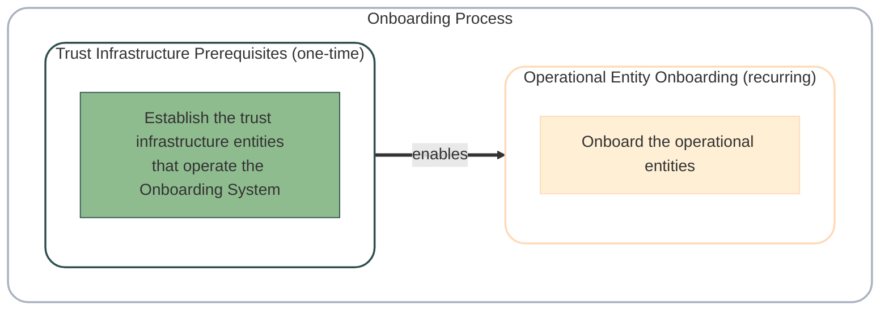
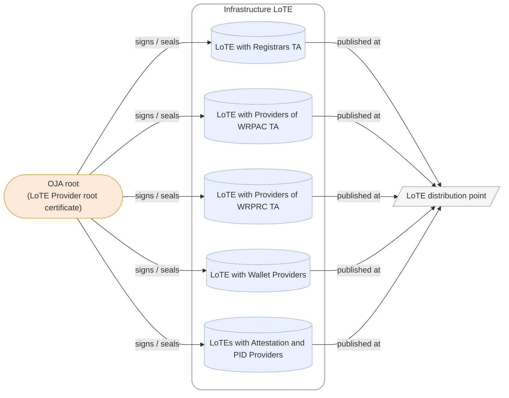
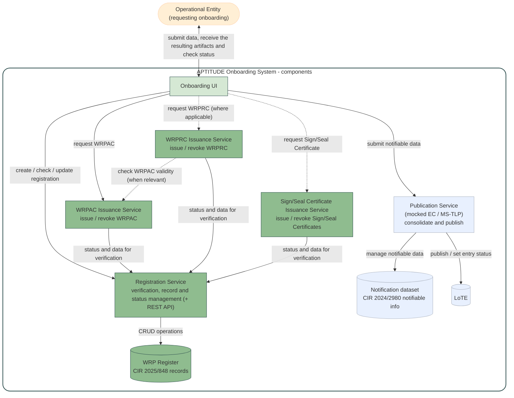
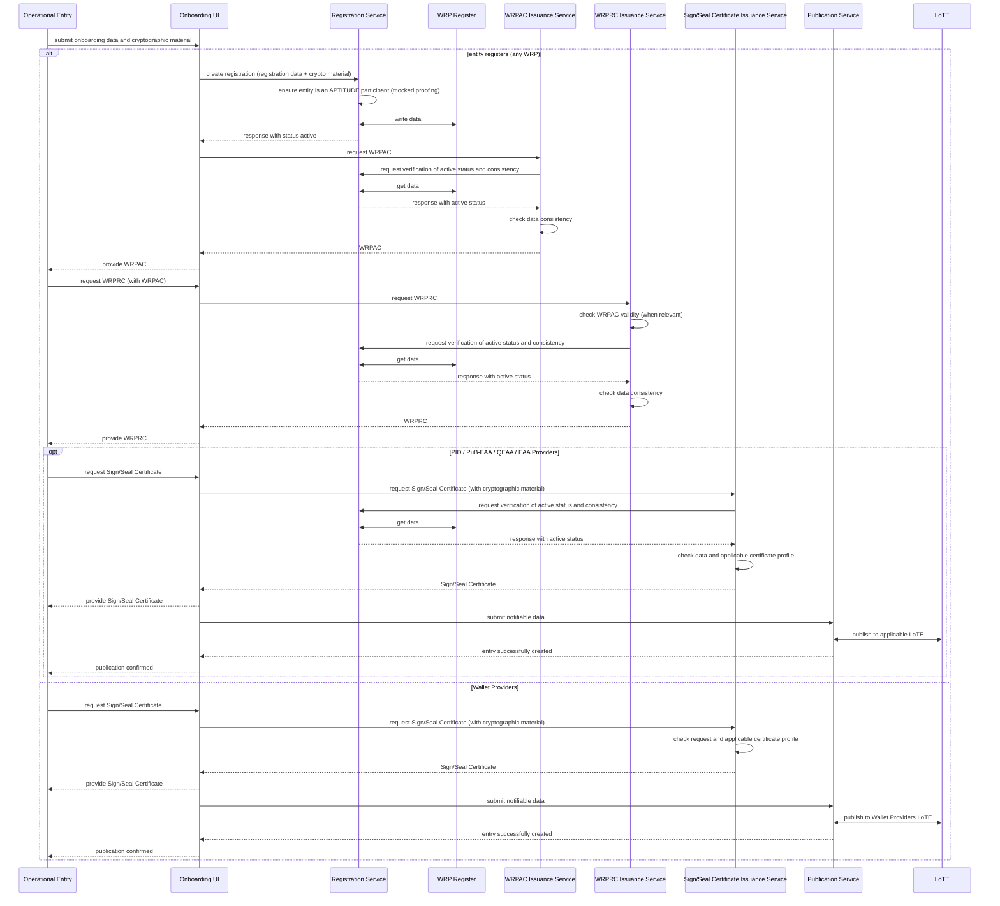
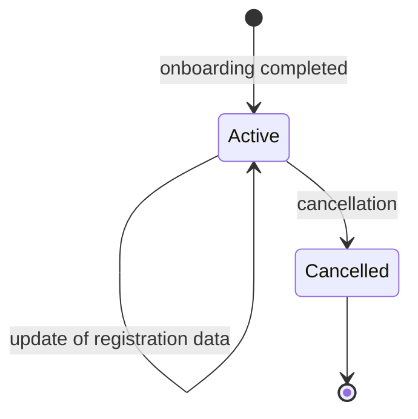

This section describes the Onboarding Process within APTITUDE, where it is realised as the mocked-up version of the <roles:Wallet-Relying Party (WRP)|WRP> Registration Process and <processes:Notification|Notification Process> (defined in [Trust Architecture](../sections/trust-architecture.md)) through which entities become operational and recognisable in the common trust infrastructure of the pilot.

Onboarding collects all the information needed to make entities operational and recognisable, and it replaces the administrative and regulatory processes that, outside the pilot, manage the registration, <processes:Notification|notification> and publication of <roles:Trusted Entity|Trusted Entities> between Member States and the European Commission.

Within the pilot, consistently with [Trust Architecture](../sections/trust-architecture.md), not all onboarding processes are implemented as defined in the [ARF] and related specifications:

- The elements which follows the specifications are: the creation of the registration records, the certificates issuance and the respective profiles, and the <artifacts:List of Trusted Entities (LoTE)|LoTE> publication which enable the distribution of the trust artifacts which enable trust evaluation.
- The elements which differ according to the constraints highlighted in the [Introduction](../trust-framework.md#introduction) are: the <processes:Notification|notification> process between a Member State and the European Commission, the publication of the <artifacts:List of Trusted Entities (LoTE)|LoTE> signing certificate in the <artifacts:Official Journal of APTITUDE (OJA)>, and the registration of entities with the prescribed regulatory checks.

!!! note

    The certification of technical products such as a <components:Wallet Solution> is **out of scope of the pilot**: it is an external process, and only its outcome is referenced. The data schemas, certificate profiles, <artifacts:List of Trusted Entities (LoTE)|LoTE> formats, and low-level protocols are instead **out of scope of this section only**: they are normatively defined in the referenced sections of this specification and are only pointed to from here.

This boundary is mapped onto the components of the Onboarding System in the summary table at the end of [Onboarding System](#onboarding-system).

!!! choice "APTITUDE Implementation Choice"

    Requirements specific to the APTITUDE ecosystem are identified inline with the prefix [`ONBOARD-...`] and consolidated in [Onboarding Requirements](#onboarding-requirements). Obligations defined in other sections of this specification, or in the normative baseline, are referenced where they apply, keeping their own identifiers.

The APTITUDE Onboarding System SHALL implement the Onboarding Process defined in this section [`ONBOARD-GEN-01`].

## Overview

The entities involved in onboarding fall into two categories, and this distinction underpins the whole process:

- **Trust infrastructure entities** (in short, *infrastructure entities*) are the entities that operate the trust infrastructure through which onboarding is performed, namely registration, certificate issuance (the <roles:Provider of Wallet-Relying Party Access Certificate (Provider of WRPAC)|Provider of WRPAC>, the <roles:Provider of Wallet-Relying Party Registration Certificate (Provider of WRPRC)|Provider of WRPRC>, and the Provider of Sign/Seal Certificates), and publication of the <artifacts:List of Trusted Entities (LoTE)> (the <roles:List of Trusted Entities Provider (LoTE Provider)|LoTE Provider>). The <roles:List of Trusted Entities Provider (LoTE Provider)|LoTE Provider> has its LoTE signing certificate referenced in the Official Journal of Aptitude.
- **Operational entities** are the entities that are onboarded through that infrastructure in order to become operational and recognisable in the ecosystem, namely the <roles:Wallet-Relying Party (WRP)|WRP> and the <roles:Wallet Provider (WP)|WP>.

The onboarding process presupposes the existence of a functional trust infrastructure. Its one-time setup is a prerequisite that SHALL be satisfied before any operational entity can be onboarded; it is described in [Trust Infrastructure Prerequisites](#trust-infrastructure-prerequisites). The recurring process through which operational entities become active is described in [Operational Entity Onboarding](#operational-entity-onboarding).

## Trust Infrastructure Prerequisites

The [Onboarding System](#onboarding-system) operates on top of a trust infrastructure whose entities SHALL be established and have their <artifacts:Trust Anchor|trust anchors> published before any operational entity can be onboarded. This setup is a one-time prerequisite and is not part of the recurring onboarding flow; operational entity onboarding SHALL NOT start before it is in place [`ONBOARD-GEN-02`].

Within APTITUDE, the trust infrastructure prerequisites SHALL be established out of band and require no pilot software [`ONBOARD-PRE-01`]. The <artifacts:Trust Anchor|trust anchors> of the infrastructure entities are provided and shared among the participants as a one-time operational setup. What is implemented and testable is the result, i.e. the signed, published <artifacts:List of Trusted Entities (LoTE)|LoTE> against which trust is later evaluated (see [Trust Anchor Validation Process](../sections/trust-evaluation-process.md#trust-anchor-validation-process)). The operations below describe the trust infrastructure setup process.

The setup comprises the following operations:

1. **Key and Certificate Provisioning**. Each trust infrastructure entity provides its signing key and certificate. Within APTITUDE, the trust infrastructure signing entities MAY use self-signed root certificates with no higher certification authority or CA certificates with self managed PKI. Regardless of the choice, Trust in the certificate is conferred by the publication as a <artifacts:Trust Anchor> in the relevant <artifacts:List of Trusted Entities (LoTE)|LoTE> and SHALL be treated as a Trusted input in any pilot use case.
2. **LoTE Signing Certificates**. The signing certificates of the <roles:List of Trusted Entities Provider (LoTE Provider)|LoTE Provider> are used to validate the lists. Within APTITUDE, the <artifacts:Official Journal of APTITUDE (OJA)|OJA> publication is and distribution point where this artifact is made available to the APTITUDE Partners is an operational matter, out of scope of this document.
3. **Notification of Trust Anchors**. The <artifacts:Trust Anchor> of each infrastructure entity is listed in its corresponding <artifacts:List of Trusted Entities (LoTE)|LoTE> as described in the above picture.
4. **Signing and Publication**. The <roles:List of Trusted Entities Provider (LoTE Provider)|LoTE Provider> signs/seals the <artifacts:List of Trusted Entities (LoTE)|LoTE> and publishes them at a distribution point referenced by the <artifacts:Official Journal of APTITUDE (OJA)|OJA>, so that they can be retrieved at validation time (see [Trust Anchor Validation Process](../sections/trust-evaluation-process.md#trust-anchor-validation-process)).

## Operational Entity Onboarding

This section describes the recurring process through which operational entities become active in the ecosystem, once the [Trust Infrastructure Prerequisites](#trust-infrastructure-prerequisites) are in place (`ONBOARD-GEN-02`).

### Onboarding System

This section describes the logical components that implement the Onboarding Process in APTITUDE and how they relate. It is an APTITUDE-specific logical view as the roles are normatively defined, but their decomposition into components is a pilot design choice and is not defined by the <components:EUDI Wallet> normative framework. Technical implementation details (technologies, protocols, deployment) are out of scope of this document. The diagram below shows how the operational entity requesting onboarding interacts with these components.

The components, and the role each realises, are:

- **Onboarding UI** (APTITUDE-specific orchestrator). It is the single point of contact of the entities requesting onboarding and coordinates the other services. It collects the data submitted by the entity, and it SHALL trigger, in order, registration, certificate issuance, and, where applicable, publication or update of the <artifacts:List of Trusted Entities (LoTE)|LoTE> entry [`ONBOARD-GEN-03`].
- **Registration Service**. It implements the <roles:Registrar> role, handling verification and the management of the registration record and its status. It exposes the common REST API (see [Common Register API](../sections/trust-artifacts.md#common-register-api)).
- **<roles:Wallet-Relying Party (WRP)|WRP> Register**. It is the <components:Register> defined by [CIR 2025/848], which stores the registration records.
- **<artifacts:Wallet-Relying Party Access Certificate (WRPAC)|WRPAC> Issuance Service** and **<artifacts:Wallet-Relying Party Registration Certificate (WRPRC)|WRPRC> Issuance Service**. They realise the <roles:Provider of Wallet-Relying Party Access Certificate (Provider of WRPAC)|Provider of WRPAC> and the <roles:Provider of Wallet-Relying Party Registration Certificate (Provider of WRPRC)|Provider of WRPRC>.
- **Sign/Seal Certificate Issuance Service**. It realise the Sign/Seal Certificate Provider role which issues certificates to sign <credentials:Attestation|Attestations>, <credentials:Person Identification Data (PID)|PIDs> and <artifacts:Wallet Unit Attestation (WUA)|Wallet Unit Attestations>.
- **Publication Service**. It realises the <roles:List of Trusted Entities Provider (LoTE Provider)|LoTE Provider> that signs and publishes the <artifacts:List of Trusted Entities (LoTE)|LoTE>.

!!! note

    Within the APTITUDE ecosystem, the Onboarding UI is an abstract orchestrator, and it could be implemented as a structured intake (for example a web form or a portal) that drives the services. The specific user interface is an implementation matter.

The Onboarding System SHALL keep the <components:Register|WRP Register> and the <processes:Notification> dataset as two distinct data stores [`ONBOARD-GEN-04`], because the data needed for notification does not fully coincide with the data that populates the <components:Register|WRP Register>:

- the **WRP Register** holds the <roles:Wallet-Relying Party (WRP)|WRP> registration records ([CIR 2025/848]), namely identification, intended use, and related data, as defined in [Register Data Schema](../sections/trust-artifacts.md#register-data-schema);
- the **Notification dataset** holds the notifiable information related to the notifiable entity ([CIR 2024/2980]), namely identification, <artifacts:Trust Anchor|trust anchors>, and service supply points, whose fields are defined as <artifacts:List of Trusted Entities (LoTE)|LoTE> entries in [List of Trusted Entities](../sections/trust-artifacts.md#list-of-trusted-entities).

!!! note

    The datasets above overlap only in part (i.e., they possess common identification data).

!!! note

    Notice that some infrastructure entities that are notified but not registered as <roles:Wallet-Relying Party (WRP)|WRPs> (<roles:Wallet Provider (WP)|WPs>, <roles:Provider of Wallet-Relying Party Access Certificate (Provider of WRPAC)|Providers of WRPAC>, <roles:Provider of Wallet-Relying Party Registration Certificate (Provider of WRPRC)|Providers of WRPRC>, <roles:Registrar|Registrars>) are not present in the <components:Register|WRP Register> at all.

Against this decomposition, the pilot boundary set out in the introduction of the Onboarding Process section is summarised below.

| Element       | Within APTITUDE   |
| ------------- | ----------------- |
| Onboarding UI, Registration Service (with the <components:Register\|WRP Register> and its API), <artifacts:Wallet-Relying Party Access Certificate (WRPAC)\|WRPAC>, <artifacts:Wallet-Relying Party Registration Certificate (WRPRC)\|WRPRC>, Sign/Seal Certificate Issuance Services, and Publication Service (with the <artifacts:List of Trusted Entities (LoTE)\|LoTE>) | Implemented as pilot software |
| Trust infrastructure setup (prerequisites) | Performed out of band; no pilot software |
| The Member State to European Commission notification act, and the <artifacts:Official Journal of the European Union (OJEU)\|OJEU> publication | Mocked, respectively by the Publication Service and by the pilot |
| The certification of a <components:Wallet Solution> | External; out of scope of the pilot and only referenced |
| Data schemas, certificate profiles, <artifacts:List of Trusted Entities (LoTE)\|LoTE> formats, low-level protocols | Defined in the referenced sections of this specification, not redefined here |

### Input

The required inputs to onboard an operational entity depend on its type and on the onboarding path it follows (see [Onboarding Paths by Entity Type](#onboarding-paths-by-entity-type)). The following inputs SHALL be required:

- **Registration data** of entities that are registered in the <components:Register>, i.e., all <roles:Wallet-Relying Party (WRP)|WRP> types. This data conforms to the `WalletRelyingParty` schema defined in [Register Data Schema](../sections/trust-artifacts.md#register-data-schema), which transposes the [CIR 2025/848, Annex I] and [CIR 2025/848-Amendment, Annex VI] set.
- **Notifiable data** of entities published in a <artifacts:List of Trusted Entities (LoTE)|LoTE>, i.e., <roles:Provider of Person Identification Data (PID Provider)|PID Provider>, <roles:Provider of Public Electronic Attestation of Attributes (PuB-EAA Provider)\|PuB-EAA Provider>, <roles:Provider of Qualified Electronic Attestation of Attributes (QEAA Provider)\|QEAA Provider>, <roles:Provider of Electronic Attestation of Attributes (EAA Provider)\|EAA Provider>, and the <roles:Wallet Provider (WP)|WP>. This data covers the identification, <artifacts:Trust Anchor|Trust Anchors>, and service supply points needed for the relevant <artifacts:List of Trusted Entities (LoTE)|LoTE> entry, as defined in [List of Trusted Entities](../sections/trust-artifacts.md#list-of-trusted-entities).
- **Cryptographic material**, namely the cryptographic material for which a <roles:Wallet-Relying Party (WRP)|WRP> requests a <artifacts:Wallet-Relying Party Access Certificate (WRPAC)|WRPAC>, generated according to [ETSI TS 119 411-8], and the cryptographic material for which <roles:Provider of Person Identification Data (PID Provider)|PID Providers>, <roles:Attestation Provider (AP)|Attestation Providers>, or <roles:Wallet Provider (WP)|Wallet Providers> request Sign/Seal Certificates used to sign or seal their <credentials:Attestation|Attestations>.

!!! note

    A <roles:Wallet-Relying Party (WRP)|WRP> that is also a notified entity (PID, PuB-EAA, QEAA, or non-qualified EAA Provider) provides both the registration data and the notifiable data: the former populates the <components:Register> and drives the <artifacts:Wallet-Relying Party Access Certificate (WRPAC)|WRPAC>, the latter populates the corresponding <artifacts:List of Trusted Entities (LoTE)|LoTE>. A <roles:Relying Party (RP)|Relying Party> or a <roles:Relying Party Intermediary (RPI)|Relying Party Intermediary> provides only the registration data, as it requires no <artifacts:List of Trusted Entities (LoTE)|LoTE> entry.

### Output

A successful onboarding produces the artifacts below, whose data model and format are normatively specified in the referenced sections:

- the <components:Register> entry and its publication, see [Register Data Schema](../sections/trust-artifacts.md#register-data-schema) and [Common Register API](../sections/trust-artifacts.md#common-register-api);
- the <artifacts:Wallet-Relying Party Access Certificate (WRPAC)|WRPAC>, see [Wallet-Relying Party Access Certificate](../sections/trust-artifacts.md#wallet-relying-party-access-certificate);
- the <artifacts:Wallet-Relying Party Registration Certificate (WRPRC)|WRPRC>, see [Wallet-Relying Party Registration Certificate](../sections/trust-artifacts.md#wallet-relying-party-registration-certificate);
- the applicable Sign/Seal Certificate for <roles:Provider of Person Identification Data (PID Provider)|PID Providers>, <roles:Attestation Provider (AP)|Attestation Providers>, or <roles:Wallet Provider (WP)|Wallet Providers>, see [Entity Sign/Seal Certificate Profile](../sections/trust-artifacts.md#entity-signseal-certificate);
- the <artifacts:List of Trusted Entities (LoTE)|LoTE> entry produced by the [Notification and Publication](#notification-and-publication) step.

### Onboarding Paths by Entity Type

Each entity type follows a different path and produces a different set of outputs, summarised in the table below.

| Entity Type                   | Register Record   | WRPAC | WRPRC | Sign/Seal Certificate | LoTE Entry                                                    |
| ----------------------------- | :---------------: | :---: | :---: | :-------------------: | :-----------------------------------------------------------: |
| <roles:Provider of Person Identification Data (PID Provider)\|PID Provider> | YES | YES | YES | YES | <roles:Provider of Person Identification Data (PID Provider)\|PID Providers> <artifacts:List of Trusted Entities (LoTE)\|LoTE> |
| <roles:Provider of Qualified Electronic Attestation of Attributes (QEAA Provider)\|QEAA Provider> | YES | YES | YES | YES | <roles:Provider of Qualified Electronic Attestation of Attributes (QEAA Provider)\|QEAA Provider> <artifacts:List of Trusted Entities (LoTE)\|LoTE> |
| <roles:Provider of Public Electronic Attestation of Attributes (PuB-EAA Provider)\|PuB-EAA Provider> | YES | YES | YES | YES | <roles:Provider of Public Electronic Attestation of Attributes (PuB-EAA Provider)\|PuB-EAA Providers> <artifacts:List of Trusted Entities (LoTE)\|LoTE> |
| <roles:Provider of Electronic Attestation of Attributes (EAA Provider)\|EAA Provider> | YES | YES | YES | YES | <roles:Provider of Electronic Attestation of Attributes (EAA Provider)\|EAA Provider> <artifacts:List of Trusted Entities (LoTE)\|LoTE> |
| <roles:Relying Party (RP)\|Relying Party> | YES | YES | YES | NO | None |
| <roles:Relying Party Intermediary (RPI)\|Relying Party Intermediary> | YES | YES | YES | NO | None |
| <roles:Wallet Provider (WP)\|Wallet Provider> | NO | NO | NO | YES | <roles:Wallet Provider (WP)\|Wallet Providers> <artifacts:List of Trusted Entities (LoTE)\|LoTE> |

The steps below describe the onboarding journey: any <roles:Wallet-Relying Party (WRP)|WRP> entity type goes through [Data Collection and Registration Record Creation](#data-collection-and-registration-record-creation), [Certificate Issuance](#certificate-issuance) and, where it is also a notified entity, [Notification and Publication](#notification-and-publication); the <roles:Wallet Provider (WP)|Wallet Provider> goes through [Certificate Issuance](#certificate-issuance) for its Sign/Seal Certificate and [Notification and Publication](#notification-and-publication), without a registration record.

### Data Collection and Registration Record Creation

This step produces the registration record for a <roles:Wallet-Relying Party (WRP)|WRP>.

The entity submits its registration data through the **Onboarding UI**, which forwards the request to the Registration Service (<roles:Registrar>).

Within APTITUDE, registration SHALL be restricted to APTITUDE Partners, and the Onboarding System SHALL enforce this restriction [`ONBOARD-REG-01`]. This replaces the identity proofing of [ETSI TS 119 461] and the verification duties of [CIR 2025/848, Article 6] (`REGISTRAR-REG-04` to `REGISTRAR-REG-07`, not restated here). The mechanism by which participation is established, for example a pre-provisioned list of participants, or a membership check, is an implementation choice; a non-participant SHALL NOT be registered, and onboarding SHALL NOT proceed.

On successful verification, the <roles:Registrar> SHALL create the record through the common <components:Register> write API (`POST /wrp`, see [Common Register API](../sections/trust-artifacts.md#common-register-api)), using a body conforming to the `WalletRelyingParty` schema of [Register Data Schema](../sections/trust-artifacts.md#register-data-schema), and SHALL set the registration status to `active`. Write access to the API SHALL be authenticated and restricted to the <roles:Registrar> [ONBOARD-REG-02]; the concrete credential mechanism (for example a bearer token or mutual TLS) is an implementation choice. When published or queried, the record is electronically signed/sealed by or on behalf of the <roles:Registrar> (`REGISTER-PUB-05`).

### Certificate Issuance

This step issues the applicable certificates for an operational entity. For a <roles:Wallet-Relying Party (WRP)|WRP>, <artifacts:Wallet-Relying Party Access Certificate (WRPAC)|WRPAC> and <artifacts:Wallet-Relying Party Registration Certificate (WRPRC)|WRPRC> issuance starts once its registration record is `active`; a <roles:Wallet Provider (WP)|Wallet Provider> requests its Sign/Seal Certificate without a registration record.

The request/issuance protocol is an implementation choice (for example ACME, EST, or a manual exchange); the enrolment SHOULD include a <processes:Proof of Possession|proof of possession> of the private key corresponding to the certified public key, a property inherited from the certificate-policy framework underlying [ETSI TS 119 411-8]. The verifications below apply regardless of the protocol.

- **<artifacts:Wallet-Relying Party Access Certificate (WRPAC)|WRPAC>**. The <roles:Provider of Wallet-Relying Party Access Certificate (Provider of WRPAC)|Provider of WRPAC> issues one or more <artifacts:Wallet-Relying Party Access Certificate (WRPAC)|WRPACs>, whose content and format are defined in [Wallet-Relying Party Access Certificate](../sections/trust-artifacts.md#wallet-relying-party-access-certificate). A <roles:Relying Party (RP)|RP> receives a separate <artifacts:Wallet-Relying Party Access Certificate (WRPAC)|WRPAC> for each of its <components:Relying Party Instance|Relying Party Instances> (`Reg_10a`). At issuance time it SHALL verify that the <roles:Wallet-Relying Party (WRP)|WRP> has an active registration status and that the certificate information is consistent with the <components:Register> (requirement `PROVIDER-WRPAC-01` in [Register](../sections/trust-artifacts.md#register), from [CIR 2025/848, Annex IV 3(c)]); its attributes are derived from the <components:Register> information ([ETSI TS 119 475, Clause 5.1.2]). If the registration is not active or the data are inconsistent, the Provider SHALL refuse to issue the certificate.
- **<artifacts:Wallet-Relying Party Registration Certificate (WRPRC)|WRPRC>**. The <roles:Provider of Wallet-Relying Party Registration Certificate (Provider of WRPRC)|Provider of WRPRC> issues a <artifacts:Wallet-Relying Party Registration Certificate (WRPRC)|WRPRC>, whose content and format are defined in [Wallet-Relying Party Registration Certificate](../sections/trust-artifacts.md#wallet-relying-party-registration-certificate). At issuance time it SHALL verify the <components:Register> status, the consistency with the <components:Register> information, and the validity of the corresponding <artifacts:Wallet-Relying Party Access Certificate (WRPAC)|WRPAC> when relevant (requirement `PROVIDER-WRPRC-02` in [Register](../sections/trust-artifacts.md#register), from [CIR 2025/848, Annex V 3(c)]). The same failure handling applies.
- **Sign/Seal Certificate**. The Sign/Seal Certificate Issuance Service realises the Provider of Sign/Seal Certificates role and issues the applicable certificate to <roles:Provider of Person Identification Data (PID Provider)|PID Providers>, <roles:Attestation Provider (AP)|Attestation Providers>, and <roles:Wallet Provider (WP)|Wallet Providers>, for signing or sealing <credentials:Person Identification Data (PID)|PIDs>, <credentials:Attestation|Attestations>, or <artifacts:Wallet Unit Attestation (WUA)|WUAs>, respectively. Its content and format SHALL conform to the applicable [Entity Sign/Seal Certificate Profile](../sections/trust-artifacts.md#entity-signseal-certificate). The issued certificate is an end-entity certificate, distinct from the <artifacts:Trust Anchor> published in the applicable <artifacts:List of Trusted Entities (LoTE)|LoTE>; its certificate chain SHALL terminate at that trust anchor.

!!! choice "APTITUDE Implementation Choice"

    In the normative baseline, the <artifacts:Wallet-Relying Party Registration Certificate (WRPRC)|WRPRC> is created during the registration process by a <roles:Provider of Wallet-Relying Party Registration Certificate (Provider of WRPRC)|Provider of WRPRC> associated to the <roles:Registrar> (`RPRC_09`, `RPRC_13`), and no certificate-based request step is described. The presentation of the <artifacts:Wallet-Relying Party Access Certificate (WRPAC)|WRPAC> when requesting the <artifacts:Wallet-Relying Party Registration Certificate (WRPRC)|WRPRC>, shown in the [Detailed flow](#detailed-flow), is therefore an APTITUDE-specific design choice, which gives the <roles:Provider of Wallet-Relying Party Registration Certificate (Provider of WRPRC)|Provider of WRPRC> direct evidence for the <artifacts:Wallet-Relying Party Access Certificate (WRPAC)|WRPAC> validity verification required by `PROVIDER-WRPRC-02`.

Identity proofing is not repeated here; it is performed by the <roles:Registrar> at [Data Collection and Registration Record Creation](#data-collection-and-registration-record-creation). After issuance, the entity deploys each <artifacts:Wallet-Relying Party Access Certificate (WRPAC)|WRPAC> at the <components:Relying Party Instance> for which it was issued (`Reg_10a`), provides its <artifacts:Wallet-Relying Party Registration Certificate (WRPRC)|WRPRC> to its <components:Relying Party Instance|Relying Party Instances> or service supply points and, for an <roles:Attestation Provider (AP)|Attestation Provider>, includes it in the <artifacts:Credential Issuer Metadata> used at issuance (`RPRC_10`, `RPRC_14`, `RPRC_22`). A <roles:Provider of Person Identification Data (PID Provider)|PID Provider> or <roles:Attestation Provider (AP)|Attestation Provider> deploys its Sign/Seal Certificate at the service supply point that signs or seals <credentials:Person Identification Data (PID)|PIDs> or <credentials:Attestation|Attestations>; a <roles:Wallet Provider (WP)|Wallet Provider> deploys it at the <components:Wallet Solution> service that signs or seals <artifacts:Wallet Unit Attestation (WUA)|WUAs>.

### Notification and Publication

This step publishes a notified entity, together with the <artifacts:Trust Anchor> of the technical component it operates, in the appropriate <artifacts:List of Trusted Entities (LoTE)|LoTE>. <processes:Notification|Notification> is a separate, Member State level process ([CIR 2024/2980]) and is not a duty of the <roles:Registrar>. Within APTITUDE, the Member State to European Commission notification act SHALL be mocked by the Publication Service, triggered by the Onboarding UI, while the signing and publication of the <artifacts:List of Trusted Entities (LoTE)|LoTE> SHALL follow the normative framework [`ONBOARD-PUB-01`].

For a <roles:Provider of Person Identification Data (PID Provider)|PID Provider>, <roles:Attestation Provider (AP)|Attestation Provider>, or <roles:Wallet Provider (WP)|Wallet Provider>, the applicable Sign/Seal Certificate SHALL be issued before the notification data is submitted. The Sign/Seal Certificate is the notified entity's end-entity certificate and is distinct from both the <artifacts:Trust Anchor> published in the applicable <artifacts:List of Trusted Entities (LoTE)|LoTE> and the certificate used by the <roles:List of Trusted Entities Provider (LoTE Provider)|LoTE Provider> to sign the <artifacts:List of Trusted Entities (LoTE)|LoTE>.

- <roles:Provider of Person Identification Data (PID Provider)|PID Providers> and <roles:Attestation Provider (AP)|Attestation Providers> are added to the respective <artifacts:List of Trusted Entities (LoTE)|LoTE>.
- <roles:Wallet Provider (WP)|Wallet Providers> follow a <processes:Notification|notification>-only path, with no <components:Register> record, no <artifacts:Wallet-Relying Party Access Certificate (WRPAC)|WRPAC>, and no <artifacts:Wallet-Relying Party Registration Certificate (WRPRC)|WRPRC>; their Sign/Seal Certificates are issued before their <artifacts:Trust Anchor> is published in the <roles:Wallet Provider (WP)|Wallet Providers> <artifacts:List of Trusted Entities (LoTE)|LoTE>;
- <roles:Relying Party (RP)|Relying Parties> and <roles:Relying Party Intermediary (RPI)|Relying Party Intermediaries> require no <artifacts:List of Trusted Entities (LoTE)|LoTE> entry, as trust in it is anchored through the signed <components:Register> and its <artifacts:Wallet-Relying Party Access Certificate (WRPAC)|WRPAC>.

!!! note

    The Sign/Seal Certificate issued to a <roles:Provider of Person Identification Data (PID Provider)|PID Provider> or <roles:Attestation Provider (AP)|Attestation Provider> is the end-entity certificate with which its service supply point signs or seals <credentials:Person Identification Data (PID)|PIDs> or <credentials:Attestation|Attestations>; for a <roles:Wallet Provider (WP)|Wallet Provider> it is the certificate used by the <components:Wallet Solution> to sign or seal <artifacts:Wallet Unit Attestation (WUA)|WUAs>. The corresponding <artifacts:Trust Anchor> published in the <artifacts:List of Trusted Entities (LoTE)|LoTE> is the CA certificate at which the Sign/Seal Certificate chain terminates. The <artifacts:List of Trusted Entities (LoTE)|LoTE> entry therefore binds the organisational entity to the technical component that operates at runtime.

On failure, if publication does not complete, a notified entity MAY already hold its issued Sign/Seal Certificate and, where it is a <roles:Wallet-Relying Party (WRP)|WRP>, have an active registration record and hold its <artifacts:Wallet-Relying Party Access Certificate (WRPAC)|WRPAC> and <artifacts:Wallet-Relying Party Registration Certificate (WRPRC)|WRPRC>, but not yet be present in the <artifacts:List of Trusted Entities (LoTE)|LoTE>. The issued certificate and registration record alone do not make the entity trusted by <roles:Relying Party (RP)|RPs> until the entry is published.

### Detailed Flow

## Connection to Lifecycle Management

Onboarding is the first phase of the lifecycle of an entity and of the artifacts produced for it. This subsection summarises how onboarding connects to the Trust Management Process and distinguishes the lifecycle of registered entities from that of notified entities.

For entities that are registered in the <components:Register>, the registration record follows the status model below.

- **Update.** A change to the registration data triggers the corresponding update of the dependent artifacts. The <roles:Provider of Wallet-Relying Party Access Certificate (Provider of WRPAC)|Provider of WRPAC> and the <roles:Provider of Wallet-Relying Party Registration Certificate (Provider of WRPRC)|Provider of WRPRC> SHALL monitor the <components:Register> and reissue or revoke the affected <artifacts:Wallet-Relying Party Access Certificate (WRPAC)|WRPAC> or <artifacts:Wallet-Relying Party Registration Certificate (WRPRC)|WRPRC> when the change requires it (requirements `PROVIDER-WRPAC-02` and `PROVIDER-WRPRC-03` in [Register](../sections/trust-artifacts.md#register)), and the corresponding <artifacts:List of Trusted Entities (LoTE)|LoTE> entry is updated where applicable.
- **Cancellation / De-onboarding.** Setting the registration status to `cancelled` (or deleting the record) triggers the revocation of any dependent <artifacts:Wallet-Relying Party Access Certificate (WRPAC)|WRPAC> and <artifacts:Wallet-Relying Party Registration Certificate (WRPRC)|WRPRC> by the respective providers. The revocation mechanisms (<artifacts:Certificate Revocation List (CRL)|CRL> or <protocols:Online Certificate Status Protocol (OCSP)|OCSP> for <artifacts:Wallet-Relying Party Access Certificate (WRPAC)|WRPACs>; <artifacts:Status List Token|Status List Tokens> for <artifacts:Wallet-Relying Party Registration Certificate (WRPRC)|WRPRCs>) are defined in [Revocation Mechanisms](../sections/trust-management-lifecycle.md#revocation-mechanisms).

These actions SHALL act on the **organisational entity**, that is its registration and the certificates issued to it, and not on the technical product it operates [`ONBOARD-LC-02`]. The certification lifecycle of the technical product, in particular the certification of a <components:Wallet Solution>, is a separate process, out of scope of this document. A change to that certification that does not affect the entity's eligibility SHALL be reflected as a <processes:Notification|notification> update and SHALL NOT, by itself, be treated as de-onboarding. A change that makes the entity no longer eligible SHALL instead lead to its cancellation, whose effect on the <artifacts:List of Trusted Entities (LoTE)|LoTE> is defined by `ONBOARD-LC-01` [`ONBOARD-LC-03`].

The lifecycle of entities that are only notified is governed by the <processes:Notification|notification> framework ([CIR 2024/2980]). The entity is published when notified, and upon cancellation it stops being trusted (`ARF GenNot_05`). For the <roles:Wallet Provider (WP)|Wallet Provider>, a cancellation additionally requires the revocation of all its valid <artifacts:Wallet Unit Attestation (WUA)|WUAs> (`ARF WPNot_06`). The same applies to the other notified entities published in their <artifacts:List of Trusted Entities (LoTE)|LoTE>.

How *stops being trusted* is represented depends on the list type, and APTITUDE adopts the representation already supported by each format. The PuB-EAA Provider <artifacts:List of Trusted Entities (LoTE)|LoTE> carries an explicit per-entry status, which on cancellation SHALL be set to withdrawn or invalid; the <roles:Provider of Person Identification Data (PID Provider)|PID Provider>, <roles:Wallet Provider (WP)|Wallet Provider>, <roles:Provider of Wallet-Relying Party Access Certificate (Provider of WRPAC)|Provider of WRPAC>, <roles:Provider of Wallet-Relying Party Registration Certificate (Provider of WRPRC)|Provider of WRPRC>, and <roles:Registrar> <artifacts:List of Trusted Entities (LoTE)|LoTEs> carry no per-entry status (per [ETSI TS 119 602], `ServiceStatus` and the service history are not used for these types), so for them a cancelled entity SHALL be reflected by removing the entry [`ONBOARD-LC-01`]. The broader lifecycle of notified entities belongs to the Trust Management Process.

Finally, the artifacts produced by onboarding are consumed in the trust evaluation processes. The <artifacts:Wallet-Relying Party Access Certificate (WRPAC)|WRPAC> is used in the [Authentication Process](../sections/trust-evaluation-process.md#authentication-process), Sign/Seal Certificates are used in the [Sign/Seal Validation Process](../sections/trust-evaluation-process.md#signseal-validation-process), the <artifacts:Wallet-Relying Party Registration Certificate (WRPRC)|WRPRC> and the <components:Register> are used in the [Authorization Process](../sections/trust-evaluation-process.md#authorization-process), the <artifacts:List of Trusted Entities (LoTE)|LoTE> <artifacts:Trust Anchor|Trust Anchors> are used in the [Trust Anchor Validation Process](../sections/trust-evaluation-process.md#trust-anchor-validation-process), and certificate revocation is covered by [Revocation Mechanisms](../sections/trust-management-lifecycle.md#revocation-mechanisms).

## Onboarding Requirements

!!! note

    The following tables are provided for implementation and conformance-verification purposes. They consolidate the APTITUDE-specific requirements defined throughout this section. In case of interpretative ambiguity between those tables and the body of the section, the body of the section SHALL prevail. Obligations defined in other sections of this specification, or in the normative baseline, are referenced in the "Related external requirement" column and are not reproduced as APTITUDE requirements.

### General

| ID                | Requirement   | Scope | External Requirements |
| :---------------: | ------------- | ----- | --------------------- |
| `ONBOARD-GEN-01`  | The APTITUDE Onboarding System SHALL implement the Onboarding Process defined in this section. | Both | -- |
| `ONBOARD-GEN-02`  | Operational entity onboarding SHALL NOT start before the trust infrastructure prerequisites have been established. | Both | -- |
| `ONBOARD-GEN-03`  | The Onboarding UI SHALL trigger, in order, registration, certificate issuance, and, where applicable, publication or update of the <artifacts:List of Trusted Entities (LoTE)\|LoTE> entry. | Onboarding | -- |
| `ONBOARD-GEN-04`  | The Onboarding System SHALL keep the <components:Register\|WRP Register> and the <processes:Notification> dataset as two distinct data stores. | Both | -- |

### Prerequisites

| ID                | Requirement   | Scope | External Requirements |
| :---------------: | ------------- | ----- | --------------------- |
| `ONBOARD-PRE-01`  | Within APTITUDE, the trust infrastructure prerequisites SHALL be established out of band and require no pilot software. | Prerequisites | -- |

### Registration

| ID                | Requirement   | Scope | External Requirements |
| :---------------: | ------------- | ----- | --------------------- |
| `ONBOARD-REG-01`  | Within APTITUDE, registration SHALL be restricted to APTITUDE Partners; a non-participant SHALL NOT be registered. | Onboarding | [ETSI TS 119 461], [CIR 2025/848, Art. 6] (`REGISTRAR-REG-04` to `REGISTRAR-REG-07`) |
| `ONBOARD-REG-02`  | Write access to the <components:Register> API SHALL be authenticated and restricted to the <roles:Registrar>. | Onboarding | -- |

### Publication

| ID                | Requirement   | Scope | External Requirements |
| :---------------: | ------------- | ----- | --------------------- |
| `ONBOARD-PUB-01`  | Within APTITUDE, the Member State to European Commission notification act SHALL be mocked by the Publication Service, while the signing and publication of the <artifacts:List of Trusted Entities (LoTE)\|LoTE> SHALL follow the normative framework. | Onboarding | [CIR 2024/2980] |

### Lifecycle

| ID                | Requirement   | Scope | External Requirements |
| :---------------: | ------------- | ----- | --------------------- |
| `ONBOARD-LC-01`   | <artifacts:List of Trusted Entities (LoTE)\|LoTE> carrying a per-entry status SHALL reflect cancellation by setting the status to withdrawn or invalid; <artifacts:List of Trusted Entities (LoTE)\|LoTE> carrying no per-entry status SHALL reflect it by removing the entry. | Onboarding | [ETSI TS 119 602], GenNot_05 |
| `ONBOARD-LC-02`   | Lifecycle actions (cancellation, certificate revocation) SHALL act on the organisational entity, not on the technical product it operates. | Onboarding | [CIR 2025/848] Art. 9 |
| `ONBOARD-LC-03`   | A change to a technical product the entity operates that does not affect eligibility SHALL be reflected as a <processes:Notification\|notification> update, not de-onboarding; a change that makes the entity ineligible SHALL lead to its cancellation (effect of `ONBOARD-LC-01`). | Onboarding | -- |
