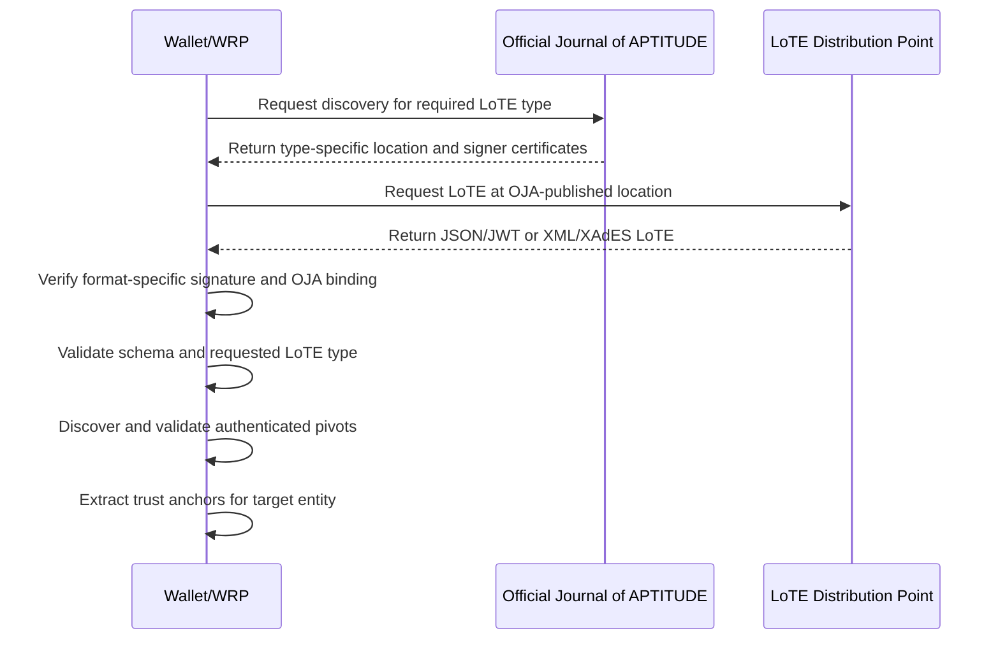
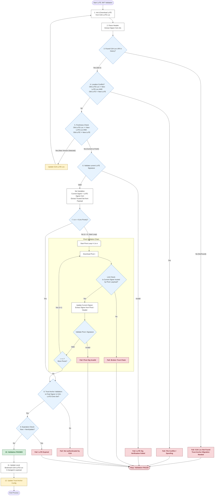

The **Trust Anchor Validation Process** establishes the cryptographic integrity and authenticity of <artifacts:List of Trusted Entities (LoTE)|LoTEs>, which are the authoritative sources for <artifacts:Trust Anchor|Trust Anchors>. A <artifacts:Trust Anchor> is an X.509 certificate containing the name and public key used by a <components:Wallet Unit> or <roles:Wallet-Relying Party (WRP)> to validate an artifact or <credentials:Attestation>.

!!! choice

    Within the APTITUDE profiles, all trust anchors for APTITUDE entities SHALL be obtained from the applicable dedicated <artifacts:List of Trusted Entities (LoTE)|LoTE>. This applies to <roles:Provider of Person Identification Data (PID Provider)|PID Providers>, <roles:Wallet Provider (WP)|Wallet Providers>, Providers of <artifacts:Wallet-Relying Party Access Certificate (WRPAC)|WRPAC> and <artifacts:Wallet-Relying Party Registration Certificate (WRPRC)>, <roles:PuB-EAA Provider|PuB-EAA Providers>, <roles:Qualified Electronic Attestation of Attributes (QEAA) Provider|QEAA Providers>, <roles:Electronic Attestation of Attributes (EAA) Provider|EAA Providers>, and <roles:Registrar|Registrars> and their <components:Register|Registers>.

Depending on the artifact or <credentials:Attestation> being verified, the validating Entity SHALL fetch, download, and validate the dedicated <artifacts:List of Trusted Entities (LoTE)|LoTE> for the required entity type. The LoTE is used to retrieve <artifacts:Trust Anchor|Trust Anchors> for validating:

1. **Infrastructure certificates**: <artifacts:Wallet-Relying Party Access Certificate (WRPAC)|WRPACs> and <artifacts:Wallet-Relying Party Registration Certificate (WRPRC)|WRPRCs>.
2. **<artifacts:Wallet Unit Attestation (WUA)|Wallet Unit Attestations (WUAs)>**: <artifacts:Key Attestation (KA)> and <artifacts:Wallet Instance Attestation (WIA)>.
3. **PID signatures**: <credentials:Person Identification Data (PID)>.
4. **Attestation signatures and seals**: <credentials:Qualified Electronic Attestation of Attributes (QEAA)|QEAAs>, <credentials:Electronic Attestation of Attributes (EAA)|EAAs>, and <credentials:Public Electronic Attestation of Attributes (PuB-EAA)|Pub-EAAs>.
5. **Artifacts and Attestations status and revocation information**: <artifacts:Status List Token> for Attestation, WIA and KA, and WRPRC status information; WRPAC, Sign/Seal certificate status information via CRL or OCSP.
6. **Registrar-signed artifacts**: <components:Register> information.

!!! choice

    Within the APTITUDE profiles, the trust anchors for <roles:Qualified Electronic Attestation of Attributes (QEAA) Provider|QEAA Providers> and <roles:Electronic Attestation of Attributes (EAA) Provider|EAA Providers> SHALL be retrieved from and validated against their dedicated QEAA Provider and EAA Provider <artifacts:List of Trusted Entities (LoTE)|LoTE>, respectively. The same LoTE validation process SHALL be used for these trust anchors as for all other APTITUDE entities.

To verify the authenticity of a retrieved <artifacts:List of Trusted Entities (LoTE)|LoTE>, the validating Entity SHALL:

- obtain the location and authorized signing certificate set for the requested LoTE type from the Official Journal of APTITUDE (OJA);
- verify the LoTE signature or seal using the format-specific procedure and bind the signer to the certificate set published in the OJA;
- validate the LoTE structure, requested LoTE type, freshness, and any authenticated pivot history.

### List of Trusted Entities Validation

This section defines the validation of a <artifacts:List of Trusted Entities (LoTE)|LoTE>. A LoTE is a digitally signed or sealed JSON or XML artifact containing metadata and public keys for entities operating in the APTITUDE ecosystem.

Before validating a <artifacts:List of Trusted Entities (LoTE)|LoTE>, the <components:Wallet Unit> or <roles:Wallet-Relying Party (WRP)|WRP> SHALL select the required LoTE type and obtain its type-specific location and authorized signing certificate set from the OJA. The LoTE SHALL be downloaded from the location published for that type.

#### List of Trusted Entities Retrieval and Validation Sequence Diagram

#### List of Trusted Entities Validation Process

The validator initializes the following variables:

**Input Variables**:

- `Requested-LoTE-Type`: The LoTE type required for the artifact or <credentials:Attestation> being validated.
- `OJA-Loc`: URI of the latest known OJA publication for the requested LoTE type.
- `OJA-LoTE-Loc`: URI of the last processed LoTE instance for the requested type. It is initialized to the location published in the OJA.
- `OJA-LoTE-Certs-Set`: The set of certificates authorized by the OJA to verify the requested LoTE type.
- `LoTE`: The JSON/JWT or XML/XAdES LoTE currently being processed. Initialized as `NULL`.
- `LoTE-Format`: The format of `LoTE`, either `JSON` or `XML`.
- `LoTE-Signer-Cert`: The certificate used to verify the signature or seal on `LoTE`. Initialized as `NULL`.
- `LoTESO-Cert`: The signer certificate of the current LoTE or pivot. Initialized as `NULL`.
- `LoTESO-Certs-Set`: Certificates authorized by an authenticated `PointersToOtherLoTE` entry for the next pivot. Initialized as `NULL`.

**Output Variables**:

- `Authenticated-LoTE`: The validated LoTE payload.
- `LoTE-Status`: The validation result, for example `LoTE_VERIFICATION_PASSED`.
- `LoTE-Sub-Status`: Detailed error codes supplementing `LoTE-Status`.

##### JSON LoTE Signature Verification and OJA Binding

This procedure applies when the LoTE is JSON formatted and uses the Compact JAdES Baseline B profile. In the APTITUDE profile, `x5t#S256` is the selected certificate-reference implementation choice for this format. A Compact JAdES signature is a compact JWS; when the JWT representation is selected, the decoded payload SHALL contain the private `LoTE` claim defined in the Compact JAdES profile.

The validator SHALL perform the following operations before using any payload value for pivot discovery or trust-anchor extraction:

1. Parse the JWS Compact Serialization into its protected header, payload, and signature parts. The protected header SHALL contain `alg`, `iat`, and `x5t#S256`; an algorithm value of `none` SHALL be rejected.
2. Decode `x5t#S256` from Base64url and compute the SHA-256 digest of the DER encoding of each certificate in the authorized certificate set. Exactly one certificate in `OJA-LoTE-Certs-Set` SHALL match the value. Set that certificate as `LoTE-Signer-Cert`.
3. Verify the JWS signature over the JWS Signing Input using the public key in `LoTE-Signer-Cert`.
4. Decode the payload. If the JWT representation is selected, require the private `LoTE` claim. Validate the LoTE object against `LoTE_Payload_Json_schema.yaml`; otherwise validate the JSON payload against the applicable JSON LoTE schema.
5. Confirm that the `LoTEType` in the authenticated payload equals `Requested-LoTE-Type` and that the `DistributionPoints` value is the endpoint published by the OJA for that type.

If any operation fails, validation SHALL stop with `LoTE-Status` set to `LoTE_VERIFICATION_FAILED` and the applicable signature, certificate-binding, format, or type sub-status.

##### XML LoTE Signature Verification and OJA Binding

This procedure applies when the LoTE is XML formatted and uses XAdES Baseline B. XAdES Baseline B is specified by [ETSI EN 319 132-1]; [ETSI EN 319 132-2] defines extended XAdES signatures and is not the governing specification for the Baseline B profile.

The validator SHALL perform the following operations before using any LoTE value for pivot discovery or trust-anchor extraction:

1. Validate the XML document against the applicable LoTE XML schema and locate the enveloped `ds:Signature` and its `xades:QualifyingProperties`.
2. Validate the XML signature references, including the reference to the LoTE document with `URI=""`, the enveloped-signature transform, and exclusive XML canonicalization. Validate the reference to `xades:SignedProperties` with `Type="http://uri.etsi.org/01903#SignedProperties"`.
3. Extract the signing certificate from `ds:KeyInfo/ds:X509Data/ds:X509Certificate`. The first `xades:SigningCertificateV2/xades:Cert` SHALL contain the digest of the DER encoding of this certificate. The digest SHALL use SHA-256 and the `DigestValue` SHALL use the XML signature Base64 encoding.
4. Compare the extracted certificate, by exact DER certificate identity, with the certificates in `OJA-LoTE-Certs-Set`. Set the matching certificate as `LoTE-Signer-Cert`.
5. Verify the XML signature using `LoTE-Signer-Cert`, including the signed properties and all signed LoTE data objects.
6. Confirm that the LoTE type in the authenticated XML document equals `Requested-LoTE-Type` and that its distribution point is the endpoint published by the OJA for that type.

If any operation fails, validation SHALL stop with `LoTE-Status` set to `LoTE_VERIFICATION_FAILED` and the applicable signature, certificate-binding, format, or type sub-status. XAdES `SigningCertificateV2` is not by itself a trust anchor; the exact certificate match to the OJA certificate set is required.

##### LoTE Validation Operations

The validation SHALL perform the following steps:

1. (Initialization) Select the OJA record for `Requested-LoTE-Type`, download the JSON/JWT or XML/XAdES file from `OJA-LoTE-Loc`, and assign it to `LoTE`.
2. (Parsing) Set `LoTE-Format` to `JSON` or `XML`. For JSON, resolve `LoTE-Signer-Cert` by matching the protected `x5t#S256` value against the DER SHA-256 digests of the certificates in `OJA-LoTE-Certs-Set`. For XML, extract the signing certificate from `ds:KeyInfo/ds:X509Data/ds:X509Certificate` and match its `xades:SigningCertificateV2` DER digest against `OJA-LoTE-Certs-Set`.
3. (Pivot Discovery) Iterate through the `uriValue` claims in the `SchemeInformationURI` object. Count the number of valid URIs found before encountering the URI matching `OJA-Loc`. Let $n$ be that count.
    - If no URI matches `OJA-Loc`: Validation SHALL fail with `LoTE-Status` set to `LoTE_VERIFICATION_FAILED` and `LoTE-Sub-Status` set to `OJA_LOCATION_INPUT_NOT_MATCHING_OJA_LOCATION_IN_LoTE`. (This implies a Trust Anchor migration is required).
4. (<artifacts:List of Trusted Entities (LoTE)|LoTE> Location Conflict) Check the condition: `OJA-LoTE-Loc != LoTELocation` AND `LoTE != Content at LoTELocation`.
    - (`LoTELocation` is the URI in the `PointersToOtherLoTE` claim of `LoTE` with `SchemeTerritory` = `EU`).
    - If `TRUE`: Validation SHALL stop with `LoTE-Status` set to `LoTE_VERIFICATION_FAILED` and `LoTE-Sub-Status` set to `LoTE_FILE_CONFLICT`.
    - If `FALSE`, proceed to the next step.
5. (<artifacts:List of Trusted Entities (LoTE)|LoTE> Freshness) Check the condition: `OJA-LoTE-Loc == LoTELocation` AND `LoTE !=` Content at `LoTELocation`.
    - If `TRUE`: Set `OJA-LoTE-Loc` to `LoTELocation` and restart from Step 1.
    - If `FALSE`, proceed to the next step.
6. (Digital Signature Validation) Validate the cryptographic signature of the current `LoTE` using the format-specific Compact JAdES or XAdES Baseline B procedure and the public key from `LoTE-Signer-Cert`.
    - If validation fails: Stop with `LoTE-Status` set to `LoTE_VERIFICATION_FAILED` and `LoTE-Sub-Status` set to `LoTE_SIGNATURE_VERIFICATION_FAILED`.
    - If successful:
        - Set `LoTESO-Cert` to `LoTE-Signer-Cert`.
        - Set `LoTESO-Certs-Set` to the certificates found in the `PointersToOtherLoTE` claim (territory `EU`) of the current `LoTE` payload.
7. (Intermediate Pivot Validation)
    - Case $n=0$ (No Pivots): Proceed directly to Step 8.
    - Case $n>0$ (History Chain):
        - Iterate $i$ from 1 to $n$ (from most recent Pivot to oldest). Let `Pivot` be the file downloaded from the $i$-th URI.
        - (Link Check) Set `Pivot-Certs-Set` to the certificates in the `PointersToOtherLoTE` claim (territory `EU`) of `Pivot`. If `LoTESO-Cert` (the signer of the previous file in the chain) is not in `Pivot-Certs-Set`, validation SHALL fail with `LoTE-Sub-Status` set to `PIVOT_i-1_SIGNER_CERT_NOT_AUTHENTICATED_BY_PIVOT_i`.
        - (Update Signer) For JSON `Pivot`, resolve `LoTESO-Cert` by matching its protected `x5t#S256` value against `Pivot-Certs-Set`. For XML `Pivot`, extract the signing certificate from `ds:KeyInfo/ds:X509Data/ds:X509Certificate` and match its `xades:SigningCertificateV2` DER digest against `Pivot-Certs-Set`.
        - (Verify Signature) Validate the signature of `Pivot` using the applicable Compact JAdES or XAdES Baseline B procedure and `LoTESO-Cert`. If it fails, validation SHALL fail with `LoTE-Status` set to `LoTE_VERIFICATION_FAILED`, and `LoTE-Sub-Status` set to `PIVOT_i_SIGNATURE_VERIFICATION_FAILED`.
        - The loop continues, walking backwards until LoTESO-Cert represents the signer of the oldest Pivot.
8. (<artifacts:Trust Anchor> Validation) Verify the end of the chain. If `LoTESO-Cert` (from the last Pivot or current <artifacts:List of Trusted Entities (LoTE)|LoTE>) is not in `OJA-LoTE-Certs-Set` (the <artifacts:Trust Anchor>), validation SHALL fail with `LoTE-Sub-Status` set to `PIVOT_n_SIGNER_CERT_NOT_AUTHENTICATED_BY_OJA`.
9. (Expiration) If current time > `NextUpdate` claim of `LoTE`, validation SHALL fail.
10. (Success) Set `Authenticated-LoTE` to `LoTE`, `LoTE-Status` to `LoTE_VERIFICATION_PASSED`, and `LoTE-Sub-Status` to an empty list.
11. (Update Bookmark) If `OJA-LoTE-Loc` does not match the `LoTELocation` in `Authenticated-LoTE` (territory `EU`), update `OJA-LoTE-Loc` to that value.
12. (Update Anchor) [Caution: This step modifies the Root of Trust configuration]
    - If `OJA-Loc` does not match the first URI in `SchemeInformationURI`, update `OJA-LoTE-Loc`.
    - Update `OJA-LoTE-Certs-Set` according to the new <artifacts:Trust Anchor> from a new OJA publication for the requested LoTE type.

!!! warning

    The LoTE validation process is mutuated from the [ETSI TS 119 615] standard, and adapted to the APTITUDE profiles context.

**Remarks**:

- The OJA record is type-specific: a validator SHALL NOT use the endpoint or certificate set published for one LoTE type to validate another LoTE type.
- The JSON `x5t#S256` value binds the JWS signer to an OJA-published certificate by the SHA-256 digest of its DER encoding. The XML `SigningCertificateV2` value provides the corresponding XAdES certificate digest, and the validator additionally performs exact certificate matching against the OJA certificate set.
- Payload fields are not trusted for pivot discovery, distribution-point changes, or trust-anchor extraction until the format-specific signature and OJA certificate binding have succeeded.
- A cached LoTE and its OJA-authorized signer certificate MAY be reused only within the caching rules specified in the LoTE profile; the cache SHALL be refreshed no later than `NextUpdate` and when the OJA record changes.

Below is a flowchart summarizing the validation of a <artifacts:List of Trusted Entities (LoTE)|LoTE>:

