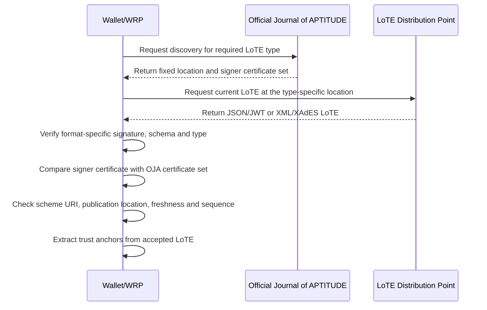
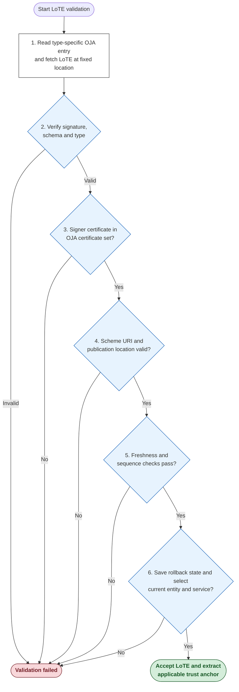

The **Trust Anchor Validation Process** verifies the cryptographic integrity of a <artifacts:List of Trusted Entities (LoTE)|LoTE> and checks its signing certificate against the set published for its type in the <artifacts:Official Journal of APTITUDE (OJA)|OJA>. The accepted <artifacts:List of Trusted Entities (LoTE)|LoTE> is the source for <artifacts:Trust Anchor|Trust Anchors>. A <artifacts:Trust Anchor> is an X.509 certificate containing the name and public key used by a <components:Wallet Unit> or <roles:Wallet-Relying Party (WRP)|WRP> to validate an artifact or <credentials:Attestation>.

!!! choice "APTITUDE Implementation Choice"

    All <artifacts:Trust Anchor|Trust Anchors> SHALL be obtained from the applicable dedicated <artifacts:List of Trusted Entities (LoTE)|LoTE>. This applies to <roles:Provider of Person Identification Data (PID Provider)|PID Providers>, <roles:Wallet Provider (WP)|Wallet Providers>, <roles:Provider of Wallet-Relying Party Access Certificate (Provider of WRPAC)|Providers of WRPAC>, <roles:Provider of Wallet-Relying Party Registration Certificate (Provider of WRPRC)|Providers of WRPRC>, <roles:Provider of Public Electronic Attestation of Attributes (PuB-EAA Provider)|PuB-EAA Providers>, <roles:Provider of Qualified Electronic Attestation of Attributes (QEAA Provider)|QEAA Providers>, <roles:Provider of Electronic Attestation of Attributes (EAA Provider)|EAA Providers>, <roles:Registrar|Registrars> and their <components:Register|Registers>.

Depending on the artifact or <credentials:Attestation> being verified, the validating entity SHALL fetch, download, and validate the dedicated <artifacts:List of Trusted Entities (LoTE)|LoTE> for the required entity type. The <artifacts:List of Trusted Entities (LoTE)|LoTE> is used to retrieve <artifacts:Trust Anchor|Trust Anchors> for validating:

1. **Infrastructure Certificates**: <artifacts:Wallet-Relying Party Access Certificate (WRPAC)|WRPACs> and <artifacts:Wallet-Relying Party Registration Certificate (WRPRC)|WRPRCs>.
2. **<artifacts:Wallet Unit Attestation (WUA)|Wallet Unit Attestations (WUAs)>**: <artifacts:Key Attestation (KA)> and <artifacts:Wallet Instance Attestation (WIA)>.
3. **<credentials:Person Identification Data (PID)|PID> Signatures**: <credentials:Person Identification Data (PID)>.
4. **<credentials:Attestation> Signatures and Seals**: <credentials:Qualified Electronic Attestation of Attributes (QEAA)|QEAA>, <credentials:Electronic Attestation of Attributes (EAA)|EAA>, and <credentials:Public Electronic Attestation of Attributes (PuB-EAA)|Pub-EAA>.
5. **Artifacts and <credentials:Attestation> Status and Revocation Information**: <artifacts:Status List Token> for <credentials:Attestation|Attestations>, <artifacts:Key Attestation (KA)|KA>, <artifacts:Wallet Instance Attestation (WIA)|WIA>, and <artifacts:Wallet-Relying Party Registration Certificate (WRPRC)|WRPRC> status information; <artifacts:Certificate Revocation List (CRL)|CRL> or <protocols:Online Certificate Status Protocol (OCSP)|OCSP> for <artifacts:Wallet-Relying Party Access Certificate (WRPAC)|WRPAC> and Sign/Seal Certificate status information.
6. **Registrar-signed Artifacts**: <components:Register> information.

!!! choice "APTITUDE Implementation Choice"

    The <artifacts:Trust Anchor|Trust Anchors> for <roles:Provider of Qualified Electronic Attestation of Attributes (QEAA Provider)|QEAA Providers> and <roles:Provider of Electronic Attestation of Attributes (EAA Provider)|EAA Providers> SHALL be retrieved from and validated against their dedicated <artifacts:List of Trusted Entities (LoTE)|LoTE>. The same <artifacts:List of Trusted Entities (LoTE)|LoTE> validation process SHALL be used for these <artifacts:Trust Anchor|Trust Anchors> as for all other APTITUDE entities.

To validate a retrieved <artifacts:List of Trusted Entities (LoTE)|LoTE> under the APTITUDE pilot profile, the validating entity SHALL:

- obtain the location and authorized signing certificate set for the requested <artifacts:List of Trusted Entities (LoTE)|LoTE> type from the <artifacts:Official Journal of APTITUDE (OJA)>;
- verify the <artifacts:List of Trusted Entities (LoTE)|LoTE> signature or seal using the format-specific procedure and compare its signing certificate, by exact DER certificate identity, with the certificate set published for that type in the <artifacts:Official Journal of APTITUDE (OJA)|OJA>;
- validate the <artifacts:List of Trusted Entities (LoTE)|LoTE> structure, requested type, publication location, freshness, and sequence number.

#### List of Trusted Entities Validation

This section defines the validation of a <artifacts:List of Trusted Entities (LoTE)|LoTE>. The <artifacts:List of Trusted Entities (LoTE)|LoTE> format is specified in [List of Trusted Entities](../sections/trust-artifacts.md#list-of-trusted-entities).

!!! choice "APTITUDE Pilot Discovery Assumption"

    The <artifacts:Official Journal of APTITUDE (OJA)|OJA> publication is made available at a fixed, locally configured URI only available to the APTITUDE pilots participants, but is not signed or independently authenticated in the pilot. 
    
    A <components:Wallet Unit> or <roles:Wallet-Relying Party (WRP)|WRP> SHALL accept the type-specific <artifacts:List of Trusted Entities (LoTE)|LoTE> location and authorized signing certificate set obtained from that publication.

For the duration of the pilot, the <artifacts:Official Journal of APTITUDE (OJA)|OJA> publication URI, each type-specific <artifacts:List of Trusted Entities (LoTE)|LoTE> location, and the authorized signing certificate set for each type will remain unchanged. New versions of a <artifacts:List of Trusted Entities (LoTE)|LoTE> SHALL replace the current version at that type's fixed location and SHALL be signed with a certificate from its fixed set.

##### List of Trusted Entities Retrieval and Validation Sequence Diagram

##### List of Trusted Entities Validation Process

**Input Variables**:

- `Requested-LoTE-Type`: The <artifacts:List of Trusted Entities (LoTE)|LoTE> type required for the artifact or <credentials:Attestation> being validated.
- `Requested-Entity-Identity`: The identity of the entity whose <artifacts:Trust Anchor> is required, obtained from the artifact or protocol being validated.
- `Requested-Service-Type`: The `ServiceTypeIdentifier` required for that artifact or protocol.
- `OJA-Loc`: The fixed, locally configured URI of the <artifacts:Official Journal of APTITUDE (OJA)|OJA> publication.
- `Highest-Accepted-Sequence`: The highest `LoTESequenceNumber` previously accepted for `Requested-LoTE-Type`, if any, together with a SHA-256 digest of the accepted signed list content at that sequence number; this state is retained across refreshes and restarts. The list content is the JWS Payload octets for JSON or the canonicalized document after the enveloped-signature transform for XML.

**Working and Output Variables**:

- `LoTE`: The JSON/JWT or XML/XAdES <artifacts:List of Trusted Entities (LoTE)|LoTE> being processed.
- `OJA-LoTE-Loc`: The fixed location published by the <artifacts:Official Journal of APTITUDE (OJA)|OJA> for `Requested-LoTE-Type`.
- `OJA-LoTE-Certs-Set`: The set of certificates published by the <artifacts:Official Journal of APTITUDE (OJA)|OJA> for verifying `Requested-LoTE-Type`.
- `LoTE-Format`: The format of `LoTE`, either `JSON` or `XML`.
- `LoTE-Signer-Cert`: The certificate used to verify the signature or seal on `LoTE`.
- `LoTE-Status`: The validation result, for example `LoTE_VERIFICATION_PASSED`.

##### JSON LoTE Signature Verification

This procedure applies when the <artifacts:List of Trusted Entities (LoTE)|LoTE> is JSON formatted and uses the Compact JAdES Baseline B profile.

The validator SHALL perform the following operations. Values from the payload SHALL NOT be used to extract <artifacts:Trust Anchor|Trust Anchors> before all validation operations succeed:

1. Parse the JWS Compact Serialization into exactly three parts and reject invalid Base64url encoding, duplicate JSON member names, detached or unencoded payloads, and unsupported critical header parameters. The protected header SHALL contain `alg` with value `ES256`, an integer `iat`, and `x5t#S256`; `x5c`, `kid`, `x5u`, and other certificate-binding parameters SHALL NOT be used. The `iat` value is a claimed signing time, not a trusted timestamp.
2. Decode `x5t#S256` from Base64url and select exactly one certificate from `OJA-LoTE-Certs-Set` whose DER encoding has that SHA-256 digest. Set it as `LoTE-Signer-Cert`.
3. Verify the JWS signature over the JWS Signing Input using the P-256 public key in `LoTE-Signer-Cert` and the `ES256` algorithm.
4. Decode the JWT Claims Set and require the private `LoTE` claim containing the list object. Validate that object against the applicable profiled JSON payload schema.
5. Confirm that the `LoTEType` in the signature-verified payload equals `Requested-LoTE-Type`.

If any operation fails, validation SHALL stop with `LoTE-Status = LoTE_VERIFICATION_FAILED`.

##### XML LoTE Signature Verification

This procedure applies only when an implementation additionally supports an XML-formatted <roles:Provider of Qualified Electronic Attestation of Attributes (QEAA Provider)|QEAA Provider> <artifacts:List of Trusted Entities (LoTE)|LoTE> using XAdES Baseline B. XML support is not required for pilot interoperability.

The validator SHALL perform the following operations. Values from the XML document SHALL NOT be used to extract <artifacts:Trust Anchor|Trust Anchors> before all validation operations succeed:

1. Parse without external entities or DTD processing. Validate the document against the applicable <artifacts:List of Trusted Entities (LoTE)|LoTE> XML schema and require exactly one `ListOfTrustedEntities` document element containing exactly one enveloped `ds:Signature` and its `xades:QualifyingProperties`. Reject duplicate XML IDs.
2. Require the signature to reference the entire document with `URI=""`, the enveloped-signature transform, and exclusive XML canonicalization, and to reference the unique `xades:SignedProperties` element with `Type="http://uri.etsi.org/01903#SignedProperties"`. Reject external references, additional references, and other transforms. Require SHA-256 reference digests and an ECDSA-with-SHA-256 signature method.
3. Extract the signing certificate from `ds:KeyInfo/ds:X509Data/ds:X509Certificate`. The first `xades:SigningCertificateV2/xades:Cert` SHALL contain the SHA-256 digest of the DER encoding of this certificate, with `DigestValue` in XML Signature Base64 encoding. Set it as `LoTE-Signer-Cert`.
4. Verify the XML signature using the P-256 public key in `LoTE-Signer-Cert`, including the signed properties and entire document reference. The application SHALL use this same signature-verified document element for all subsequent list checks and trust-anchor extraction.
5. Confirm that the <artifacts:List of Trusted Entities (LoTE)|LoTE> type in the signature-verified XML document equals `Requested-LoTE-Type`.

If any operation fails, validation SHALL stop with `LoTE-Status = LoTE_VERIFICATION_FAILED`.

##### LoTE Validation Operations

The validator SHALL perform the following steps:

1. **Retrieve the current list.**

    - Select exactly one `Requested-LoTE-Type` entry from the trusted <artifacts:Official Journal of APTITUDE (OJA)|OJA> publication at `OJA-Loc` and require a non-empty authorized signing certificate set.
    - Obtain `OJA-LoTE-Loc` and `OJA-LoTE-Certs-Set` for that type. Download the current `LoTE` from `OJA-LoTE-Loc` when no accepted cached list exists, 24 hours have elapsed since the cached list was retrieved, or its `NextUpdate` has been reached, whichever occurs first. A cached list SHALL NOT be used after a required refresh fails.
    
    The validator SHALL NOT use the location or certificate set of another <artifacts:List of Trusted Entities (LoTE)|LoTE> type.
    
    If the type-specific entry is absent or the current list cannot be obtained, validation SHALL fail with `LoTE-Status = LoTE_VERIFICATION_FAILED`.

2. **Verify signature, schema, and type.**

    Determine `LoTE-Format` and run the applicable JSON or XML signature-verification procedure above. Only a <roles:Provider of Qualified Electronic Attestation of Attributes (QEAA Provider)|QEAA Provider> list MAY use XML, and only when XML validation is supported. If any check fails, stop with `LoTE-Status = LoTE_VERIFICATION_FAILED`.

3. **Match the signing certificate.**

    Require `LoTE-Signer-Cert` to match a certificate in `OJA-LoTE-Certs-Set` by exact DER certificate identity and require its X.509 validity period to include the validation time. Otherwise stop with `LoTE-Status = LoTE_VERIFICATION_FAILED`.

4. **Check the scheme URI and publication location.**

    - Require `SchemeInformationURI` to contain exactly one URI, equal to `OJA-Loc`, and require `DistributionPoints` to be absent. The current list location is `OJA-LoTE-Loc`.
    - For all <artifacts:List of Trusted Entities (LoTE)|LoTE> types, require `PointersToOtherLoTE` to be absent.

    If any check fails, validation SHALL stop with `LoTE-Status = LoTE_VERIFICATION_FAILED`.

5. **Check profile, freshness, and sequence.** 

    - Require `LoTEVersionIdentifier` to be `1`, a positive integer `LoTESequenceNumber`, and the type-specific values and presence rules in the <artifacts:List of Trusted Entities (LoTE)|LoTE> profile, including the service type identifiers and current service-status rules. For a <roles:Provider of Public Electronic Attestation of Attributes (PuB-EAA Provider)|PuB-EAA Provider> service, require `StatusStartingTime` not to be later than the validation time.
    - Require a valid `ListIssueDateTime` and `NextUpdate`, with the issue time not later than the validation time, the next update later than the validation time, and the interval between them no longer than six months.
    - If `Highest-Accepted-Sequence` exists, reject a `LoTESequenceNumber` below it.
    - If the sequence number is equal but the digest of the signed list content differs from the previously accepted digest, reject the list as a publication conflict.
    
    Any failure SHALL set `LoTE-Status = LoTE_VERIFICATION_FAILED`.

6. **Accept the list and select trust anchors.** 

    - Select the applicable `TrustedEntityInformation` and `ServiceInformation` from the signature-verified list using `Requested-Entity-Identity` and `Requested-Service-Type`. For a <roles:Provider of Public Electronic Attestation of Attributes (PuB-EAA Provider)|PuB-EAA Provider>, an operational <artifacts:Trust Anchor> SHALL be selected only from a current issuance or revocation service whose `ServiceStatus` is `http://uri.etsi.org/19602/PubEAAProvidersList/SvcStatus/notified`; `ServiceHistory` and `withdrawn` services SHALL NOT supply operational <artifacts:Trust Anchor|Trust Anchors>. For all other list types, only services currently present in the list SHALL supply operational <artifacts:Trust Anchor|Trust Anchors>.
    - If the required entity, service, or certificate is absent or ambiguous, set `LoTE-Status = LoTE_VERIFICATION_FAILED` and stop. Otherwise extract the applicable certificate from `ServiceInformation.ServiceDigitalIdentity`.
    - Persist `Highest-Accepted-Sequence` and the digest of the accepted signed list content for `Requested-LoTE-Type` before returning a successful result. If this state cannot be persisted, set `LoTE-Status = LoTE_VERIFICATION_FAILED` and stop. Otherwise set `LoTE-Status = LoTE_VERIFICATION_PASSED`.

!!! note "Remarks"

    - The <artifacts:Official Journal of APTITUDE (OJA)|OJA> page is the pilot's discovery source. A passed validation result establishes signature integrity and conformity with the certificate set and location supplied by that page, subject to the pilot assumption stated above.
    - The JSON `x5t#S256` value identifies the signing certificate in the type-specific <artifacts:Official Journal of APTITUDE (OJA)|OJA> set. The XML `SigningCertificateV2` value binds the XAdES signature to the certificate in `ds:KeyInfo`; the latter is authorized only by its exact DER match with the type-specific <artifacts:Official Journal of APTITUDE (OJA)|OJA> set.
    - A cached <artifacts:List of Trusted Entities (LoTE)|LoTE> MAY be reused only within the caching rules specified in the <artifacts:List of Trusted Entities (LoTE)|LoTE> profile. At every trust decision, the validator SHALL check that 24 hours have not elapsed since retrieval, `NextUpdate` has not been reached, and `LoTE-Signer-Cert` is within its validity period. Rollback state SHALL be retained across refreshes and restarts.

Below is a flowchart summarizing the validation of a <artifacts:List of Trusted Entities (LoTE)|LoTE>:

