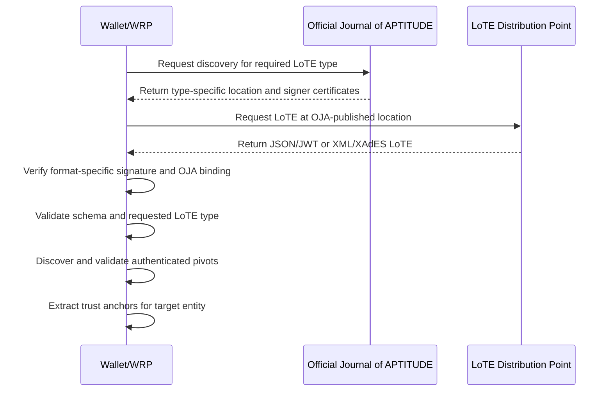

The **Trust Anchor Validation Process** establishes the cryptographic integrity and authenticity of <artifacts:List of Trusted Entities (LoTE)|LoTE>, which are the authoritative sources for <artifacts:Trust Anchor|Trust Anchors>. A <artifacts:Trust Anchor> is an X.509 certificate containing the name and public key used by a <components:Wallet Unit> or <roles:Wallet-Relying Party (WRP)|WRP> to validate an artifact or <credentials:Attestation>.

!!! choice "APTITUDE Implementation Choice"

    All <artifacts:Trust Anchor|Trust Anchors> SHALL be obtained from the applicable dedicated <artifacts:List of Trusted Entities (LoTE)|LoTE>. This applies to <roles:Provider of Person Identification Data (PID Provider)|PID Providers>, <roles:Wallet Provider (WP)|Wallet Providers>, <roles:Provider of Wallet-Relying Party Access Certificate (Provider of WRPAC)|Providers of WRPAC>, <roles:Provider of Wallet-Relying Party Registration Certificate (Provider of WRPRC)|Providers of WRPRC>, <roles:Provider of Public Electronic Attestation of Attributes (PuB-EAA Provider)|PuB-EAA Providers>, <roles:Provider of Qualified Electronic Attestation of Attributes (QEAA Provider)|QEAA Providers>, <roles:Provider of Electronic Attestation of Attributes (EAA Provider)|EAA Providers>, <roles:Registrar|Registrars> and their <components:Register|Registers>.

Depending on the artifact or <credentials:Attestation> being verified, the validating entity SHALL fetch, download, and validate the dedicated <artifacts:List of Trusted Entities (LoTE)|LoTE> for the required entity type. The <artifacts:List of Trusted Entities (LoTE)|LoTE> is used to retrieve <artifacts:Trust Anchor|Trust Anchors> for validating:

1. **Infrastructure Certificates**: <artifacts:Wallet-Relying Party Access Certificate (WRPAC)|WRPACs> and <artifacts:Wallet-Relying Party Registration Certificate (WRPRC)|WRPRCs>.
2. **<artifacts:Wallet Unit Attestation (WUA)|Wallet Unit Attestations (WUAs)>**: <artifacts:Key Attestation (KA)> and <artifacts:Wallet Instance Attestation (WIA)>.
3. **<credentials:Person Identification Data (PID)|PID> Signatures**: <credentials:Person Identification Data (PID)>.
4. **<credentials:Attestation> Signatures and Seals**: <credentials:Qualified Electronic Attestation of Attributes (QEAA)|QEAA>, <credentials:Electronic Attestation of Attributes (EAA)|EAA>, and <credentials:Public Electronic Attestation of Attributes (PuB-EAA)|Pub-EAA>.
5. **Artifacts and <credentials:Attestation> Status and Revocation Information**: <artifacts:Status List Token> for <credentials:Attestation|Attestations>, <artifacts:Key Attestation (KA)|KA>, <artifacts:Wallet Instance Attestation (WIA)|WIA>, and <artifacts:Wallet-Relying Party Registration Certificate (WRPRC)|WRPRC> status information; <artifacts:Certificate Revocation List (CRL)|CRL> or <protocols:Online Certificate Status Protocol (OCSP)|OCSP> for <artifacts:Wallet-Relying Party Access Certificate (WRPAC)|WRPAC> and Sign/Seal Certificate status information.
6. **Registrar-signed Artifacts**: <components:Register> information.

!!! choice "APTITUDE Implementation Choice"

    The <artifacts:Trust Anchor|Trust Anchors> for <roles:Provider of Qualified Electronic Attestation of Attributes (QEAA Provider)|QEAA Providers> and <roles:Provider of Electronic Attestation of Attributes (EAA Provider)|EAA Providers> SHALL be retrieved from and validated against their dedicated <artifacts:List of Trusted Entities (LoTE)|LoTE>. The same <artifacts:List of Trusted Entities (LoTE)|LoTE> validation process SHALL be used for these <artifacts:Trust Anchor|Trust Anchors> as for all other APTITUDE entities.

To verify the authenticity of a retrieved <artifacts:List of Trusted Entities (LoTE)|LoTE>, the validating entity SHALL:

- obtain the location and authorized signing certificate set for the requested <artifacts:List of Trusted Entities (LoTE)|LoTE> type from the <artifacts:Official Journal of APTITUDE (OJA)>;
- verify the <artifacts:List of Trusted Entities (LoTE)|LoTE> signature or seal using the format-specific procedure and bind the signer to the certificate set published in the <artifacts:Official Journal of APTITUDE (OJA)|OJA>;
- validate the <artifacts:List of Trusted Entities (LoTE)|LoTE> structure, requested <artifacts:List of Trusted Entities (LoTE)|LoTE> type, freshness, and any authenticated pivot history.

#### List of Trusted Entities Validation

This section defines the validation of a <artifacts:List of Trusted Entities (LoTE)|LoTE>. The <artifacts:List of Trusted Entities (LoTE)|LoTE> format is specified in [List of Trusted Entities](../sections/trust-artifacts.md#list-of-trusted-entities).

Before validating a <artifacts:List of Trusted Entities (LoTE)|LoTE>, the <components:Wallet Unit> or <roles:Wallet-Relying Party (WRP)|WRP> SHALL select the required <artifacts:List of Trusted Entities (LoTE)|LoTE> type and obtain its type-specific location and authorized signing certificate set from the <artifacts:Official Journal of APTITUDE (OJA)|OJA>. The <artifacts:List of Trusted Entities (LoTE)|LoTE> SHALL be downloaded from the location published for that type.

##### List of Trusted Entities Retrieval and Validation Sequence Diagram



##### List of Trusted Entities Validation Process

The validator initializes the following variables:

**Input Variables**:

- `Requested-LoTE-Type`: The LoTE type required for the artifact or Attestation being validated.
- `OJA-Loc`: URI of the latest known OJA publication for the requested LoTE type.
- `OJA-LoTE-Loc`: URI of the last processed LoTE instance for the requested type. It is initialized to the location published in the OJA.
- `OJA-LoTE-Certs-Set`: The set of certificates authorized by the OJA to verify the requested LoTE type.
- `LoTE`: The JSON/JWT or XML/XAdES LoTE currently being processed. Initialized as `NULL`.
- `LoTE-Format`: The format of `LoTE`, either `JSON` or `XML`.
- `LoTE-Signer-Cert`: The certificate used to verify the signature or seal on `LoTE`. Initialized as `NULL`.
- `LoTESO-Cert`: The signer certificate of the current LoTE or pivot. Initialized as `NULL`.
- `LoTESO-Certs-Set`: Certificates authorized by an authenticated `PointersToOtherLoTE` entry for the next pivot. Initialized as `NULL`.

**Output Variables**:

- `Authenticated-LoTE`: The validated LoTE payload.
- `LoTE-Status`: The validation result, for example `LoTE_VERIFICATION_PASSED`.
- `LoTE-Sub-Status`: Detailed error codes supplementing `LoTE-Status`.

##### JSON LoTE Signature Verification and OJA Binding

This procedure applies when the LoTE is JSON formatted and uses the Compact JAdES Baseline B profile. In the APTITUDE profile, `x5t#S256` is the selected certificate-reference implementation choice for this format. A Compact JAdES signature is a compact JWS; when the JWT representation is selected, the decoded payload SHALL contain the private `LoTE` claim defined in the Compact JAdES profile.

The validator SHALL perform the following operations before using any payload value for pivot discovery or trust-anchor extraction:

1. Parse the JWS Compact Serialization into its protected header, payload, and signature parts. The protected header SHALL contain `alg`, `iat`, and `x5t#S256`; an algorithm value of `none` SHALL be rejected.
2. Decode `x5t#S256` from `Base64url` and compute the SHA-256 digest of the DER encoding of each certificate in the authorized certificate set. Exactly one certificate in `OJA-LoTE-Certs-Set` SHALL match the value. Set that certificate as `LoTE-Signer-Cert`.
3. Verify the JWS signature over the JWS Signing Input using the public key in `LoTE-Signer-Cert`.
4. Decode the payload. If the JWT representation is selected, require the private `LoTE` claim. Validate the LoTE object against `LoTE_Payload_Json_schema.yaml`; otherwise validate the JSON payload against the applicable JSON LoTE schema.
5. Confirm that the `LoTEType` in the authenticated payload equals `Requested-LoTE-Type` and that the `DistributionPoints` value is the endpoint published by the OJA for that type.

If any operation fails, validation SHALL stop with `LoTE-Status` set to `LoTE_VERIFICATION_FAILED` and the applicable signature, certificate-binding, format, or type sub-status.

##### XML LoTE Signature Verification and OJA Binding

This procedure applies when the LoTE is XML formatted and uses XAdES Baseline B. XAdES Baseline B is specified by [@etsi_en_319_132_1_v1.3.1], while [@etsi_en_319_132_2_v1.1.1] defines extended XAdES signatures and is not the governing specification for the Baseline B profile.

The validator SHALL perform the following operations before using any LoTE value for pivot discovery or Trust Anchor extraction:

1. Validate the XML document against the applicable LoTE XML schema and locate the enveloped `ds:Signature` and its `xades:QualifyingProperties`.
2. Validate the XML signature references, including the reference to the LoTE document with `URI=""`, the enveloped-signature transform, and exclusive XML canonicalization. Validate the reference to `xades:SignedProperties` with `Type="http://uri.etsi.org/01903#SignedProperties"`.
3. Extract the signing certificate from `ds:KeyInfo/ds:X509Data/ds:X509Certificate`. The first `xades:SigningCertificateV2/xades:Cert` SHALL contain the digest of the DER encoding of this certificate. The digest SHALL use SHA-256 and the `DigestValue` SHALL use the XML signature Base64 encoding.
4. Compare the extracted certificate, by exact DER certificate identity, with the certificates in `OJA-LoTE-Certs-Set`. Set the matching certificate as `LoTE-Signer-Cert`.
5. Verify the XML signature using `LoTE-Signer-Cert`, including the signed properties and all signed LoTE data objects.
6. Confirm that the LoTE type in the authenticated XML document equals `Requested-LoTE-Type` and that its distribution point is the endpoint published by the OJA for that type.

If any operation fails, validation SHALL stop with `LoTE-Status` set to `LoTE_VERIFICATION_FAILED` and the applicable signature, certificate-binding, format, or type sub-status. XAdES `SigningCertificateV2` is not by itself a Trust Anchor; the exact certificate match to the OJA certificate set is required.

###### LoTE Validation Operations

The validation SHALL perform the following steps:

1. **Initialization.** Select the OJA record for `Requested-LoTE-Type`. Download the JSON/JWT or XML/XAdES file only from the locally configured `OJA-LoTE-Loc` and assign it to `LoTE`.

2. **Current LoTE Signature Integrity Verification.** Determine `LoTE-Format`. Run the applicable JSON or XML signature-validation procedure above.
   - If verification fails, stop with `LoTE-Status = LoTE_VERIFICATION_FAILED`.
   - If successful, set `LoTESO-Cert = LoTE-Signer-Cert`.

3. **Payload and Pivot Discovery.** Now inspect the LoTE payload. Iterate through the `uriValue` claims in `SchemeInformationURI`. Count the valid pivot URIs occurring before the URI matching `OJA-Loc`; let $n$ be that count.
   - If no URI matches `OJA-Loc`, validation SHALL fail with `LoTE-Sub-Status = OJA_LOCATION_INPUT_NOT_MATCHING_OJA_LOCATION_IN_LoTE`.

4. **LoTE Location Conflict.** Obtain `LoTELocation` from the `PointersToOtherLoTE` entry whose `SchemeTerritory` is `EU`. Check:

   ```text
   OJA-LoTE-Loc != LoTELocation AND LoTE != Content at LoTELocation
   ```

   `LoTELocation` SHALL be dereferenced only after Step 2 has succeeded and subject to the applicable URI/network policy.

   - If `TRUE`, stop with `LoTE-Sub-Status = LoTE_FILE_CONFLICT`.
   - Otherwise continue.

5. **LoTE Freshness.** Check:

   ```text
   OJA-LoTE-Loc == LoTELocation AND LoTE != Content at LoTELocation
   ```

   - If `TRUE`, set `LoTE` to the content already fetched from `LoTELocation` and restart from Step 2.
   - Otherwise continue.

6. **Current LoTE Pointer State.** Set `LoTESO-Certs-Set` to the certificates contained in the set `SeviceDigitalIdentity` elements of the `PointersToOtherLoTE` entry whose `SchemeTerritory = EU`.

   - **[XML Only]** If $n=0$, verify that `LoTESO-Cert` is contained in `LoTESO-Certs-Set`. If not, fail with `LoTE_SIGNER_CERT_NOT_AUTHENTICATED_BY_LoTE` sub-status.

7. **Intermediate Pivot Validation.**
   - If $n=0$, proceed to Step 8.
   - Otherwise, iterate $i=1\ldots n$, from the most recent pivot to the oldest:

   **a. Fetch candidate pivot.** Download $Pivot_i$ from the corresponding $i$th `SchemeInformationURI` entry.

   **b. Verify the pivot signature.**
   - Let `Pivot-Signer-Cert` be the certificate used by the signature verification.
   - If signature verification fails, fail with `PIVOT_i_SIGNATURE_VERIFICATION_FAILED`.

   **c. Read the pivot certificate set pointer.** Set `Pivot-Certs-Set` to the certificates in the authenticated `PointersToOtherLoTE` entry for territory `EU`.

   **d. Backward Link Check.** Verify that `LoTESO-Cert`, i.e. the signer of the previously processed newer object (`LoTE` for $i=1$ and $Pivot_{i-1}$ otherwise) is contained in `Pivot-Certs-Set`.
   - Otherwise fail with `PIVOT_i-1_SIGNER_CERT_NOT_AUTHENTICATED_BY_PIVOT_i`.

   **e. Pivot signer self-consistency.**
   **[XML Only]** Verify that `Pivot-Signer-Cert` itself is contained in `Pivot-Certs-Set`.
   - Otherwise fail with `PIVOT_i_SIGNER_CERT_NOT_AUTHENTICATED_BY_PIVOT_i`.

   **f. Advance the chain.** Set:

   ```text
   LoTESO-Cert = Pivot-Signer-Cert
   ```

   and continue with the next, older pivot.

8. **OJA Trust Anchor Validation.** Verify that `LoTESO-Cert` (the signer of the oldest pivot, or the current LoTE when $n=0$) is contained in `OJA-LoTE-Certs-Set`. Otherwise fail with `PIVOT_n_SIGNER_CERT_NOT_AUTHENTICATED_BY_OJA`.

9. **Expiration.** If `NextUpdate` is non-null and the current time is later than `NextUpdate`, validation SHALL fail.

10. **Success.** Set `Authenticated-LoTE = LoTE`, `LoTE-Status = LoTE_VERIFICATION_PASSED`, and clear `LoTE-Sub-Status`.

11. **Update Bookmark.** Only after successful authentication, if `OJA-LoTE-Loc` differs from the `LoTELocation` in `Authenticated-LoTE` for territory `EU`, update `OJA-LoTE-Loc`.

12. **Update Anchor.** This step modifies the persistent Root of Trust configuration and SHALL operate only on authenticated migration information.

    - Let `New-OJA-Loc` be the applicable first OJA publication URI in the `SchemeInformationURI` of `Authenticated-LoTE`.

    - If `OJA-Loc == New-OJA-Loc`, no OJA Trust Anchor update SHALL be performed.

    - If `OJA-Loc != New-OJA-Loc`:
      - Set `OJA-Loc = New-OJA-Loc`.
      - Set `OJA-LoTE-Certs-Set` either:
        1. to the certificate set contained in the authenticated `PointersToOtherLoTE` entry of the migration pivot associated with `New-OJA-Loc`; or
        2. to the certificate set obtained from the independently authenticated OJA publication referenced by `New-OJA-Loc`.

!!! warning

    The <artifacts:List of Trusted Entities (LoTE)|LoTE> validation process is mutuated from the [ETSI TS 119 615] standard, and adapted to the APTITUDE profiles context.

!!! note "Remarks"

    - The OJA record is type-specific: a validator SHALL NOT use the endpoint or certificate set published for one LoTE type to validate another LoTE type.
    - The JSON `x5t#S256` value binds the JWS signer to an OJA-published certificate by the SHA-256 digest of its DER encoding. The XML `SigningCertificateV2` value provides the corresponding XAdES certificate digest, and the validator additionally performs exact certificate matching against the OJA certificate set.
    - Payload fields are not trusted for pivot discovery, distribution-point changes, or Trust Anchor extraction until the format-specific signature and OJA certificate binding have succeeded.
    - A cached LoTE and its OJA-authorized signer certificate MAY be reused only within the caching rules specified in the LoTE profile; the cache SHALL be refreshed no later than `NextUpdate` and when the OJA record changes.

```mermaid
flowchart TD
    classDef failure fill:#f8d7da,stroke:#721c24,color:#721c24,font-weight:bold;
    classDef success fill:#d4edda,stroke:#155724,color:#155724,font-weight:bold;
    classDef warning fill:#fff3cd,stroke:#856404,color:#856404;
    classDef process fill:#fff,stroke:#333,stroke-width:1px;
    classDef decision fill:#e7f3fe,stroke:#0056b3,stroke-width:1px;
    style sub1 fill:#FFFFF0,stroke:#0288d1,stroke-width:2px

    Start([Start LoTE Validation]) --> Init[1. Init & Download LoTE<br/>from locally configured OJA-LoTE-Loc]:::process

    %% Step 2: Integrity verification BEFORE payload inspection
    Init --> DetectFormat[2. Determine LoTE Format<br/>without semantic payload processing]:::process
    DetectFormat --> ResolveSigner[Resolve LoTE-Signer-Cert<br/>from signature metadata / independent source]:::process
    ResolveSigner --> S2{Verify Current LoTE<br/>Cryptographic Signature}:::decision

    S2 -- Invalid --> F2[Fail: LoTE Signature<br/>Verification Failed]:::failure
    S2 -- Valid --> ValidateStructure[Validate payload<br/>schema, LoTE type and profile]:::process
    ValidateStructure --> SelfLoteCheck{XML Pivot signer self-consistency:<br/>Is Pivot-Signer-Cert<br/>in Pivot-Certs-Set?}:::decision
    SelfLoteCheck -- No --> FSelf
    SelfLoteCheck -- Yes --> IntegrityState[Set LoTESO-Cert = LoTE-Signer-Cert]:::warning

    %% Step 3: Only now inspect SchemeInformationURI
    IntegrityState --> S3{Found OJA-Loc URI<br/>in SchemeInformationURI history?}:::decision
    S3 -- "No (NotFound)" --> F3[Fail: OJA Loc Not Found<br/>Trust Anchor Migration Needed]:::failure
    S3 -- "Yes (Set n)" --> S4{Location Conflict?<br/>OJA-LoTE-Loc != LoTELocation AND<br/>LoTE != Content at LoTELocation}:::decision

    %% Steps 4 & 5: Location & Freshness Checks
    S4 -- Yes --> F4[Fail: LoTE File Conflict]:::failure
    S4 -- No --> S5{5. Freshness Check<br/>OJA-LoTE-Loc == LoTELocation AND<br/>LoTE != Content at LoTELocation}:::decision

    S5 -- "Yes (New Version Detected)" --> UpdateLoc[Update OJA-LoTE-Loc]:::warning
    UpdateLoc --> Init
    S5 -- "No (Current is Fresh)" --> S6

    %% Step 6: Current LoTE pointer state
    S6[6. Read EU<br/>PointersToOtherLoTE certificate set]:::process
    S6 --> S6Check{Is n = 0?}:::decision

    S6Check -- Yes --> SelfCheck{Is current LoTE signer<br/>contained in its <br/>self-pointer certificate set?}:::decision
    SelfCheck -- No --> FSelf[Fail: LoTE Signer Not<br/>Authenticated by LoTE Self-Pointer]:::failure
    SelfCheck -- Yes --> S8

    S6Check -- "No (n > 0)" --> LoopStart[7. Start Pivot Loop<br/>i = 1 to n]:::process

    %% Step 7: Pivot validation
    subgraph sub1 [Pivot Validation Chain]
        LoopStart --> DownloadPivot[Fetch candidate Pivot i<br/>from $i$th SchemeInformationURI]:::process

        DownloadPivot --> PivotSig{Verify Pivot i Signature}:::decision
        PivotSig -- Invalid --> FSigPivot[Fail: Pivot i<br/>Signature Invalid]:::failure

        PivotSig -- Valid --> ReadPivotSet[Read Pivot-Certs-Set]:::process

        ReadPivotSet --> LinkCheck{Backward Link Check:<br/>Is signer of newer LoTE/Pivot<br/>in Pivot-Certs-Set?}:::decision
        LinkCheck -- No --> FLink[Fail: Broken Trust Chain<br/>Previous Signer Not Authenticated<br/>by Pivot i]:::failure

        LinkCheck -- Yes --> SelfPivotCheck{XML Pivot signer self-consistency:<br/>Is Pivot-Signer-Cert<br/>in Pivot-Certs-Set?}:::decision
        SelfPivotCheck -- No --> FSelfPivot[Fail: Pivot Signer Not<br/>Authenticated by Pivot i]:::failure

        SelfPivotCheck -- Yes --> AdvanceSigner[Set LoTESO-Cert = Pivot-Signer-Cert]:::process
        AdvanceSigner --> LoopNext{i < n ?<br/>More Pivots?}:::decision
    end

    LoopNext -- "Yes (i++)" --> DownloadPivot
    LoopNext -- No --> S8

    %% Step 8: Final OJA binding
    S8{8. OJA Trust Anchor Validation:<br/>Is final LoTESO-Cert in<br/>OJA-LoTE-Certs-Set?}:::decision
    S8 -- No --> F8[Fail: Final Signer Not<br/>Authenticated by OJA]:::failure

    %% Step 9: Expiration
    S8 -- Yes --> S9{9. Expiration Check:<br/>Now > NextUpdate?}:::decision
    S9 -- Yes --> F9[Fail: LoTE Expired]:::failure

    %% Step 10: Success
    S9 -- No --> Success[10. Validation PASSED<br/>Set Authenticated-LoTE = LoTE]:::success

    %% Steps 11 & 12: Persistent updates only after authentication
    Success --> UpdateBM[11. Update Local Bookmark<br/>OJA-LoTE-Loc if authenticated<br/>LoTELocation changed]:::process

    UpdateBM --> UpdateTA[12. Update Root of Trust Config<br/>only from Authenticated-LoTE and/or<br/>independently authenticated OJA data]:::warning

    UpdateTA --> End([End Process])

    %% Consolidation of failure endpoints
    F2 --> EndFail([Stop: Validation FAILED]):::failure
    F3 --> EndFail
    F4 --> EndFail
    FSelf --> EndFail
    FSigPivot --> EndFail
    FLink --> EndFail
    FSelfPivot --> EndFail
    F8 --> EndFail
    F9 --> EndFail
```

Below is a flowchart summarizing the validation of a <artifacts:List of Trusted Entities (LoTE)|LoTE>:


