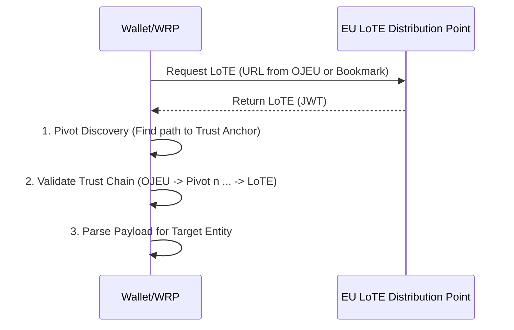
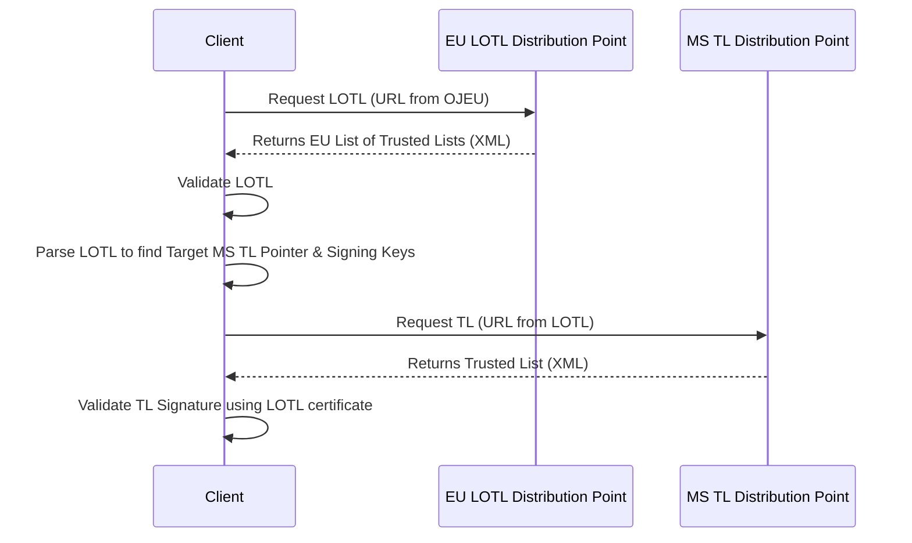
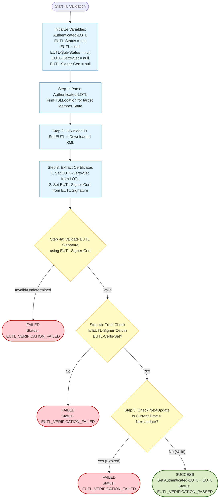

The **Trust Anchor Validation Process** establishes the cryptographic integrity and authenticity of <artifacts:Trusted List (TL)|Trusted Lists>, which serve as the authoritative sources for <artifacts:Trust Anchor|Trust Anchors>. A <artifacts:Trust Anchor> is a self-signed X.509 certificate containing the names and public key used by a <components:Wallet Unit> or <roles:Wallet-Relying Party (WRP)> to validate an artifact or <credentials:Attestation>.

Depending on the artifact or <credentials:Attestation> being verified, the validating Entity SHALL fetch, download, and validate the appropriate <artifacts:Trusted List (TL)|Trusted List>:

1. *<artifacts:List of Trusted Entities (LoTE)>*, used to retrieve <artifacts:Trust Anchor|Trust Anchors> for validating the following:
   - **Infrastructure Certificates**: <artifacts:Wallet-Relying Party Access Certificate (WRPAC)|WRPAC> or <artifacts:Wallet-Relying Party Registration Certificate (WRPRC)|WRPRC>.
   - **<artifacts:Wallet Unit Attestations (WUAs)>**: <artifacts:Key Attestation (KA)> or <artifacts:Wallet Instance Attestation (WIA)>.
   - **PID Signatures**: <credentials:Person Identification Data (PID)>.
   - **<roles:Registrar>-signed artifacts**: <components:Register> informations.
2. *<artifacts:Trusted List (TL)|Trusted Lists>* (<artifacts:Trusted List (TL)|TL>); used to retrieve <artifacts:Trust Anchor|Trust Anchors> for validating the following:
   - seal or signature on a <credentials:Qualified Electronic Attestation of Attributes (QEAA)>; or
   - seal or signature on a <credentials:Public Electronic Attestation of Attributes (PuB-EAA)>.

To verify the authenticity of the retrieved <artifacts:Trusted List (TL)|Trusted Lists>, the Entity SHALL perform the following validations:

- [LoTE Validation](#list-of-trusted-entities-validation-process): Validate the digital signature of the <artifacts:List of Trusted Entities (LoTE)|LoTE> by verifying it against the <roles:List of Trusted Entities Provider (LoTE Provider)|LoTE Provider> certificate. This certificate is authenticated via the <artifacts:Official Journal of the European Union (OJEU)>.
- [TL Validation](#trusted-list-validation-process): Validate the digital signature of the <artifacts:Trusted List (TL)|TL> by verifying it against the corresponding Member State public keys published in the <artifacts:List Of Trusted Lists (LOTL)>. The <artifacts:List Of Trusted Lists (LOTL)|LOTL> itself is authenticated by validating its digital signature against the <artifacts:Official Journal of the European Union (OJEU)>.

To support continuous key rotation, both artifacts implement a pivoting mechanism. This ensures that an Entity possessing the last known valid version can reliably discover the location of the next version and validate it using the unbroken chain of trust rooted in the <artifacts:Official Journal of the European Union (OJEU)|OJEU>.

#### List of Trusted Entities Validation

This section defines the validation of the EU-level <artifacts:List of Trusted Entities (LoTE)>. The <artifacts:List of Trusted Entities (LoTE)|LoTE> is a digitally signed/sealed artifact (JWT format) containing metadata and public keys for entities operating at the EU level.

Prior to validating the <artifacts:List of Trusted Entities (LoTE)|LoTE>, the <components:Wallet Unit> SHALL download the <artifacts:List of Trusted Entities (LoTE)|LoTE> from the protected location (URI) published in the <artifacts:Official Journal of the European Union (OJEU)|OJEU>.

##### List of Trusted Entities Retrieval and Validation Sequence Diagram

##### List of Trusted Entities Validation Process

The validator initializes the following variables as described in [ETSI TS 119 615].

**Input Variables**:

- `OJEU-Loc`: URI of the latest (known) <artifacts:Official Journal of the European Union (OJEU)|OJEU> publication.
- `OJEU-LoTE-Loc`: URI of the last processed <artifacts:List of Trusted Entities (LoTE)|LoTE>. Defaults to the value in `OJEU-Loc`.
- `OJEU-LoTE-Certs-Set`: The set of <artifacts:Trust Anchor> certificates from the `OJEU-Loc` publication.
- `LoTE`: The <artifacts:List of Trusted Entities (LoTE)|LoTE> JWT currently being processed. Initialized as NULL.
- `LoTE-Signer-Cert`: The certificate extracted from the x5c header parameter of the <artifacts:List of Trusted Entities (LoTE)|LoTE>.
- `LoTESO-Cert`: Temporary variable for the Scheme Operator certificate being validated. Initialized as NULL.
- `LoTESO-Certs-Set`: Trusted certificates extracted from the `PointersToOtherLoTE` claim (`SchemeTerritory` `EU`) of a <artifacts:List of Trusted Entities (LoTE)|LoTE> or Pivot. Initialized as NULL.

**Output Variables**:

- `Authenticated-LoTE`: The validated JSON payload.
- `LoTE-Status`: The validation result (e.g., `LoTE_VERIFICATION_PASSED`).
- `LoTE-Sub-Status`: detailed error codes.

**Validation Steps**:
The validation SHALL perform the following steps:

1. (Initialization) Download the JWT file from `OJEU-LoTE-Loc` and assign it to `LoTE`.
2. (Parsing) Extract the first certificate from the `x5c` header of `LoTE` and assign it to `LoTE-Signer-Cert`.
3. (Pivot Discovery) Iterate through the `uriValue` claims in the `SchemeInformationURI` object. Count the number of valid URIs found before encountering the URI matching `OJEU-Loc`. Let $n$ be that count.
    - If no URI matches `OJEU-Loc`: Validation SHALL fail with `LoTE-Status` set to `LoTE_VERIFICATION_FAILED` and `LoTE-Sub-Status` set to `OJEU_LOCATION_INPUT_NOT_MATCHING_OJEU_LOCATION_IN_LoTE`. (This implies a Trust Anchor migration is required).
4. (<artifacts:List of Trusted Entities (LoTE)|LoTE> Location Conflict) Check the condition: `OJEU-LoTE-Loc != LoTELocation` AND `LoTE != Content at LoTELocation`.
    - (`LoTELocation` is the URI in the `PointersToOtherLoTE` claim of `LoTE` with `SchemeTerritory` = `EU`).
    - If `TRUE`: Validation SHALL stop with `LoTE-Status` set to `LoTE_VERIFICATION_FAILED` and `LoTE-Sub-Status` set to `LoTE_FILE_CONFLICT`.
    - If `FALSE`, proceed to the next step.
5. (<artifacts:List of Trusted Entities (LoTE)|LoTE> Freshness) Check the condition: `OJEU-LoTE-Loc == LoTELocation` AND `LoTE !=` Content at `LoTELocation`.
    - If `TRUE`: Set `OJEU-LoTE-Loc` to `LoTELocation` and restart from Step 1.
    - If `FALSE`, proceed to the next step.
6. (Digital Signature Validation) Validate the cryptographic signature of the current `LoTE` using the public key from `LoTE-Signer-Cert`.
    - If validation fails: Stop with `LoTE-Status` set to `LoTE_VERIFICATION_FAILED` and `LoTE-Sub-Status` set to `LoTE_SIGNATURE_VERIFICATION_FAILED`.
    - If successful:
        - Set `LoTESO-Cert` to `LoTE-Signer-Cert`.
        - Set `LoTESO-Certs-Set` to the certificates found in the `PointersToOtherLoTE` claim (territory `EU`) of the current `LoTE` payload.
7. (Intermediate Pivot Validation)
    - Case $n=0$ (No Pivots): Proceed directly to Step 8.
    - Case $n>0$ (History Chain):
        - Iterate $i$ from 1 to $n$ (from most recent Pivot to oldest). Let `Pivot` be the file downloaded from the $i$-th URI.
        - (Link Check) Set `Pivot-Certs-Set` to the certificates in the `PointersToOtherLoTE` claim (territory `EU`) of `Pivot`. If `LoTESO-Cert` (the signer of the previous file in the chain) is not in `Pivot-Certs-Set`, validation SHALL fail with `LoTE-Sub-Status` set to `PIVOT_i-1_SIGNER_CERT_NOT_AUTHENTICATED_BY_PIVOT_i`.
        - (Update Signer) Set `LoTESO-Cert` to the first certificate in the `x5c` header parameter of `Pivot`.
        - (Verify Signature) Validate the signature of `Pivot` using `LoTESO-Cert`. If it fails, validation SHALL fail with `LoTE-Status` set to `LoTE_VERIFICATION_FAILED`, and `LoTE-Sub-Status` set to `PIVOT_i_SIGNATURE_VERIFICATION_FAILED`.
        - The loop continues, walking backwards until LoTESO-Cert represents the signer of the oldest Pivot.
8. (<artifacts:Trust Anchor> Validation) Verify the end of the chain. If `LoTESO-Cert` (from the last Pivot or current <artifacts:List of Trusted Entities (LoTE)|LoTE>) is not in `OJEU-LoTE-Certs-Set` (the <artifacts:Trust Anchor>), validation SHALL fail with `LoTE-Sub-Status` set to `PIVOT_n_SIGNER_CERT_NOT_AUTHENTICATED_BY_OJEU`.
9. (Expiration) If current time > `NextUpdate` claim of `LoTE`, validation SHALL fail.
10. (Success) Set `Authenticated-LoTE` to `LoTE`, `LoTE-Status` to `LoTE_VERIFICATION_PASSED`.
11. (Update Bookmark) If `OJEU-LoTE-Loc` does not match the `LoTELocation` in `Authenticated-LoTE` (territory `EU`), update `OJEU-LoTE-Loc` to that value.
12. (Update Anchor) [Caution: This step modifies the Root of Trust configuration]
    - If `OJEU-Loc` does not match the first URI in `SchemeInformationURI`, update `OJEU-LoTE-Loc`.
    - Update `OJEU-LoTE-Certs-Set` according to the new <artifacts:Trust Anchor> either in `Authenticated-LoTE` or from a new <artifacts:Official Journal of the European Union (OJEU)|OJEU> publication.

**Remarks**:

- Steps 4, 5 and 11 allow modifying the location of the <artifacts:List of Trusted Entities (LoTE)|LoTE> file without changing the <artifacts:Trust Anchor>, as long as the both the old and the new location have the same content (otherwise the validation fails with `LoTE_FILE_CONFLICT` status). This allows the <artifacts:List of Trusted Entities (LoTE)|LoTE> to be retrieved from different locations (e.g., mirrors) without affecting the <artifacts:Trust Anchor> validation as long as the content is the same.
- In case of `OJEU_LOCATION_INPUT_NOT_MATCHING_OJEU_LOCATION_IN_LoTE` error, it is likely that the <artifacts:Official Journal of the European Union (OJEU)|OJEU> publication has been updated with a new location for the <artifacts:List of Trusted Entities (LoTE)|LoTE>, and the validation process needs to be restarted with the new location.
- In step 8, the validator established the binding of the signer certificate of the `LoTE` XML with the certificate referenced in the <artifacts:Official Journal of the European Union (OJEU)|OJEU>, effectively using the latter as a <artifacts:Trust Anchor>.

To validate a <credentials:Public Electronic Attestation of Attributes (PuB-EAA)|Pub-EAA> <artifacts:List of Trusted Entities (LoTE)|LoTE> in XML format (XAdES) containing the sought <artifacts:Trust Anchor>, the <components:Wallet Unit> or WRP SHALL perform the same steps as described in [List of Trusted Lists Validation Process](#list-of-trusted-lists-validation-process) for the <artifacts:List of Trusted Entities (LoTE)|LoTE>, with the following difference: the variables and status codes used throughout have `LoTE` in place of `LOTL`.

Below is a flowchart summarizing the above steps for the validation of the <artifacts:List of Trusted Entities (LoTE)|LoTE>:

#### Trusted List Validation

This section defines the validation of <artifacts:Trusted List (TL)|Trusted Lists (TLs)>. The <artifacts:Trusted List (TL)|TL> is an XML artifact signed by a Member State Scheme Operator. In order to validate the <artifacts:Trusted List (TL)|TL>, the <components:Wallet Unit> or WRP uses the following validation hierarchy:

1. The <components:Wallet Instance|Wallet>/<roles:Wallet-Relying Party (WRP)|WRP> SHALL first validate the EU List of <artifacts:Trusted List (TL)|Trusted Lists> (<artifacts:List Of Trusted Lists (LOTL)|LOTL>).
2. The <components:Wallet Instance|Wallet>/<roles:Wallet-Relying Party (WRP)|WRP> uses the authenticated <artifacts:List Of Trusted Lists (LOTL)|LOTL> to discover and validate the <artifacts:Trusted List (TL)|TL>.

##### European Union Member State Trusted List Retrieval and Validation Sequence Diagram

In the diagram above, a <components:Wallet Unit> or <roles:Wallet-Relying Party (WRP)|WRP> downloads and validates a <artifacts:Trusted List (TL)|TL> by performing the following steps:

1. requests the <artifacts:List Of Trusted Lists (LOTL)|LOTL> at the location indicated by the URL published in the <artifacts:Official Journal of the European Union (OJEU)|OJEU>;
2. the <artifacts:List Of Trusted Lists (LOTL)|LOTL> distribution point returns the <artifacts:List Of Trusted Lists (LOTL)|LOTL> XML document;
3. validates the signature/seal on the downloaded <artifacts:List Of Trusted Lists (LOTL)|LOTL> and verifies its validity;
4. parses the <artifacts:List Of Trusted Lists (LOTL)|LOTL> to retrieve the location (`TSLLocation`) and the associated validation certificates (`DigitalId`) for the target Member State's <artifacts:Trusted List (TL)|Trusted List> Service Operator.
5. requests the <artifacts:Trusted List (TL)|TL> at the location indicated by the `TSLLocation` field in the <artifacts:List Of Trusted Lists (LOTL)|LOTL>;
6. the <artifacts:Trusted List (TL)|TL> distribution point returns the <artifacts:Trusted List (TL)|TL> XML document;
7. validates the signature/seal on the downloaded MS <artifacts:Trusted List (TL)|TL> using the certificates obtained from the <artifacts:List Of Trusted Lists (LOTL)|LOTL> in Step 4.
8. parses the <artifacts:Trusted List (TL)|TL> to retrieve the metadata and public key certificates of the relevant entities (e.g., <roles:QEAA Provider|QEAA Providers>, <roles:PuB-EAA Provider|Pub-EAA Providers>) and use them as trustworthy Trust Anchors for verifying signatures/seals on <credentials:Qualified Electronic Attestation of Attributes (QEAA)|QEAAs> or <credentials:Public Electronic Attestation of Attributes (PuB-EAA)|Pub-EAAs>.

If any of the above verifications fail, the validation process SHALL be aborted and the <artifacts:List of Trusted Entities (LoTE)|LoTE> SHALL be considered invalid. If all verifications succeed, the <components:Wallet Unit> or WRP can parse the <artifacts:Trusted List (TL)|TL> to retrieve the metadata and public key certificates of the relevant entities (i.e., <roles:QEAA Provider|QEAA Providers> or <roles:PuB-EAA Provider|Pub-EAA Providers>) and use them as trustworthy <artifacts:Trust Anchor|Trust Anchors> for verifying signatures/seals on <credentials:Qualified Electronic Attestation of Attributes (QEAA)|QEAAs> or <credentials:Public Electronic Attestation of Attributes (PuB-EAA)|Pub-EAAs>.

##### European Union Member State Trusted List Validation Process

To validate a <artifacts:Trusted List (TL)|TL> containing the sought <artifacts:Trust Anchor>, the <components:Wallet Unit> or <roles:Relying Party (RP)|Relying Party> SHALL validate both the <artifacts:List Of Trusted Lists (LOTL)|LOTL> and the <artifacts:Trusted List (TL)|TL>. The validation of the <artifacts:List Of Trusted Lists (LOTL)|LOTL> is a prerequisite for the validation of the <artifacts:Trusted List (TL)|TL>, as the <artifacts:Trust Anchor> for validating the <artifacts:Trusted List (TL)|TL> is obtained from the <artifacts:List Of Trusted Lists (LOTL)|LOTL>.

###### List of Trusted Lists Validation Process

**Remarks**: The logic mirrors the <artifacts:List of Trusted Entities (LoTE)|LoTE> validation but uses XML signatures and <artifacts:Trusted List (TL)|TL>-specific elements. The validation process is as described in [ETSI TS 119 615].

- The XML Pivot logic (Step 6) includes a "Self-Consistency Check" not present in the JWT logic due to the fact that the `Signature` element is not integrity protected.

The <components:Wallet Unit> or <roles:Relying Party (RP)|Relying Party> initializes the following input variables for the <artifacts:List Of Trusted Lists (LOTL)|LOTL> validation:

- `OJEU-Loc`: URI value referencing the latest publication of the <artifacts:Official Journal of the European Union (OJEU)|Official Journal of the European Union> (<artifacts:Official Journal of the European Union (OJEU)|OJEU>) related to data on <artifacts:Trusted List (TL)|TL>.
- `OJEU-LOTL-Loc`: URI value representing the location where the last processed instance of the <artifacts:List Of Trusted Lists (LOTL)|LOTL> XML file is available. If not available, this is initialized from the `OJEU-Loc` publication.
- `OJEU-LOTL-Certs-Set`: The set of certificates used to ensure the authenticity and integrity of the <artifacts:List Of Trusted Lists (LOTL)|LOTL>. Initialized from the `OJEU-Loc` publication.
- `LOTL`: The XML file of the <artifacts:List Of Trusted Lists (LOTL)|LOTL> currently being processed. Initialized as `null`.
- `LOTL-Signer-Cert`: Extracted from `ds:X509Certificate` in the <artifacts:List Of Trusted Lists (LOTL)|LOTL> signature. Initialized as `null`.
- `LOTLSO-Cert`: The certificate of the <roles:LOTL Scheme Operator (LOTLSO)> extracted from the `KeyInfo` element of the <artifacts:List Of Trusted Lists (LOTL)|LOTL> signature. Initialized as `null`.
- `LOTLSO-Cert-Sets`: The set of trusted certificates extracted from the `PointersToOtherTSL` element (with `SchemeTerritory` = `EU`) within a <artifacts:List Of Trusted Lists (LOTL)|LOTL> or Pivot file. Initialized as `null`.

The operations described below produce the following output variables:

- `Authenticated-LOTL`: The authenticated XML version of the current instance of the <artifacts:List Of Trusted Lists (LOTL)|LOTL>.
- `LOTL-Status`: The status indication of the process of authenticating the current instance of the <artifacts:List Of Trusted Lists (LOTL)|LOTL>.
- `LOTL-Sub-Status`: A list of indications supplementing <artifacts:List Of Trusted Lists (LOTL)|LOTL>-Status indication of the process of authenticating the current instance of the <artifacts:List Of Trusted Lists (LOTL)|LOTL>.

The validation operations for the <artifacts:List Of Trusted Lists (LOTL)|LOTL> SHALL perform the following steps (see [ETSI TS 119 615, clause 4.1.4] for reference):

1. [PRO-4.1.4-1] (Initialization) Set `LOTL` to the XML file downloaded from `OJEU-LOTL-Loc`.
2. [PRO-4.1.4-2] (Parsing) Set `LOTL-Signer-Cert` to the certificate extracted from the `ds:X509Certificate` element within the `ds:Signature` of the `LOTL`.
3. [PRO-4.1.4-3, PRO-4.1.4-4] (Pivot Discovery) Iterate through the URIs in the `SchemeInformationURI` element. Count the number of successive valid XML URIs found before encountering the URI matching `OJEU-Loc`. Let $n$ be that count. If no URI matches `OJEU-Loc`, the validation SHALL fail with `LOTL-Status` set to `LOTL_VERIFICATION_FAILED` and `LOTL-Sub-Status` set to `OJEU_LOCATION_INPUT_NOT_MATCHING_OJEU_LOCATION_IN_LOTL`.
4. [PRO-4.1.4-5] (<artifacts:List Of Trusted Lists (LOTL)|LOTL> Location Conflict) Check the condition: `OJEU-LOTL-Loc != TSLLocation` AND `LOTL != Content at TSLLocation`.
    - (`TSLLocation` is the URI in the `PointersToOtherTSL` element of `LOTL` with `SchemeTerritory` = `EU`).
    - If TRUE: Validation SHALL stop with `LOTL-Status` set to `LOTL_VERIFICATION_FAILED` and `LOTL-Sub-Status` set to `LOTL_FILE_CONFLICT`.
    - If FALSE: Proceed to the next step.
5. [PRO-4.1.4-6] (<artifacts:List Of Trusted Lists (LOTL)|LOTL> Freshness) Check the condition: `OJEU-LOTL-Loc == TSLLocation` AND `LOTL != Content at TSLLocation`.
    - If TRUE: Set `OJEU-LOTL-Loc` to `TSLLocation` and restart from Step 1.
    - If the result is `FALSE`, proceed to the next step.
6. [PRO-4.1.4-7] Validate the digital signature of the current `LOTL` using the public key from `LOTL-Signer-Cert`.
    - [PRO-4.1.4-8] If validation fails: Stop with `LOTL-Status` set to `LOTL_VERIFICATION_FAILED`.
    - [PRO-4.1.4-9] If successful: Set `LOTLSO-Cert` to `LOTL-Signer-Cert`. Set `LOTLSO-Certs-Set` to the certificates found in the `PointersToOtherTSL` tuple (territory `EU`) of the current `LOTL`.
7. (Intermediate Pivot Validation)
    - [PRO-4.1.4-10] If $n = 0$ (No Pivots):
        - If `LOTLSO-Cert` is not in `OJEU-LOTL-Certs-Set`, validation SHALL fail (Signer not authorized by <artifacts:Trust Anchor>). Otherwise, proceed to Step 8.
    - [PRO-4.1.4-11] If $n > 0$ (History Chain):
        - Iterate $i$ from 1 to $n$ (from most recent Pivot to oldest). Let `Pivot` be the file at the $i$-th URI.
        - (Link Check) Set `Pivot-Certs-Set` to the certificates in the `PointersToOtherTSL` (territory `EU`) of `Pivot`. If `LOTLSO-Cert` (from the previous step) is not in `Pivot-Certs-Set`, validation SHALL fail with `LOTL-Sub-Status` set to `PIVOT_i-1_SIGNER_CERT_NOT_AUTHENTICATED_BY_PIVOT_i`.
        - (Extract Signer) Set `LOTLSO-Cert` to the certificate extracted from the signature of `Pivot`.
        - (Self-Consistency Check) If `LOTLSO-Cert` is not in `Pivot-Certs-Set`, validation SHALL fail with `LOTL-Sub-Status` set to `PIVOT_i_SIGNER_CERT_NOT_AUTHENTICATED_BY_PIVOT_i`.
        - (Verify Signature) Validate the signature of `Pivot` using `LOTLSO-Cert`. If it fails, validation SHALL fail with `LOTL-Sub-Status` set to `PIVOT_i_SIGNATURE_VERIFICATION_FAILED`.
        - The loop continues with the new `LOTLSO-Cert` acting as the input for the next Pivot or the Anchor.
8. [PRO-4.1.4-12] (<artifacts:Trust Anchor> Validation) If `LOTLSO-Cert` (from the last Pivot) is not in `OJEU-LOTL-Certs-Set` (the <artifacts:Trust Anchor>), validation SHALL fail with `LOTL-Sub-Status` set to `PIVOT_n_SIGNER_CERT_NOT_AUTHENTICATED_BY_OJEU`.
9. [PRO-4.1.4-13] (Expiration) If current time > `NextUpdate` of `LOTL`, validation SHALL fail with `LOTL-Sub-Status` set to `LOTL_NEXTUPDATE_PASSED`.
10. [PRO-4.1.4-14, 15] (Success) Set `Authenticated-LOTL` to `LOTL`, `LOTL-Status` to `LOTL_VERIFICATION_PASSED`.
11. [PRO-4.1.4-16] (Location Update) If `OJEU-LOTL-Loc` does not match the `TSLLocation` in `Authenticated-LOTL` (territory `EU`), update `OJEU-LOTL-Loc` to that value.
12. [PRO-4.1.4-17] (Update Anchor) [Caution: This step modifies the Root of Trust configuration]
    - If the `OJEU-Loc` does not match the URI to the first `SchemeInformationURI` tuple, set the `OJEU-Loc` variable to that URI.
    - Update `OJEU-LOTL-Certs-Set` to the certificates found in `Authenticated-LOTL` (or from the new <artifacts:Official Journal of the European Union (OJEU)|OJEU> publication).

###### European Union Member State Trusted List Validation Process

The validation operations for the <artifacts:Trusted List (TL)|TL> SHALL perform the following steps (see [ETSI TS 119 615, clause 4.2.4] for reference).

**Input variables**: [PRO-4.2.4-01, PRO-4.2.4-02]

- `Authenticated-LOTL`: The authenticated XML version of the current instance of the <artifacts:List Of Trusted Lists (LOTL)|LOTL> obtained from the validation of the <artifacts:List Of Trusted Lists (LOTL)|LOTL>.
- `EUTL-Status`: The XML file of the <artifacts:Trusted List (TL)|TL> currently being processed. This variable is initialized as `null`.
- `EUTL-Sub-Status`: A list of indications supplementing `EUTL-Status` indication of the process of authenticating the current instance of the <artifacts:Trusted List (TL)|TL>.
- `EUTL`: The XML file of the <artifacts:Trusted List (TL)|TL> currently being processed. This variable is initialized as `null`.
- `EUTL-Certs-Set`: The full set of certificates used for ensuring authenticity and integrity of the <artifacts:Trusted List (TL)|TL>. This variable is initialized as `null`.
- `EUTL-Signer-Cert`: The certificate extracted from the XML signature of the <artifacts:Trusted List (TL)|TL>. This variable is initialized as `null`.

**Validation Steps**:

1. [PRO-4.2.4-03] (Parsing) Parse the `Authenticated-LOTL` to find the `TSLLocation` field in the `PointersToOtherTSL` element with `SchemeTerritory` value matching the target Member State.
2. [PRO-4.2.4-04] (<artifacts:Trusted List (TL)|TL> Download) Download the XML file from the `TSLLocation` found in the previous step and set the `EUTL` variable to the downloaded XML file.
3. [PRO-4.2.4-05, PRO-4.2.4-06] (<artifacts:Trusted List (TL)|TL> Parsing) Parse the `Authenticated-LOTL` to find the `X509Certificates` tuple in the `ServiceDigitalIdentity` element of the `PointersToOtherTSL` element with `SchemeTerritory` value matching the target Member State, and set the `EUTL-Certs-Set` variable to the full set of certificates available in that tuple. The set the `EUTL-Signer-Cert` variable to the certificate extracted from the XML in the `ds:X509Certificate` element in the `ds:KeyInfo` element in the `Signature` element of the `EUTL`.
4. [PRO-4.2.4-07, PRO-4.2.4-08, PRO-4.2.4-09] (<artifacts:Trusted List (TL)|TL> Integrity and Authenticity Validation)
    - Validate the digital signature of the `EUTL` using the `EUTL-Signer-Cert`. If the signature validation fails, or it is undetermined, the validation SHALL fail with `EUTL-Status` set to `EUTL_VERIFICATION_FAILED`, and `EUTL-Sub-Status` set to `EUTL_SIGNATURE_VERIFICATION_FAILED`.
    - If the signature validation is successful, check that the `EUTL-Signer-Cert` is in the `EUTL-Certs-Set` (i.e., the signing certificate of the <artifacts:Trusted List (TL)|TL> has not been tampered with). If the check fails, the validation SHALL fail with `EUTL-Status` set to `EUTL_VERIFICATION_FAILED`, `Authenticated-LOTL` set to `null`, and `EUTL-Sub-Status` set to `EUTLSO_SIGNER_CERT_NOT_AUTHENTICATED_BY_LOTL`.
5. [PRO-4.2.4-10] (<artifacts:Trusted List (TL)|TL> Validity Check) Check the `NextUpdate` field in the `EUTL`.
    - If the current date/time is greater than the `NextUpdate` value, the validation SHALL fail with `EUTL-Status` set to `EUTL_VERIFICATION_FAILED`, and `EUTL-Sub-Status` set to `WARNING_EUTL_NEXTUPDATE_PASSED`.
6. [PRO-4.2.4-11, PRO-4.2.4-12] If all the above checks are successful, set `Authenticated-EUTL` to the value of the currently validated `EUTL`, `EUTL-Status` to `EUTL_VERIFICATION_PASSED`, and `EUTL-Sub-Status` to an empty list.

Below is a flowchart summarizing the above steps for the validation of the <artifacts:Trusted List (TL)|TL>:

