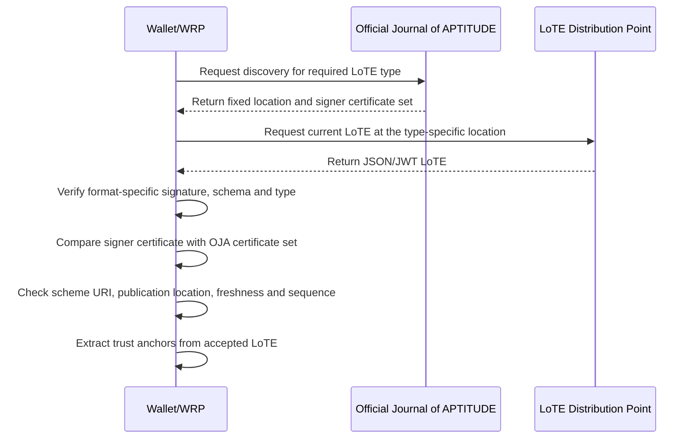
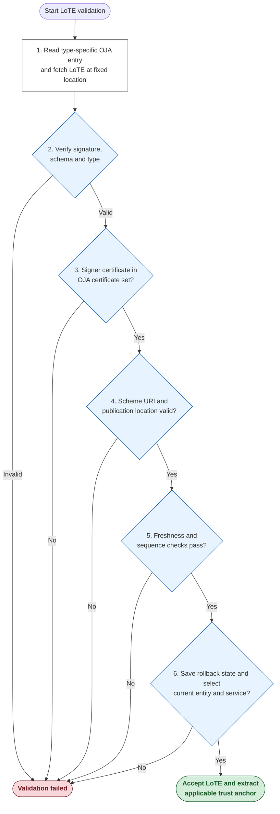

The **Trust Anchor Validation Process** verifies the cryptographic integrity of a <artifacts:List of Trusted Entities (LoTE)|LoTE> and checks its signing certificate against the set published for its type in the <artifacts:Official Journal of APTITUDE (OJA)|OJA>. For <roles:Provider of Qualified Electronic Attestation of Attributes (QEAA Provider)|QEAA Providers>, it instead authenticates the pilot <artifacts:List Of Trusted Lists (LOTL)|LOTL> and the <artifacts:Trusted List (TL)|Trusted List> it points to. The accepted <artifacts:List of Trusted Entities (LoTE)|LoTE> and the accepted pilot <artifacts:Trusted List (TL)|Trusted List> are the sources for <artifacts:Trust Anchor|Trust Anchors>. A <artifacts:Trust Anchor> is an X.509 certificate containing the name and public key used by a <components:Wallet Unit> or <roles:Wallet-Relying Party (WRP)|WRP> to validate an artifact or <credentials:Attestation>.

!!! choice "APTITUDE Implementation Choice"

    All <artifacts:Trust Anchor|Trust Anchors> SHALL be obtained from the applicable dedicated <artifacts:List of Trusted Entities (LoTE)|LoTE>, except those of <roles:Provider of Qualified Electronic Attestation of Attributes (QEAA Provider)|QEAA Providers>, which SHALL be obtained from the pilot <artifacts:List Of Trusted Lists (LOTL)|LOTL> and <artifacts:Trusted List (TL)|Trusted Lists> as specified in this section. This applies to <roles:Provider of Person Identification Data (PID Provider)|PID Providers>, <roles:Wallet Provider (WP)|Wallet Providers>, <roles:Provider of Wallet-Relying Party Access Certificate (Provider of WRPAC)|Providers of WRPAC>, <roles:Provider of Wallet-Relying Party Registration Certificate (Provider of WRPRC)|Providers of WRPRC>, <roles:Provider of Public Electronic Attestation of Attributes (PuB-EAA Provider)|PuB-EAA Providers>, <roles:Provider of Electronic Attestation of Attributes (EAA Provider)|EAA Providers>, <roles:Registrar|Registrars> and their <components:Register|Registers>.

Depending on the artifact or <credentials:Attestation> being verified, the validating entity SHALL fetch, download, and validate the dedicated <artifacts:List of Trusted Entities (LoTE)|LoTE> for the required entity type, or the pilot <artifacts:List Of Trusted Lists (LOTL)|LOTL> and <artifacts:Trusted List (TL)|Trusted List> for <credentials:Qualified Electronic Attestation of Attributes (QEAA)|QEAA>. The lists are used to retrieve <artifacts:Trust Anchor|Trust Anchors> for validating:

1. **Infrastructure Certificates**: <artifacts:Wallet-Relying Party Access Certificate (WRPAC)|WRPACs> and <artifacts:Wallet-Relying Party Registration Certificate (WRPRC)|WRPRCs>.
2. **<artifacts:Wallet Unit Attestation (WUA)|Wallet Unit Attestations (WUAs)>**: <artifacts:Key Attestation (KA)> and <artifacts:Wallet Instance Attestation (WIA)>.
3. **<credentials:Person Identification Data (PID)|PID> Signatures**: <credentials:Person Identification Data (PID)>.
4. **<credentials:Attestation> Signatures and Seals**: <credentials:Qualified Electronic Attestation of Attributes (QEAA)|QEAA> (through the pilot <artifacts:Trusted List (TL)|TL> and <artifacts:List Of Trusted Lists (LOTL)|LOTL>), <credentials:Electronic Attestation of Attributes (EAA)|EAA>, and <credentials:Public Electronic Attestation of Attributes (PuB-EAA)|Pub-EAA>.
5. **Artifacts and <credentials:Attestation> Status and Revocation Information**: <artifacts:Status List Token> for <credentials:Attestation|Attestations>, <artifacts:Key Attestation (KA)|KA>, <artifacts:Wallet Instance Attestation (WIA)|WIA>, and <artifacts:Wallet-Relying Party Registration Certificate (WRPRC)|WRPRC> status information; <artifacts:Certificate Revocation List (CRL)|CRL> or <protocols:Online Certificate Status Protocol (OCSP)|OCSP> for <artifacts:Wallet-Relying Party Access Certificate (WRPAC)|WRPAC> and Sign/Seal Certificate status information.
6. **Registrar-signed Artifacts**: <components:Register> information.

!!! choice "APTITUDE Implementation Choice"

    The <artifacts:Trust Anchor|Trust Anchors> for <roles:Provider of Electronic Attestation of Attributes (EAA Provider)|EAA Providers> SHALL be retrieved from and validated against their dedicated <artifacts:List of Trusted Entities (LoTE)|LoTE>, and the same <artifacts:List of Trusted Entities (LoTE)|LoTE> validation process SHALL be used for these <artifacts:Trust Anchor|Trust Anchors> as for all other APTITUDE entities. The <artifacts:Trust Anchor|Trust Anchors> for <roles:Provider of Qualified Electronic Attestation of Attributes (QEAA Provider)|QEAA Providers> SHALL be retrieved only from the pilot <artifacts:List Of Trusted Lists (LOTL)|LOTL> and <artifacts:Trusted List (TL)|Trusted List>, validated under the dispatch and runtime acceptance rules of this section, and SHALL NOT fall back to a <artifacts:List of Trusted Entities (LoTE)|LoTE>.

To validate a retrieved <artifacts:List of Trusted Entities (LoTE)|LoTE> under the APTITUDE profile, the validating entity SHALL:

- obtain the location and authorized signing certificate set for the requested <artifacts:List of Trusted Entities (LoTE)|LoTE> type from the <artifacts:Official Journal of APTITUDE (OJA)>;
- verify the <artifacts:List of Trusted Entities (LoTE)|LoTE> signature or seal using the format-specific procedure and compare its signing certificate, by exact DER certificate identity, with the certificate set published for that type in the <artifacts:Official Journal of APTITUDE (OJA)|OJA>;
- validate the <artifacts:List of Trusted Entities (LoTE)|LoTE> structure, requested type, publication location, freshness, and sequence number.

#### Trust-Source Dispatch

**Inputs and Outcome**

Inputs are the requested artifact or attestation and provider kind, provider certificate and service identity, required service type, territory `CC` (uppercase ISO 3166-1 Alpha-2), and current runtime validation time. Authentication, runtime acceptance and service eligibility are separate results. Runtime rejection SHALL return no <artifacts:Trust Anchor>.

The validator SHALL route <credentials:Qualified Electronic Attestation of Attributes (QEAA)|QEAA> requests exclusively through the pilot <artifacts:List Of Trusted Lists (LOTL)|LOTL> and <artifacts:Trusted List (TL)|TL>, with no <artifacts:List of Trusted Entities (LoTE)|LoTE> fallback. <roles:Provider of Person Identification Data (PID Provider)|PID Providers>, <roles:Wallet Provider (WP)|Wallet Providers>, <roles:Provider of Wallet-Relying Party Access Certificate (Provider of WRPAC)|Providers of WRPAC>, <roles:Provider of Wallet-Relying Party Registration Certificate (Provider of WRPRC)|Providers of WRPRC>, <roles:Provider of Public Electronic Attestation of Attributes (PuB-EAA Provider)|PuB-EAA Providers>, <roles:Provider of Electronic Attestation of Attributes (EAA Provider)|EAA Providers>, and <roles:Registrar|Registrars> and <components:Register|Registers> SHALL use their respective seven retained JSON <artifacts:List of Trusted Entities (LoTE)|LoTE> paths below. Stored lists and <artifacts:Trust Anchor|Trust Anchors> SHALL preserve source/profile separation, following [ARF Trust Model, Section 6.6.3.6].

#### LOTL Authentication

This process authenticates the current pilot <artifacts:List Of Trusted Lists (LOTL)|LOTL> for a <components:Wallet Unit> or <roles:Wallet-Relying Party (WRP)|WRP>. The complete procedure in [ETSI TS 119 615 V1.4.1 (2026-05), Clauses 4.0 and 4.1.1–4.1.4] SHALL govern, subject to the pilot bootstrap mapping below.

**Inputs and State**

The validator SHALL use the input and state contract of Clause 4.1.2, with the following substitutions for the preconfigured parameters of Clause 4.0:

| Pilot parameter | Source parameter | Pilot binding |
| --- | --- | --- |
| `OJA-Loc` | `OJEU-Loc` | Initially, the fixed locally configured URI of the pilot <artifacts:Official Journal of APTITUDE (OJA)\|OJA> publication. |
| `OJA-LOTL-Loc` | `OJEU-LOTL-Loc` | Current <artifacts:List Of Trusted Lists (LOTL)\|LOTL> XML location supplied by that publication. |
| `OJA-LOTL-Certs-Set` | `OJEU-LOTL-Certs-Set` | Full set of LOTL-signing certificates supplied by that publication. |

The <artifacts:Official Journal of APTITUDE (OJA)|OJA> publication is unsigned and is not independently authenticated. The validator SHALL accept its initial bootstrap data under the explicit APTITUDE discovery assumption at the fixed configured pilot <artifacts:Official Journal of APTITUDE (OJA)|OJA> URI.

**Authentication**

The validator SHALL execute the complete referenced procedure, including its archived-pivot processing and authenticated parameter updates, using the mapped pilot parameters. Source-defined status and sub-status identifiers SHALL retain their original names, including identifiers containing `OJEU`.

For <artifacts:List Of Trusted Lists (LOTL)|LOTL> and pivot signature authentication, the validator SHALL directly trust the list-signing certificate as specified in Clause 4.1.4, with authorization established by that procedure. The CA <artifacts:Trust Anchor> Certificate profile and entity Sign/Seal certificate-chain rules SHALL NOT be applied to these directly trusted list-signing certificates; see [Trust Anchor Certificate Profiles](../sections/trust-artifacts.md#trust-anchor-certificate).

**Outputs**

The validator SHALL preserve `Authenticated-LOTL`, `LOTL-Status` and `LOTL-Sub-Status` as specified in Clauses 4.1.3–4.1.4, including initialization to void, all failure indications and supplementary indications, and the `LOTL_VERIFICATION_PASSED` success result. `Authenticated-LOTL` is the authenticated current XML <artifacts:List Of Trusted Lists (LOTL)|LOTL> on success and is void on authentication failure as specified by the source procedure.

#### Trusted List Authentication

This process authenticates the pilot <artifacts:Trusted List (TL)|Trusted List> for a <components:Wallet Unit> or <roles:Wallet-Relying Party (WRP)|WRP>. The complete procedure in [ETSI TS 119 615 V1.4.1, Clauses 4.2.1–4.2.4] SHALL govern, subject to the pilot bindings below.

**Input**

The validator SHALL use the input contract of Clause 4.2.2: `CC` is the uppercase ISO 3166-1 Alpha-2 country code of the emulated Member State whose <artifacts:Trusted List (TL)|TL> is requested.

**Pilot Bindings**

The LOTL-authentication call in Clause 4.2.4 SHALL invoke [LOTL Authentication](../sections/trust-evaluation-process.md#lotl-authentication), using its pilot <artifacts:Official Journal of APTITUDE (OJA)|OJA> bootstrap mapping. From the resulting `Authenticated-LOTL`, the validator SHALL select the `PointersToOtherTSL` tuple whose scheme-territory qualifier equals `CC` and whose MIME-type qualifier identifies XML (`application/vnd.etsi.tsl+xml`), as defined in the [LOTL profile](../sections/trust-artifacts.md#list-of-trusted-lists). That tuple supplies both `EUTL-Loc`, the XML <artifacts:Trusted List (TL)|TL> retrieval location, and `EUTL-Certs-Set`, the authorized TL-signing certificate set.

The validator SHALL authenticate the <artifacts:Trusted List (TL)|TL> signature using `EUTL-Signer-Cert` as a directly trusted certificate authorized by that tuple, as specified in Clause 4.2.4. These list-signing certificates are distinct from <artifacts:Trusted List (TL)|TL> service digital identities and CA <artifacts:Trust Anchor> Certificates. The CA <artifacts:Trust Anchor> Certificate profile and entity Sign/Seal certificate-chain rules SHALL NOT be applied to the directly trusted TL-signing certificate; see [Trust Anchor Certificate Profiles](../sections/trust-artifacts.md#trust-anchor-certificate).

**Outputs**

The validator SHALL preserve `Authenticated-EUTL`, `EUTL-Status` and `EUTL-Sub-Status` under Clauses 4.2.3–4.2.4, including initialization to void, all failure and supplementary indications, and the `EUTL_VERIFICATION_PASSED` success result. `Authenticated-EUTL` is the authenticated XML <artifacts:Trusted List (TL)|TL> on success and remains void on authentication failure under that procedure. If the <artifacts:Trusted List (TL)|TL>'s `NextUpdate` has passed, the procedure adds `WARNING_EUTL_NEXTUPDATE_PASSED` while retaining its source-defined authentication result.

#### Pilot TL and LOTL Runtime Acceptance

The dispatch procedure SHALL initiate required retrieval under the cache rules below and [LOTL Authentication](../sections/trust-evaluation-process.md#lotl-authentication) and [Trusted List Authentication](../sections/trust-evaluation-process.md#trusted-list-authentication), governed by [ETSI TS 119 615 V1.4.1 (2026-05), Clauses 4.1–4.2]. Authentication hands off to the following common checks; these checks consume authentication outputs, retrieval time and persisted sequence/digest state and SHALL NOT invoke authentication again. Required refresh SHALL be attempted before rejecting a stale cached instance.

1. Require successful authentication. Preserve all ETSI authentication statuses and sub-statuses on every local runtime failure. Report runtime acceptance separately; runtime rejection SHALL return no <artifacts:Trust Anchor> or usable trust context.
2. Independently check each authenticated current <artifacts:Trusted List (TL)|TL> and <artifacts:List Of Trusted Lists (LOTL)|LOTL> against its applicable pilot profile in [Trust Artifacts](../sections/trust-artifacts.md#trusted-list), requiring `ListIssueDateTime` not later than the current runtime validation time and `NextUpdate` later than that time, under [ETSI TS 119 612 V2.4.1 (2025-08), Clauses 5.3.14–5.3.15]. An overdue <artifacts:Trusted List (TL)|TL> SHALL be rejected even with `EUTL_VERIFICATION_PASSED` and `WARNING_EUTL_NEXTUPDATE_PASSED`.
3. Apply the sequence and signed-content-digest conflict checks below independently to each current list. All profile, freshness and state checks SHALL succeed, and the highest accepted state SHALL be successfully persisted, before reporting runtime success or returning usable trust context. Failure to persist SHALL reject runtime use without a <artifacts:Trust Anchor>. Dispatch SHALL require acceptance of both current lists.

This process supplies authenticated, runtime-accepted <artifacts:Trusted List (TL)|TL> service information and service identity or path context. The calling [Sign/Seal Validation](../sections/trust-evaluation-process.md#signseal-validation-process) procedure owns <credentials:Qualified Electronic Attestation of Attributes (QEAA)|QEAA> matching, qualification and provider binding under [ETSI TS 119 615 V1.4.1 (2026-05), Clauses 4.3 and 4.6]; matching alone does not establish qualification. Service digital identity, status and effective time follow [ETSI TS 119 612 V2.4.1 (2025-08), Clauses 5.5.3–5.5.5]. Any applicable CA <artifacts:Trust Anchor> follows the existing <artifacts:Trust Anchor> definition; non-CA direct service identities remain governed by the cited matching procedures rather than the CA-anchor profile. Absent or ambiguous eligible identities SHALL yield no <artifacts:Trust Anchor>.

**Current-List Cache and Rollback State**

For each current pilot <artifacts:Trusted List (TL)|TL> and <artifacts:List Of Trusted Lists (LOTL)|LOTL> independently, the validator SHALL retrieve the current list when no accepted cached instance exists, 24 hours have elapsed since retrieval, or `NextUpdate` has been reached, whichever occurs first. A failed required refresh SHALL reject runtime use without a <artifacts:Trust Anchor>. Publication and update detection follow [ETSI TS 119 612 V2.4.1 (2025-08), Clause 6.1]; a published digest does not authenticate a list.

For each logical current list, the validator SHALL persist across refreshes and restarts the highest accepted `TSLSequenceNumber` and a SHA-256 digest of the signed content (the canonicalized XML document after the enveloped-signature transform). Following [ETSI TS 119 612 V2.4.1 (2025-08), Clause 5.3.2], it SHALL reject lower sequences and equal sequences with differing signed-content digests. It SHALL update this state only after all runtime checks succeed and before reporting runtime acceptance. State SHALL remain separate for each <artifacts:Trusted List (TL)|TL> territory, the <artifacts:List Of Trusted Lists (LOTL)|LOTL>, and each retained <artifacts:List of Trusted Entities (LoTE)|LoTE> type, preserving source/profile separation through authenticated location updates.

Archived pivots SHALL follow the cited <artifacts:List Of Trusted Lists (LOTL)|LOTL> authentication procedure and SHALL be exempt from current-list cache, freshness and rollback checks. They SHALL NOT substitute for current lists in runtime <artifacts:Trust Anchor> selection.

#### List of Trusted Entities Validation

This section defines the validation of a <artifacts:List of Trusted Entities (LoTE)|LoTE>. The <artifacts:List of Trusted Entities (LoTE)|LoTE> format is specified in [List of Trusted Entities](../sections/trust-artifacts.md#list-of-trusted-entities).

!!! choice "APTITUDE Discovery Assumption"

    The <artifacts:Official Journal of APTITUDE (OJA)|OJA> publication is made available at a fixed, locally configured URI only available to the APTITUDE Partners, but is not signed or independently authenticated within APTITUDE. 
    
    A <components:Wallet Unit> or <roles:Wallet-Relying Party (WRP)|WRP> SHALL accept the type-specific <artifacts:List of Trusted Entities (LoTE)|LoTE> location and authorized signing certificate set obtained from that publication.

For the duration of APTITUDE, the <artifacts:Official Journal of APTITUDE (OJA)|OJA> publication URI, each type-specific <artifacts:List of Trusted Entities (LoTE)|LoTE> location, and the authorized signing certificate set for each type will remain unchanged. New versions of a <artifacts:List of Trusted Entities (LoTE)|LoTE> SHALL replace the current version at that type's fixed location and SHALL be signed with a certificate from its fixed set.

##### List of Trusted Entities Retrieval and Validation Sequence Diagram

```mermaid
sequenceDiagram
  participant Client as Wallet/WRP
  participant OJA as Official Journal of APTITUDE
  participant Distribution as LoTE Distribution Point

  Client->>OJA: Request discovery for required LoTE type
  OJA-->>Client: Return fixed location and signer certificate set
  Client->>Distribution: Request current LoTE at the type-specific location
  Distribution-->>Client: Return JSON/JWT LoTE
  Client->>Client: Verify format-specific signature, schema and type
  Client->>Client: Compare signer certificate with OJA certificate set
  Client->>Client: Check scheme URI, publication location, freshness and sequence
  Client->>Client: Extract trust anchors from accepted LoTE
```

##### List of Trusted Entities Validation Process

**Input Variables**:

- `Requested-LoTE-Type`: The <artifacts:List of Trusted Entities (LoTE)|LoTE> type required for the artifact or <credentials:Attestation> being validated.
- `Requested-Entity-Identity`: The identity of the entity whose <artifacts:Trust Anchor> is required, obtained from the artifact or protocol being validated.
- `Requested-Service-Type`: The `ServiceTypeIdentifier` required for that artifact or protocol.
- `OJA-Loc`: The fixed, locally configured URI of the <artifacts:Official Journal of APTITUDE (OJA)|OJA> publication.
- `Highest-Accepted-Sequence`: The highest `LoTESequenceNumber` previously accepted for `Requested-LoTE-Type`, if any, together with a SHA-256 digest of the accepted signed list content at that sequence number; this state is retained across refreshes and restarts. The list content is the JWS Payload octets.

**Working and Output Variables**:

- `LoTE`: The JSON/JWT <artifacts:List of Trusted Entities (LoTE)|LoTE> being processed.
- `OJA-LoTE-Loc`: The fixed location published by the <artifacts:Official Journal of APTITUDE (OJA)|OJA> for `Requested-LoTE-Type`.
- `OJA-LoTE-Certs-Set`: The set of certificates published by the <artifacts:Official Journal of APTITUDE (OJA)|OJA> for verifying `Requested-LoTE-Type`.
- `LoTE-Format`: The format of `LoTE`, `JSON`.
- `LoTE-Signer-Cert`: The certificate used to verify the signature or seal on `LoTE`.
- `LoTE-Status`: The validation result, for example `LoTE_VERIFICATION_PASSED`.

##### JSON LoTE Signature Verification

This procedure applies when the <artifacts:List of Trusted Entities (LoTE)|LoTE> is JSON formatted and uses the Compact JAdES Baseline B profile.

The validator SHALL perform the following operations. Values from the payload SHALL NOT be used to extract <artifacts:Trust Anchor|Trust Anchors> before all validation operations succeed:

1. Parse the JWS Compact Serialization into exactly three parts and reject invalid Base64url encoding, duplicate JSON member names, detached or unencoded payloads, and unsupported critical header parameters. The protected header SHALL contain `alg` with value `ES256`, an integer `iat`, and `x5t#S256`; `x5c`, `kid`, `x5u`, and other certificate-binding parameters SHALL NOT be used. The `iat` value is a claimed signing time, not a trusted timestamp.
2. Decode `x5t#S256` from Base64url and select exactly one certificate from `OJA-LoTE-Certs-Set` whose DER encoding has that SHA-256 digest. Set it as `LoTE-Signer-Cert`.
3. Verify the JWS signature over the JWS Signing Input using the P-256 public key in `LoTE-Signer-Cert` and the `ES256` algorithm.
4. Decode the JWT Claims Set and require the private `LoTE` claim containing the list object. Validate that object against the applicable profiled JSON payload schema.
5. Confirm that the `LoTEType` in the signature-verified payload equals `Requested-LoTE-Type`.

If any operation fails, validation SHALL stop with `LoTE-Status = LoTE_VERIFICATION_FAILED`.

##### LoTE Validation Operations

The validator SHALL perform the following steps:

1. **Retrieve the current list.**

    - Select exactly one `Requested-LoTE-Type` entry from the trusted <artifacts:Official Journal of APTITUDE (OJA)|OJA> publication at `OJA-Loc` and require a non-empty authorized signing certificate set.
    - Obtain `OJA-LoTE-Loc` and `OJA-LoTE-Certs-Set` for that type. Download the current `LoTE` from `OJA-LoTE-Loc` when no accepted cached list exists, 24 hours have elapsed since the cached list was retrieved, or its `NextUpdate` has been reached, whichever occurs first. A cached list SHALL NOT be used after a required refresh fails.

    The validator SHALL NOT use the location or certificate set of another <artifacts:List of Trusted Entities (LoTE)|LoTE> type.

    If the type-specific entry is absent or the current list cannot be obtained, validation SHALL fail with `LoTE-Status = LoTE_VERIFICATION_FAILED`.

2. **Verify signature, schema, and type.**

    Require JSON format and run JSON <artifacts:List of Trusted Entities (LoTE)|LoTE> Signature Verification above. If any check fails, stop with `LoTE-Status = LoTE_VERIFICATION_FAILED`.

3. **Match the signing certificate.**

    Require `LoTE-Signer-Cert` to match a certificate in `OJA-LoTE-Certs-Set` by exact DER certificate identity and require its X.509 validity period to include the validation time. Otherwise stop with `LoTE-Status = LoTE_VERIFICATION_FAILED`.

4. **Check the scheme URI and publication location.**

    - Require `SchemeInformationURI` to contain exactly one URI, equal to `OJA-Loc`, and require `DistributionPoints` to be absent. The current list location is `OJA-LoTE-Loc`.
    - For all <artifacts:List of Trusted Entities (LoTE)|LoTE> types, require `PointersToOtherLoTE` to be absent.

    If any check fails, validation SHALL stop with `LoTE-Status = LoTE_VERIFICATION_FAILED`.

5. **Check profile, freshness, and sequence.**

    - Require `LoTEVersionIdentifier` to be `1`, a positive integer `LoTESequenceNumber`, and the type-specific values and presence rules in the <artifacts:List of Trusted Entities (LoTE)|LoTE> profile, including the service type identifiers and current service-status rules. For a <roles:Provider of Public Electronic Attestation of Attributes (PuB-EAA Provider)|PuB-EAA Provider> service, require `StatusStartingTime` not to be later than the validation time.
    - Require a valid `ListIssueDateTime` and `NextUpdate`, with the issue time not later than the validation time, the next update later than the validation time, and the interval between them no longer than six months.
    - If `Highest-Accepted-Sequence` exists, reject a `LoTESequenceNumber` below it.
    - If the sequence number is equal but the digest of the signed list content differs from the previously accepted digest, reject the list as a publication conflict.

    Any failure SHALL set `LoTE-Status = LoTE_VERIFICATION_FAILED`.

6. **Accept the list and select trust anchors.**

    - Select the applicable `TrustedEntityInformation` and `ServiceInformation` from the signature-verified list using `Requested-Entity-Identity` and `Requested-Service-Type`. For a <roles:Provider of Public Electronic Attestation of Attributes (PuB-EAA Provider)|PuB-EAA Provider>, an operational <artifacts:Trust Anchor> SHALL be selected only from a current issuance or revocation service whose `ServiceStatus` is `http://uri.etsi.org/19602/PubEAAProvidersList/SvcStatus/notified`; `ServiceHistory` and `withdrawn` services SHALL NOT supply operational <artifacts:Trust Anchor|Trust Anchors>. For all other list types, only services currently present in the list SHALL supply operational <artifacts:Trust Anchor|Trust Anchors>.
    - If the required entity, service, or certificate is absent or ambiguous, set `LoTE-Status = LoTE_VERIFICATION_FAILED` and stop. Otherwise extract the applicable certificate from `ServiceInformation.ServiceDigitalIdentity`.
    - Persist `Highest-Accepted-Sequence` and the digest of the accepted signed list content for `Requested-LoTE-Type` before returning a successful result. If this state cannot be persisted, set `LoTE-Status = LoTE_VERIFICATION_FAILED` and stop. Otherwise set `LoTE-Status = LoTE_VERIFICATION_PASSED`.

!!! note "Remarks"

    - The <artifacts:Official Journal of APTITUDE (OJA)|OJA> page is the discovery source within the APTITUDE ecosystem. A passed validation result establishes signature integrity and conformity with the certificate set and location supplied by that page, subject to the assumption stated above.
    - The JSON `x5t#S256` value identifies the signing certificate in the type-specific <artifacts:Official Journal of APTITUDE (OJA)|OJA> set.
    - Cached-list reuse is governed by [LoTE Validation Operations](#lote-validation-operations), including required refresh, signer validity and persistent rollback state.

Below is a flowchart summarizing the validation of a <artifacts:List of Trusted Entities (LoTE)|LoTE>:

```mermaid
flowchart TD
    classDef failure fill:#f8d7da,stroke:#721c24,color:#721c24,font-weight:bold;
    classDef success fill:#d4edda,stroke:#155724,color:#155724,font-weight:bold;
    classDef process fill:#fff,stroke:#333,stroke-width:1px;
    classDef decision fill:#e7f3fe,stroke:#0056b3,stroke-width:1px;

    Start([Start LoTE validation]) --> Fetch[1. Read type-specific OJA entry<br/>and fetch LoTE at fixed location]:::process
    Fetch --> Sig{2. Verify signature,<br/>schema and type}:::decision
    Sig -- Invalid --> Fail([Validation failed]):::failure
    Sig -- Valid --> OJA{3. Signer certificate in<br/>OJA certificate set?}:::decision
    OJA -- No --> Fail
    OJA -- Yes --> Profile{4. Scheme URI and<br/>publication location valid?}:::decision
    Profile -- No --> Fail
    Profile -- Yes --> History{5. Freshness and<br/>sequence checks pass?}:::decision
    History -- No --> Fail
    History -- Yes --> Checks{6. Save rollback state and select<br/>current entity and service?}:::decision
    Checks -- No --> Fail
    Checks -- Yes --> Success([Accept LoTE and extract<br/>applicable trust anchor]):::success
```
