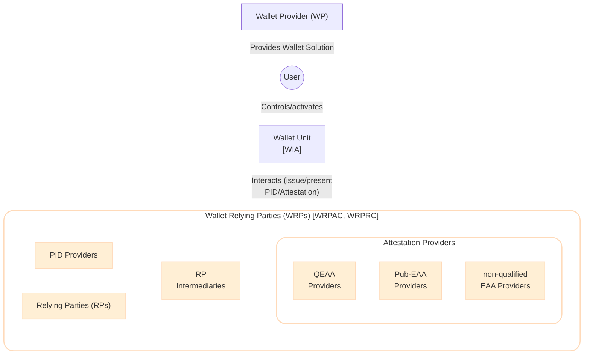
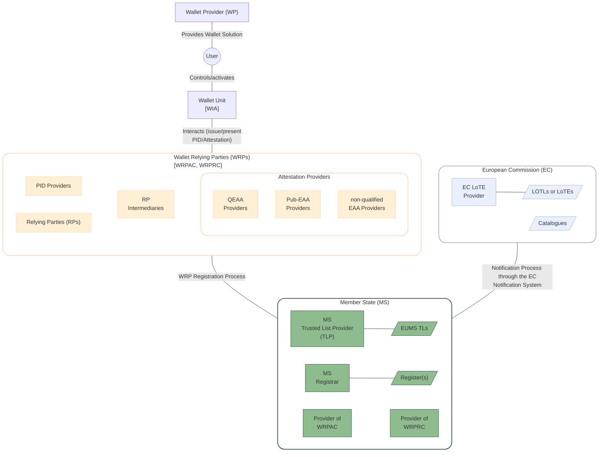

This section describes the trust-related processes (i.e., <roles:Wallet-Relying Party (WRP)|Wallet-Relying Party> registration, Provider notification and publication in <artifacts:Trusted List (TL)|Trusted List>, and trust evaluation) by detailing the entities involved, high level flows and their relationships.

The main entities involved in the <components:EUDI Wallet> ecosystem are:

- the <components:Wallet Unit>, installed and activated by the User and provided through a <components:Wallet Solution> by the <roles:Wallet Provider (WP)>;
- <roles:Wallet-Relying Party (WRP)|Wallet Relying Parties (WRPs)>
    - the <roles:PID Provider|PID Providers> and <roles:Attestation Provider (AP)|Attestation Providers> that interact with the <components:Wallet Unit> to issue <credentials:Attestation|Attestations>;
    - the <roles:Relying Party (RP)|Relying Parties (RPs)> and <roles:Relying Party Intermediary (RPI)|Relying Party Intermediaries> that interact with the <components:Wallet Unit> to request <credentials:Attestation|Attestations>.



To trust the interactions between these entities, the following trust evaluation processes are needed:

- *Authentication Process*: a way to authenticate the identity of an entity. To achieve this:
    - the <components:Wallet Unit> needs a <artifacts:Wallet Instance Attestation (WIA)>, an object that attests its integrity and is signed by the WP.
    - the <roles:Wallet-Relying Party (WRP)|WRP> needs a <artifacts:Wallet-Relying Party Access Certificate (WRPAC)> attesting its identity.
- *Authorization Process*: a way to check the authorization of an entity (i.e., *(i)* the <roles:Wallet-Relying Party (WRP)|WRP> entitlements, *(ii)* whether an <roles:Attestation Provider (AP)|Attestation Provider> is eligible to issue an <credentials:Attestation>, and *(iii)* whether a Relying Party has the right to access the data he is requesting). To achieve this:
    - the intended use of a <roles:Wallet-Relying Party (WRP)|WRP> is written in a signed <components:Register>, and optionally in a <artifacts:Wallet-Relying Party Registration Certificate (WRPRC)>.
    - the <roles:Attestation Provider (AP)|Attestation Provider> may write their own <artifacts:Embedded Disclosure Policy (EDP)|Embedded Disclosure Policies>.
- *Trust Anchor Validation Process*: a way to check the integrity and authenticity of <artifacts:Trusted List (TL)|Trusted Lists> which serve as the authentic source for <artifacts:Trust Anchor|Trust Anchors> used to verify signed objects such as <credentials:Person Identification Data (PID)|PIDs>, <credentials:Attestation|Attestations>, <artifacts:Wallet-Relying Party Access Certificate (WRPAC)|WRPACs> and <artifacts:Wallet-Relying Party Registration Certificate (WRPRC)|WRPRCs>, and <components:Register>. To achieve this:
    - the public key of the corresponding private key used to sign is published on the <artifacts:EU Member State Trusted List (EUMS TL)> or on the <artifacts:List of Trusted Entities (LoTE)> managed by the European Commission.

While these trust evaluation processes and its artifacts (i.e., <components:Register> and its common APIs, <artifacts:Wallet-Relying Party Access Certificate (WRPAC)|WRPAC>, <artifacts:Wallet-Relying Party Registration Certificate (WRPRC)|WRPRC>, <artifacts:List of Trusted Entities (LoTE)|LoTE>, <artifacts:EU Member State Trusted List (EUMS TL)|EUMS TL> and <artifacts:Embedded Disclosure Policy (EDP)|Embedded Disclosure Policies>) will be further detailed in the [Trust Evaluation Process](#6-trust-evaluation-process) and [Trust Artifacts](#5-trust-artifacts) sections respectively, the processes to obtain and manage these artifacts are brieftly detailed below:

- *WRP Registration Process*: to rely on <components:Wallet Unit|Wallet Units> for the purpose of providing a service, WRPs register at a <roles:Registrar> in the Member State where they are established. Based on the type of service registered, registration includes: the attributes that the <roles:Relying Party (RP)|RP> intends to request from <components:Wallet Unit|Wallet Units> or the <data-elements:Attestation type|Attestation type(s)> the <roles:Attestation Provider (AP)|Attestation Provider> wants to issue to <components:Wallet Unit|Wallet Units>. The following steps are in common to all WRPs:
  1. *Identity and Catalogue Verification:*  <roles:Registrar> verifies the identity of WRP according to requirements in [ETSI TS 119 461]. The specific identity proofing level may vary based on entity type and applicable regulatory framework (e.g. QTSP requirements or MS national legislation) and it is out of scope of the piloting. In this process, <roles:Registrar> may use the <artifacts:Catalogue of Attributes> and <artifacts:Catalogue of Schemes for the Attestation of Attributes> managed by the Commission for evaluating the registration request.
  2. *Registration Record Creation*: <roles:Registrar> creates registration record in national <components:Register> and made available online both in human-readable and machine-readable format. Record contains at least:
     - WRP identification information.
     - WRP type (<roles:Relying Party (RP)|RP>, <roles:PID Provider>, <roles:QEAA Provider>, <roles:PuB-EAA Provider>, EAA Provider).
     - Entity-specific capabilities
  3. *<artifacts:Wallet-Relying Party Access Certificate (WRPAC)|WRPAC> Issuance*: WRP obtains a <artifacts:Wallet-Relying Party Access Certificate (WRPAC)|WRPAC> provided by a <roles:Provider of Wallet Relying Party Access Certificate (Provider of WRPAC)|Provider of WRPAC>.
  4. [optionally] *<artifacts:Wallet-Relying Party Registration Certificate (WRPRC)|WRPRC> Issuance*: If the Member State mandates <artifacts:Wallet-Relying Party Registration Certificate (WRPRC)|WRPRC> issuance according to [CIR 2025/848, Article 8], the <roles:Provider of Wallet Relying Party Registration Certificate (Provider of WRPRC)|Provider of WRPRCs> must issue a signed <artifacts:Wallet-Relying Party Registration Certificate (WRPRC)|WRPRC> containing registered capabilities. If it is not mandated, <components:Wallet Instance> may retrieve information from <components:Register>.

    ```mermaid
    graph TD

    WRP["Wallet Relying Parties <br/> (WRPs)"]

    subgraph MS["Member State (MS)"]
        MSReg[MS <br/>Registrar]
        ProvAC[Provider of <br/>WRPAC]
        ProvRC[Provider of <br/>WRPRC]
        Reg[/"Register(s)"/]
        MSReg---|"Publishes data"| Reg
    end

    subgraph EC["European Commission (EC)"]
        Cat[/Catalogues/]
    end

    %% Style
    style WRP fill:#ffefd5, stroke:#ffdab9,stroke-width:2px,rx:20,ry:20
    style MS fill:#ffff,stroke:#2f4f4f,stroke-width:2px,rx:20,ry:20
    style EC fill:#ffff,stroke:#abb2bf,stroke-width:2px,rx:20,ry:20
    classDef blue fill:#e8f0fe,stroke:#abb2bf
    classDef green fill:#8fbc8f,stroke:#2f4f4f

    class QEAAP,PIDP,PubP,EAAP,RP,RPI WRP_entities;
    class ECLoTE,ECNS,Cat,LoTEs blue;
    class MSReg,ProvAC,ProvRC,TLs,Reg green;

    %% Arrows
    WRP ---|"Request registration"| MSReg
    ProvAC ---|"Issues WRPAC"| WRP
    ProvRC-. "Issues WRPRC" .-> WRP
    MSReg ---|"Checks Catalogues"| Cat
    ```

- *Notification Process*: MS sends data related to the registered entity to the EC. As result:
    - For <roles:Wallet Provider (WP)|WPs>, <roles:PID Provider|PID Providers>, Providers of <artifacts:Wallet-Relying Party Access Certificate (WRPAC)|WRPAC>, <roles:Provider of Wallet Relying Party Registration Certificate (Provider of WRPRC)|Providers of WRPRC>, MS <roles:Registrar|Registrars>, and <roles:PuB-EAA Provider|Pub-EAA Providers>, the notified entities are included in a <artifacts:List of Trusted Entities (LoTE)> by a EC <artifacts:List of Trusted Entities (LoTE)|LoTE> Provider.
    - For <roles:QEAA Provider|QEAA Providers> and QTSP, the URL of the <artifacts:EU Member State Trusted List (EUMS TL)|EUMS TLs> is added in the EU <artifacts:List Of Trusted Lists (LOTL)>.


    ```mermaid
    graph LR

    subgraph MS["Member State (MS)"]
        MSTLP["MS  <br/>Trusted List Provider  <br/>(TLP)"]
        TLs[/TLs/]
        MSTLP ---|"publish"| TLs
    end

    subgraph EC["European Commission (EC)"]
        ECLoTE[EC LoTE <br/>Provider]
        LoTE1[/WP <br/>LoTE/]
        LoTE2[/PID Providers <br/>LoTE/]
        LoTE3[/Providers of <br/>WRPAC LoTE/]
        LoTE4[/Providers of <br/>WRPRC LoTE/]
        LoTE5[/MS Registrar <br/>LoTE/]
        LoTE6[/Pub-EAA Providers <br/>LoTE/]
        LOTL[/LOTL/]
        ECLoTE ---|"publish"| LoTE1
        ECLoTE ---|"publish"| LoTE2
        ECLoTE ---|"publish"| LoTE3
        ECLoTE ---|"publish"| LoTE4
        ECLoTE ---|"publish"| LoTE5
        ECLoTE ---|"publish"| LoTE6
        ECLoTE ---|"publish"| LOTL
    end

    LoTE1 ~~~ LoTE2
    LoTE3 ~~~ LoTE4
    LoTE5 ~~~ LoTE6

    %% Style
    style EC fill:#ffff,stroke:#abb2bf,stroke-width:2px,rx:20,ry:20
    style MS fill:#ffff,stroke:#2f4f4f,stroke-width:2px,rx:20,ry:20
    classDef blue fill:#e8f0fe,stroke:#abb2bf
    classDef green fill:#8fbc8f,stroke:#2f4f4f

    class ECLoTE,ECNS,LoTE1,LoTE2,LoTE3,LoTE4,LoTE5,LoTE6,LOTL blue;
    class MSTLP,TLs green;

    %% Arrows
    EC ---|"Notification Process <br/>(Trust Anchor or <br/>URL of the EUMS TL)"| MS
    ```

The following figure add these two processes to the previous architecture.


