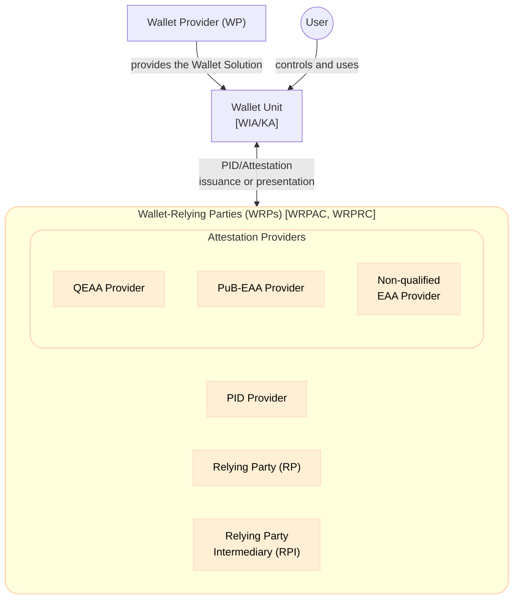
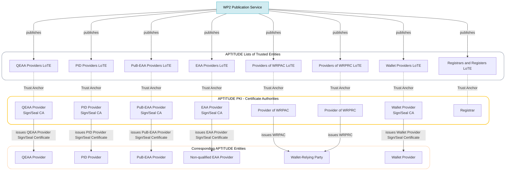
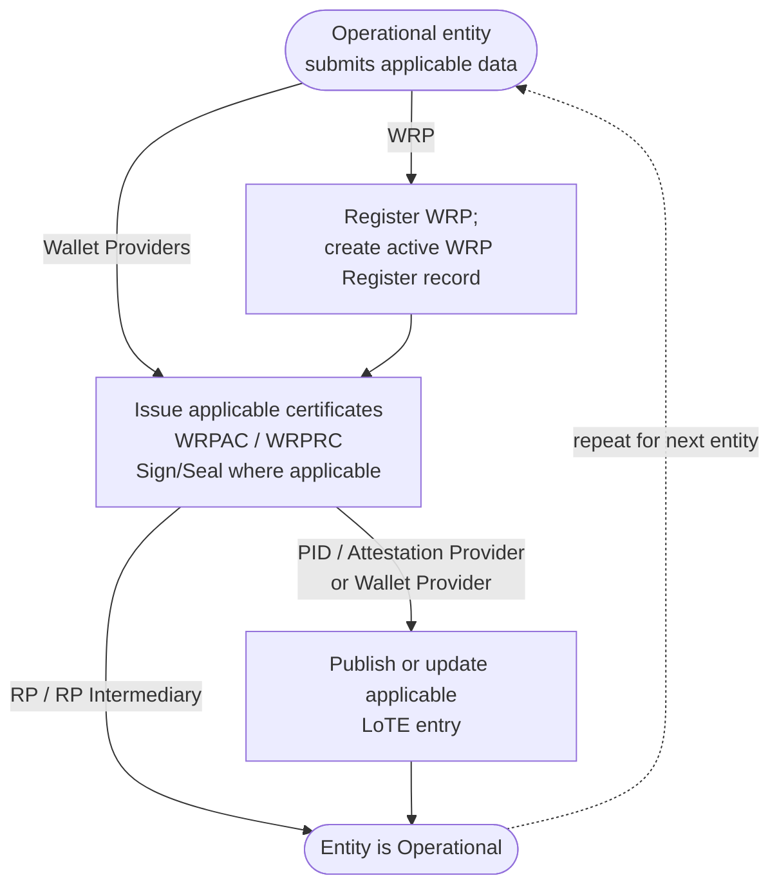

This section defines the APTITUDE Trust Architecture, including all components that enable the functional trust evaluation mechanisms used within the APTITUDE ecosystem. It first identifies the entities involved in the Large Scale Pilot, then describes the infrastructure through which APTITUDE WP2 establishes their trust, and finally introduces the Onboarding System that renders those entities operational and recognizable within the ecosystem.

### Entities

The APTITUDE Large Scale Pilot implement business use cases that exercise interactions within the <components:EUDI Wallet> ecosystem. As a result, the roles defined by that ecosystem remain applicable, while the supporting trust infrastructure is realized specifically within the APTITUDE boundaries. The main entities involved in APTITUDE are:

- The <roles:User>, who controls and uses a <components:Wallet Unit>, that is a configuration of a <components:Wallet Solution> provided by a <roles:Wallet Provider (WP)>.
- <roles:Wallet-Relying Party (WRP)|Wallet-Relying Parties (WRPs)>, which interact with the <components:Wallet Unit> in one or both of the following capacities:
    - <roles:Provider of Person Identification Data (PID Provider)|Providers of Person Identification Data (PID Providers)> and <roles:Attestation Provider (AP)|Attestation Providers (APs)> issue <credentials:Person Identification Data (PID)|PID> or <credentials:Attestation|Attestations> to the <components:Wallet Unit>. <roles:Attestation Provider (AP)|Attestation Providers> comprise:
        - <roles:Provider of Public Electronic Attestation of Attributes (PuB-EAA Provider)|Providers of Public Electronic Attestation of Attributes (PuB-EAA Providers)>;
        - <roles:Provider of Qualified Electronic Attestation of Attributes (QEAA Provider)|Providers of Qualified Electronic Attestation of Attributes (QEAA Providers)>;
        - <roles:Provider of Electronic Attestation of Attributes (EAA Provider)|Providers of Electronic Attestation of Attributes (EAA Providers)>.
    - <roles:Relying Party (RP)|Relying Parties (RPs)> and <roles:Relying Party Intermediary (RPI)|Relying Party Intermediaries (RPIs)> request <credentials:Attestation|Attestations> from the <components:Wallet Unit>.

The <roles:User> and <components:Wallet Unit> participate in runtime Issuance and Presentation interactions but are not onboarded as organizational entities. The organizational entities made operational through the APTITUDE trust infrastructure are the <roles:Wallet Provider (WP)|WPs> and the various types of <roles:Wallet-Relying Party (WRP)|WRPs> introduced above.

### Trust Infrastructure

The APTITUDE Large Scale Pilot does not deploy the full-stack Member State and European Commission infrastructure assumed by the <components:EUDI Wallet> framework. For piloting purposes, APTITUDE WP2 operates the corresponding capabilities regarding registration, certificate issuance, and publication of <artifacts:List of Trusted Entities (LoTE)\|artifacts:Lists of Trusted Entities (LoTE)>. Together, these capabilities establish the <artifacts:Trust Anchor|Trust Anchors> and trust artifacts used by the [Trust Evaluation Processes](../sections/trust-evaluation-process.md).

The trust infrastructure employed for APTITUDE consists of:

- The APTITUDE <components:Public Key Infrastructure (PKI)|Public Key Infrastructure (PKI)>, which issues and manages the X.509 certificates required by the ecosystem.
- The Registration Service and <components:Register>, which record the identity, role, and authorization information of <roles:Wallet-Relying Party (WRP)|WRPs>.
- The Certificate Issuance Services, which issue and manage <artifacts:Wallet-Relying Party Access Certificate (WRPAC)|WRPACs> and <artifacts:Wallet-Relying Party Registration Certificate (WRPRC)|WRPRCs> during onboarding. The PKI also issues and manages the Entity Sign/Seal Certificates used by entities.
- The Publication Service, which signs and publishes the applicable <artifacts:List of Trusted Entities (LoTE)|LoTE>.
- The Onboarding UI, which coordinates these services for each entity requesting onboarding.

#### Public Key Infrastructure

The APTITUDE PKI establishes the certificate chains used to authenticate the entities involved and to validate the <artifacts:Electronic Signature|signatures> or <artifacts:Electronic Seal|seals> they create. APTITUDE WP2 SHALL establish the <roles:Certificate Authority (CA)|Certificate Authorities (CAs)> shown below. The <artifacts:Trust Anchor> Certificate of each <roles:Certificate Authority (CA)|CA> SHALL be published in the corresponding <artifacts:List of Trusted Entities (LoTE)|LoTE>.

The diagram is organised into four layers, from the WP2 Publication Service at the top to the APTITUDE entities at the bottom. A solid arrow shows a <roles:Certificate Authority (CA)|CA> issuing a certificate to the corresponding entity, while a dashed line connects each <roles:Certificate Authority (CA)|CA> to the <artifacts:List of Trusted Entities (LoTE)|LoTE> in which its <artifacts:Trust Anchor> is published.

The <roles:Certificate Authority (CA)|CA> certificates published as <artifacts:Trust Anchor|Trust Anchors> are distinct from the end-entity certificates issued by those <roles:Certificate Authority (CA)|CAs>. The profiles for both certificate types are defined in [Trust Artifacts](../sections/trust-artifacts.md).

#### Trust Service Overview

The trust infrastructure capabilities are exposed through the APTITUDE Onboarding System. In this specification, *Onboarding System* denotes the aggregate logical system, while *Service* denotes one of its constituent components (Registration, WRPAC Issuance, WRPRC Issuance, Sign/Seal Certificate Issuance or Publication).

The Onboarding System operates on a trust infrastructure whose entities are established and whose <artifacts:Trust Anchor|Trust Anchors> are published before operational entity onboarding starts. Within APTITUDE, this one-time prerequisite is established out of band with no pilot software and is not part of the recurring onboarding flow. The recurring process enables APTITUDE operational entities to obtain the trust artifacts required for interactions within the ecosystem. Its detailed inputs, outputs, and entity-specific paths are defined in [Onboarding Process](../sections/onboarding-process.md).

The **Onboarding UI** is the APTITUDE-specific orchestrator and single point of contact for an entity requesting onboarding. It collects the submitted data and SHALL trigger the applicable stages in order: registration, certificate issuance, and, where applicable, publication or update of the relevant <artifacts:List of Trusted Entities (LoTE)|LoTE> entry:

1. A <roles:Wallet-Relying Party (WRP)|WRP> submits its registration data to the Registration Service. Within APTITUDE, registration SHALL be restricted to APTITUDE Partners; the Registration Service SHALL otherwise rely on the submitted self-declaration and SHALL NOT perform the identity proofing defined in [ETSI TS 119 461] or [CIR 2025/848, Article 6]. After successful verification, the Registration Service creates an active record in the <components:Register|WRP Register>.
2. After the registration record is active, the <roles:Wallet-Relying Party (WRP)|WRP> requests the applicable <artifacts:Wallet-Relying Party Access Certificate (WRPAC)|WRPAC> and <artifacts:Wallet-Relying Party Registration Certificate (WRPRC)|WRPRC>. The certificate issuance stage also covers Sign/Seal Certificates where applicable.
3. A notified <roles:Wallet-Relying Party (WRP)|WRP> submits its notifiable data, after certificate issuance, to the Publication Service, which creates or updates the applicable <artifacts:List of Trusted Entities (LoTE)|LoTE> entry. A <roles:Wallet Provider (WP)|Wallet Provider> follows a <processes:Notification|notification>-only path with respect to registration and WRP certificates: it bypasses those stages, obtains its Sign/Seal Certificate, and then submits its notifiable data to the Publication Service.
4. A <roles:Relying Party (RP)|Relying Party> or <roles:Relying Party Intermediary (RPI)|Relying Party Intermediary> completes onboarding after certificate issuance and does not require a <artifacts:List of Trusted Entities (LoTE)|LoTE> entry; trust in it is anchored through the <artifacts:Wallet-Relying Party Access Certificate (WRPAC)|WRPAC>.

The figure below provides a logical overview rather than a deployment architecture. The notification data store is an internal detail of the Onboarding Process and is not represented here. The component responsibilities, prerequisites, inputs, outputs, and entity-specific paths are specified in [Onboarding Process](../topics/onboarding-process.md#onboarding-system).

!!! warning

    The implementation architecture of the Trust Services and components will be further defined in task T2.3.1 (*Design and implementation of the trust infrastructure*), but SHOULD adhere to these implementation profiles.
