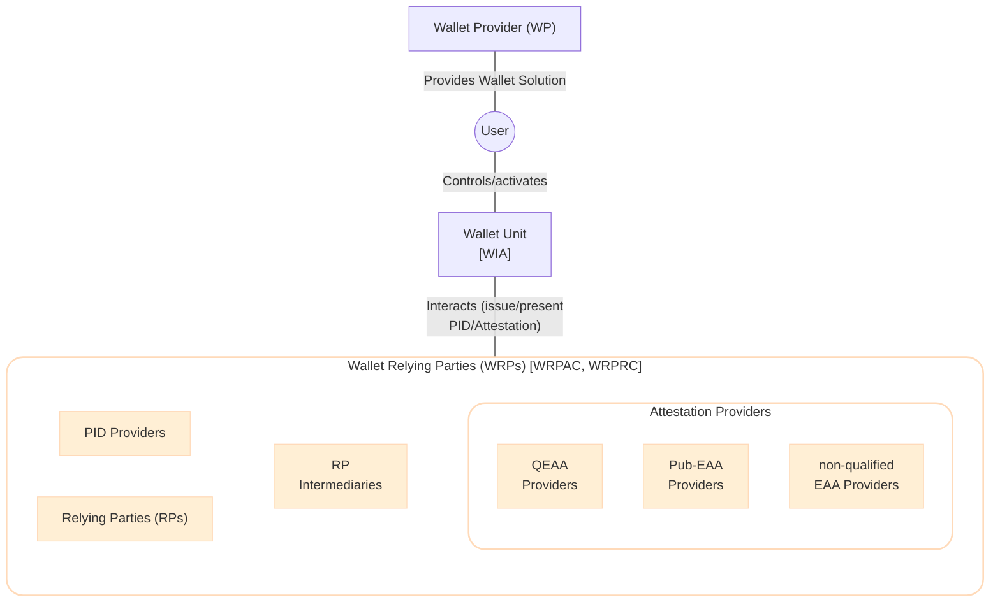
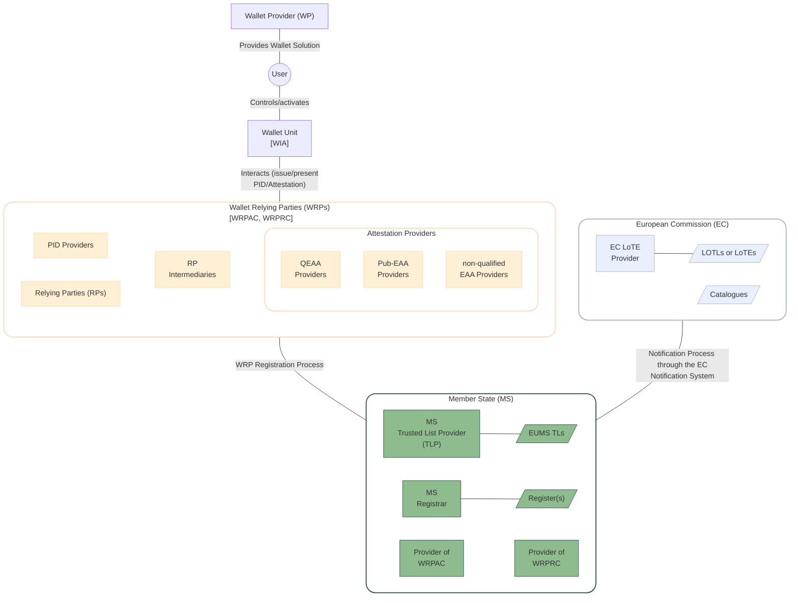

This section describes the trust-related processes by detailing the entities involved, high level flows and their relationships.

The main entities involved in the <components:EUDI Wallet> ecosystem are:

- The <components:Wallet Unit>, installed and activated by the <roles:User> and provided through a <components:Wallet Solution> by a <roles:Wallet Provider (WP)>.
- <roles:Wallet-Relying Party (WRP)|Wallet-Relying Parties (WRPs)>, which may be further classified as
    - The <roles:PID Provider|Person Identification Data (PID) Providers> and <roles:Attestation Provider (AP)|Attestation Providers (APs)> that interact with the <components:Wallet Unit> to issue <credentials:Attestation|Attestations>.
    - The <roles:Relying Party (RP)|Relying Parties (RPs)> and <roles:Relying Party Intermediary (RPI)|Relying Party Intermediaries (RPI)> that interact with the <components:Wallet Unit> to request <credentials:Attestation|Attestations>.



To trust the interactions between these entities, the following trust evaluation processes are needed:

- *Authentication Process*: a way to authenticate the identity of an entity. To achieve this:
    - The <components:Wallet Unit> needs a <artifacts:Wallet Instance Attestation (WIA)>, an object that attests its integrity and is signed by the <roles:Wallet Provider (WP)|WP>.
    - The <roles:Wallet-Relying Party (WRP)|WRP> needs a <artifacts:Wallet-Relying Party Access Certificate (WRPAC)> attesting its identity.
- *Authorization Process*: a way to check the authorization of an entity (i.e., *(i)* the <roles:Wallet-Relying Party (WRP)|WRP> entitlements, *(ii)* whether an <roles:Attestation Provider (AP)|AP> is eligible to issue an <credentials:Attestation>, and *(iii)* whether a <roles:Relying Party (RP)|RP> has the right to access the data it is requesting). To achieve this:
    - The intended use of a <roles:Wallet-Relying Party (WRP)|WRP> is written in a signed <components:Register>, and optionally in a <artifacts:Wallet-Relying Party Registration Certificate (WRPRC)>.
    - The <roles:Attestation Provider (AP)|AP> may write their own <artifacts:Embedded Disclosure Policy (EDP)|Embedded Disclosure Policies (EDPs)>.
- *Trust Anchor Validation Process*: a way to check the integrity and authenticity of <artifacts:Trusted List (TL)|Trusted Lists (TL)> which serve as the authentic source for <artifacts:Trust Anchor|Trust Anchors> used to verify signed objects such as <credentials:Person Identification Data (PID)|PIDs>, <credentials:Attestation|Attestations>, <artifacts:Wallet-Relying Party Access Certificate (WRPAC)|WRPACs> and <artifacts:Wallet-Relying Party Registration Certificate (WRPRC)|WRPRCs>, and <components:Register>. To achieve this:
    - The public key of the corresponding private key used to sign is published on the <artifacts:EU Member State Trusted List (EUMS TL)> or on the <artifacts:List of Trusted Entities (LoTE)> managed by the European Commission.

While these trust evaluation processes and their artifacts (i.e., the <components:Register> and its common APIs, <artifacts:Wallet-Relying Party Access Certificate (WRPAC)|WRPACs>, <artifacts:Wallet-Relying Party Registration Certificate (WRPRC)|WRPRCs>, <artifacts:List of Trusted Entities (LoTE)|LoTE>, <artifacts:EU Member State Trusted List (EUMS TL)|EUMS TLs> and <artifacts:Embedded Disclosure Policy (EDP)|EDPs>) will be further detailed in the [Trust Evaluation Process](#6-trust-evaluation-process) and [Trust Artifacts](#5-trust-artifacts) sections respectively, the processes to obtain and manage these artifacts are briefly detailed below:

- *WRP Registration Process*: To rely on <components:Wallet Unit|Wallet Units> for the purpose of providing a service, <roles:Wallet-Relying Party (WRP)|WRPs> register at a <roles:Registrar> in the Member State where they are established. Based on the type of service registered, registration includes: the attributes that the <roles:Relying Party (RP)|RP> intends to request from <components:Wallet Unit|Wallet Units> or the <data-elements:Attestation type|Attestation type(s)> the <roles:Attestation Provider (AP)|AP> wants to issue to <components:Wallet Unit|Wallet Units>. The following steps are in common to all <roles:Wallet-Relying Party (WRP)|WRPs>:
    1. *Identity and Catalogue Verification:* The <roles:Registrar> verifies the identity of the <roles:Wallet-Relying Party (WRP)|WRP> according to requirements in [ETSI TS 119 461]. The specific identity proofing level may vary based on entity type and applicable regulatory framework (e.g., <roles:Qualified Trust Service Provider (QTSP)|Qualified Trust Service Provider (QTSP)> requirements or Member State national legislation) and it is out of scope of the piloting. In this process, the <roles:Registrar> may use the <artifacts:Catalogue of Attributes> and <artifacts:Catalogue of Schemes for the Attestation of Attributes> managed by the European Commission for evaluating the registration request.
    2. *Registration Record Creation*: The <roles:Registrar> creates registration records in the national <components:Register>, made available online both in human- and machine-readable formats. Records contains at least:
        - <roles:Wallet-Relying Party (WRP)|WRP> identification information.
        - <roles:Wallet-Relying Party (WRP)|WRP> type (<roles:Relying Party (RP)|RP>, <roles:PID Provider>, <roles:QEAA Provider>, <roles:PuB-EAA Provider>, <roles:EAA Provider>).
        - Entity-specific capabilities
    3. *WRPAC Issuance*: the <roles:Wallet-Relying Party (WRP)|WRP> obtains a <artifacts:Wallet-Relying Party Access Certificate (WRPAC)|WRPAC> provided by a <roles:Provider of Wallet Relying Party Access Certificate (Provider of WRPAC)|Provider of WRPAC>.
    4. [optionally] *WRPRC Issuance*: If the Member State mandates <artifacts:Wallet-Relying Party Registration Certificate (WRPRC)|WRPRC> issuance according to [CIR 2025/848, Article 8], the <roles:Provider of Wallet Relying Party Registration Certificate (Provider of WRPRC)|Provider of WRPRC> must issue a signed <artifacts:Wallet-Relying Party Registration Certificate (WRPRC)|WRPRC> containing registered capabilities. If it is not mandated, the <components:Wallet Instance> may retrieve information from <components:Register>.

    ```mermaid
    graph TD

    WRP["Wallet Relying Parties <br/> (WRPs)"]

    subgraph MS["Member State (MS)"]
        MSReg[MS <br/>Registrar]
        ProvAC[Provider of <br/>WRPAC]
        ProvRC[Provider of <br/>WRPRC]
        Reg[/"Register(s)"/]
        MSReg---|"Publishes data"| Reg
    end

    subgraph EC["European Commission (EC)"]
        Cat[/Catalogues/]
    end

    %% Style
    style WRP fill:#ffefd5, stroke:#ffdab9,stroke-width:2px,rx:20,ry:20
    style MS fill:#ffff,stroke:#2f4f4f,stroke-width:2px,rx:20,ry:20
    style EC fill:#ffff,stroke:#abb2bf,stroke-width:2px,rx:20,ry:20
    classDef blue fill:#e8f0fe,stroke:#abb2bf
    classDef green fill:#8fbc8f,stroke:#2f4f4f

    class QEAAP,PIDP,PubP,EAAP,RP,RPI WRP_entities;
    class ECLoTE,ECNS,Cat,LoTEs blue;
    class MSReg,ProvAC,ProvRC,TLs,Reg green;

    %% Arrows
    WRP ---|"Request registration"| MSReg
    ProvAC ---|"Issues WRPAC"| WRP
    ProvRC-. "Issues WRPRC" .-> WRP
    MSReg ---|"Checks Catalogues"| Cat
    ```

- *Notification Process*: the Member State sends data related to the registered entity to the European Commission. As result:
    - For <roles:Wallet Provider (WP)|WPs>, <roles:PID Provider|PID Providers>, <roles:Provider of Wallet Relying Party Access Certificate (Provider of WRPAC)|Providers of WRPAC>, <roles:Provider of Wallet Relying Party Registration Certificate (Provider of WRPRC)|Providers of WRPRC>, Member State <roles:Registrar|Registrars>, and <roles:PuB-EAA Provider|Pub-EAA Providers>: the notified entities are included in a <artifacts:List of Trusted Entities (LoTE)|LoTE> by a European Commission <artifacts:List of Trusted Entities (LoTE)|LoTE> Provider.
    - For <roles:QEAA Provider|QEAA Providers> and <roles:Qualified Trust Service Provider (QTSP)|QTSP>, the URL of the <artifacts:EU Member State Trusted List (EUMS TL)> is added in the EU <artifacts:List Of Trusted Lists (LOTL)>.

    ```mermaid
    graph LR

    subgraph MS["Member State (MS)"]
        MSTLP["MS  <br/>Trusted List Provider  <br/>(TLP)"]
        TLs[/TLs/]
        MSTLP ---|"publish"| TLs
    end

    subgraph EC["European Commission (EC)"]
        ECLoTE[EC LoTE <br/>Provider]
        LoTE1[/WP <br/>LoTE/]
        LoTE2[/PID Providers <br/>LoTE/]
        LoTE3[/Providers of <br/>WRPAC LoTE/]
        LoTE4[/Providers of <br/>WRPRC LoTE/]
        LoTE5[/MS Registrar <br/>LoTE/]
        LoTE6[/Pub-EAA Providers <br/>LoTE/]
        LOTL[/LOTL/]
        ECLoTE ---|"publish"| LoTE1
        ECLoTE ---|"publish"| LoTE2
        ECLoTE ---|"publish"| LoTE3
        ECLoTE ---|"publish"| LoTE4
        ECLoTE ---|"publish"| LoTE5
        ECLoTE ---|"publish"| LoTE6
        ECLoTE ---|"publish"| LOTL
    end

    LoTE1 ~~~ LoTE2
    LoTE3 ~~~ LoTE4
    LoTE5 ~~~ LoTE6

    %% Style
    style EC fill:#ffff,stroke:#abb2bf,stroke-width:2px,rx:20,ry:20
    style MS fill:#ffff,stroke:#2f4f4f,stroke-width:2px,rx:20,ry:20
    classDef blue fill:#e8f0fe,stroke:#abb2bf
    classDef green fill:#8fbc8f,stroke:#2f4f4f

    class ECLoTE,ECNS,LoTE1,LoTE2,LoTE3,LoTE4,LoTE5,LoTE6,LOTL blue;
    class MSTLP,TLs green;

    %% Arrows
    EC ---|"Notification Process <br/>(Trust Anchor or <br/>URL of the EUMS TL)"| MS
    ```

The following figure add these two processes to the previous architecture.


