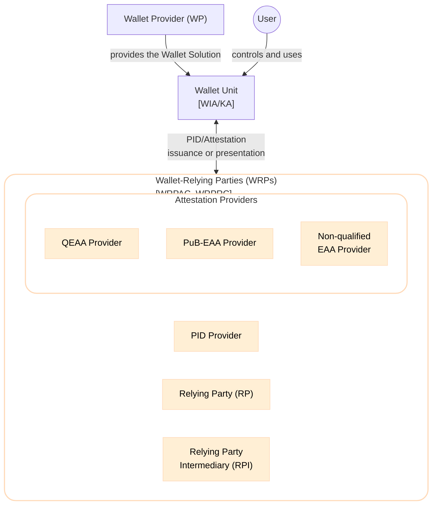
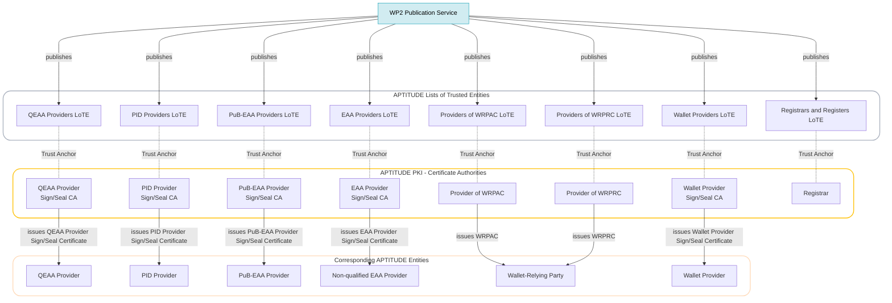
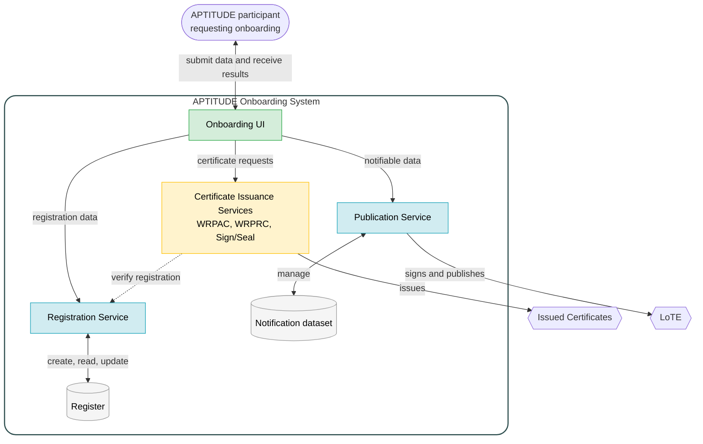

This section defines the APTITUDE Trust Architecture, including all components that enable the functional trust evaluation mechanisms used within the APTITUDE ecosystem. It first identifies the entities involved in the Large Scale Pilot, then describes the infrastructure through which APTITUDE WP2 establishes their trust, and finally introduces the Onboarding System that renders those entities operational and recognizable within the ecosystem.

### Entities

The APTITUDE Large Scale Pilot implement business use cases that exercise interactions within the EUDI Wallet ecosystem. As a result, the roles defined by that ecosystem remain applicable, while the trust infrastructure supporting them is realized specifically within the APTITUDE boundaries. The main entities involved in APTITUDE are:

- The <roles:User>, who controls and uses a <components:Wallet Unit>, a configuration of a <components:Wallet Solution> provided by a <roles:Wallet Provider (WP)>.
- <roles:Wallet-Relying Party (WRP)|Wallet-Relying Parties (WRPs)>, which interact with the Wallet Unit in one or both of the following capacities:
    - <roles:Provider of Person Identification Data (PID Provider)|Providers of Person Identification Data (PID Providers)> and <roles:Attestation Provider (AP)|Attestation Providers (AP)> issue <credentials:Person Identification Data (PID)|PID> or <credentials:Attestation|Attestations> to the Wallet Unit. Attestation Providers comprise <roles:QEAA Provider|QEAA Providers>, <roles:PuB-EAA Provider|PuB-EAA Providers>, and non-qualified <roles:EAA Provider|EAA Providers>.
    - <roles:Relying Party (RP)|Relying Parties (RPs)> and <roles:Relying Party Intermediary (RPI)|Relying Party Intermediaries (RPIs)> request <credentials:Attestation|Attestations> from the Wallet Unit.

The <roles:User> and <components:Wallet Unit> participate in runtime issuance and presentation interactions but are not onboarded as organizational entities. The organizational entities made operational through the APTITUDE trust infrastructure are the <roles:Wallet Provider (WP)|WPs> and the various types of <roles:Wallet-Relying Party (WRP)|WRPs> introduced above.

### Trust Infrastructure

The APTITUDE Large Scale Pilot does not deploy the full-stack Member State and European Commission infrastructure assumed by the EUDI Wallet framework. For piloting purposes, APTITUDE WP2 operates the corresponding registration, certificate issuance, and LoTE publication capabilities. Together, these capabilities establish the Trust Anchors and trust artifacts used by the [Trust Evaluation Processes](../sections/trust-evaluation-process.md).

The Trust Infrastructure employed for APTITUDE consists of:

- The APTITUDE <components:Public Key Infrastructure (PKI)|Public Key Infrastructure (PKI)>, which issues and manages the X.509 certificates required by the pilot.
- The Registration Service and <components:Register>, which record the identity, role, and authorization information of WRPs.
- The Certificate Issuance Services, which issue and manage <artifacts:Wallet-Relying Party Access Certificate (WRPAC)|WRPACs>, <artifacts:Wallet-Relying Party Registration Certificate (WRPRC)|WRPRCs>, and Entity Sign/Seal Certificates.
- The Publication Service, which signs and publishes the applicable <artifacts:List of Trusted Entities (LoTE)|LoTE>.
- The Onboarding UI, which coordinates these services for each entity requesting onboarding.

#### Public Key Infrastructure

The APTITUDE Public Key Infrastructure establishes the certificate chains used to authenticate pilot entities and to validate the signatures or seals they create. APTITUDE WP2 SHALL establish the <roles:Certificate Authority (CA)|Certificate Authorities (CAs)> shown below. The <artifacts:Trust Anchor|Trust Anchor> Certificate of each CA SHALL be published in the corresponding LoTE.

The diagram is organised into four layers, from the WP2 Publication Service at the top to the APTITUDE entities at the bottom. A solid arrow shows a CA issuing a certificate to the corresponding entity, while a dashed line connects each CA to the LoTE in which its Trust Anchor is published.

The CA certificates published as Trust Anchors are distinct from the end-entity certificates issued by those CAs. The profiles for both certificate types are defined in [Trust Artifacts](../sections/trust-artifacts.md).

#### Trust Service Overview

The trust infrastructure capabilities are exposed through the APTITUDE **Onboarding System**. In this specification, Onboarding System denotes the aggregate logical system, while service denotes one of its constituent components (Registration, Certificate Issuance, or Publication).

The Onboarding System enables APTITUDE Partners to obtain the trust artifacts required for interactions within the ecosystem. The path varies by entity type, as detailed in [Onboarding Paths by Entity Type](../sections/onboarding-process.md#onboarding-paths-by-entity-type), but comprises the following activities where applicable:

1. The entity submits its identity and authorization information to the Registration Service. Within APTITUDE, the Registration Service SHALL verify that the requester is an APTITUDE participant, and SHALL otherwise rely on the submitted self-declaration; it SHALL NOT perform the identity proofing defined in [ETSI TS 119 461] or [CIR 2025/848, Article 6].
2. The entity submits the technical configuration and cryptographic material required for its role. The applicable Certificate Issuance Services issue the corresponding WRPAC, WRPRC, or Entity Sign/Seal Certificate.
3. For an entity whose Trust Anchor must be published, the Publication Service uses its notifiable information to create or update the applicable LoTE entry.

The figure below provides a logical overview rather than a deployment architecture. The component responsibilities, prerequisites, inputs, outputs, and entity-specific paths are specified in [Onboarding Process](../sections/onboarding-process.md).

!!! warning

    The implementation architecture of the Trust Services and components will be further defined in T2.3.1, but SHOULD adhere to these implementation profiles.
