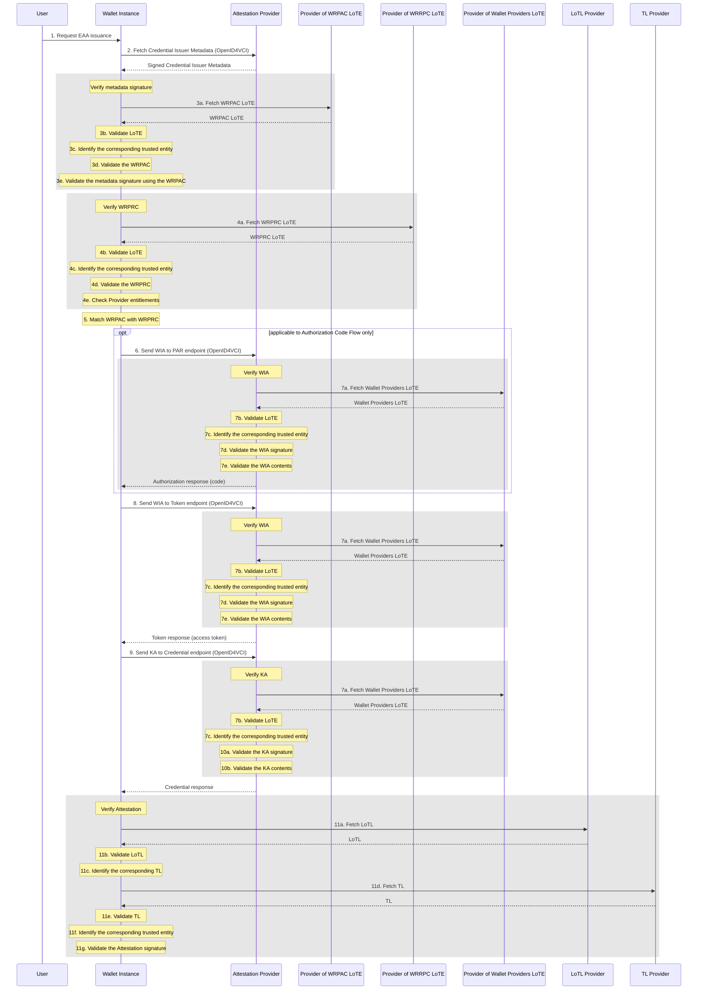

> **NOTE 1:**  Attestation Providers can have a dedicated Authorization server that makes authorization-related endpoints available. That kind of implementation details are hidden in this schema, since the Attestation Provider bears the overall responsibility for responding to the Wallet Instance's requests.

> **NOTE 2:**  A nonce endpoint might be necessary as well however that feature does not have an impact on the trust-related checks.

### Step-by-step Operations

**Step 1: Request EAA Issuance** Various flows are possible for this step and this can depend on the wallet implementation. The Wallet Instance can be populated with a pre-defined set of credentials offered by different Attestation Providers or can fetch other offers via different means.

**Step 2: Fetch Credential Issuer Metadata (OpenID4VCI)** The Wallet Instance retrieves information about the Attestation Provider's technical capabilities, supported attestations, and display information from the Attestation Provider endpoint. This information includes the Provider's WRPRC. In this context it is expected that the metadata is a signed JSON Web Signature (JWS). The JWS also contains the WRPAC in its Protected Header.

**Step 3a: Fetch WRPAC LoTE** The Wallet Instance retrieves the LoTE listing all the WRPAC issuers from a publicly-known URL.

**Step 3b: Validate LoTE** The Wallet Instance validates the LoTE signature is order to make sure the LoTE is authentic. Extra checks are performed in order to make sure the LoTE is not outdated.

**Step 3c: Identify the corresponding trusted entity** The Wallet Instance identifies the LoTE trusted entity corresponding to the WRPAC presented in the metadata JWS.

**Step 3d: Validate the WRPAC** The Wallet Instance validates the authenticity and integrity of the WRPAC using the trust anchor of the trusted entity identitied in the LoTE.

**Step 3e: Validate the metadata signature using the WRPAC** The Wallet Instance validates the metadata JWS signature using the WRPAC.

**Step 4a: Fetch WRPRC LoTE** The Wallet Instance retrieves the LoTE listing all the WRPRC issuers from a publicly-known URL.

**Step 4b: Validate LoTE** The Wallet Instance validates the LoTE signature is order to make sure the LoTE is authentic. Extra checks are performed in order to make sure the LoTE is not outdated.

**Step 4c: Identify the corresponding trusted entity** The Wallet Instance identifies the LoTE trusted entity corresponding to the WRPRC presented in the Attestation Provider metadata.

**Step 4d: Validate the WRPRC** The Wallet Instance validates the authenticity and integrity of the WRPRC using the trust anchor of the trusted entity identitied in the LoTE.

**Step 4e: Check Provider entitlements** The Wallet Instance verifies that the entitlement of issuing attestations is present in the WRPRC.

**Step 5: Match WRPAC with WRPRC** The Wallet Instance verifies that both the certificates are related to the same entity.

**Step 6: Send WIA to PAR endpoint (OpenID4VCI)** The Wallet Instance sends the WIA signed by the Wallet Provider, attesting that the Wallet Instance is a valid one.

**Step 7a: Fetch Wallet Providers LoTE** The Attestation Providers retrieves the LoTE listing all the Wallet Providers from a publicly-known URL. This list is necessary to validate different signed artifacts received from the Wallet Instance in the different requests. Attestation Providers can implement a caching mechanism of the LoTE so that they would not need to retrieve it multiple times in the course of the EAA issuance process. It is up to Attestation Providers to implement this mechanism or not and to decide for how long they would want to cache the list. This implies that in some cases, this step could be skipped.

**Step 7b: Validate LoTE** The Attestation Provider validates the LoTE signature in order to make sure the LoTE is authentic. Extra checks are performed in order to make sure the LoTE is not outdated.

**Step 7c: Identify the corresponding trusted entity** The Attestation Provider identifies the LoTE trusted entity corresponding to the WIA presented in the request.

**Step 7d: Validate the WIA signature** The Attestation Provider checks the WIA integrity and authenticity by validating the JWT signature using the trust anchor of the trusted entity identitied in the LoTE.

**Step 7e: Validate the WIA contents** The Attestation Provider checks that the Wallet Instance is valid by verifying the status list referenced in the WIA. Extra cheks are performed like WIA validity checks and associated Proof-of-Possession checks.

**Step 8: Send WIA to Token endpoint (OpenID4VCI)** The Wallet Instance sends the WIA signed by the Wallet Provider, attesting that the Wallet Instance is a valid one.

**Step 9: Send KA to Credential endpoint (OpenID4VCI)** The Wallet Instance sends the KA signed by the Wallet Provider, attesting information about the security of cryptographic keys stored in the Wallet Unit.

**Step 10a: Validate the KA signature** The Attestation Provider checks the KA integrity and authenticity by validating the signature using the trust anchor of the trusted entity identitied in the LoTE.

**Step 10b: Validate the KA contents** The Attestation Provider checks that the cryptographic keys are protected according to its policy if any, and verifies the related Proof-of-Possessions if any.

**Step 11a: Fetch LoTL** The Wallet Instance retrieves the LoTL listing all the national Trusted Lists (TL).

**Step 11b: Validate LoTL** The Wallet Instance validates the LoTL signature in order to make sure the LoTL is authentic. Extra checks are performed in order to make sure the LoTL is not outdated.

**Step 11c: Identify the corresponding TL** The Wallet Instance identifies the corresponding national TL needed to validate the Attestation received in the Credential Response.

**Step 11d: Fetch TL** The Wallet Instance retrieves the national TL listing all the trust services registered in that Member State.

**Step 11e: Validate TL** The Wallet Instance validates the TL signature in order to make sure the TL is authentic. Extra checks are performed in order to make sure the TL is not outdated.

**Step 11f: Identify the corresponding trusted entity** The Wallet Instance identifies the TL trusted entity corresponding to the signature of the Attestation issued.

**Step 11g: Validate the Attestation signature** The Wallet Instance checks the integrity and authenticity of the Attestation by validating the signature using the trust anchor of the trusted entity identitied in the TL. If multiple Attestations were received, they are all validated.

> If any of the checks described in the previous steps fail, the process can be aborted either by the Wallet Instance, the user, or the Attestation Provider.
