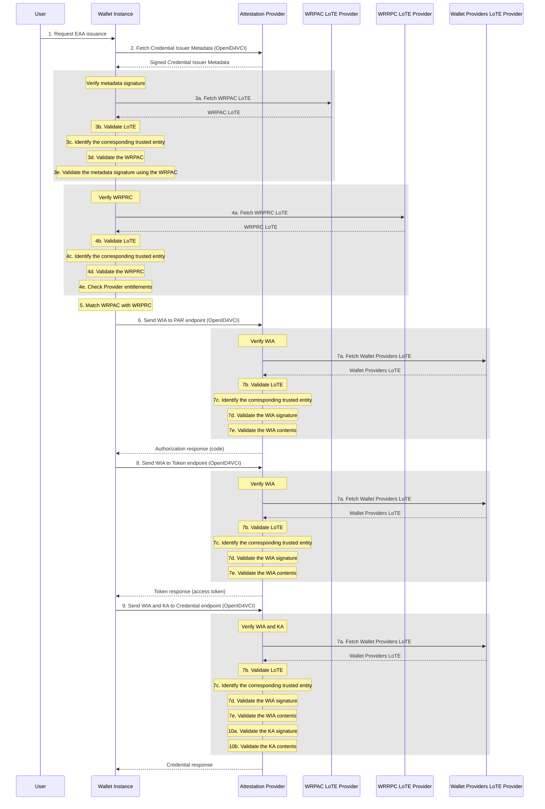

Note 1: EAA Providers can have a dedicated Authorization server that makes authorization-related endpoints available. That kind of implementation details are hidden in this schema, since the EAA Provider bears the overall responsibility for responding to the Wallet Instance's requests.

Note 2: A nonce endpoint might be necessary as well however that feature does not have an impact on the trust-related checks.
