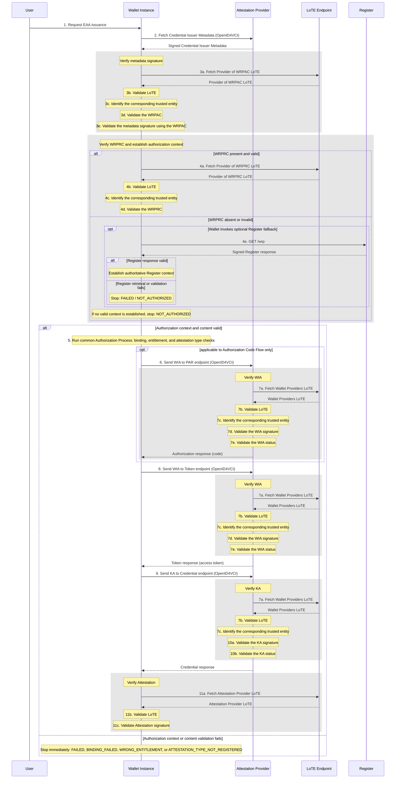

This section details the trust checks that SHALL be performed during the Issuance process.

!!! note

    <roles:Attestation Provider (AP)|Attestation Providers> can have a dedicated <components:Authorization Server> that makes authorization-related endpoints available. That kind of implementation details are hidden in this schema, since the <roles:Attestation Provider (AP)|Attestation Provider> bears the overall responsibility for responding to the <components:Wallet Instance>'s requests.

!!! note

    A <data-elements:Nonce|nonce> endpoint might be necessary as well however that feature does not have an impact on the trust-related checks.

#### Step-by-step Operations

**Step 1: Request EAA Issuance.** Various flows are possible for this step and this can depend on the wallet implementation. The <components:Wallet Instance> can be populated with a pre-defined set of credentials offered by different <roles:Attestation Provider (AP)|Attestation Providers> or can fetch other offers via different means.

**Step 2: Fetch <artifacts:Credential Issuer Metadata> (<protocols:OpenID for Verifiable Credentials Issuance (OID4VCI)|OID4VCI>).** The <components:Wallet Instance> retrieves information about the <roles:Attestation Provider (AP)|Attestation Provider>'s technical capabilities, supported attestations, and display information from the <roles:Attestation Provider (AP)|Attestation Provider> endpoint. In this context it is expected that the metadata is a signed JSON Web Signature (JWS). The JWS also contains the <artifacts:Wallet-Relying Party Access Certificate (WRPAC)|WRPAC> in its Protected Header [`AUTHZ-ISS-04`].

**Step 3a: Fetch <roles:Provider of Wallet-Relying Party Access Certificate (Provider of WRPAC)|Provider of WRPAC> <artifacts:List of Trusted Entities (LoTE)|LoTE>.** The <components:Wallet Instance> retrieves the <artifacts:List of Trusted Entities (LoTE)|LoTE> listing all the <artifacts:Wallet-Relying Party Access Certificate (WRPAC)|WRPAC> issuers from a publicly-known URL.

**Step 3b: Validate LoTE.** The <components:Wallet Instance> validates the <artifacts:List of Trusted Entities (LoTE)|LoTE> signature is order to make sure the <artifacts:List of Trusted Entities (LoTE)|LoTE> is authentic. Extra checks are performed in order to make sure the <artifacts:List of Trusted Entities (LoTE)|LoTE> is not outdated.

**Step 3c: Identify the corresponding <roles:Trusted Entity>.** The <components:Wallet Instance> identifies the <artifacts:List of Trusted Entities (LoTE)|LoTE> <roles:Trusted Entity> corresponding to the <artifacts:Wallet-Relying Party Access Certificate (WRPAC)|WRPAC> presented in the metadata JWS.

**Step 3d: Validate the <artifacts:Wallet-Relying Party Access Certificate (WRPAC)|WRPAC>.** The <components:Wallet Instance> validates the authenticity and integrity of the <artifacts:Wallet-Relying Party Access Certificate (WRPAC)|WRPAC> using the trust anchor of the <roles:Trusted Entity> identitied in the <artifacts:List of Trusted Entities (LoTE)|LoTE>.

**Step 3e: Validate the metadata signature using the <artifacts:Wallet-Relying Party Access Certificate (WRPAC)|WRPAC>.** The <components:Wallet Instance> validates the metadata JWS signature using the <artifacts:Wallet-Relying Party Access Certificate (WRPAC)|WRPAC> [`AUTHZ-ISS-05`]. The <components:Wallet Instance> SHALL also validate the metadata contents and supported-credential declarations [`AUTHZ-ISS-06`].

**Step 4: Establish the authorization context.** The <components:Wallet Instance> extracts the issuer authorization data needed by the common Authorization Process [`AUTHZ-ISS-07`]. It validates the <artifacts:Wallet-Relying Party Registration Certificate (WRPRC)|WRPRC> using the relevant <artifacts:Trust Anchor> and the checks in [Authorization Process](../sections/trust-evaluation-process.md#wrprc-validation). If the <artifacts:Wallet-Relying Party Registration Certificate (WRPRC)|WRPRC> is absent or invalid, the <components:Wallet Instance> MAY invoke the optional <components:Register> fallback by retrieving and validating the required `GET /wrp` response [`AUTHZ-ISS-08`, `AUTHZ-ISS-09`]. If the <components:Wallet Instance> invokes that fallback and retrieval or validation fails, the result is `FAILED` and issuance SHALL NOT continue. If no valid context is established, issuance is `NOT_AUTHORIZED`.

**Step 5: Run the common Authorization Process.** After context validation, the <components:Wallet Instance> invokes binding and, where applicable, intermediary-association validation; verifies the credential-type entitlement; and verifies the requested attestation type against the registered `provides_attestations` data and <artifacts:Credential Issuer Metadata> [`AUTHZ-ISS-01`, `AUTHZ-ISS-02`, `AUTHZ-ISS-03`]. Any context, binding, intermediary-association, entitlement, or attestation-type failure is non-overridable. Presentation-only scope and <artifacts:Embedded Disclosure Policy (EDP)|EDP> checks do not apply to issuance.

**Step 6: Send <artifacts:Wallet Instance Attestation (WIA)|WIA> to PAR endpoint (<protocols:OpenID for Verifiable Credentials Issuance (OID4VCI)|OID4VCI>).** The <components:Wallet Instance> sends the <artifacts:Wallet Instance Attestation (WIA)|WIA> signed by the <roles:Wallet Provider (WP)|WP>, attesting that the <components:Wallet Instance> is a valid one.

**Step 7a: Fetch <roles:Wallet Provider (WP)|WP> <artifacts:List of Trusted Entities (LoTE)|LoTE>.** The <roles:Attestation Provider (AP)|Attestation Providers> retrieves the <artifacts:List of Trusted Entities (LoTE)|LoTE> listing all the <roles:Wallet Provider (WP)|WPs> from a publicly-known URL. This list is necessary to validate different signed artifacts received from the <components:Wallet Instance> in the different requests. <roles:Attestation Provider (AP)|Attestation Providers> can implement a caching mechanism of the <artifacts:List of Trusted Entities (LoTE)|LoTE> so that they would not need to retrieve it multiple times in the course of the <credentials:Electronic Attestation of Attributes (EAA)|EAA> issuance process. It is up to <roles:Attestation Provider (AP)|Attestation Providers> to implement this mechanism or not and to decide for how long they would want to cache the list. This implies that in some cases, this step could be skipped.

**Step 7b: Validate <artifacts:List of Trusted Entities (LoTE)|LoTE>.** The <roles:Attestation Provider (AP)|Attestation Provider> validates the <artifacts:List of Trusted Entities (LoTE)|LoTE> signature in order to make sure the <artifacts:List of Trusted Entities (LoTE)|LoTE> is authentic. Extra checks are performed in order to make sure the <artifacts:List of Trusted Entities (LoTE)|LoTE> is not outdated.

**Step 7c: Identify the corresponding <roles:Trusted Entity>.** The <roles:Attestation Provider (AP)|Attestation Provider> identifies the <artifacts:List of Trusted Entities (LoTE)|LoTE> <roles:Trusted Entity> corresponding to the <artifacts:Wallet Instance Attestation (WIA)|WIA> presented in the request.

**Step 7d: Validate the <artifacts:Wallet Instance Attestation (WIA)|WIA> signature.** The <roles:Attestation Provider (AP)|Attestation Provider> checks the <artifacts:Wallet Instance Attestation (WIA)|WIA> integrity and authenticity by validating the JWT signature using the trust anchor of the <roles:Trusted Entity> identitied in the <artifacts:List of Trusted Entities (LoTE)|LoTE>.

**Step 7e: Validate the <artifacts:Wallet Instance Attestation (WIA)|WIA> status.** The <roles:Attestation Provider (AP)|Attestation Provider> checks that the <components:Wallet Instance> is valid by verifying the status list referenced in the <artifacts:Wallet Instance Attestation (WIA)|WIA>. Extra checks performed are <artifacts:Wallet Instance Attestation (WIA)|WIA> validity and associated Proof-of-Possession.

**Step 8: Send <artifacts:Wallet Instance Attestation (WIA)|WIA> to Token endpoint (<protocols:OpenID for Verifiable Credentials Issuance (OID4VCI)|OID4VCI>).** The <components:Wallet Instance> sends the <artifacts:Wallet Instance Attestation (WIA)|WIA> signed by the <roles:Wallet Provider (WP)|WP>, attesting that the <components:Wallet Instance> is a valid one.

**Step 9: Send <artifacts:Key Attestation (KA)|KA> to Credential endpoint (<protocols:OpenID for Verifiable Credentials Issuance (OID4VCI)|OID4VCI>).** The <components:Wallet Instance> sends the <artifacts:Key Attestation (KA)|KA> signed by the <roles:Wallet Provider (WP)|WP>, attesting information about the security of cryptographic keys stored in the <components:Wallet Unit>.

**Step 10a: Validate the <artifacts:Key Attestation (KA)|KA> signature.** The <roles:Attestation Provider (AP)|Attestation Provider> checks the <artifacts:Key Attestation (KA)|KA> integrity and authenticity by validating the signature using the <artifacts:Trust Anchor> of the <roles:Trusted Entity> identitied in the <artifacts:List of Trusted Entities (LoTE)|LoTE>.

**Step 10b: Validate the <artifacts:Key Attestation (KA)|KA> status.** The <roles:Attestation Provider (AP)|Attestation Provider> checks that the <artifacts:Key Attestation (KA)|KA> is valid by verifying the status list referenced within. Extra checks performed are <artifacts:Key Attestation (KA)|KA> validity and associated Proof-of-Possession.

The <roles:Attestation Provider (AP)|Attestation Provider> checks that the cryptographic keys are protected according to its policy if any, and verifies the related Proof-of-Possessions if any.

**Step 11a: Fetch EAA/PID/QEAA/Pub-EAA Provider <artifacts:List of Trusted Entities (LoTE)|LoTE>.** The <components:Wallet Instance> retrieves the <artifacts:List of Trusted Entities (LoTE)|LoTE> listing all the Providers of the corresponding type.

**Step 11b: Validate <roles:Attestation Provider (AP)|Attestation Provider> <artifacts:List of Trusted Entities (LoTE)|LoTE>.** The <components:Wallet Instance> validates the <artifacts:List of Trusted Entities (LoTE)|LoTE> signature in order to make sure the <artifacts:List of Trusted Entities (LoTE)|LoTE> is authentic. A good practice is to follow the [ETSI TS 319 102-1, Clause 5] for validating AdES digital signatures. Extra checks are performed in order to make sure the <artifacts:List of Trusted Entities (LoTE)|LoTE> is not outdated.

**Step 11c: Validate Attestation signature.** The <components:Wallet Instance> checks the integrity and authenticity of the Attestation by validating the signature using the trust anchor identified in the <artifacts:List of Trusted Entities (LoTE)|LoTE>. If multiple Attestations were received, they are all validated.

After successful issuance, the <components:Wallet Instance> SHALL retain any accepted <artifacts:Embedded Disclosure Policy (EDP)|EDP> with the corresponding <credentials:Attestation> so that it can be evaluated during presentation [`AUTHZ-ISS-10`].

!!! note

    If any of the checks described in the previous steps fail, the process SHALL be aborted either by the <components:Wallet Instance>, the user, or the <roles:Attestation Provider (AP)|Attestation Provider>.
