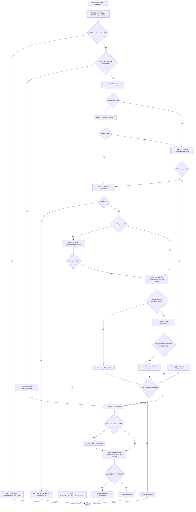
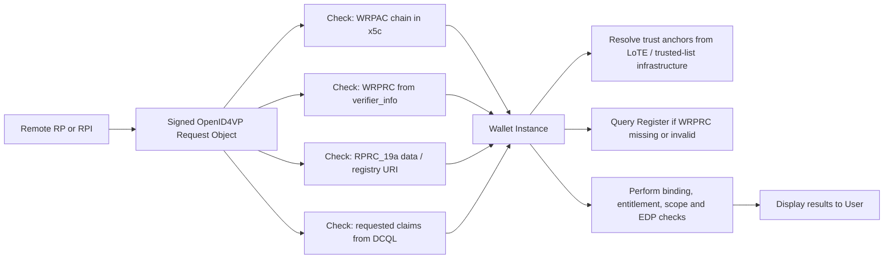
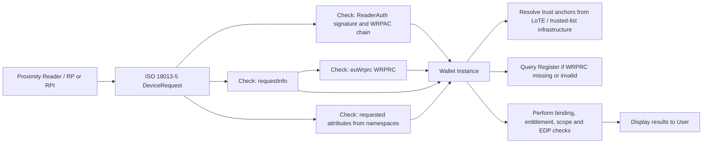
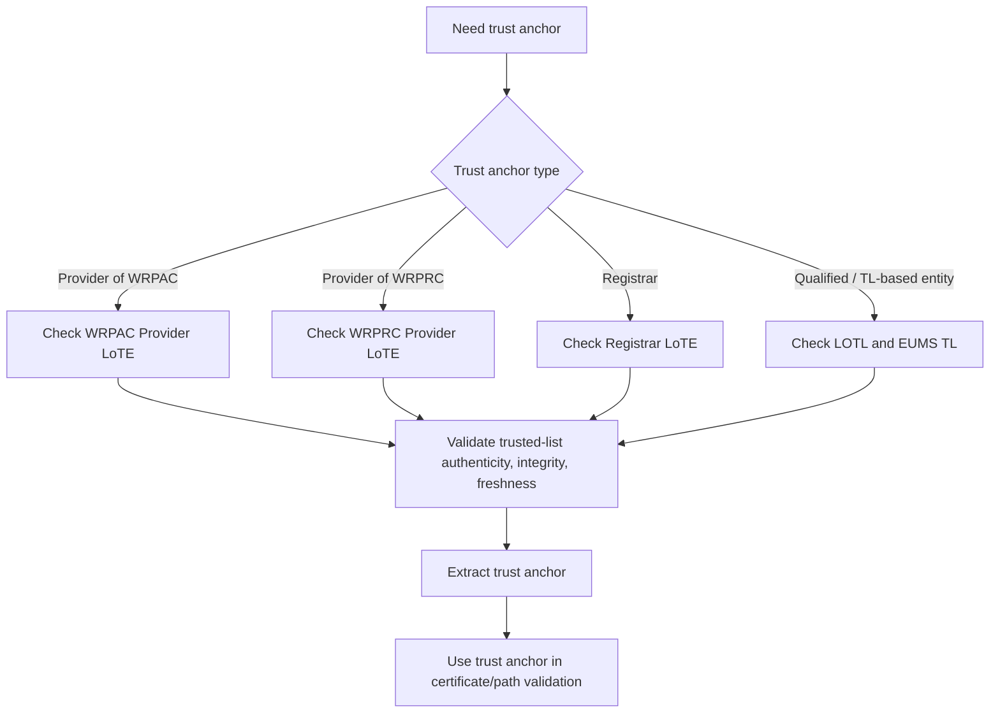

This section specifies the trust checks performed during Presentation flows, both:

- **<protocols:Remote Flow|Remote Presentation>**, e.g. <protocols:OpenID for Verifiable Presentation (OID4VP)|OID4VP>-based presentation request.
- **<protocols:Proximity Flow|Proximity Presentation>**, e.g. [ISO/IEC 18013-5] DeviceRequest / ReaderAuth based interaction.

#### Entities and Artifacts

| Entity    | Role in Presentation Trust Evaluation |
| --------- | ------------------------------------- |
| <components:Wallet Instance> (<components:Wallet Unit>) | Main trust evaluator. Authenticates the <roles:Wallet-Relying Party (WRP)\|WRP>, evaluates authorization evidence, checks scope, evaluates <artifacts:Embedded Disclosure Policy (EDP)\|EDPs>, and presents results/advisories to the User. |
| <roles:Wallet-Relying Party (WRP)\|WRP> | Requests <credentials:Attestation\|Attestations> from the Wallet. May act directly or through an intermediary. |
| <roles:Relying Party Intermediary (RPI)\|Relying Party Intermediary> | Acts on behalf of a final <roles:Relying Party (RP)\|RP>. SHALL be authenticated and bound to the final <roles:Relying Party (RP)\|RP> authorization context. |
| <roles:Provider of Wallet-Relying Party Access Certificate (Provider of WRPAC)\|Provider of WRPAC> | Issues the <artifacts:Wallet-Relying Party Access Certificate (WRPAC)\|WRPAC> used to authenticate the <roles:Wallet-Relying Party (WRP)\|WRP> or <roles:Relying Party Intermediary (RPI)\|Relying Party Intermediary>. |
| <roles:Provider of Wallet-Relying Party Registration Certificate (Provider of WRPRC)\|Provider of WRPRC> | Issues the <artifacts:Wallet-Relying Party Registration Certificate (WRPRC)\|WRPRC> used as authorization evidence. |
| <roles:Registrar> (<components:Register>) | Authoritative source of registration data, used as fallback when <artifacts:Wallet-Relying Party Registration Certificate (WRPRC)\|WRPRC> is missing or invalid following [TS05]. |
| <artifacts:List of Trusted Entities (LoTE)\|LoTE> | Infrastructure used to resolve <artifacts:Trust Anchor\|Trust Anchors> for the <roles:Trusted Entity\|Trusted Entities>. |
| User | Makes the final disclosure decision, after the <components:Wallet Instance> displays identity, requested attributes, intended use, policy results and advisories. |

| Artifact  | Used for  |
| --------- | --------- |
| <artifacts:Wallet-Relying Party Access Certificate (WRPAC)\|WRPAC> | Authentication of the <roles:Wallet-Relying Party (WRP)\|WRP> or <roles:Relying Party Intermediary (RPI)\|Relying Party Intermediary> and verification of the signed presentation request artifact. |
| Signed request artifact | **<protocols:Remote Flow>**: signed <protocols:OpenID for Verifiable Presentation (OID4VP)\|OID4VP> <artifacts:Request Object>. **<protocols:Proximity Flow>**: `ReaderAuth` / <artifacts:mdoc> request structure. |
| <artifacts:Wallet-Relying Party Registration Certificate (WRPRC)\|WRPRC> | Authorization evidence for the (final) <roles:Relying Party (RP)\|RP>, including subject, entitlement, intended use, registered credential/claim scope, status, and intermediary relationship where applicable. |
| <components:Register> response | Fallback authorization evidence when <artifacts:Wallet-Relying Party Registration Certificate (WRPRC)\|WRPRC> is absent or invalid. |
| RPRC_19a / request registration data | Presentation-request fields carrying (final) <roles:Relying Party (RP)\|RP> information and registry URI ([ARF, Topic 44]). |
| <artifacts:Embedded Disclosure Policy (EDP)\|EDP> | Generated during issuance and stored locally by the Wallet during issuance and evaluated at presentation time. |
| Requested attributes | **<protocols:Remote Flow>**: DCQL `credential_queries.claims`. **<protocols:Proximity Flow>**: `docRequest.itemRequest.nameSpaces`. |

#### Common Presentation Trust Evaluation Model

The authorization logic is common to <protocols:Remote Flow|Remote> and <protocols:Proximity Flow|Proximity> flows. The differences are limited to the transport, the location and format of the <artifacts:Wallet-Relying Party Registration Certificate (WRPRC)|WRPRC>, and the way requested attributes are extracted.

##### Flowchart to detailed trust-check index

Section [Common Presentation Trust Evaluation Model](#common-presentation-trust-evaluation-model) uses coarse step labels (**Check 1**-**Check 9**) for control flow. Section [Detailed Trust Checks](#detailed-trust-checks) decomposes the same logic into [APTITUDE-RFC003] test-case identifiers (`TC-PRES-001`-`TC-PRES-017`). The correspondence is mostly one-to-many: one flowchart label may map to several `TC-PRES` checks, and some `TC-PRES` checks have no separate box in the flowchart. Trust-list resolution (`TL-PRES-001`, Section [Trust Anchor and Trusted List Checks](#trust-anchor-and-trusted-list-checks)) is a cross-cutting dependency of <artifacts:Wallet-Relying Party Access Certificate (WRPAC)|WRPAC>, <artifacts:Wallet-Relying Party Registration Certificate (WRPRC)|WRPRC>, and <components:Register> validation rather than its own flowchart step.

| Flowchart | Trust Checks  | Notes |
| --------- | ------------- | ----- |
| **Check 1** — Authenticate <roles:Wallet-Relying Party (WRP)\|WRP>/RPI using <artifacts:Wallet-Relying Party Access Certificate (WRPAC)\|WRPAC> | `TC-PRES-001` | Direct match. |
| **U1** — User opted in to RP verification? | `TC-PRES-002` | Same step; not numbered "Check *N*" in the diagram. |
| **Check 2** — Extract authorization evidence | `TC-PRES-003` | Direct match. |
| **Check 3A** — Validate <artifacts:Wallet-Relying Party Registration Certificate (WRPRC)\|WRPRC> | `TC-PRES-004`, `TC-PRES-005` | One diagram box; Section [Detailed Trust Checks](#detailed-trust-checks) splits format/algorithm validation from signature, chain, <artifacts:Trust Anchor>, temporal validity, and status. |
| **Check 3B** — Query and validate Register data | `TC-PRES-006` | Direct match; also used when <artifacts:Wallet-Relying Party Registration Certificate (WRPRC)\|WRPRC> is absent or Check 3A fails. |
| **Check 4** — Binding verification | `TC-PRES-007`, `TC-PRES-010` | `TC-PRES-007` covers direct RP binding; `TC-PRES-010` (final RP context coherence) is not a separate flowchart box. |
| **I1** — Intermediary scenario? | `TC-PRES-008` | Intermediary detection; decision diamond, not a "Check *N*" label. |
| **Check 5** — Verify intermediary association | `TC-PRES-009` | Direct match. |
| **Check 6** — Entitlement verification | `TC-PRES-011` | Direct match. |
| **Check 7** — Scope comparison | `TC-PRES-012`, `TC-PRES-013` | Diagram merges attribute extraction and scope comparison. |
| **Check 8** — EDP evaluation | `TC-PRES-014`, `TC-PRES-015`, `TC-PRES-016` | One diagram box; Section [Detailed Trust Checks](#detailed-trust-checks) splits presence, Authorized Relying Parties Only, and Specific Root of Trust. |
| **Check 9** — Display trust results and User approval | `TC-PRES-017` | Direct match |
| *(implicit in <artifacts:Wallet-Relying Party Access Certificate (WRPAC)\|WRPAC> / <artifacts:Wallet-Relying Party Registration Certificate (WRPRC)\|WRPRC> / <components:Register> validation)* | `TL-PRES-001` | LoTE checks (Section [Trust Anchor and Trusted List Checks](#trust-anchor-and-trusted-list-checks)); no dedicated flowchart node. |

**Checks in Section [Detailed Trust Checks](#detailed-trust-checks) without a Section [Common Presentation Trust Evaluation Model](#common-presentation-trust-evaluation-model) "Check *N*" label:** `TC-PRES-008` (intermediary detection, see **I1**), `TC-PRES-010` (intermediated RP context coherence, folded into binding in the diagram), `TC-PRES-012` (requested-attribute extraction, prerequisite to Check 7).

**Flowchart outcomes (not separate trust checks):**

| Flowchart Node    | Typical Source Check      |
| ----------------- | ------------------------- |
| StopAuth          | `TC-PRES-001` failure |
| AdvNoData         | `TC-PRES-003` / `TC-PRES-006` (incomplete evidence or <components:Register> validation failed) |
| StopBind          | `TC-PRES-007` / `TC-PRES-010` |
| StopInt           | `TC-PRES-009` |
| AdvEnt            | `TC-PRES-011` |
| AdvScope          | `TC-PRES-013` |
| AdvEDP            | `TC-PRES-014` to `TC-PRES-016` |

#### Remote Presentation Flow

##### Remote-specific inputs

| Item  | Remote Flow Source    |
| ----- | --------------------- |
| Signed request artifact | The Remote Presentation request, represented as an <protocols:OpenID for Verifiable Presentation (OID4VP)\|OID4VP> Authorization Request (JWT/JWS). This is the main artifact the <components:Wallet Instance> validates before trusting the request. It contains EUDI-specific extensions such as `verifier_info`. |
| <artifacts:Wallet-Relying Party Access Certificate (WRPAC)\|WRPAC> chain | The <artifacts:Wallet-Relying Party Access Certificate (WRPAC)\|WRPAC> authenticates the technical requester (<roles:Relying Party (RP)\|RP> or Intermediary) that signed the <artifacts:Request Object>. The certificate chain is carried in the JOSE header using `x5c`. The <components:Wallet Instance> uses this chain to validate the signer's certificate, check that it chains to a trusted root, and confirm that the request was signed by the entity represented by the access certificate. |
| <artifacts:Wallet-Relying Party Registration Certificate (WRPRC)\|WRPRC> | The <artifacts:Wallet-Relying Party Registration Certificate (WRPRC)\|WRPRC> is included by value inside `verifier_info`. |
| <artifacts:Wallet-Relying Party Registration Certificate (WRPRC)\|WRPRC> format | JWT, `typ` = `rc-wrp+jwt`. |
| <components:Register> fallback URL / <roles:Relying Party (RP)\|RP> information | Part of `verifier_info` metadata, under key `RPRC_19a`. If no usable <artifacts:Wallet-Relying Party Registration Certificate (WRPRC)\|WRPRC> is included, the <components:Wallet Instance> still needs enough information to identify the <roles:Relying Party (RP)\|RP>/service and find the responsible <components:Register>/<roles:Registrar>. For this reason `registrar_url` and <roles:Relying Party (RP)\|RP> information are included. |
| Requested attributes | DCQL `credential_queries[].claims[]`. |

##### Remote flow trust-check diagram

#### Proximity Presentation Flow

##### Proximity-specific inputs

| Item  | Proximity Flow Source |
| ----- | --------------------- |
| Signed request artifact | The reader sends a `DeviceRequest`, which contains one or more document requests. The signed/security-relevant part is the `ReaderAuth` structure. |
| <artifacts:Wallet-Relying Party Access Certificate (WRPAC)\|WRPAC> chain | The certificate chain is presented within the <roles:Wallet-Relying Party (WRP)\|WRP>-signed `ReaderAuth` element of the <artifacts:mdoc> request message. |
| <artifacts:Wallet-Relying Party Registration Certificate (WRPRC)\|WRPRC> | The <artifacts:Wallet-Relying Party Registration Certificate (WRPRC)\|WRPRC> is the registration/authorization evidence of the <roles:Relying Party (RP)\|RP> is extracted from the `euWrprc` member inside `requestInfo` in the ISO DeviceRequest. |
| <artifacts:Wallet-Relying Party Registration Certificate (WRPRC)\|WRPRC> format | CWT, `typ` = `rc-wrp+cwt`. |
| <components:Register> fallback URL / <roles:Relying Party (RP)\|RP> information | The <roles:Registrar> URL should be extracted from `requestInfo`; if no <artifacts:Wallet-Relying Party Registration Certificate (WRPRC)\|WRPRC> is present or it is invalid, the <components:Wallet Instance> applies <components:Register> validation using the `registry_uri`, <roles:Relying Party (RP)\|RP> identifier, and `intended_use_id` from the request extension. |
| Requested attributes | `docRequest.itemRequest.nameSpaces`. |

!!! warning

    The current trust specification notes that the mapping of `RPRC_19a` data in `requestInfo` is not fully defined in [ETSI TS 119 472-2]. [APTITUDE-RFC003] SHOULD either define an APTITUDE convention for this mapping or mark the related tests as dependent on the final ETSI / APTITUDE profile decision.

##### Proximity flow trust-check diagram

#### Detailed Trust Checks

For the mapping from Section [Common Presentation Trust Evaluation Model](#common-presentation-trust-evaluation-model) flowchart labels to the identifiers below, see [Flowchart to detailed trust-check index](#flowchart-to-detailed-trust-check-index).

##### TC-PRES-001 — WRP/RPI authentication using WRPAC

| Field                             | Description       |
| --------------------------------- | ----------------- |
| **Performed by**                  | <components:Wallet Instance> / <components:Wallet Unit>. |
| **Checked entity**                | Authenticated <roles:Wallet-Relying Party (WRP)\|WRP>, which may be the direct RP or an RPI. |
| **Input artifacts**               | <artifacts:Wallet-Relying Party Access Certificate (WRPAC)\|WRPAC> certificate chain, signed request artifact, <artifacts:List of Trusted Entities (LoTE)\|LoTE> <artifacts:Trust Anchor> for <roles:Provider of Wallet-Relying Party Access Certificate (Provider of WRPAC)\|Provider of WRPAC>. |
| **Remote input location**         | <artifacts:Wallet-Relying Party Access Certificate (WRPAC)\|WRPAC> chain in `x5c` of signed <protocols:OpenID for Verifiable Presentation (OID4VP)\|OID4VP> <artifacts:Request Object>. |
| **Proximity input location**      | <artifacts:Wallet-Relying Party Access Certificate (WRPAC)\|WRPAC> chain in `ReaderAuth` / <artifacts:mdoc> request message. |
| **Checks**                        | Retrieve <artifacts:Trust Anchor> from the relevant <artifacts:List of Trusted Entities (LoTE)\|LoTE>; construct <artifacts:Wallet-Relying Party Access Certificate (WRPAC)\|WRPAC> certification path; validate certificate path; validate certificate status where applicable; verify the signature on the request artifact using the <artifacts:Wallet-Relying Party Access Certificate (WRPAC)\|WRPAC> public key. |
| **Positive result**               | <roles:Wallet-Relying Party (WRP)\|WRP>/RPI is authenticated; the Authorization Process MAY start. |
| **Negative result**               | Authentication failed. Authorization processing SHALL NOT start. |
| **Test focus**                    | Valid chain, invalid chain, unknown <artifacts:Trust Anchor>, expired certificate, revoked certificate, invalid request signature, mismatched signing key. |

##### TC-PRES-002 — User choice to verify RP registration information

| Field                             | Description       |
| --------------------------------- | ----------------- |
| **Performed by**                  | <components:Wallet Instance>. |
| **Checked entity**                | User configuration / Wallet policy. |
| **Input artifacts**               | Wallet setting for RP verification. |
| **Checks**                        | Determine whether the User has opted in to RP verification. The default should be enabled. |
| **Positive result**               | Execute registration verification block: authorization evidence collection, binding, entitlement, and scope comparison. |
| **Negative / disabled result**    | Skip registration verification block and proceed directly to <artifacts:Embedded Disclosure Policy (EDP)\|EDP> evaluation and User approval. |
| **Test focus**                    | Default-enabled setting; enabled path; disabled path; UI indication that registration verification was skipped. |

##### TC-PRES-003 — Authorization evidence extraction

| Field                             | Description       |
| --------------------------------- | ----------------- |
| **Performed by**                  | <components:Wallet Instance>. |
| **Checked entity**                | Presentation request. |
| **Input artifacts**               | <artifacts:Wallet-Relying Party Registration Certificate (WRPRC)\|WRPRC>, request registration data, registry URI, RP/final RP identifier, intended use identifier. |
| **Remote input location**         | `verifier_info` in <artifacts:Request Object>. |
| **Proximity input location**      | euWrprc and related registration data in requestInfo. |
| **Checks**                        | Extract <artifacts:Wallet-Relying Party Registration Certificate (WRPRC)\|WRPRC> if present. Extract RP/final RP identity, registry URI, and intended_use_id / intended-use reference needed for <components:Register> fallback and scope comparison. |
| **Positive result**               | Authorization evidence is available from <artifacts:Wallet-Relying Party Registration Certificate (WRPRC)\|WRPRC> or from request data sufficient to query the <components:Register>. |
| **Negative result**               | Evidence cannot be obtained; Wallet records failed verification and proceeds with an advisory to the User, unless a later non-overridable check fails. |
| **Test focus**                    | <artifacts:Wallet-Relying Party Registration Certificate (WRPRC)\|WRPRC> present; <artifacts:Wallet-Relying Party Registration Certificate (WRPRC)\|WRPRC> absent but <components:Register> URL present; <artifacts:Wallet-Relying Party Registration Certificate (WRPRC)\|WRPRC> absent and <components:Register> URL absent; malformed `verifier_info`; malformed `requestInfo`; missing intended-use identifier. |

##### TC-PRES-004 — WRPRC format and algorithm validation

| Field                             | Description       |
| --------------------------------- | ----------------- |
| **Performed by**                  | <components:Wallet Instance>. |
| **Checked entity**                | <artifacts:Wallet-Relying Party Registration Certificate (WRPRC)\|WRPRC>. |
| **Input artifacts**               | <artifacts:Wallet-Relying Party Registration Certificate (WRPRC)\|WRPRC> from presentation request. |
| **Remote rule**                   | <artifacts:Wallet-Relying Party Registration Certificate (WRPRC)\|WRPRC> is JWT and `typ` = `rc-wrp+jwt`. |
| **Proximity rule**                | <artifacts:Wallet-Relying Party Registration Certificate (WRPRC)\|WRPRC> is CWT and `typ` = `rc-wrp+cwt`; signing algorithm is taken from COSE header. |
| **Checks**                        | Verify expected type, supported encoding, accepted signature algorithm, no none algorithm, no deprecated or forbidden algorithm. |
| **Positive result**               | Proceed to <artifacts:Wallet-Relying Party Registration Certificate (WRPRC)\|WRPRC> signature and certificate chain validation. |
| **Negative result**               | <artifacts:Wallet-Relying Party Registration Certificate (WRPRC)\|WRPRC> validation returns `CERTIFICATE_INVALID`; Wallet falls back to <components:Register> validation. |
| **Test focus**                    | Correct type; wrong type; unsupported format; none algorithm; deprecated algorithm; malformed JWT/CWT/COSE. |

##### TC-PRES-005 — WRPRC signature, certificate chain, trust anchor, temporal validity and status

| Field                             | Description       |
| --------------------------------- | ----------------- |
| **Performed by**                  | <components:Wallet Instance>. |
| **Checked entity**                | <artifacts:Wallet-Relying Party Registration Certificate (WRPRC)\|WRPRC> and <roles:Provider of Wallet-Relying Party Registration Certificate (Provider of WRPRC)\|Provider of WRPRC>. |
| **Input artifacts**               | <artifacts:Wallet-Relying Party Registration Certificate (WRPRC)\|WRPRC>, <artifacts:Wallet-Relying Party Registration Certificate (WRPRC)\|WRPRC> signing certificate chain, <artifacts:List of Trusted Entities (LoTE)\|LoTE> <artifacts:Trust Anchor> for <roles:Provider of Wallet-Relying Party Registration Certificate (Provider of WRPRC)\|Provider of WRPRC>, WRPRC iat, exp, and status fields. |
| **Checks**                        | Verify <artifacts:Wallet-Relying Party Registration Certificate (WRPRC)\|WRPRC> signature; validate certificate chain; resolve <artifacts:Trust Anchor> for <roles:Provider of Wallet-Relying Party Registration Certificate (Provider of WRPRC)\|Provider of WRPRC> from the relevant <artifacts:List of Trusted Entities (LoTE)\|LoTE>; verify temporal validity; verify status / revocation using the status field; verify coherence between <artifacts:Wallet-Relying Party Registration Certificate (WRPRC)\|WRPRC> subject and scenario context. |
| **Positive result**               | <artifacts:Wallet-Relying Party Registration Certificate (WRPRC)\|WRPRC> becomes authoritative authorization context. |
| **Negative result**               | <artifacts:Wallet-Relying Party Registration Certificate (WRPRC)\|WRPRC> validation returns `CERTIFICATE_INVALID`; Wallet falls back to <components:Register> validation. |
| **Test focus**                    | Valid <artifacts:Wallet-Relying Party Registration Certificate (WRPRC)\|WRPRC>; invalid signature; unknown <artifacts:Wallet-Relying Party Registration Certificate (WRPRC)\|WRPRC> provider; expired <artifacts:Wallet-Relying Party Registration Certificate (WRPRC)\|WRPRC>; not-yet-valid <artifacts:Wallet-Relying Party Registration Certificate (WRPRC)\|WRPRC>; revoked <artifacts:Wallet-Relying Party Registration Certificate (WRPRC)\|WRPRC>; subject/context mismatch. |

##### TC-PRES-006 — Register fallback validation

| Field                             | Description       |
| --------------------------------- | ----------------- |
| **Performed by**                  | <components:Wallet Instance>. |
| **Checked entity**                | <roles:Registrar> / <components:Register> response. |
| **Input artifacts**               | Registry URI, entity identifier, intended-use identifier, signed <components:Register> response, <roles:Registrar> <artifacts:Trust Anchor> from <artifacts:List of Trusted Entities (LoTE)\|LoTE>. |
| **Checks**                        | Extract <roles:Registrar> URL; connect over HTTPS; query by entity identifier and `intended_use_id`; verify response signature; resolve and validate <roles:Registrar> trust chain; verify that the response pertains to the relevant authorization subject and intended use; normalize <components:Register>-derived data into the same internal model used for WRPRC-derived data. |
| **Positive result**               | <components:Register> response becomes authoritative authorization context. |
| **Negative result**               | <components:Register> validation returns `FAILED`; for presentation, this is an advisory to the User and may be overridden. |
| **Test focus**                    | Successful <components:Register> lookup; unavailable <components:Register>; TLS failure; unsigned response; invalid response signature; wrong subject; wrong intended use; unknown <roles:Registrar> <artifacts:Trust Anchor>; stale or revoked <roles:Registrar> signing certificate. |

##### TC-PRES-007 — Direct RP binding verification

| Field                             | Description       |
| --------------------------------- | ----------------- |
| **Performed by**                  | <components:Wallet Instance>. |
| **Checked entity**                | Direct RP. |
| **Input artifacts**               | Authenticated <roles:Wallet-Relying Party (WRP)\|WRP> identifier from <artifacts:Wallet-Relying Party Access Certificate (WRPAC)\|WRPAC> subject DN, specifically the organizationIdentifier where available; claimed RP identifier from presentation request / `RPRC_19a`; <artifacts:Wallet-Relying Party Registration Certificate (WRPRC)\|WRPRC> sub and/or <components:Register> subject. |
| **Checks**                        | For a direct RP scenario, determine that the authenticated <roles:Wallet-Relying Party (WRP)\|WRP> identifier and the claimed RP identifier match. Verify that all available identifiers are mutually consistent: <artifacts:Wallet-Relying Party Access Certificate (WRPAC)\|WRPAC> subject / organizationIdentifier, <artifacts:Wallet-Relying Party Registration Certificate (WRPRC)\|WRPRC> sub, request registration data / `RPRC_19a`, and <components:Register> response if queried. If they do not match, this is an authorization-context integrity failure, not a user choice. |
| **Positive result**               | Direct RP binding is confirmed. |
| **Negative result**               | `BINDING_FAILED`; non-overridable; presentation SHALL NOT proceed on that authorization context. |
| **Test focus**                    | All identifiers match; <artifacts:Wallet-Relying Party Registration Certificate (WRPRC)\|WRPRC> sub mismatch; request RP identifier mismatch; <components:Register> subject mismatch; inconsistent mixed <artifacts:Wallet-Relying Party Registration Certificate (WRPRC)\|WRPRC>/<components:Register> data; <artifacts:Wallet-Relying Party Access Certificate (WRPAC)\|WRPAC> subject DN present but `organizationIdentifier` absent or malformed. |

##### TC-PRES-008 — Intermediary detection

| Field                             | Description       |
| --------------------------------- | ----------------- |
| **Performed by**                  | <components:Wallet Instance>. |
| **Checked entity**                | Authenticated <roles:Wallet-Relying Party (WRP)\|WRP> and claimed final RP. |
| **Input artifacts**               | <artifacts:Wallet-Relying Party Access Certificate (WRPAC)\|WRPAC> subject identifier, claimed RP/final RP identifier from presentation request. |
| **Checks**                        | Compare authenticated <roles:Wallet-Relying Party (WRP)\|WRP> identifier with claimed RP identifier. If they match, treat as direct RP. If they differ, treat as intermediary scenario. |
| **Positive result**               | Scenario type is determined. |
| **Negative result**               | Not applicable as a pass/fail check, but missing final RP information should lead to an intermediary authorization failure. |
| **Test focus**                    | Direct RP; valid intermediary; missing final RP identifier; ambiguous identifiers; same trade name but different legal identifier. |

##### TC-PRES-009 — Intermediary association verification

| Field                             | Description       |
| --------------------------------- | ----------------- |
| **Performed by**                  | <components:Wallet Instance>. |
| **Checked entity**                | RPI acting on behalf of final RP. |
| **Input artifacts**               | Authenticated intermediary identifier from <artifacts:Wallet-Relying Party Access Certificate (WRPAC)\|WRPAC>, final RP authorization context from WRPRC or <components:Register>, intermediary structure where available. |
| **Checks**                        | Verify that the authenticated intermediary is authorized to act on behalf of the final RP. If <artifacts:Wallet-Relying Party Registration Certificate (WRPRC)\|WRPRC> is valid, check that the final RP <artifacts:Wallet-Relying Party Registration Certificate (WRPRC)\|WRPRC> contains an intermediary structure and that intermediary.sub matches the authenticated intermediary identifier. If <artifacts:Wallet-Relying Party Registration Certificate (WRPRC)\|WRPRC> is unavailable or invalid, query the <components:Register> and verify that the intermediary is listed as authorized for that RP. |
| **Positive result**               | Intermediary relationship is confirmed; subsequent authorization checks use the final RP context, not the intermediary context. |
| **Negative result**               | `INTERMEDIARY_NOT_AUTHORIZED`; non-overridable. |
| **Test focus**                    | Valid intermediary in <artifacts:Wallet-Relying Party Registration Certificate (WRPRC)\|WRPRC>; valid intermediary in <components:Register> fallback; intermediary not listed; intermediary listed for different RP; mismatched `intermediary.sub`; missing final RP info. |

##### TC-PRES-010 — Intermediated RP context coherence

| Field                             | Description       |
| --------------------------------- | ----------------- |
| **Performed by**                  | <components:Wallet Instance>. |
| **Checked entity**                | Final / intermediated RP. |
| **Input artifacts**               | Final RP identifier from request, <artifacts:Wallet-Relying Party Registration Certificate (WRPRC)\|WRPRC> sub, <components:Register> response subject, intermediary data. |
| **Checks**                        | Verify that the final RP identifier is consistent across all available sources. Ensure entitlement verification, scope comparison, and <artifacts:Embedded Disclosure Policy (EDP)\|EDP> evaluation are applied to the final RP context, not the intermediary identity. |
| **Positive result**               | Final RP authorization context is coherent. |
| **Negative result**               | `BINDING_FAILED`; non-overridable. |
| **Test focus**                    | Consistent final RP; final RP mismatch between request and <artifacts:Wallet-Relying Party Registration Certificate (WRPRC)\|WRPRC>; final RP mismatch between request and <components:Register>; Wallet incorrectly applies intermediary context to scope or <artifacts:Embedded Disclosure Policy (EDP)\|EDP>. |

##### TC-PRES-011 — Entitlement verification

| Field                             | Description       |
| --------------------------------- | ----------------- |
| **Performed by**                  | <components:Wallet Instance>. |
| **Checked entity**                | Authorization subject: direct RP or final RP in intermediary scenario. |
| **Input artifacts**               | Authorization context from <artifacts:Wallet-Relying Party Registration Certificate (WRPRC)\|WRPRC> or <components:Register>, entitlements array. |
| **Checks**                        | Verify that the authorization subject contains the expected presentation entitlement: <https://uri.etsi.org/19475/Entitlement/Service_Provider>. |
| **Positive result**               | Entitlement is valid; proceed to scope comparison. |
| **Negative result**               | `WRONG_ENTITLEMENT`; in presentation this is advisory and user-overridable. |
| **Test focus**                    | Correct `Service_Provider` entitlement; missing entitlement; wrong entitlement such as issuer/provider entitlement; entitlement present only for intermediary but not final RP; malformed URI. |

##### TC-PRES-012 — Requested-attribute extraction

| Field                             | Description       |
| --------------------------------- | ----------------- |
| **Performed by**                  | <components:Wallet Instance>. |
| **Checked entity**                | Presentation request. |
| **Input artifacts**               | Requested credential/claim structures. |
| **Remote rule**                   | Extract from DCQL `credential_queries.claims`. |
| **Proximity rule**                | Extract from `docRequest.itemRequest.nameSpaces`. |
| **Checks**                        | Build normalized list of requested credential types, document types, namespaces and claim paths for scope comparison and User display. |
| **Positive result**               | Requested attributes are available in normalized form. |
| **Negative result**               | Request cannot be reliably compared to registered scope; Wallet should present advisory or reject according to the profile’s request validation rules. |
| **Test focus**                    | Single claim; multiple claims; nested claim path; unknown namespace; duplicate claim; malformed DCQL; malformed <artifacts:mdoc> namespace request. |

##### TC-PRES-013 — Scope comparison / over-asking detection

| Field                             | Description       |
| --------------------------------- | ----------------- |
| **Performed by**                  | <components:Wallet Instance>. |
| **Checked entity**                | RP/final RP authorization context and requested attributes. |
| **Input artifacts**               | Normalized requested attributes, registered credentials, claim, `meta.vct_values`, `doctype_value` from <artifacts:Wallet-Relying Party Registration Certificate (WRPRC)\|WRPRC> or <components:Register>. |
| **Checks**                        | Compare requested attributes against registered scope. Matching is exact and case-sensitive. For SD-JWT VC, compare claim paths and `vct_values`. For mdoc, compare namespaces/items and `doctype_value`. |
| **Positive result**               | `VERIFICATION_PASSED`; requested attributes are within registered scope. |
| **Negative result**               | `OVERASKING_DETECTED`; advisory and user-overridable. Wallet identifies unregistered attributes. |
| **Test focus**                    | Exact match; case mismatch; extra unregistered attribute; registered credential type but unregistered claim; unregistered credential/document type; scope defined through <artifacts:Wallet-Relying Party Registration Certificate (WRPRC)\|WRPRC>; scope defined through <components:Register> fallback. |

##### TC-PRES-014 — EDP presence check

| Field                             | Description       |
| --------------------------------- | ----------------- |
| **Performed by**                  | <components:Wallet Instance>. |
| **Checked entity**                | Each matching attestation selected for possible presentation. |
| **Input artifacts**               | Locally stored <artifacts:Embedded Disclosure Policy (EDP)\|EDP> associated with the attestation. |
| **Checks**                        | Determine whether an <artifacts:Embedded Disclosure Policy (EDP)\|EDP> exists for the attestation. <credentials:Person Identification Data (PID)\|PID> are not assumed to have <artifacts:Embedded Disclosure Policy (EDP)\|EDPs>. <artifacts:Embedded Disclosure Policy (EDP)\|EDPs> apply to <credentials:Qualified Electronic Attestation of Attributes (QEAA)\|QEAA>, <credentials:Public Electronic Attestation of Attributes (PuB-EAA)\|PuB-EAA>, and <credentials:Electronic Attestation of Attributes (EAA)\|EAA>. |
| **Positive result**               | If no <artifacts:Embedded Disclosure Policy (EDP)\|EDP> exists, the attestation is allowed subject to User approval. If <artifacts:Embedded Disclosure Policy (EDP)\|EDP> exists, proceed to <artifacts:Embedded Disclosure Policy (EDP)\|EDP> policy evaluation. |
| **Negative result**               | Not applicable; absence of <artifacts:Embedded Disclosure Policy (EDP)\|EDP> is not a failure. |
| **Test focus**                    | Attestation with no <artifacts:Embedded Disclosure Policy (EDP)\|EDP>; attestation with <artifacts:Embedded Disclosure Policy (EDP)\|EDP>; <credentials:Person Identification Data (PID)\|PID> with no <artifacts:Embedded Disclosure Policy (EDP)\|EDP>; multiple attestations with different <artifacts:Embedded Disclosure Policy (EDP)\|EDPs>. |

##### TC-PRES-015 — EDP evaluation: Authorized Relying Parties Only

| Field                             | Description       |
| --------------------------------- | ----------------- |
| **Performed by**                  | <components:Wallet Instance>. |
| **Checked entity**                | Direct RP or final RP in intermediary scenario. |
| **Input artifacts**               | <artifacts:Embedded Disclosure Policy (EDP)\|EDP> `authorized_parties`; direct RP subject DN from <artifacts:Wallet-Relying Party Access Certificate (WRPAC)\|WRPAC> for direct RP scenarios; final RP identity and entitlements or sub-entitlements from <artifacts:Wallet-Relying Party Registration Certificate (WRPRC)\|WRPRC>/<components:Register> for intermediary scenarios. |
| **Checks**                        | For direct RP, evaluate the direct RP identity. For intermediary scenario, evaluate the final RP identity and do not use the intermediary identity as a substitute. Match the direct RP subject DN against subject_dn entries where applicable and/or match the RP/final-RP entitlement or sub-entitlement against `entitlement_uri` entries. A match on either criterion is sufficient if the policy allows it. |
| **Positive result**               | `EDP_SATISFIED`; attestation may be presented subject to User approval. |
| **Negative result**               | `EDP_NOT_SATISFIED`; Wallet shows advisory / negative outcome and may allow User override. |
| **Test focus**                    | Authorized direct RP by subject DN; authorized final RP behind intermediary; intermediary authorized but final RP not authorized; entitlement match; no match; DN formatting comparison; wallet incorrectly using intermediary identity to satisfy <artifacts:Embedded Disclosure Policy (EDP)\|EDP>. |

##### TC-PRES-016 — EDP evaluation: Specific Root of Trust

| Field                             | Description       |
| --------------------------------- | ----------------- |
| **Performed by**                  | <components:Wallet Instance>. |
| **Checked entity**                | RP/final RP trust root. |
| **Input artifacts**               | <artifacts:Embedded Disclosure Policy (EDP)\|EDP> `trusted_roots`; <artifacts:Wallet-Relying Party Access Certificate (WRPAC)\|WRPAC> chain for direct RP scenarios; <roles:Provider of Wallet-Relying Party Registration Certificate (Provider of WRPRC)\|Provider of WRPRC> root certificate information for the final/intermediated RP where applicable. |
| **Checks**                        | For direct RP, extract issuer DN and serial number from the root or intermediate certificates in the <artifacts:Wallet-Relying Party Access Certificate (WRPAC)\|WRPAC> chain and compare against `trusted_roots`. For intermediary scenario, retrieve root certificate information of the <roles:Provider of Wallet-Relying Party Registration Certificate (Provider of WRPRC)\|Provider of WRPRC> for the final RP and compare against `trusted_roots`. The intermediary trust root SHALL NOT be used as a substitute for the final RP authorization context. |
| **Positive result**               | `EDP_SATISFIED`; attestation may be presented subject to User approval. |
| **Negative result**               | `EDP_NOT_SATISFIED`; Wallet shows advisory / negative outcome and may allow User override. |
| **Test focus**                    | Matching trusted root; non-matching root; serial-number mismatch; issuer-DN normalization; direct RP vs intermediary behavior. |

##### TC-PRES-017 — User transparency and final approval

| Field                             | Description       |
| --------------------------------- | ----------------- |
| **Performed by**                  | <components:Wallet Instance> and User. |
| **Checked entity**                | Final presentation decision. |
| **Input artifacts**               | Results of authentication, registration verification, binding, intermediary, entitlement, scope, and <artifacts:Embedded Disclosure Policy (EDP)\|EDP> checks. |
| **Checks**                        | Wallet displays at least: RP/final RP identity, intermediary identity where applicable, requested attributes, intended-use description, privacy-policy link, support/contact information where available, and advisories. User approves or denies disclosure. |
| **Positive result**               | If User approves and no non-overridable failure exists, selected attestations are presented. |
| **Negative result**               | If User denies, presentation is cancelled. If User denies an attestation affected by <artifacts:Embedded Disclosure Policy (EDP)\|EDP>, Wallet behaves as if the attestation does not exist. |
| **Test focus**                    | Display direct RP identity; display intermediary and final RP identity; display unregistered attributes; display missing verification advisory; display <artifacts:Embedded Disclosure Policy (EDP)\|EDP> negative result; block continuation after non-overridable failure. |

#### Trust Anchor and Trusted List Checks

The following checks are used by several of the above procedures. They may be tested separately or as dependencies of <artifacts:Wallet-Relying Party Access Certificate (WRPAC)|WRPAC>, <artifacts:Wallet-Relying Party Registration Certificate (WRPRC)|WRPRC>, and <components:Register> validation.

##### TL-PRES-001 — Trusted-list authenticity, integrity and freshness

| Field                             | Description       |
| --------------------------------- | ----------------- |
| **Performed by**                  | <components:Wallet Instance> or trust-validation component used by Wallet. |
| **Checked entity**                | <artifacts:List of Trusted Entities (LoTE)\|LoTE>. |
| **Input artifacts**               | Trusted list, list signature, signing certificate, list metadata such as NextUpdate. |
| **Checks**                        | Validate trusted-list signature; verify that the signing certificate is authentic for the list; check list freshness / NextUpdate; extract relevant trusted entity entry and <artifacts:Trust Anchor>. |
| **Positive result**               | <artifacts:Trust Anchor> can be used for certificate-path validation. |
| **Negative result**               | <artifacts:Trust Anchor> cannot be used; dependent <artifacts:Wallet-Relying Party Access Certificate (WRPAC)\|WRPAC>/<artifacts:Wallet-Relying Party Registration Certificate (WRPRC)\|WRPRC>/<components:Register> validation fails. |
| **Test focus**                    | Valid list; invalid signature; expired list; signer not authorized; missing entity; wrong service type. |

#### Decision and Override Matrix

| Check             | Negative Result       | Effect in Presentation    |
| ----------------- | :-------------------: | ------------------------- |
| <artifacts:Wallet-Relying Party Access Certificate (WRPAC)\|WRPAC> authentication | Authentication failed | Blocking and non-overridable. The Authorization Process SHALL NOT start; <artifacts:Wallet-Relying Party Access Certificate (WRPAC)\|WRPAC> authentication is a precondition to the Authorization Process. |
| <artifacts:Wallet-Relying Party Registration Certificate (WRPRC)\|WRPRC> validation | `CERTIFICATE_INVALID` | Not final. Triggers <components:Register> fallback. |
| <components:Register> validation | `FAILED` | Advisory to User; may proceed with warning. |
| Direct RP binding | `BINDING_FAILED` | Blocking; non-overridable. |
| Intermediary association | `INTERMEDIARY_NOT_AUTHORIZED` | Blocking; non-overridable. |
| Intermediated RP context coherence | `BINDING_FAILED` | Blocking; non-overridable. |
| Entitlement verification | `WRONG_ENTITLEMENT` | Advisory; user-overridable in presentation. Non-overridable only for issuance. |
| Scope comparison | `OVERASKING_DETECTED` | Advisory; user-overridable. |
| <artifacts:Embedded Disclosure Policy (EDP)\|EDP> evaluation | `EDP_NOT_SATISFIED` | Advisory / negative policy result; user-overridable in the current APTITUDE presentation profile. |
| User final approval | User denies | Presentation cancelled. |

#### APTITUDE Alignment and Traceability

The `TC-PRES` identifiers are local test-check identifiers; the authoritative profile requirements remain the APTITUDE AUTHZ requirements and the authorization-process text.

| Checks in [APTITUDE-RFC003]   | APTITUDE Concept / Requirement    | Notes for Test Matrix |
| ----------------------------- | --------------------------------- | --------------------- |
| `TC-PRES-001`                 | `AUTHZ-GEN-01` / `AUTHZ-GEN-02` authentication prerequisite | Keep <artifacts:Wallet-Relying Party Access Certificate (WRPAC)\|WRPAC> validation as a precondition; if authentication fails, the Authorization Process SHALL not start. |
| `TC-PRES-002`                 | `AUTHZ-PRES-04` user setting for RP verification | Registration verification is default-enabled but user-optional; <artifacts:Embedded Disclosure Policy (EDP)\|EDP> evaluation remains always executed. |
| `TC-PRES-003`-`TC-PRES-006`   | `AUTHZ-GEN-05`-`AUTHZ-GEN-10`; <artifacts:Wallet-Relying Party Registration Certificate (WRPRC)\|WRPRC> validation and <components:Register> fallback | <artifacts:Wallet-Relying Party Registration Certificate (WRPRC)\|WRPRC> validation failure returns `CERTIFICATE_INVALID` and triggers <components:Register> validation; <components:Register> `FAILED` is advisory in presentation. |
| `TC-PRES-007`-`TC-PRES-010`   | `AUTHZ-GEN-04`, `AUTHZ-GEN-11/12`, `AUTHZ-INT-03/04/06/07` | Direct RP binding and intermediary/final-RP coherence are non-overridable. Test final RP context separately from intermediary identity. |
| `TC-PRES-011`                 | `AUTHZ-GEN-13`; presentation `Service_Provider` entitlement | `WRONG_ENTITLEMENT` is advisory/user-overridable in presentation. |
| `TC-PRES-012`-`TC-PRES-013`   | `AUTHZ-PRES-01` / `AUTHZ-PRES-02` scope comparison | Exact and case-sensitive comparison; `OVERASKING_DETECTED` SHALL identify unregistered attributes and is user-overridable. |
| `TC-PRES-014`-`TC-PRES-016`   | `AUTHZ-EDP-03`-`AUTHZ-EDP-08` | <artifacts:Embedded Disclosure Policy (EDP)\|EDP> SHALL be evaluated for each matching attestation. In intermediary scenarios evaluate the final RP, not the intermediary. |
| `TC-PRES-017`                 | `AUTHZ-UI-07`-`AUTHZ-UI-12`; `AUTHZ-INT-05` | Display final RP, intermediary where applicable, requested attributes, intended use, privacy-policy link, and advisories before final approval. |
