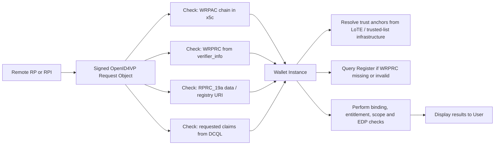
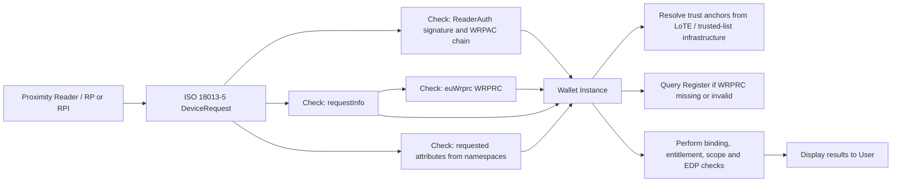
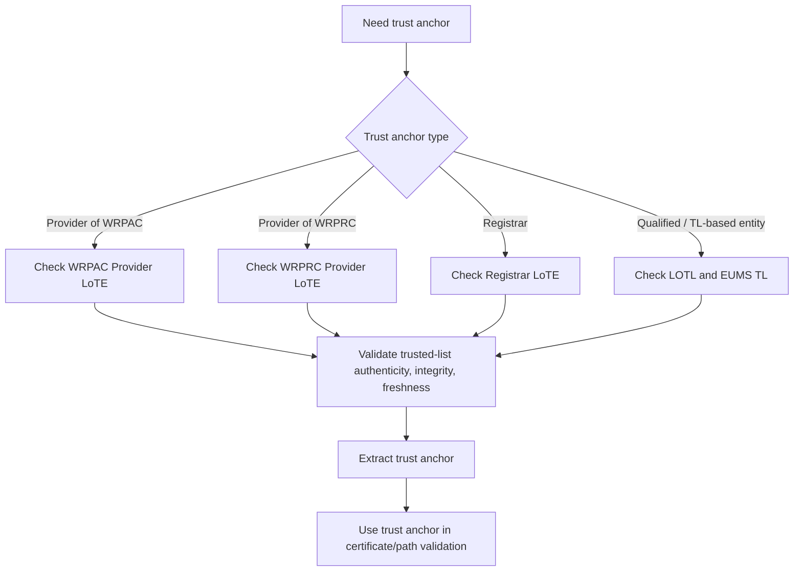

This section specifies the trust checks performed during Presentation flows, both:

- **<protocols:Remote Flow|Remote Presentation>**, e.g. OpenID4VP-based presentation request.
- **<protocols:Proximity Flow|Proximity Presentation>**, e.g. [ISO/IEC 18013-5] DeviceRequest / ReaderAuth based interaction.

The objective is to identify:

1. **Which entity performs each check**.
2. **Which entity or artefact is being checked**.
3. **Which input artefacts are needed**.
4. **Which result code or decision is produced**.
5. **Whether the result is blocking, advisory, or user-overridable**.
6. **How the check can later be converted into RFC003 test cases**.

#### Entities and Artefacts

##### Main entities

| **Entity**                                | **Role in Presentation trust evaluation**                                                                                                                 |
| ----------------------------------------- | --------------------------------------------------------------------------------------------------------------------------------------------------------- |
| **Wallet Instance / Wallet Unit (WI/WU)** | Main trust evaluator. Authenticates the WRP, evaluates authorization evidence, checks scope, evaluates EDPs, and presents results/advisories to the User. |
| **Wallet Relying Party (WRP)**            | Requests attributes / attestations from the Wallet. May act directly or through an intermediary.                                                          |
| **Relying Party Intermediary (RPI)**      | Acts on behalf of a final RP. Must be authenticated and bound to the final RP authorization context.                                                      |
| **Provider of WRPAC**                     | Issues the Wallet-Relying Party Access Certificate used to authenticate the WRP/RPI.                                                                      |
| **Provider of WRPRC**                     | Issues the Wallet-Relying Party Registration Certificate used as authorization evidence.                                                                  |
| **Registrar / Register**                  | Authoritative source of registration data, used as fallback when WRPRC is missing or invalid following TS05.                                              |
| **LoTE / LOTL / EUMS TL**                 | Trusted-list infrastructure used to resolve trust anchors for WRPAC providers, WRPRC providers, registrars, and other trust entities.                     |
| **User**                                  | Makes the final disclosure decision, after the Wallet displays identity, requested attributes, intended use, policy results and advisories.               |

##### Main artefacts

| **Artefact**                             | **Used for**                                                                                                                                                                         |
| ---------------------------------------- | ------------------------------------------------------------------------------------------------------------------------------------------------------------------------------------ |
| **WRPAC**                                | Authentication of the WRP/RPI and verification of the signed presentation request artefact.                                                                                          |
| **Signed request artefact**              | **Remote**: signed OpenID4VP Request Object. **Proximity**: ReaderAuth / mdoc request structure.                                                                                     |
| **WRPRC**                                | Authorization evidence for the RP/final RP, including subject, entitlement, intended use, registered credential/claim scope, status, and intermediary relationship where applicable. |
| **Register response**                    | Fallback authorization evidence when WRPRC is absent or invalid.                                                                                                                     |
| **RPRC_19a / request registration data** | Presentation-request fields carrying RP/final RP information and registry URI (Relying Party Registration / Topic 44)                                                                |
| **EDP**                                  | Embedded Disclosure Policy generated during issuance and stored locally by the Wallet during issuance and evaluated at presentation time.                                            |
| **Requested attributes**                 | **Remote**: DCQL credential_queries.claims. **Proximity**: docRequest.itemRequest.nameSpaces.                                                                                        |

#### Common Presentation Trust Evaluation Model

The **authorization logic is common to <protocols:Remote Flow|Remote> and <protocols:Proximity Flow|Proximity> flows**. The differences are limited to the transport, the location and format of the <artifacts:Wallet-Relying Party Registration Certificate (WRPRC)|WRPRC>, and the way requested attributes are extracted.

##### Flowchart to detailed trust-check index

Section [Common Presentation Trust Evaluation Model](#common-presentation-trust-evaluation-model) uses coarse step labels (**Check 1**…**Check 9**) for control flow. Section [Detailed Trust Checks](#detailed-trust-checks) decomposes the same logic into RFC003 test-case identifiers (**TC-PRES-001**…**TC-PRES-017**). The correspondence is mostly one-to-many: one flowchart label may map to several TC-PRES checks, and some TC-PRES checks have no separate box in the flowchart. Trust-list resolution (**TL-PRES-001**, Section [Trust Anchor and Trusted List Checks](#trust-anchor-and-trusted-list-checks)) is a cross-cutting dependency of <artifacts:Wallet-Relying Party Access Certificate (WRPAC)|WRPAC>, <artifacts:Wallet-Relying Party Registration Certificate (WRPRC)|WRPRC>, and <components:Register> validation rather than its own flowchart step.

| **Flowchart** | **Trust check(s)** | **Notes** |
| ------------------------- | ---------------------------- | --------- |
| **Check 1** — Authenticate WRP/RPI using WRPAC | TC-PRES-001 | Direct match |
| **U1** — User opted in to RP verification? | TC-PRES-002 | Same step; not numbered "Check *N*" in the diagram |
| **Check 2** — Extract authorization evidence | TC-PRES-003 | Direct match |
| **Check 3A** — Validate WRPRC | TC-PRES-004, TC-PRES-005 | One diagram box; Section [Detailed Trust Checks](#detailed-trust-checks) splits format/algorithm validation from signature, chain, trust anchor, temporal validity, and status |
| **Check 3B** — Query and validate Register data | TC-PRES-006 | Direct match; also used when WRPRC is absent or Check 3A fails |
| **Check 4** — Binding verification | TC-PRES-007, TC-PRES-010 | TC-PRES-007 covers direct RP binding; TC-PRES-010 (final RP context coherence) is not a separate flowchart box |
| **I1** — Intermediary scenario? | TC-PRES-008 | Intermediary detection; decision diamond, not a “Check *N*” label |
| **Check 5** — Verify intermediary association | TC-PRES-009 | Direct match |
| **Check 6** — Entitlement verification | TC-PRES-011 | Direct match |
| **Check 7** — Scope comparison | TC-PRES-012, TC-PRES-013 | Diagram merges attribute extraction and scope comparison |
| **Check 8** — EDP evaluation | TC-PRES-014, TC-PRES-015, TC-PRES-016 | One diagram box; Section [Detailed Trust Checks](#detailed-trust-checks) splits presence, Authorized Relying Parties Only, and Specific Root of Trust |
| **Check 9** — Display trust results and User approval | TC-PRES-017 | Direct match |
| *(implicit in WRPAC / WRPRC / Register validation)* | TL-PRES-001 | LoTE / LOTL / EUMS TL checks (Section [Trust Anchor and Trusted List Checks](#trust-anchor-and-trusted-list-checks)); no dedicated flowchart node |

**Checks in Section [Detailed Trust Checks](#detailed-trust-checks) without a Section [Common Presentation Trust Evaluation Model](#common-presentation-trust-evaluation-model) "Check *N*" label:** TC-PRES-008 (intermediary detection, see **I1**), TC-PRES-010 (intermediated RP context coherence, folded into binding in the diagram), TC-PRES-012 (requested-attribute extraction, prerequisite to Check 7).

**Flowchart outcomes (not separate trust checks):**

| **Flowchart node** | **Typical source check** |
| ------------------ | ------------------------ |
| StopAuth | TC-PRES-001 failure |
| AdvNoData | TC-PRES-003 / TC-PRES-006 (incomplete evidence or Register validation failed) |
| StopBind | TC-PRES-007 / TC-PRES-010 |
| StopInt | TC-PRES-009 |
| AdvEnt | TC-PRES-011 |
| AdvScope | TC-PRES-013 |
| AdvEDP | TC-PRES-014 to TC-PRES-016 |

#### Remote Presentation Flow

##### Remote-specific inputs

| **Item**                               | **Remote flow source**                                                                                                                                                                                                                                                                                                                                                     |
| -------------------------------------- | -------------------------------------------------------------------------------------------------------------------------------------------------------------------------------------------------------------------------------------------------------------------------------------------------------------------------------------------------------------------------- |
| Signed request artefact                | The Remote Presentation request, represented as an OpenID4VP Authorization Request (JWT/JWS). This is the main artifact the Wallet validates before trusting the request. It contains EUDI-specific extensions such as **verifier_info**.                                                                                                                                  |
| WRPAC chain                            | The WRPAC authenticates the technical requester (RP/Intermediary) that signed the Request Object. The certificate chain is carried in the JOSE header using **x5c**. The Wallet uses this chain to validate the signer’s certificate, check that it chains to a trusted root, and confirm that the request was signed by the entity represented by the access certificate. |
| WRPRC                                  | The WRPRC is the Wallet-Relying Party Registration Certificate.This is about registration and authorisation: the RP/service, intended use, and what attributes it is registered to request. The WRPRC is included by value inside verifier_info.                                                                                                                           |
| WRPRC format                           | JWT, typ = rc-wrp+jwt                                                                                                                                                                                                                                                                                                                                                      |
| Register fallback URL / RP information | Part of verifier_info metadata, under key RPRC_19a. If no usable WRPRC is included, the Wallet still needs enough information to identify the RP/service and find the responsible Register/Registrar. For this reason registrar_url and RP information are included.                                                                                                       |
| Requested attributes                   | DCQL credential_queries[].claims[]                                                                                                                                                                                                                                                                                                                                         |

##### Remote flow trust-check diagram

#### Proximity Presentation Flow

##### Proximity-specific inputs

| **Item**                               | **Proximity flow source**                                                                                                                                                                                                          |
| -------------------------------------- | ---------------------------------------------------------------------------------------------------------------------------------------------------------------------------------------------------------------------------------- |
| Signed request artefact                | The reader sends a **DeviceRequest**, which contains one or more document requests. The signed/security-relevant part is the ReaderAuth structure                                                                                  |
| WRPAC chain                            | The certificate chain is presented within the WRP-signed **ReaderAuth** element of the mdoc request message.                                                                                                                       |
| WRPRC                                  | The WRPRC is the registration/authorisation evidence of the RP is extracted from the euWrprc member inside requestInfo in the ISO DeviceRequest                                                                                     |
| WRPRC format                           | CWT, typ = rc-wrp+cwt                                                                                                                                                                                                              |
| Register fallback URL / RP information | The Registrar URL should be extracted from **requestInfo**; if no WRPRC is present or it is invalid, the Wallet applies Register validation using the registry_uri, RP identifier, and intended_use_id from the request extension. |
| Requested attributes                   | docRequest.itemRequest.nameSpaces                                                                                                                                                                                                  |

**Open point:** the current trust specification notes that the mapping of RPRC_19a data in requestInfo is not fully defined in [ETSI TS 119 472-2]. RFC003 should either define an APTITUDE pilot convention for this mapping or mark the related tests as dependent on the final ETSI / APTITUDE profile decision.

##### Proximity flow trust-check diagram

#### Detailed Trust Checks

For the mapping from Section [Common Presentation Trust Evaluation Model](#common-presentation-trust-evaluation-model) flowchart labels to the identifiers below, see [Flowchart to detailed trust-check index](#flowchart-to-detailed-trust-check-index).

##### TC-PRES-001 — WRP/RPI authentication using WRPAC

| **Field**                    | **Description**                                                                                                                                                                                                                     |
| ---------------------------- | ----------------------------------------------------------------------------------------------------------------------------------------------------------------------------------------------------------------------------------- |
| **Performed by**             | Wallet Instance / Wallet Unit                                                                                                                                                                                                       |
| **Checked entity**           | Authenticated WRP, which may be the direct RP or an RPI                                                                                                                                                                             |
| **Input artefacts**          | WRPAC certificate chain, signed request artefact, LoTE trust anchor for Provider of WRPAC                                                                                                                                           |
| **Remote input location**    | WRPAC chain in x5c of signed OpenID4VP Request Object                                                                                                                                                                               |
| **Proximity input location** | WRPAC chain in ReaderAuth / mdoc request message                                                                                                                                                                                    |
| **Checks**                   | Retrieve trust anchor from the relevant LoTE; construct WRPAC certification path; validate certificate path; validate certificate status where applicable; verify the signature on the request artefact using the WRPAC public key. |
| **Positive result**          | WRP/RPI is authenticated; authorization processing may start.                                                                                                                                                                       |
| **Negative result**          | Authentication failed. Authorization processing SHALL NOT start.                                                                                                                                                                     |
| **Test focus**               | Valid chain, invalid chain, unknown trust anchor, expired certificate, revoked certificate, invalid request signature, mismatched signing key.                                                                                      |

##### TC-PRES-002 — User choice to verify RP registration information

| **Field**                      | **Description**                                                                                                         |
| ------------------------------ | ----------------------------------------------------------------------------------------------------------------------- |
| **Performed by**               | Wallet Instance                                                                                                         |
| **Checked entity**             | User configuration / Wallet policy                                                                                      |
| **Input artefacts**            | Wallet setting for RP verification                                                                                      |
| **Checks**                     | Determine whether the User has opted in to RP verification. The default should be enabled.                              |
| **Positive result**            | Execute registration verification block: authorization evidence collection, binding, entitlement, and scope comparison. |
| **Negative / disabled result** | Skip registration verification block and proceed directly to EDP evaluation and User approval.                          |
| **Test focus**                 | Default-enabled setting; enabled path; disabled path; UI indication that registration verification was skipped.         |

##### TC-PRES-003 — Authorization evidence extraction

| **Field**                    | **Description**                                                                                                                                                              |
| ---------------------------- | ---------------------------------------------------------------------------------------------------------------------------------------------------------------------------- |
| **Performed by**             | Wallet Instance                                                                                                                                                              |
| **Checked entity**           | Presentation request                                                                                                                                                         |
| **Input artefacts**          | WRPRC, request registration data, registry URI, RP/final RP identifier, intended use identifier                                                                              |
| **Remote input location**    | verifier_info in Request Object                                                                                                                                              |
| **Proximity input location** | euWrprc and related registration data in requestInfo                                                                                                                         |
| **Checks**                   | Extract WRPRC if present. Extract RP/final RP identity, registry URI, and intended_use_id / intended-use reference needed for Register fallback and scope comparison.        |
| **Positive result**          | Authorization evidence is available from WRPRC or from request data sufficient to query the Register.                                                                        |
| **Negative result**          | Evidence cannot be obtained; Wallet records failed verification and proceeds with an advisory to the User, unless a later non-overridable check fails.                       |
| **Test focus**               | WRPRC present; WRPRC absent but Register URL present; WRPRC absent and Register URL absent; malformed verifier_info; malformed requestInfo; missing intended-use identifier. |

##### TC-PRES-004 — WRPRC format and algorithm validation

| **Field**           | **Description**                                                                                                                  |
| ------------------- | -------------------------------------------------------------------------------------------------------------------------------- |
| **Performed by**    | Wallet Instance                                                                                                                  |
| **Checked entity**  | WRPRC                                                                                                                            |
| **Input artefacts** | WRPRC from presentation request                                                                                                  |
| **Remote rule**     | WRPRC is JWT and typ = rc-wrp+jwt.                                                                                               |
| **Proximity rule**  | WRPRC is CWT and typ = rc-wrp+cwt; signing algorithm is taken from COSE header.                                                  |
| **Checks**          | Verify expected type, supported encoding, accepted signature algorithm, no none algorithm, no deprecated or forbidden algorithm. |
| **Positive result** | Proceed to WRPRC signature and certificate-chain validation.                                                                     |
| **Negative result** | WRPRC validation returns CERTIFICATE_INVALID; Wallet falls back to Register validation.                                          |
| **Test focus**      | Correct type; wrong type; unsupported format; none algorithm; deprecated algorithm; malformed JWT/CWT/COSE.                      |

##### TC-PRES-005 — WRPRC signature, certificate chain, trust anchor, temporal validity and status

| **Field**           | **Description**                                                                                                                                                                                                                                                   |
| ------------------- | ----------------------------------------------------------------------------------------------------------------------------------------------------------------------------------------------------------------------------------------------------------------- |
| **Performed by**    | Wallet Instance                                                                                                                                                                                                                                                   |
| **Checked entity**  | WRPRC and Provider of WRPRCs                                                                                                                                                                                                                                      |
| **Input artefacts** | WRPRC, WRPRC signing certificate chain, LoTE trust anchor for Provider of WRPRCs, WRPRC iat, exp, and status fields                                                                                                                                               |
| **Checks**          | Verify WRPRC signature; validate certificate chain; resolve trust anchor for Provider of WRPRCs from the relevant LoTE; verify temporal validity; verify status / revocation using the status field; verify coherence between WRPRC subject and scenario context. |
| **Positive result** | WRPRC becomes authoritative authorization context.                                                                                                                                                                                                                |
| **Negative result** | WRPRC validation returns CERTIFICATE_INVALID; Wallet falls back to Register validation.                                                                                                                                                                           |
| **Test focus**      | Valid WRPRC; invalid signature; unknown WRPRC provider; expired WRPRC; not-yet-valid WRPRC; revoked WRPRC; subject/context mismatch.                                                                                                                              |

##### TC-PRES-006 — Register fallback validation

| **Field**           | **Description**                                                                                                                                                                                                                                                                                                                                       |
| ------------------- | ----------------------------------------------------------------------------------------------------------------------------------------------------------------------------------------------------------------------------------------------------------------------------------------------------------------------------------------------------- |
| **Performed by**    | Wallet Instance                                                                                                                                                                                                                                                                                                                                       |
| **Checked entity**  | Registrar / Register response                                                                                                                                                                                                                                                                                                                         |
| **Input artefacts** | Registry URI, entity identifier, intended-use identifier, signed Register response, Registrar trust anchor from LoTE                                                                                                                                                                                                                                  |
| **Checks**          | Extract Registrar URL; connect over HTTPS; query by entity identifier and intended_use_id; verify response signature; resolve and validate Registrar trust chain; verify that the response pertains to the relevant authorization subject and intended use; normalize Register-derived data into the same internal model used for WRPRC-derived data. |
| **Positive result** | Register response becomes authoritative authorization context.                                                                                                                                                                                                                                                                                        |
| **Negative result** | Register validation returns FAILED; for presentation, this is an advisory to the User and may be overridden.                                                                                                                                                                                                                                          |
| **Test focus**      | Successful Register lookup; unavailable Register; TLS failure; unsigned response; invalid response signature; wrong subject; wrong intended use; unknown Registrar trust anchor; stale or revoked Registrar signing certificate.                                                                                                                      |

##### TC-PRES-007 — Direct RP binding verification

| **Field**           | **Description**                                                                                                                                                                                                                                                                                                                                                                                       |
| ------------------- | ----------------------------------------------------------------------------------------------------------------------------------------------------------------------------------------------------------------------------------------------------------------------------------------------------------------------------------------------------------------------------------------------------- |
| **Performed by**    | Wallet Instance                                                                                                                                                                                                                                                                                                                                                                                       |
| **Checked entity**  | Direct RP                                                                                                                                                                                                                                                                                                                                                                                             |
| **Input artefacts** | Authenticated WRP identifier from WRPAC subject DN, specifically the organizationIdentifier where available; claimed RP identifier from presentation request / RPRC_19a; WRPRC sub and/or Register subject.                                                                                                                                                                                           |
| **Checks**          | For a direct RP scenario, determine that the authenticated WRP identifier and the claimed RP identifier match. Verify that all available identifiers are mutually consistent: WRPAC subject / organizationIdentifier, WRPRC sub, request registration data / RPRC_19a, and Register response if queried. If they do not match, this is an authorization-context integrity failure, not a user choice. |
| **Positive result** | Direct RP binding is confirmed.                                                                                                                                                                                                                                                                                                                                                                       |
| **Negative result** | BINDING_FAILED; non-overridable; presentation must not proceed on that authorization context.                                                                                                                                                                                                                                                                                                         |
| **Test focus**      | All identifiers match; WRPRC sub mismatch; request RP identifier mismatch; Register subject mismatch; inconsistent mixed WRPRC/Register data; WRPAC subject DN present but organizationIdentifier absent or malformed.                                                                                                                                                                                |

##### TC-PRES-008 — Intermediary detection

| **Field**           | **Description**                                                                                                                                     |
| ------------------- | --------------------------------------------------------------------------------------------------------------------------------------------------- |
| **Performed by**    | Wallet Instance                                                                                                                                     |
| **Checked entity**  | Authenticated WRP and claimed final RP                                                                                                              |
| **Input artefacts** | WRPAC subject identifier, claimed RP/final RP identifier from presentation request                                                                  |
| **Checks**          | Compare authenticated WRP identifier with claimed RP identifier. If they match, treat as direct RP. If they differ, treat as intermediary scenario. |
| **Positive result** | Scenario type is determined.                                                                                                                        |
| **Negative result** | Not applicable as a pass/fail check, but missing final RP information should lead to an intermediary authorization failure.                         |
| **Test focus**      | Direct RP; valid intermediary; missing final RP identifier; ambiguous identifiers; same trade name but different legal identifier.                  |

##### TC-PRES-009 — Intermediary association verification

| **Field**           | **Description**                                                                                                                                                                                                                                                                                                                                                                          |
| ------------------- | ---------------------------------------------------------------------------------------------------------------------------------------------------------------------------------------------------------------------------------------------------------------------------------------------------------------------------------------------------------------------------------------- |
| **Performed by**    | Wallet Instance                                                                                                                                                                                                                                                                                                                                                                          |
| **Checked entity**  | RPI acting on behalf of final RP                                                                                                                                                                                                                                                                                                                                                         |
| **Input artefacts** | Authenticated intermediary identifier from WRPAC, final RP authorization context from WRPRC or Register, intermediary structure where available                                                                                                                                                                                                                                          |
| **Checks**          | Verify that the authenticated intermediary is authorized to act on behalf of the final RP. If WRPRC is valid, check that the final RP WRPRC contains an intermediary structure and that intermediary.sub matches the authenticated intermediary identifier. If WRPRC is unavailable or invalid, query the Register and verify that the intermediary is listed as authorized for that RP. |
| **Positive result** | Intermediary relationship is confirmed; subsequent authorization checks use the final RP context, not the intermediary context.                                                                                                                                                                                                                                                          |
| **Negative result** | INTERMEDIARY_NOT_AUTHORIZED; non-overridable.                                                                                                                                                                                                                                                                                                                                            |
| **Test focus**      | Valid intermediary in WRPRC; valid intermediary in Register fallback; intermediary not listed; intermediary listed for different RP; mismatched intermediary.sub; missing final RP info.                                                                                                                                                                                                 |

##### TC-PRES-010 — Intermediated RP context coherence

| **Field**           | **Description**                                                                                                                                                                                                           |
| ------------------- | ------------------------------------------------------------------------------------------------------------------------------------------------------------------------------------------------------------------------- |
| **Performed by**    | Wallet Instance                                                                                                                                                                                                           |
| **Checked entity**  | Final / intermediated RP                                                                                                                                                                                                  |
| **Input artefacts** | Final RP identifier from request, WRPRC sub, Register response subject, intermediary data                                                                                                                                 |
| **Checks**          | Verify that the final RP identifier is consistent across all available sources. Ensure entitlement verification, scope comparison, and EDP evaluation are applied to the final RP context, not the intermediary identity. |
| **Positive result** | Final RP authorization context is coherent.                                                                                                                                                                               |
| **Negative result** | BINDING_FAILED; non-overridable.                                                                                                                                                                                          |
| **Test focus**      | Consistent final RP; final RP mismatch between request and WRPRC; final RP mismatch between request and Register; Wallet incorrectly applies intermediary context to scope or EDP.                                        |

##### TC-PRES-011 — Entitlement verification

| **Field**           | **Description**                                                                                                                                                                                           |
| ------------------- | --------------------------------------------------------------------------------------------------------------------------------------------------------------------------------------------------------- |
| **Performed by**    | Wallet Instance                                                                                                                                                                                           |
| **Checked entity**  | Authorization subject: direct RP or final RP in intermediary scenario                                                                                                                                     |
| **Input artefacts** | Authorization context from WRPRC or Register, entitlements array                                                                                                                                          |
| **Checks**          | Verify that the authorization subject contains the expected presentation entitlement: [https://uri.etsi.org/19475/Entitlement/Service_Provider](https://uri.etsi.org/19475/Entitlement/Service_Provider). |
| **Positive result** | Entitlement is valid; proceed to scope comparison.                                                                                                                                                        |
| **Negative result** | WRONG_ENTITLEMENT; in presentation this is advisory and user-overridable.                                                                                                                                 |
| **Test focus**      | Correct Service_Provider entitlement; missing entitlement; wrong entitlement such as issuer/provider entitlement; entitlement present only for intermediary but not final RP; malformed URI.              |

##### TC-PRES-012 — Requested-attribute extraction

| **Field**           | **Description**                                                                                                                                        |
| ------------------- | ------------------------------------------------------------------------------------------------------------------------------------------------------ |
| **Performed by**    | Wallet Instance                                                                                                                                        |
| **Checked entity**  | Presentation request                                                                                                                                   |
| **Input artefacts** | Requested credential/claim structures                                                                                                                  |
| **Remote rule**     | Extract from DCQL credential_queries.claims.                                                                                                           |
| **Proximity rule**  | Extract from docRequest.itemRequest.nameSpaces.                                                                                                        |
| **Checks**          | Build normalized list of requested credential types, document types, namespaces and claim paths for scope comparison and User display.                 |
| **Positive result** | Requested attributes are available in normalized form.                                                                                                 |
| **Negative result** | Request cannot be reliably compared to registered scope; Wallet should present advisory or reject according to the profile’s request validation rules. |
| **Test focus**      | Single claim; multiple claims; nested claim path; unknown namespace; duplicate claim; malformed DCQL; malformed mdoc namespace request.                |

##### TC-PRES-013 — Scope comparison / over-asking detection

| **Field**           | **Description**                                                                                                                                                                                                           |
| ------------------- | ------------------------------------------------------------------------------------------------------------------------------------------------------------------------------------------------------------------------- |
| **Performed by**    | Wallet Instance                                                                                                                                                                                                           |
| **Checked entity**  | RP/final RP authorization context and requested attributes                                                                                                                                                                |
| **Input artefacts** | Normalized requested attributes, registered credentials, claim, meta.vct_values, doctype_value from WRPRC or Register                                                                                                     |
| **Checks**          | Compare requested attributes against registered scope. Matching is exact and case-sensitive. For SD-JWT VC, compare claim paths and vct_values. For mdoc, compare namespaces/items and doctype_value.                     |
| **Positive result** | VERIFICATION_PASSED; requested attributes are within registered scope.                                                                                                                                                    |
| **Negative result** | OVERASKING_DETECTED; advisory and user-overridable. Wallet identifies unregistered attributes.                                                                                                                            |
| **Test focus**      | Exact match; case mismatch; extra unregistered attribute; registered credential type but unregistered claim; unregistered credential/document type; scope defined through WRPRC; scope defined through Register fallback. |

##### TC-PRES-014 — EDP presence check

| **Field**           | **Description**                                                                                                                                |
| ------------------- | ---------------------------------------------------------------------------------------------------------------------------------------------- |
| **Performed by**    | Wallet Instance                                                                                                                                |
| **Checked entity**  | Each matching attestation selected for possible presentation                                                                                   |
| **Input artefacts** | Locally stored EDP associated with the attestation                                                                                             |
| **Checks**          | Determine whether an EDP exists for the attestation. PIDs are not assumed to have EDPs. EDPs apply to QEAAs, PuB-EAAs, and non-qualified EAAs. |
| **Positive result** | If no EDP exists, the attestation is allowed subject to User approval. If EDP exists, proceed to EDP policy evaluation.                        |
| **Negative result** | Not applicable; absence of EDP is not a failure.                                                                                               |
| **Test focus**      | Attestation with no EDP; attestation with EDP; PID with no EDP; multiple attestations with different EDPs.                                     |

##### TC-PRES-015 — EDP evaluation: Authorized Relying Parties Only

| **Field**           | **Description**                                                                                                                                                                                                                                                                                                                                                                                                |
| ------------------- | -------------------------------------------------------------------------------------------------------------------------------------------------------------------------------------------------------------------------------------------------------------------------------------------------------------------------------------------------------------------------------------------------------------- |
| **Performed by**    | Wallet Instance                                                                                                                                                                                                                                                                                                                                                                                                |
| **Checked entity**  | Direct RP or final RP in intermediary scenario                                                                                                                                                                                                                                                                                                                                                                 |
| **Input artefacts** | EDP authorized_parties; direct RP subject DN from WRPAC for direct RP scenarios; final RP identity and entitlements or sub-entitlements from WRPRC/Register for intermediary scenarios.                                                                                                                                                                                                                        |
| **Checks**          | For direct RP, evaluate the direct RP identity. For intermediary scenario, evaluate the final RP identity and do not use the intermediary identity as a substitute. Match the direct RP subject DN against subject_dn entries where applicable and/or match the RP/final-RP entitlement or sub-entitlement against entitlement_uri entries. A match on either criterion is sufficient if the policy allows it. |
| **Positive result** | EDP_SATISFIED; attestation may be presented subject to User approval.                                                                                                                                                                                                                                                                                                                                          |
| **Negative result** | EDP_NOT_SATISFIED; Wallet shows advisory / negative outcome and may allow User override.                                                                                                                                                                                                                                                                                                                       |
| **Test focus**      | Authorized direct RP by subject DN; authorized final RP behind intermediary; intermediary authorized but final RP not authorized; entitlement match; no match; DN formatting comparison; wallet incorrectly using intermediary identity to satisfy EDP.                                                                                                                                                        |

##### TC-PRES-016 — EDP evaluation: Specific Root of Trust

| **Field**           | **Description**                                                                                                                                                                                                                                                                                                                                                                                         |
| ------------------- | ------------------------------------------------------------------------------------------------------------------------------------------------------------------------------------------------------------------------------------------------------------------------------------------------------------------------------------------------------------------------------------------------------- |
| **Performed by**    | Wallet Instance                                                                                                                                                                                                                                                                                                                                                                                         |
| **Checked entity**  | RP/final RP trust root                                                                                                                                                                                                                                                                                                                                                                                  |
| **Input artefacts** | EDP trusted_roots; WRPAC chain for direct RP scenarios; Provider-of-WRPRCs root certificate information for the final/intermediated RP where applicable.                                                                                                                                                                                                                                                |
| **Checks**          | For direct RP, extract issuer DN and serial number from the root or intermediate certificates in the WRPAC chain and compare against trusted_roots. For intermediary scenario, retrieve root certificate information of the Provider of WRPRCs for the final RP and compare against trusted_roots. The intermediary trust root must not be used as a substitute for the final RP authorization context. |
| **Positive result** | EDP_SATISFIED; attestation may be presented subject to User approval.                                                                                                                                                                                                                                                                                                                                   |
| **Negative result** | EDP_NOT_SATISFIED; Wallet shows advisory / negative outcome and may allow User override.                                                                                                                                                                                                                                                                                                                |
| **Test focus**      | Matching trusted root; non-matching root; serial-number mismatch; issuer-DN normalization; direct RP vs intermediary behavior.                                                                                                                                                                                                                                                                          |

##### TC-PRES-017 — User transparency and final approval

| **Field**           | **Description**                                                                                                                                                                                                                                               |
| ------------------- | ------------------------------------------------------------------------------------------------------------------------------------------------------------------------------------------------------------------------------------------------------------- |
| **Performed by**    | Wallet Instance and User                                                                                                                                                                                                                                      |
| **Checked entity**  | Final presentation decision                                                                                                                                                                                                                                   |
| **Input artefacts** | Results of authentication, registration verification, binding, intermediary, entitlement, scope, and EDP checks                                                                                                                                               |
| **Checks**          | Wallet displays at least: RP/final RP identity, intermediary identity where applicable, requested attributes, intended-use description, privacy-policy link, support/contact information where available, and advisories. User approves or denies disclosure. |
| **Positive result** | If User approves and no non-overridable failure exists, selected attestations are presented.                                                                                                                                                                  |
| **Negative result** | If User denies, presentation is cancelled. If User denies an attestation affected by EDP, Wallet behaves as if the attestation does not exist.                                                                                                                |
| **Test focus**      | Display direct RP identity; display intermediary and final RP identity; display unregistered attributes; display missing verification advisory; display EDP negative result; block continuation after non-overridable failure.                                |

#### Trust Anchor and Trusted List Checks

The following checks are used by several of the above procedures. They may be tested separately or as dependencies of <artifacts:Wallet-Relying Party Access Certificate (WRPAC)|WRPAC>, <artifacts:Wallet-Relying Party Registration Certificate (WRPRC)|WRPRC>, and <components:Register> validation.

##### TL-PRES-001 — Trusted-list authenticity, integrity and freshness

| **Field**           | **Description**                                                                                                                                                                            |
| ------------------- | ------------------------------------------------------------------------------------------------------------------------------------------------------------------------------------------ |
| **Performed by**    | Wallet Instance or trust-validation component used by Wallet                                                                                                                               |
| **Checked entity**  | LoTE, LOTL, EUMS TL, depending on trust anchor type                                                                                                                                        |
| **Input artefacts** | Trusted list, list signature, signing certificate, list metadata such as NextUpdate                                                                                                        |
| **Checks**          | Validate trusted-list signature; verify that the signing certificate is authentic for the list; check list freshness / NextUpdate; extract relevant trusted entity entry and trust anchor. |
| **Positive result** | Trust anchor can be used for certificate-path validation.                                                                                                                                  |
| **Negative result** | Trust anchor cannot be used; dependent WRPAC/WRPRC/Register validation fails.                                                                                                              |
| **Test focus**      | Valid list; invalid signature; expired list; signer not authorized; missing entity; wrong service type.                                                                                    |

#### Decision and Override Matrix

| **Check**                          | **Negative result**         | **Effect in Presentation**                                                                                                       |
| ---------------------------------- | --------------------------- | -------------------------------------------------------------------------------------------------------------------------------- |
| WRPAC authentication               | Authentication failed       | Blocking and non-overridable. Authorization must not start; WRPAC authentication is a precondition to the authorization process. |
| WRPRC validation                   | CERTIFICATE_INVALID         | Not final. Triggers Register fallback.                                                                                           |
| Register validation                | FAILED                      | Advisory to User; may proceed with warning.                                                                                      |
| Direct RP binding                  | BINDING_FAILED              | Blocking; non-overridable.                                                                                                       |
| Intermediary association           | INTERMEDIARY_NOT_AUTHORIZED | Blocking; non-overridable.                                                                                                       |
| Intermediated RP context coherence | BINDING_FAILED              | Blocking; non-overridable.                                                                                                       |
| Entitlement verification           | WRONG_ENTITLEMENT           | Advisory; user-overridable in presentation. Non-overridable only for issuance.                                                   |
| Scope comparison                   | OVERASKING_DETECTED         | Advisory; user-overridable.                                                                                                      |
| EDP evaluation                     | EDP_NOT_SATISFIED           | Advisory / negative policy result; user-overridable in the current APTITUDE presentation profile.                                |
| User final approval                | User denies                 | Presentation cancelled.                                                                                                          |

#### APTITUDE Alignment and Traceability

The TC-PRES identifiers are local test-check identifiers; the authoritative profile requirements remain the APTITUDE AUTHZ requirements and the authorization-process text.

| **RFC003 check(s)**        | **APTITUDE concept / requirement**                                   | **Notes for test matrix**                                                                                                                       |
| -------------------------- | -------------------------------------------------------------------- | ----------------------------------------------------------------------------------------------------------------------------------------------- |
| TC-PRES-001                | AUTHZ-GEN-01 / AUTHZ-GEN-02 authentication prerequisite              | Keep WRPAC validation as a precondition; if authentication fails, authorization does not start.                                                 |
| TC-PRES-002                | AUTHZ-PRES-04 user setting for RP verification                       | Registration verification is default-enabled but user-optional; EDP evaluation remains always executed.                                         |
| TC-PRES-003 to TC-PRES-006 | AUTHZ-GEN-05 to AUTHZ-GEN-10; WRPRC validation and Register fallback | WRPRC validation failure returns CERTIFICATE_INVALID and triggers Register validation; Register FAILED is advisory in presentation.             |
| TC-PRES-007 to TC-PRES-010 | AUTHZ-GEN-04, AUTHZ-GEN-11/12, AUTHZ-INT-03/04/06/07                 | Direct RP binding and intermediary/final-RP coherence are non-overridable. Test final RP context separately from intermediary identity.         |
| TC-PRES-011                | AUTHZ-GEN-13; presentation Service_Provider entitlement              | WRONG_ENTITLEMENT is advisory/user-overridable in presentation.                                                                                 |
| TC-PRES-012 to TC-PRES-013 | AUTHZ-PRES-01 / AUTHZ-PRES-02 scope comparison                       | Exact and case-sensitive comparison; OVERASKING_DETECTED must identify unregistered attributes and is user-overridable.                         |
| TC-PRES-014 to TC-PRES-016 | AUTHZ-EDP-03 to AUTHZ-EDP-08                                         | EDP must be evaluated for each matching attestation. In intermediary scenarios evaluate the final RP, not the intermediary.                     |
| TC-PRES-017                | AUTHZ-UI-07 to AUTHZ-UI-12; AUTHZ-INT-05                             | Display final RP, intermediary where applicable, requested attributes, intended use, privacy-policy link, and advisories before final approval. |
