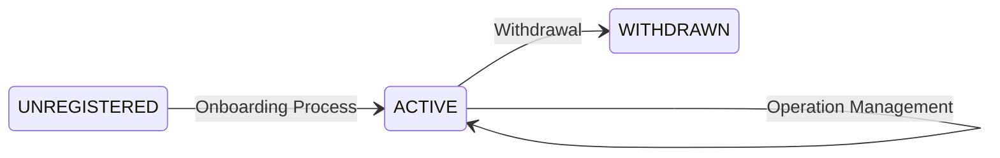
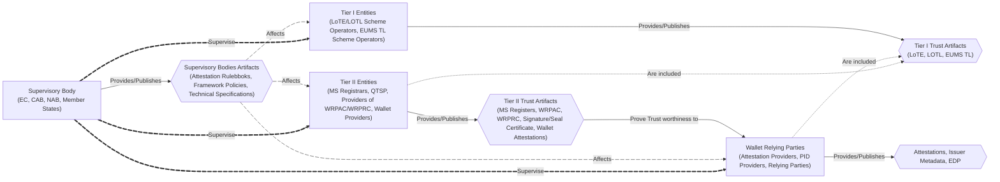
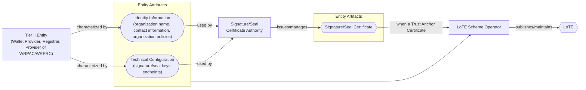
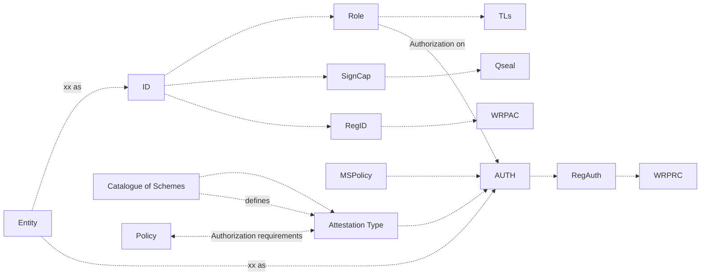
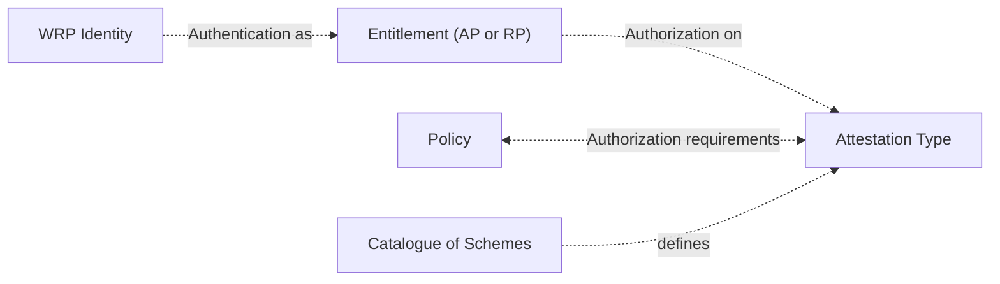
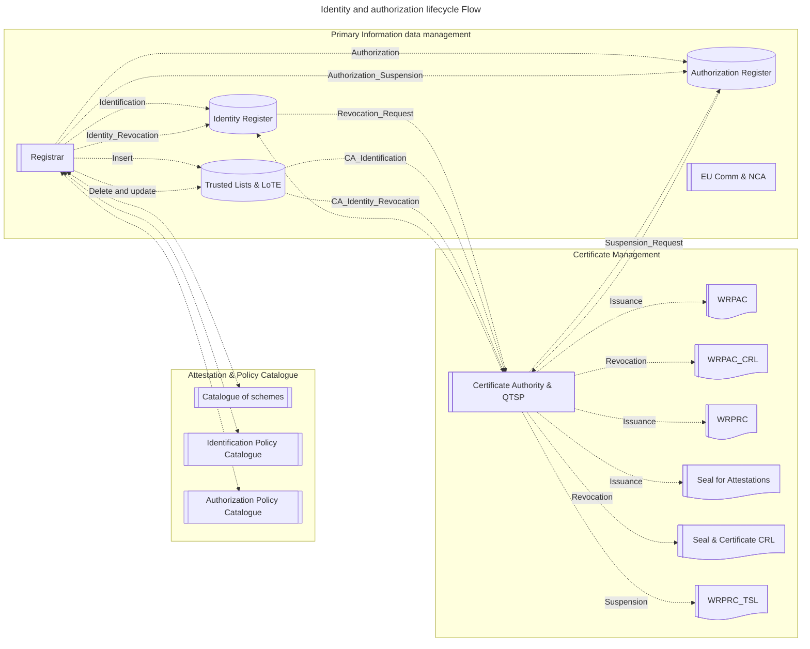
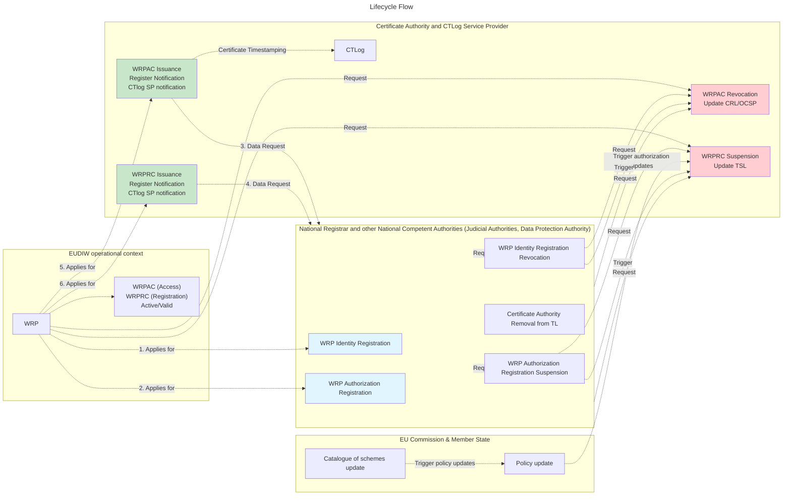


This section specifies the Trust Management Lifecycle for entities participating in the Trust Framework. It defines the operational states, state transitions, and the specific events that trigger these transitions for subscribed entities. 

The scope of this process encompasses the complete lifecycle of an entity, from initial onboarding and active operational maintenance to temporary or permanent withdrawal from the framework. The entities which are described here are exclusively those which publish Trust Artifacts: WRPs, Wallet Providers, Registrars and Providers of WRPAC/WRPRC. The lifecicle of other entities involved in the Trust Framework is not described. 

By detailing the operational effects on trust artifacts—such as the LoTE and WRP certificates (WRPAC/WRPRC)—this section details the management and lifecycle practices that undergo various entities subscribing to the Trust Framework.

## Trust Management High Level picture

Entities participating in the EUDIW Trust Framework SHALL be classified into one of the following mutually exclusive lifecycle states at any given time. The state dictates the entity's authorization level, operational capabilities, and how other participants SHALL interact with its cryptographic artifacts.

- `UNREGISTERED`: Indicates that an entity does not currently hold a valid subscription or registration within the EUDIW Trust Framework. This is the default baseline state. Entities in this state are outside the trust boundary and SHALL NOT participate in framework operations or federation protocols.
- `ACTIVE`: Indicates that an entity has successfully completed the onboarding process, verified its identity, and is fully registered within the EUDIW Trust Framework. An entity in the ACTIVE state is authorized to perform role-related operations, provide services, and issue or verify trust artifacts in accordance with framework policies.
  - A WRP is in `ACTIVE` state if the WRPAC is valid.
  - A Registrar, Provider of WRPAC or WRPRC, or QTSP is in `ACTIVE` state when it is listed in the relevant Trusted List with `ServiceStatus` set to `granted`.
- `WITHDRAWN`: Indicates the revocation of an entity's operational privileges, enacted either temporarily (e.g., due to a pending investigation or minor security incident) or permanently (e.g., due to voluntary offboarding, a severe security breach, or a critical compliance failure).
  - A WRP is in `WITHDRAWN` state if the WRPAC is `revoked`.
  - A Registrar, Provider of WRPAC or WRPRC, Wallet Provider, or QTSP is in `WITHDRAUN` state when it is listed in the relevant Trusted List with `ServiceStatus` set to `withdrawn`.
  - **Forward Operations**: Ecosystem participants SHALL reject new interactions or transactions initiated by a `WITHDRAWN` entity, and all cryptographic keys, active attestations, and operational capabilities associated with the entity SHALL be immediately revoked.
  - **Historical Operations**: Ecosystem participants MAY continue to validate and historical data, signatures, and attestations generated prior to the withdrawal timestamp, subject to local risk policies. These historical data are found in the corresponding Trusted List's `ServiceHistory` component.

Below the state diagram of the various actors.


The diagram below illustrates the Trust Management operational processes cause-effect dynamic on the various Ecosystem Artifacts and Ecosystem Entities. These cause-effect dynamic is definitely intertwined as different Entities can be affected by the trust management update or withdrawal operation directly or indirectly via other Entities and Trust Artifacts. The following effects are described:

- *Supervisory Bodies* continuously *supervise* other ecosystem entities and *publish* and *manage* ecosystem *Supervisory Bodies Artifacts* such as Attestation Rulebooks, Technical Specifications and define *Ecosystem Framework Policies*. These in turn affect dependent Tier I, II, and III Entities.
- *Tier I Entities* (LoTE/LOTL Scheme Operators, EUMS TL Scheme Operators) *publish* and *manage* *Tier I Trust Artifacts* (LoTE, LOTL, EUMS TL) which contain trust anchors for Tier II, and III Entities.
- *Tier II Entities* (MS Registrars, QTSP, Providers of WRPAC/WRPRC, Wallet Provider) *publish* and *manage* *Tier II Trust Artifacts* (MS Registers, WRPACs, WRPRCs, Signature/Seal Certificates, Wallet Attestations) define Attributes (Identity Information, Key material, and Authorization permissions?) of Tier III Entities.
- *Wallet Relying Parties* (Attestation Providers, PID Providers, Wallet Providers, Relying Parties) *publish* and *manage* *Issuance and Presentation Artifacts* such as Attestations, Issuer Metadata, EDP.



## Entity Lifecycle Operations

### Onboarding Process

The onboarding process governs the transition of a Tier II and Tier III Entity from the `UNREGISTERED` state to the `ACTIVE` state. Upon the successful completion of the onboarding process, the following Trust Artifacts and records SHALL be generated or updated:


- **Register Update**[WRPs]: The entity's authoritative record is committed to the Register database.
- **Trust Anchor Inclusion**[Tier II Entities and WRPs]: If applicable to the entity's role, its signature key trust chain Trust Anchor (TA) SHALL be included in the List of Trusted Entities (LoTE) or the European Union Member State Trusted List (EUMS TL).
- **WRPAC Issuance**[WRPs]: A WRPAC SHALL be issued to the entity.
- **WRPRC Issuance**[WRPs]:A WRPRC MAY be issued to the entity, depending on its role and authorization profile.

The specific operational effects and artifact configurations resulting from successful onboarding depend on the entity's classification within the Trust Framework ecosystem:

#### Onboarding Effects on Entities

PID Providers, Attestation Providers (AP), Relying Parties (RP), and Wallet Providers (WP) SHALL successfully complete all registration and notification processes as specified in Commission Implementing Regulations (EU) 2025/848 and (EU) 2024/2980 prior to onboarding completion.

Upon successful onboarding, a these entities SHALL:
- have its attestation key or wallet solution key trust anchors registered in the corresponding LoTE `TrustedEntityServices.ServiceInformation.ServiceDigitalIdentity` component;
- [ONLY for WRPs] be registered in the Register by the MS Registrar;
- [ONLY for WRPs] have a valid WRPAC from the Provider of WRPAC; 
- [OPTIONAL, ONLY for WRPs] have a valid WRPRC from the Provider of WRPAC; 
- [ONLY for AP and WP] have its signing or seal certificates; 
- finalize the deployment of its issuance, presentation toolkit or wallet solution depending on the role.

Registrars, Wallet Providers, and Providers of WRPACs/WRPRCs, SHALL onboard with the respective Member States and SHALL be explicitly listed in the appropriate LoTE with the respective trust anchor certificates upon successful onboarding. This listing formally enables trust checks on their core framework functions, such as responding to Register queries and issuing WRPACs and WRPRCs. This process is out of scope from this specification.

QTSPs SHALL onboard with the respective Member States and SHALL be explicitly listed in the appropriate EUMS TL with the respective trust anchor certificates upon successful onboarding. This listing formally enables trust checks on the QTSP-issued Qualified Electronic Seals and\or Qualified Signature certificates.

To assert the entity's `ACTIVE` status, the trust framework infrastructure SHALL apply the following technical configurations.
- **LoTE Status**[Tier II Entities]: the `TrustedEntityServices.ServiceInformation.ServiceStatus` component of the LoTE corresponding to the registered trust anchor key in the `TrustedEntityServices.ServiceInformation.ServiceDigitalIdentity` SHALL be set to the URI `http://uri.aptitude.org/TrstSvc/TrustedList/Svcstatus/granted`.
- **TL Status**:  the `TrustServiceProviderInformation.ServiceInformation.ServiceStatus` component of the LoTE corresponding to the registered trust anchor key in the `TrustServiceProviderInformation.ServiceInformation.ServiceDigitalIdentity` SHALL be set to the URI `http://uri.etsi.org/TrstSvc/TrustedList/Svcstatus/granted` ([ETSI TS 119 612] clause 5.5.4)
- **OCSP Status**: the validation status of the newly issued WRPAC in an Online Certificate Status Protocol (OCSP) response SHALL be returned as `good`.
- **CRL Status**: the serial number of the WRPAC SHALL NOT be present in the active CRL.
- **Token Status**: if a WRPRC is issued, its status value within the Status List Token SHALL be initialized to `0x00`.

### Active Operations and Maintenance

While in the `ACTIVE` state, entities MAY require updates to their registered profiles, cryptographic materials, or operational parameters. To ensure ecosystem stability and continuous non-repudiation, the Trust Framework categorizes these modifications into *organizational updates* (the management operations can be performed by the organization itself) or *governance updates* (the management operations requested by supervisory bodies), each with distinct operational effects. 

#### Organizational Updates

As their organizational or regulatory circumstances evolve, WRPs and Tier II SHALL update authentication, authorization and cryptographic information accordingly through standard Registrar channels as defined at MS level. Identity and cryptographic updates SHALL follow standard framework governance processes and SHOULD NOT affect the underlying technical operations of the trust framework. In particular, updates that directly affect federation protocol operations or cryptographic trust boundaries require strictly coordinated procedures. These technical updates SHALL be validated by the designated MS authority or EC designated body prior to deployment to maintain trust relationships and ecosystem operational integrity.

Permitted updates are divided into three classes: *Identity Information Updates*, *Technical Configuration Management* and *Policy and Authorization Updates*. These are further characterized as follows:
- *Identity Information Updates*:
  - Entity Changes: Modifications to the name, organizational policies updates, or changes in legal status.
  - Contact Information: Updates to official communication channels, address details, and designated responsible personnel.
- *Technical Configurations Updates*:
  - Cryptographic Management: entity cryptographic key rotations, regular certificate renewals.
  - Infrastructure Changes: Updates to endpoint URIs.
  - Compliance Updates: Migrations to new cryptographic suites, security standard updates.
- *Policies and Authorizations Updates*
  - Service Scope: Modifications to business logic, service offerings, or the specific types of Attestations the entity is authorized to issue and/or request.
  - Compliance Updates: policy alterations, and audit requirement fulfillment.
  - Policy Modifications: The addition or removal of functional service features, EDP.
  - Regulatory Status: Changes in active licenses, security certifications, or overall regulatory compliance status.

<!--
#### Governance Update

As policies, technical standards, and regulatory circumstances evolve at the European Union (EU) or Member State (MS) level, top-down regulatory changes MAY necessitate systemic modifications across the ecosystem. When such regulatory or policy shifts occur, the Trust Framework Supervisory Bodies SHALL formally notify the entity in charge of applying the new requirements (e.g., MS Registrars, TL Scheme Operators).

These governance updates encapsulate external modifications that an organization does not actively pursue or initiate. Instead, they represent ecosystem-wide evolutions that legally or operationally mandate the entity to modify its associated trust artifacts to maintain compliance. The execution of these updates SHALL strictly adhere to established framework governance processes and SHOULD NOT disrupt the underlying technical operations of the EUDIW Trust Framework.

Specific events triggering a governance update include:
- **Legal Publications**: The issuance of new regulations, implementing acts, or delegated acts in the Official Journal of the European Union (OJEU).
- **Policy Revisions**: Modifications to specific guidelines regarding Attestation presentation or issunce, attestation rulebooks published by the European Commission.
- **Standardization Updates**: The release of new, or deprecation of old, technical specifications governing ecosystem cryptographic protocols or federation mechanisms.
- **Infrastructure Evolutions**: Structural, schema, or governance updates applied to the List of the Trust Lists (LoTL), the List of Trusted Entities (LoTE), or the EU Member State Trusted List (EUMS TL).

Upon receiving notification of a governance update from the MS Registrar, affected entities SHALL initiate the necessary administrative or technical configuration workflows to align their trust artifacts with the new requirements. Depending on the nature of the update, this MAY require the entity to generate new cryptographic keys, update endpoint URIs, or request re-issuance of their WRPRC.
-->
#### Operational Effects of Updates

When there are organizational updates, the Trust Framework infrastructure SHALL propagate these changes to the relevant trust artifacts. The specific operational effects depend on the entity's role, and the artifacts it utilizes.

**WRP Updates**: For WRP updating their Identity Information, Technical Configurations, and/or Policies and Authorizations, the update event SHALL trigger the following procedures:
- **Identity Information and Policies and Authorizations Updates**:
  - **Registry Update**: the WRP SHALL update its information within the Register via the authenticated API.
  - **WRPAC Revocation**: The Provider of WRPAC SHALL revoke the entity's current WRPAC. Revocation SHALL be executed by appending the certificate's serial number to the active CRL or by returning a `revoked` status in the OCSP response.
  - **WRPAC Re-issuance**:The Provider of WRPAC SHALL issue a new WRPAC with the updated data.
  - **WRPRC Revocation**: The Provider of WRPRC SHALL revoke the entity's current WRPRC if present. Revocation SHALL be executed by setting the status value of the WRPRC within the corresponding Status List token to `0x01`.
  - **WRPRC Re-issuance**: The Provider of WRPRC SHALL issue a new WRPRC with the updated data if required.
  - **LoTE Update** [ONLY for PID and Pub-EAA Providers]: the PID/Pub-EAA Provider SHALL notify the LoTE Shcheme Operator with the update, the latter which will publish a new version of the LoTE using the pivoting mechanism with the PID/Pub-EAA Provider's updated information. The `TrustedEntityServices.ServiceInformation.ServiceDigitalIdentity` SHALL stay to the URI `http://uri.aptitude.org/TrstSvc/TrustedList/Svcstatus/granted`.
- **Technical Configurations Updates**:
  - **Signature/Seal Key update**: the WRP SHALL notify Signature/Seal Key updates to the Certificate Authority responsible for the issuance of these certificates.
    - **Signature/Seal Certificate Revocation**: The Certificate Authority SHALL revoke the entity's current Signature/Seal certificate.
    - **Signature/Seal Certificate Re-issuance**:The Certificate Authority SHALL issue a new Signature/Seal certificate with the updated key.
    - **LoTE Update** [ONLY for PID Providers TA certificates]: Upon obtaining a new Signature/Seal certificate with the updated key the PID Procider SHALL notify the LoTE Shcheme Operator which will publish a new version of the LoTE using the pivoting mechanism with the PID Provider's updated Signature/Seal certificate. The `TrustedEntityServices.ServiceInformation.ServiceDigitalIdentity` SHALL stay to the URI `http://uri.aptitude.org/TrstSvc/TrustedList/Svcstatus/granted`.
  - **AuthN Key update**: Tthe WRP SHALL notify WRPAC Key updates to the Provider of WRPAC.
    - **WRPAC Revocation**: The Provider of WRPAC SHALL revoke the entity's current WRPAC. Revocation SHALL be executed by appending the certificate's serial number to the active CRL or by returning a `revoked` status in the OCSP response.
    - **WRPAC Re-issuance**:The Provider of WRPAC SHALL issue a new WRPAC with the updated key.

The diagram below highlights these dependences between WRP attributes, artifacts in which these attributes are contained and entities that use this information to issue/publish additional Trust Artifacts:

```mremaid
flowchart LR
    wrp["WRP"]

    subgraph abst["WRP Attributes"]
        direction LR
        id(["Identity Information<br>(organization name, contact information, organization policies)"])
        tech(["Technical Configuration<br>(signature/seal keys,<br>AuthN keys, endpoints)"])
        authz(["Policy and Authorization<br>(entitlements, attestation provvision, attestation request, intermediary use, intended use)"])
    end

    subgraph arti["Entity Artifacts"]
        direction LR
        ac{{"WRPAC"}}
        csig{{"Signature/Seal Certificate"}}
        rc{{"WRPRC"}}
    end

    tl{{"LoTE"}}
    reg{{"Register"}}

    ca["Signature/Seal<br>Certificate Authority or QTSP"]
    acca["Provider of WRPAC"]
    rcca["Provider of WRPRC"]
    ent_reg["Registrar"]
    tlp["LoTE Scheme Operator"]

    ent_reg --"publishes/manages"--> reg
    wrp --"characterized by"--> id
    wrp --"characterized by"--> tech
    wrp --"characterized by"--> authz

    reg --"used by"--> acca
    tech --"used by"--> acca
    acca --"issues/manages"--> ac

    reg --"used by"--> ca
    tech --"used by"--> ca
    ca --"issues/manages"--> csig

    reg -."used by".-> rcca
    rcca --"issues/manages"--> rc

    id --"is contained in"--> reg
    authz --"is contained in"--> reg

    csig -."when a Trust Anchor Certificate".-> tlp
    abst --"when PID/Pub-EAA Provider"--> tlp
    tlp --"publishes/maintains"--> tl
```

The diagram below highlights these dependences between Tier II Entity attributes, artifacts in which these attributes are contained and entities that use this information to issue/publish additional Trust Artifacts:

**Tier II Entity Updates**: For Wallet Providers, Registrars, Providers of WRPAC/WRPRC updating their Identity Information and/or Technical Configurations, the update event SHALL trigger the following procedures:
- **Identity Information Updates**:
  - **LoTE Update**: the entity SHALL notify the LoTE Shcheme Operator with the update, the latter which will publish a new version of the LoTE using the pivoting mechanism with the PID/Pub-EAA Provider's updated information. 
- **Technical Configurations Updates**:
  - **Signature/Seal Key update**: the entity SHALL notify the Signature/Seal Key update to the Certificate Authority responsible for the issuance of these certificates.
    - **Signature/Seal Certificate Revocation**: The Certificate Authority SHALL revoke the entity's current Signature/Seal certificate.
    - **Signature/Seal Certificate Re-issuance**:The Certificate Authority SHALL issue a new Signature/Seal certificate with the updated key. 
    - **LoTE Update** [ONLY for TA certificates]: Upon obtaining a new Signature/Seal certificate with the updated key the entity SHALL notify the LoTE Shcheme Operator which will publish a new version of the LoTE using the pivoting mechanism with the entity's updated Signature/Seal certificate. The `TrustedEntityServices.ServiceInformation.ServiceDigitalIdentity` SHALL stay to the URI `http://uri.aptitude.org/TrstSvc/TrustedList/Svcstatus/granted`.
  - **Endpoints Update** [ONLY for Registrars]: When updating endpoints, the Registrar SHALL notify the LoTE Shcheme Operator which will publish a new version of the LoTE using the pivoting mechanism with the Registrar's updated endpoint.



### Withdrawal Process

The withdrawal process defines the rapid-response workflows and administrative procedures executed to transition an entity from the `ACTIVE` state to the `WITHDRAWN` state. This transition MAY be initiated voluntarily by the entity or forcefully enacted by the Supervisory Body.

#### Triggers for Withdrawal

Withdrawal events are categorized based on their initiation source:
- Voluntary Exit: Organizations MAY choose to exit the federation for standard business or operational reasons. Permitted reasons include:
  - Business Changes: Organizational restructuring, mergers, acquisitions, or complete service discontinuation.
  - Technical Migration: Transitioning to alternative technical solutions, infrastructure, or service providers outside the framework's scope.
  - Regulatory Changes: Shifts in the local regulatory environment or the entity's inability to meet ongoing compliance requirements.
- Supervisory Body Removal: The Supervisory Body MAY initiate a forced withdrawal due to severe compliance failures, fatal security breaches, or other critical ecosystem threats. Triggers for forced removal include:
- Compliance Violations: Demonstrated failure to maintain regulatory compliance or adherence to federation policies.
- Security Incidents: Suspected or confirmed compromise of the entity's security infrastructure, or a failure to maintain minimum security standards.
- Operational Failures: Persistent technical outages or failures that negatively affect overall ecosystem security or reliability.
- Policy Violations: Documented violations of federation operational policies, terms of service, or participation agreements.

#### Operational Effects of Withdrawal

When an entity is transitioned to the `WITHDRAWN` state, the Trust Framework infrastructure SHALL immediately execute a series of cryptographic and registry updates to halt the entity's operations while preserving historical evidence.  The specific operational effects depend on the entity's role, and the artifacts it utilizes.

**WRP Withdrawal or Removal**: For WRP updating their Identity Information, Technical Configurations, and/or Policies and Authorizations, the update event SHALL trigger the following procedures:
- **Registry Update**: the WRP or Supervisory body MAY remove the WRP information within the Register.
- **WRPAC Revocation**: The Provider of WRPAC SHALL revoke the entity's current WRPAC. Revocation SHALL be executed by appending the certificate's serial number to the active CRL or by returning a `revoked` status in the OCSP response.
- **WRPRC Revocation**: The Provider of WRPRC SHALL revoke the entity's current WRPRC if present. Revocation SHALL be executed by setting the status value of the WRPRC within the corresponding Status List token to `0x01`.
- **Signature/Seal Certificate Revocation**: The Certificate Authority SHALL revoke the entity's current Signature/Seal certificate.
- **LoTE Update** [ONLY for PID and Pub-EAA Providers]: the WRP or Supervisory body SHALL notify the LoTE Shcheme Operator which will publish a new version of the LoTE using the pivoting mechanism where the PID/Pub-EAA Provider's `TrustedEntityServices.ServiceInformation.ServiceStatus` component SHALL be set to the URI `http://uri.aptitude.org/TrstSvc/TrustedList/Svcstatus/withdrawn`. To maintain non-repudiation for past transactions, the superseded parameters SHALL be retained as historical records within the `TrustedEntityServices.ServiceHistory`.
**Tier II Entity Withdrawal or Removal**: For Wallet Providers, Registrars, Providers of WRPAC/WRPRC updating their Identity Information and/or Technical Configurations, the update event SHALL trigger the following procedures:
- **LoTE Update**: the Tier II Entity or Supervisory body SHALL notify the LoTE Shcheme Operator which will publish a new version of the LoTE using the pivoting mechanism where the entity's `TrustedEntityServices.ServiceInformation.ServiceStatus` component SHALL be set to the URI `http://uri.aptitude.org/TrstSvc/TrustedList/Svcstatus/withdrawn`. To maintain non-repudiation for past transactions, the superseded parameters SHALL be retained as historical records within the `TrustedEntityServices.ServiceHistory`.

!!! note
    
    When executing the revocation on the CRL, the `ReasonFlag` element SHALL accurately reflect the nature of the withdrawal:
    - If the withdrawal is a temporary suspension pending investigation, the `ReasonFlag` SHALL be set to `(6)`: `certificateHold`.
    - If the withdrawal is a permanent termination, the `ReasonFlag` SHALL be set to the appropriate code based on the circumstances, such as `(1)`: `keyCompromise`, `(2)`: `cACompromise`, or `(5)`: `cessationOfOperation`.

<!--
### Operational Effects Diagram

The diagram below illustrates the Trust Management operational effects on the Trusted List and WRP certificates. It is divided into Trust Anchor and End Entity effects as described into the previous sections.

The top side is governed by the Trusted List Provider (TLP).
- At the top is the public key ($pk_{TLP}$) of the Trusted List Provider. This key is used to sign the entire Trusted List.
- The Trusted List container holds a list of Trust Service Providers (TSPs) and their Trust Anchor public key ($pk_{TA}$) certificates.
- Primary Signature ($\sigma_{TLP}$): The transition from the root key to the Trusted List is secured by the $\sigma_{TLP}$ signature, ensuring the integrity of the list itself.
- Trust Anchor updates or removals occur exclusively on this side of the diagram.

The bottom side is governed by the entity which possesses the private key attested in the Trust Anchor public key ($pk_{TA}$) certificates. This entities issues and maintain WRPAC, WRPRC and certificates attesting signing capabilities. End entities updates or removal affect exclusively on this side of the diagram.

```mermaid
stateDiagram-v2
    %% state "pk_{TLP}" as pkTLP
    %% Left Side: Trust Provisioning
    state "Tier II Entity Context " as LeftContext {

        state "Trusted List" as TL_Box {
            direction LR
            tlp: Trusted List Provider Id
            tlpkey: pk_{tlp} 
            state "Service List" as TSP_Box {
                direction LR
                TSPs: Service Provider Id
                hinfo: Historical Information
                pkTA: pk_{TA} (TSP Trsut Anchor Key)
            }
        }
    }

    %% Right Side: WRP Updates
    state "WRP Context" as RightContext {
        state "QSeal/QSign Certificate" as Q_Cert {
            direction LR
            id1: Id (Entity identifiers)
            pkop: pk_{op} (Entity Signature/Seal Key)
        }

        state "WRPAC" as WRPAC_Cert {
            direction LR
            id2: Id (Entity identifiers)
            pkAuth: pk_{AuthN} (Entity AuthN Key)
        }

        state "WRPRC" as WRPRC_Cert {
            direction LR
            id: Id (Entity identifiers)
            authz: AuthZ (Entity entitlements, purpose, presentation query, issuance capabilities)
        }
    }

    %% Connection Arrows (The Trust Anchoring)
    TSP_Box -.-> Q_Cert : Signs
    TSP_Box -.-> WRPAC_Cert : Signs
    TSP_Box -.-> WRPRC_Cert : Signs

    %% Clarifying Notes
    note left of TSP_Box
        TA updates/removal context.
    end note

    note right of RightContext
        End-entity updates
        affect WRPAC/WRPRC/Qseal.
    end note
```
-->

## Trust Management Diagram and Event Table

The following matrix serves as the operational reference guide for the Trust Management process. It maps every critical lifecycle event to its responsible actors, the required communication protocols, and the resulting technical impacts on the ecosystem.

Table Legend:
- **Event**: The specific operational, organizational, or security trigger occurring within the ecosystem.
- **Sender**: The entity responsible for initiating the communication or action.
- **Receiver**: The actor or system component that receives the notification and executes the necessary updates.
- **Notification Protocol / Type**: The technical or indentity Information method used to transmit the event data (e.g., REST API, Out-of-Band email, automated sync).
- **Consequence (State Change)**: The resulting lifecycle state transition for the affected entity (i.e., from ACTIVE to ).
- **Impact on Trust Artifacts**: The exact technical modifications applied to the trust artifacts.

| Event | Sender | Receiver | Notification Protocol / Type | Consequence (State Change) | Impact on Trust Artifacts |
| :--- | :--- | :--- | :--- | :--- | :--- |
| Register Update (WRP service information) | WRP | MS Registrar | Register API | `ACTIVE` $\rightarrow$ `ACTIVE` | Register's entity update |
| Register Update (WRP Identity or AuthZ) | - | Provider of WRPAC and WRPRC | - | `ACTIVE` $\rightarrow$ `ACTIVE` | Revocation & Re-issuance of updated WRPRC and WRPAC |
| AuthN Key Rotation / Renewal | WRP | Provider of WRPAC | - | `ACTIVE` $\rightarrow$ `ACTIVE` | Revocation & Re-issuance of updated WRPAC |
| Signature/Seal Key Rotation / Renewal | PID Provider, WP, Registrar, or Provider of WRPAC/WRPRC | Signature/Seal Certificate Authority | - | `ACTIVE` $\rightarrow$ `ACTIVE` | Revocation & Re-issuance of Signature/Seal certificate |
| Signature/Seal Key Rotation / Renewal | Pub-EAA Provider | QTSP | - | `ACTIVE` $\rightarrow$ `ACTIVE` | Revocation/Re-issuance of Signature/Seal certificate |
| Service information update (PID Provider, Pub-EAA Provider, Registrar, WP, or Provider of WRPAC/WRPRC) | PID Provider, Pub-EAA Provider, Registrar, WP, or Provider of WRPAC/WRPRC | LoTE Scheme Operator | - | `ACTIVE` $\rightarrow$ `ACTIVE` | Updated LoTE published with pivoting mechanism, old service information placed in `HistoricalService` |
| Security Incident for WRP | Supervisory Body | Provider of WRPAC | Formal Notification | `ACTIVE` $\rightarrow$ `WITHDRAWN` | WRPAC Revocation |
| Security Incident (Registrar, WP, PID Provider, or Provider of WRPAC/WRPRC) | Supervisory Body | Signature/Seal Certificate Authority | Formal Notification | `ACTIVE` $\rightarrow$ `WITHDRAWN` | Signature/Seal Certificate Revocation |
| Security Incident (Registrar, WP, PID Provider, or Provider of WRPAC/WRPRC) | [for TA certificates only] Supervisory Body | LoTE Scheme Operator | Formal Notification | `ACTIVE` $\rightarrow$ `WITHDRAWN` | New LoTE published with pivoting mechanism, old signature/seal certificate placed in `HistoricalService` |
| Security Incident (Pub-EAA Provider) | Supervisory Body | QTSP | Formal Notification | `ACTIVE` $\rightarrow$ `WITHDRAWN` | Signature/Seal Certificate Revocation |
| WRP Voluntary Resignation | WRP | MS Registrar | Register API | `ACTIVE` $\rightarrow$ `WITHDRAWN` | Register's entity deletion |
| WRP deletion from Register | - | Provider of WRPAC and WRPRC | - | `ACTIVE` $\rightarrow$ `ACTIVE` | Revocation WRPRC and WRPAC |
| WRP deletion from Register | - | Signature/Seal Certificate Authority | - | `ACTIVE` $\rightarrow$ `ACTIVE` | Revocation of Signature/Seal Certificate |

<!--
**Table of Contents**

**Normative & technical references**  
CIR  
CIR-1 2025/848 CIR 2025/848 of 6 May 2025 laying down rules for the application of Regulation (EU) No 910/2014 of the European Parliament and of the Council as regards the registration of wallet-relying parties [https://eur-lex.europa.eu/eli/reg_impl/2025/848/oj/eng](https://eur-lex.europa.eu/eli/reg_impl/2025/848/oj/eng)  
CIR-2 2025/848 amendement draft [https://ec.europa.eu/info/law/better-regulation/have-your-say/initiatives/16113-European-Digital-Identity-Wallet-registration-of-wallet-relying-parties-update-_en](https://ec.europa.eu/info/law/better-regulation/have-your-say/initiatives/16113-European-Digital-Identity-Wallet-registration-of-wallet-relying-parties-update-_en)  
CIR-3 CIRn (EU) 2025/1569 of 29 July 2025 laying down rules for the application of Regulation (EU) No 910/2014 of the European Parliament and of the Council as regards qualified electronic attestations of attributes and electronic attestations of attributes provided by or on behalf of a public sector body responsible for an authentic source [https://eur-lex.europa.eu/eli/reg_impl/2025/1569/oj/eng] (https://eur-lex.europa.eu/eli/reg_impl/2025/1569/oj/eng)

ARF  
TS02 : Specification of systems enabling the notification and subsequent publication of Provider information [https://github.com/eu-digital-identity-wallet/eudi-doc-standards-and-technical-specifications/blob/main/docs/technical-specifications/ts2-notification-publication-provider-information.md](https://github.com/eu-digital-identity-wallet/eudi-doc-standards-and-technical-specifications/blob/main/docs/technical-specifications/ts2-notification-publication-provider-information.md)  
TS05 : Specification of common formats and API for Relying Party Registration information (https://github.com/eu-digital-identity-wallet/eudi-doc-standards-and-technical-specifications/blob/main/docs/technical-specifications/ts5-common-formats-and-api-for-rp-registration-information.md)  
TS06 : Common Set of Relying Party Information to be Registered (https://github.com/eu-digital-identity-wallet/eudi-doc-standards-and-technical-specifications/blob/main/docs/technical-specifications/ts6-common-set-of-rp-information-to-be-registered.md)  
TS08 : Specification of Common Interface for reporting of Relying Parties to Data Protection Authorities (https://github.com/eu-digital-identity-wallet/eudi-doc-standards-and-technical-specifications/blob/main/docs/technical-specifications/ts8-common-interface-for-reporting-of-wrp-to-dpa.md)  

ARF topics  
Topic X : Relying Party registration (https://github.com/eu-digital-identity-wallet/eudi-doc-architecture-and-reference-framework/discussions/431 and its refinement https://github.com/eu-digital-identity-wallet/eudi-doc-architecture-and-reference-framework/discussions/645)  

Tech standards  
ETSI-119-411 Policy and security requirements for Trust Service Providers issuing certificates; Part 8: Access Certificate Policy for EUDIW Wallet Relying Parties (https://www.etsi.org/deliver/etsi_ts/119400_119499/11941108/01.01.01_60/ts_11941108v010101p.pdf)  
ETSI-119-475 Relying party attributes supporting EUDIW Wallet user's authorization decisions (Certificate profile and policy requirements for access and registration certificates) (https://www.etsi.org/deliver/etsi_ts/119400_119499/119475/01.01.01_60/ts_119475v010101p.pdf)  
ALL-TS All technical specs referred by ARF are available at https://eudi.dev/latest/technical-specifications/  

## Scope And Introduction
The aim of this chapter is to describe the lifecycle of: 
1. WRP identity and attestation authorization information managed in the national registers (This represents the source of WPR information)
2. the related certificates that are used to claim that identity and related authorizations in EUDIW ecosystem: access (Wallet relying Party Access Certificate, aka WRPAC) and registration (Wallet relying Party Registration  Certificate, aka WRPRC) certificates (This represents the mean to transport WRP information across the ecosystem)
3. the signing seals and certificates that are used to sign attestations by all AP roles foreseen within the Trusted List for EUDIW ecosystem.

# Metamodello
xxx



# Trust management overview
Wallet Relying Parties (WRP) Identity shall be managed by national registrars, according to national trust framework policies. WRP shall apply for registration to the registrar.
National Competent Authorities for different sectors shall be able to interact with registrars to provide information from their registries to fulfill the registration process, aside with information provided directly by entities ([Topic-X] and its refinement , national registers under Annex I, point 12 of CIR (EU) 2025/848 [CIR-1, CIR-2]).
WRP authorization shall be managed by registrars too, according to their requests. The authorization is a link between WRP identifier - role assumed in eudiw ecosystem (AP or RP) and the attestation type identifiers. The goal of authorization process is to fulfill policy requirements by WRP related to attestation types.



If an attestation is subject to a policy, the attestation types shall be registered within the catalogue of schemes to be referred. This will ensure that only entitled providers will be allowed to issue specific credential in order to preserve level of assurance and data structure of the information according to sectorial competent authorities. And on the other side, only authorized relying parties shall be allowed to request these credentials.


The following graph aims to represent the interactions and dependencies between entities and lifecycle actions. 



All certificate states and revocation mechanisms are in  ETSI 119-411-8, that describes Access Certificate Policy for EUDIW Wallet Relying Parties

# Catalogue of schemes and policy management
The credential catalogue and related policies are not in scope of this chapter and are managed centrally by EU Commission. This topic is not defined yet [ref topic X (https://github.com/eu-digital-identity-wallet/eudi-doc-architecture-and-reference-framework/discussions/431)]
ETSI TS 319.482 will define catalogue of schemes implementation.
> Note: So changes in the credential catalogue and in related policy repositories will affect potentially both authorizations and consequently the validity of registration certificates.

# WRP Registration lifecycle 
## Registration (Onboarding wallet relying parties)
Each Member State will delegate a Registrar to manage the national register: it's a repository of identities and authorizations for WRPs that will handle attestations and attributes (in the issuance or presentation request phases).
The process and related attributes that must be collected are described in [CIR-1 CIR-2], and the process will be specific for member state and it's assumed to be equivalent. 
The first step is WRP's identification: the onboarding process must ensure adequate controls on the entity identity claims. A unique identifier is assigned to the entity (WRP identifier) and related attributes, such as credential offer endpoints, privacy policy statement URL, etc.
The second step is WRP's authorization to handle attestations, autonomously or delegating an intermediary: both for the attestation issuance and presentation request, policy requirements related to attestation type must be satisfied. 

The register information data model is described in [TS02] and api for registration and inquiry in the register are defined in [TS05] , data to be registered in [TS06]. 
This process and register maintenance shall be managed by national registrar.
National Registrar may integrate existing identity repository for specific sectors, according to NCA sector policies. 
Registrar may include the engagement of the CA in the registration process, in order to facilitate the onboarding process, according to WRP preferences.

Specific entities, like 
1. PID providers, 
2. wallet providers,
3. Pub EAA providers
4. QEAA providers
are enlisted in trusted lists and list of trusted entities.

## Registration update and revocation
Both types of information repositories will be subject of lifecycle management.
Each Member State Registrar, as National Competent Authority, shall define a process to manage information update or registration revocation on registers: 
1. in case of cessation of business that could be notified by the Business Register 
2. in case of suspension by the judicial authority 
3. or by DPA Data Protection Authorities (that will publish specific APIs to collect abuses [TS 08]).

EU Commission and NCAs will have authority on information management on trusted lists.

## Further optional and asyncronous information collection
Registrar may collect issued WRPAC and WRPRC references from CAs. This may be done in order to be able to trigger their revocation towards certificate authorities in case of license withdrawal.
Registrar may publish the authorization data bound to WRPidentifier in case WRPRCs are not transmitted to the wallet, in order to fulfill policy requirements.

# Access (WRPAC) and registration (WRPRC) certificate lifecycle

## Introduction
In order to make WRP operational in application protocols, a certificate authority shall provide the authentication keys, and so it shall issue a WRPAC and shall sign WRPRCs (Regulatory requirements are described in Annex E, data model in Annex B of [ETSI-119-475] referred by Commission Implementing Regulation 2024/2982). 
The WRPAC represents the identity key of a WRP. Access Certificates are used to sign the OID4VP request and also for signing the OID4VCI issuer metadata.  
The WRPRC is a JWT used for authorization both in attestation issuance and request steps, whether the attestation is somehow referred by policies. 
WRPRC is optional: 
1. it depends on attestation policy requirements
2. whether required by attestation policy requirements and not sent by WRP during the authentication phase, the same information can also be retrieved from the Registrar's online service. 

## WRPAC and WRPRC Issuance
WRPAC and WRPRC issuance requires a mutual authentication: the certificate authority must identify the applicant entity, and the entity must be able to check if the CA is present with this role in the trusted lists. 
The CA accesses the national register using REST apis and provides the certificates according to certificate profile and policy requirements, described in ETSI 119.475 and referred in Annex V of CIR amendment draft.
As soon a WRPAC and WRPRC have been issued:
1. the CA should notify the Registrar, providing their references. Registrar should record all issued certificates in order to be able to ask for revocation if required. 
2. the CA shall trace certificate issuance on 2 CTlog service providers (using API provided by ctlog managers) according to Certificate transparency policies. CTlog service will keep all timestamps of certificate issuance to enable third party verification that the certificate has been issued by an authorized Certificate Authority at that time that's declared. 
The WRP has to make available its WRPRC and WRPAC certificates online through its website.
## Revocation
WRPAC and WRPRC revocation could be triggered by  identity and authorization changes or revocation, or by indipendent processes.
1. Issuance or revocation can be triggered by Registrar according to information changed in the register 
2. issuance can be triggered by a WRP request directly to a CA
3. revocation can be requested by WRP or other national or EU authorities to the CA.
As soon as the CA revokes a certificate, shall update and publish the information in a certificate revocation list (CRL) or a Token Supension List (TSL).

Specific roles will be managed by specific authorities using trusted lists as persistence repository and way to disseminate information. API endpoint could be provided to publish a subset of TL information.

# Trusted List Issuer Certificates
All seal and signing certificates for attestation issuer will be provided by QTSPs, enlisted in Trusted Lists, that will be subject for their authorization lifecycle by NCAs and CABs.

# Annex I - Banking usecase
TBD  
-->