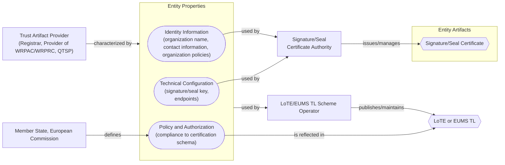
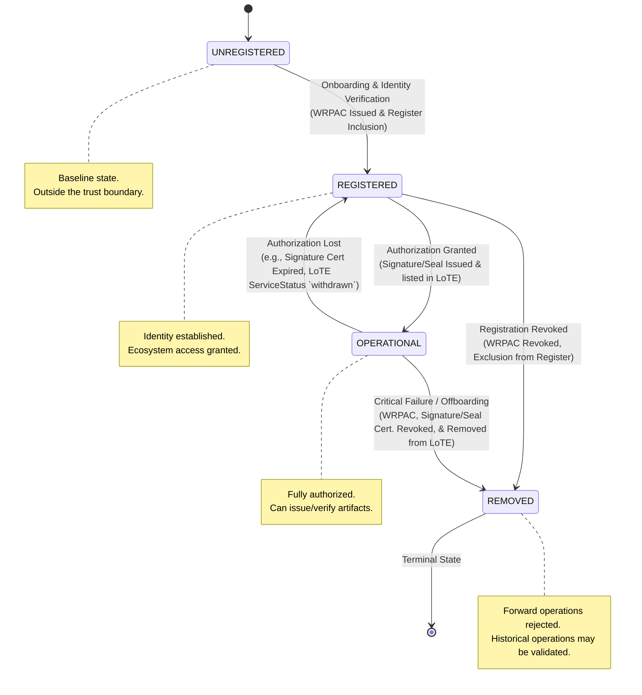
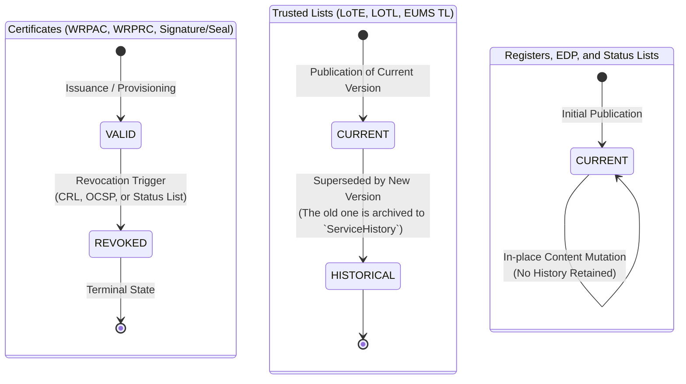


This section describes the high level trust management process within the APTITUDE Trust Framework. Its scope is describing the lifecycle of Entities and Trust Artifacts related to WRP and Wallet Providers within the ecosystem, and the relationships between them. Trust Artifacts are the transport mechanism of the Properties (specific Entity attributes categorized in Identity Information, Technical Information, and Policy and Authorization Information) which characterize the entities within the ecosystem, and they are issued and managed by other entities within the ecosystem (Trusted Lists and Trust Artifacts Providers).

In particular, this section is structured as follows:

- in ([Ecosystem Participants](#ecosystem-participants)) are described the various entities within the ecosystem, their roles and relationships.
- in ([Entity Properties Schema](#entity-properties-schema)) are described the various Properties of WRP and Wallet Providers, the Trust Artifacts in which these Properties are contained, and the relationships between them.
- in ([Abstract State Machine](#abstract-state-machine)) are described the lifecycle *State* (an abstraction at the governance level that captures the current operational status and trustworthiness within the ecosystem) of WRPs, Wallet Providers, Trust Artifacts, Trusted Lists, their definitions, and the effects that these states have on the entities' operational capabilities and trustworthiness.
- in ([Entity Lifecycle Operations](#entity-lifecycle-operations)) are described the operational procedures triggered by changes in the Properties of WRP and Wallet Providers, and the resulting effects on their lifecycle states and trustworthiness within the ecosystem.

When a WRP's, Wallet Provider's, or Trust Artifacts Properties change (e.g., key rotation), the Trust Artifact Providers or Trusted Lists Providers have to update, revoke and issue or re-sign the corresponding Trust Artifacts or Trusted Lists, without necessarily altering the underlying Abstract State of the WRP. These operational procedures are defined in [Entity Lifecycle Operations](#entity-lifecycle-operations).

#### Ecosystem Participants

The entities in the ecosystem are divided in different groups depending on their role and the artifact that they issue.

- *Supervisory Bodies* continuously *supervise* other ecosystem entities. Supervision affect the states of dependent Entities.
- *Member States and the European Commission* *define* and *manage* Attestation Rulebooks, and *define* *Ecosystem Policies and Certification Schemas*. These affect dependent Entities during onboarding and their lifecycle.
- *Trusted Lists Providers* (LoTE/LOTL Scheme Operators, EUMS TL Scheme Operators) *publish* and *manage* *Trusted Lists* (LoTE, LOTL, EUMS TL) that contain Trust Anchors and Properties of other Entities. Inclusion in these artifacts is, by itself, also a statement about the role and authorization of the included entities within the ecosystem.
- *Trust Artifacts Providers* (MS Registrars, QTSPs, Providers of WRPAC/WRPRC) *publish* and *manage* *Trust Artifacts* (MS Registers, WRPACs, WRPRCs, Signature/Seal Certificates) which transports Properties (Identity Information, Technical configurations, and Authorization Information) of End-Entities.
- *End-Entities* (Attestation Providers, PID Providers, Relying Parties, Wallet Provider) rely on Trusted Lists and Trust Artifacts for assessing their trustworthiness to other participants within the ecosystems. In addition, they *issue*, *receive* or *manage* User Attestations or Wallet Attestations to and from Wallet Units during issuance, presentation and WP-specific management flows respectively.

The diagram below highlights the relationships between the aforementioned entities and artifacts, and the dependences between them in terms of supervision, publication, and the effects that changes in the artifacts (represented as diamond shaped objects in the diagram) have on the entities (represented as rectangular objects in the diagram). The arrows indicate the direction of supervision, publication, and effect propagation.

```mermaid
flowchart LR
    %%Entities and Artifacts
    ms["Member States and European Commission"]
    sup["Supervisory Body<br>(EC, CAB, NAB, Member States)"]
    sup_art{{"Ecosystem Artifacts<br>(Attestation Rulebboks, Ecosystem Policies, Certification Schemas)"}}
    init_ent["Trusted Lists Providers<br>(LoTE/LOTL Scheme Operators, EUMS TL Scheme Operators)"]
    init_ent_art{{"Trusted Lists<br>(LoTE, LOTL, EUMS TL)"}}
    mid_ent["Trust Artifacts Providers<br>(MS Registrars, QTSP, Providers of WRPAC/WRPRC)"]
    mid_ent_art{{"Trust Artifacts<br>(MS Registers, WRPAC, WRPRC, Signature/Seal Certificate)"}}
    end_ent["End-Entities<br>(Attestation Providers, PID Providers, Wallet Providers, Relying Parties, Relying Party Intermediaries)"]
    end_ent_art{{"User Attestations, Wallet Attestations"}}
    %%end_ent_2["End-Entities <br>()"]

    %%Modification propagation arrows
    sup e1@=="Supervise"==> init_ent
    sup e2@=="Supervise"==> mid_ent
    sup e3@=="Supervise"==> end_ent
    %%sup e8@=="Supervise"==> end_ent_2
    ms --"Provides/Publishes"--> sup_art
    sup_art e4@--"Affects"--> init_ent
    sup_art e5@--"Affects"--> mid_ent
    sup_art e6@--"Affects"--> end_ent
    %%sup_art e7@--"Affects"--> end_ent_2
    mid_ent -."Are included".-> init_ent_art
    end_ent -."Are included".-> init_ent_art
    mid_ent_art --"to"----> end_ent
    init_ent --"Publishes"--> init_ent_art
    %%init_ent --"Impacts"--> mid_ent
    mid_ent --"Issue"--> mid_ent_art
    %%mid_ent --"Impacts"--> end_ent
    end_ent --"Issue"--> end_ent_art --"to"--> wi["Wallet Units"]
    wi["Wallet Units"] --"Present Attestations"--> end_ent
    
    
    e1@{ animate: true }
    e2@{ animation: fast }
    e3@{ animation: fast }
    %%e8@{ animation: fast }
    %%Artifacts inclusion arrows
    %%mid_ent e4@-. Referenced in.-> init_ent_art
    %%end_ent e5@-. Referenced in.-> init_ent_art
    %%end_ent e6@-. Referenced in.-> mid_ent_art
    e4@{ animation: fast }
    e5@{ animation: fast }
    e6@{ animation: fast }
    %%e7@{ animation: fast }
```

#### Entity Properties Schema

Trust Artifacts Providers and End-Entities are characterized by three main classes of *Properties*:

- **Identity Information**: This includes the organization's name, contact information, and organizational policies.
- **Technical Configuration**: This includes the cryptographic materials (signature/seal keys, authentication keys) and technical endpoints necessary for ecosystem interactions.
- **Policy and Authorization Information**: This includes the entity's entitlements, attestation provision capabilities, attestation request capabilities, intermediary use permissions, intended use cases, EDPs, and compliance with certification schemas.

##### Properties Schema and associated Trust Artifacts

In the tables below are found the relationship between the aforementioned Properties and the Trust Artifacts in which they are contained for specific entity types: Relying Party (Intermediary), PID Providers, Attestation Providers, and Wallet Providers. Since different entity types have their information stored in different artifacts, the tables below are divided by specific types of entities.

All WRP (Relying Parties, Intermediaries, PID Providers, and Attestation Providers) properties are embedded in various Trust Artifacts as follows:

| Entity Type | Properties Class | Entity Properties | Trust Artifacts |
| :--- | :--- | :--- | :--- |
| WRP | Identity Information | Organization name | WRPAC, WRPRC, Register |
| WRP | Identity Information | Contact information | WRPAC, Register |
| WRP | Identity Information | Organizational Policy | WRPAC, WRPRC, Register |
| WRP | Technical Configuration | Authentication key | WRPAC |
| WRP | Authorization Information | Entitlements | WRPRC, Register |
| WRP | Authorization Information | Intermediary use permissions | WRPRC, Register |
| WRP | Authorization Information | Service descriptions | WRPRC, Register |
| WRP | Authorization Information | Supervision information | WRPRC, Register |

All PID Providers and Attestation Providers have additional specific property requirements embedded in various Trust Artifacts as follows:

| Entity Type | Properties Class | Entity Properties | Trust Artifacts |
| :--- | :--- | :--- | :--- |
| PID Provider or Attestation Provider | Technical Configuration | Signature/Seal key | Signature/Seal Certificate |
| PID Provider or Attestation Provider | Authorization Information | RP Permissions | EDP |
| PID Provider or Attestation Provider | Authorization Information | Attestation provision capabilities | WRPRC, Register |

All Relying Parties and Intermediaries have additional specific property requirements embedded in various Trust Artifacts as follows:

| Entity Type | Properties Class | Entity Properties | Trust Artifacts |
| :--- | :--- | :--- | :--- |
| RP or RP Intermediaries | Authorization Information | Attestation request capabilities | WRPRC, Register |

All Wallet Providers, PID Providers, and Pub-EAA Providers, being referenced in the LoTE as entities authorized to provide services to the ecosystem, have additional specific properties embedded in the LoTE as follows:

| Entity Type | Properties Class | Entity Properties | Trust Artifacts |
| :--- | :--- | :--- | :--- |
| WP, PID and Pub-EAA Provider | Identity Information | Organization name | LoTE |
| WP, PID and Pub-EAA Provider | Identity Information | Contact information | LoTE |
| WP, PID and Pub-EAA Provider | Identity Information | Organizational Policy | LoTE |
| WP, PID and Pub-EAA Provider | Authorization Information | Service descriptions | LoTE |
| WP, PID and Pub-EAA Provider | Authorization Information | Service endpoints | LoTE |
| WP, PID and Pub-EAA Provider | Authorization Information | Service status | LoTE |
| WP, PID and Pub-EAA Provider | Authorization Information | Compliance to certification schema | LoTE (implicit via inclusion) |
| WP, PID and Pub-EAA Provider | Technical Configuration | Signature/Seal trust anchors | LoTE |

!!! note

    The inclusion of Wallet Providers and PID/Pub-EAA Providers in the LoTE is an implicit assertion of their role and authorization within the ecosystem. In particular, their inclusion is a result of the succesful completion of the registration and notification procedures as defined in CIR 2025/848 (registration of WRP) and CIR 2024/2980 (notifications of WRP and WP).

The diagram below highlights the dependences between WRP's and Wallet Provider's Properties, the Trusted Lists (diamond shaped boxes) in which these Properties (round shaped boxes) are contained and the Entities (square boxes) that use the Properties' information to issue additional Trust Artifacts. For both WRPs and WPs, the inclusion in the Trusted Lists attests the implicit, ongoing, compliance to the polices set up by the EC and the MS during onboarding for the respective roles.

In the tables below are found the relationship between the aforementioned Properties and the Trust Artifacts in which they are contained for specific entity types: Registrars, Providers of WRPAC/WRPRC, and QTSP. Since different entity types have their information stored in different artifacts, the tables below are divided by specific types of entities.

The following table describes the relationship between the Properties of Registrars and Providers of WRPAC/WRPRC and the Trusted Lists in which these Properties are contained.

| Entity Type | Properties Class | Entity Properties | Trust Artifacts |
| :--- | :--- | :--- | :--- |
| Registrar, Provider of WRPAC/WRPRC | Identity Information | Organization name | LoTE |
| Registrar, Provider of WRPAC/WRPRC | Identity Information | Contact information | LoTE |
| Registrar, Provider of WRPAC/WRPRC | Identity Information | Organizational Policy | LoTE |
| Registrar, Provider of WRPAC/WRPRC | Authorization Information | Service descriptions | LoTE |
| Registrar, Provider of WRPAC/WRPRC | Authorization Information | Service endpoints | LoTE |
| Registrar, Provider of WRPAC/WRPRC | Authorization Information | Service status | LoTE |
| Registrar, Provider of WRPAC/WRPRC | Technical Configuration | Signature/Seal key | Signature/Seal Certificate |
| Registrar, Provider of WRPAC/WRPRC | Technical Configuration | Signature/Seal Trust Anchor | LoTE |

The following table describes the relationship between the Properties of QTSPs and the Trusted Lists in which these Properties are contained.

| Entity Type | Properties Class | Entity Properties | Trust Artifacts |
| :--- | :--- | :--- | :--- |
| QTSP | Identity Information | Organization name | EUMS TL |
| QTSP | Identity Information | Contact information | EUMS TL |
| QTSP | Identity Information | Organizational Policy | EUMS TL |
| QTSP | Authorization Information | Service descriptions | EUMS TL |
| QTSP | Authorization Information | Service endpoints | EUMS TL |
| QTSP | Authorization Information | Service status | EUMS TL |
| QTSP | Technical Configuration | Signature/Seal key | EUMS TL |

The diagram below highlights these dependences between Trust Artifact Provider Properties, artifacts in which these Properties are contained and entities that use this information to issue/publish Trust Artifacts:

#### Abstract State Machine

This section describes the lifecycle *State* of WRPs and Wallet Providers and of Trust Artifacts and Trusted Lists.

##### Entity Lifecycle State Machine

State Machines are described only for WRPs, Wallet Providers, and Trust Artifacts Providers. Their status is determined through Trust Artifacts or Trusted Lists entries. WRPs, Wallet Providers, and Trust Artifacts Providers participating in the APTITUDE Trust Framework are classified into one of the following mutually exclusive lifecycle States at any given time. The State dictates the entity's authorization level, operational capabilities, and how other participants SHALL interact with its cryptographic artifacts.

- `UNREGISTERED`: Indicates that an entity does not currently hold a valid subscription or registration within the APTITUDE Trust Framework. This is the default baseline state. Entities in this state are outside the trust boundary and SHALL NOT participate in framework operations or federation protocols.
- `REGISTERED`: Indicates that an entity has successfully completed the onboarding process, verified its identity, and has established ecosystem access.
    - A WRP is in `REGISTERED` state if the Registrar has inserted its Identity information within the Register, and possesses the WRPAC binding this Identity information to a key controlled by the entity.
    - The Wallet Provider is in `REGISTERED` when it has completed the necessary certification and successfully completed the onboarding process.
- `OPERATIONAL`: Indicates that an entity has successfully completed onboarding, and, crucially, has been authorized to perform role-related operations, provide services, and issue or verify artifacts in accordance with framework policies.
    - A RP or RP Intermediary is in `OPERATIONAL` state if it is `REGISTERED`, the Registrar has inserted its Authorization information within the Register, and (optionally) it possesses a valid WRPRC.
    - A (Q)EAA Provider is in `OPERATIONAL` state if it is `REGISTERED`, the Registrar has inserted its Authorization information within the Register, (optionally) it possesses a valid WRPRC and possesses a valid (qualified) Signature/Seal certificate to sign the attestations.
    - A PID Provider, Pub-EAA Provider is in `OPERATIONAL` state if it is `REGISTERED`, the Registrar has inserted its Authorization information within the Register, (optionally) it possesses a valid WRPRC, it possesses valid Signature/Seal certificate, and is listed in the relevant LoTE.
    - A Wallet Provider or Trust Artifacts Provider is in the `OPERATIONAL` state if it is `REGISTERED`, listed in the relevant Trusted List, and possesses valid Signature/Seal certificate.
- `REMOVED`: Indicates the revocation of an entity's `REGISTERED` status due to voluntary offboarding, a severe security breach, or a critical compliance failure.
    - A WRP is in `REMOVED` state if the WRPAC is `revoked`.
    - A Wallet Provider or Trust Artifacts Provider is in `REMOVED` state when it is not listed in the latest version of the relevant LoTE or EUMS TL.
    - **Forward Operations**: Ecosystem participants SHALL reject new interactions or transactions initiated by a `REMOVED` entity, and all cryptographic keys, active attestations, and operational capabilities associated with the entity SHALL be immediately revoked.
    - **Historical Operations**: Ecosystem participants MAY continue to validate historical data, signatures, and attestations generated prior to the Removal timestamp, subject to local risk policies. These historical data are found in the corresponding Trusted List's `ServiceHistory` component.

Below the state diagram of the various actors.

The table below summarizes the lifecycle states, their definitions, the entity to which it refers, the Trust Artifacts that assert the entity's state, and the technical mean that conveys the validity of the Trust Artifacts.

| State | Definition | Applicable Entities | Asserting Trust Artifacts | Technical Mean |
| :--- | :--- | :--- | :--- | :--- |
| `UNREGISTERED` | Indicates that an entity does not currently hold a valid subscription or registration within the APTITUDE Trust Framework. | All potential ecosystem participants prior to onboarding. | N/A | N/A |
| `REGISTERED` | Indicates that an entity has successfully completed onboarding, verified its identity, and established baseline ecosystem network access. | WRPs (RPs, PID, and EAA Providers) and Wallet Providers. | WRP: Valid WRPAC and identity inclusion in the Register.  Wallet Provider: Finalized certification and onboarding records. | WRP: OCSP response with good status (or absence in CRL) for the WRPAC; active status in the Register. |
| `OPERATIONAL` | Indicates that an entity is explicitly authorized to perform role-related operations, provide services, and issue or verify artifacts. | `REGISTERED` WRPs and Wallet Providers. | **RP (Intermediary)**: Authorization in Register, WRPRC (optional).  **(Q)EAA Provider**: Valid Signature/Seal certificate, Authorization in Register, WRPRC (optional).  **PID / Pub-EAA**: Valid Signature/Seal certificate, entry in the relevant LoTE, Authorization in Register, WRPRC (optional).  **Wallet Provider**: Valid Signature/Seal certificate, entry in the relevant Trusted List. | **Certificates**: OCSP response with `good` status or absence in CRL for Signature/Seal certificates and WRPACs; SLT with status set to `0x00`.  **LoTE**: Entry matching the entity.  **Register**: Validated role-specific authorization schema Properties. |
| `REMOVED` | Indicates the revocation of an entity's `REGISTERED` status due to voluntary offboarding, a severe security breach, or a critical compliance failure. | All deactivated, offboarded, or permanently banned framework participants. | **WRP**: Revoked WRPAC, removal from LoTE (if applicable) and Register entry.  **Wallet Provider**: Removal from the current active LoTE. | OCSP response with `revoked` status or presence in a CRL for the WRPAC.  Complete absence from the active Register or Trusted List (if applicable); resolution of historical status via the `ServiceHistory` component. |

Depending on the circumstances, an entity in the `REMOVED` state MAY have its Signature/Seal certificates revoked, when this is not the case, all artifacts the entity has issued SHALL be considered valid for historical operations. Further details on this are found in the [Operational Effects of Removal](#operational-effects-of-Removal) section.

##### Trust Artifacts and Trusted Lists Lifecycle State Machine

State Machines for Trust Artifacts and Trusted Lists are described below:

- For WRPAC, WRPRC and Signature/Seal Certificates, the lifecycle states are `VALID` and `REVOKED`. The transition from `VALID` to `REVOKED` is triggered by the revocation of the artifact, which can be initiated by the corresponding Trust Artifact Provider due to various reasons such as key compromise, organizational changes, or non-compliance with framework policies. Once an artifact is in the `REVOKED` state, it SHALL NOT be trusted for any operational use within the ecosystem, and any entity relying on it MUST reject it for authentication, authorization, or any other trust-related operations.
    - A WRPAC in `VALID` state SHALL NOT be present in the designated CRL and/or SHALL return a `good` status in the OCSP response. A WRPAC in `REVOKED` state SHALL be present in the designated CRL and/or SHALL return a `revoked` status in the OCSP response.
    - A WRPRC in `VALID` state SHALL return a `0x00` status in the corresponding Status List token. A WRPRC in `REVOKED` state SHALL have status value `0x01` within the corresponding Status List token.
- For Trusted Lists (LoTE, LOTL, EUMS TL), the lifecycle states are `CURRENT` and `HISTORICAL`. The transition from `CURRENT` to `HISTORICAL` is triggered by the publication of a new version of the Trusted List that replaces the previous version. Once a Trusted List is in the `HISTORICAL` state, it SHALL NOT be used for any operational use within the ecosystem, the only exception being the validation of Trusted List trustworthiness via the pivoting mechanism (see [Trust Anchor Validation](#trust-anchor-validation.md)) and the validation of historical operations via the `ServiceHistory` component of the Trusted Lists.
- For Registers, EDP, Status Lists, the lifecycle state is only `CURRENT`, since any change in these artifacts is reflected as an update of the artifact itself, and the previous version is not retained as a historical record.

The diagram below highlights the state machine of the aforementioned artifacts:

The table below summarizes the lifecycle states, their definitions, the applicable Trust Artifacts and Trusted Lists, and the technical mean that conveys the validity of these artifacts. The three tables are divided by artifact type since they have different lifecycle states and transition triggers, these are respectively: `VALID` and `REVOKED` for WRPAC, WRPRC and Signature/Seal Certificates, `CURRENT` and `HISTORICAL` for Trusted Lists, and only `CURRENT` for Registers, EDP and Status Lists.

| State | Definition | Applicable Artifacts | Technical Mean |
| :--- | :--- | :--- | :--- |
| `VALID` | Indicates that a Trust Artifact is currently valid and can be trusted for operational use within the ecosystem. | WRPAC, WRPRC, Signature/Seal Certificates. | OCSP response with `good` status or absence in CRL for WRPACs and Signature/Seal certificates; SLT with status set to `0x00` for WRPRCs. |
| `REVOKED` | Indicates that a Trust Artifact has been revoked and SHALL NOT be trusted for any operational use within the ecosystem. | WRPAC, WRPRC, Signature/Seal Certificates. | OCSP response with `revoked` status or presence in CRL for WRPACs and Signature/Seal certificates; SLT with status set to `0x01` for WRPRCs. |

| State | Definition | Applicable Artifacts | Technical Mean |
| :--- | :--- | :--- | :--- |
| `CURRENT` | Indicates that the current Trusted List is the newest version, previous versions are no longer valid for operational use within the ecosystem. | LoTE, LOTL, EUMS TL, Registers, EDP, Status Lists. | Publication of a new version of the Trusted List; resolution of historical status via the `ServiceHistory` component for LoTE, LOTL, and EUMS TL. |
| `HISTORICAL` | Indicates that a Trusted List is a historical record and SHALL NOT be used for any operational use within the ecosystem, except for validating historical operations and trustworthiness via the pivoting mechanism. | LoTE, LOTL, EUMS TL. | Resolution of historical status via the `ServiceHistory` component; validation of trustworthiness via the pivoting mechanism. |

| State | Definition | Applicable Artifacts | Technical Mean |
| :--- | :--- | :--- | :--- |
| `CURRENT` | Indicates that the current version of a Register, EDP, or Status List has the newest information, previous versions are no longer valid, SHOULD NOT be published and SHALL NOT be used for operational use within the ecosystem. | Registers, EDP, Status Lists. | Publication of an updated version of the artifact. |

#### Entity Lifecycle Operations

Below are detailed the operational procedures, which affects the Properties of Trust Artifact Provider and End-Entities and the resulting effects on their State.

##### Onboarding Process

The onboarding process governs the transition of an End-Entity (WRP or Wallet Provider) from the `UNREGISTERED` state to the `REGISTERED` state. During the onboarding process, it is up to the Entities running the process and necessary validations to collect the onboardee's Properties and (depending on its role) issue the corresponding Trust Artifacts. Further details are found in [Onboarding Process](#onboarding-process.md).

##### Active Operations and Maintenance

While in the `OPERATIONAL` state, entities MAY require *organizational updates* to their registered Properties, including their entity profiles, cryptographic materials, or operational parameters. Below we describe these updates and their operational effects on the trust artifacts and the entity's state.

###### Organizational Updates

As their organizational or regulatory circumstances evolve, WRPs and Wallet Providers SHALL update identity, authorization information and technical configurations accordingly through the standard channels as defined at Member State or European Commission level. Identity and cryptographic updates SHALL follow standard framework governance processes and SHOULD NOT affect the underlying technical operations of the Trust Framework. In particular, updates that directly affect federation protocol operations or cryptographic trust boundaries require strictly coordinated procedures. These technical updates SHALL be validated by the designated MS authority or EC designated body prior to deployment to maintain trust relationships and ecosystem operational integrity.

###### Operational Effects of Organizational Updates

When there are organizational updates, the Trust Framework infrastructure SHALL propagate these changes to the relevant trust artifacts. The specific operational effects depend on the entity's role, and the artifacts it utilizes.

**WRP Updates**: For WRP updating their Identity Information, Technical Configurations, and/or Policies and Authorizations, the update SHALL trigger the following procedures:

- **Identity Information and Policies and Authorizations Updates**:
    - **Registry Update**: the WRP SHALL update its information within the Register via the authenticated API.
    - **WRPAC Revocation**: The Provider of WRPAC SHALL revoke the entity's current WRPAC. Revocation SHALL be executed by appending the certificate's serial number to the active CRL or by returning a `revoked` status in the OCSP response.
    - **WRPAC Re-issuance**:The Provider of WRPAC SHALL issue a new WRPAC with the updated data.
    - **WRPRC Revocation**: The Provider of WRPRC SHALL revoke the entity's current WRPRC if present. Revocation SHALL be executed by setting the status value of the WRPRC within the corresponding Status List token to `0x01`.
    - **WRPRC Re-issuance**: The Provider of WRPRC SHALL issue a new WRPRC with the updated data if required.
    - **LoTE Update** [ONLY for PID and Pub-EAA Providers]: the PID/Pub-EAA Provider SHALL notify the LoTE Scheme Operator with the update, the latter which will publish a new version of the LoTE with the updated `ServiceInformation` component using the pivoting mechanism with the PID/Pub-EAA Provider's updated information.
- **Technical Configurations Updates**:
    - **Signature/Seal Key update**: the WRP SHALL notify Signature/Seal Key updates to the Certificate Authority responsible for the issuance of these certificates.
        - **Signature/Seal Certificate Revocation**: The Certificate Authority SHALL revoke the entity's current Signature/Seal certificate.
        - **Signature/Seal Certificate Re-issuance**:The Certificate Authority SHALL issue a new Signature/Seal certificate with the updated key.
        - **LoTE Update** [ONLY for PID Providers TA certificates]: Upon obtaining a new Signature/Seal certificate with the updated key the PID Provider SHALL notify the LoTE Scheme Operator which will publish a new version of the LoTE with the updated `ServiceInformation` component using the pivoting mechanism with the PID Providers' updated Signature/Seal certificate.
    - **AuthN Key update**: The WRP SHALL notify WRPAC Key updates to the Provider of WRPAC.
        - **WRPAC Revocation**: The Provider of WRPAC SHALL revoke the entity's current WRPAC. Revocation SHALL be executed by appending the certificate's serial number to the active CRL or by returning a `revoked` status in the OCSP response.
        - **WRPAC Re-issuance**:The Provider of WRPAC SHALL issue a new WRPAC with the updated key.

**Wallet Providers and Trust Artifact Provider Updates**: For Wallet Providers, Registrars, Providers of WRPAC/WRPRC updating their Identity Information and/or Technical Configurations, the update SHALL trigger the following procedures:

- **Identity Information Updates**:
    - **LoTE Update**: the entity SHALL notify the LoTE Scheme Operator with the update, the latter which will publish a new version of the LoTE with the updated `ServiceInformation` component using the pivoting mechanism with the PID/Pub-EAA Provider's updated information.
- **Technical Configurations Updates**:
    - **Signature/Seal Key update**: the entity SHALL notify the Signature/Seal Key updates to the Certificate Authority responsible for the issuance of these certificates.
        - **Signature/Seal Certificate Revocation**: The Certificate Authority SHALL revoke the entity's current Signature/Seal certificate.
        - **Signature/Seal Certificate Re-issuance**:The Certificate Authority SHALL issue a new Signature/Seal certificate with the updated key.
        - **LoTE Update** [ONLY for TA certificates]: Upon obtaining a new Signature/Seal certificate with the updated key the entity SHALL notify the LoTE Scheme Operator which will publish a new version of the LoTE with the updated `ServiceInformation` component using the pivoting mechanism with the entity's updated Signature/Seal certificate.
    - **Endpoints Update** [ONLY for Registrars or Wallet Providers]: When updating endpoint, the Registrar or Wallet Provider SHALL notify the LoTE Scheme Operator which will publish a new version of the LoTE with the updated `ServiceInformation` component using the pivoting mechanism with the updated endpoint.

##### Removal Process

The Removal process defines the rapid-response workflows and administrative procedures executed to transition an entity from the `OPERATIONAL` state to the `REMOVED` state. This transition MAY be initiated voluntarily by the entity or forcefully enacted by the Supervisory Body.

###### Triggers for Removal

Removal events are categorized based on their initiation source:

- Voluntary Exit: Organizations MAY choose to exit the federation for standard business or operational reasons. Permitted reasons include:
    - Business Changes: Organizational restructuring, mergers, acquisitions, or complete service discontinuation.
- Supervisory Body Removal (use the MS, EC, CAB, NAB, DPA bodies): The Supervisory Body MAY initiate a forced Removal due to severe compliance failures, fatal security breaches, or other critical ecosystem threats.

###### Operational Effects of Removal

When an entity transitions to the `REMOVED` state, the relevant Trust Artifacts Providers and Trusted Lists Providers SHALL immediately execute the necessary operations to halt the entity's operations while preserving historical evidence.  The specific operational effects depend on the entity's role, and the artifacts it utilizes.

**WRP Withdrawal or Removal**: For WRP withdrawing or being removed from the Trust Framework following security incidents or policy violations, the removal event SHALL trigger the following procedures:

- **Registry Update**: the WRP or Supervisory body MAY remove the WRP information within the Register.
- **WRPAC Revocation**: The Provider of WRPAC SHALL revoke the entity's current WRPAC. Revocation SHALL be executed by appending the certificate's serial number to the active CRL or by returning a `revoked` status in the OCSP response.
- **WRPRC Revocation**: The Provider of WRPRC SHALL revoke the entity's current WRPRC if present. Revocation SHALL be executed by setting the status value of the WRPRC within the corresponding Status List token to `0x01`.
- **Signature/Seal Certificate Revocation**: The Certificate Authority SHALL revoke the entity's current Signature/Seal certificate.
- **LoTE Update** [ONLY for PID and Pub-EAA Providers]: the WRP or Supervisory body SHALL notify the LoTE Scheme Operator which will publish a new version of the LoTE using the pivoting mechanism without the PID/Pub-EAA/Wallet Provider's `ServiceInformation` component. To maintain non-repudiation for past transactions, the superseded parameters MAY be retained as historical records within the `TrustedEntityServices.ServiceHistory`.

**Wallet Providers and Trust Artifact Provider Withdrawal or Removal**: For Wallet Providers, Registrars, Providers of WRPAC/WRPRC updating their Identity Information and/or Technical Configurations, the removal event SHALL trigger the following procedures:

- **LoTE Update**: the Trust Artifact Provider or Supervisory body SHALL notify the LoTE Scheme Operator which will publish a new version of the LoTE using the pivoting mechanism without the PID/Pub-EAA/Wallet Provider's `ServiceInformation` component. To maintain non-repudiation for past transactions, the superseded parameters MAY be retained as historical records within the `TrustedEntityServices.ServiceHistory`.
