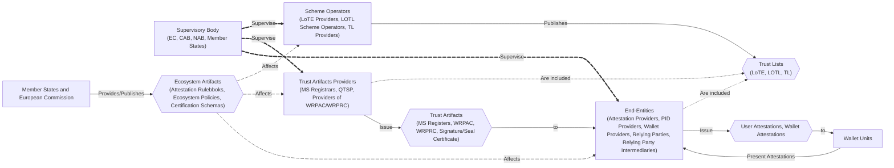
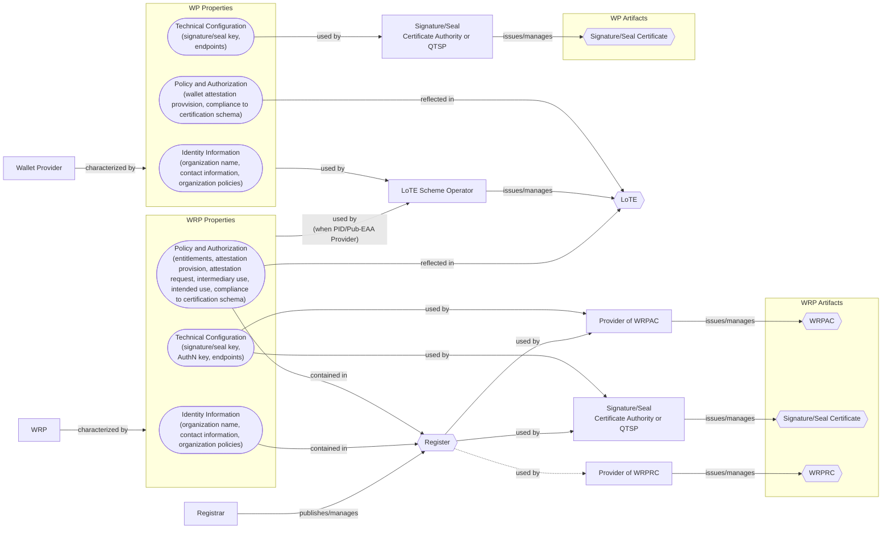
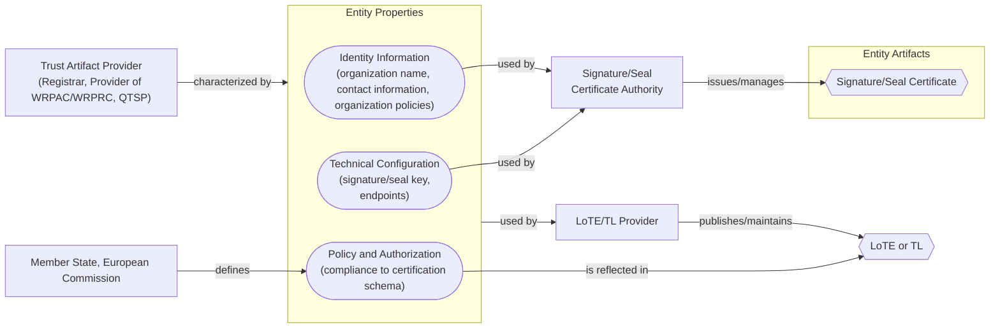
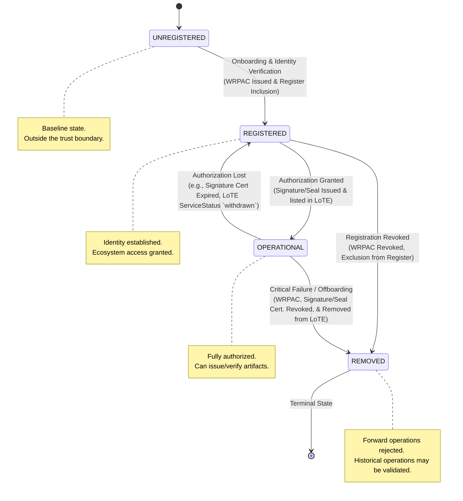
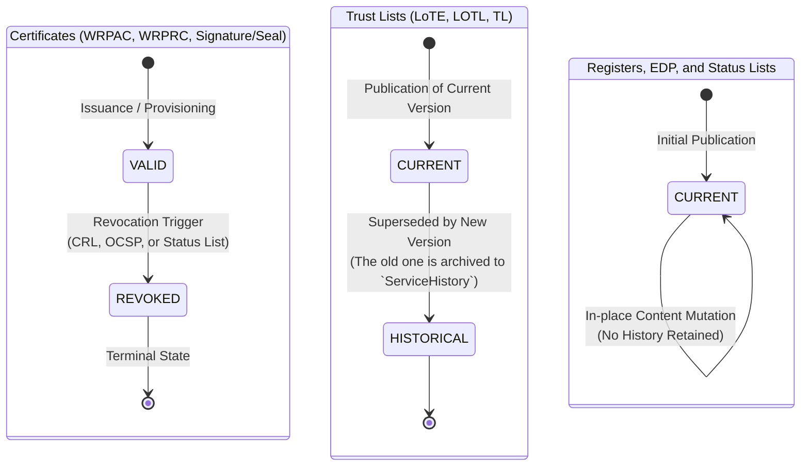

This section describes the high level trust management process within the APTITUDE Trust Framework. Its scope is describing the lifecycle of Entities and Trust Artifacts related to <roles:Wallet-Relying Party (WRP)|WRPs> and <roles:Wallet Provider (WP)|WPs> within the ecosystem, and the relationships between them. Trust Artifacts are the transport mechanism of the Properties (specific Entity attributes categorized in Identity Information, Technical Information, and Policy and Authorization Information) which characterize the entities within the ecosystem, and they are issued and managed by other entities within the ecosystem (Trust Lists and Trust Artifacts Providers).

In particular, this section is structured as follows:

- Section [Ecosystem Participants](#ecosystem-participants) describes the various entities within the ecosystem, their roles and relationships.
- Section [Entity Properties Schema](#entity-properties-schema) describes the various Properties of <roles:Wallet-Relying Party (WRP)|WRPs> and <roles:Wallet Provider (WP)|WPs>, the Trust Artifacts in which these Properties are contained, and the relationships between them.
- Section [Abstract State Machine](#abstract-state-machine) describes the lifecycle *State* (an abstraction at the governance level that captures the current operational status and trustworthiness within the ecosystem) of <roles:Wallet-Relying Party (WRP)|WRPs>, <roles:Wallet Provider (WP)|WPs>, Trust Artifacts, Trust Lists, their definitions, and the effects that these states have on the entities' operational capabilities and trustworthiness.
- Section [Entity Lifecycle Operations](#entity-lifecycle-operations) describes the operational procedures triggered by changes in the Properties of <roles:Wallet-Relying Party (WRP)|WRPs> and <roles:Wallet Provider (WP)|WPs>, and the resulting effects on their lifecycle states and trustworthiness within the ecosystem.

When a <roles:Wallet-Relying Party (WRP)|WRP>'s, <roles:Wallet Provider (WP)|WP>'s, or Trust Artifacts Properties change (e.g., key rotation), the Trust Artifact Providers or Scheme Operators have to update, revoke and issue or re-sign the corresponding Trust Artifacts or Trust Lists, without necessarily altering the underlying Abstract State of the <roles:Wallet-Relying Party (WRP)|WRP>. These operational procedures are defined in [Entity Lifecycle Operations](#entity-lifecycle-operations).

#### Ecosystem Participants

The entities in the ecosystem are divided in different groups depending on their role and the artifact that they issue.

- *<roles:Supervisory Body|Supervisory Bodies>* continuously *supervise* other ecosystem entities. Supervision affect the states of dependent Entities.
- *Member States and the European Commission* *define* and *manage* <artifacts:Attestation Rulebook|Attestation Rulebooks>, and *define* *Ecosystem Policies and Certification Schemas*. These affect dependent Entities during onboarding and their lifecycle.
- *Scheme Operators* (<roles:List of Trusted Entities Provider (LoTE Provider)|LoTE Provider>, <roles:List of Trusted Lists Scheme Operator (LOTLSO)|LOTL Scheme Operators>, <roles:Trusted List Provider|Trusted List Providers>) *publish* and *manage* *Trust Lists* (<artifacts:List of Trusted Entities (LoTE)|LoTE>, <artifacts:List Of Trusted Lists (LOTL)|LOTL>, <artifacts:Trusted List (TL)|TL>) that contain <artifacts:Trust Anchor|Trust Anchors> and Properties of other Entities. Inclusion in these artifacts is, by itself, also a statement about the role and authorization of the included entities within the ecosystem.
- *Trust Artifacts Providers* (MS <roles:Registrar|Registrars>, <roles:Qualified Trust Service Provider (QTSP)|QTSPs>, <roles:Provider of Wallet Relying Party Access Certificate (Provider of WRPAC)|Providers of WRPAC>, <roles:Provider of Wallet Relying Party Registration Certificate (Provider of WRPRC)|Providers of WRPRC>) *publish* and *manage* *Trust Artifacts* (<components:Register|Registers>, <artifacts:Wallet-Relying Party Access Certificate (WRPAC)|WRPACs>, <artifacts:Wallet-Relying Party Registration Certificate (WRPRC)|WRPRCs>, <artifacts:Electronic Signature|Signature>/<artifacts:Electronic Seal|Seal> Certificates) which transports Properties (Identity Information, Technical configurations, and Authorization Information) of End-Entities.
- *End-Entities* (<roles:Attestation Provider (AP)|Attestation Providers>, <roles:Provider of Person Identification Data (PID Provider)|PID Providers>, <roles:Relying Party (RP)|Relying Parties>, <roles:Wallet Provider (WP)|Wallet Provider>) rely on Trust Lists and Trust Artifacts for assessing their trustworthiness to other participants within the ecosystems. In addition, they *issue*, *receive* or *manage* User Attestations or Wallet Attestations to and from <components:Wallet Unit|Wallet Units> during issuance, presentation and <roles:Wallet Provider (WP)|WP>-specific management flows respectively.

!!! warning "Terminology Differences Between ARF and ETSI Specifications"

    Please be aware of some differences between ARF and ETSI specifications terminology. The following table summarizes such differences, as well as the terminology choices for this document:

    | Artifact Name (ARF) | Artifact Name (ETSI) | Artifact Provider (ARF) | Artifact Provider (ETSI) | References | Artifacts Name in this document | Artifact Provider in this document |
    | ------------------- | -------------------- | ----------------------- | ------------------------ | ---------- | ------------------------------- | ---------------------------------- |
    | List of Trusted Entities (LoTE) |  List of Trusted Entities (LoTE) |  List of Trusted Entities (LoTE) Provider | List of Trusted Entities Scheme Operator  (LoTESO) | [ETSI TS 119 602], [ARF, Annex I] | LoTE | List of Trusted Entities (LoTE) Provider |
    | N/A | List of Trusted Lists (LOTL) | N/A | List of Trusted Lists Scheme Operator (LOTLSO) | [ETSI TS 119 615] | LOTL | LOTLSO |
    | Trusted List (TL) | Trusted List (TL) | Trusted List (TL) Provider | Trusted Lists Scheme Operator (TLSO) | [ETSI TS 119 612], [ARF, Annex I] | TL  | Trusted List (TL) Provider |
    | N/A | EUMS TL | N/A | EUMS TLSO | [ETSI TS 119 615] | N/A | N/A |

The diagram below highlights the relationships between the aforementioned entities and artifacts, and the dependences between them in terms of supervision, publication, and the effects that changes in the artifacts (represented as diamond shaped objects in the diagram) have on the entities (represented as rectangular objects in the diagram). The arrows indicate the direction of supervision, publication, and effect propagation.

#### Entity Properties Schema

Trust Artifacts Providers and End-Entities are characterized by three main classes of *Properties*:

- **Identity Information**: This includes the organization's name, contact information, and organizational policies.
- **Technical Configuration**: This includes the cryptographic materials (<artifacts:Electronic Signature|signature>/<artifacts:Electronic Seal|seal> keys, authentication keys) and technical endpoints necessary for ecosystem interactions.
- **Policy and Authorization Information**: This includes the entity's entitlements, attestation provision capabilities, attestation request capabilities, <roles:Relying Party Intermediary (RPI)|intermediary> use permissions, intended use cases, <artifacts:Embedded Disclosure Policy (EDP)|EDPs>, and compliance with certification schemas.

##### Properties Schema and associated Trust Artifacts

In the tables below are found the relationship between the aforementioned Properties and the Trust Artifacts in which they are contained for specific entity types: <roles:Relying Party (RP)|Relying Party> (<roles:Relying Party Intermediary (RPI)|Intermediary>), <roles:Provider of Person Identification Data (PID Provider)|PID Providers>, <roles:Attestation Provider (AP)|Attestation Providers>, and <roles:Wallet Provider (WP)|Wallet Providers>. Since different entity types have their information stored in different artifacts, the tables below are divided by specific types of entities.

All <roles:Wallet-Relying Party (WRP)|WRPs> (<roles:Relying Party (RP)|Relying Parties>, <roles:Relying Party Intermediary (RPI)|Intermediaries>, <roles:Provider of Person Identification Data (PID Provider)|PID Providers>, and <roles:Attestation Provider (AP)|Attestation Providers>) properties are embedded in various Trust Artifacts as follows:

| Entity Type | Properties Class | Entity Properties | Trust Artifacts |
| :--- | :--- | :--- | :--- |
| <roles:Wallet-Relying Party (WRP)\|WRP> | Identity Information | Organization name | <artifacts:Wallet-Relying Party Access Certificate (WRPAC)\|WRPAC>, <artifacts:Wallet-Relying Party Registration Certificate (WRPRC)\|WRPRC>, <components:Register> |
| <roles:Wallet-Relying Party (WRP)\|WRP> | Identity Information | Contact information | <artifacts:Wallet-Relying Party Access Certificate (WRPAC)\|WRPAC>, <components:Register> |
| <roles:Wallet-Relying Party (WRP)\|WRP> | Identity Information | Organizational Policy | <artifacts:Wallet-Relying Party Access Certificate (WRPAC)\|WRPAC>, <artifacts:Wallet-Relying Party Registration Certificate (WRPRC)\|WRPRC>, <components:Register> |
| <roles:Wallet-Relying Party (WRP)\|WRP> | Technical Configuration | Authentication key | <artifacts:Wallet-Relying Party Access Certificate (WRPAC)\|WRPAC> |
| <roles:Wallet-Relying Party (WRP)\|WRP> | Authorization Information | Entitlements | <artifacts:Wallet-Relying Party Registration Certificate (WRPRC)\|WRPRC>, <components:Register> |
| <roles:Wallet-Relying Party (WRP)\|WRP> | Authorization Information | Intermediary use permissions | <artifacts:Wallet-Relying Party Registration Certificate (WRPRC)\|WRPRC>, <components:Register> |
| <roles:Wallet-Relying Party (WRP)\|WRP> | Authorization Information | Service descriptions | <artifacts:Wallet-Relying Party Registration Certificate (WRPRC)\|WRPRC>, <components:Register> |
| <roles:Wallet-Relying Party (WRP)\|WRP> | Authorization Information | Supervision information | <artifacts:Wallet-Relying Party Registration Certificate (WRPRC)\|WRPRC>, <components:Register> |

All <roles:Provider of Person Identification Data (PID Provider)|PID Providers> and <roles:Attestation Provider (AP)|Attestation Providers> have additional specific property requirements embedded in various Trust Artifacts as follows:

| Entity Type | Properties Class | Entity Properties | Trust Artifacts |
| :--- | :--- | :--- | :--- |
| <roles:Provider of Person Identification Data (PID Provider)\|PID Provider> or <roles:Attestation Provider (AP)\|Attestation Provider> | Technical Configuration | <artifacts:Electronic Signature\|Signature>/<artifacts:Electronic Seal\|Seal> key | <artifacts:Electronic Signature\|Signature>/<artifacts:Electronic Seal\|Seal> Certificate |
| <roles:Provider of Person Identification Data (PID Provider)\|PID Provider> or <roles:Attestation Provider (AP)\|Attestation Provider> | Authorization Information | RP Permissions | <artifacts:Embedded Disclosure Policy (EDP)\|EDP> |
| <roles:Provider of Person Identification Data (PID Provider)\|PID Provider> or <roles:Attestation Provider (AP)\|Attestation Provider> | Authorization Information | Attestation provision capabilities | <artifacts:Wallet-Relying Party Registration Certificate (WRPRC)\|WRPRC>, <components:Register> |

All <roles:Relying Party (RP)|Relying Parties> and <roles:Relying Party Intermediary (RPI)|Intermediaries> have additional specific property requirements embedded in various Trust Artifacts as follows:

| Entity Type | Properties Class | Entity Properties | Trust Artifacts |
| :--- | :--- | :--- | :--- |
| <roles:Relying Party (RP)\|Relying Party> or <roles:Relying Party Intermediary (RPI)\|RPI> | Authorization Information | Attestation request capabilities | <artifacts:Wallet-Relying Party Registration Certificate (WRPRC)\|WRPRC>, Register |

All <roles:Wallet Provider (WP)|Wallet Providers>, <roles:Provider of Person Identification Data (PID Provider)|PID Providers>, and <roles:PuB-EAA Provider|Pub-EAA Providers>, being referenced in the <artifacts:List of Trusted Entities (LoTE)|LoTE> as entities authorized to provide services to the ecosystem, have additional specific properties embedded in the <artifacts:List of Trusted Entities (LoTE)|LoTE> as follows:

| Entity Type | Properties Class | Entity Properties | Trust Artifacts |
| :--- | :--- | :--- | :--- |
| <roles:Wallet Provider (WP)\|WP>, <roles:Provider of Person Identification Data (PID Provider)\|PID Provider> and <roles:PuB-EAA Provider\|Pub-EAA Provider> | Identity Information | Organization name | <artifacts:List of Trusted Entities (LoTE)\|LoTE> |
| <roles:Wallet Provider (WP)\|WP>, <roles:Provider of Person Identification Data (PID Provider)\|PID Provider> and <roles:PuB-EAA Provider\|Pub-EAA Provider> | Identity Information | Contact information | <artifacts:List of Trusted Entities (LoTE)\|LoTE> |
| <roles:Wallet Provider (WP)\|WP>, <roles:Provider of Person Identification Data (PID Provider)\|PID Provider> and <roles:PuB-EAA Provider\|Pub-EAA Provider> | Identity Information | Organizational Policy | <artifacts:List of Trusted Entities (LoTE)\|LoTE> |
| <roles:Wallet Provider (WP)\|WP>, <roles:Provider of Person Identification Data (PID Provider)\|PID Provider> and <roles:PuB-EAA Provider\|Pub-EAA Provider> | Authorization Information | Service descriptions | <artifacts:List of Trusted Entities (LoTE)\|LoTE> |
| <roles:Wallet Provider (WP)\|WP>, <roles:Provider of Person Identification Data (PID Provider)\|PID Provider> and <roles:PuB-EAA Provider\|Pub-EAA Provider> | Authorization Information | Service endpoints | <artifacts:List of Trusted Entities (LoTE)\|LoTE> |
| <roles:Wallet Provider (WP)\|WP>, <roles:Provider of Person Identification Data (PID Provider)\|PID Provider> and <roles:PuB-EAA Provider\|Pub-EAA Provider> | Authorization Information | Service status | <artifacts:List of Trusted Entities (LoTE)\|LoTE> |
| <roles:Wallet Provider (WP)\|WP>, <roles:Provider of Person Identification Data (PID Provider)\|PID Provider> and <roles:PuB-EAA Provider\|Pub-EAA Provider> | Authorization Information | Compliance to certification schema | <artifacts:List of Trusted Entities (LoTE)\|LoTE> (implicit via inclusion) |
| <roles:Wallet Provider (WP)\|WP>, <roles:Provider of Person Identification Data (PID Provider)\|PID Provider> and <roles:PuB-EAA Provider\|Pub-EAA Provider> | Technical Configuration | Signature/Seal trust anchors | <artifacts:List of Trusted Entities (LoTE)\|LoTE> |

!!! note

    The inclusion of <roles:Wallet Provider (WP)|Wallet Providers> and <roles:Provider of Person Identification Data (PID Provider)|PID>/<<roles:PuB-EAA Provider|Pub-EAA Providers>|Pub-EAA Providers> in the <artifacts:List of Trusted Entities (LoTE)\|LoTE> is an implicit assertion of their role and authorization within the ecosystem. In particular, their inclusion is a result of the succesful completion of the registration and <processes:Notification|notification> procedures as defined in [CIR 2025/848] (registration of <roles:Wallet-Relying Party (WRP)|WRP>) and [CIR 2024/2980] (notifications of <roles:Wallet-Relying Party (WRP)|WRP> and <roles:Wallet Provider (WP)|WP>).

The diagram below highlights the dependences between <roles:Wallet-Relying Party (WRP)|WRP>'s and <roles:Wallet Provider (WP)|WP>'s Properties, the Trust Lists (diamond shaped boxes) in which these Properties (round shaped boxes) are contained and the Entities (square boxes) that use the Properties' information to issue additional Trust Artifacts. For both <roles:Wallet-Relying Party (WRP)|WRPs> and <roles:Wallet Provider (WP)|WPs>, the inclusion in the Trust Lists attests the implicit, ongoing, compliance to the polices set up by the European Commission and the Member State during onboarding for the respective roles.

In the tables below are found the relationship between the aforementioned Properties and the Trust Artifacts in which they are contained for specific entity types: <roles:Registrar|Registrars>, <roles:Provider of Wallet Relying Party Access Certificate (Provider of WRPAC)|Providers of WRPAC>, <roles:Provider of Wallet Relying Party Registration Certificate (Provider of WRPRC)|Providers of WRPRC>, and <roles:Qualified Trust Service Provider (QTSP)|QTSP>. Since different entity types have their information stored in different artifacts, the tables below are divided by specific types of entities.

The following table describes the relationship between the Properties of Registrars and Providers of WRPAC/WRPRC and the Trust Lists in which these Properties are contained.

| Entity Type | Properties Class | Entity Properties | Trust Artifacts |
| :--- | :--- | :--- | :--- |
| <roles:Registrar>, <roles:Provider of Wallet Relying Party Access Certificate (Provider of WRPAC)\|Provider of WRPAC>, <roles:Provider of Wallet Relying Party Registration Certificate (Provider of WRPRC)\|Provider of WRPRC> | Identity Information | Organization name | <artifacts:List of Trusted Entities (LoTE)\|LoTE> |
| <roles:Registrar>, <roles:Provider of Wallet Relying Party Access Certificate (Provider of WRPAC)\|Provider of WRPAC>, <roles:Provider of Wallet Relying Party Registration Certificate (Provider of WRPRC)\|Provider of WRPRC> | Identity Information | Contact information | <artifacts:List of Trusted Entities (LoTE)\|LoTE> |
| <roles:Registrar>, <roles:Provider of Wallet Relying Party Access Certificate (Provider of WRPAC)\|Provider of WRPAC>, <roles:Provider of Wallet Relying Party Registration Certificate (Provider of WRPRC)\|Provider of WRPRC> | Identity Information | Organizational Policy | <artifacts:List of Trusted Entities (LoTE)\|LoTE> |
| <roles:Registrar>, <roles:Provider of Wallet Relying Party Access Certificate (Provider of WRPAC)\|Provider of WRPAC>, <roles:Provider of Wallet Relying Party Registration Certificate (Provider of WRPRC)\|Provider of WRPRC> | Authorization Information | Service descriptions | <artifacts:List of Trusted Entities (LoTE)\|LoTE> |
| <roles:Registrar>, <roles:Provider of Wallet Relying Party Access Certificate (Provider of WRPAC)\|Provider of WRPAC>, <roles:Provider of Wallet Relying Party Registration Certificate (Provider of WRPRC)\|Provider of WRPRC> | Authorization Information | Service endpoints | <artifacts:List of Trusted Entities (LoTE)\|LoTE> |
| <roles:Registrar>, <roles:Provider of Wallet Relying Party Access Certificate (Provider of WRPAC)\|Provider of WRPAC>, <roles:Provider of Wallet Relying Party Registration Certificate (Provider of WRPRC)\|Provider of WRPRC> | Authorization Information | Service status | <artifacts:List of Trusted Entities (LoTE)\|LoTE> |
| <roles:Registrar>, <roles:Provider of Wallet Relying Party Access Certificate (Provider of WRPAC)\|Provider of WRPAC>, <roles:Provider of Wallet Relying Party Registration Certificate (Provider of WRPRC)\|Provider of WRPRC> | Technical Configuration | <artifacts:Electronic Signature\|Signature>/<artifacts:Electronic Seal\|Seal> key | <artifacts:Electronic Signature\|Signature>/<artifacts:Electronic Seal\|Seal> Certificate |
| <roles:Registrar>, <roles:Provider of Wallet Relying Party Access Certificate (Provider of WRPAC)\|Provider of WRPAC>, <roles:Provider of Wallet Relying Party Registration Certificate (Provider of WRPRC)\|Provider of WRPRC> | Technical Configuration | <artifacts:Electronic Signature\|Signature>/<artifacts:Electronic Seal\|Seal> <artifacts:Trust Anchor> | <artifacts:List of Trusted Entities (LoTE)\|LoTE> |

The following table describes the relationship between the Properties of <roles:Qualified Trust Service Provider (QTSP)|QTSPs> and the Trust Lists in which these Properties are contained.

| Entity Type | Properties Class | Entity Properties | Trust Artifacts |
| :--- | :--- | :--- | :--- |
| <roles:Qualified Trust Service Provider (QTSP)\|QTSP> | Identity Information | Organization name | <artifacts:Trusted List (TL)\|TL> |
| <roles:Qualified Trust Service Provider (QTSP)\|QTSP> | Identity Information | Contact information | <artifacts:Trusted List (TL)\|TL> |
| <roles:Qualified Trust Service Provider (QTSP)\|QTSP> | Identity Information | Organizational Policy | <artifacts:Trusted List (TL)\|TL> |
| <roles:Qualified Trust Service Provider (QTSP)\|QTSP> | Authorization Information | Service descriptions | <artifacts:Trusted List (TL)\|TL> |
| <roles:Qualified Trust Service Provider (QTSP)\|QTSP> | Authorization Information | Service endpoints | <artifacts:Trusted List (TL)\|TL> |
| <roles:Qualified Trust Service Provider (QTSP)\|QTSP> | Authorization Information | Service status | <artifacts:Trusted List (TL)\|TL> |
| <roles:Qualified Trust Service Provider (QTSP)\|QTSP> | Technical Configuration | <artifacts:Electronic Signature\|Signature>/<artifacts:Electronic Seal\|Seal> key | <artifacts:Trusted List (TL)\|TL> |

The diagram below highlights these dependences between Trust Artifact Provider Properties, artifacts in which these Properties are contained and entities that use this information to issue/publish Trust Artifacts:

#### Abstract State Machine

This section describes the lifecycle *State* of <roles:Wallet-Relying Party (WRP)|WRPs> and <roles:Wallet-Relying Party (WRP)|Wallet Providers>, as well as Trust Artifacts and Trust Lists.

##### Entity Lifecycle State Machine

State Machines are described only for <roles:Wallet-Relying Party (WRP)|WRPs>, <roles:Wallet-Relying Party (WRP)|Wallet Providers>, and Trust Artifacts Providers. Their status is determined through Trust Artifacts or Trust Lists entries. <roles:Wallet-Relying Party (WRP)|WRPs>, <roles:Wallet-Relying Party (WRP)|Wallet Providers>, and Trust Artifacts Providers participating in the APTITUDE Trust Framework are classified into one of the following mutually exclusive lifecycle States at any given time. The State dictates the entity's authorization level, operational capabilities, and how other participants SHALL interact with its cryptographic artifacts.

- `UNREGISTERED`: Indicates that an entity does not currently hold a valid subscription or registration within the APTITUDE Trust Framework. This is the default baseline state. Entities in this state are outside the trust boundary and SHALL NOT participate in framework operations or federation protocols.
- `REGISTERED`: Indicates that an entity has successfully completed the onboarding process, verified its identity, and has established ecosystem access.
    - A <roles:Wallet-Relying Party (WRP)|WRP> is in `REGISTERED` state if the <roles:Registrar> has inserted its Identity information within the <components:Register>, and possesses the <artifacts:Wallet-Relying Party Access Certificate (WRPAC)|WRPAC> binding this Identity information to a key controlled by the entity.
    - The <roles:Wallet-Relying Party (WRP)|Wallet Provider> is in `REGISTERED` when it has completed the necessary certification and successfully completed the onboarding process.
- `OPERATIONAL`: Indicates that an entity has successfully completed onboarding, and, crucially, has been authorized to perform role-related operations, provide services, and issue or verify artifacts in accordance with framework policies.
    - A <roles:Relying Party (RP)|RP> or <roles:Relying Party Intermediary (RPI)|RPI> is in `OPERATIONAL` state if it is `REGISTERED`, the <roles:Registrar> has inserted its Authorization information within the <components:Register>, and (optionally) it possesses a valid <artifacts:Wallet-Relying Party Registration Certificate (WRPRC)|WRPRC>.
    - A <roles:QEAA Provider>/<roles:EAA Provider> is in `OPERATIONAL` state if it is `REGISTERED`, the <roles:Registrar> has inserted its Authorization information within the <components:Register>, (optionally) it possesses a valid <artifacts:Wallet-Relying Party Registration Certificate (WRPRC)|WRPRC> and possesses a valid (qualified) <artifacts:Electronic Signature|Signature>/<artifacts:Electronic Seal|Seal> certificate to sign the <credentials:Attestation|Attestations>.
    - A <roles:Provider of Person Identification Data (PID Provider)|PID Provider> or <roles:PuB-EAA Provider> is in `OPERATIONAL` state if it is `REGISTERED`, the <roles:Registrar> has inserted its Authorization information within the <components:Register>, (optionally) it possesses a valid <artifacts:Wallet-Relying Party Registration Certificate (WRPRC)|WRPRC>, it possesses valid <artifacts:Electronic Signature|Signature>/<artifacts:Electronic Seal|Seal> certificate, and is listed in the relevant LoTE.
    - A <roles:Wallet Provider (WP)|Wallet Provider> or Trust Artifacts Provider is in the `OPERATIONAL` state if it is `REGISTERED`, listed in the relevant Trust List, and possesses valid <artifacts:Electronic Signature|Signature>/<artifacts:Electronic Seal|Seal> certificate.
- `REMOVED`: Indicates the revocation of an entity's `REGISTERED` status due to voluntary offboarding, a severe security breach, or a critical compliance failure.
    - A <roles:Wallet-Relying Party (WRP)|WRP> is in `REMOVED` state if the <artifacts:Wallet-Relying Party Access Certificate (WRPAC)|WRPAC> is `revoked`.
    - A <roles:Wallet Provider (WP)|Wallet Provider> or Trust Artifacts Provider is in `REMOVED` state when it is not listed in the latest version of the relevant Trust List.
    - **Forward Operations**: Ecosystem participants SHALL reject new interactions or transactions initiated by a `REMOVED` entity, and all cryptographic keys, active attestations, and operational capabilities associated with the entity SHALL be immediately revoked.
    - **Historical Operations**: Ecosystem participants MAY continue to validate historical data, signatures, and attestations generated prior to the Removal timestamp, subject to local risk policies. These historical data are found in the corresponding Trust List's `ServiceHistory` component.

Below the state diagram of the various actors.

The table below summarizes the lifecycle states, their definitions, the entity to which it refers, the Trust Artifacts that assert the entity's state, and the technical mean that conveys the validity of the Trust Artifacts.

| State | Definition | Applicable Entities | Asserting Trust Artifacts | Technical Mean |
| :--- | :--- | :--- | :--- | :--- |
| `UNREGISTERED` | Indicates that an entity does not currently hold a valid subscription or registration within the APTITUDE Trust Framework. | All potential ecosystem participants prior to onboarding. | N/A | N/A |
| `REGISTERED` | Indicates that an entity has successfully completed onboarding, verified its identity, and established baseline ecosystem network access. | <roles:Wallet-Relying Party (WRP)\|WRPs> (<roles:Relying Party (RP)\|RPs>, <roles:Provider of Person Identification Data (PID Provider)\|PID Providers>, and <roles:EAA Provider\|EAA Providers>) and <roles:Wallet Provider (WP)\|Wallet Providers>. | <roles:Wallet-Relying Party (WRP)\|WRP>: Valid <artifacts:Wallet-Relying Party Access Certificate (WRPAC)\|WRPAC> and identity inclusion in the <components:Register>.  Wallet Provider: Finalized certification and onboarding records. | <roles:Wallet-Relying Party (WRP)\|WRP>: <protocols:Online Certificate Status Protocol (OCSP)\|OCSP> response with good status (or absence in CRL) for the <artifacts:Wallet-Relying Party Access Certificate (WRPAC)\|WRPAC>; active status in the <components:Register>. |
| `OPERATIONAL` | Indicates that an entity is explicitly authorized to perform role-related operations, provide services, and issue or verify artifacts. | `REGISTERED` <roles:Wallet-Relying Party (WRP)\|WRPs> and <roles:Wallet Provider (WP)\|Wallet Providers>. | **<roles:Relying Party (RP)\|RP> (<roles:Relying Party Intermediary (RPI)\|Intermediary>)**: Authorization in <components:Register>, <artifacts:Wallet-Relying Party Registration Certificate (WRPRC)\|WRPRC> (optional).  **<roles:EAA Provider\|EAA Provider> / <roles:QEAA Provider\|QEAA Provider>**: Valid <artifacts:Electronic Signature\|Signature>/<artifacts:Electronic Seal\|Seal> certificate, Authorization in <components:Register>, <artifacts:Wallet-Relying Party Registration Certificate (WRPRC)\|WRPRC> (optional).  **<roles:Provider of Person Identification Data (PID Provider)\|PID Provider> / <roles:PuB-EAA Provider\|Pub-EAA Provider>**: Valid <artifacts:Electronic Signature\|Signature>/<artifacts:Electronic Seal\|Seal> certificate, entry in the relevant LoTE, Authorization in <components:Register>, <artifacts:Wallet-Relying Party Registration Certificate (WRPRC)\|WRPRC> (optional).  **<roles:Wallet Provider (WP)\|Wallet Provider>**: Valid <artifacts:Electronic Signature\|Signature>/<artifacts:Electronic Seal\|Seal> certificate, entry in the relevant Trust List. | **Certificates**: <protocols:Online Certificate Status Protocol (OCSP)\|OCSP> response with `good` status or absence in <artifacts:Certificate Revocation List (CRL)\|CRL> for <artifacts:Electronic Signature\|Signature>/<artifacts:Electronic Seal\|Seal> certificates and WRPACs; <artifacts:Status List Token> with status set to `0x00`.  **<artifacts:List of Trusted Entities (LoTE)\|LoTE>**: Entry matching the entity.  **<components:Register>**: Validated role-specific authorization schema Properties. |
| `REMOVED` | Indicates the revocation of an entity's `REGISTERED` status due to voluntary offboarding, a severe security breach, or a critical compliance failure. | All deactivated, offboarded, or permanently banned framework participants. | **<roles:Wallet-Relying Party (WRP)\|WRP>**: Revoked <artifacts:Wallet-Relying Party Access Certificate (WRPAC)\|WRPAC>, removal from <artifacts:List of Trusted Entities (LoTE)\|LoTE> (if applicable) and <components:Register> entry.  **Wallet Provider**: Removal from the current active <artifacts:List of Trusted Entities (LoTE)\|LoTE>. | <protocols:Online Certificate Status Protocol (OCSP)\|OCSP> response with `revoked` status or presence in a <artifacts:Certificate Revocation List (CRL)\|CRL> for the <artifacts:Wallet-Relying Party Access Certificate (WRPAC)\|WRPAC>.  Complete absence from the active <components:Register> or Trust List (if applicable); resolution of historical status via the `ServiceHistory` component. |

Depending on the circumstances, an entity in the `REMOVED` state MAY have its <artifacts:Electronic Signature\|Signature>/<artifacts:Electronic Seal\|Seal> certificates revoked, when this is not the case, all artifacts the entity has issued SHALL be considered valid for historical operations. Further details on this are found in the [Operational Effects of Removal](#operational-effects-of-removal) section.

##### Trust Artifacts and Trust Lists Lifecycle State Machine

State Machines for Trust Artifacts and Trust Lists are described below:

- For <artifacts:Wallet-Relying Party Access Certificate (WRPAC)|WRPAC>, <artifacts:Wallet-Relying Party Registration Certificate (WRPRC)|WRPRC> and <artifacts:Electronic Signature|Signature>/<artifacts:Electronic Seal|Seal> Certificates, the lifecycle states are `VALID` and `REVOKED`. The transition from `VALID` to `REVOKED` is triggered by the revocation of the artifact, which can be initiated by the corresponding Trust Artifact Provider due to various reasons such as key compromise, organizational changes, or non-compliance with framework policies. Once an artifact is in the `REVOKED` state, it SHALL NOT be trusted for any operational use within the ecosystem, and any entity relying on it MUST reject it for authentication, authorization, or any other trust-related operations.
    - A <artifacts:Wallet-Relying Party Access Certificate (WRPAC)|WRPAC> in `VALID` state SHALL NOT be present in the designated <artifacts:Certificate Revocation List (CRL)|CRL> and/or SHALL return a `good` status in the <protocols:Online Certificate Status Protocol (OCSP)|OCSP> response. A WRPAC in `REVOKED` state SHALL be present in the designated <artifacts:Certificate Revocation List (CRL)|CRL> and/or SHALL return a `revoked` status in the <protocols:Online Certificate Status Protocol (OCSP)|OCSP> response.
    - A <artifacts:Wallet-Relying Party Registration Certificate (WRPRC)|WRPRC> in `VALID` state SHALL return a `0x00` status in the corresponding <artifacts:Status List Token>. A <artifacts:Wallet-Relying Party Registration Certificate (WRPRC)|WRPRC> in `REVOKED` state SHALL have status value `0x01` within the corresponding <artifacts:Status List Token>.
- For Trust Lists (<artifacts:List of Trusted Entities (LoTE)|LoTE>, <artifacts:List Of Trusted Lists (LOTL)|LOTL>, <artifacts:Trusted List (TL)|TL>), the lifecycle states are `CURRENT` and `HISTORICAL`. The transition from `CURRENT` to `HISTORICAL` is triggered by the publication of a new version of the Trust List that replaces the previous version. Once a Trust List is in the `HISTORICAL` state, it SHALL NOT be used for any operational use within the ecosystem, the only exception being the validation of Trust List trustworthiness via the pivoting mechanism (see [Trust Anchor Validation Process](#trust-anchor-validation-process)) and the validation of historical operations via the `ServiceHistory` component of the Trust List.
- For <components:Register|Registers>, <artifacts:Embedded Disclosure Policy (EDP)|EDPs>, Status Lists, the lifecycle state is only `CURRENT`, since any change in these artifacts is reflected as an update of the artifact itself, and the previous version is not retained as a historical record.

The diagram below highlights the state machine of the aforementioned artifacts:

The table below summarizes the lifecycle states, their definitions, the applicable Trust Artifacts and Trust Lists, and the technical mean that conveys the validity of these artifacts. The three tables are divided by artifact type since they have different lifecycle states and transition triggers, these are respectively: `VALID` and `REVOKED` for <artifacts:Wallet-Relying Party Access Certificate (WRPAC)|WRPAC>, <artifacts:Wallet-Relying Party Registration Certificate (WRPRC)|WRPRC> and <artifacts:Electronic Signature|Signature>/<artifacts:Electronic Seal|Seal> Certificates, `CURRENT` and `HISTORICAL` for Trust Lists, and only `CURRENT` for <components:Register|Registers>, <artifacts:Embedded Disclosure Policy (EDP)|EDPs> and Status Lists.

| State | Definition | Applicable Artifacts | Technical Mean |
| :--- | :--- | :--- | :--- |
| `VALID` | Indicates that a Trust Artifact is currently valid and can be trusted for operational use within the ecosystem. | <artifacts:Wallet-Relying Party Access Certificate (WRPAC)\|WRPAC>, <artifacts:Wallet-Relying Party Registration Certificate (WRPRC)\|WRPRC>, <artifacts:Electronic Signature\|Signature>/<artifacts:Electronic Seal\|Seal> Certificates. | <protocols:Online Certificate Status Protocol (OCSP)\|OCSP> response with `good` status or absence in <artifacts:Certificate Revocation List (CRL)\|CRL> for <artifacts:Wallet-Relying Party Access Certificate (WRPAC)\|WRPACs> and <artifacts:Electronic Signature\|Signature>/<artifacts:Electronic Seal\|Seal> certificates; <artifacts:Status List Token> with status set to `0x00` for <artifacts:Wallet-Relying Party Registration Certificate (WRPRC)\|WRPRCs>. |
| `REVOKED` | Indicates that a Trust Artifact has been revoked and SHALL NOT be trusted for any operational use within the ecosystem. | <artifacts:Wallet-Relying Party Access Certificate (WRPAC)\|WRPAC>, <artifacts:Wallet-Relying Party Registration Certificate (WRPRC)\|WRPRC>, <artifacts:Electronic Signature\|Signature>/<artifacts:Electronic Seal\|Seal> Certificates. | <protocols:Online Certificate Status Protocol (OCSP)\|OCSP> response with `revoked` status or presence in <artifacts:Certificate Revocation List (CRL)\|CRL> for <artifacts:Wallet-Relying Party Access Certificate (WRPAC)\|WRPACs> and <artifacts:Electronic Signature\|Signature>/<artifacts:Electronic Seal\|Seal> certificates; <artifacts:Status List Token> with status set to `0x01` for <artifacts:Wallet-Relying Party Registration Certificate (WRPRC)\|WRPRCs>. |

| State | Definition | Applicable Artifacts | Technical Mean |
| :--- | :--- | :--- | :--- |
| `CURRENT` | Indicates that the current Trust List is the newest version, previous versions are no longer valid for operational use within the ecosystem. | <artifacts:List of Trusted Entities (LoTE)\|LoTE>, <artifacts:List Of Trusted Lists (LOTL)\|LOTL>, <artifacts:Trusted List (TL)\|TL>, <components:Register\|Registers>, <artifacts:Embedded Disclosure Policy (EDP)\|EDPs>, Status Lists. | Publication of a new version of the Trust List; resolution of historical status via the `ServiceHistory` component for <artifacts:List of Trusted Entities (LoTE)\|LoTE>, <artifacts:List Of Trusted Lists (LOTL)\|LOTL>, and <artifacts:Trusted List (TL)\|TL>. |
| `HISTORICAL` | Indicates that a Trust List is a historical record and SHALL NOT be used for any operational use within the ecosystem, except for validating historical operations and trustworthiness via the pivoting mechanism. | <artifacts:List of Trusted Entities (LoTE)\|LoTE>, <artifacts:List Of Trusted Lists (LOTL)\|LOTL>, <artifacts:Trusted List (TL)\|TL>. | Resolution of historical status via the `ServiceHistory` component; validation of trustworthiness via the pivoting mechanism. |

| State | Definition | Applicable Artifacts | Technical Mean |
| :--- | :--- | :--- | :--- |
| `CURRENT` | Indicates that the current version of a Register, <artifacts:Embedded Disclosure Policy (EDP)\|EDP>, or Status List has the newest information, previous versions are no longer valid, SHOULD NOT be published and SHALL NOT be used for operational use within the ecosystem. | <components:Register\|Registers>, <artifacts:Embedded Disclosure Policy (EDP)\|EDPs>, Status Lists. | Publication of an updated version of the artifact. |

#### Entity Lifecycle Operations

Below are detailed the operational procedures, which affects the Properties of Trust Artifact Provider and End-Entities and the resulting effects on their State.

##### Onboarding Process

The onboarding process governs the transition of an End-Entity (<roles:Wallet-Relying Party (WRP)|WRP> or <roles:Wallet Provider (WP)|Wallet Provider>) from the `UNREGISTERED` state to the `REGISTERED` state. During the onboarding process, it is up to the Entities running the process and necessary validations to collect the onboardee's Properties and (depending on its role) issue the corresponding Trust Artifacts.

##### Active Operations and Maintenance

While in the `OPERATIONAL` state, entities MAY require *organizational updates* to their registered Properties, including their entity profiles, cryptographic materials, or operational parameters. Below we describe these updates and their operational effects on the trust artifacts and the entity's state.

###### Organizational Updates

As their organizational or regulatory circumstances evolve, <roles:Wallet-Relying Party (WRP)|WRPs> and <roles:Wallet Provider (WP)|Wallet Providers> SHALL update identity, authorization information and technical configurations accordingly through the standard channels as defined at Member State or European Commission level. Identity and cryptographic updates SHALL follow standard framework governance processes and SHOULD NOT affect the underlying technical operations of the Trust Framework. In particular, updates that directly affect federation protocol operations or cryptographic trust boundaries require strictly coordinated procedures. These technical updates SHALL be validated by the designated MS authority or EC designated body prior to deployment to maintain trust relationships and ecosystem operational integrity.

###### Operational Effects of Organizational Updates

When there are organizational updates, the Trust Framework infrastructure SHALL propagate these changes to the relevant trust artifacts. The specific operational effects depend on the entity's role, and the artifacts it utilizes.

**<roles:Wallet-Relying Party (WRP)|WRP> Updates**: For <roles:Wallet-Relying Party (WRP)|WRP> updating their Identity Information, Technical Configurations, and/or Policies and Authorizations, the update SHALL trigger the following procedures:

- **Identity Information and Policies and Authorizations Updates**:
    - **Registry Update**: the <roles:Wallet-Relying Party (WRP)|WRP> SHALL update its information within the <components:Register> via the authenticated API.
    - **<artifacts:Wallet-Relying Party Access Certificate (WRPAC)|WRPAC> Revocation**: The <roles:Provider of Wallet Relying Party Access Certificate (Provider of WRPAC)|Provider of WRPAC> SHALL revoke the entity's current <artifacts:Wallet-Relying Party Access Certificate (WRPAC)|WRPAC>. Revocation SHALL be executed by appending the certificate's serial number to the active <artifacts:Certificate Revocation List (CRL)|CRL> or by returning a `revoked` status in the <protocols:Online Certificate Status Protocol (OCSP)|OCSP> response.
    - **<artifacts:Wallet-Relying Party Access Certificate (WRPAC)|WRPAC> Re-issuance**:The <roles:Provider of Wallet Relying Party Access Certificate (Provider of WRPAC)|Provider of WRPAC> SHALL issue a new <artifacts:Wallet-Relying Party Access Certificate (WRPAC)|WRPAC> with the updated data.
    - **<artifacts:Wallet-Relying Party Registration Certificate (WRPRC)|WRPRC> Revocation**: The <roles:Provider of Wallet Relying Party Access Certificate (Provider of WRPAC)|Provider of WRPRC>|Provider of WRPRC> SHALL revoke the entity's current <artifacts:Wallet-Relying Party Registration Certificate (WRPRC)|WRPRC> if present. Revocation SHALL be executed by setting the status value of the <artifacts:Wallet-Relying Party Registration Certificate (WRPRC)|WRPRC> within the corresponding <artifacts:Status List Token> to `0x01`.
    - **WRPRC Re-issuance**: The <roles:Provider of Wallet Relying Party Access Certificate (Provider of WRPAC)|Provider of WRPRC> SHALL issue a new <artifacts:Wallet-Relying Party Registration Certificate (WRPRC)|WRPRC> with the updated data if required.
    - **<artifacts:List of Trusted Entities (LoTE)|LoTE> Update** [ONLY for <roles:Provider of Person Identification Data (PID Provider)|PID> and <roles:PuB-EAA Provider|Pub-EAA Providers>]: the <roles:Provider of Person Identification Data (PID Provider)|PID>/<roles:PuB-EAA Provider|Pub-EAA Provider> SHALL notify the <roles:List of Trusted Entities Provider (LoTE Provider)|LoTE Provider> with the update, the latter which will publish a new version of the <artifacts:List of Trusted Entities (LoTE)|LoTE> with the updated `ServiceInformation` component using the pivoting mechanism with the <roles:Provider of Person Identification Data (PID Provider)|PID>/<roles:PuB-EAA Provider>'s updated information.
- **Technical Configurations Updates**:
    - **<artifacts:Electronic Signature|Signature>/<artifacts:Electronic Seal|Seal> Key update**: the <roles:Wallet-Relying Party (WRP)|WRP> SHALL notify <artifacts:Electronic Signature|Signature>/<artifacts:Electronic Seal|Seal> Key updates to the <roles:Certificate Authority (CA)|Certificate Authority> responsible for the issuance of these certificates.
        - **<artifacts:Electronic Signature|Signature>/<artifacts:Electronic Seal|Seal> Certificate Revocation**: The <roles:Certificate Authority (CA)|Certificate Authority> SHALL revoke the entity's current <artifacts:Electronic Signature|Signature>/<artifacts:Electronic Seal|Seal> certificate.
        - **<artifacts:Electronic Signature|Signature>/<artifacts:Electronic Seal|Seal> Certificate Re-issuance**:The <roles:Certificate Authority (CA)|Certificate Authority> SHALL issue a new <artifacts:Electronic Signature|Signature>/<artifacts:Electronic Seal|Seal> certificate with the updated key.
        - **<artifacts:List of Trusted Entities (LoTE)|LoTE> Update** [ONLY for <roles:Provider of Person Identification Data (PID Provider)|PID Providers> <artifacts:Trust Anchor> certificates]: Upon obtaining a new <artifacts:Electronic Signature|Signature>/<artifacts:Electronic Seal|Seal> certificate with the updated key the <roles:Provider of Person Identification Data (PID Provider)|PID Provider> SHALL notify the <roles:List of Trusted Entities Provider (LoTE Provider)|LoTE Provider> which will publish a new version of the <artifacts:List of Trusted Entities (LoTE)|LoTE> with the updated `ServiceInformation` component using the pivoting mechanism with the <roles:Provider of Person Identification Data (PID Provider)|PID Providers>' updated <artifacts:Electronic Signature|Signature>/<artifacts:Electronic Seal|Seal> certificate.
    - **AuthN Key update**: The <roles:Wallet-Relying Party (WRP)|WRP> SHALL notify <artifacts:Wallet-Relying Party Access Certificate (WRPAC)|WRPAC> Key updates to the <roles:Provider of Wallet Relying Party Access Certificate (Provider of WRPAC)|Provider of WRPAC>.
        - **<artifacts:Wallet-Relying Party Access Certificate (WRPAC)|WRPAC> Revocation**: The <roles:Provider of Wallet Relying Party Access Certificate (Provider of WRPAC)|Provider of WRPAC> SHALL revoke the entity's current <artifacts:Wallet-Relying Party Access Certificate (WRPAC)|WRPAC>. Revocation SHALL be executed by appending the certificate's serial number to the active <artifacts:Certificate Revocation List (CRL)|CRL> or by returning a `revoked` status in the <protocols:Online Certificate Status Protocol (OCSP)|OCSP> response.
        - **<artifacts:Wallet-Relying Party Access Certificate (WRPAC)|WRPAC> Re-issuance**:The <roles:Provider of Wallet Relying Party Access Certificate (Provider of WRPAC)|Provider of WRPAC> SHALL issue a new <artifacts:Wallet-Relying Party Access Certificate (WRPAC)|WRPAC> with the updated key.

**<roles:Wallet Provider (WP)|Wallet Providers> and Trust Artifact Provider Updates**: For <roles:Wallet Provider (WP)|Wallet Providers>, <roles:Registrar|Registrars>, <roles:Provider of Wallet Relying Party Access Certificate (Provider of WRPAC)|Providers of WRPAC>/<roles:Provider of Wallet Relying Party Registration Certificate (Provider of WRPRC)\|WRPRC> updating their Identity Information and/or Technical Configurations, the update SHALL trigger the following procedures:

- **Identity Information Updates**:
    - **<artifacts:List of Trusted Entities (LoTE)|LoTE> Update**: the entity SHALL notify the <roles:List of Trusted Entities Provider (LoTE Provider)|LoTE Provider> with the update, the latter which will publish a new version of the <artifacts:List of Trusted Entities (LoTE)|LoTE> with the updated `ServiceInformation` component using the pivoting mechanism with the <roles:Provider of Person Identification Data (PID Provider)|PID>/<roles:PuB-EAA Provider|Pub-EAA Provider>'s updated information.
- **Technical Configurations Updates**:
    - **<artifacts:Electronic Signature|Signature>/<artifacts:Electronic Seal|Seal> Key update**: the entity SHALL notify the <artifacts:Electronic Signature|Signature>/<artifacts:Electronic Seal|Seal> Key updates to the <roles:Certificate Authority (CA)|Certificate Authority> responsible for the issuance of these certificates.
        - **<artifacts:Electronic Signature|Signature>/<artifacts:Electronic Seal|Seal> Certificate Revocation**: The <roles:Certificate Authority (CA)|Certificate Authority> SHALL revoke the entity's current <artifacts:Electronic Signature|Signature>/<artifacts:Electronic Seal|Seal> certificate.
        - **<artifacts:Electronic Signature|Signature>/<artifacts:Electronic Seal|Seal> Certificate Re-issuance**:The <roles:Certificate Authority (CA)|Certificate Authority> SHALL issue a new <artifacts:Electronic Signature|Signature>/<artifacts:Electronic Seal|Seal> certificate with the updated key.
        - **<artifacts:List of Trusted Entities (LoTE)|LoTE> Update** [ONLY for <artifacts:Trust Anchor> certificates]: Upon obtaining a new <artifacts:Electronic Signature|Signature>/<artifacts:Electronic Seal|Seal> certificate with the updated key the entity SHALL notify the <roles:List of Trusted Entities Provider (LoTE Provider)|LoTE Provider> which will publish a new version of the <artifacts:List of Trusted Entities (LoTE)|LoTE> with the updated `ServiceInformation` component using the pivoting mechanism with the entity's updated <artifacts:Electronic Signature|Signature>/<artifacts:Electronic Seal|Seal> certificate.
    - **Endpoints Update** [ONLY for <roles:Registrar|Registrars> or <roles:Wallet Provider (WP)|Wallet Providers>]: When updating endpoint, the <roles:Registrar> or <roles:Wallet Provider (WP)|Wallet Provider> SHALL notify the <roles:List of Trusted Entities Provider (LoTE Provider)|LoTE Provider> which will publish a new version of the <artifacts:List of Trusted Entities (LoTE)|LoTE> with the updated `ServiceInformation` component using the pivoting mechanism with the updated endpoint.

##### Removal Process

The Removal process defines the rapid-response workflows and administrative procedures executed to transition an entity from the `OPERATIONAL` state to the `REMOVED` state. This transition MAY be initiated voluntarily by the entity or forcefully enacted by the <roles:Supervisory Body>.

###### Triggers for Removal

Removal events are categorized based on their initiation source:

- Voluntary Exit: Organizations MAY choose to exit the federation for standard business or operational reasons. Permitted reasons include:
    - Business Changes: Organizational restructuring, mergers, acquisitions, or complete service discontinuation.
- <roles:Supervisory Body> Removal (use the MS, EC, <roles:Conformity Assessment Body (CAB)|CAB>, <roles:National Accreditation Bodies (NAB)|NAB>, DPA bodies): The <roles:Supervisory Body> MAY initiate a forced Removal due to severe compliance failures, fatal security breaches, or other critical ecosystem threats.

###### Operational Effects of Removal

When an entity transitions to the `REMOVED` state, the relevant Trust Artifacts Providers and Scheme Operators SHALL immediately execute the necessary operations to halt the entity's operations while preserving historical evidence. The specific operational effects depend on the entity's role, and the artifacts it utilizes.

**<roles:Wallet-Relying Party (WRP)|WRP> Withdrawal or Removal**: For <roles:Wallet-Relying Party (WRP)|WRP> withdrawing or being removed from the Trust Framework following security incidents or policy violations, the removal event SHALL trigger the following procedures:

- **Registry Update**: the <roles:Wallet-Relying Party (WRP)|WRP> or <roles:Supervisory Body> MAY remove the <roles:Wallet-Relying Party (WRP)|WRP> information within the <components:Register>.
- **<artifacts:Wallet-Relying Party Access Certificate (WRPAC)|WRPAC> Revocation**: The <roles:Provider of Wallet Relying Party Access Certificate (Provider of WRPAC)|Provider of WRPAC> SHALL revoke the entity's current <artifacts:Wallet-Relying Party Access Certificate (WRPAC)|WRPAC>. Revocation SHALL be executed by appending the certificate's serial number to the active <artifacts:Certificate Revocation List (CRL)|CRL> or by returning a `revoked` status in the <protocols:Online Certificate Status Protocol (OCSP)|OCSP> response.
- **<artifacts:Wallet-Relying Party Registration Certificate (WRPRC)|WRPRC> Revocation**: The <roles:Provider of Wallet Relying Party Access Certificate (Provider of WRPAC)|Provider of WRPRC>|Provider of WRPRC> SHALL revoke the entity's current <artifacts:Wallet-Relying Party Registration Certificate (WRPRC)|WRPRC> if present. Revocation SHALL be executed by setting the status value of the <artifacts:Wallet-Relying Party Registration Certificate (WRPRC)|WRPRC> within the corresponding <artifacts:Status List Token> to `0x01`.
- **<artifacts:Electronic Signature|Signature>/<artifacts:Electronic Seal|Seal> Certificate Revocation**: The <roles:Certificate Authority (CA)|Certificate Authority> SHALL revoke the entity's current <artifacts:Electronic Signature|Signature>/<artifacts:Electronic Seal|Seal> certificate.
- **<artifacts:List of Trusted Entities (LoTE)|LoTE> Update** [ONLY for <roles:Provider of Person Identification Data (PID Provider)|PID> and <roles:PuB-EAA Provider|Pub-EAA Providers>]: the <roles:Wallet-Relying Party (WRP)|WRP> or <roles:Supervisory Body> SHALL notify the <roles:List of Trusted Entities Provider (LoTE Provider)|LoTE Provider> which will publish a new version of the <artifacts:List of Trusted Entities (LoTE)|LoTE> using the pivoting mechanism without the PID/Pub-EAA/<roles:Wallet Provider (WP)|Wallet Provider>'s `ServiceInformation` component. To maintain non-repudiation for past transactions, the superseded parameters MAY be retained as historical records within the `TrustedEntityServices.ServiceHistory`.

**<roles:Wallet Provider (WP)|Wallet Providers> and Trust Artifact Provider Withdrawal or Removal**: For <roles:Wallet Provider (WP)|Wallet Providers>, <roles:Registrar|Registrars>, <roles:Provider of Wallet Relying Party Access Certificate (Provider of WRPAC)|Providers of WRPAC>, <roles:Provider of Wallet Relying Party Registration Certificate (Provider of WRPRC)|Providers of WRPRC> updating their Identity Information and/or Technical Configurations, the removal event SHALL trigger the following procedures:

- **<artifacts:List of Trusted Entities (LoTE)|LoTE> Update**: the Trust Artifact Provider or <roles:Supervisory Body> SHALL notify the <roles:List of Trusted Entities Provider (LoTE Provider)|LoTE Provider> which will publish a new version of the <artifacts:List of Trusted Entities (LoTE)|LoTE> using the pivoting mechanism without the <roles:Provider of Person Identification Data (PID Provider)|PID>/<roles:PuB-EAA Provider|Pub-EAA>/<roles:Wallet Provider (WP)|Wallet Provider>'s `ServiceInformation` component. To maintain non-repudiation for past transactions, the superseded parameters MAY be retained as historical records within the `TrustedEntityServices.ServiceHistory`.
