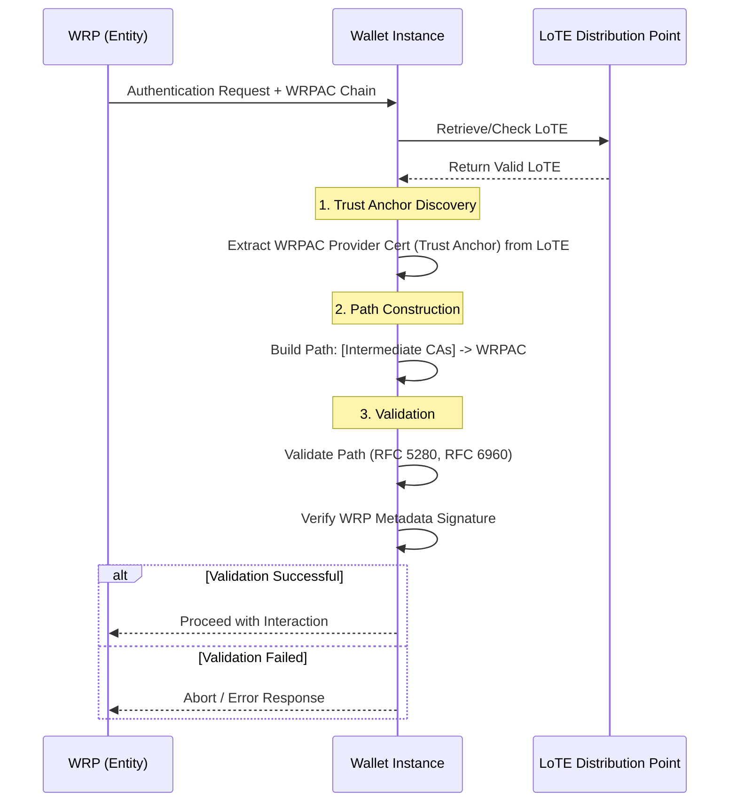
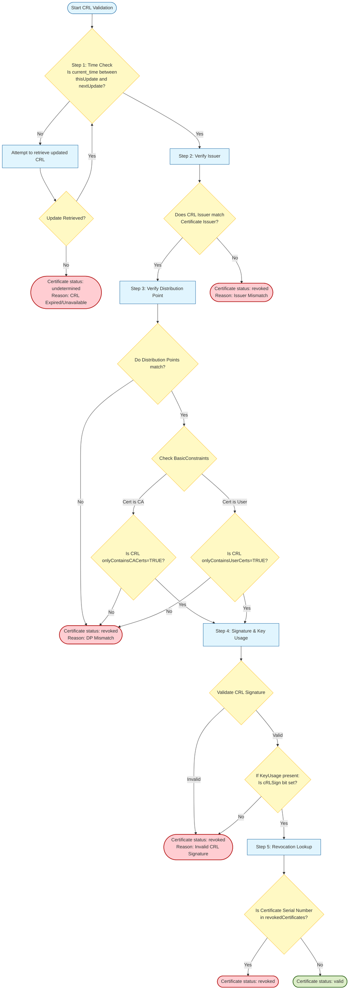
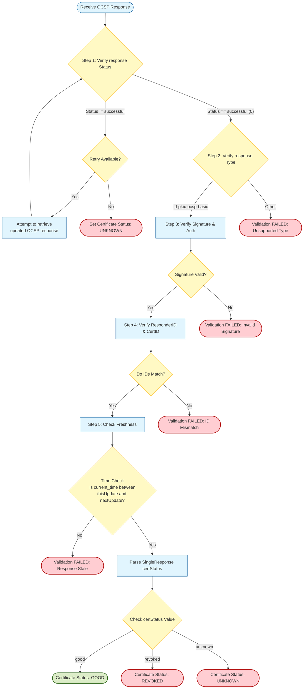

# Authentication Process

The Authentication Process enables the Wallet Instance to authenticate a Wallet Relying Party (WRP). This involves validating the X.509 certificate chain, starting from a trusted WRPAC Provider (the Trust Anchor) and ending with the Wallet Relying Party Access Certificate (WRPAC) presented by the WRP.

To perform this validation, the Wallet Instance MUST:
- Obtain the WRPAC Provider’s entry from the valid List of Trusted Entities (LoTE) (see [Trust Anchor Validation](/topics/trust-anchor-validation.md)). The certificate(s) found in the `ServiceDigitalIdentity` field of the LoTE entry constitute the Trust Anchor.
- Construct a certification path by appending the certificates presented by the WRP to the Trust Anchor.
- Execute the path validation algorithm defined in Section [Access Certificate Path Validation](#access-certificate-path-validation).
- Use the public key from the validated WRPAC to verify the signature of the metadata presented by the WRP (e.g., the Request Object for the remote presentation flow, the Credential Issuer's metadata during credential issuance).

**Security Note (Blind Signing)**: Implementers MUST distinguish between transient authentication (e.g., access control) and content commitment (non-repudiation). To mitigate blind signing attacks—where an attacker disguises a legal commitment (like a debt acknowledgment) as a protocol nonce, the WRP MUST NOT use the WRPAC private key to sign arbitrary data that could be controlled by an external party.

### Sequence Diagram

Below is a sequence diagram illustrating the Authentication Process, including the retrieval and validation of the LoTE, path construction, and certificate validation steps. The diagram also highlights the decision points for successful or failed authentication.

### Access Certificate Path Validation

This section defines the validation of the certification path.
- The Trust Anchor is the WRPAC Provider certificate obtained from the LoTE.
- The Certification Path is the sequence of $n$ certificates ($C_1 \dots C_n$) provided by the WRP, where:
    - $C_1$ is the certificate issued by the Trust Anchor.
    - $C_n$ is the WRPAC (the target certificate).
    - For any $i$ in $1 \dots n-1$, $C_i$ is the issuer of $C_{i+1}$.

The Wallet Instance initializes the validation with:
- `path`: The sequence $C_1 \dots C_n$.
- `trust_anchor`: The WRPAC Provider certificate.
- `current_time`: The current date and time.

**Step 1: Initialization**
Initialize the state variables:
- `valid_policy_tree`: A single node (depth 0, `valid_policy`=`anyPolicy`, `qualifier_set`={}, `expected_policy_set`={ `anyPolicy` }).
- `explicit_policy` (how many certificates in the chain are allowed to lack a specific, valid policy): $n+1$.
- `inhibit_any_policy` (how many certificates are allowed to use the `anyPolicy` OID): $n+1$ (no inhibition of policies allowed).
- `policy_mapping`: $n+1$ (no policy mapping allowed).
- `working_public_key`: The public key of the `trust_anchor`.
- `working_public_key_parameters`: The parameters of the `trust_anchor` public key.
- `working_issuer_name`: The subject Distinguished Name (DN) of the `trust_anchor`.
- `max_path_length`: $n$.

**Step 2: Certificate Processing**
Iterate through the path for $i$ from $1$ to $n$:
1. Basic Integrity & Binding Checks:
    - Verify the signature of $C_i$ using `working_public_key`, `working_public_key_parameters`, and the algorithm identifier.
    - Ensure `current_time` falls within the `notBefore` and `notAfter` validity period of $C_i$.
    - Check revocation status (CRL or OCSP) as defined in [Revocation Checking](#revocation-checking).
    - Verify that the issuer name of $C_i$ matches `working_issuer_name`.
2. Policy Processing:
    - If `certificatePolicies` extension is present and `valid_policy_tree` is not NULL:
        - Process policy constraints, qualifiers, and mappings according to RFC 5280 Section 6.1.3.
        - for each policy $P$ not equal to `anyPolicy` in the certificate policies extension, let $P$-OID denote the OID for policy $P$ and $P$-Q denote the qualifier set for policy $P$.
            - for each node of depth $i-1$ in the `valid_policy_tree` where $P$-OID is in the node's `expected_policy_set`, create a child node with `valid_policy` $P$-OID, `qualifier_set` $P$-Q, and `expected_policy_set` set to {$P$-OID}.
            - If no match is found for $P$-OID in any node of depth $i-1$ and the `valid_policy_tree` has a node of depth $i-1$ with `valid_policy` set to `anyPolicy`, generate a child node with `valid_policy` $P$-OID, `qualifier_set` $P$-Q, and `expected_policy_set` set to {`anyPolicy`}.
        - if the `certificatePolicies` extension contains `anyPolicy` with the qualifier set $AP$-Q, $i \leq n$, and the certificate is self issued, then for each node of depth $i-1$ in the `valid_policy_tree` and each value in the `expected_policy_set` of that node, generate a child node with `valid_policy` and `expected_policy_set` set to the `expected_policy_set` value, set the `qualifier_set` set to $AP$-Q.
        -->
        - Update the `valid_policy_tree` by pruning nodes that do not match the policies in $C_i$.
    - If `certificatePolicies` is missing, set `valid_policy_tree` to NULL.
3. Policy State Verification:
    - Verify that either `explicit_policy > 0` OR `valid_policy_tree` is not NULL. If this fails, abort.

**Step 3: Preparation for Next Certificate**
1. If $i < n$ (i.e., $C_i$ is an intermediate CA), perform the following updates:
    - Set `working_issuer_name` to the Subject DN of $C_i$.
    - Set `working_public_key` to the Subject Public Key of $C_i$.
    - Update `working_public_key_parameters` and `working_public_key_algorithm` from $C_i$.
2. Constraint Checks (Intermediates Only):
    - Verify `basicConstraints` extension is present and `cA` is set to TRUE.
    - If `keyUsage` extension is present, verify the `keyCertSign` bit is set.
    - Path Length: Verify `max_path_length` > 0. Decrement `max_path_length` by 1.
        - If $C_i$ contains `pathLenConstraint`, set `max_path_length` to $\min(\text{current}, \text{pathLenConstraint})$.
3. Policy Counters:
    - Decrement `explicit_policy` and `inhibit_any_policy` (if > 0).
**Step 4: Wrap-up**
After processing $C_n$:
1. If `explicit_policy` > 0, decrement it.
2. If `explicit_policy` > 0 OR `valid_policy_tree` is not NULL, the path is VALID.
3. Otherwise, the path is INVALID.

```mermaid
graph TD
    Start([Start Validation]) --> DefineInputs[Inputs:<br/>path C1..Cn, trust_anchor, current_time]

    %% Step 1: Initialization
    DefineInputs --> Step1[Step 1: Initialization<br/>Initialize state variables:<br/>valid_policy_tree, explicit_policy=n+1,<br/> inhibit_any_policy=n+1, policy_mapping=n+1, <br/> working_public_key,<br/>working_public_key_parameters, <br/> working_issuer_name, max_path_length=n, etc.]
    Step1 --> SetIndex[Set loop index i = 1]

    %% Start Loop
    SetIndex --> LoopCondition{Is i <= n?}
    
    %% Loop Body - Step 2: Certificate Processing
    LoopCondition -- Yes --> GetCi[Process Certificate Ci]
    GetCi --> Step2_1[Step 2.1: Basic Integrity & Binding Checks<br/><br/>- Verify signature using working_public_key<br/>- Check validity period against current_time<br/>- Check revocation status<br/>- Verify issuer name matches working_issuer_name]
    
    Step2_1 --> Check2_1{Basic Checks Pass?}
    Check2_1 -- No --> AbortFailure([Validation FAILED])
    
    Check2_1 -- Yes --> Step2_2[Step 2.2: Policy Processing<br/>- If present, process certificatePolicies<br/>- Update/prune valid_policy_tree based on Ci]
    
    Step2_2 --> Step2_3[Step 2.3: Policy State Verification<br/>Check if explicit_policy > 0 OR valid_policy_tree is not NULL]
    
    Step2_3 --> Check2_3{Policy State Verified?}
    Check2_3 -- No --> AbortPolicy([Validation FAILED])

    %% Loop Body - Step 3: Preparation for Next Certificate
    Check2_3 -- Yes --> CheckIntermediate{Is i < n?<br/>Intermediate CA check}

    %% Branch: Intermediate CA (i < n)
    CheckIntermediate -- Yes --> Step3_1[Step 3.1: Update Working State<br/><br/>- Update working_issuer_name from Ci<br/>- Update working_public_key parameters from Ci]
    Step3_1 --> Step3_2[Step 3.2: Constraint Checks<br/>- Verify basicConstraints cA=TRUE<br/>- Verify keyUsage keyCertSign bit<br/>- Verify max_path_length > 0, decrement it<br/>- Handle pathLenConstraint if present]
    
    Step3_2 --> Check3_2{Constraints Pass?}
    Check3_2 -- No --> AbortConstraints([Validation FAILED])
    
    Check3_2 -- Yes --> Step3_3[Step 3.3: Policy Counters<br/>Decrement explicit_policy and inhibit_any_policy if > 0]
    Step3_3 --> IncrementIndex

    %% Branch: Target Certificate (i = n) skip Step 3
    CheckIntermediate -- No (Target Cert Cn)--> IncrementIndex[Increment i : i = i + 1]
    
    %% Loop back
    IncrementIndex --> LoopCondition

    %% Loop Finished - Step 4: Wrap-up
    LoopCondition -- No --> Step4_1[Step 4. Wrap-up<br/>If explicit_policy > 0, decrement it.]
    Step4_1 --> FinalDecision{Final Decision:<br/>Is explicit_policy > 0 OR<br/>valid_policy_tree is NOT NULL?}
    
    FinalDecision -- Yes --> Success([Path Validation SUCCESSFUL])
    FinalDecision -- No --> Failure([Path Validation FAILED])

    %% Styling
    classDef process fill:#e1f5fe,stroke:#01579b,stroke-width:1px;
    classDef decision fill:#fff9c4,stroke:#fbc02d,stroke-width:1px;
    classDef terminator fill:#dcedc8,stroke:#33691e,stroke-width:2px;
    classDef abort fill:#ffcdd2,stroke:#b71c1c,stroke-width:2px;

    class Step1,SetIndex,GetCi,Step2_1,Step2_2,Step2_3,Step3_1,Step3_2,Step3_3,IncrementIndex,Step4_1 process;
    class LoopCondition,Check2_1,Check2_3,CheckIntermediate,Check3_2,FinalDecision decision;
    class Start,DefineInputs,Success terminator;
    class AbortFailure,AbortPolicy,AbortConstraints,Failure abort;
```

### Revocation Checking

The Wallet Instance MUST determine the revocation status for every certificate in the path with one of the following methods:
- If the certificate contains the `noRevAvail` extension AND the `ETSIValAssuredCertMod` extension (see ETSI TS 119 412-1), revocation checking MAY be skipped (status is determined solely by validity period).
- If the `cRLDistributionPoints` extension is present, the Wallet Instance MAY retrieve and validate the CRL.
- If the `authorityInfoAccess` extension (with `id-ad-ocsp`) is present, the Wallet Instance MAY perform an OCSP lookup.

#### CRL Validation

When using a CRL (see [Revocation Mechanism](/topics/revocation-mechanisms.md)), the Wallet Instance MUST:
1. Verify `current_time` is between `thisUpdate` and `nextUpdate`. If the CRL is expired, the Wallet Instance SHOULD attempt to retrieve an updated CRL.
2. Verify the CRL is signed by the certificate issuer (or an authorized CRL issuer) by:
    - matching the `issuer` field of the CRL with the `issuer` field of the certificate being checked <!-- Assumption: in case the issuer of the CRL and certificate coincides-->;
3. Verify the `issuingDistributionPoint` matches the certificate's distribution point.
    - `distributionPoint` field of the `cRLDistributionPoints` extension matches the `distributionPoint` field of the `IssuingDistributionPoint` extension of the CRL (if present);
    - if the `BasicConstraints` extension is present in the certificate being checked, and has `cA` set to `TRUE` (respectively `FALSE`), the CRL Issuing Distribution Point extension MUST have the `onlyContainsCACerts` field set to `TRUE` (respectively have the `onlyContainsUserCerts` field set to `TRUE`)
4. Validate the CRL signature using the issuer's public key. If a key usage extension is present in the CRL issuer's certificate, verify that the `cRLSign` bit is set.
5. Check if the certificate's serial number is listed in `revokedCertificates`. If an entry is found then the certificate status is set to `revoked`.

If any of the above checks fail (steps 1-5), the Wallet Instance MUST consider the certificate as revoked. If all checks succeed and the certificate serial number is not found in the CRL, the certificate MUST be considered valid.

#### OCSP Response Validation

When using OCSP, the Wallet Instance MUST:
1. Verify `responseStatus` is `successful (0)`. If the `responseStatus` is not `successful`, the Wallet Instance SHOULD attempt to retrieve an updated OCSP response, and if that fails, the certificate status MUST be considered `unknown`.
2. Verify `responseType` is `id-pkix-ocsp-basic`. <!-- Assumption: only basic OCSP responses are supported. -->
3. Verify the response `signature` using the Responder's public key (`certs` field in the OCSP response).
    - *Note*: To ensure the OCSP Responder is authorized, match the Issuer's key or check the delegation certificate signed by the Issuer.
4. Verify `responderID` matches the signer, and the `CertID` hash fields match the certificate being checked.
    - `issuerNameHash` field value is the hash (via `hashAlgorithm`) of the DER encoding of the issuer’s Name.
    - `issuerKeyHash` field value is the hash (via `hashAlgorithm`) of the issuer’s `subjectPublicKey` BIT STRING (excluding tag/length/unused-bits).
    - `serialNumber` field value is the certificate’s serial number.
5. Check `thisUpdate` and `nextUpdate` (or `producedAt`) against local freshness policies.

Update the status of each certificate by matching the `certStatus` value in the `SingleResponse` to the requested `CertID`. 

