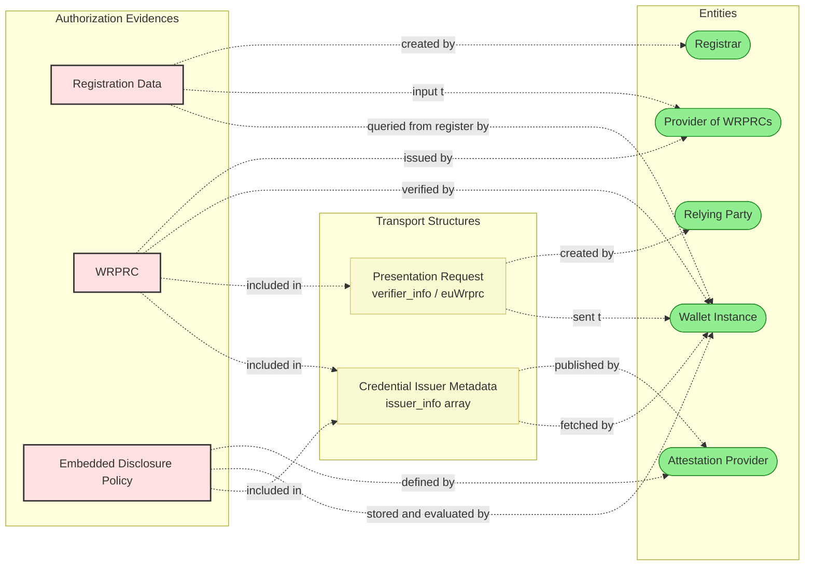
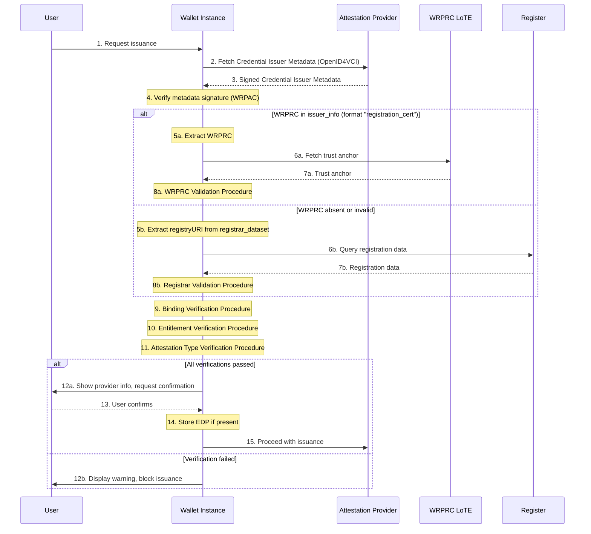
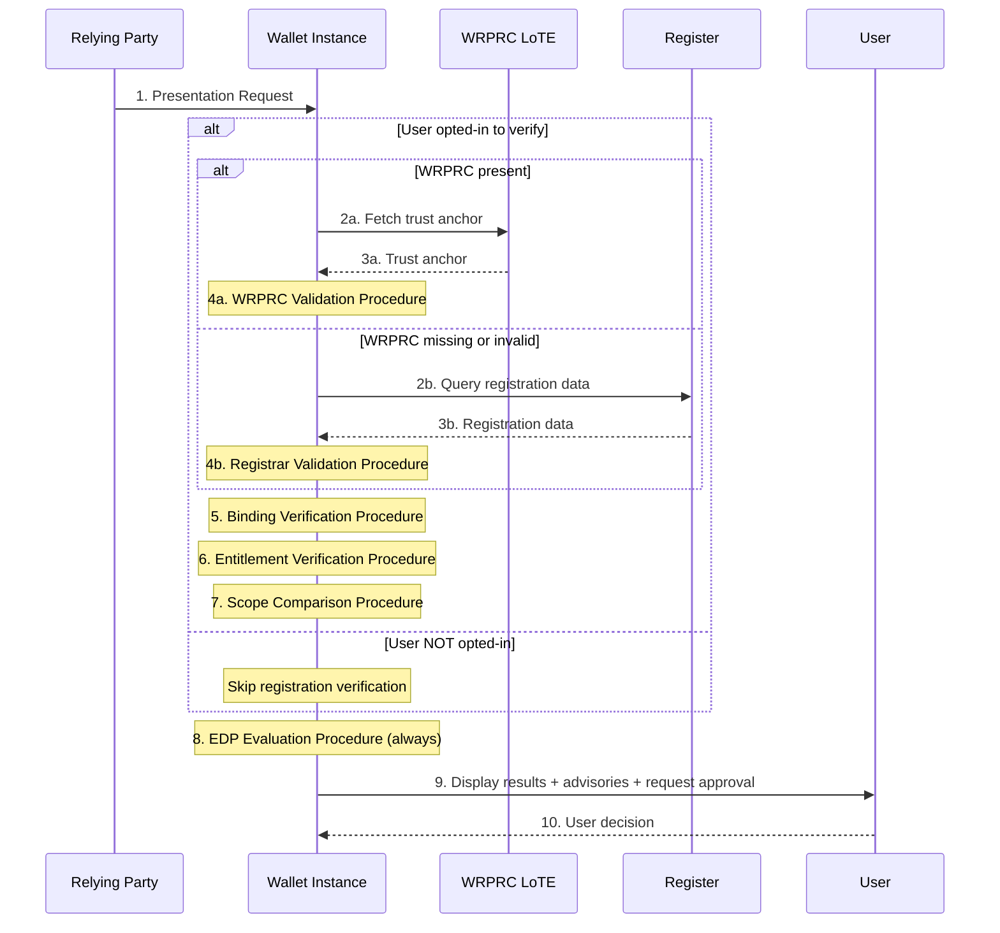
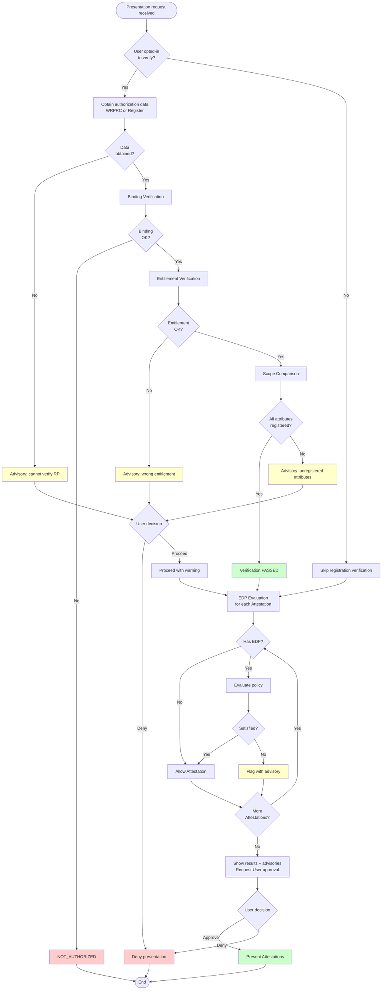

# Authorization Process

# Scope

This section specifies the authorization process that a Wallet Instance (WI) SHALL execute to determine whether an interaction with a Wallet-Relying Party (WRP) is allowed within the EUDI Wallet ecosystem. A wallet Instance SHALL implement all the authorization-processing rules defined in this section [AUTHZ-GEN-03].

Authorization covers:

- **Issuance authorization**: whether a PID Provider or Attestation Provider (AP) is registered for the relevant role and for the specific attestation type(s) to be issued. This applies to PID Providers, QEAA Providers, PuB-EAA Providers, and non-qualified EAA Providers.
- **Presentation authorization**: whether a Relying Party (RP) request is within its registered scope, whether any Embedded Disclosure Policy permits disclosure, and whether the User approves. This applies to both direct RP and intermediated RP interactions, and both remote and proximity flows.

## Out of scope

Authentication process is out of scope. This section does not define access certificate validation rules, LoTE validation procedures, certificate-path validation algorithms, revocation checking procedures for access certificates, the full trust-anchor validation model, nor the internal structure and encoding of the WRPRC (covered in section [Registration Certificate](registration-certificate.md)), nor Registrar online service API definition.

## Preconditions

The authorization process SHALL start only after the WRP has been successfully authenticated according to the applicable specifications (see section [Authentication Process](authentication-process.md)) [AUTHZ-GEN-01]. If the WRP has not been authenticated, the authorization process SHALL NOT start [AUTHZ-GEN-02].
This section does define how the WI SHALL use the already-authenticated WRP context as an input to authorization, including binding checks between the authenticated WRP, the authorization subject, and the WRPRC or Register-derived authorization context.

# Authorization Framework

This subsection defines the conceptual model that defines all authorization decisions. It introduces the key concepts (authorization subject, data source hierarchy, decision outcomes, and override principles) that the subsequent subsections build upon.

## Authentication prerequisite and authorization subject

The WI SHALL distinguish between the authenticated WRP and the authorization subject [AUTHZ-GEN-04]. The authorization subject is the entity whose authorization is being evaluated:

- In issuance: the PID Provider or AP.
- In direct presentation: the RP.
- In intermediated presentation: the final (intermediated) RP. The authenticated WRP in this case is the intermediary.

## Source-model neutrality

The WI SHALL support authorization-context resolution from a WRPRC (where available) and from the Register (where a WRPRC is not available or cannot be relied upon) [AUTHZ-GEN-05]. The substantive authorization logic SHALL NOT change based on the data source [AUTHZ-GEN-06]. Where both sources are available, the WI SHALL normalize both into the same internal authorization model before applying rules [AUTHZ-GEN-07].

## Input model

The WI SHALL base authorization decisions only on information derived from [AUTHZ-IN-01]: 

- Already authenticated WRP context.
- A verified WRPRC or a verified Register response.
- Explicitly identified self-declared fallback information.
- A verified EDP, if provided by AP during issuance.

The WI SHALL maintain an internal distinction between the following input classes [AUTHZ-IN-02]:

- **Authenticated WRP context**: authoritative only for the identity of the WRP [AUTHZ-IN-03].
- **Verified WRPRC-derived or Register-derived information**: authoritative for subject identity, entitlements, intended use, registered scope, intermediary relationship, issuance-type information, and privacy-policy references [AUTHZ-IN-04 and AUTHZ-IN-05].
- **Self-declared information**: non-authoritative. The WI SHALL NOT rely solely on self-declared information for checks that require registered information [AUTHZ-IN-06].
- **Verified EDP**: authoritative only if available. The WI SHALL rely on RP information to determine access permission [AUTHZ-EDP-06].

Where authoritative sources conflict with non-authoritative sources, the authoritative sources SHALL supersede [AUTHZ-IN-07]. Where the authenticated WRP context conflicts with the identity or intermediary binding in the verified authorization context, the WI SHALL produce `NOT_AUTHORIZED` (non-overridable) [AUTHZ-IN-08].

A request-carried Registrar URL SHALL NOT be treated as sufficient proof of registered information by itself; it MAY be used only as a discovery hint unless confirmed by an authoritative source [AUTHZ-IN-09].

## Decision model

The WI SHALL provide an authorization decision expressed as `AUTHORIZED` or `NOT_AUTHORIZED` [AUTHZ-UI-01].

Each evaluation procedure (defined later in this section) gives a granular verification result code when it detects a negative condition. These codes feed into the final decision and into the advisories presented to the User.

| Code | Phase | Meaning |
|------|-------|---------|
| `CERTIFICATE_INVALID` | Both | WRPRC validation failed |
| `FAILED` | Both | Registration data could not be obtained or verified |
| `WRONG_ENTITLEMENT` | Both | Entity entitlement does not match expected role |
| `ATTESTATION_TYPE_NOT_REGISTERED` | Issuance | Requested attestation type is not in registered list |
| `BINDING_FAILED` | Both | Authorization subject does not match authenticated identity |
| `INTERMEDIARY_NOT_AUTHORIZED` | Presentation | Intermediary association verification failed |
| `VERIFICATION_PASSED` | Presentation | All requested attributes are registered |
| `OVERASKING_DETECTED` | Presentation | Some requested attributes are not registered |
| `EDP_SATISFIED` | Presentation | Embedded Disclosure Policy conditions met |
| `EDP_NOT_SATISFIED` | Presentation | Embedded Disclosure Policy conditions not met |

The authorization process SHALL support transparent decision-making and SHALL NOT be a purely hidden backend check [AUTHZ-UI-05].

## Override principles

A `NOT_AUTHORIZED` decision can be either non-overridable (the WI blocks the interaction) or overridable (the WI presents the negative outcome and the User can choose to proceed).

In **issuance** phase, all negative verification outcomes are non-overridable: the WI protects the User from providers whose registration cannot be confirmed (per ISSU_24a, ISSU_34a, ISSU_34b). 

In **presentation** phase, two specific cases are overridable: 

1. Negative scope comparison (per RPRC_21: the User is informed of unregistered attributes but can proceed).
2. Negative EDP evaluation (per EDP_07: the User can deny or allow). 
 
All other presentation failures  (binding failures and intermediary binding failures) are non-overridable because they indicate an integrity problem rather than a user-facing choice.

In case of non-overridable failures, the WI SHALL clearly inform the User about the negative outcome. User-relevant information about overridable outcomes SHALL be presented as advisories, and the User approval SHALL be a separate step from the authorization decision [AUTHZ-UI-02, AUTHZ-UI-03, AUTHZ-UI-04].

> [!NOTE]
> **User opt-in:** the *Scope Comparison Procedure* is executed only if the User enabled registration verification (RPRC_16). Override mechanisms define what happens when the procedure produces a negative result.

The detailed override rules are provided in the [Override Rules](#override-rules) section.

# Authorization Evidences

This section describes the data objects that carry authorization information such as where they originate, how they are distributed, and what parameters are relevant for authorization decisions. The evaluation procedures that operate on these data objects are defined in the section [Evaluation Procedures](#evaluation-procedures).

## Registration overview

WRPs are registered with a Registrar in their Member State before operating in the EUDI Wallet ecosystem. Relying Parties declare one or more intended uses, each with a user-friendly description, the attestation type and optionally the list of attributes needed, the purpose, and a privacy policy link. A WRPRC is issued for each intended use (RPRC_09). Attestation Providers declare which attestation types they intend to issue (RPRC_15, RPRC_22a). Intermediaries are registered as RPs that act on behalf of another RPs; the WRPRC of the intermediated RP contains the `intermediary` structure identifying the authorized intermediary per ETSI TS 119 475 Table 10.

## Data object lifecycle

The following diagram shows the authorization evidences and how they flow between the entities in the ecosystem.

Registration data is collected at the Registrar and the Provider of WRPRCs get it from Registrar to provide it through a WRPRC. Registration data can also be queried directly by the WI using Registrar online services as a fallback mechanism. WRPRCs are distributed to the WI through presentation requests (for RPs) or through Credential Issuer Metadata (for APs). EDPs are defined by the AP, distributed through Credential Issuer Metadata, stored locally by the WI during issuance, and evaluated at presentation time.

## WRPRC parameters for authorization

The following table lists the WRPRC payload parameters used in authorization processing, with field names as defined in ETSI TS 119 475 V1.2.1 section 5.2.4. Details about the WRPRC data structure and lifecycle are provided in section [Registration Certificate](registration-certificate.md). 
The **Authorization Use** column indicates how each parameter is consumed: **Decision rule** means the WI enforces an automated check, **User transparency** means the information is displayed to support the User's decision, and **Wallet operation** means the WI uses it internally (e.g. for fallback query).

| Field | Applicability | Authorization Use | Reference |
| :---- | :------------ | :---------------- | :-------- |
| `sub` | WRPs (REQUIRED) | **Decision rule**: binding verification; entity identification for EDP evaluation | ETSI 475 Table 7, RPRC_07 |
| `sub_ln` | WRPs (REQUIRED) | **User transparency**: legal name displayed to User | ETSI 475 Table 7, CIR 2025/848 Annex I.1 |
| `name` | WRPs (OPTIONAL) | **User transparency**: trade name displayed to User | ETSI 475 Table 7, CIR 2025/848 Annex I.2 |
| `entitlements` | WRPs (REQUIRED) | **Decision rule**: entitlement verification against expected role | ETSI 475 Table 7, Annex A.2, ISSU_24a, ISSU_34a |
| `srv_description` | WRPs (REQUIRED) | **User transparency**: service description displayed to User | ETSI 475 Table 7, CIR 2025/848 Annex I.8 |
| `registry_uri` | WRPs (REQUIRED) | **Wallet operation**: Registrar URL for fallback query | ETSI 475 Table 7, RPRC_18 |
| `support_uri` | WRPs (REQUIRED) | **User transparency**: support contact for rights and data deletion | ETSI 475 Table 7, CIR 2025/848 Annex I.7(a) |
| `supervisory_authority` | WRPs (REQUIRED) | **User transparency**: DPA information displayed to User | ETSI 475 Table 7, CIR 2025/848 Annex IV.3(g) |
| `public_body` | WRPs (OPTIONAL) | **User transparency**: public sector identification shown to User | ETSI 475 Table 10, CIR 2025/848 Annex I.11 |
| `privacy_policy` | RPs (REQUIRED if IntendedUse is present) | **User transparency**: privacy policy link displayed to User | ETSI 475 Table 9 |
| `purpose` | RPs (REQUIRED if IntendedUse is present) | **User transparency**: purpose description displayed to User | ETSI 475 Table 9, RPRC_18 |
| `intended_use_id` | RPs (OPTIONAL) | **Wallet operation**: Registrar query key for intended-use lookup | ETSI 475 Table 9, RPRC_19a |
| `credentials[]` | RPs (OPTIONAL) | **Decision rule**: scope comparison bertween `claim[]` paths and `meta.vct_values`/`doctype_value` and requested attributes | ETSI 475 Table 9, RPRC_09, RPRC_21 |
| `provides_attestations[]` | APs (REQUIRED) | **Decision rule**: attestation type verification of registered types against requested type during issuance | ETSI 475 Table 8, RPRC_15, RPRC_23, ISSU_34b |
| `intermediary` | WRPs (OPTIONAL) | **Decision rule**: `intermediary.sub` used to check against authenticated intermediary identity | ETSI 475 Table 10, CIR 2025/848 Annex I.14 |
| `status` | WRPs (REQUIRED) | **Decision rule**: WRPRC revocation check via Status List | ETSI 475 GEN-6.2.6.1-04, RPRC_17 |
| `iat` / `exp` | WRPs (REQUIRED) | **Decision rule**: temporal validity check | ETSI 475 |

## Distribution Methods

**Presentation flows.** RPs include the WRPRC in the presentation request by value (RPRC_19) in the: 

- `verifier_info` parameter included in the Request Object JWT within the authorization request (remote flow, ETSI TS 119 472-2 and OpenID4VP section 5.1). This is an array of JSON Objects containg WRPRC in base64-encoded format and RPRC_19a data including the URL of Registrar online service.
- `euWrprc` (CBOR byte string with serialized WRPRC) member of `requestInfo` included in the ISO DeviceRequest (proximity flow, ETSI TS 119 472-2 section 5.3). 

> [!WARNING]
> Currently, the mapping of RPRC_19a data in the `requestInfo` map is not defined in ETSI TS 119 472-2 

**Issuance flow.** APs include authorization data in Credential Issuer Metadata through the `issuer_info` array (ETSI TS 119 472-3 section 4.2.3). This array contains: 

- An element with format `"registration_cert"` containing the WRPRC by value (ISS-MDATA-REG_CERT-4.2.3-04/05) (OPTIONAL).
- An element with format `"registrar_dataset"` containing self-declared registration information including `identifier`, `srvDescription`, `registryURI`, and `providesAttestations` (ISS-MDATA-REG_CERT-4.2.3-07 through 13) (REQUIRED). 

Metadata is signed with the AP WRPAC private key (ISSU_22a). Authorization data cointained in the EDP is also distributed through Credential Issuer Metadata within `credential_configurations_supported` field.

## Registrar online service

Each Registrar provides an online service accessible via URL, obtained as described in the [Distribution Methods](#distribution-methods) section.

The WI SHALL use this service when the WRPRC is not available or validation fails. The service is queried using the entity unique identifier and, for presentation, the `intended_use_id`. The response provides the same authorization-relevant data as a WRPRC. Registrar online service is available through an API interface which is defined in TS5.

> [!NOTE]
> The WI SHOULD inform the User that an external query will be made (privacy consideration per RPRC_18).

## Embedded Disclosure Policy

The EDP is a set of rules defined by the AP that restricts which RPs can access specific Attestations. The EDP definition, data model, structure, encoding, and lifecycle are specified in the dedicated [Embedded Disclosure Policy](embedded-disclosure-policy.md) section of this specification.

For authorization purposes, the following aspects are relevant:

- EDPs are applicable to QEAAs, PuB-EAAs, and non-qualified EAAs. They are not applicable to PIDs [AUTHZ-EDP-01].
- During issuance, when the User confirms, the WI SHALL retrieve and store locally the EDP if present in the Credential Issuer Metadata [AUTHZ-EDP-02].
- At presentation time, for each Attestation matching a request, the WI SHALL check its locally stored EDP and evaluate it against the requesting RP according to the [EDP Evaluation Procedure](#edp-evaluation-procedure) defined in this section.
- Annex III of CIR 2024/2979 defines three policy types that the WI SHALL support. In particular: 
  - No Policy. 
  - Authorized Relying Parties Only.
  - Specific Root of Trust.

# Evaluation Procedures

This section defines the individual verification procedures that are composed into end-to-end flows in the [Operational Flows](#operational-flows) section. Each procedure is self-contained: it specifies its inputs, its processing logic, and its output (a verification result code). The override behaviour for each procedure's negative outcome is detailed in the [Override Rules](#override-rules) section.

## WRPRC Validation Procedure

When a WRPRC is available, the WI SHALL validate it before relying on it [AUTHZ-GEN-08]:

1. **Format verification**: confirm `typ` is `rc-wrp+jwt` (remote) or `rc-wrp+cwt` (proximity)  (ETSI TS 119 475 section 5.2.1).
2. **Algorithm verification**: verify the conformance of signature algorithm (neither `"none"` nor deprecated).
3. **Signature and Certificate chain validation**: verify the WRPRC signature and validate the chain.
4. **Trust anchor resolution**: fetch the trust anchor for the Provider of WRPRCs from LoTE. The WI SHALL accept trust anchors from all Provider of WRPRCs LoTE (ISSU_33a).
5. **Temporal validity**: check `iat` and `exp` (if present).
6. **Status verification**: check revocation status via the `status` field (RPRC_17).
7. **Coherence check**: verify WRPRC subject and fields are coherent with the scenario [AUTHZ-GEN-09].

If any step fails, the procedure outputs `CERTIFICATE_INVALID`. This is not a final authorization decision; it triggers the [Registrar Validation Procedure](#registrar-validation-procedure) as fallback.

## Registrar Validation Procedure

When the WRPRC is not available or validation has failed, the WI SHALL attempt the Registrar [AUTHZ-GEN-10]:

1. **Extract Registrar URL** from the presentation request (`verifier_info` in remote scenario or `requestInfo` in proximity scanario) during presentation flow, or from Credential Issuer Metadata (`issuer_info.registry_uri`) during issuance flow. See [Distribution Methods](#distribution-methods) section for details. 
2. **Connect** using HTTPS with TLS validation per TS5.
3. **Query** using entity identifier and `intended_use_id` (presentation) or AP identifier (issuance).
4. **Validate** response authenticity, integrity, and pertinence [AUTHZ-REG-01], [AUTHZ-REG-02].
5. **Normalize** Register-derived data into the same internal model used for WRPRC data [AUTHZ-REG-03].

If the URL is not present, connection fails, or validation fails, the procedure outputs `FAILED` [AUTHZ-REG-04].

**Three-tier fallback (issuance only)** (ISSU_24a and ISSU_34a): self-declared data from `registrar_dataset` (advisory only, SHALL NOT be presented as verified) [AUTHZ-IN-10].

## Binding Verification Procedure

The WI SHALL verify coherence between the authenticated WRP identity and the authorization context, regardless of whether the authorization context is derived from a WRPRC or from the Register [AUTHZ-GEN-11]. This procedure ensures that the authenticated entity (through WRPAC) is the same as the entity described in the authorization data.

### Common principle

The WI SHALL compare the WRP identifier extracted from the WRPAC subject (the `organizationIdentifier` in the subject DN, following ETSI EN 319 412-1 clause 5.1.4) against the authorization subject identifier available from:

- the WRPRC `sub` field (if available). 
- The authorization data (RPRC_19a) extracted from authentication request (`verifier_info` or `requestInfo`) in presentation scenario or in `registrar_dataset` field in issuance scenario.
- The Register response (if queried). 

All available sources SHALL be mutually consistent.

### Issuance binding

In issuance, the WI SHALL verify that the AP that signed the Credential Issuer Metadata (identified by the WRPAC in the `x5c` header of the JWS) is the same entity described in the authorization data [AUTHZ-GEN-11]. The WI SHALL check coherence between:

- The AP identifier from the WRPAC subject (extracted during metadata signature verification).
- The `sub` field from the WRPRC in `issuer_info` (if present).
- The `identifier` field from the `registrar_dataset` element in `issuer_info` (if present).

If any pair of these identifiers is inconsistent, the procedure outputs `BINDING_FAILED`. Intermediary detection does not apply to issuance.

### Presentation binding -- intermediary detection

In presentation, before verifying binding, the WI SHALL check whether the interaction is direct or intermediated [AUTHZ-INT-01] by comparing:

- The **authenticated WRP identifier**, extracted from the WRPAC subject DN.
- The **claimed RP identifier**, extracted from the presentation request fields according to RPRC_19a (item b). Following RPI_06, in an intermediated scenario these fields pertain to the intermediated RP.

If the two identifiers match, the **direct RP scenario** applies. If they differ, the **intermediary scenario** applies. 

### Direct RP binding

In the direct RP scenario, the WI SHALL verify that the WRPRC (if present in `verifier_info` or `requestInfo`) is coherent with the already-established identities [AUTHZ-GEN-12]:

- The WRPRC `sub` field SHALL match the authenticated WRP identifier and the claimed RP identifier from authorization data (RPRC_19a).

If the WRPRC `sub` does not match, the WRPRC is not valid for this RP. The procedure outputs `BINDING_FAILED` and the WI SHALL discard the WRPRC and fall back to the [Registrar Validation Procedure](#registrar-validation-procedure).

### Intermediary binding

In the intermediary scenario, the WI SHALL perform the following verifications [AUTHZ-INT-02]:

**Step 1: Identify the parties.** The WI identifies:

- The **intermediary**: the entity that authenticated via WRPAC. Its identifier is extracted from the WRPAC subject DN.
- The **intermediated (final) RP**: the authorization subject. Its identifier and other data are obtained from the WRPRC `sub` field and/or from the presentation request fields.

**Step 2: Verify intermediary association.** The WI SHALL verify that the intermediary is authorized to act on behalf of the intermediated RP. The verification depends on the available data source:

- **If a valid WRPRC is available**: the WRPRC of the intermediated RP SHALL contain the `intermediary` structure (per ETSI TS 119 475 Table 10). The WI SHALL verify that `intermediary.sub` matches the authenticated intermediary identifier from the WRPAC. The presence of the `intermediary` field in the WRPRC, signed by the Provider of WRPRCs, is authoritative evidence that the relationship is registered.
- **If the WRPRC is not available or invalid**: the WI SHALL query the Register using the intermediated RP identifier (from RPRC_19a item b) and verify in the Register response that the authenticated intermediary is listed as an authorized intermediary for that RP.
- **If both WRPRC and Register verification fail**: the WI SHALL NOT confirm the intermediary relationship.

On failure of intermediary association verification, the procedure outputs SHALL be `INTERMEDIARY_NOT_AUTHORIZED` [AUTHZ-INT-03].

**Step 3: Verify authorization subject coherence.** The WI SHALL additionally verify that the intermediated RP identifier is consistent across all available sources: the WRPRC `sub` field (if available), the presentation request fields per RPRC_19a, and the Register response (if queried). If any inconsistency is found, the procedure SHALL output `BINDING_FAILED`.

**Step 4: Apply authorization context.** Once the intermediary association is confirmed, all subsequent authorization checks (entitlement verification, scope comparison, EDP evaluation) SHALL use the intermediated RP data, not the intermediary data [AUTHZ-INT-02].

**Step 5: Display both identities.** The WI SHALL display to the User both the intermediary identity and the intermediated RP identity (RPI_07). The display SHOULD follow the pattern: "[intermediary name] acting on behalf of [intermediated RP name] for [intended use description]". 
The names are obtained from:

- Intermediary: `intermediary.sname` from the WRPRC, or the intermediary name from the Register response.
- Intermediated RP: `name` (or `sub_ln`) from the WRPRC, or the RP name from the presentation request fields per RPRC_19a (item a), or the Register response.

If any name is not available, the WI SHALL display the identifier instead of the name.

> [!WARNING]
> ETSI TS 119 475 V1.2.1 Table 10 defines the intermediary name subfield 
> as `sname`. The example in Annex C of the same standard uses `name` 
> instead. This specification follows the normative Table 10 and uses 
> `sname`.

> [!NOTE]
> The Registrar online service API, including the specific parameters for querying intermediary relationships, is defined in TS5. This specification does not define the Register API; it only defines how the WI uses the Register response for authorization purposes.

## Entitlement Verification Procedure

The WI SHALL verify that the entitlements of the authorization subject match the expected role [AUTHZ-GEN-13].

For **issuance**, the expected entitlement depends on the provider type:

| Request type | Expected entitlement URI |
|-------------|-------------------------|
| PID | `https://uri.etsi.org/19475/Entitlement/PID_Provider` |
| QEAA | `https://uri.etsi.org/19475/Entitlement/Q_EAA_Provider` |
| PuB-EAA | `https://uri.etsi.org/19475/Entitlement/PuB_EAA_Provider` |
| Non-qualified EAA | `https://uri.etsi.org/19475/Entitlement/Non_Q_EAA_Provider` |

For **presentation**, the expected entitlement is `https://uri.etsi.org/19475/Entitlement/Service_Provider`.

If the `entitlements` array does not contain the expected value, the procedure SHALL output `WRONG_ENTITLEMENT`.

## Attestation Type Verification Procedure (issuance only)

The WI SHALL verify that the PID or attestation type being requested is registered for the provider [AUTHZ-ISS-02]:

- For PID Providers issuing PIDs, the WI MAY skip this step.
- Otherwise, the WI SHALL match the `provides_attestations[]` array against the `credential_configurations_supported` keys in Credential Issuer Metadata. Matching SHALL be case-sensitive and exact (VCT value for SD-JWT VC, doctype for mDL).

If not found, the procedure SHALL output `ATTESTATION_TYPE_NOT_REGISTERED`.

## Scope Comparison Procedure (presentation only, user-optional)

The WI SHALL [AUTHZ-PRES-01]:

1. Extract requested attributes: from `credential_queries[].claims[]` (remote/DCQL) or from `namespaces` (proximity).
2. Compare against registered scope: match `credentials[].claim[]` and `credentials[].meta.vct_values` or `doctype_value` in the authorization context. Matching SHALL be case-sensitive and exact.

If all match, the WI SHALL output `VERIFICATION_PASSED`. Otherwise, the WI SHALL output `OVERASKING_DETECTED` and identify the unregistered attributes [AUTHZ-PRES-02].

## EDP Evaluation Procedure

For each Attestation matching a presentation request, the WI SHALL check for a locally stored EDP [AUTHZ-EDP-03]. If no EDP exists, the Attestation is allowed (subject to User approval). Otherwise:

In case of **Authorized Relying Parties Only** policy type[AUTHZ-EDP-04]: 
- Detect intermediary scenario. 
- Extract the identity information of the RP (direct) or intermediated RP. The WI SHALL NOT use intermediary identity. 
- Match against the `authorized_parties` list comparing the RP subject DN from WRPAC against `subject_dn` entries (using LDAP DN comparison rules as defined in RFC 4514). 

If the checks are successful, the WI SHAL provide `EDP_SATISFIED` as output result, otherwise the WI SHALL provide `EDP_NOT_SATISFIED`.

In case of **Specific Root of Trust** policy type [AUTHZ-EDP-05] and according to direct/intermediary scenario: 

- For direct RP, the WI SHALL extract issuer DN and serial number from the root or intermediate certificates in the WRPAC chain. 
- For intermediary, the WI SHALL retrieve root certificate information of the Provider of WRPRCs for the intermediated RP. Then, the WI SHALL compare against the `trusted_roots` list and match `issuer_dn` using LDAP DN comparison and `serial_number` using integer comparison (as defined ISS-MDATA-EBD-4.2.5.2-09). If the check is satisfied, the WI SHALL output: `EDP_SATISFIED` or `EDP_NOT_SATISFIED`.

The WI SHALL evaluate EDP together with RP information to determine access permission (EDP_06) [AUTHZ-EDP-06]. 
If `EDP_SATISFIED`, the WI SHALL allow the Attestation (subject to User approval) and display explanatory link if present (EDP_05) [AUTHZ-EDP-07]. 
If `EDP_NOT_SATISFIED`, the WI SHALL produce `NOT_AUTHORIZED`, present the outcome, and allow User override (EDP_07) [AUTHZ-EDP-08]. 
If the User denies, the WI SHALL behave as if the Attestation does not exist (RPA_11).

# Override Rules

This section details the override behaviour for each procedure when it provides a negative outcome. Each row identifies a procedure, the phase in which it applies, the result code produced on failure, and whether the User can override that outcome.

| Evaluation Procedure | Phase | Negative Outcome | User Override |
|---------------------|-------|-----------------|---------------|
| WRPRC Validation | Both | `CERTIFICATE_INVALID` | It triggers *Registrar Validation* as fallback. User is not involved |
| Registrar Validation | Issuance | `FAILED` | Non-overridable [AUTHZ-ISS-01], [AUTHZ-UI-06] |
| Registrar Validation | Presentation | `FAILED` | Overridable. Advisory to User [AUTHZ-PRES-06] |
| Binding Verification | Issuance | `BINDING_FAILED` | Non-overridable [AUTHZ-UI-06] |
| Binding Verification (direct RP) | Presentation | `BINDING_FAILED` | Non-overridable [AUTHZ-UI-06] |
| Binding Verification (intermediary) | Presentation | `INTERMEDIARY_NOT_AUTHORIZED` | Non-overridable [AUTHZ-INT-03], [AUTHZ-UI-06] |
| Entitlement Verification | Issuance | `WRONG_ENTITLEMENT` | Non-overridable [AUTHZ-ISS-01], [AUTHZ-UI-06] |
| Entitlement Verification | Presentation | `WRONG_ENTITLEMENT` | Overridable. Advisory to User |
| Attestation Type Verification | Issuance | `ATTESTATION_TYPE_NOT_REGISTERED` | Non-overridable [AUTHZ-ISS-03], [AUTHZ-UI-06] |
| Scope Comparison | Presentation | `OVERASKING_DETECTED` | Overridable. Advisory to User [AUTHZ-PRES-02] |
| EDP Evaluation | Presentation | `EDP_NOT_SATISFIED` | Overridable. User can deny or allow [AUTHZ-EDP-08] |

# Operational Flows

This section combines the evaluation procedures defined above into end-to-end flows for issuance and presentation. 

## Authorization during Issuance

### Interaction flow

### Step-by-step operations

**Steps 1-3: Obtain Credential Issuer Metadata.** The WI SHALL fetch metadata from the AP using OpenID4VCI (ISSU_01) [AUTHZ-ISS-04]. These steps are not required if the WI already has the Credential Issuer Metadata stored locally, for example if it is already fetched during authentication process.

**Step 4: Verify metadata signature.** The WI SHALL verify the metadata signature and WRPAC certificate chain [AUTHZ-ISS-05]. If verification fails, the WI provides `NOT_AUTHORIZED` code (non-overridable) [AUTHZ-ISS-06].

**Steps 5-8: Extract authorization data.** The WI SHALL extract data from the `issuer_info` array [AUTHZ-ISS-07]. If a WRPRC is present (steps 5a-8a), apply the *WRPRC Validation Procedure*. If absent or invalid (steps 5b-8b), apply the *Registrar Validation Procedure*. If both fail, apply the three-tier fallback; self-declared data SHALL be treated as advisory only [AUTHZ-ISS-08], [AUTHZ-ISS-09].

**Step 9: Binding verification.** Apply the *Binding Verification Procedure* (issuance binding): verify that the AP identifier from the WRPAC (used to sign the metadata) is coherent with the `sub` in the WRPRC and the `identifier` in the `registrar_dataset` [AUTHZ-GEN-11]. If incoherent, the WI returns `NOT_AUTHORIZED` code (non-overridable).

**Step 10: Entitlement verification.** Apply the *Entitlement Verification Procedure*. If not confirmed, the WI provides `NOT_AUTHORIZED` code(non-overridable) [AUTHZ-ISS-01].

**Step 11: Attestation type verification.** Apply the *Attestation Type Verification Procedure*. If not found, the WI returns `NOT_AUTHORIZED` code (non-overridable) [AUTHZ-ISS-02], [AUTHZ-ISS-03].

**Steps 12-15: User confirmation and EDP storage.** Display AP information [AUTHZ-ISS-10], [AUTHZ-UI-09]. On confirmation, the WI store EDP locally if present (EDP_09) [AUTHZ-EDP-02] and proceed. On cancellation, terminate.

## Authorization during Presentation

### Common authorization semantics

The authorization logic is the same for remote and proximity flows [AUTHZ-PRES-03]. Main Differences are limited to: 

- Transport mechanism.
- Where the WRPRC is extracted from.
- WRPRC format (JWT vs CWT).
- WRPRC data structure.

### Interaction flow

### Step-by-step operations

**Step 1: Receive request and check User opt-in.** The WI SHALL offer a User setting for RP verification, enabled by default [AUTHZ-PRES-04]. If opted-in, proceed to step 2. Otherwise skip to step 8.

> [!NOTE]
> If opted-in, the WI executes the full registration verification block: evidence collection, binding verification, entitlement verification, and scope comparison (steps 2-7). If not opted-in, the WI skips these steps and proceeds directly to EDP evaluation (step 8), which is always executed.

**Steps 2-4: Collect authorization evidence.** Extract the WRPRC from the request [AUTHZ-PRES-05]: from `verifier_info` (remote) or `euWrprc` in `requestInfo` (proximity). If present, apply the *WRPRC Validation Procedure*. If absent or invalid, apply the *Registrar Validation Procedure* using `registry_uri` from the request extension and the RP identifier with `intended_use_id`. If lookup fails, notify User, record `FAILED`, proceed with advisory [AUTHZ-PRES-06].

**Step 5: Binding verification.** Apply the *Binding Verification Procedure* (direct or intermediary) [AUTHZ-PRES-07].

**Step 6: Entitlement verification.** Apply the *Entitlement Verification Procedure* for `Service_Provider` [AUTHZ-PRES-08].

**Step 7: Scope comparison.** Apply the *Scope Comparison Procedure*. Inform User of results [AUTHZ-PRES-09].

**Step 8: EDP evaluation.** Always executed regardless of registration verification [AUTHZ-EDP-09]. Apply the *EDP Evaluation Procedure* for each matching Attestation.

**Steps 9-10: User approval.** Present all results and request approval [AUTHZ-UI-07], [AUTHZ-UI-10]. Display at least [AUTHZ-UI-08],[AUTHZ-INT-05]:
- RP/final RP identity, 
- intermediary identity where applicable, 
- requested attributes, 
- intended-use description, 
- privacy-policy link,  
- advisories.

If `AUTHORIZED`, the WI SHALL proceed to normal User approval. If `NOT_AUTHORIZED` and override is allowed, the WI SHALL present the negative outcome and MAY allow continuation [AUTHZ-UI-11]. If `NOT_AUTHORIZED` and override is not allowed, the WI SHALL NOT allow continuation [AUTHZ-UI-12].

### Remote flow specifics

The RP Instance SHALL include RPRC_19a extension fields and, if available, the WRPRC by value (RPRC_19) [AUTHZ-PRES-10]. The WRPRC SHALL be JWT (`typ = "rc-wrp+jwt"`). Requested attributes SHALL be extracted from DCQL `credential_queries[].claims[]` paths.

### Proximity flow specifics

The WRPRC is extracted from `euWrprc` in `requestInfo` according to ETSI TS 119 472-2 [AUTHZ-PRES-11]. The WRPRC SHALL be CWT (`typ = "rc-wrp+cwt"`), signing algorithm from COSE header. Requested attributes SHALL be extracted from `docRequest.itemRequest.nameSpaces`.

### Intermediary handling

Intermediary handling applies to both flows [AUTHZ-INT-04]. The WI SHALL: 
- Authenticate the intermediary through its Access Certificate 
- Detect the intermediary scenario.
- Apply all authorization checks using the intermediated RP context. 
- Display both identities (RPI_07). 

Negative cases SHALL result in `NOT_AUTHORIZED` code [AUTHZ-INT-06]. Override is allowed only for negative scope and negative EDP [AUTHZ-INT-07].

### Combined mechanisms flowchart

# Annex A -- Authorization Requirements

> **Note**: This table is provided for implementation and conformance-verification purposes. It consolidates the normative requirements defined throughout the specification body. In case of interpretative ambiguity between this table and the normative sections of the specification, the normative sections SHALL prevail.

| ID | Requirement | Phase | Related HLRs |
|----|-------------|-------|-------------|
| AUTHZ-GEN-01 | The authorization process SHALL start only after the WRP has been successfully authenticated. | Both | -- |
| AUTHZ-GEN-02 | If the WRP has not been authenticated, the authorization process SHALL NOT start. | Both | -- |
| AUTHZ-GEN-03 | A conformant wallet SHALL implement all authorization-processing rules defined in this specification. | Both | -- |
| AUTHZ-GEN-04 | The WI SHALL distinguish between the authenticated WRP and the authorization subject. | Both | -- |
| AUTHZ-GEN-05 | The WI SHALL support authorization-context resolution from WRPRC and Register. | Both | RPRC_16, RPRC_18 |
| AUTHZ-GEN-06 | The authorization logic SHALL NOT change based on the data source. | Both | -- |
| AUTHZ-GEN-07 | Where both WRPRC and Register data are available, the WI SHALL normalize both into the same model. | Both | -- |
| AUTHZ-GEN-08 | When a WRPRC is available, the WI SHALL validate its authenticity, integrity, temporal validity, and status before relying on it. | Both | RPRC_17 |
| AUTHZ-GEN-09 | WRPRC validation SHALL include coherence check between WRPRC subject and scenario context. | Both | -- |
| AUTHZ-GEN-10 | When WRPRC is not available or validation failed, the WI SHALL attempt the Registrar. | Both | RPRC_18 |
| AUTHZ-GEN-11 | The WI SHALL verify coherence between authenticated WRP and authorization context in both issuance and presentation. | Both | -- |
| AUTHZ-GEN-12 | For direct RP in presentation, the WI SHALL verify RP identifier from WRPAC matches `sub` in authorization context and RPRC_19a identifier. For issuance, the WI SHALL verify AP identifier from WRPAC matches `sub` in WRPRC and `identifier` in registrar_dataset. | Both | RPRC_07, RPRC_08 |
| AUTHZ-GEN-13 | The WI SHALL verify that entitlements match the expected role. | Both | ISSU_24a, ISSU_34a |
| AUTHZ-IN-01 | Authorization decisions SHALL be based only on authenticated context, verified WRPRC, verified Register, verified EDP, or identified self-declared fallback. | Both | -- |
| AUTHZ-IN-02 | The WI SHALL maintain internal distinction between input classes. | Both | -- |
| AUTHZ-IN-03 | Authenticated WRP context is authoritative only for WRP identity. | Both | -- |
| AUTHZ-IN-04 | Verified WRPRC-derived information is authoritative for subject identity, entitlements, scope, etc. | Both | -- |
| AUTHZ-IN-05 | Verified Register-derived information is authoritative for the same data set. | Both | -- |
| AUTHZ-IN-06 | The WI SHALL NOT rely solely on self-declared information for checks requiring registered information. | Both | ISSU_24a note, ISSU_34a note |
| AUTHZ-IN-07 | Authoritative sources SHALL prevail over non-authoritative sources. | Both | -- |
| AUTHZ-IN-08 | Identity conflict between authenticated context and authorization context produces NOT_AUTHORIZED (non-overridable). | Both | -- |
| AUTHZ-IN-09 | A request-carried Registrar URL SHALL NOT be treated as proof of registration; MAY be used as discovery hint. | Both | -- |
| AUTHZ-IN-10 | Self-declared fallback information SHALL NOT be presented as verified registration information. | Issuance | ISSU_24a note |
| AUTHZ-UI-01 | The WI SHALL produce AUTHORIZED or NOT_AUTHORIZED. | Both | -- |
| AUTHZ-UI-02 | User-relevant limitations SHALL be represented as advisories. | Both | -- |
| AUTHZ-UI-03 | Advisories SHALL be displayed to the Wallet User. | Both | -- |
| AUTHZ-UI-04 | User approval SHALL be a separate step from the authorization decision. | Both | RPA_07 |
| AUTHZ-UI-05 | The process SHALL support transparent decision-making and SHALL NOT be purely hidden. | Both | CIR 2025/848 |
| AUTHZ-UI-06 | Non-overridable cases: provider role/type failure in issuance, metadata signature failure, coherence failure, intermediary binding failure, registration status failure, missing minimum info, inability to obtain required authoritative info for issuance. | Both | ISSU_24a, ISSU_34a, RPRC_23 |
| AUTHZ-UI-07 | For presentation, the WI SHALL present all results and advisories and request User approval. | Presentation | RPA_07 |
| AUTHZ-UI-08 | For presentation, the WI SHALL show at minimum: RP identity, intermediary identity, requested attributes, intended-use, privacy-policy, advisories. | Presentation | RPRC_19a, RPI_07 |
| AUTHZ-UI-09 | For issuance, the WI SHALL show at minimum: provider name/type, attestation type, service description, advisories. | Issuance | RPRC_22a |
| AUTHZ-UI-10 | If AUTHORIZED, proceed to normal User approval. | Both | RPA_07 |
| AUTHZ-UI-11 | If NOT_AUTHORIZED and override allowed, present negative outcome and MAY allow continuation. | Both | EDP_07, RPRC_21 |
| AUTHZ-UI-12 | If NOT_AUTHORIZED and override not allowed, SHALL NOT allow continuation. | Both | ISSU_24a, ISSU_34a |
| AUTHZ-ISS-01 | If provider entitlement is not confirmed, produce NOT_AUTHORIZED (non-overridable), SHALL NOT request issuance. | Issuance | ISSU_24a, ISSU_34a, RPRC_23 |
| AUTHZ-ISS-02 | The WI SHALL verify that the PID/attestation type is registered for the provider. | Issuance | ISSU_34b, RPRC_23 |
| AUTHZ-ISS-03 | If attestation type is not registered, produce NOT_AUTHORIZED (non-overridable), SHALL NOT request issuance. | Issuance | ISSU_34b, RPRC_23 |
| AUTHZ-ISS-04 | The WI SHALL fetch Credential Issuer Metadata via OpenID4VCI. | Issuance | ISSU_01 |
| AUTHZ-ISS-05 | The WI SHALL verify metadata signature and WRPAC certificate chain. | Issuance | ISSU_22a, ISSU_32a |
| AUTHZ-ISS-06 | If metadata signature verification fails, produce NOT_AUTHORIZED (non-overridable). | Issuance | -- |
| AUTHZ-ISS-07 | The WI SHALL extract authorization data from issuer_info per ETSI TS 119 472-3 section 4.2.3. | Issuance | RPRC_22 |
| AUTHZ-ISS-08 | Self-declared fallback from Credential Issuer Metadata SHALL be treated as advisory only. | Issuance | ISSU_24a note |
| AUTHZ-ISS-09 | The WI SHALL NOT present self-declared entitlement information as verified. | Issuance | ISSU_24a note |
| AUTHZ-ISS-10 | On successful verification and User confirmation, proceed with issuance and store EDP. | Issuance | EDP_09 |
| AUTHZ-PRES-01 | If User opted-in and registered scope available, the WI SHALL compare requested attributes against registered scope. | Presentation | RPRC_16, RPRC_21 |
| AUTHZ-PRES-02 | If unregistered attributes detected, identify them and notify User. Override permitted. | Presentation | RPRC_21 |
| AUTHZ-PRES-03 | Authorization logic SHALL be the same for remote and proximity flows. | Presentation | OIA_01 |
| AUTHZ-PRES-04 | The WI SHALL offer a User setting for RP verification, enabled by default. | Presentation | RPRC_16 |
| AUTHZ-PRES-05 | The WI SHALL extract WRPRC per applicable flow (verifier_info or euWrprc). | Presentation | RPRC_19, RPRC_20 |
| AUTHZ-PRES-06 | If authorization data cannot be obtained, notify User and proceed with advisory. | Presentation | RPRC_18 |
| AUTHZ-PRES-07 | The WI SHALL verify entitlements and binding after data extraction. | Presentation | RPRC_16 |
| AUTHZ-PRES-08 | The WI SHALL verify Service_Provider entitlement. | Presentation | -- |
| AUTHZ-PRES-09 | The WI SHALL inform User of scope comparison results. | Presentation | RPRC_21 |
| AUTHZ-PRES-10 | Remote: RP Instance SHALL include RPRC_19a extension fields and WRPRC by value if available. | Presentation | RPRC_19, RPRC_19a |
| AUTHZ-PRES-11 | Proximity: WRPRC SHALL be CWT, attributes from device request namespaces. | Presentation | RPRC_20, OIA_01 |
| AUTHZ-INT-01 | Intermediary scenario detected when WRPAC subject identifier differs from RPRC_19a claimed RP identifier. Detection is performed before WRPRC examination. | Presentation | RPI_07 |
| AUTHZ-INT-02 | In intermediary scenarios, authorization inputs SHALL apply to intermediated RP; WI SHALL verify intermediary association. | Presentation | RPI_01 - RPI_10 |
| AUTHZ-INT-03 | If intermediary binding fails, produce NOT_AUTHORIZED (non-overridable). | Presentation | RPI_07a |
| AUTHZ-INT-04 | Intermediary handling applies to both remote and proximity flows. | Presentation | RPI_01 - RPI_10 |
| AUTHZ-INT-05 | For intermediated presentation, the WI SHALL process minimum fields about the final RP. | Presentation | RPRC_19a, RPI_07 |
| AUTHZ-INT-06 | Negative cases for intermediated presentation: missing final RP info, binding failure, missing authoritative data, negative EDP, negative scope. | Presentation | -- |
| AUTHZ-INT-07 | Override permitted only for negative scope and negative EDP in intermediated presentation. | Presentation | EDP_07, RPRC_21 |
| AUTHZ-REG-01 | The WI SHALL verify authenticity and integrity of Register response before relying on it. | Both | RPRC_18 |
| AUTHZ-REG-02 | The WI SHALL verify Register response pertains to the relevant subject and intended use. | Both | -- |
| AUTHZ-REG-03 | The WI SHALL normalize Register-derived data into the same model used for WRPRC data. | Both | -- |
| AUTHZ-REG-04 | If required authoritative information cannot be obtained from Register, for issuance apply fallback; for presentation notify User. | Both | RPRC_18 |
| AUTHZ-EDP-01 | The WI SHALL support EDP for QEAAs, PuB-EAAs, non-qualified EAAs. SHALL NOT assume PIDs have EDP. | Presentation | EDP_01 |
| AUTHZ-EDP-02 | During issuance, the WI SHALL store EDP locally if present. | Issuance | EDP_09, EDP_10 |
| AUTHZ-EDP-03 | At presentation, the WI SHALL check locally stored EDP for each matching Attestation. | Presentation | EDP_06, EDP_10 |
| AUTHZ-EDP-04 | The WI SHALL support authorized relying parties only policy evaluation. | Presentation | CIR 2024/2979 Annex III, Discussion Topic D Req 1 |
| AUTHZ-EDP-05 | The WI SHALL support specific root of trust policy evaluation. | Presentation | CIR 2024/2979 Annex III, Discussion Topic D Req 2 |
| AUTHZ-EDP-06 | The WI SHALL evaluate EDP together with RP information to determine access permission. | Presentation | EDP_06 |
| AUTHZ-EDP-07 | If EDP satisfied and explanatory link present, display it. | Presentation | EDP_05 |
| AUTHZ-EDP-08 | If EDP not satisfied, produce NOT_AUTHORIZED, present outcome, allow User override. | Presentation | EDP_07, RPA_11 |
| AUTHZ-EDP-09 | EDP evaluation is always executed regardless of registration verification result. | Presentation | EDP_06 |
