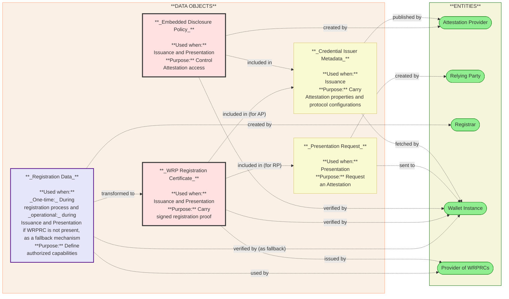
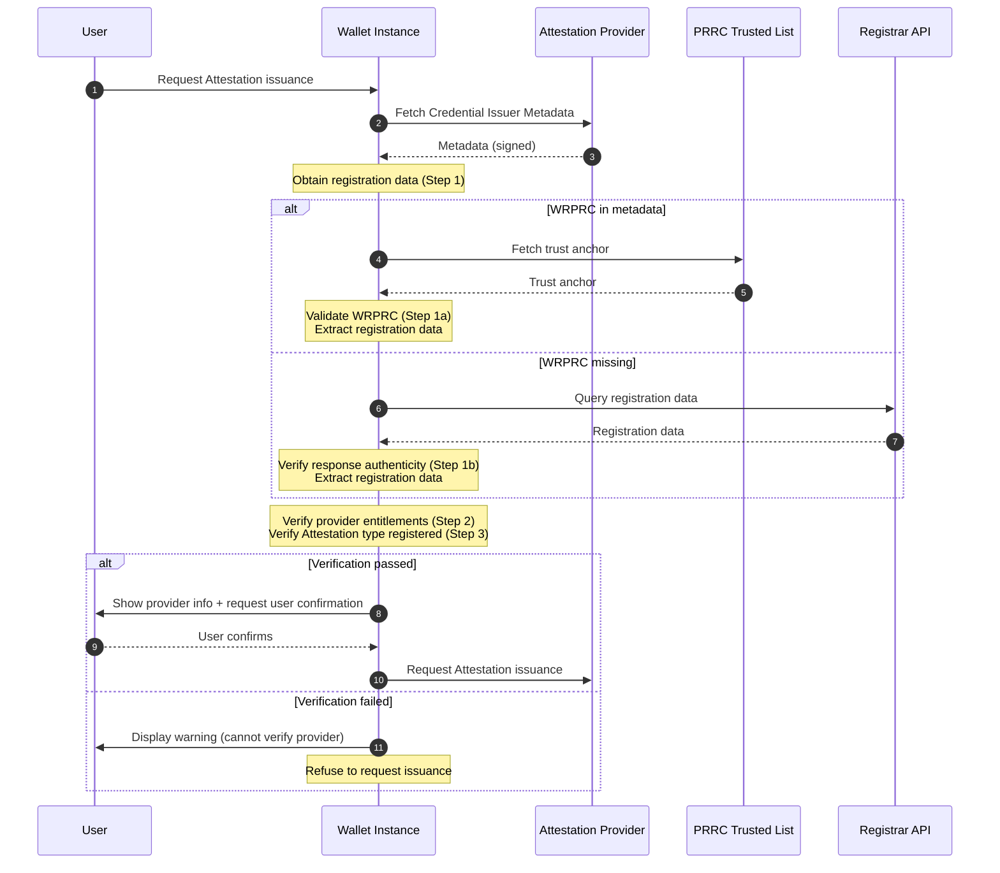
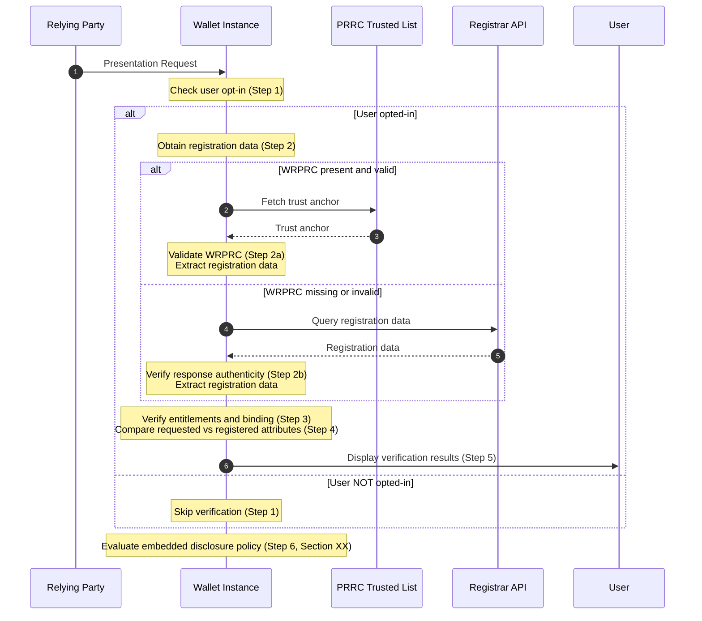
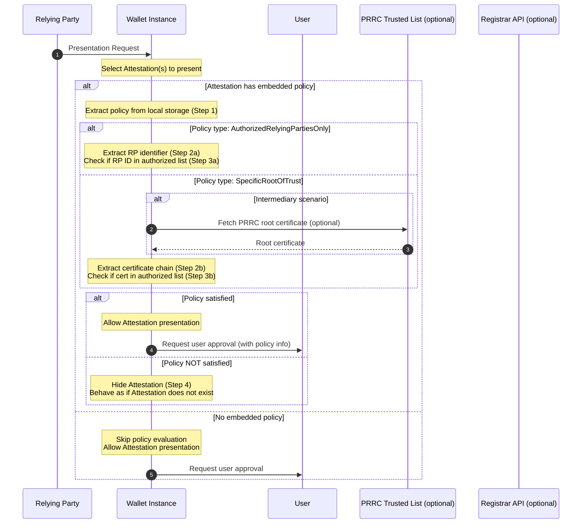

# Entitlement and Policy

## Introduction

This section describes the authorization mechanisms defined in European Digital Identity Wallet (EUDI Wallet) ecosystem. These mechanisms prevent unauthorized operations and ensure that entities operate within their registered capabilities.

The section covers three main authorization mechanisms:

1. **Relying Party Overasking Prevention**: Mechanisms to prevent Relying Parties from requesting attributes they are not registered to request
2. **Attestation Provider Unauthorized Issuance Prevention**: Mechanisms to prevent Attestation Providers from issuing Attestations they are not authorized to issue
3. **Embedded Disclosure Policy Enforcement**: Mechanisms to apply disclosure policies defined by Attestation Providers

As an essential part of the mechanisms described above, the entitlement verification mechanism is also covered in this section. 

The scope includes both proximity and remote presentation flows, and covers all types of Attestation Providers (PID Providers, QEAA Providers, PuB-EAA Providers, and non-qualified EAA Providers).

### Acronyms and Definitions

| Term | Definition |
|------|------------|
| **AP** | Attestation Provider - Generic term for entities that issue Attestations (PID Providers, QEAA Providers, PuB-EAA Providers, EAA Providers) |
| **CI** | Credential Issuer - Alternative term for Attestation Provider in OpenID4VCI context |
| **EAA** | Electronic Attestation of Attributes |
| **EDP** | Embedded Disclosure Policy as a set of rules defiend by APs for an Electronic Attestation of Attributes, indicating conditions that RP must meet to access Attestation |
| **PID** | Person Identification Data |
| **PuB-EAA** | Public Electronic Attestation of Attributes |
| **QEAA** | Qualified Electronic Attestation of Attributes |
| **Registrar** | Body responsible for establishing and maintaining list of Wallet-Relying Parties, PID providers, and Attestation providers in Member State |
| **RP** | Relying Party |
| **WI** | Wallet Instance |
| **WRP** | Wallet-Relying Party - Entity that intends to rely upon WI. APs, RPs are WRPs|
| **WRPAC** | Wallet-Relying Party Access Certificate - Certificate authenticating Wallet-Relying Party when interact with EUDI Wallet |
| **WRPRC** | Wallet-Relying Party Registration Certificate. Signed data object containing registered information about RPs or APs issued by Provider of WRPRCs. It indicates the intended use and attributes the RPs or APs has registered to request from users or issue to users  |

### Reference Documents

| Reference | Document |
|-----------|----------|
| **[ARF]** | EUDI Wallet Architecture and Reference Framework, including Discussion Topics and Annexes |
| **[CIR 2024/2979]** | Commission Implementing Regulation (EU) 2024/2979 on integrity and core functionalities of European Digital Identity Wallets |
| **[CIR 2025/848]** | Commission Implementing Regulation (EU) 2025/848 on registration of Wallet-Relying Parties |
| **[ETSI TS 119 475]** | ETSI TS 119 475 V1.1.1 - Relying party attributes supporting EUDIW users authorization decisions |
| **[ISO/IEC 18013-5]** | ISO/IEC 18013-5 - Personal identification — ISO-compliant driving licence — Part 5: Mobile driving licence (mDL) application |
| **[OpenID4VP]** | OpenID for Verifiable Presentations |
| **[OpenID4VCI]** | OpenID for Verifiable Credential Issuance |

### Overview of Authorization Mechanisms

Authorization mechanisms in EUDI Wallet ecosystem work together to ensure that:

- **Relying Parties** can request only attributes they registered for specific intended use
- **Attestation Providers** can issue only Attestation types they authorized to issue
- **Users** have control over disclosure through policies defined by Attestation Providers

These mechanisms based on **WRPRCs** that contain registered capabilities of entities, and **Embedded Disclosure Policies** that allow Attestation Providers to restrict which Relying Parties can access specific Attestations.

The Wallet Instance play central role in implementing these mechanisms by:
- Validate WRPRCs
- Compare requested operations with registered capabilities
- Evaluate embedded disclosure policies
- Inform user about verification results

All mechanisms support both **proximity presentation flows** (using ISO/IEC 18013-5) and **remote presentation flows** (using OpenID4VP).

## Prerequisites: Registration Process Overview

### Registration Process

Both Relying Parties and Attestation Providers must register with Registrar in Member State before they can operate in EUDI Wallet ecosystem. Registration process follow common phases with entity-specific specializations.

#### Common Registration Phases

The following steps are in common to all WRPs for which registration is required.

1. **Identity Verification**: Registrar verify identity of WRP according requirements in ETSI TS 119 461. The specific identity proofing level may vary based on entity type and applicable regulatory framework (e.g. QTSP requirements or MS national legislation) and it is out of scope of the piloting.

2. **Registration Record Creation**: Registrar create registration record in national register. Record contain at least:
   - WRP identification information.
   - WRP type (RP, PID Provider, QEAA Provider, PuB-EAA Provider, EAA Provider).
   - Entity-specific capabilities (see [Entity-Specific Specialization](#entity-specific-specialization))

3. **WRPRC Issuance**: If the Member State mandates WRPRC issuance according to CIR 2025/848 Article 8, the Provider of WRPRCs must issue a signed WRPRC containing registered capabilities. If it is not mandated, Wallet Instance may retrieve information from Registrar's online service. 

#### Entity-Specific Capabilities

Depending on the WRP type, the following information is provided during the registration process.

- **Relying Parties** declare one or more intended uses, each with:
  - User-friendly description of intended use.
  - Attestation type and optionally the list of attributes needed for that intended use.
  - Purpose of requesting those attributes
  - Link to privacy policy.

  WRPRC is issued for each intended use, containing only attributes registered for that specific use  (see ARF RPRC_09).

- **Attestation Providers** declare which Attestation types they intend to issue  (see ARF RPRC_15 and RPRC_22a).


#### Registration Information Availability

Registration information is made available through:
- **WRPRC**: Included in presentation request (RPs) or Credential Issuer metadata (APs) if issued.
- **Registrar Online Service**: API accessible via URL for query registration information when certificate is not available.


### Trust Infrastructure

Trust infrastructure supports authorization mechanisms through:

1. **Provider of WRPRCs Trusted Lists**: Wallet Instances accept trust anchors from all Trusted Lists for Providers of WRPRCs. These trusted lists published by Commission and contain public keys for verify WRPRC signatures.

2. **WRPAC Certificate Authority Trusted Lists**: Separate from WRPRCs, WRPACs authenticated using trusted lists of WRPAC Certificate Authorities. Multiple trusted lists may exist for different entity types.

3. **Registrar Online Services**: Each Registrar provides URL to online service. This URL is included in:
   - WRPACs for Attestation Providers (see note in ARF DASH_05).
   - Presentation request extension for Relying Parties (see ARF RPRC_19a), and used for queries (see ARF RPRC_18)

Wallet Instance may use Registrar URL to query registration information when WRPRC is not available or when user request additional verification (see ARF RPRC_16 and RPRC_18).

## Interactions and lifecycle

This section maps the lifecycle of primary data objects from registration to authorization, detailing their usage and the entities interacting with them.



## WRPRC Elements for Authorization

### Purpose in Authorization Mechanisms

WRPRCs serve as signed declarations of registered capabilities. They enable Wallet Instance to verify that WRPs operate within registered scope without need to query Registrar for every transaction.

WRPRCs are used in authorization mechanisms to:
- Verify that the WRP is entitled to interact with the WI during operational phases (Issuance or Presentation). 
- Verify that requested attributes from RP match registered attributes for declared intended use.
- Verify that provider type and Attestation types from AP match registration before issuance.

Key characteristic of WRPRCs in authorization context:
- **Signed by Provider of WRPRCs**: Ensure authenticity and integrity
- **Bound to WRPAC**: Ensure WRPRC belong to entity that authenticate with WRPAC
- **Specific to Intended Use**: For Relying Parties, separate WRPRC issued for each intended use
- **Include only authorization-relevant data**: Not all registration information is included, only elements needed for authorization decisions

### WRPRC Elements for Authorization

WRPRCs contain parameters used by authorization mechanisms to verify that Relying Parties and Attestation Providers operate within their registered capabilities.

This section identifies which parameters play role in authorization decisions. Detailed parameter specifications (formats, encodings, ETSI mappings) provided in [Section X.Y - WRPRC Detailed Specification].

> [!WARNING]
> The cross reference above should be replaced when the section about WRPRC will be finalized

Parameters apply to different WRP types:
- **WRPs**: Common parameters for all Wallet-Relying Parties (both RPs and APs).
- **RPs**: Any RP that requests attributes from wallet.
- **APs**: Parameters specific to Attestation Providers.

The following table lists all parameters from WRPRC that play role in authorization mechanisms.

| Parameter | Type | Applicability | Authorization Role | Reference |
| :-------- | :--- | :------------ | :----------------- | :-------- |
| `sub.id` | string | **WRPs** (REQUIRED) | Entity identification for policy evaluation and logging | [ETSI TS 119 475 Table 7], [ARF RPRC_07], [ARF RPRC_08]  |
| `entitlements` | array of strings | **WRPs** (REQUIRED - at least one) | Determine authorized roles and applicable trust framework | [ETSI TS 119 475 Table 7], [ETSI Annex A.2], [ARF ISSU_24a], [ARF ISSU_34a]  |
| `name` | string | **WRPs** (OPTIONAL) | User-friendly entity identification for user recognition and trust assessment | [ETSI TS 119 475 Table 7], [CIR 2025/848 Annex I.2]  |
| `service` | array of MultiLangString | **WRPs** (REQUIRED) | User transparency about service provided, support informed consent | [ETSI TS 119 475 Table 7], [CIR 2025/848 Annex I.8]  |
| `public_body` | boolean | **WRPs** (REQUIRED by CIR 2025/848 Annex I.11) | Public sector body identification for trust assessment | [ETSI TS 119 475 Table 10], [CIR 2025/848 Annex I.11] |
| `dpa` | LegalEntity | **WRPs** (REQUIRED) | Data protection supervisory authority for user rights and accountability | [ETSI TS 119 475 Table 7], [CIR 2025/848 Annex IV.3(g)]  |
| `registry_uri` | string (URL) | **WRPs** (REQUIRED) | Registrar API URL for runtime verification and user opt-in queries | [ETSI TS 119 475 Table 7], [CIR 2025/848 Article 3(5)], [ARF RPRC_18]  |
| `support_uri` | string[^1] | **WRPs** (REQUIRED) | Support contact points for user rights including data deletion requests | [ETSI TS 119 475 Table 10], [CIR 2025/848 Annex I.7(a)] |
| `act` | array of WalletRelyingParty | **WRPs** (OPTIONAL) | Intermediary entities disclosure for data flow transparency and trust assessment | [ETSI TS 119 475 Table 10], [CIR 2025/848 Annex I.14] |
| `credentials[].claim[]` | array of Claim | **RPs** (REQUIRED) | Attribute overasking prevention - verify requested attributes match registration | [ETSI TS 119 475 Table 9], [ARF RPRC_09], [ARF RPRC_21] |
| `purpose` | array of MultiLangString | **RPs** (REQUIRED if IntendedUse present) | User transparency - inform user why attributes requested | [ETSI TS 119 475 Table 9], [ARF RPRC_18]  |
| `privacy_policy` | string (URL) | **RPs** (REQUIRED if IntendedUse present) | User transparency - inform user about data processing practices | [ETSI TS 119 475 Table 9] |
| `intended_use_id` | string | **RPs** (OPTIONAL - reserved for future) | Registrar-provided unique identifier of the registered intended use | [ETSI TS 119 475 Table 9], [ARF RPRC_19a] |
| `provided_Attestations[]` | array of Credential | **APs** (REQUIRED for APs) | Verify AP authorized to issue specific Attestation type | [ETSI TS 119 475 Table 8], [ARF RPRC_15], [ARF RPRC_23], [ARF ISSU_34a] |
| `status`	| object {idx: string, uri: string} |	**WRPs** (REQUIRED)	| Revocation verification - check WRPRC validity status before using registration data|	[ETSI TS 119 475 GEN-6.2.6.1-04], [ARF RPRC_17]

[^1]: ETSI shows `support_uri` as singular (URL or email), but Looking at Table 1 `supportURI` is related to Subject Alternative Name can have multiple entries. To check if it makes sense to define `support_uri` as array of strings.

> [!NOTE]
>
> See [Section X.Y - WRPRC Detailed Specification] for additional details, including formats, encodings, complete examples, and ETSI mappings.


> [!WARNING]
> The cross reference above should be replaced when the section about WRPRC will be finalized


### Distribution Methods

Relying Party Instance include WRPRC in presentation request for **both proximity and remote presentation flows** (RPRC_19), using extension defined in ETSI TS 119 472-2.
During  the **Proximity flow** (ISO/IEC 18013-5), the WRPRC is included in device request. 
In the **Remote flow** (OpenID4VP), the WRPRC is included in authorization request. 

WRPRCs are included **by value**, not by reference (RPRC_19). This ensure:
- No external requests necessary to validate Relying Party
- Transaction atomic and self-contained
- Work in offline scenarios (for proximity).

If WRPRC is not included, Wallet Instance can query Registrar online service using URL included in presentation request extension (RPRC_18).

Attestation Providers include WRPRC in **Credential Issuer metadata** used in OpenID4VCI protocol (RPRC_22, ISSU_22b), where:
- WRPRC is included **by value**, not by reference.
- CI metadata is signed by Attestation Provider using private key of WRPAC (ISSU_22a, ISSU_32a)

Wallet Instance fetch Credential Issuer metadata before start issuance flow, extract WRPRC, and validate it before request Attestation issuance.

If WRPRC is not available in CI metadata, Wallet Instance may query Registrar online service using URL contained in metadata (ISSU_24a, ISSU_34a).

## Embedded Disclosure Policies

**Embedded Disclosure Policy** is defined in Article 2(9) of CIR 2024/2979 as:

> "a set of rules, embedded in an electronic Attestation of attributes by its provider, that indicates the conditions that a Wallet-Relying Party has to meet to access the electronic Attestation of attributes"

The main prurpose is to allow Attestation Provider to control which Relying Parties can access specific Attestation.

Attestation Provider can optionally express Embedded Disclosure policy for Attestations (EDP_01), and, accoridng to the Article 10 of CIR 2024/2979, Wallet Providers ensure that electronic Attestations with common Embedded Disclosure policies (listed in Annex III) can be processed by their Wallet Instances.

If no policy defined, Attestations can be presented to any Relying Party, although they are always subject to user consent.

The Embedded Disclosure Policies are applicable to:
- **QEAAs**. 
- **PuB-EAAs**. 
- **Non-qualified EAAs**.

They are **not applicable to PIDs**: EUDIW Regulation doesn't provide any requirement for PIDs to contain Embedded Disclosure Policy (EDP_01 note).

The main **use cases** that can be enabled by Embedded Disclosure Policies are:
- Restrict access to sensitive Attestations to authorized RPs only.
- If a sector-specific CAs exists, the AP may implement sector-specific access control (e.g., only public sector RPs)
- MS-specific access control (only RPs registered within a specific MEmber State)

In particular, the use cases above are enabled using the policy types described in the following section. 


### Policy Types

Annex III of CIR 2024/2979 define three common embedded disclosure policy types that Wallet Instance must support.

1. **No Policy**: Attestation has no embedded disclosure policy. Wallet Instance can present Attestation to any Relying Party, subject only to user approval.
2. **Authorized Relying Parties Only Policy**: Attestation can be presented only to Relying Parties in authorized list defined by Attestation Provider. According to (EDP_02), this list contains the **EU-wide unique identifiers** of authorized Relying Parties. The format is the same as the unique identifier in WRPRC.
3. **Specific Root of Trust Policy**: Attestation can be presented only to Relying Parties whose WRPACs signed by specific trusted Certificate Authorities. According to (EDP_03), the list contains the **root or intermediate certificates** used for signing Relying Party WRPACs, and must be in X.509 format.


### Policy Structure and Encoding

> [!WARNING]
> The Embedded Disclosure Policy structure and parameter names defined in this section are not based on normative references neither on technical standards. ARF requirement EDP_08 state that Commission shall create technical specification for embedded disclosure policy format. However this specification is **not yet published**. The content of this section is based on EDP_02, EDP_03, EDP_05, but may differ from final technical specification.


The Embedded Disclosure Policy structure is defined in the following table:

| Parameter | Type | Description | Based on |
|-----------|------|-------------|----------|
| `policy_type` | string | REQUIRED. Policy type identifier. Values: `"authorized_relying_parties_only"`, `"specific_root_of_trust"`. CIR 2024/2979 Annex III defines also `"no_policy"` but absence of policy object in credential metadata is equivalent | [CIR 2024/2979 Annex III], [ARF EDP_02], [ARF EDP_03] |
| `version` | string | OPTIONAL. Policy format version (e.g., `"1.0"`). If omitted, implementation assumes version `"1.0"` | [ARF Discussion Topic D] |
| `policy_url` | string (URL) | OPTIONAL. Link to website explaining policy in layman terms. If present, WI MUST display to user per EDP_05 | [ARF EDP_05] |
| `authorized_parties` | array of strings | REQUIRED if `policy_type` is `"authorized_relying_parties_only"`, otherwise MUST NOT be present. Array of EU-wide unique identifiers in semantic form as specified in Reg_32 (e.g., `"VATIN:IT-12345678901"`, `"EORI:FR123456789012345"`) | [ARF EDP_02], [ARF Reg_32] |
| `trusted_certificates` | array of objects | REQUIRED if `policy_type` is `"specific_root_of_trust"`, otherwise MUST NOT be present. Array of trusted certificate objects. Each object contains X.509 certificate and certificate type (root or intermediate CA certificate in PKI chain) | [ARF EDP_03] |

**`trusted_certificates[]` object structure** (when `policy_type` is `"specific_root_of_trust"`):

| Parameter | Type | Description | Based on |
|-----------|------|-------------|----------|
| `certificate` | string | REQUIRED. X.509 certificate in base64-encoded DER or PEM format, without line breaks | [ARF EDP_03] |
| `type` | string (enum) | REQUIRED. Certificate type in PKI chain. Values: `"root"` (root CA certificate) or `"intermediate"` (intermediate CA certificate between root and leaf). Leaf certificates (RP WRPACs) are not included in policy | [ARF EDP_03], [EDP_03 HLR] |

In the following sections non-normative examples are provided.

#### Example 1: Authorized Relying Parties Only

```json
{
  "policy_type": "authorized_relying_parties_only",
  "version": "1.0",
  "authorized_parties": [
    "VATIN:IT-12345678901",
    "EORI:FR123456789012345"
  ],
  "policy_url": "https://provider.example.com/policies/medical-data"
}
```

#### Example 2: Specific Root of Trust

```json
{
  "policy_type": "specific_root_of_trust",
  "version": "1.0",
  "trusted_certificates": [
    {
      "certificate": "MIICertDataBase64==",
      "type": "root"
    },
    {
      "certificate": "MIIDifferentCertBase64==",
      "type": "intermediate"
    }
  ],
  "policy_url": "https://provider.example.com/policies/trusted-cas"
}
```


### Policy Distribution via Credential Issuer Metadata

According to ARF Discussion Topic D, the **primary distribution method** for Embedded disclosure policies should be including it in **Credential Issuer metadata**.

This is preferred method because:
- Policy is available before Attestation issuance
- Wallet Instance can retrieve policy during metadata discovery
- No need of embed policy in each Attestation instance
- Policy can be updated without reissue Attestations

> [!WARNING]
> For the sake of the piloting, Embedded Disclosure Policy included in the Attestation is not considered.

**Metadata structure example**:
```json
{
  "credential_issuer": "https://provider.example.com",
  "credentials_supported": [
    {
      "format": "vc+sd-jwt",
      "id": "eudiw.medical.prescription.1",
      [...],
      "embedded_disclosure_policy": {
        "policy_type": "authorized_relying_parties_only",
        "version": "1.0",
        "authorized_parties": ["VATIN:IT-HEALTHCARE-001"],
        "policy_url": "https://provider.example.com/policies/medical"
      }
    }
  ]
}
```

A Wallet Instance may:
1. Fetch Credential Issuer metadata during issuance flow.
2. Extract embedded disclosure policy for credential type.
3. Store policy locally with issued Attestation (see EDP_10).
4. During presentation, evaluate stored policy against requesting Relying Party as described in the following section.

## Authorization Mechanisms Technical Details

This section defines detailed verification procedures for each authorization mechanism following their logical-temporal order:

1. **AP Unauthorized Issuance Prevention Mechanism**: Executed during Attestation issuance. Wallet Instance verifies that Attestation Provider is authorized to issue requested Attestation type. During this phase, Embedded Disclosure Policy (if any) is retrieved and stored locally.

2. **RP Overasking Prevention Mechanism**: Executed during Attestation presentation. Wallet Instance verifies that Relying Party requests only attributes registered for declared intended use.

3. **Embedded Disclosure Policy Enforcement Mechanism**: Executed during Attestation presentation. Wallet Instance evaluates policy (stored during issuance) against requesting Relying Party to determine if Attestation can be presented.

These mechanisms work together to ensure authorization at both issuance and presentation phases.

### AP Unauthorized Issuance Prevention Mechanism

This mechanism prevents Attestation Providers from issuing Attestations they are not authorized to issue. It is **mandatory** (not opt-in) and executed before every issuance request. Unlike presentation mechanisms, there is **no user override** - if verification fails, the WI refuses to request issuance.

#### Interaction Flow



#### Step-by-Step Operations

**Step 1: Obtain Registration Data**

The WI MUST obtain registration data from one of two sources: WRPRC (if present in metadata) or Registrar API (fallback).

**Step 1a: Obtain Registration Data from WRPRC in Metadata**

1. The WI MUST fetch Credential Issuer Metadata from AP using OpenID4VCI protocol (per ARF ISSU_01).

2. The WI MUST extract WRPRC from metadata (per ETSI TS 119 472-3 section 4.2.3, ARF RPRC_22):
   - Field: `registration_certificate` in metadata
   - If WRPRC NOT present, proceed to Step 1b (fallback to Registrar)

3. If WRPRC present:
   - The WI MUST verify that WRPRC included **by value** (not by reference per ARF RPRC_22)
   - Proceed to substep 4

4. The WI MUST verify WRPRC format:
   - WRPRC MUST be JWT with header `typ: "wrprc+jwt"` per ETSI TS 119 475 section 5.1.1

5. The WI MUST verify signing algorithm in JOSE header is acceptable (not "none", not deprecated algorithms).

6. The WI MUST extract issuer identifier from WRPRC `iss` claim.

7. The WI MUST fetch trust anchor for Provider of WRPRCs from Trusted List. The WI MUST accept trust anchors from **all** Provider of WRPRCs Trusted Lists (per ARF ISSU_33a).

8. The WI MUST validate certificate chain from WRPRC signing certificate to trust anchor per ETSI TS 119 475 requirements.

9. The WI MUST verify WRPRC signature using validated certificate chain.

10. The WI MUST check `iat` (issued at) claim and `exp` (expiration) claim in the WRPRC to verify temporal validity.

11. The WI MUST check revocation status of WRPRC using `status` field.

12. If any validation in substeps 4-11 fails:
    - Record verification result is CERTIFICATE_INVALID
    - Proceed to Step 1b (fallback to Registrar API)

13. If all validations pass:
    - Extract registration data from WRPRC:
      - `entitlements` array (per ETSI TS 119 475 Table 7, B.2.1)
      - `provided_Attestations[]` array (Attestation types AP registered to issue, per ETSI TS 119 475, ARF RPRC_15)
    - Proceed to Step 2 (verify provider entitlements)

**Step 1b: Obtain Registration Data from Registrar API** (fallback if WRPRC missing or validation failed)

1. The WI MUST extract Registrar URL from Credential Issuer Metadata (per ETSI TS 119 472-3, ARF RPRC_22a: field `registry_uri`).
   - If Registrar URL is not present:
     - The WI MUST display warning to user per ARF ISSU_24a/ISSU_34a: "Could not verify the Attestation Provider registration"
     - Record verification result is FAILED
     - Refuse to request issuance (proceed to Step 4)

2. The WI MUST connect to Registrar online service at extracted URL using HTTPS with TLS certificate validation, as defined in ARF Technical Specification 5 (TS5).

3. The WI MUST query registration information using:
   - AP unique identifier (from metadata field `id` per ARF RPRC_22a)

4. The WI MUST verify authenticity of Registrar response:
   - Validate TLS certificate chain for Registrar server
   - If response is signed (per TS5), validate signature using Registrar public key from national trusted list

5. If authenticity verification fails OR connection fails:
   - The WI MUST display warning to user per ARF ISSU_24a/ISSU_34a: "Could not verify the Attestation Provider registration"
   - Record verification result is FAILED
   - Refuse to request issuance (proceed to Step 4)

6. If authenticity verification succeeds:
   - Extract registration data from Registrar response:
     - `entitlements` array
     - `provided_Attestations[]` array
   - Proceed to Step 2 (verify provider entitlements)

> [!NOTE]
> **Three-tier fallback** (per ARF ISSU_24a, ISSU_34a): If both WRPRC and Registrar query fail, WI MAY optionally inspect self-declared `entitlement` member in Credential Issuer Metadata. This is NOT RECOMMENDED for security (self-declared data) and is at Wallet Provider discretion.

**Step 2: Verify Provider Entitlements**

This step operates on registration data obtained from Step 1a (WRPRC) or Step 1b (Registrar API).

1. The WI MUST determine provider type based on user request:
   - If user requested PID then the expected entitlement is : `PID_Provider`
   - If user requested QEAA the expected entitlement is: `Q_EAA_Provider`
   - If user requested PuB-EAA the expected entitlement is: `PuB_EAA_Provider`
   - If user requested non-qualified EAA then the expected entitlement is: `Non_Q_EAA_Provider`

2. The WI MUST verify that entitlements array contains expected provider entitlement (per ETSI TS 119 475 Annex A.2):
   - Required value format: `https://uri.etsi.org/19475/Entitlement/{ProviderType}`
   - Example for PID Provider: `https://uri.etsi.org/19475/Entitlement/PID_Provider`

3. If entitlement check fails (per ARF ISSU_24a for PID, ISSU_34a for AP):
   - The WI MUST display warning to user: "This provider is not registered as [expected provider type]"
   - Record verification result is WRONG_ENTITLEMENT
   - Refuse to request issuance (proceed to Step 4)

4. If entitlement check succeeds:
   - Proceed to Step 3 (verify Attestation type)

**Step 3: Verify Attestation Type Registered**

This step operates on registration data obtained from Step 1a (WRPRC) or Step 1b (Registrar API).

1. If provider type is PID_Provider (from Step 2):
   - Skip Attestation type verification (PID Providers issue PIDs by definition)
   - Proceed to Step 5 (allow issuance request)

2. If provider type is Q_EAA_Provider, PuB_EAA_Provider, or Non_Q_EAA_Provider:
   - Extract Attestation type user wants to obtain (from user request)
   - Extract list of registered Attestation types from registration data (`provided_Attestations[]` array per ARF RPRC_15, ISSU_34b)

3. The WI MUST check if requested Attestation type is present in registered Attestation types list:
   - Matching MUST be **case-sensitive** and **exact**
   - Match Attestation type identifier (e.g., VCT value for SD-JWT VC, doctype for mDL)

4. If Attestation type NOT in registered list (per ARF RPRC_23, ISSU_34b):
   - The WI MUST display warning to user: "This provider is not registered to issue [Attestation type]"
   - Record verification result is ATTESTATION_TYPE_NOT_REGISTERED
   - Refuse to request issuance (proceed to Step 4)

5. If Attestation type is in registered list:
   - Proceed to Step 5 (allow issuance request)

**Step 4: Refuse Issuance Request**

1. If verification result is FAILED, CERTIFICATE_INVALID, WRONG_ENTITLEMENT, or ATTESTATION_TYPE_NOT_REGISTERED:
   - The WI MUST NOT request Attestation issuance from AP (per ARF ISSU_24a, ISSU_34a, RPRC_23)
   - The WI MUST display appropriate warning to user (warnings shown in Steps 1b, 2, 3)
   - Issuance flow terminates

**Step 5: Allow Issuance Request**

1. If all verifications passed:
   - The WI MUST display provider information to user (per ARF RPRC_22a):
     - Provider name
     - Provider type (PID Provider / QEAA Provider / etc.)
     - Attestation type to be issued
     - Provider description
   - The WI MUST request user confirmation: "Do you want to request [Attestation type] from [provider name]?"

2. If user confirms:
   - The WI MUST proceed to request Attestation issuance using OpenID4VCI protocol (per ARF ISSU_01)
   - **During issuance**: If Embedded Disclosure Policy is present in Credential Issuer Metadata (per ARF EDP_09), the WI MUST retrieve and store it locally with issued Attestation (per ARF EDP_10). This policy will be evaluated during presentation (see [Embedded Disclosure Policy Enforcement Mechanism](#embedded-disclosure-policy-enforcement-mechanism)).

3. If user cancels:
   - Issuance flow terminates

> [!NOTE]
> **Mandatory Enforcement**: Unlike RP Overasking Prevention (opt-in, advisory with user override), AP Unauthorized Issuance Prevention is **mandatory** (always executed) and **no user override allowed** (per ARF RPRC_23). If verification fails, WI refuses to request issuance.


### RP Overasking Prevention Mechanism

This mechanism ensures that Relying Parties do not request unauthorized attributes. It follows an opt-in model for privacy and is triggered when the user enables registration verification (according to RPRC_16). Since it is an advisory mechanism, the user may override it. Additionally, the mechanism is designed to fall back to the Registrar when the WRPRC is missing.

#### Interaction Flow



#### Step-by-Step Operations

**Step 1: Check User Opt-In**

1. The WI MUST check if user enabled registration verification (per ARF RPRC_16: user indicated they want to verify information registered by Registrar about RP).
2. If user opted-in, then the WI MUST proceed to Step 2, otherwise:
   - The WI MUST skip all following steps.
   - The WI MUST proceed directly to embedded disclosure policy evaluation (see Section XX).


**Step 2: Obtain Registration Data**

The WI MUST obtain registration data from one of two sources: WRPRC (if present and valid) or Registrar API (fallback).

**Step 2a: Obtain Registration Data from WRPRC**

1. The WI MUST extract WRPRC from presentation request:
   - **Remote flow (OpenID4VP)**: Extract from `rp_registration_certificate` field in authorization request JWT
   - **Proximity flow (ISO 18013-5)**: Extract from device request extension according to ETSI TS 119 472-2 and ARF RPRC_20

2. If WRPRC NOT present:
   - Proceed to Step 2b (fallback to Registrar API)

3. If WRPRC present:
   - The WI MUST verify that WRPRC included **by value** (not by reference per ARF RPRC_19)
   - Proceed to substep 4

4. The WI MUST verify WRPRC format:
   - **Remote flow**: WRPRC MUST be JWT with header `typ: "wrprc+jwt"` per ETSI TS 119 475 section 5.1.1
   - **Proximity flow**: WRPRC MUST be CWT per ETSI TS 119 475 section 5.2.1

5. The WI MUST verify signing algorithm in JOSE/COSE header is acceptable (not "none", not deprecated algorithms).

6. The WI MUST extract issuer identifier from WRPRC `iss` claim.

7. The WI MUST fetch trust anchor for Provider of WRPRCs from Trusted List. The WI MUST accept trust anchors from **all** Provider of WRPRCs Trusted Lists, not limited to single Member State (per ARF RPRC_17, RPA_04).

8. The WI MUST validate certificate chain from WRPRC signing certificate to trust anchor per ETSI TS 119 475 requirements.

9. The WI MUST verify WRPRC signature using validated certificate chain.

10. The WI MUST check `iat` (issued at) claim and `exp` (expiration) claim in the WRPRC to verify temporal validity.

11. The WI MUST check revocation status of WRPRC using `status` field.
    - If revocation check indicates certificate is revoked, proceed to Step 2b (fallback to Registrar).

12. If any validation in substeps 4-11 fails:
    - Record verification result is CERTIFICATE_INVALID
    - Proceed to Step 2b (fallback to Registrar API)

13. If all validations pass:
    - Extract registration data from WRPRC:
      - `entitlements` array (per ETSI TS 119 475 Table 7, B.2.1)
      - `sub.id` field (subject identifier)
      - `act` array (intermediary association, if present, per ETSI TS 119 475 Table 7, ARF RPRC_04)
      - `credentials[].format` - credential format (per ETSI TS 119 475 B.2.9 Credential class)
      - `credentials[].meta.vct_values[]` - array of registered VCT values
      - `credentials[].claim[].path` - paths to registered attributes
    - Proceed to Step 3 (verify entitlements and binding)

**Step 2b: Obtain Registration Data from Registrar API** (fallback if WRPRC missing or validation failed)

1. The WI MUST extract Registrar URL from presentation request RP info extension:
   - Field: `registry_uri` (per ARF RPRC_19a).
   - If Registrar URL is not present:
     - The WI MUST notify user per ARF RPRC_18: "Could not verify the information registered about this Relying Party"
     - Record verification result is FAILED
     - Proceed to Step 5 (display results)

2. The WI SHOULD inform user that external query will be made (privacy consideration per ARF RPRC_18).

3. The WI MUST connect to Registrar online service at extracted URL using HTTPS with TLS certificate validation, as defined in ARF Technical Specification 5 (TS5 - Common Formats and API for RP Registration Information).

4. The WI MUST query registration information using:
   - RP unique identifier (from WRPAC or RP info extension)
   - Intended use identifier (from RP info extension field `intended_use_id` per ARF RPRC_19a)

5. The WI MUST verify authenticity of Registrar response:
   - Validate TLS certificate chain for Registrar server
   - If response is signed (per TS5), validate signature using Registrar public key from national trusted list

6. If authenticity verification fails OR connection fails:
   - The WI MUST notify user per ARF RPRC_18: "Could not obtain the information registered about this Relying Party"
   - Record verification result is FAILED
   - Proceed to Step 5 (display results)

7. If authenticity verification succeeds:
   - Extract registration data from Registrar response:
     - `entitlements` array
     - Subject identifier
     - Intermediary association (if present)
     - `credentials[].format`
     - `credentials[].meta.vct_values[]`
     - `credentials[].claim[].path`
   - Proceed to Step 3 (verify entitlements and binding)


**Step 3: Verify Entitlements and Binding**

This step operates on registration data obtained from Step 2a (WRPRC) or Step 2b (Registrar API).

1. The WI MUST verify that entitlements array contains the Service Provider entitlement:
   - Required value: `https://uri.etsi.org/19475/Entitlement/Service_Provider` (per ETSI TS 119 475 Annex A.2, CIR 2025/848)
   - If entitlement check fails:
     - Record verification result is WRONG_ENTITLEMENT
     - Proceed to Step 5 (display results)

2. The WI MUST detect intermediary scenario:
   - Extract RP identifier from WRPAC (subject identifier)
   - Extract RP identifier from presentation request RP info extension (per ARF RPRC_19a: field `id`)
   - Compare identifiers:
     - If identifiers **match** then the direct RP scenario applies, proceed to substep 3
     - If identifiers **do not match** then the intermediary scenario applies (intermediary holds WRPAC, RP info extension refers to intermediated RP), proceed to substep 4

3. **Direct RP scenario**:
   - The WI MUST verify that subject identifier from registration data matches RP identifier from WRPAC.
   - If binding verification fails:
     - Record verification result is BINDING_FAILED
     - Proceed to Step 5 (display results)
   - If binding verification succeeds, proceed to Step 4 (compare attributes).

4. **Intermediary scenario**:
   - The WI MUST verify that intermediary association from registration data (e.g., `act` array) contains intermediary identifier (from WRPAC).
   - If association verification fails:
     - Record verification result is INTERMEDIARY_NOT_AUTHORIZED
     - Proceed to Step 5 (display results)
   - The WI MUST verify that subject identifier from registration data matches intermediated RP identifier from RP info extension.
   - If binding verification fails:
     - Record verification result is BINDING_FAILED
     - Proceed to Step 5 (display results)
   - The WI MUST prepare user display per ARF RPI_07: "[intermediary name] acting on behalf of [intermediated RP name] for [intended use description]".
   - If all verifications succeed, proceed to Step 4 (compare attributes).


**Step 4: Compare Requested vs Registered Attributes**

This step operates on registration data obtained from Step 2a (WRPRC) or Step 2b (Registrar API).

1. The WI MUST extract requested attributes from presentation request:
   - **Remote flow (DCQL)**: Extract from `credential_queries[].claims[]` paths.
   - **Proximity flow**: Extract from device request `namespaces` structure.

2. For each credential type requested:
   1. The WI MUST identify corresponding credential type in registered attributes (from registration data).
   2. For each attribute requested in that credential type, the WI MUST check if attribute is present in the registered attributes list (per ARF RPRC_21). The matching MUST be **case-sensitive** and **exact**.

3. The WI MUST record comparison result:
   - If all requested attributes are registered: Result is VERIFICATION_PASSED
   - If some requested attributes are NOT registered: Result is OVERASKING_DETECTED
     - The WI MUST identify which specific attributes are not registered

4. Proceed to Step 5 (display verification results to user)


**Step 5: Display Verification Results to User**

The WI MUST inform user of verification results per ARF RPA_07, RPRC_17, RPRC_18, and RPRC_21:

1. If verification result is VERIFICATION_PASSED:
   - The WI SHOULD display: "This Relying Party is registered for the requested attributes"

2. If verification result is OVERASKING_DETECTED:
   - The WI MUST display per ARF RPRC_21: "The following attributes were requested but not registered: [list of unregistered attributes]"
   - The WI MUST allow user to approve or deny presentation (user override allowed - advisory mechanism)

3. If verification result is FAILED, CERTIFICATE_INVALID, WRONG_ENTITLEMENT, BINDING_FAILED, or INTERMEDIARY_NOT_AUTHORIZED:
   - The WI MUST display per ARF RPRC_17/18: "Could not verify the information registered about this Relying Party"
   - The WI MUST allow user to approve or deny presentation (user override allowed - advisory mechanism)

4. If verification was skipped (user not opted-in):
   - The WI MAY display: "Registration verification was not performed"

After user is informed, proceed to Step 6 (embedded disclosure policy evaluation).


**Step 6: Proceed to Embedded Disclosure Policy Evaluation**

After registration verification (success, failure, or skipped), the WI MUST always proceed to embedded disclosure policy evaluation (see [Embedded Disclosure Policy Enforcement Mechanism](#embedded-disclosure-policy-enforcement-mechanism)). Policy evaluation is executed regardless of registration verification result.


### Embedded Disclosure Policy Enforcement Mechanism

This mechanism allows Attestation Providers to define policies that restrict which Relying Parties can access specific Attestations. Unlike RP Overasking Prevention (which is opt-in and advisory), policy enforcement is **mandatory** and **cannot be overridden** by the user (per ARF EDP_07, RPA_11). If policy evaluation fails, the WI behaves as if the Attestation does not exist.

#### Interaction Flow



#### Step-by-Step Operations

**Step 1: Extract Embedded Disclosure Policy**

1. For each Attestation that matches presentation request, the WI MUST check if Attestation has associated embedded disclosure policy (per ARF EDP_10: policy stored locally during issuance).

2. If Attestation does NOT have embedded policy:
   - Skip Steps 2-4 for this Attestation
   - Allow Attestation to be presented (subject to user approval per ARF RPA_07)

3. If Attestation HAS embedded policy:
   - Extract policy from local storage
   - Extract policy type from policy object
   - If policy URL present (per ARF EDP_05), prepare to display link to user explaining policy
   - Proceed to Step 2 based on policy type

**Step 2: Extract RP Information for Policy Evaluation**

This step extracts RP information needed for policy evaluation (per ARF EDP_06).

**Step 2a: For "Authorized Relying Parties Only" Policy (ARF EDP_02)**

1. The WI MUST detect intermediary scenario:
   - Extract RP identifier from WRPAC (subject identifier)
   - Extract RP identifier from presentation request RP info extension (per ARF RPRC_19a: field `id`)
   - Compare identifiers:
     - If identifiers **match**, direct RP scenario applies
     - If identifiers **do not match** then intermediary scenario applies

2. **If direct RP scenario**:
   - The WI MUST extract RP unique identifier from WRPAC
   - Use this identifier for policy evaluation in Step 3a

3. **If intermediary scenario** (per ARF EDP_02 note):
   - The WI MUST extract unique identifier of **intermediated Relying Party** from presentation request RP info extension (field `id` per ARF RPRC_19a)
   - Use intermediated RP identifier for policy evaluation in Step 3a
   - Note: DO NOT use intermediary identifier - policy evaluates against intermediated RP

**Step 2b: For "Specific Root of Trust" Policy (ARF EDP_03)**

1. The WI MUST detect intermediary scenario (same logic as Step 2a substep 1).

2. **If direct RP scenario**:
   - The WI MUST extract certificate chain from RP WRPAC
   - Extract root and intermediate certificates from chain
   - Use these certificates for policy evaluation in Step 3b

3. **If intermediary scenario** (per ARF EDP_03 note):
   - The WI MUST retrieve root certificate of Provider of WRPRCs for **intermediated Relying Party**:
     - If WRPRC present in presentation request, extract `iss` from WRPRC and fetch Provider of WRPRCs root certificate from Trusted List
     - If WRPRC NOT present, query Registrar online service (using URL from RP info extension), then obtain Provider of WRPRCs identifier and finally fetch root certificate from Trusted List
   - Use Provider of WRPRCs root certificate for policy evaluation in Step 3b
   - Note: DO NOT use intermediary WRPAC chain - policy evaluates against intermediated RP's PRRC root

**Step 3: Evaluate Policy**

**Step 3a: Evaluate "Authorized Relying Parties Only" Policy**

1. The WI MUST extract list of authorized RP identifiers from policy object (per ARF EDP_02: list of EU-wide unique identifiers per Reg_32).

2. The WI MUST check if RP identifier (from Step 2a) is present in authorized list:
   - Matching MUST be **case-sensitive** and **exact**

3. If RP identifier is in authorized list:
   - Policy evaluation result is SATISFIED
   - Proceed to Step 5 (allow presentation)

4. If RP identifier is NOT in authorized list:
   - Policy evaluation result is NOT_SATISFIED
   - Proceed to Step 4 (hide Attestation)

**Step 3b: Evaluate "Specific Root of Trust" Policy**

1. The WI MUST extract list of authorized root/intermediate certificates from policy object (per ARF EDP_03: list of root or intermediate certificates).

2. The WI MUST compare certificates (from Step 2b) to authorized list:
   - For direct RP: compare each certificate in chain (root and intermediates)
   - For intermediary: compare Provider of WRPRCs root certificate
   - Matching: certificate comparison using standard X.509 certificate comparison

3. If any certificate in chain matches any certificate in authorized list:
   - Policy evaluation result is SATISFIED
   - Proceed to Step 5 (allow presentation)

4. If NO certificate matches:
   - Policy evaluation result is NOT_SATISFIED
   - Proceed to Step 4 (hide Attestation)

**Step 4: Hide Attestation if Policy Not Satisfied**

1. If policy evaluation result is NOT_SATISFIED:
   - The WI MUST hide Attestation from user selection interface
   - The WI MUST behave towards Relying Party as if Attestation does not exist (per ARF RPA_11)
   - The WI MUST NOT present this Attestation to RP
   - The WI MUST NOT ask user for approval for this Attestation

2. The WI SHOULD log policy denial event for user transparency (viewable in wallet dashboard).

**Step 5: Allow Presentation if Policy Satisfied**

1. If policy evaluation result is SATISFIED:
   - The WI MUST allow Attestation to be presented (subject to user approval)
   - If policy URL present, the WI SHOULD display link to user per ARF EDP_05: "This Attestation has disclosure policy defined by [AP name]. [Learn more]"
   - The WI SHOULD notify user that RP is authorized by AP policy: "This Relying Party is authorized by [AP name] to access this Attestation"
   - Proceed to user approval per ARF RPA_07

2. User approval is still required even if policy satisfied (per ARF EDP_07: "enable User to deny or allow").

> [!NOTE]
> **Policy Evaluation is Mandatory**: Unlike RP Overasking Prevention (opt-in, advisory), policy evaluation is **always executed** and **cannot be overridden** by user. If policy not satisfied, Attestation is hidden regardless of user preference.


### Combined Mechanisms Operation

This section shows how RP Overasking Prevention and Embedded Disclosure Policy Enforcement work together during Attestation presentation.

```mermaid
flowchart TD
    Start([RP sends presentation request]) --> UserOptIn{User enabled<br/>registration verification?}

    UserOptIn -->|Yes| ObtainRegData[Obtain RP registration data<br/>WRPRC or Registrar API]
    UserOptIn -->|No| SkipRegVerif[Skip registration verification]

    ObtainRegData --> RegDataOK{Registration data<br/>obtained?}
    RegDataOK -->|No| WarnNoRegData[Warn: Cannot verify RP registration]
    RegDataOK -->|Yes| VerifyEntitlements[Verify Service_Provider entitlement<br/>Verify binding direct/intermediary]

    VerifyEntitlements --> EntitlementOK{Entitlement and<br/>binding OK?}
    EntitlementOK -->|No| WarnEntitlement[Warn: Wrong entitlement or binding failed]
    EntitlementOK -->|Yes| CompareAttr[Compare requested vs registered attributes]

    CompareAttr --> AttrMatch{All attributes<br/>registered?}
    AttrMatch -->|Yes| RegVerifPassed[Registration verification: PASSED]
    AttrMatch -->|No| WarnOverask[Warn: RP requesting unregistered attributes]

    WarnNoRegData --> UserDecideReg1{User decision}
    WarnEntitlement --> UserDecideReg2{User decision}
    WarnOverask --> UserDecideReg3{User decision}

    UserDecideReg1 -->|Deny| DenyPresentation[Deny presentation]
    UserDecideReg1 -->|Proceed anyway| RegVerifFailed[Registration verification: FAILED/WARNING]
    UserDecideReg2 -->|Deny| DenyPresentation
    UserDecideReg2 -->|Proceed anyway| RegVerifFailed
    UserDecideReg3 -->|Deny| DenyPresentation
    UserDecideReg3 -->|Proceed anyway| RegVerifFailed[Registration verification: OVERASKING]

    RegVerifPassed --> PolicyEval
    RegVerifFailed --> PolicyEval
    SkipRegVerif --> PolicyEval

    PolicyEval[Evaluate embedded disclosure policies]

    PolicyEval --> SelectAttest[For each Attestation matching request]

    SelectAttest --> HasPolicy{Attestation has<br/>embedded policy?}

    HasPolicy -->|No| AllowAttest[Allow Attestation in selection]
    HasPolicy -->|Yes| PolicyType{Policy type?}

    PolicyType -->|AuthorizedRelyingPartiesOnly| CheckRPList[Extract RP ID<br/>intermediated RP if intermediary<br/>Check if in authorized list]
    PolicyType -->|SpecificRootOfTrust| CheckCertList[Extract cert chain<br/>or PRRC root if intermediary<br/>Check if in authorized list]

    CheckRPList --> InList{In authorized<br/>list?}
    CheckCertList --> InCertList{In authorized<br/>cert list?}

    InList -->|Yes| PolicySat[Policy satisfied]
    InList -->|No| PolicyNotSat[Policy NOT satisfied]
    InCertList -->|Yes| PolicySat
    InCertList -->|No| PolicyNotSat

    PolicySat --> NotifyPolicySat[Notify: RP authorized by policy]
    NotifyPolicySat --> AllowAttest

    PolicyNotSat --> HideAttest[HIDE Attestation<br/>Behave as if not exist]

    AllowAttest --> MoreAttest{More Attestations<br/>to check?}
    HideAttest --> MoreAttest

    MoreAttest -->|Yes| SelectAttest
    MoreAttest -->|No| AnyVisible{Any Attestations<br/>visible to user?}

    AnyVisible -->|No| DenyPresentation
    AnyVisible -->|Yes| UserApproval[Request user approval<br/>Show visible Attestations + warnings]

    UserApproval --> UserDecideFinal{User decision}
    UserDecideFinal -->|Approve| PresentAttestations[Present approved Attestations to RP]
    UserDecideFinal -->|Deny| DenyPresentation

    PresentAttestations --> End([End])
    DenyPresentation --> End

    style PolicyNotSat fill:#ffcccc
    style HideAttest fill:#ffcccc
    style DenyPresentation fill:#ffcccc
    style WarnNoRegData fill:#ffffcc
    style WarnEntitlement fill:#ffffcc
    style WarnOverask fill:#ffffcc
    style PresentAttestations fill:#ccffcc
    style PolicySat fill:#ccffcc
    style RegVerifPassed fill:#ccffcc
```



### Override Model

This table defines user override capabilities for each authorization mechanism.

| Mechanism | Phase | Override Allowed | Rationale |
|-----------|-------|-----------------|-----------|
| **RP Registration Verification** | Presentation | **MANDATORY EXECUTION** | Per ARF RPRC_16: User can opt-in/opt-out. If user opted-in, verification is executed. |
| **RP Overasking Prevention** | Presentation | **USER CAN OVERRIDE** | Per ARF RPRC_16, RPRC_21: Advisory mechanism. If overasking detected or verification failed, user can choose to proceed anyway. Wallet warns but allows user decision. |
| **Embedded Disclosure Policy** | Presentation | **NO USER OVERRIDE** | Per ARF EDP_07, RPA_11: Mandatory enforcement. If policy not satisfied, Attestation is hidden and WI behaves as if Attestation does not exist. User cannot override policy defined by AP. |
| **AP Provider Type Verification** | Issuance | **NO USER OVERRIDE** | Per ARF ISSU_24a, ISSU_34a, RPRC_23: Mandatory verification. If provider entitlement wrong, WI SHALL NOT request issuance. User cannot override. |
| **AP Attestation Type Verification** | Issuance | **NO USER OVERRIDE** | Per ARF ISSU_34b, RPRC_23: Mandatory verification. If Attestation type not registered, WI SHALL NOT request issuance. User cannot override. |

**Where**:
- **USER CAN OVERRIDE**: Mechanism shows warning, user can choose to proceed despite warning
- **NO USER OVERRIDE**: Mechanism blocks operation, user cannot proceed
- **MANDATORY EXECUTION**: Mechanism always executes (cannot be disabled), but may allow override if check fails


## Annexes

### Annex A. High-Level Requirements Traceability Matrix

This table map authorization mechanisms to ARF High-Level Requirements.

| Mechanism | HLR IDs | Description |
|-----------|---------|-------------|
| **RP Registration** | Reg_01 - Reg_11 | Registrar maintain register of RPs |
| | RPRC_09 - RPRC_12 | WRPRC issuance for RPs |
| | RPRC_01 - RPRC_08 | Generic WRPRC requirements |
| **RP Overasking Prevention** | RPRC_16 | User opt-in for verification |
| | RPRC_17 | Validate WRPRC if present |
| | RPRC_18 | Query Registrar if certificate not present |
| | RPRC_19 | RP include WRPRC in request |
| | RPRC_19a | RP include RP info in request extension |
| | RPRC_20 | Extension for ISO 18013-5 to transfer WRPRC |
| | RPRC_21 | Compare requested vs registered attributes |
| | RPA_03 | Apply to both proximity and remote flows |
| | RPA_04 | Accept all Provider of WRPRCs trusted lists |
| | RPA_07 | User approval requirements |
| | RPI_07 | Display both intermediary and intermediated RP |
| | RPRC_04 | WRPRC contain intermediary association |
| **AP Registration** | Reg_01 - Reg_11 | Registrar maintain register of APs |
| | RPRC_13 - RPRC_15 | WRPRC issuance for APs |
| **AP Unauthorized Issuance Prevention** | ISSU_22b | Enable WRPRC in metadata |
| | RPRC_22 | AP include WRPRC in metadata |
| | RPRC_23 | Wallet Instance verify Attestation type registered |
| | ISSU_24a | Wallet Instance verify PID Provider registration |
| | ISSU_34a | Wallet Instance verify AP type and Attestation types |
| | ISSU_33a | Wallet Instance accept PRRC trusted lists |
| | OIA_15 note, ISSU_10 note | Non-qualified EAA Providers not fully trustworthy |
| **Embedded Disclosure Policies** | EDP_01 | Wallet Instance enable AP to express policy |
| | EDP_02 | Support "Authorized relying parties only" policy |
| | EDP_03 | Support "Specific root of trust" policy |
| | EDP_05 | Display policy URL if available |
| | EDP_06 | Evaluate policy with RP information |
| | EDP_07 | Enable user to deny/allow based on policy |
| | EDP_08 | Store policy locally during issuance |
| | RPA_11 | Behave as if Attestation not exist on denial |
| | ARF Discussion Topic D Req 3 | Integrate policy in metadata (preferred) |
| **Intermediaries** | RPI_01 - RPI_10 | Intermediary registration and operation |
| | RPI_07 | Display both intermediary and intermediated RP |
| | RPI_07a | Verify intermediary relationship if user opted-in |
| | RPRC_04 | WRPRC contain intermediary association |
| | EDP_02 note | Use intermediated RP ID for policy evaluation |
| | EDP_03 note | Use intermediated RP PRRC root for policy evaluation |
| **Trust Infrastructure** | RPACANot_01 - RPACANot_07 | Notification of PRRC providers |
| | RPA_04 | Wallet Instance accept PRRC trusted lists |
| | ISSU_33a | Wallet Instance accept PRRC trusted lists for AP |
| **Presentation Flows** | OIA_01 | Support OpenID4VP (remote) and ISO 18013-5 (proximity) |
| | RPRC_19 | Include WRPRC in both flows |
| | RPA_03 | Perform RP authentication in both flows |

