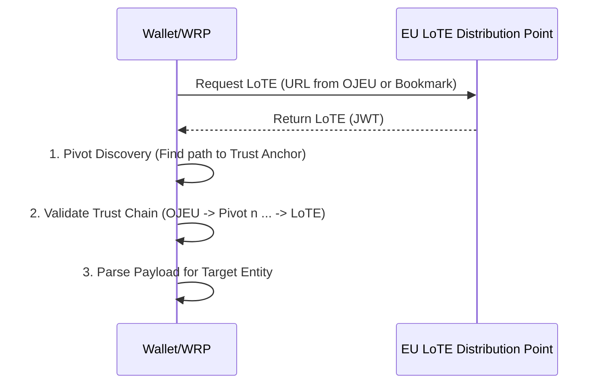
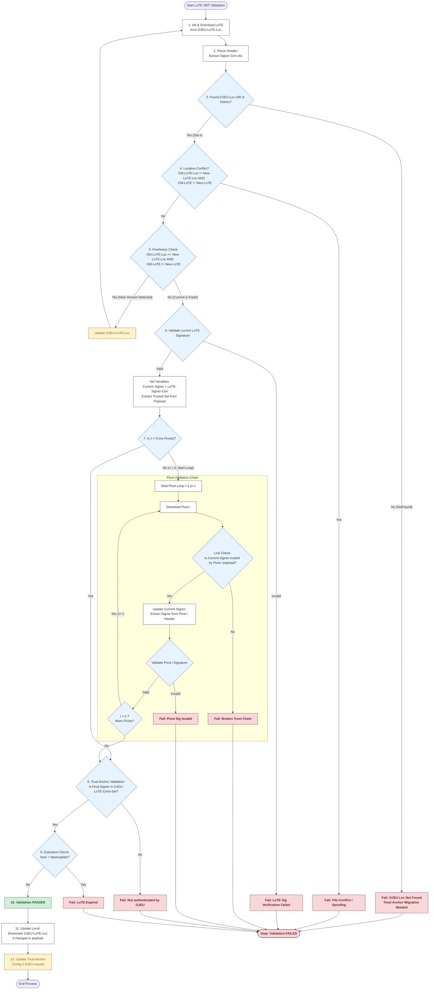
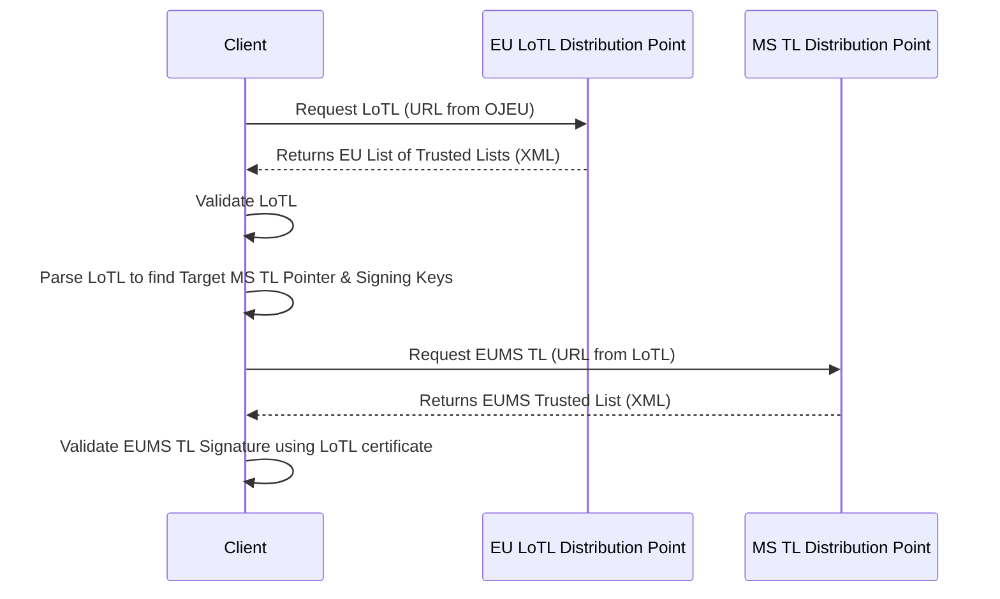
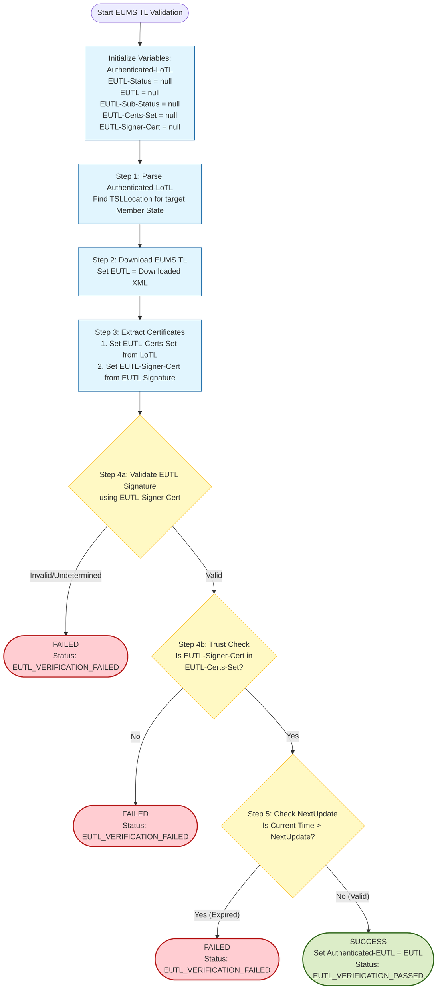

# Trust Anchor Validation Process

The Trust Anchor Validation Process allows a Wallet Instance or Wallet Relying Party (WRP) to validate a List of Trusted Entities (LoTE) or an EU Member State Trusted List (EUMS TL). This process establishes the cryptographic root of trust required to validate:
<ol type="a">
  <li>Infrastructure Certificates: The certificate chains of WRPAC Providers or WRPRC Providers.</li>
  <li>Wallet Attestation Signatures: The certificate chains verifying a Wallet Unit Attestation (WUA) or Wallet Instance Attestation (WIA).</li>
  <li>PID Signatures: The certificate chains verifying a Person Identification Data (PID); or</li> 
  <li>QEAA or Pub-EAA Signatures: The certificate chains needed to verify the signature/seal on a QEAA or Pub-EAA.</li>
</ol>
In cases (a), (b) and (c), the Entity MUST fetch, download, and validate the relevant LoTE. For case 4, the Entity MUST fetch, download, and validate the relevant EUMS TL.

Both the LoTE and LoTL are signed artifacts maintained via a Trust Anchor published in the Official Journal of the European Union (OJEU). To support continuous key rotation, both artifacts implement a pivoting mechanism. This allows an Entity possessing the last known valid version to discover the location of the next version and validate it using the chain of trust rooted in the OJEU.

## List of Trusted Entities Validation

This section defines the validation of the EU-level List of Trusted Entities (LoTE). The LoTE is a digitally signed/sealed artifact (JWT format) containing metadata and public keys for entities operating at the EU level.

Prior to validating the LoTE, the Wallet Instance MUST download the LoTE from the protected location (URI) published in the OJEU. 

### Sequence diagram

### Validation process

The validator initializes the following variables.
**Input Variables**:
- `OJEU-Loc`: URI of the latest (known) OJEU publication.
- `OJEU-LoTE-Loc`: URI of the last processed LoTE. Defaults to the value in `OJEU-Loc`.
- `OJEU-LoTE-Certs-Set`: The set of Trust Anchor certificates from the `OJEU-Loc` publication.
- `LoTE`: The LoTE JWT currently being processed. Initialized as NULL.
- `LoTE-Signer-Cert`: The certificate extracted from the x5c header parameter of the LoTE.
- `LoTESO-Cert`: Temporary variable for the Scheme Operator certificate being validated. Initialized as NULL.
- `LoTESO-Certs-Set`: Trusted certificates extracted from the `PointersToOtherLoTE` claim (`SchemeTerritory` `EU`) of a LoTE or Pivot. Initialized as NULL.

**Output Variables**:
- `Authenticated-LoTE`: The validated JSON payload.
- `LoTE-Status`: The validation result (e.g., `LoTE_VERIFICATION_PASSED`).
- `LoTE-Sub-Status`: detailed error codes.

**Validation Steps**:
The validation MUST perform the following steps:
1. (Initialization) Download the JWT file from `OJEU-LoTE-Loc` and assign it to `LoTE`.
2. (Parsing) Extract the first certificate from the `x5c` header of `LoTE` and assign it to `LoTE-Signer-Cert`.
3. (Pivot Discovery) Iterate through the `uriValue` claims in the `SchemeInformationURI` object. Count the number of valid URIs found before encountering the URI matching `OJEU-Loc`. Let $n$ be that count.
    - If no URI matches `OJEU-Loc`: Validation MUST fail with `LoTE-Status` set to `LoTE_VERIFICATION_FAILED` and `LoTE-Sub-Status` set to `OJEU_LOCATION_INPUT_NOT_MATCHING_OJEU_LOCATION_IN_LoTE`. (This implies a Trust Anchor migration is required).
4. (LoTE Location Conflict) Check the condition: `OJEU-LoTE-Loc != LoTELocation` AND `LoTE != Content at LoTELocation`.
    - (`LoTELocation` is the URI in the `PointersToOtherLoTE` claim of `LoTE` with `SchemeTerritory` = `EU`).
    - If `TRUE`: Validation MUST stop with `LoTE-Status` set to `LoTE_VERIFICATION_FAILED` and `LoTE-Sub-Status` set to `LoTE_FILE_CONFLICT`.
    - If `FALSE`, proceed to the next step.
5. (LoTE Freshness) Check the condition: `OJEU-LoTE-Loc == LoTELocation` AND `LoTE !=` Content at `LoTELocation`.
    - If `TRUE`: Set `OJEU-LoTE-Loc` to `LoTELocation` and restart from Step 1.
    - If `FALSE`, proceed to the next step.
6. (Digital Signature Validation) Validate the cryptographic signature of the current `LoTE` using the public key from `LoTE-Signer-Cert`.
    - If validation fails: Stop with `LoTE-Status` set to `LoTE_VERIFICATION_FAILED` and `LoTE-Sub-Status` set to `LoTE_SIGNATURE_VERIFICATION_FAILED`.
    - If successful:
        - Set `LoTESO-Cert` to `LoTE-Signer-Cert`.
        - Set `LoTESO-Certs-Set` to the certificates found in the `PointersToOtherLoTE` claim (territory `EU`) of the current `LoTE` payload.
7. (Intermediate Pivot Validation)
    - Case $n=0$ (No Pivots): Proceed directly to Step 8.
    - Case $n>0$ (History Chain):
        - Iterate $i$ from 1 to $n$ (from most recent Pivot to oldest). Let `Pivot` be the file downloaded from the $i$-th URI.
        - (Link Check) Set `Pivot-Certs-Set` to the certificates in the `PointersToOtherLoTE` claim (territory `EU`) of `Pivot`. If `LoTESO-Cert` (the signer of the previous file in the chain) is not in `Pivot-Certs-Set`, validation MUST fail with `LoTE-Sub-Status` set to `PIVOT_i-1_SIGNER_CERT_NOT_AUTHENTICATED_BY_PIVOT_i`.
        - (Update Signer) Set `LoTESO-Cert` to the first certificate in the `x5c` header parameter of `Pivot`.
        - (Verify Signature) Validate the signature of `Pivot` using `LoTESO-Cert`. If it fails, validation MUST fail with `LoTE-Status` set to `LoTE_VERIFICATION_FAILED`, and `LoTE-Sub-Status` set to `PIVOT_i_SIGNATURE_VERIFICATION_FAILED`.
        - The loop continues, walking backwards until LoTESO-Cert represents the signer of the oldest Pivot.
8. (Trust Anchor Validation) Verify the end of the chain. If `LoTESO-Cert` (from the last Pivot or current LoTE) is not in `OJEU-LoTE-Certs-Set` (the Trust Anchor), validation MUST fail with `LoTE-Sub-Status` set to `PIVOT_n_SIGNER_CERT_NOT_AUTHENTICATED_BY_OJEU`.
9. (Expiration) If current time > `NextUpdate` claim of `LoTE`, validation MUST fail.
10. (Success) Set `Authenticated-LoTE` to `LoTE`, `LoTE-Status` to `LoTE_VERIFICATION_PASSED`.
11. (Update Bookmark) If `OJEU-LoTE-Loc` does not match the `LoTELocation` in `Authenticated-LoTE` (territory `EU`), update `OJEU-LoTE-Loc` to that value.
12. (Update Anchor) [Caution: This step modifies the Root of Trust configuration]
    - If `OJEU-Loc` does not match the first URI in `SchemeInformationURI`, update `OJEU-LoTE-Loc`.
    - Update `OJEU-LoTE-Certs-Set` according to the new trust anchor either in `Authenticated-LoTE` or from a new OJEU publication.

**Remarks**:
- Steps 4, 5 and 11 allow modifying the location of the LoTE file without changing the trust anchor, as long as the both the old and the new location have the same content (otherwise the validation fails with `LoTE_FILE_CONFLICT` status). This allows the LoTE to be retrieved from different locations (e.g., mirrors) without affecting the trust anchor validation as long as the content is the same.
- In case of `OJEU_LOCATION_INPUT_NOT_MATCHING_OJEU_LOCATION_IN_LoTE` error, it is likely that the OJEU publication has been updated with a new location for the LoTE, and the validation process needs to be restarted with the new location.
- In step 8. the validator established the binding of the signer certificate of the `LoTE` XML with the certificate referenced in the OJEU, effectively using the latter as a trust anchor.

To validate a Pub-EAA LoTE in XML format (XAdES) containing the sought trust anchor, the Wallet Instance or WRP MUST perform the same steps described in [Validation of the LoTL](#validation-of-the-LoTL) for the LoTE, with the following difference: the variables and status codes used throughout have `LoTE` in place of `LoTL`.

Below is a flowchart summarizing the above steps for the validation of the LoTE:

## EUMS Trusted List Validation

This section defines the validation of Member State Trusted Lists (EUMS TL). The EUMS TL is an XML artifact signed by a Member State Scheme Operator. In order to validate the EUMS TL, the Wallet Instance or WRP uses the following validation hierarchy:
1. The Wallet/WRP MUST first validate the EU List of Trusted Lists (LoTL).
2. The Wallet/WRP uses the authenticated LoTL to discover and validate the EUMS TL.

### Sequence diagram

In the diagram above, a Wallet Instance or WRP downloads and validates an EUMS Trusted List by performing the following steps:
1. requests the LoTL at the location indicated by the URL published in the OJEU;
2. the LoTL distribution point returns the LoTL XML document;
3. validates the signature/seal on the downloaded LoTL and verifies its validity;
4. parses the LoTL to retrieve the location (`TSLLocation`) and the associated validation certificates (`DigitalId`) for the target Member State's Trusted List Service Operator.
5. requests the EUMS TL at the location indicated by the `TSLLocation` field in the LoTL;
6. the EUMS TL distribution point returns the EUMS TL XML document;
7. validates the signature/seal on the downloaded MS TL using the certificates obtained from the LoTL in Step 4.
8. parses the EUMS TL to retrieve the metadata and public key certificates of the relevant entities (e.g., QEAA Providers, Pub-EAA Providers) and use them as trustworthy trust anchors for verifying signatures/seals on QEAAs or Pub-EAAs.

If any of the above verifications fail, the validation process MUST be aborted and the LoTE MUST be considered invalid. If all verifications succeed, the Wallet Instance or WRP can parse the EUMS TL to retrieve the metadata and public key certificates of the relevant entities (i.e., QEAA Providers or Pub-EAA Providers) and use them as trustworthy trust anchors for verifying signatures/seals on QEAAs or Pub-EAAs.

### Validation process

To validate a EUMS TL containing the sought trust anchor, the Wallet Instance or Relying Party MUST validate both the LoTL and the EUMS TL. The validation of the LoTL is a prerequisite for the validation of the EUMS TL, as the trust anchor for validating the EUMS TL is obtained from the LoTL. 

#### Validation of the LoTL

**Remarks**: The logic mirrors the LoTE validation but uses XML signatures (XMLDSig) and TSL-specific elements.
- The XML Pivot logic (Step 6) includes a "Self-Consistency Check" not present in the JWT logic due to the fact that the `Signature` element is not integrity protected.

The Wallet Instance or Relying Party initializes the following input variables for the LoTL validation:
- `OJEU-Loc`: URI value referencing the latest publication of the Official Journal of the European Union (OJEU) related to data on EUMS TL.
- `OJEU-LoTL-Loc`: URI value representing the location where the last processed instance of the LoTL XML file is available. If not available, this is initialized from the `OJEU-Loc` publication.
- `OJEU-LoTL-Certs-Set`: The set of certificates used to ensure the authenticity and integrity of the LoTL. Initialized from the `OJEU-Loc` publication.
- `LoTL`: The XML file of the LoTL currently being processed. Initialized as `null`.
- `LoTL-Signer-Cert`: Extracted from `ds:X509Certificate` in the LoTL signature. Initialized as `null`.
- `LoTLSO-Cert`: The certificate of the LoTL Scheme Operator (LoTLSO) extracted from the `KeyInfo` element of the LoTL signature. Initialized as `null`.
- `LoTLSO-Cert-Sets`: The set of trusted certificates extracted from the `PointersToOtherTSL` element (with `SchemeTerritory` = `EU`) within a LoTL or Pivot file. Initialized as `null`.

The operations described below produce the following output variables:
- `Authenticated-LoTL`: The authenticated XML version of the current instance of the LoTL.
- `LoTL-Status`: The status indication of the process of authenticating the current instance of the LoTL.
- `LoTL-Sub-Status`: A list of indications supplementing LoTL-Status indication of the process of authenticating the current instance of the LoTL.

The validation operations for the LoTL MUST perform the following steps (see ETSI TS 119 615 clause 4.1.4 for reference):
1. [PRO-4.1.4-1] (Initialization) Set `LoTL` to the XML file downloaded from `OJEU-LoTL-Loc`.
2. [PRO-4.1.4-2] (Parsing) Set `LoTL-Signer-Cert` to the certificate extracted from the `ds:X509Certificate` element within the `ds:Signature` of the `LoTL`.
3. [PRO-4.1.4-3, PRO-4.1.4-4] (Pivot Discovery) Iterate through the URIs in the `SchemeInformationURI` element. Count the number of successive valid XML URIs found before encountering the URI matching `OJEU-Loc`. Let $n$ be that count. If no URI matches `OJEU-Loc`, the validation MUST fail with `LoTL-Status` set to `LoTL_VERIFICATION_FAILED` and `LoTL-Sub-Status` set to `OJEU_LOCATION_INPUT_NOT_MATCHING_OJEU_LOCATION_IN_LoTL`.
4. [PRO-4.1.4-5] (LoTL Location Conflict) Check the condition: `OJEU-LoTL-Loc != TSLLocation` AND `LoTL != Content at TSLLocation`.
    - (`TSLLocation` is the URI in the `PointersToOtherTSL` element of `LoTL` with `SchemeTerritory` = `EU`).
    - If TRUE: Validation MUST stop with `LoTL-Status` set to `LoTL_VERIFICATION_FAILED` and `LoTL-Sub-Status` set to `LoTL_FILE_CONFLICT`.
    - If FALSE: Proceed to the next step.
5. [PRO-4.1.4-6] (LoTL Freshness) Check the condition: `OJEU-LoTL-Loc == TSLLocation` AND `LoTL != Content at TSLLocation`.
    - If TRUE: Set `OJEU-LoTL-Loc` to `TSLLocation` and restart from Step 1.
    - If the result is `FALSE`, proceed to the next step.
6. [PRO-4.1.4-7] Validate the digital signature of the current `LoTL` using the public key from `LoTL-Signer-Cert`.
    - [PRO-4.1.4-8] If validation fails: Stop with `LoTL-Status` set to `LoTL_VERIFICATION_FAILED`.
    - [PRO-4.1.4-9] If successful: Set `LoTLSO-Cert` to `LoTL-Signer-Cert`. Set `LoTLSO-Certs-Set` to the certificates found in the `PointersToOtherTSL` tuple (territory `EU`) of the current `LoTL`.
7. (Intermediate Pivot Validation)
    - [PRO-4.1.4-10] If $n = 0$ (No Pivots):
        - If `LoTLSO-Cert` is not in `OJEU-LoTL-Certs-Set`, validation MUST fail (Signer not authorized by Trust Anchor). Otherwise, proceed to Step 8.
    - [PRO-4.1.4-11] If $n > 0$ (History Chain):
        - Iterate $i$ from 1 to $n$ (from most recent Pivot to oldest). Let `Pivot` be the file at the $i$-th URI.
        - (Link Check) Set `Pivot-Certs-Set` to the certificates in the `PointersToOtherTSL` (territory `EU`) of `Pivot`. If `LoTLSO-Cert` (from the previous step) is not in `Pivot-Certs-Set`, validation MUST fail with `LoTL-Sub-Status` set to `PIVOT_i-1_SIGNER_CERT_NOT_AUTHENTICATED_BY_PIVOT_i`.
        - (Extract Signer) Set `LoTLSO-Cert` to the certificate extracted from the signature of `Pivot`.
        - (Self-Consistency Check) If `LoTLSO-Cert` is not in `Pivot-Certs-Set`, validation MUST fail with `LoTL-Sub-Status` set to `PIVOT_i_SIGNER_CERT_NOT_AUTHENTICATED_BY_PIVOT_i`.
        - (Verify Signature) Validate the signature of `Pivot` using `LoTLSO-Cert`. If it fails, validation MUST fail with `LoTL-Sub-Status` set to `PIVOT_i_SIGNATURE_VERIFICATION_FAILED`.
        - The loop continues with the new `LoTLSO-Cert` acting as the input for the next Pivot or the Anchor.
8. [PRO-4.1.4-12] (Trust Anchor Validation) If `LoTLSO-Cert` (from the last Pivot) is not in `OJEU-LoTL-Certs-Set` (the Trust Anchor), validation MUST fail with `LoTL-Sub-Status` set to `PIVOT_n_SIGNER_CERT_NOT_AUTHENTICATED_BY_OJEU`.
9. [PRO-4.1.4-13] (Expiration) If current time > `NextUpdate` of `LoTL`, validation MUST fail with `LoTL-Sub-Status` set to `LoTL_NEXTUPDATE_PASSED`.
10. [PRO-4.1.4-14, 15] (Success) Set `Authenticated-LoTL` to `LoTL`, `LoTL-Status` to `LoTL_VERIFICATION_PASSED`.
11. [PRO-4.1.4-16] (Location Update) If `OJEU-LoTL-Loc` does not match the `TSLLocation` in `Authenticated-LoTL` (territory `EU`), update `OJEU-LoTL-Loc` to that value.
12. [PRO-4.1.4-17] (Update Anchor) [Caution: This step modifies the Root of Trust configuration]
    - If the `OJEU-Loc` does not match the URI to the first `SchemeInformationURI` tuple, set the `OJEU-Loc` variable to that URI. 
    - Update `OJEU-LoTL-Certs-Set` to the certificates found in `Authenticated-LoTL` (or from the new OJEU publication).

#### Validation of the EUMS TL

The validation operations for the EUMS TL MUST perform the following steps (see ETSI TS 119 615 clause 4.2.4 for reference).

**Input variables**: [PRO-4.2.4-01, PRO-4.2.4-02]
- `Authenticated-LoTL`: The authenticated XML version of the current instance of the LoTL obtained from the validation of the LoTL.
- `EUTL-Status`: The XML file of the EUMS TL currently being processed. This variable is initialized as `null`.
- `EUTL-Sub-Status`: A list of indications supplementing `EUTL-Status` indication of the process of authenticating the current instance of the EUMS TL.
- `EUTL`: The XML file of the EUMS TL currently being processed. This variable is initialized as `null`.
- `EUTL-Certs-Set`: The full set of certificates used for ensuring authenticity and integrity of the EUMS TL. This variable is initialized as `null`.
- `EUTL-Signer-Cert`: The certificate extracted from the XML signature of the EUMS TL. This variable is initialized as `null`.

**Validation Steps**:
1. [PRO-4.2.4-03] (Parsing) Parse the `Authenticated-LoTL` to find the `TSLLocation` field in the `PointersToOtherTSL` element with `SchemeTerritory` value matching the target Member State. 
2. [PRO-4.2.4-04] (EUMS TL Download) Download the XML file from the `TSLLocation` found in the previous step and set the `EUTL` variable to the downloaded XML file.
3. [PRO-4.2.4-05, PRO-4.2.4-06] (EUMS TL Parsing) Parse the `Authenticated-LoTL` to find the `X509Certificates` tuple in the `ServiceDigitalIdentity` element of the `PointersToOtherTSL` element with `SchemeTerritory` value matching the target Member State, and set the `EUTL-Certs-Set` variable to the full set of certificates available in that tuple. The set the `EUTL-Signer-Cert` variable to the certificate extracted from the XML in the `ds:X509Certificate` element in the `ds:KeyInfo` element in the `Signature` element of the `EUTL`.
4. [PRO-4.2.4-07, PRO-4.2.4-08, PRO-4.2.4-09] (EUMS TL Integrity and Authenticity Validation) 
    - Validate the digital signature of the `EUTL` using the `EUTL-Signer-Cert`. If the signature validation fails, or it is undetermined, the validation MUST fail with `EUTL-Status` set to `EUTL_VERIFICATION_FAILED`, and `EUTL-Sub-Status` set to `EUTL_SIGNATURE_VERIFICATION_FAILED`.
    - If the signature validation is successful, check that the `EUTL-Signer-Cert` is in the `EUTL-Certs-Set` (i.e., the signing certificate of the EUMS TL has not been tampered with). If the check fails, the validation MUST fail with `EUTL-Status` set to `EUTL_VERIFICATION_FAILED`, `Authenticated-LoTL` set to `null`, and `EUTL-Sub-Status` set to `EUTLSO_SIGNER_CERT_NOT_AUTHENTICATED_BY_LoTL`.
5. [PRO-4.2.4-10] (EUMS TL Validity Check) Check the `NextUpdate` field in the `EUTL`. 
    - If the current date/time is greater than the `NextUpdate` value, the validation MUST fail with `EUTL-Status` set to `EUTL_VERIFICATION_FAILED`, and `EUTL-Sub-Status` set to `WARNING_EUTL_NEXTUPDATE_PASSED`.
6. [PRO-4.2.4-11, PRO-4.2.4-12] If all the above checks are successful, set `Authenticated-EUTL` to the value of the currently validated `EUTL`, `EUTL-Status` to `EUTL_VERIFICATION_PASSED`, and `EUTL-Sub-Status` to an empty list.

Below is a flowchart summarizing the above steps for the validation of the EUMS TL:
