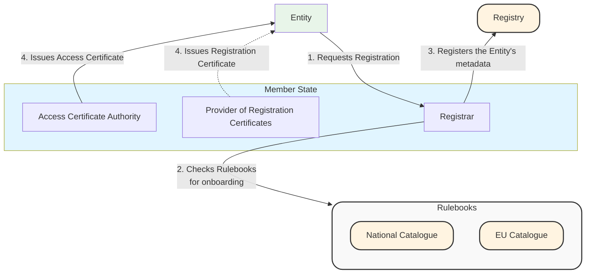
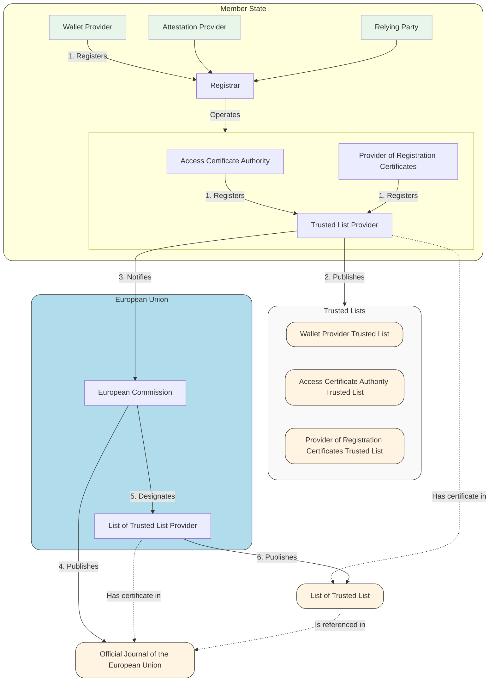
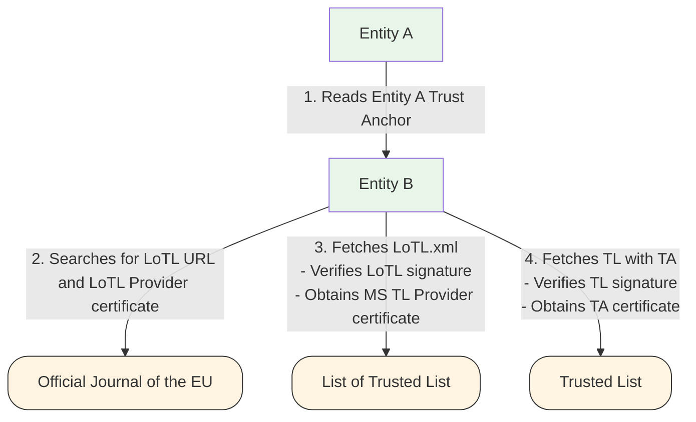

# Trust Architecture

This section describes the trust model and its architecture at a high level by providing definitions for the terms used in the rest of the ducument and representing graphically the trust processes which are in scope of D2.1.

## Definitions

In this section we give a precise meaning to the Entities, Components, Roles, Services and Processes which are relevant for the specification. The following definition are mutuated from the terminology already present in the ARF.

An **Entity** is a distinct legal, or natural person that participates in the ecosystem. Entities possess an identity and are accountable for the actions of the Components they operate, or whose operation they delegate to other Entities. The following Entities are present in this specification:
- **User/Wallet Holder**: The natural or legal person who controls the Wallet Unit.
- **Relying Party (RP)**: A natural or legal person that relies upon presentation of Attestations from a Wallet Unit for the provision of a service.
- **Attestation Provider**: An Entity responsible for issuing Attestations to the Wallet Unit. This includes Qualified Trust Service Providers (QTSP) issuing Qualified Electronic Attestation of Attributes (QEAA).
- **Wallet Provider**: An Entity that provides the Wallet Solution (software and related backend services) to the User.
- **Registrar**: An Entity responsible for onboarding and registering other ecosystem participants, as well as maintaining authoritative records of their identity, public key material and authorizations.
- **Trust Service Provider (TSP)**: An entity that provides one or more trust services.
- **Supervisory Body**: An Entity responsible for the supervision of Trust Service Providers, Attestation Providers, and other actors within the EUDIW ecosystem to ensure compliance with the relevant regulations.

**Regulatory Subjects**: These are subjects that define rules and specific operational procedures for Entities.
- **Member States (MS)**: They norm the Registration process and designate Registrars for the onboarding of Entities. In addition, they are responsible for communicating to the European Commission the Trusted List Providers at the National level. These may manage directly or indirectly a Catalogue of National credentials.
- **European Commission (EU)**: The subject in charge of providing and keeping up to date the Official Journal of the European Union, designating the List of Trusted List Provider, and a Catalogue of EU credentials.

A **Component** is a functional unit, software module, or subsystem operated by an Entity to perform specific technical operations within the EUDIW ecosystem. An Entity may operate multiple distinct Components. A Component is defined by its function within the architecture, regardless of which Entity physically operates it. For example, an Entity may delegate the operation of a Component to a specialized Trust Service Provider, regardless the Component in question remains within the Entity's logical domain. The following Components are present in this specification:
- **Wallet Unit** (Wallet Provider Component): The specific instantiation of the Wallet software installed on the User's device.
- **Relying Party Instance** (Relying Party Component): The specific instantiation of the Relying Party that interacts with the Wallet Unit to request and verify data.
- **Registry** (Registrar Component): The authoritative database or repository Component where the Registrar stores the identity and metadata of registered entities.
- **Trusted List** (MS/EU Component): The signed artifact (in XML format) containing the list of trusted services and their status within a Member State.
- **Trusted List Provider** (Registrar Component): The Component responsible for generating and signing the Member State Trusted List.
- **Catalogue** (MS/EU Component): The Component which Registration Certificate Provider may use to check the entitlements of a certain Wallet Relying Party to issue/request certain attributes/credentials.
- **Official Journal of the European Union** (OJEU - EU Component): The Official Journal of the European Union, which serves as the publication mechanism for the List of Trusted Lists (LOTL) URL and TLS certificate hash, acting as the root of trust.
- **Access Certification Authority** (Registrar Component): The PKI Component responsible for issuing Access Certificates to authenticated participants.
- **Provider of Registration Certificates** (Registrar Component): The Component responsible for issuing Registration Certificates that encode the specific entitlements or data request permissions of an Entity.

A **Role** describes the specific function, authorization, or set of responsibilities assigned to an Entity or Component during a specific interaction or process. The following Roles are present in this specification:
- **Issuer**: The role of an Attestation Provider when issuing credentials to a Wallet Unit.
- **Verifier**: The role of a Relying Party Instance when validating the credential presentation by a Wallet Unit.
- **Holder**: The role of the User (operating the Wallet Unit) when requesting, storing or selectively disclosing credentials.

A **Service** is a distinct capability or interface exposed by a Component to other actors in the ecosystem to facilitate a process such as onboarding, lifecycle management, or trust evaluation. The following Services are present in this specification:
- **Certificate Revocation Service**: The interface for checking the revocation status of certificates (e.g., via CRL download points, OCSP responders, or Status Lists).
- **Registry API**: The programmatic interface exposed by the Registry Component allowing participants to query Entity metadata, status, or public keys.
- **Catalogue API**: The interface allowing the retrieval of trusted metadata used by the Registrar and Registration Certificate Provider needed for the Registration phase.

A **Process** describes the workflow and sequence of interactions between Entities and/or Components to achieve a specific goal. The following Processes are present in this specification:
- **Publication**: The process through which an Entity requests onboarding to the EUDIW ecosystem; the Registrar registers the Entity's metadata in the Registry while the Access Certification Authority and the Registration Certificate Provider, issue an Access and, optionally, Registration Certificate.   
- **Notification**: The process through which a Member State notifies the identifiers and public key material of its Trusted List Providers to the European Commission for inclusion in the List of Trusted List. 
- **Trust Evaluation**: The process through which an Entity authenticates another Entity using the LoTL as the primary Trust Anchor (TA).
- **Entitlements Evaluations**: The process through which an Entity checks whether another Entity (which has been already authenticated) is authorized to perform some transaction using the parameters present in the Registration Certificate. 
- **Trust Management**: The process by which Supervisory Bodies, Member States, Trusted List Providers and Access Certificate Authorities monitor Entities and revoke certificates if need be.
- **Entitlement Management**: The process by which Supervisory Bodies, Member States, and Registration Certificate Providers monitor the conduct of Attestation Providers and Relying Parties to ensure compliance with the relevant regulations and authorizations granted during Registration.

## Terminology Mapping
The following table maps terms across the Implementing Acts, ETSI Specifications, and the ARF frameworks.

| IA | ETSI | ARF |
| :- | :--- | :-- |
| | Wallet Relying Party | Attestation Provider |
| Wallet Relying Party | Wallet Relying Party | Relying Party |
| Wallet Provider | Wallet Provider | Wallet Provider |
| | | Registry |
| | Trusted List Scheme Operator | Trusted List Provider |

## High Level Diagrams

In the following section, we represent the diagrams related to the high-level view of the processes detailed in the Definition section. 

### Registration

### Notification

### Trust Evaluation

### Entitlements Evaluations

### Trust Management

### Entitlements Management
