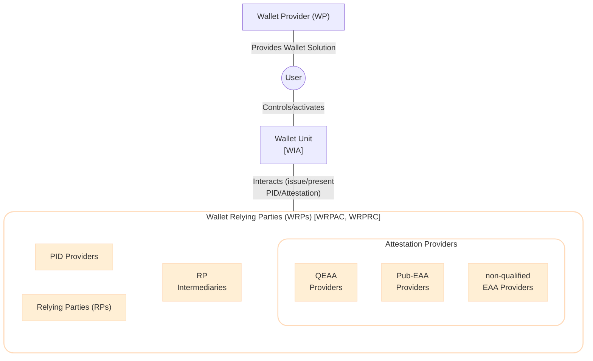
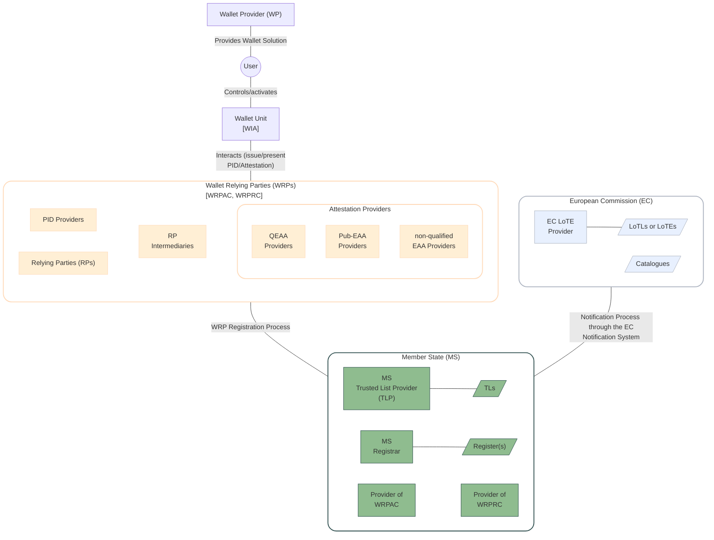

# Trust Architecture

The main entities involved in the EUDIW ecosystem are:
- the Wallet Unit, installed and activated by the User and provided through a Wallet Solution by the Wallet Provider (WP)
- Wallet Relying Parties (WRPs)
    - the PID Providers and Attestation Providers that interact with the Wallet Unit to issue Attestations
    - the Relying Parties (RPs) that interact with the Wallet Unit to request Attestations




However, these entities alone are not enough to establish trust between each others. Indeed, to trust the interactions between these entities, the following processes are needed:
- *Authentication Process*: a way to authenticate the entity they interact with. To achieve this: 
    - the Wallet Unit needs a Wallet Instance Attestation (WIA), an object that attests its integrity and genuinity and is signed by the WP.
    - the WRPs needs an WRP Access Certificate (WRPAC).
- *Authorization Process*: a way to check the authorization of an entity (e.g., it is the WRP eligible to issue/request an Attestation). To achieve this: 
    - the intended use of a WRP is written in a signed Register, and optionally in a WRP Registration Certificate (WRPRC).
    - the Attestation Providers may write their own embedded disclosure policies.
- *Trust Anchor validation process*: a way to check the authenticity of signed objects, e.g., PID, Attestations, certificates and Register. To achieve this:
    - the public key of the corresponding private key used to sign is published on Trusted Lists (TLs) or List of Trusted Entities (LoTEs).

While these trust evaluation processes will be further detailed in the following sections, the processes to obtain and manage the artifacts needed for the trust evaluation are:
- *WRP Registration Process*: to rely on Wallet Units for the purpose of providing a service, WRPs register at a Registrar in the Member State where they are established. Based on the type of service registered, registration includes: the attributes that the RP intends to request from Wallet Units or the attestation type(s) the Attestation Provider wants to issue to Wallet Units. As a result of the registration process:
    - WRP registered data are added in the Register and made available online both in human-readable and machine-readable format; 
    - WRP obtains a WRPAC provided by a Provider of WRPAC; and 
    - optionally, WRP obtains a WRPRC provided by a Provider of WRPRC.

    ```mermaid
    graph TD

    WRP["Wallet Relying Parties <br/> (WRPs)"]

    subgraph MS["Member State (MS)"]
        MSReg[MS <br/>Registrar]
        ProvAC[Provider of <br/>WRPAC]
        ProvRC[Provider of <br/>WRPRC]
        Reg[/"Register(s)"/]
        MSReg---|"Publishes data"| Reg
    end

    subgraph EC["European Commission (EC)"]
        Cat[/Catalogues/]
    end

    %% Style
    style WRP fill:#ffefd5, stroke:#ffdab9,stroke-width:2px,rx:20,ry:20
    style MS fill:#ffff,stroke:#2f4f4f,stroke-width:2px,rx:20,ry:20
    style EC fill:#ffff,stroke:#abb2bf,stroke-width:2px,rx:20,ry:20
    classDef blue fill:#e8f0fe,stroke:#abb2bf
    classDef green fill:#8fbc8f,stroke:#2f4f4f

    class QEAAP,PIDP,PubP,EAAP,RP,RPI WRP_entities;
    class ECLoTE,ECNS,Cat,LoTEs blue;
    class MSReg,ProvAC,ProvRC,TLs,Reg green;

    %% Arrows
    WRP ---|"Request registration"| MSReg
    ProvAC ---|"Issues WRPAC"| WRP
    ProvRC ---|"Issues WRPRC"| WRP
    MSReg ---|"Checks Catalogues"| Cat
    ```
- *Notification Process*: Based on the entity, the MS sends a set of the data to the EC Notification System. 
    - For WPs, PID Providers, Providers of WRPAC, Providers of WRPRC and MS Registrars, MS sends a set of the data (including the trust anchors) to the EC as described in XX. As result, the notified entities are included in a List of Trusted Entities (LoTE) by a EC LoTE Provider.
    - For Pub-EAA Providers, MS sends a set of the data (no trust anchor) to the EC as described in XX. As result, the notified entities are included in a LoTE by a EC LoTE Provider.
    - For QEAA Providers and QTSP, MS sends a set of the data (containing the URL of the MS TLs) to the EC as described in XX. As result, the URL of the MS TLs is added in the EU List of Trusted List (LoTL).
    ```mermaid
    graph LR

    subgraph MS["Member State (MS)"]
        MSTLP["MS  <br/>Trusted List Provider  <br/>(TLP)"]
        TLs[/TLs/]
        MSTLP ---|"publish"| TLs
    end

    subgraph EC["European Commission (EC)"]
        ECLoTE[EC LoTE <br/>Provider]
        LoTE1[/WP <br/>LoTE/]
        LoTE2[/PID Providers <br/>LoTE/]
        LoTE3[/Providers of <br/>WRPAC LoTE/]
        LoTE4[/Providers of <br/>WRPRC LoTE/]
        LoTE5[/MS Registrar <br/>LoTE/]
        LoTE6[/Pub-EAA Providers <br/>LoTE/]
        LoTL[/LoTL/]
        ECLoTE ---|"publish"| LoTE1
        ECLoTE ---|"publish"| LoTE2
        ECLoTE ---|"publish"| LoTE3
        ECLoTE ---|"publish"| LoTE4
        ECLoTE ---|"publish"| LoTE5
        ECLoTE ---|"publish"| LoTE6
        ECLoTE ---|"publish"| LoTL
    end

    LoTE1 ~~~ LoTE2
    LoTE3 ~~~ LoTE4
    LoTE5 ~~~ LoTE6

    %% Style
    style EC fill:#ffff,stroke:#abb2bf,stroke-width:2px,rx:20,ry:20
    style MS fill:#ffff,stroke:#2f4f4f,stroke-width:2px,rx:20,ry:20
    classDef blue fill:#e8f0fe,stroke:#abb2bf
    classDef green fill:#8fbc8f,stroke:#2f4f4f

    class ECLoTE,ECNS,LoTE1,LoTE2,LoTE3,LoTE4,LoTE5,LoTE6,LoTL blue;
    class MSTLP,TLs green;

    %% Arrows
    EC ---|"Notification Process <br/>(trust anchor or URL of the MS TL)"| MS
    ```

The following figure add these two processes to the previous architecture.

