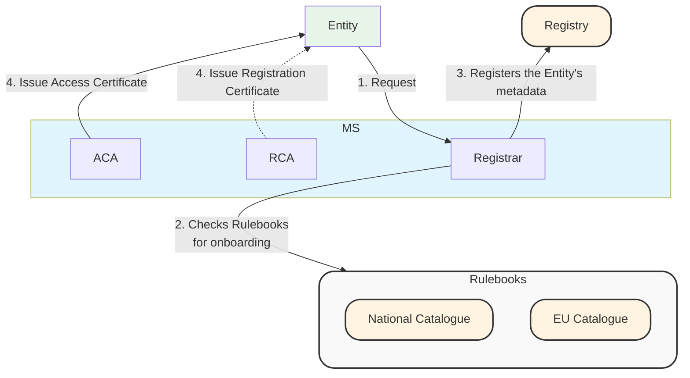
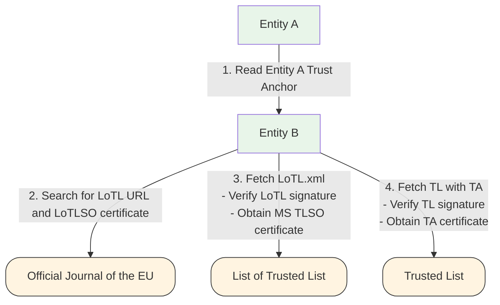

# Trust Architecture

This section describes the trust model and its architecture at a high level by providing definitions for the terms used in the rest of the ducument and representing graphically the trust processes which are in scope of D2.1. The 

## Definitions

In this section we give a precise meaning to the Entities, Components, Roles, Services and Processe which are relevant for the specification. The following definition are mutuated from the terminology already present in the ARF.

An **Entity** is a distinct legal, organizational, or natural person that participates in the ecosystem. Entities possess a legal identity and are accountable for the actions of the components they operate, or whose operation they delegate to other Entities. The following Entities are present in this specification:
- **User/Wallet Holder**: The natural or legal person who is the subject of the Person Identification Data (PID) and Electronic Attestation of Attributes (EAA) and who controls the Wallet Instance.
- **Relying Party (RP)**: A natural or legal person that relies upon an Electronic Identification or Attestations for the provision of a service.
- **Attestation Provider**: An Entity responsible for issuing Person Identification Data (PID) or Electronic Attestation of Attributes (EAA) to the Wallet Instance. This includes Qualified Trust Service Providers (QTSP) issuing Qualified EAAs.
- **Wallet Provider**: An Entity that provides the Wallet Solution (software and related backend services) to the User and is responsible for its compliance with security and functional requirements.
- **Registrar**: An Entity responsible for registering other ecosystem participants and maintaining authoritative records of their identity and authorization status.
- **Trust Service Providers (TSP)**: An entity that provides one or more trust services, such as the creation, verification, and validation of electronic signatures, seals, or certificates. Some components of the Registrar such as the the Access Certificate Authority might be operated by a third party (other then the Registrar) which is a Trust Service Provider.
- **Supervisory Bodies**: An Entity responsible for the supervision of Trust Service Providers, Attestation Providers, and other regulated actors to ensure compliance with the relevant regulations (e.g., eIDAS)

A **Component** is a functional unit, software module, or subsystem operated by an Entity to perform specific technical operations within the ecosystem. An Entity may operate multiple distinct Components. A Component is defined by its function within the architecture, regardless of which Entity physically operates it. For example, an Entity may delegate the operation of a Component to a specialized Trust Service Provider. In this scenario, the Component in question remains within the Entity's logical domain, even if the operational infrastructure belongs to the TSP. The following Components are present in this specification:
- **Wallet Unit** (Wallet Solution component): The specific instantiation of the Wallet software installed on the User's device.
- **Relying Party Instance** (Relying Party component): The specific instantiation of the Relying Party that interacts with the Wallet Instance to request and verify data.
- **Registry** (Registrar component): The authoritative database or repository component where the Registrar stores the identity and metadata of registered entities.
- **Trust List Provider** (Registrar component): The component responsible for generating and signing the Member State Trusted List and EU List of Trusted List.
- **Catalogue** (MS/EU Component):
- **OJEU** (EU Component): The Official Journal of the European Union, which serves as the publication mechanism for the List of Trusted Lists (LOTL), acting as the root of trust anchor.
- **Trusted List** (MS/EU Component): The signed artifact (in XML format) containing the authoritative list of trusted services and their status within a Member State.
- **Access Certification Authority** (Registrar component): The PKI component responsible for issuing Access Certificates to authenticated participants
- **Registration Certificate Provider** (Registrar component): The component responsible for issuing Registration Certificates that encode the specific entitlements or data request permissions of an Entity.

A **Role** describes the specific function, authorization, or set of responsibilities assigned to an Entity or Component within a specific interaction or process. The following Roles are present in this specification:
- **Issuer**: The role assumed by an Attestation Provider when creating and cryptographically signing a PID or EAA.
- **Verifier**: The role assumed by a Relying Party Instance when validating the authenticity and integrity of a credential presented by a Wallet Instance.
- **Holder**: The role assumed by the User (operating the Wallet Instance) when storing and selectively disclosing credentials to a Verifier.
- **Subscriber**: The role assumed by an Entity that contracts with a Registrar or Trust Service Provider for the issuance of a certificate.
- **Revocation Status Publisher**: The role responsible for publishing information regarding the validity status of certificates or credentials (e.g., CRL issuer, OCSP responder).

A **Service** is a distinct capability or interface exposed by a Component to other actors in the ecosystem to facilitate onboarding, lifecycle management of entities, or transactions. The following Serivices are present in this specification:
- **Certificate Revocation Service**: The interface for checking the revocation status of certificates (e.g., via CRL download points, OCSP responders, or Status Lists).
- **Registry API**: The programmatic interface exposed by the Registry component allowing participants to query Entity metadata, status, or public keys.
- **Catalogue API**: The interface allowing the retrieval of trusted metadata used by the Registrar and Registration Certificate Provider needed for the Registration phase .

A **Process** describes the workflow and sequence of interactions between Entities and Components to achieve a specific goal. The following Processes are present in this specification:
- **Publication**, the process thorugh which an Entity requests onboarding to the Registrar; the Registrar then registers the Entity's metadata in the Registry, and prompts the Access Certification Authority and optionally the Registration Certificate Provider to issue an Access and Registration Certificate.   
- **Notification**, the process thorugh which a MS notifies the identifiers and public key material of its Trust List Providers to the EC for inclusion in the LoTL 
- **Trust Evaluation**, the process through which an Entity authenticates another Entity using the EC LoTL as the primary Trust Anchor 
- **Entitlements Evaluations**, the process through which an Entity checks whether another Entity (which has been already authenticated) is authorized to perform some transaction using the ``entitlements`` present in the Registration Certificate; 
- **Trust Management**, the process by which Supervisory Bodies, Member States, Trust List Providers and Access Certificate Authorities supervise Entities and revocate certificates if need be;
- **Entitlement Management**, the process by which Supervisory Bodies, Member States, and Registration Certificate Providers supervise the conduct of Attestation Providers and Relying Parties against the authorization present in the Registration Certificates.

##
The following table maps terms across the Implementing Acts, ETSI Specifications, and the ARF frameworks.

| IA | ETSI | ARF |
| :--- | :--- | :--- |
| | Wallet Relying Party | Attestation Provider |
| Wallet Relying Party | Wallet Relying Party | Relying Party |
| Wallet Provider | Wallet Provider | Wallet Provider |
| | | Registry |
| | Trusted List Scheme Operator | Trusted List Provider |

## High level diagrams

In the following section, we represent the diagrams related to the high-level view of the processes detailed in the Definition section. 

### Registration



### Notification

```mermaid
graph TB
graph TB
    %% Participants

    subgraph MS["Member State"]
        AP["Attestation Provider"]
        RP[Relying Party]
        WP["Wallet Providers"]
        Registrar
        subgraph Child[" "]
            ACA["Access Certificate Authority"]
            RCP["Provider of Registration Certificates"]
            MSTLSO["Trust List Providers"]
        end
    end


    subgraph TL["Trusted Lists"]
        WPTL[Wallet Provider Trusted List]
        ACATL[Access Certificate Authority Trusted List]
        RCPTL[Provider of Registration Certificates Trusted List]
    end
    
    subgraph eu["European Union"]
        EC["European Commission"]
        LoTLSO["List of Trusted List Provider"]
    end

    LoTL["List of Trusted List"]
    OJEU["Official Journal of the EU"]

    %% --- Styles ---

    style eu fill:#b0dcec,stroke:#333,stroke-width:1px,rx:20,ry:20
    style MS stroke:#333,stroke-width:1px,rx:20,ry:20
    style TL fill:#f9f9f9,stroke:#333,stroke-width:1px,rx:20,ry:20
    style WPTL fill:#fff4e1,stroke:#333,stroke-width:1px,rx:20,ry:20
    style ACATL fill:#fff4e1,stroke:#333,stroke-width:1px,rx:20,ry:20
    style RCPTL fill:#fff4e1,stroke:#333,stroke-width:1px,rx:20,ry:20
    style OJEU fill:#fff4e1,stroke:#333,stroke-width:1px,rx:20,ry:20
    style LoTL fill:#fff4e1,stroke:#333,stroke-width:1px,rx:20,ry:20
    style WP fill:#e8f5e9
    style AP fill:#e8f5e9
    style RP fill:#e8f5e9

    %% --- Connections ---

    WP -->|1. Registers| Registrar
    AP --> Registrar
    RP --> Registrar
    Registrar -.->|Operates| Child
    ACA -->|1. Registers| MSTLSO
    RCP -->|1. Registers| MSTLSO
    MSTLSO -->|2. Publishes| TL
    MSTLSO -->|3. Notifies| EC
    MSTLSO -.->|Has certificate in| LoTL
    EC --> |4. Publishes| OJEU
    EC -->|5. Designates| LoTLSO
    LoTLSO -->|6. Publishes| LoTL
    LoTLSO -.->|Has certificate in| OJEU 
    LoTL -.->|Is referenced| OJEU 
```

### Trust Evaluation


### Entitlements Evaluations

### Trust Management

### Entitlements Management
