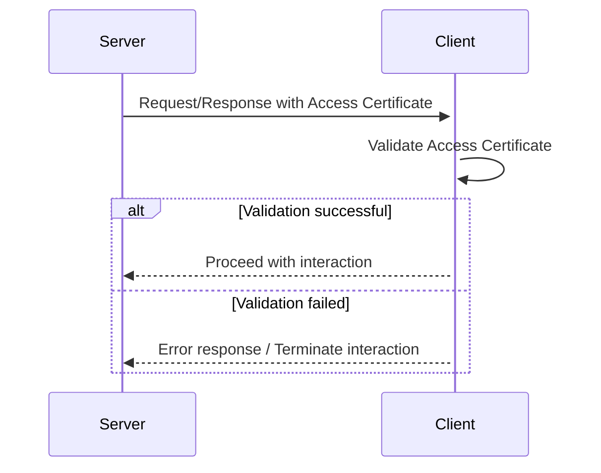
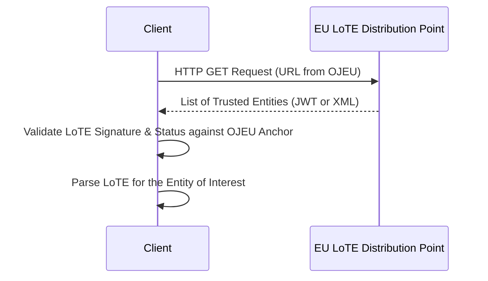
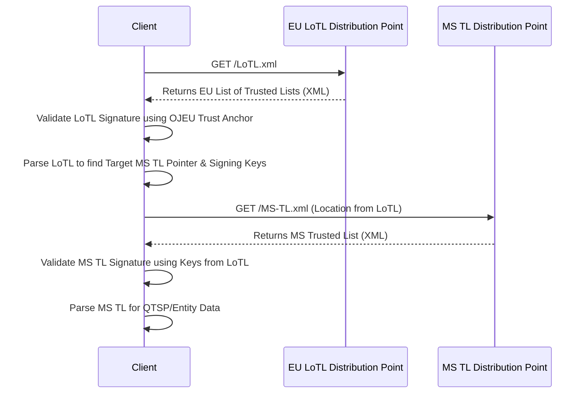

# Trust Evaluation Process (Authentication)

This section describes the **Authentication Trust Evaluation Process**. The process is triggered whenever an Entity needs to authenticate another Entity during an interaction.  This involves verifying the authenticity of an Access Certificate or a Wallet Unit Attestation (WUA) and, therefore, the identity of the sender. The process can occur in different scenarios, such as during issuance or presentation of credentials, or when checking the status of a credential.

At a high level, the Authentication Trust Evaluation Process is composed of **Access Certificate Validation** combined with a **Trust Anchor validation** step. Depending on the type of Entity being authenticated, the **Trust Anchor validation** is performed via either **List of Trusted Entities Validation** or **Trusted List Validation**.

- **Access Certificate Validation**
  The authenticating Entity (*client*) validates the Access Certificate presented by the Entity being authenticated (*server*). This involves:
  - Obtaining the WRPAC Provider’s List of Trusted Entities (LoTE).
  - Obtaining the WRPAC Provider’s public key or certification path as indicated in that LoTE.
  - Validating the Access Certificate’s certification path up to the WRPAC Provider, including all required checks (signature, validity period, revocation, and policy constraints) as profiled for Access Certificates.

- **Trust Anchor Validation**
  - **List of Trusted Entities (LoTE) Validation**
    In case the Entity being authenticated is a PID Provider, a Wallet Provider, a WRPAC Provider, a WRPRC Provider, a Registrar, or a Pub-EAA Provider, the authenticating Entity downloads and establishes trust in the List of Trusted Entities. This typically involves:
      - Retrieving the relevant List of Trusted Entities issued by the European Commission.
      - Validating the List of Trusted Entities using information obtained from the Official Journal of the European Union (OJEU).

  - **Trusted List (TL) Validation**
    In case the Entity being authenticated is a QEAA Provider or a QTSP in a Member State Trusted List (MS TL), the authenticating Entity downloads and establishes trust in the List of Trusted Lists (LoTL) and the MS TL that contains the metadata of the Entity being authenticated. This typically involves:
      - Retrieving the List of Trusted Lists that enumerates Trusted List Providers.
      - Validating the authenticity and integrity of the List of Trusted Lists by validating the corresponding List of Trusted Lists Provider Certificate using information obtained from the Official Journal of the European Union (OJEU).
      - Obtaining the Trusted List Provider’s public key (or certificate) from the validated "List of Trusted Lists".
      - Retrieving the relevant Trusted List issued by that Trusted List Provider.
      - Validating the Trusted List Provider Certificate using the public key obtained from the "List of Trusted Lists", and then validating the authenticity and integrity of the Trusted List (e.g., signature, freshness, policy).

The **Access Certificate Validation** sub‑process MAY be skipped if the Entity being authenticated does not present an Access Certificate (e.g., when the Entity is a Wallet Instance presenting a WUA). In contrast, **Trust Anchor Validation** (via LoTE or TL) is always required to establish trust in the metadata about the Entity being authenticated.

## Use Cases

- The **Wallet Relying Party authenticates a Wallet Instance** by:
  - Obtaining and validating the WUA (see below).
- The **Wallet Instance authenticates a Wallet Relying Party** by:
  - Obtaining the Wallet Relying Party’s Access Certificate.
  - Retrieving and validating the LoTE that references WRPAC Providers.
  - Validating the Issuer’s Access Certificate certification path up to the WRPAC Provider (including revocation and policy checks) using the public key obtained from the LoTE as a trust anchor.
- The **Wallet Instance authenticates Registrars or Registration Certificate Providers** by:
  - Retrieving and validating the LoTE that references the Registrars or Registration Certificate Providers.
  - Using the public key obtained from the LoTE as a trust anchor to validate the Registry or Registration Certificate signature.
- The **Wallet Instance or Wallet Relying Party validates a QTSP qualified signature certificate** by:
  - Retrieving and validating the LoTL and the MS TL that references the QTSP.
  - Validating the QTSP signature certificate using the public key obtained from the MS TL.
- The **Wallet Instance or Relying Party validates a PID** by:
  - Retrieving and validating the LoTE that references the PID Provider.
  - Use the public key obtained from the LoTE as a trust anchor to validate the PID signature.
- The **Wallet Instance or Relying Party validates a Pub-EAA** by:
  - Validating the Pub-EAA signature using the provided QTSP qualified signature certificate.
  - Validating the QTSP qualified signature certificate (see above).
- The **Wallet Instance or Relying Party validates a WUA** by:
  - Retrieving and validating the LoTE that references Wallet Providers.
  - Validating the Wallet Unit Attestation (WUA) signature using the public key certificate associated to the Wallet Solution obtained from the LoTE as a trust anchor.
- The **Relying Party checks the validity status of presented credentials** by:
  - Navigating to the status or revocation service URL contained in the credential’s status metadata.
  - Retrieving a credential status object or revocation list that is signed by the Credential Issuer (or an authority delegated by the Issuer).
  - Authenticating the Credential Issuer (or delegated authority) as described above.

## Access Certificate Validation Process

The Access Certificate Validation Process is a specific instance of the Authentication Trust Evaluation Process in which a *client* (the verifier or relying party) validates the Access Certificate presented by a *server* (the entity being authenticated, such as a Wallet Instance or Issuer).

### Sequence Diagram


In the diagram above, 
1. The *server* sends a message to the *client* that includes an Access Certificate (for example, during a credential presentation).
2. The *client* performs Access Certificate validation. This includes, at a minimum:

    - Constructing and validating the certification path from the Access Certificate to the WRPAC provider, according to the applicable profile based on [RFC 5280](https://datatracker.ietf.org/doc/html/rfc5280) and ETSI TS 119 411-8.
    - Verifying signatures, validity periods, revocation status (via CRLs or OCSP), and any required certificate policies or name constraints.
    - Checking that the resulting trust anchor or WRPAC provider is represented in the relevant, trusted LoTE (see [List of Trusted Entities Validation Process](#list-of-trusted-entities-validation-process) for details).

3. If the Access Certificate validation succeeds, the *client* continues with the interaction flow. If validation fails, the *client* stops the interaction and MUST return an error response, as described in [Access Certificate Validation Error Response](#access-certificate-validation-error-response) indicating that trust establishment did not succeed.

### Access Certificate Validation Error Response

If validation fails, the client MUST return an error indicating the reason for failure (e.g., certificate expired, revoked, or untrusted root).

### Checks performed during Access Certificate Validation

This process includes validation of all intermediate certificates and the end-entity certificate in the path. The trust anchor itself is not validated in this step, as its trust is established via the LoTE or Trusted List; it serves solely as the source of the root public key and distinguished name.

The *client*, for each certificate in the certificate path (excluding the trust anchor), MUST:
- **verify the digital signature**:
    1. verify that the certificate issuer name (`Certificate.tbsCertificate.issuer`) matches the subject name (`Certificate.tbsCertificate.subject`) of the superior (issuer) certificate;
    2. [CONDITIONAL] if the certificate contains an `authorityKeyIdentifier` extension and the superior certificate contains a `subjectKeyIdentifier` extension, verify that the `AuthorityKeyIdentifier.keyIdentifier` value in the certificate matches the `SubjectKeyIdentifier` value in the superior certificate;
    3. verify the certificate signature using the signature algorithm indicated in `Certificate.signatureAlgorithm` and the superior certificate's public key (from `Certificate.tbsCertificate.subjectPublicKeyInfo`) to check `Certificate.signatureValue` over the DER encoding of `Certificate.tbsCertificate`;
    4. if the superior certificate is a self-signed root CA certificate treated as a trust anchor, verify the signature of the *server*s root certificate using the public key contained in the appropriate LoTE ([List of Trusted Entities Validation Process](#list-of-trusted-entities-validation-process)) or TL ([Trusted List Validation Process](#trusted-list-validation-process)).
- **Verify Validity Period**:
  - verify that the current date and time is within the validity period of the certificate by checking the `notBefore` and `notAfter` fields in the `Certificate.tbsCertificate.validity` sequence.
- **Verify Revocation Status**: 
  - verify the revocation status of each certificate in the certificate path using the appropriate method (e.g., CRL, OCSP) as indicated in each certificate's `cRLDistributionPoints` and `authorityInfoAccess` extensions.
    - **Method A: CRL Validation**. If the certificate contains a CRL Distribution Points extension, the *client* parses the `tbsCertificate.extensions` sequence and searches for the `cRLDistributionPoints` extension (`id-ce-cRLDistributionPoints`). Then it
        1. retrieves a CRL from one of the locations specified in the `distributionPoint` field (e.g., using a URI found in `distributionPoint.fullName`);
        2. determines the CRL issuer by checking the `cRLIssuer` field or using the `tbsCertList.issuer` field;
        3. locates the appropriate CRL issuer certificate and verifies the `CertificateList.signatureValue`; 
        4. Checks the CRL current validity window (checking `thisUpdate` and `nextUpdate`)
        5. looks for the certificate's serial number (`Certificate.tbsCertificate.serialNumber`) in the `TBSCertList.revokedCertificates` sequence to determine if the certificate has been revoked. If no matching entry is found and the CRL is valid, the certificate is considered valid.
    - **Method B: OCSP Validation**. If the certificate contains an Authority Information Access extension, the *client* parses the `tbsCertificate.extensions` sequence and searches for the Authority Information Access (`id-pe-authorityInfoAccess`) extension and:
        1. determines the OCSP responder retrival method and location by inspecting the `accessMethod` (specifically `id-ad-ocsp`) and `accessLocation`; 
        2.  prepares an `OCSPRequest` ASN.1 structure containing a `Request` for the certificate, including the `CertID` (either `issuerNameHash`, `issuerKeyHash`, or `serialNumber`);
        3. sends the `OCSPRequest` to the OCSP responder;
        4. parses the returned `OCSPResponse`, it checks that `responseStatus` is successful, `responseType` is set to `id-pkix-ocsp-basic`, and extracts `responseBytes`.
        5. Verifies the ``BasicOCSPResponse.signature`` using a valid responder public key, (e.g., using one of the certificates in `BasicOCSPResponse.certs` selecting it by matching `tbsResponseData.responderID`, either `byName` or `byKey`, to the responder certificate's `subject` or to the hash of its `subjectPublicKeyInfo`) and applying the indicated signature algorithm to the DER encoding of `tbsResponseData`.
        6. parses the `responses` sequence, to find the `SingleResponse` corresponding to the requested `certID`.
        7. checks `thisUpdate` and `nextUpdate` for validity.
        8. identifies the status of the certificate by checking the `certStatus` value, which is one of `good`, `revoked`, or `unknown`, and applies the local revocation policy based on this status. 

#### OCSP Request and Response

This section summarizes the OCSP request and response ASN.1 structures from [RFC 6960](https://datatracker.ietf.org/doc/html/rfc6960).

##### OCSP Request

`tbsRequest` contains one or more `Request` entries in `requestList`, each with a `CertID` that uniquely identifies a certificate by:
- `hashAlgorithm`: the hash function used (traditionally SHA‑1, but profiles MAY allow others).
- `issuerNameHash`: hash of the DER encoding of the issuer’s Name.
- `issuerKeyHash`: hash of the issuer’s subjectPublicKey BIT STRING (excluding tag/length/unused-bits).
- `serialNumber`: the certificate’s serial number.

`optionalSignature`, when present, is a signature over the DER encoding of `tbsRequest`. The certs field can carry a chain to help the responder verify the requestor’s signature.
`requestExtensions` or `singleRequestExtensions` MAY contain, for example, an OCSP `nonce` (`id-pkix-ocsp-nonce`) or preferred signature algorithms (`id-pkix-ocsp-pref-sig-algs`), as defined in [RFC 6960 Section 4.4](https://datatracker.ietf.org/doc/html/rfc6960#section-4.4).

When sent over HTTP using POST ([Appendix A of RFC 6960](https://datatracker.ietf.org/doc/html/rfc6960#appendix-A)), the body is the raw DER encoding of this `OCSPRequest`, with MIME type `application/ocsp-request`.

```asn1
OCSPRequest ::= SEQUENCE {
    tbsRequest                  TBSRequest,
    optionalSignature   [0]     EXPLICIT Signature OPTIONAL
}
TBSRequest ::= SEQUENCE {
    version             [0]     EXPLICIT Version DEFAULT v1,
    requestorName       [1]     EXPLICIT GeneralName OPTIONAL,
    requestList                 SEQUENCE OF Request,
    requestExtensions   [2]     EXPLICIT Extensions OPTIONAL
}
Signature ::= SEQUENCE {
    signatureAlgorithm  AlgorithmIdentifier,
    signature           BIT STRING,
    certs        [0]    EXPLICIT SEQUENCE OF Certificate OPTIONAL
}
Version ::= INTEGER { v1(0) }
Request ::= SEQUENCE {
    reqCert                     CertID,
    singleRequestExtensions [0] EXPLICIT Extensions OPTIONAL
}
CertID ::= SEQUENCE {
    hashAlgorithm       AlgorithmIdentifier,
    issuerNameHash      OCTET STRING,  -- hash of issuer's Name (DN)
    issuerKeyHash       OCTET STRING,  -- hash of issuer's subjectPublicKey
    serialNumber        CertificateSerialNumber
}
```

Below is a concrete example of an OCSP request.

```text
OCSPRequest
  tbsRequest
    version = v1
    requestorName = absent
    requestList = SEQUENCE OF
      Request
        reqCert
          hashAlgorithm = sha1
          issuerNameHash  = SHA1( DER-encode(issuer Name) )
          issuerKeyHash   = SHA1( issuer SubjectPublicKey BIT STRING )
          serialNumber    = 0x01A2B3C4D5
        singleRequestExtensions = absent
    requestExtensions = absent
  optionalSignature = absent
```

##### OCSP Response

An OCSP response at a minimum consists of a `responseStatus` field indicating whether a definitive response is present:
- If `responseStatus` is an error (e.g., `malformedRequest`, `tryLater`), `responseBytes` is absent and the message is not signed.
- If `responseStatus = successful (0)`, `responseBytes` is present.

When transported over HTTP, the body of the HTTP response is the raw DER encoding of this `OCSPResponse`, with MIME type `application/ocsp-response`.

```asn1
OCSPResponse ::= SEQUENCE {
    responseStatus         OCSPResponseStatus,
    responseBytes     [0]  EXPLICIT ResponseBytes OPTIONAL
}
```

The value for `responseBytes` consists of an OBJECT IDENTIFIER and a response syntax identified by that OID encoded as an OCTET STRING. For the basic OCSP response type:
- `responseBytes.responseType` is `id-pkix-ocsp-basic`.
- `responseBytes.response` is the DER encoding of `BasicOCSPResponse`.

OCSP responders SHALL be capable of producing responses of the `id-pkix-ocsp-basic` response type.  Correspondingly, OCSP clients SHALL be capable of receiving and processing responses of the `id-pkix-ocsp-basic` response type.

```asn1
OCSPResponseStatus ::= ENUMERATED {
    successful            (0),  -- response has valid confirmations
    malformedRequest      (1),  -- illegal confirmation request
    internalError         (2),  -- internal error in issuer
    tryLater              (3),  -- try again later
                                -- (4) is not used
    sigRequired           (5),  -- must sign the request
    unauthorized          (6)   -- request unauthorized
}
ResponseBytes ::= SEQUENCE {
    responseType          OBJECT IDENTIFIER,
    response              OCTET STRING
}
```

`BasicOCSPResponse.signature` is computed over the hash of the DER encoding of `tbsResponseData`.

```asn1
BasicOCSPResponse ::= SEQUENCE {
    tbsResponseData      ResponseData,
    signatureAlgorithm   AlgorithmIdentifier,
    signature            BIT STRING,
    certs          [0]   EXPLICIT SEQUENCE OF Certificate OPTIONAL
}
```
The value for `tbsResponseData` is a `ResponseData` structure. The value for `responderID` is either:
- `byName`: the `Name` from the responder’s certificate subject, or
- `byKey`: a `KeyHash` (SHA‑1 of the responder’s `subjectPublicKey` BIT STRING). It MUST correspond to the certificate used to sign the response.

```asn1
ResponseData ::= SEQUENCE {
    version         [0]  EXPLICIT Version DEFAULT v1,
    responderID          ResponderID,
    producedAt           GeneralizedTime,
    responses            SEQUENCE OF SingleResponse,
    responseExtensions [1] EXPLICIT Extensions OPTIONAL
}
ResponderID ::= CHOICE {
    byName              [1] Name,
    byKey               [2] KeyHash
}
```

`responses` is a SEQUENCE OF `SingleResponse`; there is at least one `SingleResponse` for each `CertID` in the request, and possibly more (e.g., when pre-produced or cached responses are used, as allowed by [RFC 6960](https://datatracker.ietf.org/doc/html/rfc6960)). Each `SingleResponse` carries:
- The `CertID` being answered.
- The `certStatus` (`good`, `revoked`, `unknown`).
- A validity interval via `thisUpdate` and optionally `nextUpdate`.
Optional per-certificate extensions (`singleExtensions`), such as CRL references or archive cutoff.

```asn1
SingleResponse ::= SEQUENCE {
    certID                       CertID,
    certStatus                   CertStatus,
    thisUpdate                   GeneralizedTime,
    nextUpdate           [0]     EXPLICIT GeneralizedTime OPTIONAL,
    singleExtensions     [1]     EXPLICIT Extensions OPTIONAL
}
CertStatus ::= CHOICE {
    good        [0]     IMPLICIT NULL,
    revoked     [1]     IMPLICIT RevokedInfo,
    unknown     [2]     IMPLICIT UnknownInfo
}
RevokedInfo ::= SEQUENCE {
    revocationTime              GeneralizedTime,
    revocationReason      [0]   EXPLICIT CRLReason OPTIONAL
}
UnknownInfo ::= NULL
```

Below is a concrete example of an OCSP response with a single `good` status.

```text
OCSPResponse
  responseStatus = successful (0)
  responseBytes
    responseType = id-pkix-ocsp-basic
    response     = DER(BasicOCSPResponse)
      BasicOCSPResponse
        tbsResponseData
          version    = v1
          responderID
            byName = Name("CN=Example OCSP Responder,O=Example CA,C=EU")
          producedAt = 20250101000000Z
          responses = SEQUENCE OF
            SingleResponse
              certID
                hashAlgorithm  = sha1
                issuerNameHash = SHA1( DER-encode(issuer Name) )
                issuerKeyHash  = SHA1( issuer SubjectPublicKey BIT STRING )
                serialNumber   = 0x01A2B3C4D5
              certStatus  = good
              thisUpdate  = 20250101000000Z
              nextUpdate  = 20250102000000Z
              singleExtensions = absent
          responseExtensions = OPTIONAL (e.g., MAY contain a nonce)
        signatureAlgorithm = sha256WithRSAEncryption
        signature          = BIT STRING (signature over hash(DER(tbsResponseData)))
        certs              = SEQUENCE OF
            Certificate (responder’s cert, possibly with its issuing CA cert)
```

Below is a concrete example of an error response indicating a malformed request.

```text
OCSPResponse
  responseStatus = malformedRequest (1)
  responseBytes  = absent
```

## List of Trusted Entities Validation Process

This section summarizes the process by which a List of Trusted Entities (LoTE) at the EU level is validated.

### LoTE Validation: Sequence diagram



In the diagram above, a *client* authenticates and trust in an EU List of Trusted Entities by performing the following steps:
1. downloads the LoTE(s) from the protected location (URI) published in the Official Journal of the European Union (OJEU);
2. validates the integrity, authenticity, and status of the LoTE(s) using the trust anchor (public key or certificate digest) published in the OJEU;
3. parses the LoTE(s) to locate the metadata and public keys of the Entity of interest.

### LoTL Validation: Request and Response Messages

The retrieval of the LoTE MUST be performed via HTTPS. 

#### LoTE Request

The *client* MUST request the LoTE with an HTTP `GET` request to the URI published in the OJEU.

#### LoTE Response

IF the endpoint correctly process the request, it returns a HTTP 200 response containing with Content-Type `application/jwt` (for JAdES-signed JSON) or `application?xml` (for XAdES-signed XML). 

##### LoTE Error Response

If the LoTE cannot be retrieved, the server MUST return an appropriate HTTP error code. The following error codes MUST be supported:

| Error Code | Description | HTTP Status Code |
| ---------- | ----------- | ---------------- |
| invalid_request | HTTP Request is invalid or malformed. | 400 Bad Request |
| temporarily_unavailable | The requested service is temporarily unavailable. | 503 Service Unavailable |

### Checks performed during LoTE Validation

To validate a LoTE containing the information of a PID Provider, Wallet Provider, WRPAC Provider, WRPRC Provider, Registrar, or Pub-EAA Provider, the *client* MUST perform the following steps:
1. **Download**. Download the LoTE from the protected location.
2. **Verify Signature**. Depending on the format, the client verifies the digital signature. The signing certificate MUST be validated against the trust anchor defined in the OJEU. <!-- (e.g., matching the published thumbprint/digest).-->
  - **LoTE in JWT format (JAdES)**:
    - Extract the signing certificate from the `x5c` header parameter.
    - Verify that this certificate matches the trusted certificate or digest published in the OJEU.
    - Verify the JWS signature using the public key from the validated certificate.
  - **LoTE in XML format (XAdES)**:
    - Extract the signing certificate from `ds:Signature.ds:KeyInfo.ds:X509Data.ds:X509Certificate`.
    - Verify that this certificate matches the trusted certificate or digest published in the OJEU.
    - Verify the serial number in `xades:SigningCertificate/xades:Cert/xades:IssuerSerial` matches the extracted certificate.
    - Verify that the digest value in `xades:CertDigest/ds:DigestValue` matches the digest of the extracted certificate (calculated using the algorithm in `ds:DigestMethod`).
    - Verify the `ds:SignatureValue` over the `ds:SignedInfo` element using the public key from the validated certificate.

## Trusted List Validation Process

This section summarizes the process by which a Trusted List (TL) at the Member State (MS) level is validated.

### TL Validation: Sequence diagram



In the diagram above, a *client* authenticates and establishes trust in an EU Member State Trusted List MUST perform the following steps:
1. **Retrieve LoTL**: Downloads the "List of the Trusted Lists" (LoTL) from the location published in the Official Journal of the European Union (OJEU).
2. **Validate LoTL Anchor**: Validates the electronic signature/seal on the downloaded LoTL. This is done by verifying that the digest of the signing certificate matches the Trust Anchor published in the OJEU (specifically, the digest of the public key certificate authorized to sign the LoTL).
3. **Check LoTL Validity**: Verifies the continued validity of the LoTL by ensuring the current time is before `NextUpdate`.
4. **Parse for MS TL**: Parses the LoTL to retrieve the location (`TSLLocation`) and the associated validation certificates (`DigitalId`) for the target Member State's Trusted List Service Operator.
5. **Retrieve MS TL**: Downloads the target Member State Trusted List from the URL found in the LoTL.
6. **Validate MS TL**: Validates the signature/seal on the target MS TL using the certificates obtained from the LoTL in Step 4.

If any check fails, the validation is aborted. If all checks succeed, the client trusts the MS TL, its Scheme Operator, and the Service Providers contained within it.

<!-- Note: Etsi 119 612 says: In time it is likely and certainly possible that such TLSOs or LoTL scheme operators certificates or public keys could also be pre-installed and updated in browsers, so enabling personal users to gain advantage from this approach. I think this is out of scope here unless someone wants to add trusted certificates to the browser/pc. -->

### TL Validation: Request and Response Messages

The transport of Trusted Lists MUST happen via HTTP.

#### LoTL/TL Request

The request MUST be an HTTP `GET`. The client SHOULD provide an `Accept` header to indicate support for the ETSI TSL MIME type (i.e., advertising `application/vnd.etsi.tsl+xml`).

Below a non-normative example:

```http
    GET /TL/TSL-IT.xml HTTP/1.1
    Host: eudiw_example.gov.it
    Accept: application/vnd.etsi.tsl+xml
```

#### LoTL/TL Response

If the request is successful, the response MUST have Status Code `200 OK` and Content-Type `application/vnd.etsi.tsl+xml`. The body of the response MUST be a well-formed TL XML document conforming to [Trusted List and List of Trusted Lists](#trusted_list_and_list_of_trusted_lists). 

Below a non-normative example:

```http
HTTP/1.1 200 OK
Content-Type: application/vnd.etsi.tsl+xml; charset=UTF-8

<tsl:TrustServiceStatusList xmlns:tsl="[http://uri.etsi.org/02231/v2#](http://uri.etsi.org/02231/v2#)" ...>
    <tsl:SchemeInformation>
        ...
    </tsl:SchemeInformation>
    ...
</tsl:TrustServiceStatusList>
```

##### LoTL/TL Error Response

If the LoTL or TL cannot be retrieved, the server MUST return an appropriate HTTP error code. The same error codes of [LoTE Error Response](#LoTE_error_response) MUST be supported.

### Checks performed during Trusted List Validation

To validate the TL of a QTSP or an Issuer (when utilizing the ETSI TS 119 612 hierarchy), the *client* MUST perform the following operations:
1. **Validate the EU List of Trusted Lists (LoTL)**
  - **Download**: Retrieve the LoTL XML from the trusted location (defined in OJEU).
  - **XML Signature Validation**:
    i. Locate the signing certificate in `ds:Signature/ds:KeyInfo/ds:X509Data/ds:X509Certificate`.
    ii. **Trust Anchor Check**: Verify that the digest of this certificate matches the trusted digest published in the OJEU.
    iii. **Integrity Check**: Verify the XML signature (ds:SignatureValue) over the `ds:SignedInfo` block (which covers the `TrustServiceStatusList` element) using the public key from the validated certificate.
    iv. **Standard XAdES Checks**: Verify the `IssuerSerial` and `CertDigest` in the `SignedProperties` match the signing certificate.
    v. **Freshness Check**: Verify that the current date/time is before the `SchemeInformation.NextUpdate` value.
2. **Locate and Validate the Member State Trusted List (MS TL)**
  - **Parse LoTL**: Search the LoTL's `SchemeInformation`.`PointersToOtherTSL` list for the `OtherTSLPointer` corresponding to the target Member State.
  - **Extract Trust Material**: From that OtherTSLPointer, extract:
    i. The URL of the MS TL in `TSLLocation`.
    ii. The certificates authorized to sign the MS TL: `ServiceDigitalIdentities/ServiceDigitalIdentity/DigitalId/X509Certificate`.
  - **Download MS TL**: Retrieve the MS TL XML from the extracted `TSLLocation`.
  - **MS TL Signature Validation**:
    i. Locate the signing certificate in `ds:Signature/ds:KeyInfo/ds:X509Data/ds:X509Certificate`.
    ii. **Chain of Trust Check**: Verify that this signing certificate matches (or is signed by) one of the certificates extracted from the LoTL in the **Extract Trust Material** step.
    iii. **Integrity Check**: Verify the XML signature (`ds:SignatureValue`) of the MS TL using the validated public key.
  - **Freshness Check**: Verify that the MS TL's `SchemeInformation.NextUpdate` is in the future.
3. **Retrieve Entity Metadata**
  - **Parse MS TL**: Navigate through `TrustServiceProviderList` to find the target `TrustServiceProvider`.
  - **Extract Service Identity**: From the `TrustServiceProvider`, extract the `ServiceInformation.ServiceDigitalIdentity.DigitalID.X509Certificate`.

This certificate (and its public key) is now a Trusted Anchor for authenticating the entity (e.g., for verifying a QES or specific credential signature).

