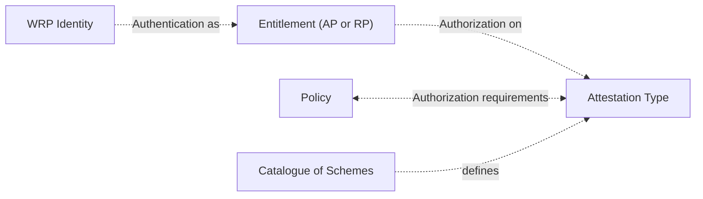
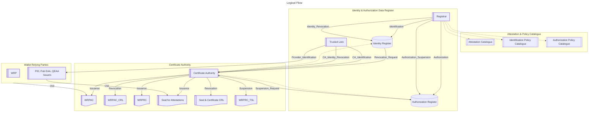
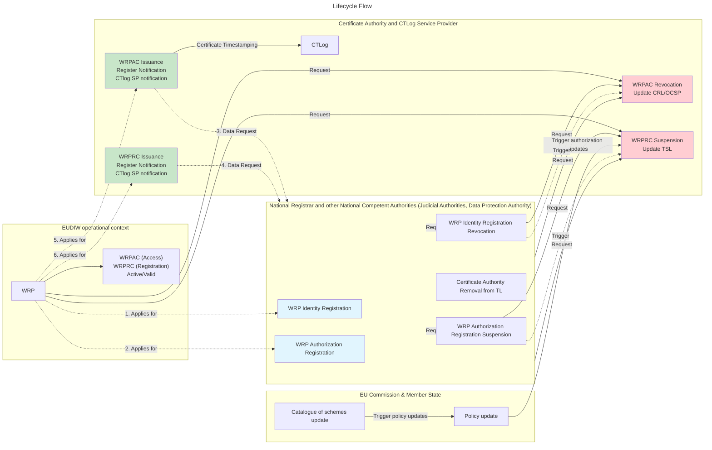

# Trust Management Process

**Table of Contents**

**Normative & technical references**  
CIR  
CIR-1 2025/848 CIR 2025/848 of 6 May 2025 laying down rules for the application of Regulation (EU) No 910/2014 of the European Parliament and of the Council as regards the registration of wallet-relying parties [https://eur-lex.europa.eu/eli/reg_impl/2025/848/oj/eng](https://eur-lex.europa.eu/eli/reg_impl/2025/848/oj/eng)  
CIR-2 2025/848 amendement draft [https://ec.europa.eu/info/law/better-regulation/have-your-say/initiatives/16113-European-Digital-Identity-Wallet-registration-of-wallet-relying-parties-update-_en](https://ec.europa.eu/info/law/better-regulation/have-your-say/initiatives/16113-European-Digital-Identity-Wallet-registration-of-wallet-relying-parties-update-_en)  
CIR-3 CIRn (EU) 2025/1569 of 29 July 2025 laying down rules for the application of Regulation (EU) No 910/2014 of the European Parliament and of the Council as regards qualified electronic attestations of attributes and electronic attestations of attributes provided by or on behalf of a public sector body responsible for an authentic source [https://eur-lex.europa.eu/eli/reg_impl/2025/1569/oj/eng] (https://eur-lex.europa.eu/eli/reg_impl/2025/1569/oj/eng)

ARF  
TS02 : Specification of systems enabling the notification and subsequent publication of Provider information [https://github.com/eu-digital-identity-wallet/eudi-doc-standards-and-technical-specifications/blob/main/docs/technical-specifications/ts2-notification-publication-provider-information.md](https://github.com/eu-digital-identity-wallet/eudi-doc-standards-and-technical-specifications/blob/main/docs/technical-specifications/ts2-notification-publication-provider-information.md)  
TS05 : Specification of common formats and API for Relying Party Registration information (https://github.com/eu-digital-identity-wallet/eudi-doc-standards-and-technical-specifications/blob/main/docs/technical-specifications/ts5-common-formats-and-api-for-rp-registration-information.md)  
TS06 : Common Set of Relying Party Information to be Registered (https://github.com/eu-digital-identity-wallet/eudi-doc-standards-and-technical-specifications/blob/main/docs/technical-specifications/ts6-common-set-of-rp-information-to-be-registered.md)  
TS08 : Specification of Common Interface for reporting of Relying Parties to Data Protection Authorities (https://github.com/eu-digital-identity-wallet/eudi-doc-standards-and-technical-specifications/blob/main/docs/technical-specifications/ts8-common-interface-for-reporting-of-wrp-to-dpa.md)  

ARF topics  
Topic X : Relying Party registration (https://github.com/eu-digital-identity-wallet/eudi-doc-architecture-and-reference-framework/discussions/431 and its refinement https://github.com/eu-digital-identity-wallet/eudi-doc-architecture-and-reference-framework/discussions/645)  

Tech standards  
ETSI-119-411 Policy and security requirements for Trust Service Providers issuing certificates; Part 8: Access Certificate Policy for EUDI Wallet Relying Parties (https://www.etsi.org/deliver/etsi_ts/119400_119499/11941108/01.01.01_60/ts_11941108v010101p.pdf)  
ETSI-119-475 Relying party attributes supporting EUDI Wallet user's authorization decisions (Certificate profile and policy requirements for access and registration certificates) (https://www.etsi.org/deliver/etsi_ts/119400_119499/119475/01.01.01_60/ts_119475v010101p.pdf)  
ALL-TS All technical specs referred by ARF are available at https://eudi.dev/latest/technical-specifications/  

Webuild LSP references:  
WBD-1 Access Certificate Examples:  
https://github.com/webuild-consortium/wp4-trust-group/blob/main/task5-participants-certificates-policies/eaa_provider_access_certificate.md  
https://github.com/webuild-consortium/wp4-trust-group/blob/main/task5-participants-certificates-policies/relying_party_access_certificate.md  
WBD-2 Registration Certificate Examples:  
https://github.com/webuild-consortium/wp4-trust-group/blob/main/task5-participants-certificates-policies/eaa_provider_registration_certificate.md  
https://github.com/webuild-consortium/wp4-trust-group/blob/main/task5-participants-certificates-policies/relying_party_registration_certificate.md  
WBD-3 Onboarding usecase  
https://github.com/webuild-consortium/wp4-trust-group/tree/main/task1-use-cases/subtask1-1-onboarding  

## Scope And Introduction
The aim of this chapter is to describe the lifecycle of: 
1. WRP identity and attestation authorization information managed in the national registers
2. and the related certificates that are used to claim that identity and related authorizations in EUDIW ecosystem: access (Wallet relying Party Access Certificate, aka WRPAC) and registration (Wallet relying Party Registration  Certificate, aka WRPRC) certificates.
> [!NOTE] The integrity and authenticity of these attestations is out of scope, assuming that Q seals and Q signing certificates are consolidated.
Register information lifecycle affects directly lifecycle of WRP certificates and tokens. 

# Trust management overview
Wallet Relying Parties (WRP) Identity shall be managed by national registrars, according to national trust framework policies. WRP shall apply for registration to the registrar.
National Competent Authorities for different sectors shall be able to interact with registrars to provide information from their registries to fulfill the registration process, aside with information provided directly by entities ([Topic-X] and its refinement , national registers under Annex I, point 12 of CIR (EU) 2025/848 [CIR-1, CIR-2]).
WRP authorization shall be managed by registrars too, according to their requests. The authorization is a link between WRP identifier - role assumed in eudiw ecosystem (AP or RP) and the attestation type identifiers. The goal of authorization process is to fulfill policy requirements by WRP related to attestation types.

If an attestation is subject to a policy, the attestation types shall be registered within the catalogue of schemes. This will ensure that only entitled providers will be allowed to issue specific credential in order to preserve level of assurance and data structure of the information according to sectorial competent authorities. And on the other side, only authorized relying parties shall be allowed to request these credentials.

The following graph aims to represent the interactions and dependencies between entities and lifecycle actions. 

All certificate states and revocation mechanisms are in  ETSI 119-411-8, that describes Access Certificate Policy for EUDI Wallet Relying Parties

# Catalogue of schemes and policy management
The credential catalogue and related policies are not in scope of this chapter and are managed centrally by EU Commission. This topic is not defined yet [ref topic X (https://github.com/eu-digital-identity-wallet/eudi-doc-architecture-and-reference-framework/discussions/431)]
ETSI TS 319.482 will define catalogue of schemes implementation.
> Note: So changes in the credential catalogue and in related policy repositories will affect potentially both authorizations and consequently the validity of registration certificates.

# WRP Registration lifecycle 
## Registration (Onboarding wallet relying parties)
Each Member State will delegate a Registrar to manage the national register: it's a repository of identities and authorizations for WRPs that will handle attestations and attributes (in the issuance or presentation request phases).
The process and related attributes that must be collected are described in [CIR-1 CIR-2], and the process will be specific for member state and it's assumed to be equivalent. 
The first step is WRP's identification: the onboarding process must ensure adequate controls on the entity identity claims. A unique identifier is assigned to the entity (WRP identifier) and related attributes, such as credential offer endpoints, privacy policy statement URL, etc.
The second step is WRP's authorization to handle attestations, autonomously or delegating an intermediary: both for the attestation issuance and presentation request, policy requirements related to attestation type must be satisfied. 

The register information data model is described in [TS02] and api for registration and inquiry in the register are defined in [TS05] , data to be registered in [TS06]. 
This process and register maintenance shall be managed by national registrar.
National Registrar may integrate existing identity repository for specific sectors, according to NCA sector policies. 
Registrar may include the engagement of the CA in the registration process, in order to facilitate the onboarding process, according to WRP preferences.

## License update and revocation
Each Member State Registrar, as National Competent Authority, shall manage a process to manage license revocation: 
1. in case of cessation of business that could be notified by the Business Register 
2. in case of suspension by the judicial authority 
3. or by DPA Data Protection Authorities (that will publish specific APIs to collect abuses [TS 08]).

## Further optional and asyncronous information collection
Registrar may collect issued WRPAC and WRPRC references from CAs. This may be done in order to be able to trigger their revocation towards certificate authorities in case of license withdrawal.
Registrar may publish the authorization data bound to WRPidentifier in case WRPRCs are not transmitted to the wallet, in order to fulfill policy requirements.

# Access (WRPAC) and registration (WRPRC) certificate lifecycle
In order to make WRP operational in application protocols, a certificate authority shall provide the authentication keys, and so it shall issue a WRPAC and shall sign WRPRCs (Regulatory requirements are described in Annex E, data model in Annex B of [ETSI-119-475] referred by Commission Implementing Regulation 2024/2982). 
The WRPAC represents the identity key of a WRP. Access Certificates are used to sign the OID4VP request and also for signing the OID4VCI issuer metadata.  
The WRPRC is a JWT used for authorization both in attestation issuance and request steps, whether the attestation is somehow referred by policies. 
WRPRC is optional: 
1. it depends on attestation policy requirements
2. whether required by attestation policy requirements and not sent by WRP during the authentication phase, the same information can also be retrieved from the Registrar's online service. 

## WRPAC and WRPRC Issuance
WRPAC and WRPRC issuance requires a mutual authentication: the certificate authority must identify the applicant entity, and the entity must be able to check if the CA is present with this role in the trusted lists. 
The CA accesses the national register using REST apis and provides the certificates according to certificate profile and policy requirements, described in ETSI 119.475 and referred in Annex V of CIR amendment draft.
As soon a WRPAC and WRPRC have been issued:
1. the CA SHshouldOULD notify the Registrar, providing their references. Registrar should record all issued certificates in order to be able to ask for revocation if required. 
2. the CA shall trace certificate issuance on 2 CTlog service providers (using API provided by ctlog managers) according to Certificate transparency policies. CTlog service will keep all timestamps of certificate issuance to enable third party verification that the certificate has been issued by an authorized Certificate Authority at that time that's declared. 
The WRP has to make available its WRPRC and WRPAC certificates online through its website.
## Revocation
WRPAC and WRPRC revocation could be triggered by  identity and authorization changes or revocation, or by indipendent processes.
1. Issuance or revocation can be triggered by Registrar according to information changed in the register 
2. issuance can be triggered by a WRP request directly to a CA
3. revocation can be requested by WRP or other national or EU authorities to the CA.
As soon as the CA revokes a certificate, shall update and publish the information in a certificate revocation list (CRL) or a Token Supension List (TSL).

# Trusted List Issuer Certificates
All seal and signing certificates for attestation issuer that will be enlisted in Trusted Lists, will be subject of their authorization lifecycle by NCAs and CABs.

# Annex I - Banking usecase
TBD  

