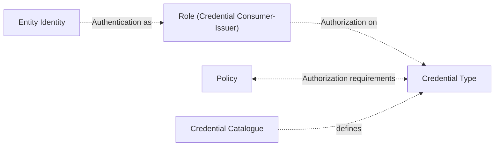

# Trust Management Process

**Table of Contents**

**Normative & technical references**  
CIR  
CIR-1 2025/848 CIR 2025/848 of 6 May 2025 laying down rules for the application of Regulation (EU) No 910/2014 of the European Parliament and of the Council as regards the registration of wallet-relying parties [https://eur-lex.europa.eu/eli/reg_impl/2025/848/oj/eng](https://eur-lex.europa.eu/eli/reg_impl/2025/848/oj/eng)  
CIR-2 2025/848 amendement draft [https://ec.europa.eu/info/law/better-regulation/have-your-say/initiatives/16113-European-Digital-Identity-Wallet-registration-of-wallet-relying-parties-update-_en](https://ec.europa.eu/info/law/better-regulation/have-your-say/initiatives/16113-European-Digital-Identity-Wallet-registration-of-wallet-relying-parties-update-_en)  
CIR-3 CIRn (EU) 2025/1569 of 29 July 2025 laying down rules for the application of Regulation (EU) No 910/2014 of the European Parliament and of the Council as regards qualified electronic attestations of attributes and electronic attestations of attributes provided by or on behalf of a public sector body responsible for an authentic source [https://eur-lex.europa.eu/eli/reg_impl/2025/1569/oj/eng] (https://eur-lex.europa.eu/eli/reg_impl/2025/1569/oj/eng)

ARF  
TS02 : Specification of systems enabling the notification and subsequent publication of Provider information [https://github.com/eu-digital-identity-wallet/eudi-doc-standards-and-technical-specifications/blob/main/docs/technical-specifications/ts2-notification-publication-provider-information.md](https://github.com/eu-digital-identity-wallet/eudi-doc-standards-and-technical-specifications/blob/main/docs/technical-specifications/ts2-notification-publication-provider-information.md)  
TS05 : Specification of common formats and API for Relying Party Registration information (https://github.com/eu-digital-identity-wallet/eudi-doc-standards-and-technical-specifications/blob/main/docs/technical-specifications/ts5-common-formats-and-api-for-rp-registration-information.md)  
TS06 : Common Set of Relying Party Information to be Registered (https://github.com/eu-digital-identity-wallet/eudi-doc-standards-and-technical-specifications/blob/main/docs/technical-specifications/ts6-common-set-of-rp-information-to-be-registered.md)  
TS08 : Specification of Common Interface for reporting of Relying Parties to Data Protection Authorities (https://github.com/eu-digital-identity-wallet/eudi-doc-standards-and-technical-specifications/blob/main/docs/technical-specifications/ts8-common-interface-for-reporting-of-wrp-to-dpa.md)  

ARF topics  
Topic X : Relying Party registration (https://github.com/eu-digital-identity-wallet/eudi-doc-architecture-and-reference-framework/discussions/431 and its refinement https://github.com/eu-digital-identity-wallet/eudi-doc-architecture-and-reference-framework/discussions/645)  

Tech standards  
ETSI-119-411 Policy and security requirements for Trust Service Providers issuing certificates; Part 8: Access Certificate Policy for EUDI Wallet Relying Parties (https://www.etsi.org/deliver/etsi_ts/119400_119499/11941108/01.01.01_60/ts_11941108v010101p.pdf)  
ETSI-119-475 Relying party attributes supporting EUDI Wallet user's authorization decisions (Certificate profile and policy requirements for access and registration certificates) (https://www.etsi.org/deliver/etsi_ts/119400_119499/119475/01.01.01_60/ts_119475v010101p.pdf)  
ALL-TS All technical specs referred by ARF are available at https://eudi.dev/latest/technical-specifications/  

Webuild LSP references:  
WBD-1 Access Certificate Examples:  
https://github.com/webuild-consortium/wp4-trust-group/blob/main/task5-participants-certificates-policies/eaa_provider_access_certificate.md  
https://github.com/webuild-consortium/wp4-trust-group/blob/main/task5-participants-certificates-policies/relying_party_access_certificate.md  
WBD-2 Registration Certificate Examples:  
https://github.com/webuild-consortium/wp4-trust-group/blob/main/task5-participants-certificates-policies/eaa_provider_registration_certificate.md  
https://github.com/webuild-consortium/wp4-trust-group/blob/main/task5-participants-certificates-policies/relying_party_registration_certificate.md  
WBD-3 Onboarding usecase  
https://github.com/webuild-consortium/wp4-trust-group/tree/main/task1-use-cases/subtask1-1-onboarding  

## Scope And Introduction
The aim of this chapter is to describe the lifecycle of: 
1. entity identity and credential authorization information managed in the national registers
2. and the related certificates that are used to claim that identity and related authorizations in EUDIW ecosystem: access (Wallet relying Party Access Certificate, aka WRPAC) and registration (Wallet relying Party Registration  Certificate, aka WRPRC) certificates.
The integrity and authenticity of these credentials is out of scope, assuming that Q seals and Q signing certificates are consolidated.
Identity and autorization in the register are the information references, and we refer to this as "license" to operate in the eudiw ecosystem. They are managed by registrars and have their specific lifecycle.
This information is transported and consumed by communication and application processes using X509 certificates, that are issued and managed by Certificate Authorities according to trusted list policies. These certificates have their own lifecycle and obviously there are some touchpoints between license and certificate lifecycles.

It could be useful to identify best practices and success stories from the market that could provide an "inspirational starting point", in order to define a sustainable and effective design. Banking sector is probably by nature a good example to be taken into consideration, and so there is a specific annex that aims to describe the state of the art relating the authentication mechanisms in place at the present, and is described in Annex I. 

# Trust management overview
Wallet Relying Parties (WRP) Identity is managed by national registrars, according to national trust framework policies. WRP applies for registration to the registrar.
National Competent Authorities for different sectors will be able to interact with registrars to provide information from their registries to fulfill the registration process, aside with information provided directly by entities ([Topic-X] and its refinement , national registers under Annex I, point 12 of CIR (EU) 2025/848 [CIR-1, CIR-2]).
The entity authorization has to be managed by registrars too, according to entity requests. The authorization is a link between entity identifier - role assumed in eudiw ecosystem (credential issuer or consumer) and the credential type identifiers. The goal is to fulfill policy requirements related to credential types.



If a credential is subject to a policy, the credential types should be registered within the credential catalogue: a set of data schema definitions that is managed centrally for all MSs by EU commission (ref CIR-3 2025/1569). This will ensure that only entitled entities will be allowed to issue specific credential in order to preserve level of assurance of information according to sectorial competent authorities. And on the other side only authorized entities (mainly for privacy preserving reasons) could be allowed to request these credentials.

Specific requirements for authorization management will be expressed through policies, rules to be fulfilled for issuing and asking for specific credential types. 
> Note: it's not clear how to manage cohexistence of policies of national trust frameworks based on one single european credential catalogue. Different sectors have different stages of "europeanization maturity", so probably there will be cases where a policy could be valid at european level, others where policies will be expressed at national level.

```mermaid graph
title "Logical Flow"
flowchart TD
subgraph Cred_Def["Credential & Policy Catalogue"]
        Cred[["Credential Catalogue"]]
        IDPol[["Identification Policy Catalogue"]]
        CredPol[["Authorization Policy Catalogue"]]
end
subgraph Register["Identity & Authorization Data Register"]
        IDReg@{shape: cyl, label: "Identity Register" }
        AuthReg@{shape: cyl, label: "Authorization Register"}
        Registrar@{shape: lin-rect, label: "Registrar" }
end
subgraph C_A["Certificate Authority"]
        WRPAC@{ shape: lin-doc, label: "WRPAC" }
        WRPRC@{ shape: lin-doc, label: "WRPRC" }
        CA@{shape: lin-rect, label: "Certificate AUthority" }
end

    Registrar-->|Identification|IDReg
    Registrar-.->IDPol

    Registrar-.->Cred
    Registrar-.->CredPol
    Registrar-->|Authorization|AuthReg

    CA-.->IDReg
    CA-->|Issuance|WRPAC
    CA-.->AuthReg
    CA-->|Issuance|WRPRC

```

```mermaid graph
title "Lifecycle Flow"
flowchart LR
subgraph EU["EU Commission and Member States"]
        Pol["Policy definition and updates"]
        Cat["Credential Catalogue definition and updates"]
end
 
subgraph National_Register["National Registrar and other National Competent Authorities"]
        LR["License Registration<br/>Entity ID + Authorizations<br/>(Onboarding/Update)"]
        LRev["License Revocation<br/>Update/Suspend"]
        Pol["Policy definition and updates"]
         subgraph Note[Judicial Authorities, Data Protection Authority, National Competent Authorities could require license update or revocation]
        end
    end
 
    subgraph CA["Certificate Authority and CTLog Service Provider"]
        CI["Issue WRPAC/WRPRC<br/>Notifies Register <br/>Notifies CTlog SP"]
        CRev["Revoke Certs<br/>Update CRL/OCSP"]
    end

    subgraph EDW["EUDIW operational context"]
        Entity["Entity WRP"]
        CI --> Certs["WRPAC (Access)<br/>WRPRC (Registration)<br/>Active/Valid"]

    end

    Entity -.->|Applies/Requests| LR
    Entity -.->|Uses| Certs

    CI -.->|Request Certs:<br/>ID/Authz Data| LR
    Entity -.->|Request| CI
    
    Entity -->|Request| CRev
    Pol -->|Trigger authorization updates| LRev
    Cat -->|Trigger authorization updates| LRev
    Cat -->|Trigger policy updates| Pol
    LRev -.->|Trigger| CRev
    LR -.->|Optional: Collect<br/>Cert Refs| LR
 
    style LR fill:#e1f5fe
    style CI fill:#c8e6c9
    style Certs fill:#fff3e0
    style CRev fill:#ffcdd2
    style Note fill:yellow,stroke:#fbc02d,stroke-dasharray: 5 5
```

All certificate states and revocation mechanisms are in  ETSI 119-411-8, that describes Access Certificate Policy for EUDI Wallet Relying Parties

# Credential catalogue and EAA policy management
The credential catalogue and related policies are not in scope of this chapter and are managed centrally by EU Commission. This topic is not defined yet [ref topic X (https://github.com/eu-digital-identity-wallet/eudi-doc-architecture-and-reference-framework/discussions/431)]
Credential types and their policy are linked to the entity identity as registration profile, aka authorization.
> Note: So changes in the credential catalogue and in related policy repositories will affect potentially both authorizations and consequently the validity of registration certificates.

The EUDI credential catalogue (catalogue of attributes and schemes for attestations) is defined for management by the CIR(EU) 2025/1569 [CIR-3]. Articles 7 and 8 of this regulation specify the scope and responsibilities for the catalogues, distinguishing the catalogue of attributes (limited to public sector authentic sources) from the broader catalogue of attestation schemes. It mandates the Commission to host, make publicly available, and ensure machine-readable access to these catalogues, including high-availability mechanisms (ARF CAT_06 requirement).
# Entity license management
## Registration (Onboarding wallet relying parties)
Each Member State will delegate a Registrar to manage the national register: it's a repository of identities and authorizations for entities that will handle attestations and attributes (in the issuance or presentation request phases).
The process and related attributes that must be collected are described in [CIR-1 CIR-2], and the process will be specific for member state and it's assumed to be equivalent. This enrollment represents a "license" to operate in the EUDIW ecosystem.
The first step is entity identification: the onboarding process must ensure adequate controls on the entity identity claims, using EUDI busines wallet or other authentication mechanisms. A unique identifier is assigned to the entity (WRP identifier) and operational attributes must be linked to that and that will be referred by WRPAC: credential offer endpoints, privacy policy statement URL.
The second step is entity authorization to handle credentials, autonomously or delegating an intermediary: both for the credential issuance and request operations, in case of explicit policy requirements enlisted in the EU credential catalogue, an explicit authorization must be provided on specific referred attributes or attestation types.
In this phase, entity must notify the registrar if it's intermediated by a technical provider, that will be verified against trusted lists and national registers.

The register information data model is described in [TS02] and api for registration and inquiry in the register are defined in [TS05] , data to be registered in [TS06]. 
This process and register maintenance will be managed by national registrar.
National Registrar could integrate existing identity repository for specific sectors, according to NCA sector policies. 
Registrar could include the engagement of the CA in the registration process, in order to facilitate the onboarding process, according to entity preferences.

## License update and revocation
Each Member State Registrar, as National Competent Authority, will manage a process to manage license revocation: 
1. this could be the case of cessation of business that could be notified by the Business Register 
2. the judicial authority could suspend the license in case of suspicion of abuse
3. DPA Data Protection Authorities (that will publish specific APIs to collect abuses [TS 08]) will request suspension to Registrar

## Further optional and asyncronous information collection
Registrar collects issued WRPAC and WRPRC references from CAs. This must be done in order to be able to trigger their revocation towards certificate authorities in case of license withdrawal.
Registrar could publish the authorization data bound to WRPidentifier in case WRPRCs are not transmitted to the wallet, in order to fulfill policy requirements.

# Access (WRPAC) and registration (WRPRC) certificate lifecycle
In order to make the entity and its license effectively operational in OID4VP and OID4VCI protocols, a certificate authority has to provide the authentication keys, and so it issues a WRPAC and WRPRC (Regulatory requirements are described in Annex E , data model in Annex B of [ETSI-119-475]). 
The WRPAC represents the identity key of an entity. Access Certificates are used to sign the OID4VP request and also for signing the OID4VCI issuer metadata. 
The WRPRC is used for authorization both in credential issuance and request steps, whether the credential is somehow referred by policies. WRPRC is optional: it depends on credential policy requirements.
Certificate description and examples can be found in [ETSI-119-475] and webuild references [webuild]. 
## WRPAC and WRPRC Issuance
WRPAC and WRPRC issuance requires a mutual authentication: the certificate authority must identify the applicant entity, and the entity must be able to check if the CA is present with this role in the trusted lists. Entity identification could be done using business wallet or other means.
The CA accesses the national register using management apis and provides the certificates according to certificate profile and policy requirements, described in ETSI 119.475 and referred in Annex V of CIR amendment draft.
As soon a WRPAC or WRPRC has been issued:
1. the CA has to notify the Registrar, providing their references. Registrar should record all issued certificates in order to be able to ask for revocation if required. Revocation process cases and status management is described in [ETSI 119-475]
2. the CA should trace certificate issuance on 2 CTlog service providers (using API provided by ctlog managers) according to Certificate transparency policies. CTlog service will keep all timestamps of certificate issuance to enable third party verification that the certificate has been issued by an authorized Certificate Authority at that time that's declared. 
The WRP has to make available its WRPRC and WRPAC certificates online through its website.
## Revocation
Certificate lifecycle can be bound to license lifecycle or be indipendent.
1. Issuance or revocation can be triggered by Registrar according to information changed in the register 
2. issuance can be triggered by an entity WRP request directly to a CA
3. revocation can be requested by WRP, Judicial or other authorities
As soon as the CA revokes a certificate, updates and publishes a certificate revocation list CRL.

## WRPAC and WRPRC examples and profiles
Refer to ref to https://github.com/webuild-consortium/wp4-trust-group/tree/main/task5-participants-certificates-policies

# Annex I - Banking usecase
TBD  

gestione segnalazioni e frodi (ts08)
qwac, registro dati e licenze su eu
nca possono manifestare interesse per ricevere certificati emessi da CAs
[allowed the entrance in this market of different actors able to integrate and extend the service offered by traditional banks. The use of authentication certificates could be taken as source of inspiration for defining a large scale application like the eudiw ecosystem]
